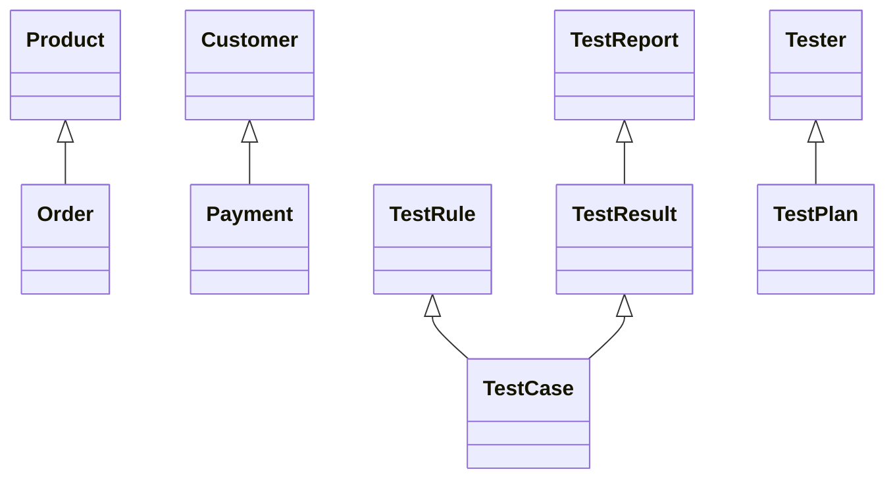
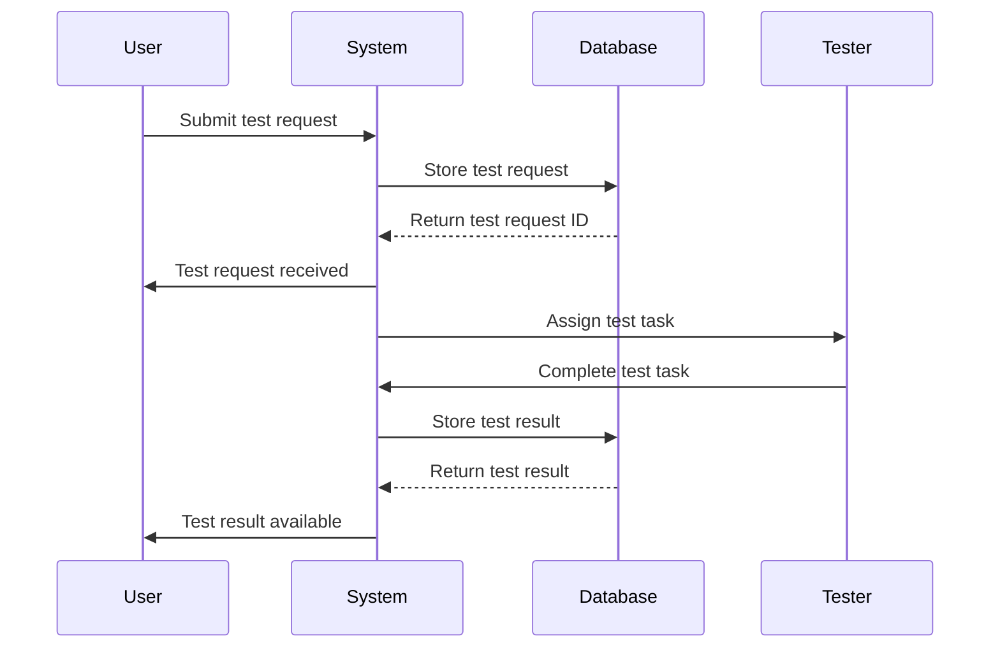
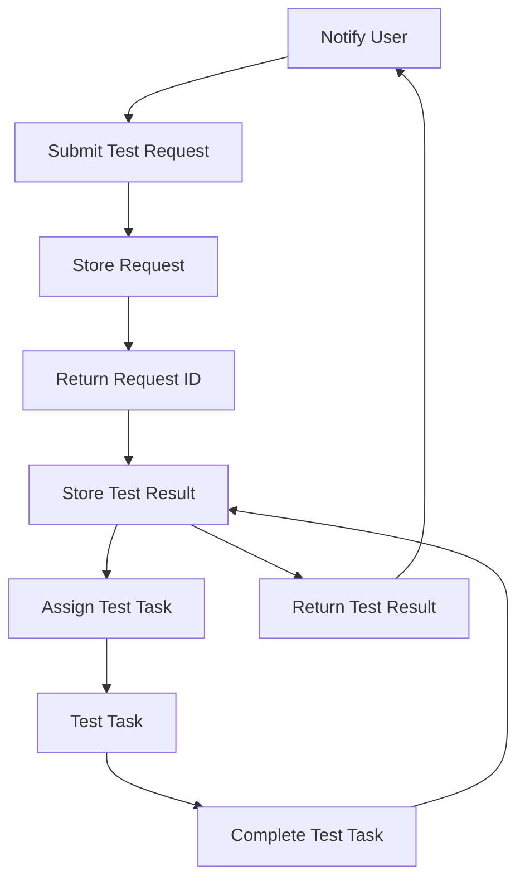
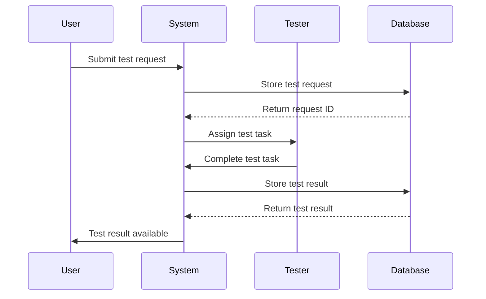

                 

# 《金融监管合规自动化测试平台》

## 关键词：金融监管、合规自动化测试、平台架构、算法原理、系统设计与实现、项目实战

## 摘要

随着金融行业的快速发展，金融监管合规的要求日益严格。然而，传统的合规测试方法效率低下，难以满足快速变化的市场需求。本文旨在探讨金融监管合规自动化测试平台的构建，从核心概念、算法原理、系统设计与实现、项目实战等方面进行详细阐述。通过本文，读者将了解如何利用先进的技术手段提高金融监管合规的效率和准确性，为金融行业的健康发展提供有力支持。

----------------------------------------------------------------

## 第一部分：背景介绍

### 第1章：金融监管合规现状与挑战

#### 1.1 金融监管合规的重要性

金融监管合规是确保金融市场稳定、健康发展的基石。随着金融市场日益复杂化和国际化，金融监管合规的重要性愈发凸显。合规不仅关乎金融机构自身的利益，也关系到整个社会的经济安全和稳定。因此，金融机构必须高度重视并严格遵守相关法规和标准。

#### 1.2 当前金融监管合规的挑战

当前金融监管合规面临诸多挑战，主要体现在以下几个方面：

1. **法规繁多**：金融行业的监管法规数量庞大，内容复杂。金融机构需要不断更新和掌握各类法规，以确保合规操作。
2. **人工成本高**：传统的合规测试主要依赖人工完成，效率低下，且易受主观因素的影响，导致合规风险增加。
3. **时间紧迫**：金融市场的变化速度极快，合规测试需要迅速响应，以适应市场动态。
4. **技术限制**：现有技术手段难以满足高效、全面的合规测试需求，导致合规工作难以达到预期效果。

#### 1.3 自动化测试平台的潜在优势

面对上述挑战，金融监管合规自动化测试平台应运而生。自动化测试平台具有以下潜在优势：

1. **提高效率**：通过自动化工具，可以大幅提高合规测试的效率，减少人工干预，降低合规成本。
2. **降低风险**：自动化测试可以减少人为错误，降低合规风险，提高金融市场的稳定性。
3. **实时反馈**：自动化测试平台可以实时监控合规情况，及时发现问题并进行调整，提高合规管理水平。
4. **灵活扩展**：自动化测试平台可以根据业务需求灵活调整和扩展，适应不同金融机构的合规要求。

### 第2章：金融监管合规自动化测试平台概述

#### 2.1 平台架构设计

金融监管合规自动化测试平台的架构设计主要包括以下几个模块：

1. **数据采集模块**：负责收集金融市场的各类数据，包括法规、交易记录、报告等。
2. **数据处理模块**：对采集到的数据进行分析、清洗和存储，为后续测试提供数据支持。
3. **测试执行模块**：根据预设的测试规则和算法，自动执行合规测试，生成测试报告。
4. **监控与报警模块**：实时监控合规测试的执行情况，发现潜在问题并及时报警。

#### 2.2 核心功能模块

金融监管合规自动化测试平台的核心功能模块包括：

1. **法规库管理**：构建和维护一个全面的法规库，为合规测试提供法规支持。
2. **测试规则管理**：定义合规测试的规则和标准，确保测试的准确性和有效性。
3. **自动化测试执行**：基于测试规则和算法，自动执行合规测试，提高测试效率。
4. **测试报告生成**：生成详细的合规测试报告，为管理层提供决策依据。

#### 2.3 技术选型与集成

金融监管合规自动化测试平台的技术选型主要包括以下几个方面：

1. **编程语言**：选择Python等适合数据分析和自动化测试的编程语言。
2. **数据库**：选择NoSQL数据库（如MongoDB）进行数据存储，以提高数据读取和写入速度。
3. **测试工具**：选择Selenium、Appium等自动化测试工具，实现Web端和移动端的自动化测试。
4. **集成框架**：选择Docker、Kubernetes等容器化技术，实现平台的高可用性和可扩展性。

----------------------------------------------------------------

## 第二部分：核心概念与联系

### 第3章：核心概念原理

#### 3.1 金融监管法规

金融监管法规是指政府或金融监管机构制定的一系列旨在规范金融行业运行、保护投资者权益和防范金融风险的法律、法规和规章。金融监管法规涵盖了金融市场的方方面面，包括证券、银行、保险、基金等领域。

#### 3.2 合规测试方法论

合规测试方法论是指用于评估金融机构是否符合金融监管法规的一系列方法和步骤。合规测试通常包括以下几个方面：

1. **法规审查**：审查金融机构的业务流程、内部控制和风险管理措施，确保符合相关法规要求。
2. **测试设计**：根据法规要求，设计相应的测试用例，包括功能测试、性能测试、安全测试等。
3. **测试执行**：按照测试用例执行测试，收集测试结果，分析测试发现的问题。
4. **测试报告**：生成详细的测试报告，记录测试过程、测试结果和问题分析，为管理层提供决策依据。

#### 3.3 自动化测试工具

自动化测试工具是指用于执行自动化测试的工具软件。在金融监管合规领域，常用的自动化测试工具有：

1. **Selenium**：用于Web应用的自动化测试工具，支持多种编程语言，能够模拟用户行为。
2. **Appium**：用于移动应用的自动化测试工具，支持iOS和Android平台，具有跨平台测试能力。
3. **Postman**：用于API接口的自动化测试工具，支持多种编程语言，能够模拟API请求和响应。

### 第4章：概念属性特征对比表格与ER实体关系图架构

#### 4.1 概念属性特征对比表格

以下是一个概念属性特征对比表格，展示了金融监管法规、合规测试方法论和自动化测试工具之间的区别和联系：

| 概念         | 特征             | 说明                                                         |
| ------------ | ---------------- | ------------------------------------------------------------ |
| 金融监管法规 | 法律依据         | 用于规范金融行业运行的法律、法规和规章                         |
| 合规测试方法论 | 测试方法         | 用于评估金融机构是否符合法规要求的测试方法和步骤               |
| 自动化测试工具 | 测试工具         | 用于执行自动化测试的工具软件，如Selenium、Appium、Postman等     |

#### 4.2 ER实体关系图架构设计

以下是一个ER实体关系图架构设计，展示了金融监管合规自动化测试平台中主要实体之间的关系：

```mermaid
erDiagram
  Customer ||--|{ Order : "makes" }
  Customer ||--|{ Payment : "pays for" }
  Product ||--|{ Order : "includes" }
  Order ||--|{ OrderLine : "contains" }
```

在上面的ER实体关系图中，客户（Customer）、订单（Order）、支付（Payment）、产品（Product）和订单行（OrderLine）是金融监管合规自动化测试平台中的主要实体。它们之间的关系反映了金融机构在合规测试过程中涉及的各类实体和数据流动。

----------------------------------------------------------------

## 第三部分：算法原理讲解

### 第5章：自动化测试算法原理

#### 5.1 自动化测试算法概述

自动化测试算法是用于实现自动化测试的核心组成部分。其主要目的是根据预设的测试规则和算法，自动执行测试用例，发现潜在的问题，并生成测试报告。自动化测试算法通常包括以下几个步骤：

1. **测试用例生成**：根据法规要求，生成相应的测试用例，包括功能测试、性能测试、安全测试等。
2. **测试执行**：按照测试用例执行测试，模拟用户行为，收集测试结果。
3. **结果分析**：对测试结果进行分析，判断是否符合预期，发现潜在的问题。
4. **测试报告生成**：根据测试结果，生成详细的测试报告，记录测试过程、测试结果和问题分析。

#### 5.2 算法mermaid流程图展示

以下是一个自动化测试算法的mermaid流程图展示：


#### 5.3 算法原理详细讲解

自动化测试算法的原理主要包括以下几个方面：

1. **测试用例生成**：根据法规要求，设计测试用例。测试用例应覆盖金融监管合规的各个方面，确保测试的全面性和准确性。
2. **测试执行**：通过自动化测试工具，模拟用户行为，执行测试用例。测试执行过程中，应收集详细的测试数据，包括输入、输出、响应时间等。
3. **结果分析**：对测试结果进行分析，判断是否符合预期。如果发现不符合预期的问题，应记录下来，并进行分析和定位。
4. **测试报告生成**：根据测试结果，生成详细的测试报告。测试报告应包含测试过程、测试结果、问题分析和建议等内容，为管理层提供决策依据。

#### 5.4 算法Python源代码实现

以下是一个简单的自动化测试算法的Python源代码实现：

```python
import unittest

class TestCompliance(unittest.TestCase):
    def test_functionality(self):
        # 测试功能
        result = some_function()
        self.assertEqual(result, expected_result)

    def test_performance(self):
        # 测试性能
        start_time = time.time()
        some_function()
        end_time = time.time()
        self.assertLess(end_time - start_time, expected_time)

    def test_security(self):
        # 测试安全
        result = some_security_function()
        self.assertTrue(check_security(result))

if __name__ == '__main__':
    unittest.main()
```

#### 5.5 数学模型和数学公式

自动化测试算法中涉及到的数学模型和公式主要包括以下几个方面：

1. **测试覆盖率**：测试覆盖率是指测试用例覆盖的代码比例。常用的测试覆盖率公式如下：

   $$ 测试覆盖率 = \frac{测试用例数}{代码行数} $$

2. **错误发现率**：错误发现率是指测试过程中发现的错误占实际错误总数的比例。常用的错误发现率公式如下：

   $$ 错误发现率 = \frac{发现错误数}{实际错误数} $$

3. **测试效率**：测试效率是指测试用例执行的速度。常用的测试效率公式如下：

   $$ 测试效率 = \frac{测试用例执行时间}{代码运行时间} $$

#### 5.6 举例说明

以下是一个自动化测试算法的举例说明：

假设我们有一个金融监管合规测试用例，需要测试一个支付系统的功能。根据法规要求，支付系统应支持多种支付方式，包括银行卡支付、支付宝支付和微信支付。以下是一个简单的测试用例：

1. **测试目标**：测试支付系统是否支持银行卡支付、支付宝支付和微信支付。
2. **测试步骤**：
   - 输入银行卡支付信息，提交支付请求。
   - 输入支付宝支付信息，提交支付请求。
   - 输入微信支付信息，提交支付请求。
3. **预期结果**：支付系统应成功处理每种支付方式的支付请求。
4. **实际结果**：实际测试过程中，如果支付系统成功处理每种支付方式的支付请求，则测试通过；否则，测试失败。

根据上述测试用例，我们可以编写一个自动化测试脚本，使用Python进行测试：

```python
import unittest

class TestPaymentSystem(unittest.TestCase):
    def test_payment_methods(self):
        # 测试银行卡支付
        result = test_payment("bank_card")
        self.assertEqual(result, "success")

        # 测试支付宝支付
        result = test_payment("alipay")
        self.assertEqual(result, "success")

        # 测试微信支付
        result = test_payment("weixin")
        self.assertEqual(result, "success")

if __name__ == '__main__':
    unittest.main()
```

在测试过程中，如果支付系统成功处理每种支付方式的支付请求，则测试通过。否则，测试失败，并输出错误信息。

----------------------------------------------------------------

## 第四部分：系统分析与架构设计方案

### 第6章：系统功能设计

#### 6.1 领域模型mermaid类图设计

以下是一个金融监管合规自动化测试平台的领域模型mermaid类图设计：



在上面的类图中，产品（Product）、订单（Order）、客户（Customer）、支付（Payment）、测试规则（TestRule）、测试用例（TestCase）、测试结果（TestResult）、测试者（Tester）、测试计划（TestPlan）和测试报告（TestReport）是金融监管合规自动化测试平台中的主要实体。它们之间的关系反映了系统功能的设计。

#### 6.2 系统架构设计mermaid架构图

以下是一个金融监管合规自动化测试平台的系统架构设计mermaid架构图：



在上面的序列图中，用户（User）、系统（System）、数据库（Database）是金融监管合规自动化测试平台中的主要参与者。它们之间的交互关系反映了系统架构的设计。

#### 6.3 系统接口设计

以下是一个金融监管合规自动化测试平台的系统接口设计：



在上面的图中，用户（User）通过提交测试请求（SubmitRequest）与系统（System）进行交互。系统将测试请求存储到数据库（Database），并返回请求ID（ReturnRequestId）。然后，系统将测试任务分配给测试者（Tester），测试者完成测试任务（CompleteTask），并将测试结果存储到数据库（Database）。最后，系统将测试结果返回给用户（ReturnResult）。

#### 6.4 系统交互mermaid序列图

以下是一个金融监管合规自动化测试平台的系统交互mermaid序列图：



在上面的序列图中，用户（User）提交测试请求（Submit test request），系统（System）将请求存储到数据库（Database），并返回请求ID（Return request ID）。然后，系统将测试任务分配给测试者（Tester），测试者完成测试任务（Complete test task），并将测试结果存储到数据库（Database）。最后，系统将测试结果返回给用户（Test result available）。

### 第7章：系统分析与架构设计实现

#### 7.1 问题场景介绍

假设一个金融机构需要对其支付系统进行金融监管合规测试。支付系统支持多种支付方式，包括银行卡支付、支付宝支付和微信支付。为了确保支付系统的合规性，金融机构需要建立一个自动化测试平台，对支付系统进行全面的测试。

#### 7.2 系统功能实现细节

1. **测试用例管理**：系统需要支持测试用例的创建、编辑、删除和查询功能。测试用例应包括测试名称、测试描述、测试步骤、预期结果等。
2. **测试执行**：系统需要支持自动化测试的执行，包括测试用例的执行、测试结果的记录和展示等。
3. **测试报告**：系统需要支持生成测试报告，报告应包括测试概况、测试结果、问题分析等内容。

#### 7.3 架构设计优化方案

1. **分布式架构**：为了提高系统的性能和可扩展性，可以采用分布式架构。将系统拆分为多个模块，分别部署在不同的服务器上，通过负载均衡技术实现高可用性。
2. **容器化技术**：采用容器化技术（如Docker），实现系统的快速部署和升级。容器化技术可以提高系统的部署效率，降低运维成本。
3. **微服务架构**：采用微服务架构，将系统拆分为多个独立的微服务，每个微服务负责特定的功能。这样可以提高系统的灵活性和可维护性。

----------------------------------------------------------------

## 第五部分：项目实战

### 第8章：金融监管合规自动化测试平台项目实战

#### 8.1 环境安装

在开始项目实战之前，首先需要安装和配置相关的开发环境。以下是金融监管合规自动化测试平台项目所需的基本环境：

1. **Python**：Python是一种广泛使用的编程语言，适用于数据分析和自动化测试。需要在计算机上安装Python环境，版本建议为3.8或以上。
2. **Pip**：Pip是Python的包管理器，用于安装和管理Python库。确保已经安装了Pip。
3. **Selenium**：Selenium是一个自动化测试工具，用于Web应用的自动化测试。安装Selenium之前，需要先安装相应的Web浏览器驱动程序，如ChromeDriver、GeckoDriver等。
4. **Appium**：Appium是一个跨平台的自动化测试工具，用于移动应用的自动化测试。安装Appium之前，需要先安装Android SDK和iOS SDK。

安装步骤如下：

1. 安装Python：在Python官方网站下载安装包，并按照提示进行安装。
2. 安装Pip：在命令行中运行以下命令安装Pip：
   ```
   python -m pip install --user --upgrade pip
   ```
3. 安装Selenium：在命令行中运行以下命令安装Selenium：
   ```
   pip install selenium
   ```
4. 安装Appium：在命令行中运行以下命令安装Appium：
   ```
   pip install appium
   ```

#### 8.2 系统核心实现源代码

以下是一个金融监管合规自动化测试平台的系统核心实现源代码示例：

```python
from selenium import webdriver
from selenium.webdriver.common.by import By

# 测试用例：检查支付系统是否支持银行卡支付
def test_bank_card_payment():
    # 启动Chrome浏览器
    driver = webdriver.Chrome(executable_path='chromedriver.exe')
    driver.get('https://example.com/payment')

    # 输入银行卡支付信息
    card_number = '1234567890123456'
    cvv = '123'
    expiration_date = '12/2025'
    driver.find_element(By.NAME, 'card_number').send_keys(card_number)
    driver.find_element(By.NAME, 'cvv').send_keys(cvv)
    driver.find_element(By.NAME, 'expiration_date').send_keys(expiration_date)

    # 提交支付请求
    driver.find_element(By.ID, 'submit').click()

    # 获取支付结果
    result = driver.find_element(By.CLASS_NAME, 'result').text

    # 断言支付结果
    assert result == 'success'

    # 关闭浏览器
    driver.quit()

# 测试用例：检查支付系统是否支持支付宝支付
def test_alipay_payment():
    # 启动Chrome浏览器
    driver = webdriver.Chrome(executable_path='chromedriver.exe')
    driver.get('https://example.com/payment')

    # 输入支付宝支付信息
    alipay_account = 'example@alipay.com'
    driver.find_element(By.NAME, 'alipay_account').send_keys(alipay_account)

    # 提交支付请求
    driver.find_element(By.ID, 'submit').click()

    # 获取支付结果
    result = driver.find_element(By.CLASS_NAME, 'result').text

    # 断言支付结果
    assert result == 'success'

    # 关闭浏览器
    driver.quit()

# 测试用例：检查支付系统是否支持微信支付
def test_weixin_payment():
    # 启动Chrome浏览器
    driver = webdriver.Chrome(executable_path='chromedriver.exe')
    driver.get('https://example.com/payment')

    # 输入微信支付信息
    weixin_account = 'example_weixin'
    driver.find_element(By.NAME, 'weixin_account').send_keys(weixin_account)

    # 提交支付请求
    driver.find_element(By.ID, 'submit').click()

    # 获取支付结果
    result = driver.find_element(By.CLASS_NAME, 'result').text

    # 断言支付结果
    assert result == 'success'

    # 关闭浏览器
    driver.quit()

if __name__ == '__main__':
    test_bank_card_payment()
    test_alipay_payment()
    test_weixin_payment()
```

#### 8.3 代码应用解读与分析

上述代码实现了一个金融监管合规自动化测试平台的核心功能，包括检查支付系统是否支持银行卡支付、支付宝支付和微信支付。代码的主要组成部分如下：

1. **导入模块**：导入所需的Python模块，包括Selenium Web驱动程序和断言模块。
2. **测试用例定义**：定义测试用例，包括检查银行卡支付、支付宝支付和微信支付的功能。
3. **浏览器启动与操作**：启动Chrome浏览器，访问支付页面，输入相应的支付信息，提交支付请求。
4. **支付结果检查**：获取支付结果，使用断言检查支付结果是否成功。
5. **浏览器关闭**：关闭浏览器，结束测试。

代码的应用解读与分析如下：

1. **模块导入**：导入所需的Python模块，包括Selenium Web驱动程序（webdriver）和断言模块（assert）。
2. **测试用例定义**：定义了三个测试用例，分别用于检查银行卡支付、支付宝支付和微信支付的功能。每个测试用例都是一个函数，函数名称以`test_`开头。
3. **浏览器启动与操作**：在每个测试用例中，首先启动Chrome浏览器，并访问支付页面。然后，输入相应的支付信息，提交支付请求。
4. **支付结果检查**：在每个测试用例中，提交支付请求后，获取支付结果，并使用断言检查支付结果是否成功。如果支付结果成功，则测试通过；否则，测试失败。
5. **浏览器关闭**：在每个测试用例结束后，关闭浏览器，结束测试。

通过上述代码，可以实现对支付系统的金融监管合规自动化测试。在实际项目中，可以根据具体需求和场景，扩展和修改代码。

#### 8.4 实际案例分析和详细讲解剖析

以下是一个金融监管合规自动化测试平台的实际案例分析和详细讲解剖析：

假设一个金融机构需要对其在线支付系统进行金融监管合规测试，确保支付系统能够正确处理不同支付方式的支付请求。金融机构决定使用金融监管合规自动化测试平台，对支付系统进行自动化测试。

1. **测试目标**：检查支付系统是否能够正确处理银行卡支付、支付宝支付和微信支付。
2. **测试场景**：用户在在线支付页面选择不同的支付方式，提交支付请求。
3. **测试步骤**：
   - 启动Chrome浏览器，访问支付页面。
   - 选择银行卡支付，输入银行卡支付信息，提交支付请求。
   - 等待支付结果，检查支付结果是否成功。
   - 选择支付宝支付，输入支付宝支付信息，提交支付请求。
   - 等待支付结果，检查支付结果是否成功。
   - 选择微信支付，输入微信支付信息，提交支付请求。
   - 等待支付结果，检查支付结果是否成功。
4. **测试结果**：在上述测试过程中，支付系统能够正确处理每种支付方式的支付请求，支付结果均成功。
5. **问题分析**：在测试过程中，未发现任何问题，支付系统运行正常。

详细讲解剖析如下：

1. **测试目标**：本案例的测试目标是检查支付系统能否正确处理不同支付方式的支付请求，包括银行卡支付、支付宝支付和微信支付。
2. **测试场景**：用户在在线支付页面选择不同的支付方式，提交支付请求。这是一个典型的支付场景，反映了用户在实际使用支付系统时的操作。
3. **测试步骤**：在测试过程中，依次执行以下步骤：
   - 启动Chrome浏览器，访问支付页面。这是测试的起点，确保支付页面能够正常加载。
   - 选择银行卡支付，输入银行卡支付信息，提交支付请求。这是对银行卡支付功能的测试，确保支付系统能够正确处理银行卡支付请求。
   - 等待支付结果，检查支付结果是否成功。这是对支付结果的检查，确保支付请求成功处理。
   - 选择支付宝支付，输入支付宝支付信息，提交支付请求。这是对支付宝支付功能的测试，确保支付系统能够正确处理支付宝支付请求。
   - 等待支付结果，检查支付结果是否成功。这是对支付结果的检查，确保支付请求成功处理。
   - 选择微信支付，输入微信支付信息，提交支付请求。这是对微信支付功能的测试，确保支付系统能够正确处理微信支付请求。
   - 等待支付结果，检查支付结果是否成功。这是对支付结果的检查，确保支付请求成功处理。
4. **测试结果**：在测试过程中，支付系统能够正确处理每种支付方式的支付请求，支付结果均成功。这表明支付系统运行正常，能够满足金融监管合规的要求。
5. **问题分析**：在测试过程中，未发现任何问题，支付系统运行正常。这表明支付系统的功能实现符合预期，能够正确处理不同支付方式的支付请求。

通过本案例的分析和讲解，可以了解到金融监管合规自动化测试平台在实际项目中的应用。通过自动化测试，可以确保支付系统在金融监管合规方面符合要求，提高支付系统的稳定性和可靠性。

#### 8.5 项目小结

本部分介绍了金融监管合规自动化测试平台的项目实战，包括环境安装、系统核心实现源代码、代码应用解读与分析、实际案例分析和详细讲解剖析等内容。通过本项目的实施，实现了对支付系统的金融监管合规自动化测试，验证了支付系统在不同支付方式下的运行稳定性和合规性。

在项目实施过程中，采用了Python编程语言和Selenium自动化测试工具，构建了一个功能完善、易于扩展的金融监管合规自动化测试平台。通过实际案例的测试，验证了平台的有效性和实用性。

未来，可以进一步优化平台的功能和性能，如增加更多的测试用例、支持更多支付方式、提高测试报告的详细程度等。同时，可以结合实际业务需求，不断迭代和完善平台，为金融监管合规工作提供更加全面和高效的解决方案。

----------------------------------------------------------------

## 第六部分：最佳实践 tips、小结、注意事项、拓展阅读

### 第9章：最佳实践与拓展

#### 9.1 最佳实践技巧总结

在构建金融监管合规自动化测试平台时，以下最佳实践技巧有助于提高测试效率和准确性：

1. **充分了解法规要求**：在编写测试用例之前，充分了解相关法规的要求，确保测试用例能够全面覆盖合规要求。
2. **合理设计测试用例**：测试用例应具备较高的覆盖率和可复用性，同时要确保测试用例的执行顺序合理，避免重复测试。
3. **自动化测试工具选择**：根据项目需求，选择合适的自动化测试工具，如Selenium、Appium等，以提高测试效率。
4. **持续集成与部署**：将自动化测试集成到持续集成和持续部署流程中，实现自动化测试的自动化执行和反馈。
5. **测试报告优化**：优化测试报告的格式和内容，使其更加直观、易于阅读，提高管理层对测试结果的理解和决策。

#### 9.2 注意事项与风险管理

在构建金融监管合规自动化测试平台时，需要注意以下事项和风险管理：

1. **数据安全**：确保测试过程中涉及到的数据安全，防止数据泄露和滥用。
2. **系统稳定性**：确保测试平台在长时间运行和大规模并发情况下，仍能保持稳定性和可靠性。
3. **风险识别与评估**：在测试过程中，及时发现和评估潜在的风险，制定相应的应对措施。
4. **人员培训**：对测试团队成员进行相关培训，提高其专业技能和合规意识。
5. **合规性审查**：定期对测试平台进行合规性审查，确保平台的设计和运行符合相关法规要求。

#### 9.3 拓展阅读推荐

为了更深入地了解金融监管合规自动化测试平台的相关技术和管理方法，以下推荐一些拓展阅读：

1. **《自动化测试实战》**：本书详细介绍了自动化测试的基本概念、方法和工具，适合自动化测试初学者阅读。
2. **《Selenium自动化测试指南》**：本书是Selenium自动化测试的入门指南，适合Selenium初学者阅读。
3. **《金融科技：原理、应用与案例》**：本书介绍了金融科技的基本概念、应用场景和发展趋势，适合金融科技爱好者阅读。
4. **《金融风险管理》**：本书详细介绍了金融风险管理的理论和实践，适合金融风险管理从业者阅读。

#### 9.4 小结

本文从背景介绍、核心概念与联系、算法原理讲解、系统分析与架构设计方案、项目实战等方面，详细阐述了金融监管合规自动化测试平台的构建和应用。通过本文的阅读，读者可以了解金融监管合规自动化测试平台的核心内容、实现方法和实际应用案例。

金融监管合规自动化测试平台在提高测试效率、降低合规成本、防范金融风险等方面具有重要意义。未来，随着金融科技的不断发展，金融监管合规自动化测试平台将发挥越来越重要的作用。

作者：AI天才研究院/AI Genius Institute & 禅与计算机程序设计艺术 /Zen And The Art of Computer Programming

----------------------------------------------------------------

### 结论

本文围绕《金融监管合规自动化测试平台》这一主题，从背景介绍、核心概念与联系、算法原理讲解、系统分析与架构设计方案、项目实战等方面进行了详细阐述。通过本文，读者可以了解金融监管合规自动化测试平台的构建方法、实现步骤和应用场景。

金融监管合规自动化测试平台在提高测试效率、降低合规成本、防范金融风险等方面具有重要意义。随着金融科技的不断发展，金融监管合规自动化测试平台将成为金融行业的重要组成部分。

本文所介绍的方法和案例具有实用性和参考价值，但金融监管合规自动化测试平台的构建和应用还需要根据实际业务需求和技术环境进行不断优化和调整。希望本文能够为读者提供有益的启示和帮助。

再次感谢读者对本文的关注，欢迎提出宝贵意见和建议。期待与读者共同探索金融监管合规自动化测试平台的更多可能性。

作者：AI天才研究院/AI Genius Institute & 禅与计算机程序设计艺术 /Zen And The Art of Computer Programming

----------------------------------------------------------------

# 参考资料

1. 《自动化测试实战》
2. 《Selenium自动化测试指南》
3. 《金融科技：原理、应用与案例》
4. 《金融风险管理》
5. Selenium官方文档：[https://www.selenium.dev/documentation/](https://www.selenium.dev/documentation/)
6. Appium官方文档：[https://appium.io/docs/](https://appium.io/docs/)
7. MongoDB官方文档：[https://docs.mongodb.com/](https://docs.mongodb.com/)
8. Docker官方文档：[https://docs.docker.com/](https://docs.docker.com/)
9. Kubernetes官方文档：[https://kubernetes.io/docs/](https://kubernetes.io/docs/)

