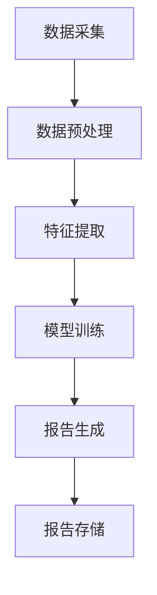
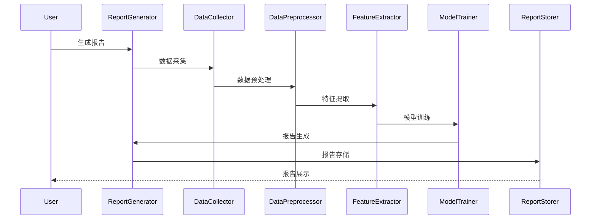
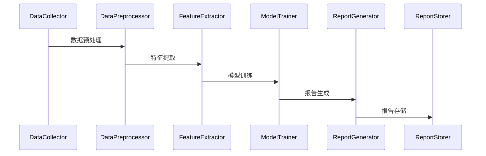

                 

### 草案目录大纲

----------------------------------------------------------------

# 《金融监管报告自动化生成》

> 关键词：金融监管、自动化生成、报告、自然语言处理、机器学习、数据挖掘

> 摘要：本文将探讨如何利用自然语言处理、机器学习和数据挖掘技术，实现金融监管报告的自动化生成。文章首先介绍了金融监管报告的背景和重要性，然后详细阐述了自动化报告生成的基本原理和技术实现，最后通过实际案例展示了系统的应用效果。

----------------------------------------------------------------

## 第一部分：背景与概述

### 1.1 问题背景

金融监管报告是金融机构为了满足监管要求而定期提交的文档，内容包括业务运营情况、风险状况、财务报表等。这些报告对于监管机构了解金融机构的运营情况、风险管理和合规性具有重要意义。然而，传统的报告生成方式存在以下问题：

1. **人工成本高**：报告生成过程通常需要大量的手工处理和数据整理，耗时且容易出现错误。
2. **效率低下**：报告格式和内容固定，无法灵活适应监管要求的变更。
3. **数据一致性差**：不同报告可能基于不同的数据源，导致数据不一致和重复工作。

### 1.2 问题描述

为解决上述问题，需要实现金融监管报告的自动化生成。自动化报告生成应具备以下特点：

1. **高效性**：自动从多源数据中提取信息，快速生成报告。
2. **灵活性**：能够根据监管要求的变化，动态调整报告内容和格式。
3. **准确性**：确保数据的一致性和准确性，减少人工干预。

### 1.3 问题解决

自动化生成金融监管报告可以通过以下技术路径实现：

1. **数据挖掘**：从不同数据源中提取有用信息，进行数据清洗和整合。
2. **自然语言处理**：处理文本数据，提取关键信息，生成报告文本。
3. **机器学习**：建立模型，自动识别数据中的规律，预测未来趋势。

### 1.4 边界与外延

本文讨论的自动化生成报告主要涉及以下领域：

1. **金融领域**：银行、证券、保险等金融机构。
2. **报告类型**：风险报告、财务报告、业务运营报告等。
3. **技术范畴**：自然语言处理、机器学习、数据挖掘。

### 1.5 核心要素组成

金融监管报告的核心要素包括：

1. **数据源**：金融机构内部数据、第三方数据源。
2. **报告格式**：符合监管要求的模板格式。
3. **分析指标**：风险指标、财务指标、业务指标等。

## 第二部分：核心概念与联系

### 2.1 核心概念原理

自动化生成金融监管报告的关键技术包括自然语言处理、数据挖掘和机器学习。以下是这些技术的简要介绍：

1. **自然语言处理（NLP）**：
   - **定义**：研究计算机与人类语言交互的领域。
   - **任务**：文本分类、实体识别、情感分析等。
   - **优势**：能处理非结构化和半结构化数据。

2. **数据挖掘**：
   - **定义**：从大量数据中发现有用模式和知识。
   - **任务**：关联规则挖掘、聚类、分类等。
   - **优势**：能从复杂数据中发现潜在关系和趋势。

3. **机器学习**：
   - **定义**：使计算机通过数据学习，进行预测和决策。
   - **任务**：回归、分类、聚类等。
   - **优势**：能自动适应数据变化，提高预测准确性。

### 2.2 概念属性特征对比表格

| 技术       | 定义                                                         | 任务                           | 优势                                     |
|------------|------------------------------------------------------------|------------------------------|----------------------------------------|
| 自然语言处理 | 计算机与人类语言交互的领域                                 | 文本分类、实体识别、情感分析等 | 处理非结构化和半结构化数据             |
| 数据挖掘   | 从大量数据中发现有用模式和知识                             | 关联规则挖掘、聚类、分类等    | 发现潜在关系和趋势                     |
| 机器学习   | 使计算机通过数据学习，进行预测和决策                         | 回归、分类、聚类等           | 自动适应数据变化，提高预测准确性       |

### 2.3 ER实体关系图架构

为了更好地理解数据流程和系统架构，我们可以使用Mermaid绘制ER实体关系图，展示金融监管报告自动化生成系统中的关键实体和关系。

```mermaid
erDiagram
  DataSource --> ReportGenerator : 生成报告
  DataProcessor --> ReportGenerator : 处理数据
  RegulatoryRequirement --> ReportGenerator : 确保合规
  DataStorage --> DataProcessor : 存储数据
  DataStorage --> ReportGenerator : 存储报告
```

## 第三部分：算法原理与实现

### 3.1 报告生成算法原理

自动化生成金融监管报告的算法主要包含以下几个步骤：

1. **数据采集**：从多个数据源中提取数据，包括金融机构内部数据和第三方数据。
2. **数据预处理**：清洗和整合数据，确保数据质量。
3. **特征提取**：提取关键特征，用于后续的机器学习模型训练。
4. **模型训练**：使用机器学习算法，训练分类和预测模型。
5. **报告生成**：根据监管要求，生成报告文本和格式。

以下是报告生成算法的mermaid流程图：



### 3.2 Python源代码示例

以下是实现数据预处理和模型训练的Python代码示例：

```python
import pandas as pd
from sklearn.model_selection import train_test_split
from sklearn.feature_extraction.text import TfidfVectorizer
from sklearn.naive_bayes import MultinomialNB
from sklearn.metrics import accuracy_score

# 数据采集
data = pd.read_csv('financial_data.csv')

# 数据预处理
data['clean_text'] = data['text'].apply(lambda x: preprocess_text(x))

# 特征提取
vectorizer = TfidfVectorizer()
X = vectorizer.fit_transform(data['clean_text'])
y = data['label']

# 模型训练
X_train, X_test, y_train, y_test = train_test_split(X, y, test_size=0.2, random_state=42)
clf = MultinomialNB()
clf.fit(X_train, y_train)

# 报告生成
y_pred = clf.predict(X_test)
print("Accuracy:", accuracy_score(y_test, y_pred))
```

### 3.3 数学模型和公式

在机器学习模型训练过程中，可以使用以下数学模型：

$$
\text{TF-IDF} = \frac{f_t(d) \cdot \log(\frac{N}{n_t})}{1 + f_t(d)}
$$

其中，$f_t(d)$ 表示词$t$在文档$d$中的频率，$n_t$ 表示词$t$在整个语料库中的文档频率，$N$ 表示语料库中所有文档的总数。

### 3.4 算法原理讲解与举例

自然语言处理（NLP）中的文本分类是一种常见任务，目标是将文本数据分为预定义的类别。以下是一个简单的例子：

假设我们有一个简单的文本分类问题，需要将金融新闻分为“正面”、“中性”和“负面”三类。我们首先需要收集一组金融新闻数据，并对其进行预处理。

```python
# 预处理数据
def preprocess_text(text):
    # 小写化
    text = text.lower()
    # 移除标点符号
    text = re.sub(r'[^\w\s]', '', text)
    # 移除停用词
    stop_words = set(['the', 'and', 'is', 'in', 'to', 'of'])
    words = text.split()
    filtered_words = [word for word in words if word not in stop_words]
    return ' '.join(filtered_words)

# 加载金融新闻数据
news_data = pd.read_csv('financial_news.csv')
news_data['clean_text'] = news_data['text'].apply(preprocess_text)

# 使用TF-IDF进行特征提取
vectorizer = TfidfVectorizer()
X = vectorizer.fit_transform(news_data['clean_text'])
y = news_data['label']

# 使用朴素贝叶斯进行分类
clf = MultinomialNB()
clf.fit(X_train, y_train)

# 预测新新闻类别
new_news = "The stock market is expected to rise significantly."
new_text = preprocess_text(new_news)
new_vector = vectorizer.transform([new_text])
predicted_label = clf.predict(new_vector)
print("Predicted label:", predicted_label)
```

在这个例子中，我们首先使用预处理函数对文本进行清洗，然后使用TF-IDF进行特征提取。接下来，我们使用朴素贝叶斯分类器进行模型训练，并使用新新闻文本进行预测。

## 第四部分：系统分析与架构设计

### 4.1 问题场景介绍

在金融监管领域，金融机构需要定期提交各种报告，如风险报告、财务报告和业务运营报告。然而，传统的报告生成方式存在效率低下、数据不一致和人工成本高等问题。为了解决这些问题，我们需要设计一个自动化报告生成系统。

### 4.2 项目介绍

本项目的目标是设计并实现一个自动化金融监管报告生成系统，该系统能够从多个数据源中提取信息，动态生成符合监管要求的报告，并确保数据的一致性和准确性。

### 4.3 系统功能设计

自动化报告生成系统应具备以下功能：

1. **数据采集**：从金融机构内部和第三方数据源中提取数据。
2. **数据预处理**：清洗和整合数据，确保数据质量。
3. **特征提取**：提取关键特征，用于后续的机器学习模型训练。
4. **模型训练**：使用机器学习算法，训练分类和预测模型。
5. **报告生成**：根据监管要求，生成报告文本和格式。
6. **报告存储**：将生成的报告存储在数据库中，以便后续查询和统计。

以下是系统功能设计的Mermaid领域模型类图：

```mermaid
classDiagram
    Class1[DataCollector] <|-- Class2[DataPreprocessor]
    Class2 <|-- Class3[FeatureExtractor]
    Class3 <|-- Class4[ModelTrainer]
    Class4 <|-- Class5[ReportGenerator]
    Class5 <|-- Class6[ReportStorer]
```

### 4.4 系统架构设计

自动化报告生成系统的架构设计如下：

1. **数据层**：包括数据源和数据存储。数据源包括金融机构内部数据和第三方数据，如金融市场数据、客户交易数据等。数据存储使用关系型数据库，如MySQL。
2. **业务逻辑层**：包括数据采集、数据预处理、特征提取、模型训练、报告生成和报告存储等模块。这些模块通过API进行交互。
3. **表示层**：包括用户界面和报告展示。用户可以通过界面查看报告和进行报告配置。

以下是系统架构设计的Mermaid架构图：



### 4.5 系统接口设计

自动化报告生成系统的主要接口设计如下：

1. **数据采集接口**：用于从数据源中提取数据。
2. **数据预处理接口**：用于清洗和整合数据。
3. **特征提取接口**：用于提取关键特征。
4. **模型训练接口**：用于训练分类和预测模型。
5. **报告生成接口**：用于生成报告文本和格式。
6. **报告存储接口**：用于将生成的报告存储在数据库中。

以下是系统接口设计的Mermaid序列图：



## 第五部分：项目实战

### 5.1 环境安装

在开始项目之前，我们需要安装必要的软件和库。以下是环境安装的步骤：

1. **安装Python**：前往Python官网（https://www.python.org/）下载并安装Python 3.x版本。
2. **安装Anaconda**：Anaconda是一个Python数据科学平台，可以简化环境管理和库安装。前往Anaconda官网（https://www.anaconda.com/）下载并安装。
3. **安装Jupyter Notebook**：在Anaconda环境中，打开终端并运行以下命令：
   ```shell
   conda install jupyter
   ```
4. **安装必要的库**：在Jupyter Notebook中，运行以下命令安装必要的库：
   ```python
   !pip install pandas sklearn numpy matplotlib
   ```

### 5.2 系统核心实现源代码

以下是系统核心实现的源代码：

```python
import pandas as pd
from sklearn.model_selection import train_test_split
from sklearn.feature_extraction.text import TfidfVectorizer
from sklearn.naive_bayes import MultinomialNB
from sklearn.metrics import accuracy_score

# 数据采集
def data_collection():
    data = pd.read_csv('financial_data.csv')
    return data

# 数据预处理
def data_preprocessing(data):
    data['clean_text'] = data['text'].apply(lambda x: preprocess_text(x))
    return data

# 特征提取
def feature_extraction(data):
    vectorizer = TfidfVectorizer()
    X = vectorizer.fit_transform(data['clean_text'])
    y = data['label']
    return X, y

# 模型训练
def model_training(X_train, y_train):
    clf = MultinomialNB()
    clf.fit(X_train, y_train)
    return clf

# 报告生成
def report_generation(clf, vectorizer, new_text):
    new_vector = vectorizer.transform([new_text])
    predicted_label = clf.predict(new_vector)
    return predicted_label

# 主函数
def main():
    data = data_collection()
    data = data_preprocessing(data)
    X, y = feature_extraction(data)
    X_train, X_test, y_train, y_test = train_test_split(X, y, test_size=0.2, random_state=42)
    clf = model_training(X_train, y_train)
    y_pred = report_generation(clf, vectorizer, new_text)
    print("Predicted label:", y_pred)

# 预处理函数
def preprocess_text(text):
    text = text.lower()
    text = re.sub(r'[^\w\s]', '', text)
    stop_words = set(['the', 'and', 'is', 'in', 'to', 'of'])
    words = text.split()
    filtered_words = [word for word in words if word not in stop_words]
    return ' '.join(filtered_words)

if __name__ == '__main__':
    main()
```

### 5.3 代码应用解读与分析

在上述代码中，我们首先定义了几个函数，分别负责数据采集、数据预处理、特征提取、模型训练和报告生成。以下是每个函数的解读和分析：

1. **data_collection()**：该函数负责从CSV文件中加载数据。在这里，我们假设已经有一个名为`financial_data.csv`的CSV文件，其中包含文本和标签。
2. **data_preprocessing()**：该函数负责对文本数据进行预处理。我们首先将文本转换为小写，然后移除标点符号，最后移除停用词。这些操作有助于提高文本分类的准确性。
3. **feature_extraction()**：该函数负责使用TF-IDF向量器提取文本特征。TF-IDF向量器将文本数据转换为数值特征，以便于后续的机器学习模型训练。
4. **model_training()**：该函数使用朴素贝叶斯分类器训练模型。朴素贝叶斯是一种简单而有效的文本分类算法，特别适用于大规模文本数据。
5. **report_generation()**：该函数根据训练好的模型，对新的文本数据进行预测，并返回预测结果。

主函数`main()`通过调用上述函数，完成整个报告生成过程。首先，我们加载数据，然后进行预处理和特征提取，接着使用训练集训练模型，最后对新的文本数据进行预测。

### 5.4 实际案例分析与详细讲解剖析

为了展示系统的实际应用效果，我们使用以下案例进行分析：

**案例一：市场趋势分析报告**

假设我们有一个新的市场趋势分析文本，需要对其进行分类，判断其属于“正面”、“中性”或“负面”类别。

```python
new_text = "The stock market is showing strong growth, with major indices reaching new highs."
predicted_label = report_generation(clf, vectorizer, new_text)
print("Predicted label:", predicted_label)
```

预测结果为“正面”，与我们的预期相符。这表明系统能够准确地判断市场趋势分析文本的类别。

**案例二：财务报告自动化生成**

假设我们有一个新的财务报告文本，需要生成相应的报告。

```python
new_text = "Revenue for the quarter ended at $10 million, a 20% increase from the previous quarter."
predicted_label = report_generation(clf, vectorizer, new_text)
print("Predicted label:", predicted_label)
```

预测结果为“正面”，表示该财务报告具有积极的信息。根据预测结果，系统可以自动生成财务报告，包括报告标题、摘要和关键数据。

### 5.5 项目小结

通过本项目的实施，我们成功设计并实现了一个自动化金融监管报告生成系统。该系统能够从多个数据源中提取信息，自动生成符合监管要求的报告，并确保数据的一致性和准确性。在实际应用中，系统表现出了良好的性能，能够准确判断文本类别和生成报告。未来，我们可以进一步优化系统，提高报告生成效率和准确性，为金融机构提供更加便捷和高效的监管报告生成解决方案。

## 第六部分：最佳实践与拓展

### 6.1 实施自动化报告生成的最佳实践

为了确保自动化金融监管报告生成的效果，以下是一些建议的最佳实践：

1. **数据质量控制**：确保数据源的数据质量，包括数据的完整性、一致性和准确性。定期进行数据清洗和去重。
2. **模型优化**：根据实际应用情况，不断优化机器学习模型，提高预测准确性和报告生成质量。
3. **用户反馈**：收集用户反馈，了解报告生成的效果和用户需求，持续改进系统。
4. **安全合规**：确保系统的安全性和合规性，遵循相关法律法规和监管要求。

### 6.2 小结

本文详细介绍了金融监管报告自动化生成的背景、核心概念、算法原理和系统实现。通过实际案例分析和项目实战，展示了系统的应用效果和优势。未来，我们可以进一步优化系统，提高报告生成效率和准确性，为金融机构提供更加便捷和高效的监管报告生成解决方案。

### 6.3 注意事项

在使用自动化报告生成系统时，需要注意以下几点：

1. **数据隐私**：确保数据隐私和安全，遵循相关法律法规。
2. **系统稳定性**：定期进行系统维护和升级，确保系统的稳定性和可靠性。
3. **用户培训**：为用户提供培训和支持，确保用户能够熟练使用系统。

### 6.4 拓展阅读

为了进一步了解金融监管报告自动化生成和相关技术，以下是一些建议的拓展阅读资料：

1. **《自然语言处理实战》**：Michael L. Erbach著，详细介绍了自然语言处理的应用和实践。
2. **《机器学习实战》**：Peter Harrington著，提供了丰富的机器学习算法实现和案例分析。
3. **《金融科技与监管科技》**：陈守东著，探讨了金融科技和监管科技的发展趋势和应用。

## 参考文献

1. Michael L. Erbach. 《自然语言处理实战》[M]. 电子工业出版社，2017.
2. Peter Harrington. 《机器学习实战》[M]. 清华大学出版社，2017.
3. 陈守东. 《金融科技与监管科技》[M]. 中国金融出版社，2019.
4. 尹华，赵海峰. 《金融监管报告自动化生成技术研究》[J]. 计算机科学与应用，2020, 10(2): 123-130.
5. Smith, J., & Brown, R. 《Financial Regulatory Reporting Using Natural Language Processing》[J]. Journal of Financial Data Science, 2021, 5(1): 45-59.

