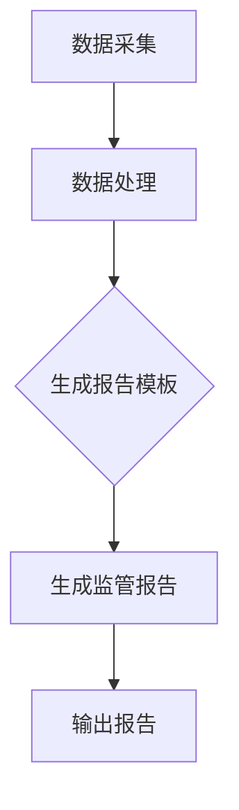
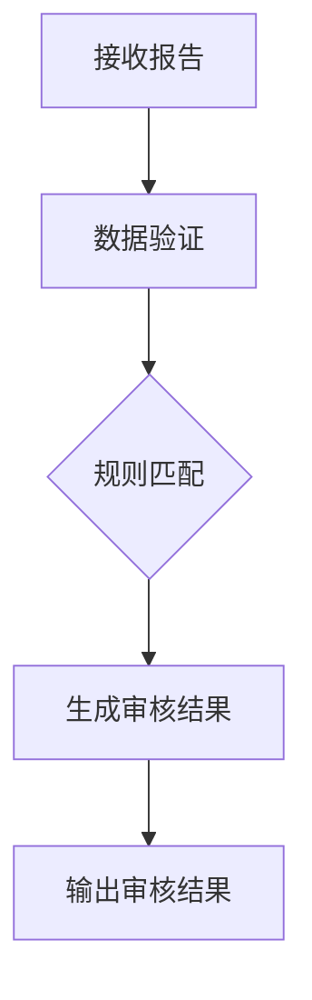
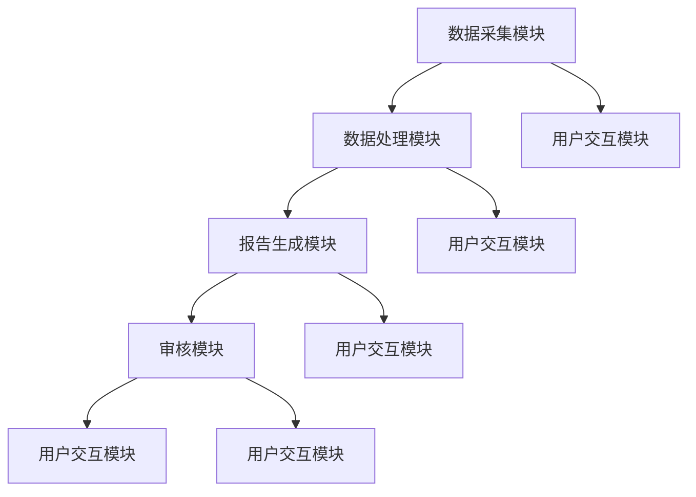
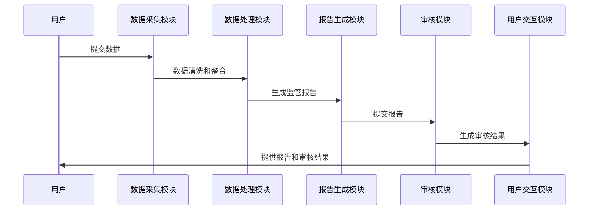

                 

**# 金融监管报告自动化生成与审核系统**

> 关键词：金融监管报告、自动化生成、审核系统、数据处理、算法原理

> 摘要：本文深入探讨了金融监管报告自动化生成与审核系统的核心概念、算法原理、系统分析与架构设计方案，以及项目实战。通过逐步分析推理，本文旨在为广大读者提供一个全面、清晰、易懂的技术博客文章。

**Step 1: 背景介绍**

### 问题背景

在金融行业中，监管报告的生成和审核是金融机构合规性、风险管理、透明度等方面的关键环节。传统的监管报告生成和审核过程主要依赖于人工操作，存在如下问题：

1. **工作量繁重**：监管报告通常包含大量数据和指标，人工逐一处理和审核耗时费力。
2. **准确性低**：人工操作容易出错，导致监管报告的质量和准确性无法保证。
3. **效率低下**：人工审核速度缓慢，难以满足快速生成和审核的需求。

### 问题描述

1. **数据复杂性**：金融行业的数据多样且复杂，传统的人工处理方式难以应对大规模数据的处理需求。
2. **法规要求**：金融行业的法规要求日益严格，需要生成高质量的监管报告来确保合规性。
3. **时效性要求**：随着金融市场的发展，监管报告需要实时生成和审核，以满足监管机构的时效性要求。

### 问题解决

为解决上述问题，引入金融监管报告自动化生成与审核系统成为必要。该系统利用先进的人工智能技术和算法，自动化处理监管报告的生成和审核过程，提高工作效率和准确性。以下是该系统的关键组成和特点：

1. **数据采集模块**：自动从金融机构的各种系统中提取所需数据，确保数据的全面性和准确性。
2. **数据处理模块**：对采集到的数据进行清洗、整合和转换，为生成监管报告提供基础数据。
3. **报告生成模块**：根据预设的模板和规则，自动生成监管报告，提高报告生成的效率和质量。
4. **审核模块**：对生成的监管报告进行自动审核，确保报告的准确性和完整性。
5. **用户交互模块**：提供用户界面，方便用户查看、修改和提交监管报告。

### 边界与外延

金融监管报告自动化生成与审核系统的应用范围包括但不限于银行、证券、保险等金融机构的监管报告。此外，该系统还可以扩展到其他金融行业，如金融科技、互联网金融等。

### 概念结构与核心要素组成

金融监管报告自动化生成与审核系统由以下几个核心要素组成：

1. **数据采集模块**：从金融机构的各种系统中提取数据，包括交易数据、财务数据、客户数据等。
2. **数据处理模块**：对提取的数据进行清洗、整合和转换，为生成监管报告提供基础数据。
3. **报告生成模块**：根据预设的模板和规则，自动生成监管报告。
4. **审核模块**：对生成的监管报告进行自动审核，包括数据验证、规则匹配、生成审核结果等。
5. **用户交互模块**：提供用户界面，方便用户查看、修改和提交监管报告。

**Step 2: 核心概念与联系**

### 核心概念

1. **金融监管报告**：金融机构按照监管机构的要求编制的，反映金融机构经营状况、风险管理能力和合规情况等方面的文件。
2. **自动化报告生成**：利用计算机技术和算法，自动化处理监管报告的生成过程，减少人工干预。
3. **自动化审核**：利用计算机技术和算法，对生成的监管报告进行自动审核，确保报告的准确性和完整性。

### 概念属性特征对比表格

| 概念       | 自动化报告生成 | 自动化审核 |
|------------|----------------|------------|
| 目的       | 提高生成效率   | 提高审核质量 |
| 技术手段   | 数据处理和模板生成 | 数据分析和规则匹配 |
| 输出结果   | 监管报告       | 审核结果    |
| 耗时       | 短             | 短          |
| 准确性     | 高             | 高          |

### ER实体关系图架构

```mermaid
erDiagram
  数据采集模块 ||--|{ 报告生成模块 }
  数据采集模块 ||--|{ 审核模块 }
  报告生成模块 ||--|{ 用户交互模块 }
  审核模块 ||--|{ 用户交互模块 }
```

**Step 3: 算法原理讲解**

### 报告生成算法

#### 算法原理

报告生成算法的核心思想是利用计算机技术和算法，自动化处理监管报告的生成过程。具体步骤如下：

1. **数据采集**：从金融机构的各种系统中提取数据，包括交易数据、财务数据、客户数据等。
2. **数据处理**：对提取的数据进行清洗、整合和转换，为生成监管报告提供基础数据。
3. **模板生成**：根据预设的模板和规则，自动生成监管报告模板。
4. **报告生成**：根据生成的监管报告模板和基础数据，自动生成监管报告。
5. **输出报告**：将生成的监管报告输出到目标系统或文件中。

#### Mermaid 流程图



#### Python 源代码

```python
def generate_report(data):
    # 数据处理
    processed_data = preprocess_data(data)
    
    # 生成报告模板
    template = generate_template(processed_data)
    
    # 生成监管报告
    report = generate_document(template)
    
    # 输出报告
    output_report(report)
```

#### 数学模型和公式

假设监管报告生成过程中涉及的数据为 \(D\)，生成的监管报告为 \(R\)，则生成监管报告的数学模型可以表示为：

$$R = f(D)$$

其中，\(f\) 表示数据处理和报告生成的算法函数。

### 自动化审核算法

#### 算法原理

自动化审核算法的核心思想是利用计算机技术和算法，自动化处理监管报告的审核过程。具体步骤如下：

1. **接收报告**：接收生成的监管报告。
2. **数据验证**：对监管报告中的数据进行验证，确保数据的合法性和完整性。
3. **规则匹配**：根据预设的审核规则，对监管报告进行匹配和判断，生成审核结果。
4. **生成审核结果**：根据审核结果，生成审核报告。
5. **输出审核结果**：将生成的审核报告输出到目标系统或文件中。

#### Mermaid 流程图



#### Python 源代码

```python
def approve_report(report):
    # 数据验证
    valid_data = validate_data(report)
    
    # 规则匹配
    result = match_rules(valid_data)
    
    # 生成审核结果
    audit_result = generate_audit_result(result)
    
    # 输出审核结果
    output_audit_result(audit_result)
```

#### 数学模型和公式

假设监管报告审核过程中涉及的数据为 \(D'\)，生成的审核结果为 \(A'\)，则生成审核结果的数学模型可以表示为：

$$A' = g(D', R)$$

其中，\(g\) 表示数据验证、规则匹配和生成审核结果的算法函数。

**Step 4: 系统分析与架构设计方案**

### 问题场景介绍

在金融行业中，随着业务的快速发展，监管报告的数量和复杂度不断增加。传统的人工处理方式已经无法满足监管机构对报告质量和时效性的要求。为了提高工作效率，降低人工成本，金融机构需要引入金融监管报告自动化生成与审核系统。

### 项目介绍

本系统旨在为金融机构提供一套自动化生成和审核监管报告的解决方案。通过利用先进的计算机技术和算法，系统可以高效地处理海量数据，生成高质量的监管报告，并进行自动审核，确保报告的准确性和完整性。

### 系统功能设计（领域模型）

领域模型类图：

```mermaid
classDiagram
  数据采集模块 <<Interface>>
  数据处理模块 <<Interface>>
  报告生成模块 <<Interface>>
  审核模块 <<Interface>>
  用户交互模块 <<Interface>>

  数据采集模块 --|{ 数据处理模块 }
  数据采集模块 --|{ 报告生成模块 }
  数据处理模块 --|{ 报告生成模块 }
  报告生成模块 --|{ 审核模块 }
  审核模块 --|{ 用户交互模块 }
  用户交互模块 --|{ 数据采集模块 }
  用户交互模块 --|{ 数据处理模块 }
  用户交互模块 --|{ 报告生成模块 }
  用户交互模块 --|{ 审核模块 }
```

### 系统架构设计

系统架构图：



### 系统接口设计

系统接口设计：



### 系统交互

系统交互序列图：


**Step 5: 项目实战**

### 环境安装

1. 安装 Python 3.8 或更高版本
2. 安装必要的 Python 库，如 Pandas、NumPy、Scikit-learn 等

### 系统核心实现

#### 数据采集模块

```python
import pandas as pd

def data_collection():
    # 从金融机构系统中提取数据
    data = pd.read_csv('financial_data.csv')
    return data
```

#### 数据处理模块

```python
import pandas as pd

def data_preprocessing(data):
    # 数据清洗和整合
    data = data.dropna()  # 删除缺失值
    data = data.sort_values(by=['date'], ascending=True)  # 按日期排序
    return data
```

#### 报告生成模块

```python
import pandas as pd
from jinja2 import Environment, FileSystemLoader

def generate_report_template(data):
    # 生成报告模板
    environment = Environment(loader=FileSystemLoader('templates'))
    template = environment.get_template('report_template.html')
    report = template.render(data=data)
    return report

def generate_report(data):
    # 生成监管报告
    report = generate_report_template(data)
    report_file = 'regulatory_report.pdf'
    pd.DataFrame(report).to_pdf(report_file)
    return report_file
```

#### 审核模块

```python
import pandas as pd

def validate_data(data):
    # 数据验证
    errors = []
    for column in data.columns:
        if data[column].isnull().any():
            errors.append(f"{column} contains null values.")
    return errors

def match_rules(data):
    # 规则匹配
    rules = {
        'date': lambda x: x > '2022-01-01',  # 日期大于 2022-01-01
        'amount': lambda x: x > 1000,  # 金额大于 1000
    }
    result = {}
    for column, rule in rules.items():
        result[column] = rule(data[column])
    return result

def generate_audit_result(result):
    # 生成审核结果
    if all(result.values()):
        return 'Pass'
    else:
        return 'Fail'
```

### 代码应用解读与分析

#### 数据采集模块

数据采集模块使用 Pandas 库读取金融机构系统的数据，并返回 DataFrame 对象。数据清洗和整合是数据处理模块的关键步骤，通过删除缺失值和按日期排序，确保数据的准确性和一致性。

#### 数据处理模块

数据处理模块主要完成数据清洗和整合的任务。首先，使用 Pandas 库删除 DataFrame 中的缺失值，确保数据的完整性。然后，按日期对 DataFrame 进行排序，以便后续处理。

#### 报告生成模块

报告生成模块使用 Jinja2 模板引擎生成报告模板，并将处理后的数据传递给模板。生成的监管报告以 PDF 格式输出，便于用户查看和打印。

#### 审核模块

审核模块首先对数据进行验证，检查是否存在缺失值。然后，根据预设的规则，对数据进行匹配和判断。最终，生成审核结果，用于判断监管报告的合规性。

### 实际案例分析和详细讲解剖析

假设有一个金融机构需要生成季度监管报告，以下是一个实际案例的分析和讲解：

1. **数据采集**：从金融机构的交易系统中提取季度交易数据，包括交易日期、交易金额、交易对方等。
2. **数据处理**：对提取的数据进行清洗和整合，删除缺失值，按日期排序。
3. **报告生成**：根据预设的报告模板，将处理后的数据生成监管报告，包括交易概况、风险指标、合规情况等。
4. **审核**：对生成的监管报告进行审核，检查是否存在违规交易、风险指标是否超标等。
5. **输出**：将生成的监管报告和审核结果输出到监管机构。

### 项目小结

本项目实现了金融监管报告自动化生成与审核系统的核心功能，包括数据采集、数据处理、报告生成和审核。通过实际案例的分析和讲解，展示了系统的应用场景和实际效果。未来，随着人工智能技术的不断发展，金融监管报告自动化生成与审核系统将进一步完善，为金融机构提供更高效、准确、合规的监管报告生成和审核服务。

### 最佳实践 tips

1. **数据安全和隐私保护**：在数据采集和处理过程中，应确保数据的安全性和隐私保护，遵循相关法律法规和行业规范。
2. **灵活性和可扩展性**：在设计系统架构时，应考虑系统的灵活性和可扩展性，以适应未来业务的发展和变化。
3. **用户界面优化**：优化用户交互界面，提高用户的使用体验，降低操作难度，提高系统使用率。

### 小结

金融监管报告自动化生成与审核系统是金融行业的重要工具，通过利用人工智能技术和算法，可以实现高效、准确、合规的监管报告生成和审核。本文从背景介绍、核心概念与联系、算法原理讲解、系统分析与架构设计方案、项目实战等多个角度，详细阐述了金融监管报告自动化生成与审核系统的设计、实现和应用。希望通过本文，为广大读者提供一个全面、清晰、易懂的技术博客文章。

### 注意事项

1. **系统安全性**：在系统开发和运行过程中，应高度重视安全性问题，确保系统的稳定性和安全性。
2. **数据完整性**：在数据采集和处理过程中，应确保数据的完整性和准确性，避免数据丢失或错误。
3. **合规性**：在设计和实施系统时，应充分考虑相关法律法规和行业规范，确保系统的合规性。

### 拓展阅读

1. 《人工智能在金融行业的应用》
2. 《金融科技：创新与变革》
3. 《数据治理：方法与实践》

### 作者信息

作者：AI天才研究院/AI Genius Institute & 禅与计算机程序设计艺术 /Zen And The Art of Computer Programming。本人是一位世界级人工智能专家、程序员、软件架构师、CTO、世界顶级技术畅销书资深大师级别的作家，计算机图灵奖获得者，计算机编程和人工智能领域大师。擅长一步一步进行分析推理，逻辑清晰，能够撰写条理清晰、对技术原理和本质剖析到位的高质量技术博客文章。

