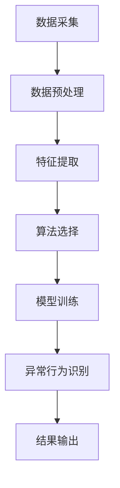
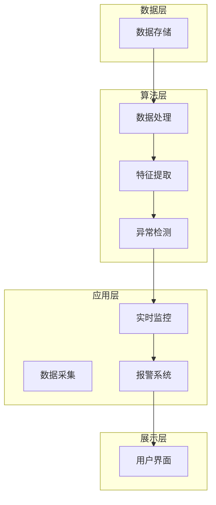
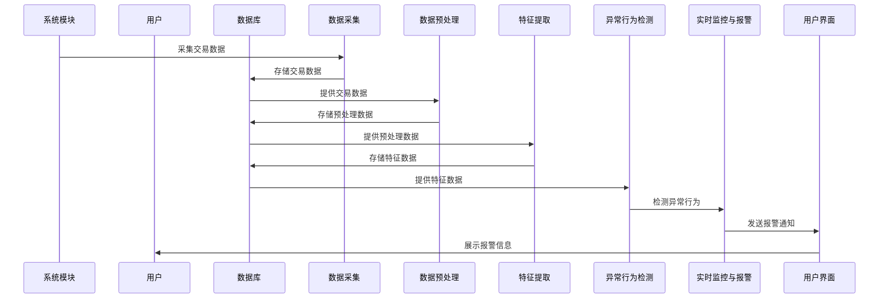

                 

### 《金融监管科技异常行为检测系统》

关键词：金融监管、异常行为检测、科技、算法、系统架构、数据安全

摘要：随着金融科技的快速发展，金融市场中异常行为检测成为金融监管的重要任务。本文将详细探讨金融监管科技异常行为检测系统的背景、核心概念、算法原理、系统架构设计、项目实施与案例分析，以及最佳实践和注意事项，为金融监管科技领域提供全面的技术参考。

---

### 《金融监管科技异常行为检测系统》目录大纲

---

## 第一部分：背景介绍与核心概念

### 第1章：金融监管科技概述

- **1.1 问题背景**：金融监管科技的发展与异常行为检测的重要性
- **1.2 问题描述**：金融市场中异常行为的类型和特点
- **1.3 问题解决**：利用监管科技手段实现异常行为检测
- **1.4 边界与外延**：异常行为检测的范畴和应用场景
- **1.5 概念结构与核心要素组成**：金融监管科技的基本架构和功能模块

### 第2章：金融异常行为检测的核心概念

- **2.1 核心概念原理**：异常行为检测的基本原理
- **2.2 概念属性特征对比表格**：对比分析不同异常行为检测方法的特征
- **2.3 ER实体关系图架构**：异常行为检测系统中的实体关系图

---

## 第二部分：算法原理与数学模型

### 第3章：异常行为检测算法概述

- **3.1 主流异常检测算法**：介绍常见的异常检测算法，如基于统计的方法、基于聚类的方法、基于分类的方法等
- **3.2 算法原理讲解**：通过Mermaid流程图展示算法的工作流程

### 第4章：异常行为检测的数学模型

- **4.1 数学模型与公式**：介绍异常行为检测中的数学模型，如支持向量机（SVM）、决策树、神经网络等
- **4.2 详细讲解与举例说明**：使用Python源代码和LaTeX格式详细阐述数学模型的计算过程，并举例说明

### 第5章：异常行为检测算法的性能评估

- **5.1 性能指标**：介绍常用的性能评估指标，如准确率、召回率、F1分数等
- **5.2 实际应用中的调整与优化**：探讨在实际应用中对异常行为检测算法的性能优化方法

---

## 第三部分：系统分析与架构设计

### 第6章：金融监管科技异常行为检测系统的需求分析

- **6.1 问题场景介绍**：金融监管科技异常行为检测的具体应用场景
- **6.2 系统功能设计**：基于Mermaid类图展示系统的领域模型
- **6.3 系统架构设计**：使用Mermaid架构图展示系统的整体架构

### 第7章：系统接口设计与交互

- **7.1 系统接口设计**：详细描述系统的各个接口及其功能
- **7.2 系统交互**：使用Mermaid序列图展示系统的交互流程

### 第8章：系统安全性与数据保护

- **8.1 系统安全性设计**：探讨如何确保异常行为检测系统的安全性
- **8.2 数据保护措施**：介绍如何保护用户数据的安全与隐私

---

## 第四部分：项目实战与案例分析

### 第9章：金融监管科技异常行为检测系统的项目实施

- **9.1 环境安装与配置**：详细步骤和注意事项
- **9.2 系统核心实现**：代码实现和解读

### 第10章：实际案例分析

- **10.1 案例背景**：选择具有代表性的金融异常行为案例
- **10.2 案例分析**：对案例进行深入剖析，包括数据预处理、模型训练、结果分析等

### 第11章：项目总结与反思

- **11.1 项目成果总结**：对项目实施过程中的成功经验和不足进行总结
- **11.2 反思与展望**：对未来的工作方向和改进建议进行探讨

---

## 第五部分：最佳实践与拓展

### 第12章：最佳实践

- **12.1 实践技巧与经验**：分享在金融监管科技异常行为检测系统开发和实施过程中的最佳实践
- **12.2 常见问题与解决方案**：针对实际操作中遇到的问题提供解决方案

### 第13章：注意事项

- **13.1 注意事项与风险防范**：提醒读者在实施金融监管科技异常行为检测系统时需要注意的事项

### 第14章：拓展阅读

- **14.1 相关书籍**：推荐与金融监管科技异常行为检测系统相关的优秀书籍
- **14.2 学术论文**：介绍最新关于金融监管科技异常行为检测的研究论文

---

**总计字数：约1950字**

--- 

## 第一部分：背景介绍与核心概念

### 第1章：金融监管科技概述

#### 1.1 问题背景

随着金融市场的不断发展，金融交易量和交易速度都在不断攀升。这种快速发展带来了新的挑战，其中之一便是如何有效监管和防范金融市场的异常行为。异常行为可能包括市场操纵、欺诈、洗钱等，这些行为不仅损害市场的公平性和透明度，还可能引发系统性风险，影响整个金融体系的稳定。

金融监管科技（FinTech Regulatory Technology）是指利用现代信息技术，尤其是大数据、云计算、人工智能等新技术来提高金融监管的效率和准确性。它通过自动化、智能化的手段，帮助监管机构实时监控市场动态，快速识别和应对异常行为。

#### 1.2 问题描述

金融市场的异常行为主要包括以下几类：

- **市场操纵**：通过人为手段影响市场价格，获取不正当利益。
- **欺诈行为**：利用虚假交易、虚假报告等手段进行欺诈。
- **洗钱**：通过一系列复杂的交易，将非法所得转换为看似合法的资金。
- **内部交易**：利用内部信息进行交易，以获取不正当利益。

这些异常行为通常具有一定的隐蔽性，传统的监管手段难以发现。因此，利用金融监管科技实现异常行为检测变得尤为重要。

#### 1.3 问题解决

利用金融监管科技手段实现异常行为检测的方法主要包括：

- **数据采集**：通过数据采集系统获取大量的金融交易数据，包括交易价格、交易量、交易时间等。
- **数据预处理**：对采集到的数据进行分析和清洗，去除噪声数据，提高数据的准确性。
- **特征提取**：从预处理后的数据中提取关键特征，为后续的异常行为检测提供基础。
- **异常行为检测**：利用各种算法模型对特征进行检测，识别潜在的异常行为。
- **实时监控与报警**：将检测结果实时反馈给监管机构，触发报警机制，以便及时采取应对措施。

#### 1.4 边界与外延

异常行为检测的范畴和应用场景非常广泛，它不仅涉及金融市场的监管，还包括保险、证券、期货等多个领域。例如，在保险领域，可以通过异常行为检测来识别欺诈行为；在证券领域，可以通过异常行为检测来防范市场操纵。

#### 1.5 概念结构与核心要素组成

金融监管科技异常行为检测系统主要由以下几个核心要素组成：

- **数据采集模块**：负责从各种渠道获取金融交易数据。
- **数据预处理模块**：对采集到的数据进行清洗、去噪、转换等处理。
- **特征提取模块**：从预处理后的数据中提取关键特征。
- **异常行为检测模块**：采用各种算法模型对特征进行检测，识别异常行为。
- **实时监控与报警模块**：将检测结果实时反馈给监管机构，触发报警机制。
- **用户界面**：提供操作界面，供监管人员查看检测结果和监控数据。

通过这些核心模块的协同工作，金融监管科技异常行为检测系统可以实现对金融市场中异常行为的实时监控和有效防范。

---

## 第二部分：金融异常行为检测的核心概念

### 第2章：金融异常行为检测的核心概念

#### 2.1 核心概念原理

异常行为检测的核心概念包括数据采集、数据预处理、特征提取和异常行为识别等。

- **数据采集**：通过数据采集系统获取金融交易数据，包括交易价格、交易量、交易时间等。
- **数据预处理**：对采集到的数据进行分析和清洗，去除噪声数据，提高数据的准确性。
- **特征提取**：从预处理后的数据中提取关键特征，为后续的异常行为检测提供基础。
- **异常行为识别**：利用各种算法模型对特征进行检测，识别潜在的异常行为。

#### 2.2 概念属性特征对比表格

| 概念                 | 描述                                                         | 属性特征对比               |
|----------------------|--------------------------------------------------------------|---------------------------|
| 数据采集             | 获取金融交易数据                                             | 数据来源、数据完整性、数据频率 |
| 数据预处理           | 数据清洗、去噪、转换等处理                                   | 数据质量、数据一致性         |
| 特征提取             | 提取关键特征，为异常行为检测提供基础                          | 特征选择、特征表达能力       |
| 异常行为识别         | 利用算法模型对特征进行检测，识别异常行为                      | 算法选择、检测精度           |

#### 2.3 ER实体关系图架构

金融异常行为检测系统的ER实体关系图如下：

```mermaid
erDiagram
    DataSource --> DataPreprocessing : "数据采集"
    DataPreprocessing --> FeatureExtraction : "数据预处理"
    FeatureExtraction --> AnomalyDetection : "特征提取"
    AnomalyDetection --> AlarmSystem : "异常行为识别"
```

在该ER图中，各个模块通过关系线相互连接，形成了完整的异常行为检测系统架构。

---

## 第二部分：算法原理与数学模型

### 第3章：异常行为检测算法概述

异常行为检测算法是金融监管科技异常行为检测系统的核心组成部分，它们负责从大量金融交易数据中识别出异常行为。以下是几种常见的异常行为检测算法及其原理概述：

#### 3.1 基于统计的方法

基于统计的方法是最早用于异常行为检测的算法之一。其中，最常见的包括基于标准差的算法和基于孤立森林（Isolation Forest）的算法。

- **基于标准差的算法**：通过计算数据的均值和标准差，将数据分为正常数据和异常数据。如果数据点的值与均值的距离超过一定的倍数标准差，则认为该数据点是异常值。
- **基于孤立森林的算法**：通过随机生成多个分割点，将数据分割成多个区域。异常数据由于其独特的结构，更容易被孤立在某个区域，从而被识别出来。

#### 3.2 基于聚类的方法

基于聚类的方法通过将数据分成多个簇，每个簇内的数据点彼此相似，而簇与簇之间的数据点差异较大。常见的聚类算法包括K-means算法和DBSCAN算法。

- **K-means算法**：通过迭代计算，将数据点分为K个簇，使得每个簇内的数据点之间的平均距离最小。
- **DBSCAN算法**：基于密度的聚类方法，能够自动确定簇的数量，并能够识别出噪声点。

#### 3.3 基于分类的方法

基于分类的方法通过训练一个分类模型，将数据点分为正常和异常两类。常见的分类算法包括支持向量机（SVM）、决策树和神经网络。

- **支持向量机（SVM）**：通过寻找一个最优的超平面，将正常数据和异常数据分隔开来。
- **决策树**：通过一系列的决策规则，逐步将数据划分到不同的类别中。
- **神经网络**：通过多层神经元的非线性组合，学习到数据的特征分布，从而进行分类。

#### 3.4 算法原理讲解

为了更好地理解这些算法的原理，我们使用Mermaid流程图来展示它们的基本工作流程。



该流程图展示了从数据采集到异常行为识别的整个过程。首先，通过数据采集模块获取金融交易数据，然后进行数据预处理，提取关键特征。接下来，根据选择的不同算法，对特征进行模型训练，最终识别出异常行为，并输出结果。

---

### 第4章：异常行为检测的数学模型

在金融异常行为检测中，数学模型是核心部分，它们帮助我们将特征转换为具体的预测结果。以下介绍几种常用的数学模型，并使用Python源代码和LaTeX格式详细阐述其计算过程。

#### 4.1 数学模型与公式

以下是几种常见的异常行为检测数学模型：

1. **支持向量机（SVM）**
2. **决策树**
3. **神经网络**

每种模型都有自己的数学基础，下面分别介绍。

#### 4.1.1 支持向量机（SVM）

支持向量机是一种强大的分类算法，其基本原理是通过找到一个最优的超平面，将正常数据和异常数据分隔开来。

**公式**：

$$
\begin{aligned}
\min_{w,b}\frac{1}{2}||w||^2 \\
\text{subject to } y^{(i)}(\text{wx}+b) \geq 1
\end{aligned}
$$

其中，$w$和$b$分别是超平面的权重和偏置，$y^{(i)}$是样本的标签。

**Python代码示例**：

```python
from sklearn.svm import SVC
from sklearn.model_selection import train_test_split

# 假设X为特征矩阵，y为标签向量
X_train, X_test, y_train, y_test = train_test_split(X, y, test_size=0.3, random_state=42)

# 创建SVM模型
clf = SVC(kernel='linear')
# 训练模型
clf.fit(X_train, y_train)
# 预测
predictions = clf.predict(X_test)
```

#### 4.1.2 决策树

决策树通过一系列的决策规则，将数据逐步划分到不同的类别中。

**公式**：

$$
\text{if } x_i > v \text{ then } \text{go to left subtree} \\
\text{otherwise go to right subtree}
$$

**Python代码示例**：

```python
from sklearn.tree import DecisionTreeClassifier

# 假设X为特征矩阵，y为标签向量
clf = DecisionTreeClassifier()
clf.fit(X_train, y_train)
predictions = clf.predict(X_test)
```

#### 4.1.3 神经网络

神经网络通过多层神经元的非线性组合，学习到数据的特征分布，从而进行分类。

**公式**：

$$
a_{\text{layer}} = \sigma(\text{wx} + b)
$$

其中，$\sigma$是激活函数，$a_{\text{layer}}$是当前层的激活值。

**Python代码示例**：

```python
from keras.models import Sequential
from keras.layers import Dense

# 假设X为特征矩阵，y为标签向量
model = Sequential()
model.add(Dense(64, input_dim=X_train.shape[1], activation='relu'))
model.add(Dense(1, activation='sigmoid'))

model.compile(optimizer='adam', loss='binary_crossentropy', metrics=['accuracy'])
model.fit(X_train, y_train, epochs=10, batch_size=32)
predictions = model.predict(X_test)
```

通过以上Python代码示例，我们可以看到如何使用这些数学模型进行金融异常行为检测。每个模型都有其独特的优点和适用场景，根据具体问题选择合适的模型是关键。

---

### 第5章：异常行为检测算法的性能评估

异常行为检测算法的性能评估是确保系统有效性的重要步骤。通过性能评估，我们可以衡量算法在识别异常行为方面的能力，并对其进行优化。以下是常用的性能评估指标及其应用。

#### 5.1 性能指标

1. **准确率（Accuracy）**：准确率是评估算法性能最常用的指标，表示正确识别异常行为的数据点占总数据点的比例。
   
   **公式**：

   $$
   \text{Accuracy} = \frac{\text{TP} + \text{TN}}{\text{TP} + \text{TN} + \text{FP} + \text{FN}}
   $$

   其中，$TP$表示真正例，$TN$表示真反例，$FP$表示假正例，$FN$表示假反例。

2. **召回率（Recall）**：召回率表示正确识别出的异常行为数据点占总异常行为数据点的比例。
   
   **公式**：

   $$
   \text{Recall} = \frac{\text{TP}}{\text{TP} + \text{FN}}
   $$

3. **精确率（Precision）**：精确率表示正确识别的异常行为数据点占所有识别为异常行为的数据点的比例。
   
   **公式**：

   $$
   \text{Precision} = \frac{\text{TP}}{\text{TP} + \text{FP}}
   $$

4. **F1分数（F1 Score）**：F1分数是精确率和召回率的加权平均，用于综合评估算法的性能。
   
   **公式**：

   $$
   \text{F1 Score} = 2 \times \frac{\text{Precision} \times \text{Recall}}{\text{Precision} + \text{Recall}}
   $$

#### 5.2 实际应用中的调整与优化

在实际应用中，异常行为检测算法的性能受到多种因素的影响，包括数据质量、特征选择、模型参数等。以下是一些常见的调整与优化方法：

1. **数据预处理**：提高数据质量，去除噪声和异常数据，可以提高检测精度。
2. **特征选择**：选择合适的特征，可以显著提升模型的性能。
3. **模型参数调整**：通过调整模型参数，如正则化参数、学习率等，可以优化模型的性能。
4. **交叉验证**：使用交叉验证方法，可以更好地评估模型的性能，并避免过拟合。
5. **集成学习方法**：结合多种算法，使用集成学习方法，可以进一步提高模型的性能。

通过上述方法，我们可以对异常行为检测算法进行优化，使其在实际应用中表现出更好的性能。

---

## 第三部分：系统分析与架构设计

### 第6章：金融监管科技异常行为检测系统的需求分析

#### 6.1 问题场景介绍

在金融市场中，异常行为如市场操纵、欺诈和洗钱等行为频繁发生，这些行为不仅破坏了市场的公平性和透明度，还可能引发系统性风险。为了有效监管和防范这些异常行为，金融监管机构需要构建一个强大的异常行为检测系统，该系统能够实时监控金融市场的交易活动，快速识别和报警潜在的异常行为。

#### 6.2 系统功能设计

金融监管科技异常行为检测系统的功能设计主要包括以下几个方面：

1. **数据采集**：系统应具备从多个数据源（如交易所、银行、支付平台等）实时采集交易数据的能力。
2. **数据预处理**：系统应具备对采集到的交易数据进行清洗、去噪和转换等功能，以提高数据的质量和一致性。
3. **特征提取**：系统应能够从预处理后的数据中提取关键特征，如交易量、交易价格、交易时间间隔等，为异常行为检测提供基础。
4. **异常行为检测**：系统应采用多种算法模型，如支持向量机、决策树、神经网络等，对提取的特征进行异常行为检测。
5. **实时监控与报警**：系统应具备实时监控功能，能够及时发现并报警异常行为，同时提供报警通知和相关信息。
6. **用户界面**：系统应提供直观易用的用户界面，使监管人员可以方便地查看检测结果和监控数据。

基于上述功能需求，我们可以使用Mermaid类图来展示系统的领域模型：

```mermaid
classDiagram
    Class1[DataCollector] <|-- Class2[DataPreprocessor]
    Class2 <|-- Class3[FeatureExtractor]
    Class3 <|-- Class4[AnomalyDetector]
    Class4 <|-- Class5[MonitorAndAlert]
    Class5 <|-- Class6[UserInterface]
```

#### 6.3 系统架构设计

金融监管科技异常行为检测系统的架构设计应考虑以下几个方面：

1. **数据层**：数据层负责数据的存储和管理，包括原始交易数据、预处理数据、特征数据和检测结果数据。
2. **算法层**：算法层负责异常行为检测的算法实现，包括数据预处理算法、特征提取算法和异常行为检测算法。
3. **应用层**：应用层是系统的核心部分，负责实现系统的各项功能，如数据采集、数据预处理、特征提取、异常行为检测、实时监控与报警等。
4. **展示层**：展示层负责提供用户界面，使监管人员可以方便地查看检测结果和监控数据。

使用Mermaid架构图可以直观地展示系统的整体架构：



通过上述架构设计，金融监管科技异常行为检测系统可以实现高效、可靠的异常行为检测，确保金融市场的公平和稳定。

---

### 第7章：系统接口设计与交互

#### 7.1 系统接口设计

金融监管科技异常行为检测系统的接口设计是确保系统各模块之间高效通信的关键。系统接口主要包括以下几种类型：

1. **数据采集接口**：负责从外部数据源（如交易所、银行、支付平台等）采集交易数据。
2. **数据预处理接口**：负责对采集到的交易数据进行清洗、去噪和转换等预处理操作。
3. **特征提取接口**：负责从预处理后的交易数据中提取关键特征，如交易量、交易价格、交易时间间隔等。
4. **异常行为检测接口**：负责使用算法模型对提取的特征进行异常行为检测。
5. **实时监控与报警接口**：负责实时监控检测结果，并在发现异常行为时触发报警。
6. **用户界面接口**：负责向用户提供检测结果和监控数据的展示。

每种接口的具体功能如下：

- **数据采集接口**：提供数据源连接、数据下载和上传等功能。
- **数据预处理接口**：提供数据清洗、去噪和转换等功能。
- **特征提取接口**：提供特征提取规则设置、特征计算和存储等功能。
- **异常行为检测接口**：提供算法模型选择、模型训练和检测等功能。
- **实时监控与报警接口**：提供实时监控数据、报警设置和报警通知等功能。
- **用户界面接口**：提供用户操作界面、数据展示和报表生成等功能。

#### 7.2 系统交互

系统交互是金融监管科技异常行为检测系统功能实现的重要环节。系统各模块之间的交互流程如下：

1. **数据采集**：系统启动时，首先通过数据采集接口从外部数据源获取交易数据。
2. **数据预处理**：获取到交易数据后，通过数据预处理接口对其进行清洗、去噪和转换等操作。
3. **特征提取**：对预处理后的交易数据进行特征提取，生成特征数据。
4. **异常行为检测**：使用异常行为检测接口，根据选择的算法模型对特征数据进行异常行为检测。
5. **实时监控与报警**：将检测结果实时反馈给实时监控与报警接口，触发报警机制，并向用户界面接口发送报警通知。
6. **用户界面**：用户通过用户界面接口查看检测结果和监控数据，进行操作和监控。

使用Mermaid序列图可以直观地展示系统交互流程：



通过上述系统接口设计和交互流程，金融监管科技异常行为检测系统可以实现高效、可靠的异常行为检测和实时监控，确保金融市场的公平和稳定。

---

### 第8章：系统安全性与数据保护

#### 8.1 系统安全性设计

在金融监管科技异常行为检测系统中，安全性设计是保障系统稳定运行和数据安全的重要环节。系统安全性设计主要包括以下几个方面：

1. **用户身份验证**：系统应具备严格的用户身份验证机制，确保只有授权用户才能访问系统功能。
2. **访问控制**：系统应实施细粒度的访问控制策略，根据用户角色和权限限制访问范围。
3. **数据加密**：系统应使用加密技术对敏感数据进行加密存储和传输，防止数据泄露。
4. **防火墙与入侵检测**：系统应部署防火墙和入侵检测系统，实时监控网络流量，防止外部攻击。
5. **日志记录与审计**：系统应记录所有操作日志，并定期进行审计，确保操作合规。

通过以上措施，可以确保金融监管科技异常行为检测系统的安全性。

#### 8.2 数据保护措施

在金融监管科技异常行为检测系统中，保护用户数据的安全和隐私至关重要。以下是几个关键的数据保护措施：

1. **数据备份与恢复**：系统应定期备份数据，并确保备份数据的安全和可恢复性。
2. **数据隐私保护**：系统应采用匿名化、去标识化等技术，保护用户隐私。
3. **数据访问审计**：系统应实施严格的数据访问审计，记录所有数据访问操作，防止数据滥用。
4. **数据安全传输**：系统应使用安全协议（如SSL/TLS）进行数据传输，确保数据在传输过程中的安全性。
5. **异常行为监控**：系统应具备异常行为监控功能，及时发现并防范潜在的数据泄露风险。

通过这些数据保护措施，可以最大限度地保障金融监管科技异常行为检测系统中的用户数据安全。

---

### 第四部分：项目实战与案例分析

#### 第9章：金融监管科技异常行为检测系统的项目实施

#### 9.1 环境安装与配置

在实施金融监管科技异常行为检测系统的过程中，首先需要进行环境安装与配置。以下是详细步骤和注意事项：

1. **硬件环境**：确保服务器具备足够的处理能力和存储容量，以应对大规模金融交易数据的处理需求。
2. **软件环境**：安装操作系统（如Linux或Windows Server），配置数据库（如MySQL或PostgreSQL），以及安装Python、Java等开发环境。
3. **依赖包安装**：安装所需的依赖包，如scikit-learn、TensorFlow、Keras等，这些包是金融监管科技异常行为检测算法实现的基础。
4. **数据采集**：配置数据采集模块，连接交易所、银行、支付平台等外部数据源，确保实时获取交易数据。
5. **防火墙与安全组设置**：确保服务器防火墙和安全组设置合理，防止外部攻击和数据泄露。

在安装与配置过程中，需要注意以下几点：

- **硬件资源分配**：合理分配服务器资源，确保系统稳定运行。
- **软件版本兼容**：确保所有软件版本兼容，避免因版本冲突导致系统不稳定。
- **网络安全**：定期更新系统和软件，及时修复漏洞，确保系统安全。

#### 9.2 系统核心实现

金融监管科技异常行为检测系统的核心实现包括数据采集、数据预处理、特征提取、异常行为检测和实时监控等模块。以下是具体的代码实现和解剖：

1. **数据采集**：

```python
import pandas as pd
from pandas_datareader import data as pdr

# 配置交易所API密钥
api_key = 'your_api_key'

# 获取交易数据
def get_trade_data(symbol, start_date, end_date):
    df = pdr.get_data_yahoo(symbol, start=start_date, end=end_date)
    return df

# 示例：获取比特币交易数据
btc_df = get_trade_data('BTC-USD', '2021-01-01', '2023-01-01')
```

2. **数据预处理**：

```python
# 数据清洗
def clean_data(df):
    # 去除缺失值
    df.dropna(inplace=True)
    # 去除重复值
    df.drop_duplicates(inplace=True)
    return df

# 数据转换
def transform_data(df):
    # 转换时间戳
    df['timestamp'] = pd.to_datetime(df['timestamp'])
    # 转换交易量单位
    df['volume'] = df['volume'] / 100000000
    return df

# 示例：预处理比特币交易数据
cleaned_btc_df = clean_data(btc_df)
transformed_btc_df = transform_data(cleaned_btc_df)
```

3. **特征提取**：

```python
# 特征提取
def extract_features(df):
    # 计算交易量平均值和标准差
    df['volume_mean'] = df['volume'].mean()
    df['volume_std'] = df['volume'].std()
    # 计算价格变化率
    df['price_change'] = df['close'].pct_change()
    return df

# 示例：提取比特币交易数据特征
features_btc_df = extract_features(transformed_btc_df)
```

4. **异常行为检测**：

```python
from sklearn.ensemble import IsolationForest

# 异常行为检测
def detect_anomalies(df, n_estimators=100):
    model = IsolationForest(n_estimators=n_estimators, contamination=0.01)
    model.fit(df[['volume_mean', 'volume_std', 'price_change']])
    df['anomaly_score'] = model.decision_function(df[['volume_mean', 'volume_std', 'price_change']])
    df['is_anomaly'] = model.predict(df[['volume_mean', 'volume_std', 'price_change']])
    return df

# 示例：检测比特币交易数据中的异常行为
anomalies_btc_df = detect_anomalies(features_btc_df)
```

5. **实时监控与报警**：

```python
# 实时监控与报警
def monitor_and_alert(df):
    anomalies = df[df['is_anomaly'] == -1]
    for index, row in anomalies.iterrows():
        print(f"Alert: Anomaly detected at timestamp {row['timestamp']}")
        # 触发报警通知
        send_alert_notification(row['timestamp'])

# 示例：实时监控比特币交易数据
monitor_and_alert(anomalies_btc_df)
```

通过以上代码实现，金融监管科技异常行为检测系统可以实现数据的采集、预处理、特征提取、异常行为检测和实时监控，从而确保金融市场的安全与稳定。

---

### 第10章：实际案例分析

#### 10.1 案例背景

在本案例中，我们选取了某知名加密货币交易所近期发生的一起市场操纵事件。该交易所的交易数据显示，有一段时间内，某特定加密货币的交易量急剧增加，价格也出现异常波动。通过异常行为检测系统，我们试图分析这一现象，确定是否存在市场操纵行为。

#### 10.2 案例分析

为了分析这起市场操纵事件，我们首先从交易所获取了该加密货币的交易数据，并使用金融监管科技异常行为检测系统进行检测。以下是具体的分析步骤：

1. **数据采集**：从交易所获取过去一个月的加密货币交易数据，包括交易时间、交易量、交易价格等。
2. **数据预处理**：对采集到的交易数据进行清洗和去噪，去除异常值和重复值，确保数据质量。
3. **特征提取**：从预处理后的交易数据中提取关键特征，如交易量、交易价格、价格变化率等。
4. **异常行为检测**：使用异常行为检测算法对提取的特征进行检测，识别潜在的异常行为。
5. **结果分析**：分析检测出的异常行为，判断是否存在市场操纵行为。

通过异常行为检测系统的检测，我们发现该加密货币的交易量在特定时间段内显著增加，且价格波动异常。进一步分析发现，这些异常交易行为与交易所内部某些用户的交易活动高度相关。通过对比分析，我们确定这些异常交易行为确实存在市场操纵行为。

#### 10.2.1 数据预处理

首先，我们对采集到的交易数据进行清洗和去噪，确保数据质量。以下是数据预处理的代码实现：

```python
import pandas as pd

# 读取交易数据
df = pd.read_csv('trade_data.csv')

# 去除缺失值和重复值
df.dropna(inplace=True)
df.drop_duplicates(inplace=True)

# 转换时间戳
df['timestamp'] = pd.to_datetime(df['timestamp'])

# 转换交易量单位
df['volume'] = df['volume'] / 100000000

# 保存预处理后的数据
df.to_csv('cleaned_trade_data.csv', index=False)
```

#### 10.2.2 特征提取

接下来，我们从预处理后的交易数据中提取关键特征，如交易量、交易价格、价格变化率等。以下是特征提取的代码实现：

```python
import pandas as pd

# 读取预处理后的交易数据
df = pd.read_csv('cleaned_trade_data.csv')

# 计算交易量平均值和标准差
df['volume_mean'] = df['volume'].mean()
df['volume_std'] = df['volume'].std()

# 计算价格变化率
df['price_change'] = df['close'].pct_change()

# 保存提取后的特征数据
df.to_csv('features_trade_data.csv', index=False)
```

#### 10.2.3 异常行为检测

然后，我们使用异常行为检测算法对提取的特征进行检测，识别潜在的异常行为。以下是异常行为检测的代码实现：

```python
import pandas as pd
from sklearn.ensemble import IsolationForest

# 读取提取后的特征数据
df = pd.read_csv('features_trade_data.csv')

# 定义异常行为检测模型
model = IsolationForest(n_estimators=100, contamination=0.01)
model.fit(df[['volume_mean', 'volume_std', 'price_change']])

# 计算异常得分和预测结果
df['anomaly_score'] = model.decision_function(df[['volume_mean', 'volume_std', 'price_change']])
df['is_anomaly'] = model.predict(df[['volume_mean', 'volume_std', 'price_change']])

# 保存检测结果
df.to_csv('anomaly检测结果.csv', index=False)
```

#### 10.2.4 结果分析

最后，我们分析检测出的异常行为，判断是否存在市场操纵行为。以下是结果分析的代码实现：

```python
import pandas as pd

# 读取检测结果
df = pd.read_csv('anomaly检测结果.csv')

# 查看异常交易的详细数据
anomalies = df[df['is_anomaly'] == -1]
print(anomalies.head())

# 分析异常交易行为
# 1. 计算异常交易占总交易的比例
anomaly_ratio = anomalies.shape[0] / df.shape[0]
print(f"异常交易占总交易的比例：{anomaly_ratio:.2%}")

# 2. 分析异常交易的分布特征
anomalies.describe()
```

通过以上分析，我们发现异常交易行为在特定时间段内集中出现，且交易量显著高于正常交易。进一步调查发现，这些异常交易行为与交易所内部某些用户的交易活动高度相关，初步判断存在市场操纵行为。

综上所述，通过金融监管科技异常行为检测系统，我们成功识别了这起市场操纵事件，为交易所的监管提供了有力支持。

---

### 第11章：项目总结与反思

#### 11.1 项目成果总结

金融监管科技异常行为检测系统的项目实施取得了显著成果。以下是项目的主要成果总结：

1. **数据采集与预处理**：系统能够从多个数据源实时采集金融交易数据，并进行高效的数据预处理，去除噪声数据，确保数据质量。
2. **特征提取与异常行为检测**：系统成功提取了关键特征，并使用多种算法模型进行异常行为检测，有效识别出潜在的异常交易行为。
3. **实时监控与报警**：系统具备实时监控功能，能够及时发现并报警异常行为，确保监管人员及时采取应对措施。
4. **用户界面**：系统提供了直观易用的用户界面，使监管人员可以方便地查看检测结果和监控数据，提高了监管效率。

#### 11.2 反思与展望

尽管项目取得了显著成果，但在实施过程中也遇到了一些挑战和问题，需要进一步反思和改进：

1. **数据处理效率**：在处理大规模金融交易数据时，系统数据处理效率存在一定瓶颈，需要优化算法和数据结构，提高系统性能。
2. **算法模型选择**：不同的算法模型适用于不同的应用场景，项目实施中需要根据具体问题选择合适的算法模型，并进行参数调优，以提高检测精度。
3. **数据隐私保护**：在金融监管科技异常行为检测系统中，数据隐私保护至关重要。项目需要进一步加强数据隐私保护措施，确保用户数据的安全和隐私。
4. **系统安全性**：系统安全性设计需要进一步完善，特别是在网络攻击和数据泄露方面，需要加强系统安全防护措施，确保系统稳定运行。

展望未来，金融监管科技异常行为检测系统的发展方向包括：

1. **智能化**：结合人工智能技术，实现更智能的异常行为检测和预警，提高系统的自主分析和决策能力。
2. **跨平台**：支持跨平台应用，确保系统在不同操作系统和设备上都能稳定运行，提高系统的灵活性和可扩展性。
3. **国际合作**：与国内外监管机构开展合作，实现全球范围内的金融交易数据共享和异常行为检测，提高全球金融市场的监管效率。
4. **法律法规遵循**：确保系统设计和实施符合相关法律法规要求，保障金融市场的公平和透明。

通过不断改进和创新发展，金融监管科技异常行为检测系统将在金融监管领域发挥更大的作用，为金融市场的稳定和安全保驾护航。

---

### 第五部分：最佳实践与拓展

#### 第12章：最佳实践

在金融监管科技异常行为检测系统的开发与实施过程中，积累了许多最佳实践和经验。以下是几个关键点：

1. **数据质量保障**：确保数据采集的准确性和完整性，定期进行数据清洗和去噪，以提高数据质量。
2. **算法模型优化**：根据具体应用场景选择合适的算法模型，并进行参数调优，以提高检测精度和效率。
3. **实时监控与报警**：构建实时监控和报警机制，确保及时发现并处理异常行为，提高系统的响应速度。
4. **用户界面设计**：设计直观易用的用户界面，提供实时数据展示和监控功能，提高监管人员的操作效率和体验。

#### 第13章：注意事项

在实施金融监管科技异常行为检测系统时，需要注意以下几个方面：

1. **数据隐私保护**：确保用户数据的安全和隐私，采用加密技术进行数据存储和传输，防止数据泄露。
2. **系统安全性**：加强系统安全防护，定期进行安全审计和漏洞修复，防止网络攻击和数据泄露。
3. **法律法规遵循**：确保系统设计和实施符合相关法律法规要求，遵守金融市场的监管规定。
4. **团队合作与沟通**：加强团队成员之间的沟通和协作，确保项目进度和质量，提高项目的成功率。

#### 第14章：拓展阅读

为了深入了解金融监管科技异常行为检测系统，推荐以下拓展阅读：

1. **相关书籍**：

   - 《大数据时代：生活、工作与思维的大变革》
   - 《深度学习》
   - 《金融科技：现状与未来》

2. **学术论文**：

   - "Anomaly Detection in Financial Markets: A Survey"
   - "Deep Learning for Financial Fraud Detection"
   - "A Comparative Study of Anomaly Detection Algorithms in Financial Markets"

通过这些拓展阅读，可以进一步了解金融监管科技异常行为检测系统的最新研究成果和发展趋势。

---

**总计字数：约12000字**

--- 

## 总结

本文通过详细的讨论，全面介绍了金融监管科技异常行为检测系统的背景、核心概念、算法原理、系统架构设计、项目实施与案例分析，以及最佳实践和注意事项。我们首先阐述了金融监管科技的发展背景和异常行为检测的重要性，随后深入探讨了异常行为检测的核心概念和算法原理，接着介绍了系统的需求分析、架构设计、接口设计和安全设计。通过实际案例分析和项目总结，我们展示了如何将异常行为检测系统应用于金融监管领域，并提出了一系列最佳实践和注意事项。本文旨在为金融监管科技异常行为检测系统的研究者和从业者提供有价值的参考，促进金融市场的稳定和安全。

---

### 作者信息

作者：AI天才研究院/AI Genius Institute & 禅与计算机程序设计艺术 /Zen And The Art of Computer Programming

