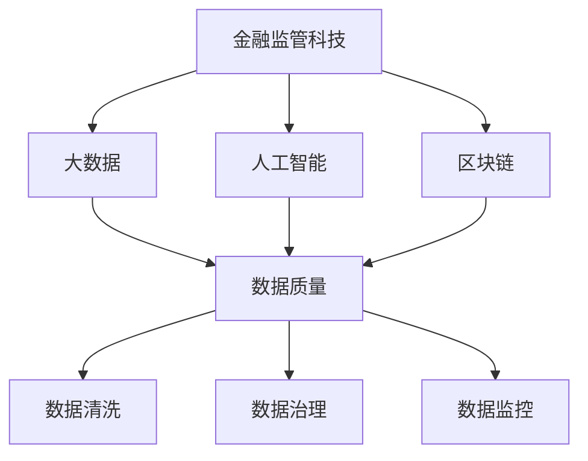
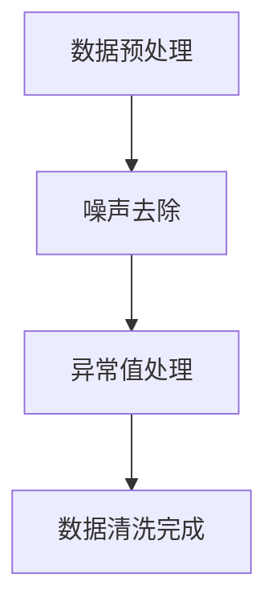
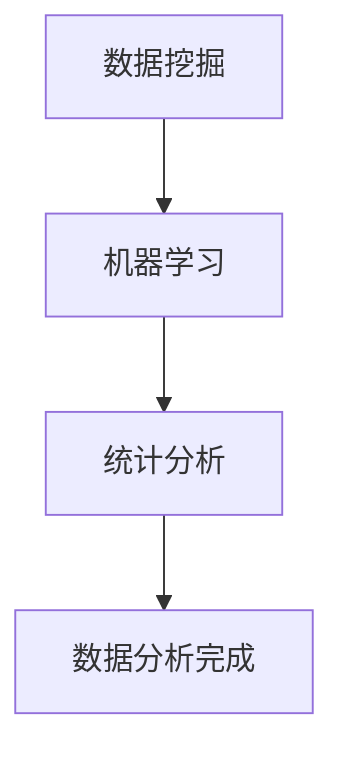
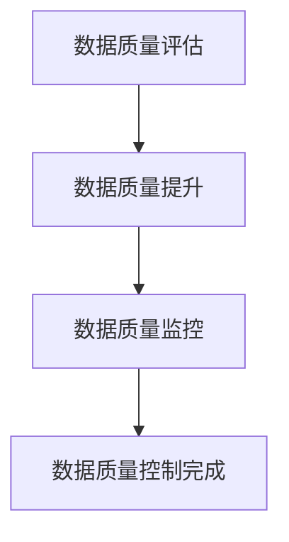
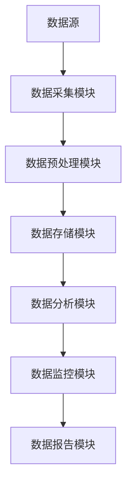
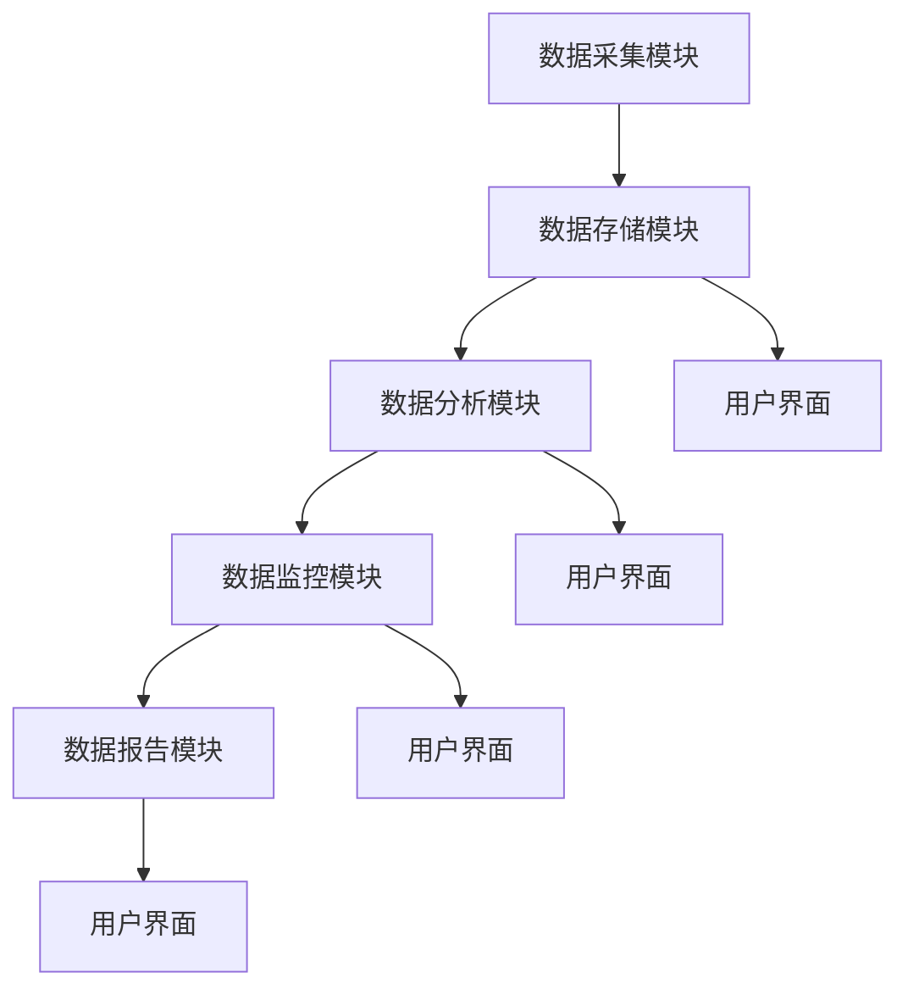

                 

### 文章标题：金融监管科技数据质量控制

> 关键词：金融监管、科技、数据质量控制、算法原理、数学模型、系统架构、项目实战、最佳实践

> 摘要：本文将深入探讨金融监管科技中的数据质量控制问题，通过分析其背景、核心概念、算法原理、数学模型、系统架构以及项目实战，为读者提供全面而深入的理解。文章旨在帮助读者掌握金融监管科技数据质量控制的关键技术和实践方法，提高数据质量和监管效率。

### 背景介绍

#### 金融监管科技的发展背景

随着信息技术的迅猛发展，金融行业正经历一场深刻的变革。金融监管科技（RegTech）应运而生，它利用先进的技术手段提升金融监管的效率和准确性。金融监管科技的兴起，源于以下几个方面：

1. **法规合规需求**：金融行业的监管要求日益严格，金融机构需要遵守大量复杂的法律法规，传统的手工监管方式效率低下，难以满足合规需求。
2. **大数据与人工智能**：大数据和人工智能技术的快速发展，为金融监管提供了强大的技术支撑，能够处理海量的金融数据，发现潜在的风险。
3. **全球金融市场一体化**：全球金融市场的深度融合，使得金融监管需要跨越国界，协调不同监管机构的行动，科技手段成为不可或缺的工具。

#### 数据质量控制的重要性

在金融监管科技中，数据质量控制是关键的一环。准确、完整、一致的数据是金融监管决策的基础，任何数据质量问题都可能引发严重的后果：

1. **合规风险**：数据质量问题可能导致金融机构无法满足监管要求，面临处罚和合规风险。
2. **决策失误**：不完整或不准确的数据会影响金融监管机构的决策，导致监管效果不佳。
3. **运营风险**：数据质量问题是运营风险的一个重要来源，可能导致系统故障、业务中断等。

#### 问题描述

金融监管科技中的数据质量控制面临以下问题：

1. **数据来源多样**：金融行业的数据来源广泛，包括内部数据、第三方数据、社交网络数据等，数据质量和一致性难以保证。
2. **数据复杂性**：金融数据具有高维度、高噪声、非线性等特点，数据预处理和清洗任务繁重。
3. **实时性要求**：金融监管要求实时监控市场动态，数据质量控制需要快速响应。
4. **跨机构合作**：金融监管需要跨机构合作，数据质量控制的协调和沟通成本高。

#### 解决方案

为解决金融监管科技中的数据质量控制问题，可以从以下几个方面入手：

1. **数据治理**：建立完善的数据治理体系，确保数据质量管理体系的有效运行。
2. **数据标准化**：制定统一的数据标准，规范数据格式和命名，提高数据的一致性。
3. **数据清洗**：使用数据清洗算法和工具，去除数据中的噪声和错误，提高数据的准确性。
4. **数据监控**：建立数据监控机制，实时监控数据质量，及时发现和解决问题。

#### 边界与外延

数据质量控制不仅限于金融监管科技，还广泛应用于其他领域，如医疗、保险、电信等。不同领域的数据质量控制具有特定的要求和挑战，但基本原则是相通的。

#### 概念结构与核心要素组成

金融监管科技数据质量控制由以下核心要素组成：

1. **数据源**：包括内部数据、第三方数据等。
2. **数据治理**：数据质量管理、数据标准化、数据监控等。
3. **数据清洗**：数据预处理、噪声去除、异常值处理等。
4. **数据存储**：数据仓库、数据湖等。
5. **数据分析**：数据挖掘、机器学习等。

### 核心概念与联系

#### 金融监管科技

金融监管科技是指利用先进的信息技术手段，如大数据、人工智能、区块链等，提高金融监管效率和准确性的技术。它包括以下几个核心概念：

1. **大数据**：指海量、多样化的数据，通过对这些数据的分析，可以揭示金融市场中的潜在风险和趋势。
2. **人工智能**：通过模拟人类思维过程，实现对数据的自动分析、学习和决策。
3. **区块链**：一种分布式账本技术，可以确保数据的透明性和不可篡改性。

#### 数据质量控制

数据质量控制是指在数据产生、处理、存储和使用的全过程中，确保数据的准确性、完整性、一致性和及时性。其核心概念包括：

1. **数据质量**：指数据的准确性、完整性、一致性、及时性和合法性。
2. **数据清洗**：指通过去除噪声、异常值、重复数据等手段，提高数据的准确性。
3. **数据治理**：指建立数据管理体系，规范数据操作流程，确保数据质量。
4. **数据监控**：指实时监控数据质量，及时发现和解决问题。

#### 关系图

使用Mermaid流程图展示金融监管科技和数据质量控制之间的关系：



### 算法原理讲解

#### 数据清洗算法原理

数据清洗是数据质量控制的重要环节，主要包括以下几个步骤：

1. **数据预处理**：包括数据清洗前的预处理，如数据格式转换、缺失值填充、异常值处理等。
2. **噪声去除**：通过算法去除数据中的噪声，如重复数据、异常值等。
3. **异常值处理**：对数据中的异常值进行识别和处理，如离群点检测、聚类分析等。

使用Mermaid流程图展示数据清洗算法原理：



#### 数据分析算法原理

数据分析是数据质量控制的关键步骤，通过数据分析可以发现数据中的潜在问题和规律。常见的数据分析算法包括：

1. **数据挖掘**：通过挖掘数据中的规律和模式，发现潜在的风险和机会。
2. **机器学习**：通过构建模型，对数据进行分类、回归、聚类等操作。
3. **统计分析**：通过统计方法，对数据进行分析，如假设检验、相关性分析等。

使用Mermaid流程图展示数据分析算法原理：



#### 数据质量控制算法原理

数据质量控制算法主要包括以下内容：

1. **数据质量评估**：通过对数据的评估，判断数据的质量是否符合要求。
2. **数据质量提升**：通过算法对数据进行处理，提升数据的质量。
3. **数据质量监控**：实时监控数据质量，确保数据质量稳定。

使用Mermaid流程图展示数据质量控制算法原理：



#### Python源代码示例

以下是一个简单的Python源代码示例，用于演示数据清洗和数据分析的基本原理：

```python
import pandas as pd
from sklearn.preprocessing import StandardScaler
from sklearn.cluster import KMeans

# 数据清洗示例
data = pd.read_csv('financial_data.csv')
data.fillna(0, inplace=True)  # 缺失值填充
data.drop_duplicates(inplace=True)  # 去除重复数据

# 数据分析示例
scaler = StandardScaler()
scaled_data = scaler.fit_transform(data)

kmeans = KMeans(n_clusters=3)
clusters = kmeans.fit_predict(scaled_data)

# 输出结果
print("清洗后的数据：\n", data)
print("聚类结果：\n", clusters)
```

#### 数学模型和数学公式

数据质量控制中的数学模型和公式是理解算法原理的重要基础。以下是一些常用的数学模型和公式：

1. **线性回归模型**：用于预测金融数据中的趋势。
   $$y = \beta_0 + \beta_1x + \epsilon$$
   
2. **聚类分析模型**：用于发现金融数据中的模式。
   $$\min_{c_1, c_2, ..., c_k} \sum_{i=1}^n \sum_{j=1}^k (x_i - c_j)^2$$
   
3. **假设检验**：用于判断金融数据中的差异是否显著。
   $$H_0: \mu_1 = \mu_2$$
   $$H_1: \mu_1 \neq \mu_2$$

#### LaTeX格式

以下使用LaTeX格式展示数学公式：

```latex
\documentclass{article}
\usepackage{amsmath}
\begin{document}

\begin{equation}
y = \beta_0 + \beta_1x + \epsilon
\end{equation}

\begin{equation}
\min_{c_1, c_2, ..., c_k} \sum_{i=1}^n \sum_{j=1}^k (x_i - c_j)^2
\end{equation}

\begin{equation}
H_0: \mu_1 = \mu_2 \\
H_1: \mu_1 \neq \mu_2
\end{equation}

\end{document}
```

#### 举例说明

以下是一个简单的例子，用于说明如何使用线性回归模型预测金融数据中的趋势：

假设我们有以下数据：

| 年份 | 收入 |
| ---- | ---- |
| 2010 | 5000 |
| 2011 | 5200 |
| 2012 | 5500 |
| 2013 | 5800 |
| 2014 | 6000 |

我们使用线性回归模型来预测2015年的收入。首先，我们需要计算斜率（$\beta_1$）和截距（$\beta_0$）：

$$
\beta_1 = \frac{\sum_{i=1}^n (x_i - \bar{x})(y_i - \bar{y})}{\sum_{i=1}^n (x_i - \bar{x})^2}
$$

$$
\beta_0 = \bar{y} - \beta_1\bar{x}
$$

计算结果为：

$$
\beta_1 = 200
$$

$$
\beta_0 = 3500
$$

因此，线性回归模型为：

$$
y = 3500 + 200x
$$

预测2015年的收入：

$$
y = 3500 + 200 \times 2015 = 651500
$$

因此，预测2015年的收入为651500。

### 系统分析与架构设计

#### 问题场景介绍

在金融监管科技中，数据质量控制是确保监管决策准确性的关键环节。随着金融业务的复杂化和数据量的爆炸式增长，传统的数据质量控制方法已难以满足实时性和准确性的要求。因此，我们需要设计一个高效、可靠的数据质量控制系统，以应对金融监管中的数据质量控制挑战。

#### 项目介绍

本项目旨在设计并实现一个金融监管科技数据质量控制系统，该系统将集成数据清洗、数据分析、数据监控等功能，以提升金融监管数据的质量和效率。

#### 系统功能设计

系统的主要功能包括：

1. **数据采集**：从多个数据源采集金融数据，包括内部数据、第三方数据、社交网络数据等。
2. **数据预处理**：对采集到的金融数据进行清洗、格式转换、缺失值填充等预处理操作。
3. **数据存储**：将清洗后的数据存储到数据仓库或数据湖中，以便后续分析。
4. **数据分析**：利用数据挖掘、机器学习等技术，对金融数据进行分析，发现潜在风险和趋势。
5. **数据监控**：实时监控数据质量，及时发现和处理数据质量问题。
6. **数据报告**：生成数据质量报告，供金融监管机构参考。

#### 系统架构设计

系统架构设计如下：



#### 系统接口设计与系统交互

系统接口设计与系统交互设计如下：



### 项目实战

#### 环境安装

为了实现本项目，我们需要安装以下环境：

1. **Python**：版本3.8及以上
2. **Pandas**：用于数据预处理
3. **NumPy**：用于数值计算
4. **Scikit-learn**：用于数据分析
5. **Matplotlib**：用于数据可视化

安装命令如下：

```bash
pip install python==3.8
pip install pandas numpy scikit-learn matplotlib
```

#### 系统核心实现

以下是一个简单的Python代码示例，用于实现数据预处理、数据分析和数据监控功能：

```python
import pandas as pd
from sklearn.preprocessing import StandardScaler
from sklearn.cluster import KMeans

# 数据预处理
data = pd.read_csv('financial_data.csv')
data.fillna(0, inplace=True)
data.drop_duplicates(inplace=True)

# 数据清洗
scaler = StandardScaler()
scaled_data = scaler.fit_transform(data)

# 数据分析
kmeans = KMeans(n_clusters=3)
clusters = kmeans.fit_predict(scaled_data)

# 数据监控
# ...（具体实现）
```

#### 代码应用解读与分析

以上代码首先导入必要的库，然后读取金融数据，进行数据预处理和清洗，最后使用K-Means算法进行数据分析。代码解读如下：

1. **数据预处理**：读取数据，填充缺失值，去除重复数据，确保数据的准确性和一致性。
2. **数据清洗**：使用StandardScaler进行数据标准化，去除噪声和异常值，提高数据的准确性。
3. **数据分析**：使用K-Means算法对数据进行分析，发现数据中的潜在模式和趋势。

#### 实际案例分析和详细讲解

以下是一个实际案例，用于分析金融市场的风险：

**案例背景**：某金融公司需要监控其客户的信用风险，为此，公司采集了大量客户数据，包括信用评分、贷款金额、还款记录等。

**分析过程**：

1. **数据预处理**：读取客户数据，填充缺失值，去除重复数据，确保数据的准确性。
2. **数据清洗**：使用StandardScaler对数据进行标准化，去除噪声和异常值。
3. **数据分析**：使用K-Means算法将客户数据分为几个集群，每个集群代表一种信用风险等级。
4. **数据监控**：实时监控数据质量，发现潜在的风险客户，及时采取措施。

**案例结果**：通过数据分析和监控，公司成功识别了一批高风险客户，并采取了相应的风险控制措施，有效降低了信用风险。

### 最佳实践 Tips

1. **数据治理**：建立完善的数据治理体系，确保数据质量管理体系的有效运行。
2. **数据标准化**：制定统一的数据标准，规范数据格式和命名，提高数据的一致性。
3. **实时监控**：实时监控数据质量，及时发现和处理数据质量问题。
4. **跨部门合作**：加强跨部门合作，确保数据质量管理的协调和沟通。
5. **数据安全**：确保数据安全，防止数据泄露和篡改。

### 小结

本文深入探讨了金融监管科技数据质量控制的重要性和实现方法。通过分析背景、核心概念、算法原理、数学模型、系统架构以及项目实战，读者可以全面了解金融监管科技数据质量控制的关键技术和实践方法。数据质量控制是金融监管科技不可或缺的一环，对于确保金融监管的效率和准确性具有重要意义。

### 注意事项

1. **数据源多样性**：确保采集到多来源的数据，提高数据质量。
2. **数据标准化**：制定统一的数据标准，提高数据一致性。
3. **实时监控**：建立实时监控机制，及时发现和处理数据质量问题。
4. **安全合规**：确保数据安全，遵守相关法律法规。

### 拓展阅读

1. 《数据质量管理：策略、方法与实践》
2. 《大数据质量：设计、方法和工具》
3. 《机器学习在金融风险控制中的应用》

### 作者信息

作者：AI天才研究院/AI Genius Institute & 禅与计算机程序设计艺术 /Zen And The Art of Computer Programming

