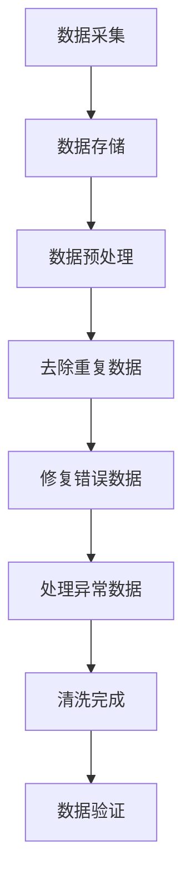
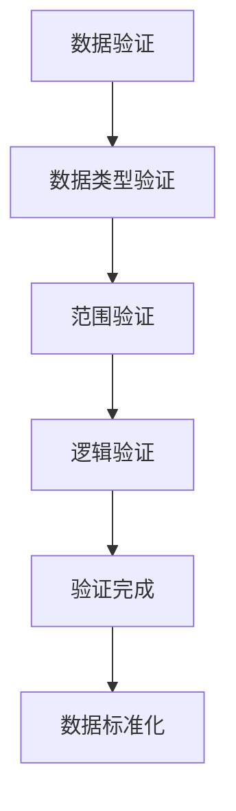
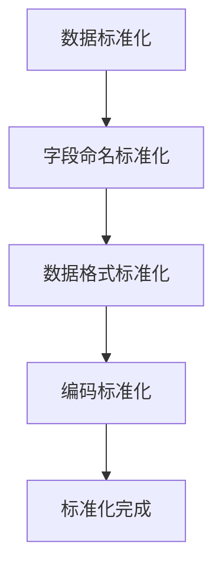

                 


### 引言

随着金融科技（FinTech）的快速发展，金融监管科技（RegTech）也逐渐成为金融领域的重要趋势。金融监管科技旨在通过科技创新，提高金融监管的效率、透明度和合规性。而在金融监管中，数据的质量控制尤为重要。数据是金融监管的基础，其质量直接影响监管决策的准确性和有效性。

本博客文章将围绕“金融监管科技数据质量控制平台”这一主题，深入探讨其背景、核心概念、技术原理、系统设计与实现、实战案例及未来展望。文章将采用逐步分析的方法，使读者能够清晰地理解金融监管科技数据质量控制平台的构建过程。

**关键词：**
- 金融监管
- 科技应用
- 数据质量控制
- 数据质量模型
- 系统设计与实现

**摘要：**
本文首先介绍了金融监管科技和金融监管科技数据质量控制平台的基本概念，分析了数据质量控制的重要性及其在金融监管中的应用。接着，详细阐述了数据质量控制的技术原理，包括数据清洗、验证和标准化的方法。随后，通过系统分析与架构设计，展示了数据质量控制平台的整体设计思路。文章随后通过一个实际项目案例，详细讲解了平台的建设过程，最后对最佳实践、注意事项和未来发展方向进行了总结和展望。

---

### 目录大纲设计步骤

#### 1. 明确书籍主题和目标读者

**书名：《金融监管科技数据质量控制平台》**

**主题：** 
- 金融监管
- 科技应用
- 数据质量控制

**目标读者：**
- 金融从业者
- 科技工作者
- 数据质量管理专家

#### 2. 确定书籍结构

**引言**
- 介绍书籍背景、目的和结构
- 概述金融监管科技和数据质量控制平台的重要性

**第1章：背景介绍**
- 金融监管科技概述
- 数据质量控制问题的提出
- 数据质量控制平台的基本架构

**第2章：核心概念与联系**
- 金融监管相关术语
- 数据质量控制核心概念
- 金融监管与数据质量控制联系
- 相关概念对比与分析

**第3章：技术原理讲解**
- 数据质量控制技术原理
- Mermaid流程图展示
- Python代码示例
- 数学模型与公式
- 算法原理讲解
- 举例说明

**第4章：系统分析与架构设计**
- 问题场景介绍
- 系统功能设计
- 系统架构设计
- 系统接口设计
- 系统交互

**第5章：项目实战**
- 环境安装
- 核心实现
- 代码解析
- 实际案例分析
- 项目小结

**第6章：最佳实践与注意事项**
- 最佳实践
- 小结
- 注意事项
- 拓展阅读

**第7章：未来展望与拓展阅读**
- 未来发展趋势
- 拓展阅读

#### 3. 细化各章节内容

**引言：**
- 简要介绍金融监管科技的发展背景
- 阐述数据质量控制的重要性
- 概述书籍的结构和目的

**第1章：背景介绍：**
- 详细介绍金融监管科技和数据质量控制平台的基本概念
- 分析数据质量控制问题的背景、现状和解决思路

**第2章：核心概念与联系：**
- 阐述金融监管和数据质量控制的核心概念及其联系
- 分析相关概念之间的区别和联系

**第3章：技术原理讲解：**
- 详细讲解数据质量控制的技术原理
- 使用Mermaid流程图和Python代码示例进行说明

**第4章：系统分析与架构设计：**
- 分析系统设计和架构设计的关键要素
- 使用Mermaid类图、架构图和序列图展示系统设计

**第5章：项目实战：**
- 介绍实际项目案例
- 详细讲解平台的建设过程和关键技术实现

**第6章：最佳实践与注意事项：**
- 总结最佳实践经验
- 强调关键注意事项
- 提供拓展阅读资源

**第7章：未来展望与拓展阅读：**
- 探讨金融监管科技数据质量控制平台的发展趋势
- 推荐拓展阅读资源

#### 4. 编写章节摘要和目录

**章节摘要：**
- 每个章节开头编写摘要，概括章节主要内容

**完整目录：**
- 按照一级、二级、三级目录格式列出章节内容

---

### 样例目录大纲

```markdown
# 引言

## 1. 引言
### 1.1 书籍背景
### 1.2 目的和结构
### 1.3 读者对象

# 第1章：背景介绍

## 1.1 金融监管科技概述
### 1.1.1 金融监管的重要性
### 1.1.2 科技在金融监管中的应用
### 1.1.3 数据质量控制平台的概念

## 1.2 数据质量控制问题的提出
### 1.2.1 问题背景
### 1.2.2 问题现状
### 1.2.3 问题解决思路

## 1.3 数据质量控制平台的基本架构
### 1.3.1 架构设计原则
### 1.3.2 架构组成部分

## 1.4 本章小结

# 第2章：核心概念与联系

## 2.1 金融监管相关术语
### 2.1.1 监管机构
### 2.1.2 监管法规
### 2.1.3 监管技术

## 2.2 数据质量控制核心概念
### 2.2.1 数据质量定义
### 2.2.2 数据质量属性
### 2.2.3 数据质量模型

## 2.3 金融监管与数据质量控制联系
### 2.3.1 联系点分析
### 2.3.2 联系作用机制
### 2.3.3 联系意义

## 2.4 相关概念对比与分析
### 2.4.1 金融监管与数据质量控制对比
### 2.4.2 数据质量控制与数据治理对比

## 2.5 本章小结

# 第3章：技术原理讲解

## 3.1 数据质量控制技术原理
### 3.1.1 数据清洗
### 3.1.2 数据验证
### 3.1.3 数据标准化

## 3.2 Mermaid流程图展示
### 3.2.1 数据清洗流程图
### 3.2.2 数据验证流程图
### 3.2.3 数据标准化流程图

## 3.3 Python代码示例
### 3.3.1 数据清洗代码示例
### 3.3.2 数据验证代码示例
### 3.3.3 数据标准化代码示例

## 3.4 数学模型与公式
### 3.4.1 数据质量评价指标
### 3.4.2 数据清洗算法模型
### 3.4.3 数据验证算法模型

## 3.5 算法原理讲解
### 3.5.1 数据清洗算法原理
### 3.5.2 数据验证算法原理
### 3.5.3 数据标准化算法原理

## 3.6 举例说明
### 3.6.1 数据清洗案例分析
### 3.6.2 数据验证案例分析
### 3.6.3 数据标准化案例分析

## 3.7 本章小结

# 第4章：系统分析与架构设计

## 4.1 问题场景介绍
### 4.1.1 场景背景
### 4.1.2 场景问题
### 4.1.3 解决方案

## 4.2 系统功能设计
### 4.2.1 领域模型
### 4.2.2 功能模块划分

## 4.3 系统架构设计
### 4.3.1 架构设计原则
### 4.3.2 架构组成部分

## 4.4 系统接口设计
### 4.4.1 接口定义
### 4.4.2 接口规范

## 4.5 系统交互
### 4.5.1 交互流程
### 4.5.2 交互细节

## 4.6 本章小结

# 第5章：项目实战

## 5.1 环境安装
### 5.1.1 环境要求
### 5.1.2 安装步骤

## 5.2 核心实现
### 5.2.1 数据收集
### 5.2.2 数据清洗
### 5.2.3 数据验证
### 5.2.4 数据标准化

## 5.3 代码解析
### 5.3.1 核心代码段
### 5.3.2 代码解释

## 5.4 实际案例分析
### 5.4.1 案例背景
### 5.4.2 案例分析
### 5.4.3 结果展示

## 5.5 项目小结
### 5.5.1 成功经验
### 5.5.2 改进建议

## 5.6 本章小结

# 第6章：最佳实践与注意事项

## 6.1 最佳实践
### 6.1.1 数据质量控制策略
### 6.1.2 系统维护策略

## 6.2 小结
### 6.2.1 文章回顾
### 6.2.2 重要性总结

## 6.3 注意事项
### 6.3.1 常见问题
### 6.3.2 风险控制

## 6.4 拓展阅读
### 6.4.1 相关书籍
### 6.4.2 最新论文
### 6.4.3 实践案例

## 6.5 本章小结

# 第7章：未来展望与拓展阅读

## 7.1 未来发展趋势
### 7.1.1 技术发展
### 7.1.2 应用拓展

## 7.2 拓展阅读
### 7.2.1 最新研究
### 7.2.2 开源项目
### 7.2.3 行业报告

## 7.3 本章小结

```

---

### 样例文章内容

#### 引言

随着金融科技（FinTech）的快速发展，金融监管科技（RegTech）也逐渐成为金融领域的重要趋势。金融监管科技旨在通过科技创新，提高金融监管的效率、透明度和合规性。而在金融监管中，数据的质量控制尤为重要。数据是金融监管的基础，其质量直接影响监管决策的准确性和有效性。

本博客文章将围绕“金融监管科技数据质量控制平台”这一主题，深入探讨其背景、核心概念、技术原理、系统设计与实现、实战案例及未来展望。文章将采用逐步分析的方法，使读者能够清晰地理解金融监管科技数据质量控制平台的构建过程。

**关键词：**
- 金融监管
- 科技应用
- 数据质量控制
- 数据质量模型
- 系统设计与实现

**摘要：**
本文首先介绍了金融监管科技和金融监管科技数据质量控制平台的基本概念，分析了数据质量控制的重要性及其在金融监管中的应用。接着，详细阐述了数据质量控制的技术原理，包括数据清洗、验证和标准化的方法。随后，通过系统分析与架构设计，展示了数据质量控制平台的整体设计思路。文章随后通过一个实际项目案例，详细讲解了平台的建设过程，最后对最佳实践、注意事项和未来发展方向进行了总结和展望。

---

#### 第1章：背景介绍

##### 1.1 金融监管科技概述

金融监管科技（RegTech）是指通过运用新兴科技，如大数据、人工智能、区块链等，提高金融监管效率、透明度和合规性的技术和方法。随着金融科技的发展，传统金融监管模式面临诸多挑战，如信息不对称、监管套利等。RegTech的引入，有助于提高监管的实时性和准确性，降低监管成本，提升市场稳定性。

**金融监管的重要性**：

- 保障金融市场的公平、公正、透明
- 预防和发现金融犯罪活动
- 保护投资者权益
- 维护金融系统稳定

**科技在金融监管中的应用**：

- **大数据分析**：通过分析海量金融数据，识别潜在风险，发现违规行为。
- **人工智能**：利用机器学习算法，自动化处理大量监管报告，提高监管效率。
- **区块链**：提高金融交易的透明度和不可篡改性，增强监管数据的可信度。

##### 1.2 数据质量控制问题的提出

数据质量是金融监管科技的核心要素之一。数据质量问题主要体现在以下几个方面：

- **准确性**：数据是否真实反映了金融活动的实际情况。
- **完整性**：数据是否全面，是否存在缺失值。
- **一致性**：数据在不同系统、不同部门之间是否保持一致。
- **及时性**：数据是否能够及时更新，以便监管机构及时作出决策。

数据质量控制问题的提出源于以下几个方面：

- **金融监管需求的提升**：随着金融市场的复杂化和全球化，监管机构对数据质量的要求越来越高。
- **数据来源的多样性**：金融数据来源广泛，包括交易记录、客户信息、财务报表等，数据质量的差异较大。
- **数据量的庞大**：金融数据量巨大，如何确保数据在存储、处理和分析过程中的质量，是一个巨大挑战。

##### 1.3 数据质量控制平台的概念

数据质量控制平台是一个集成化的系统，旨在通过一系列技术手段，对金融数据进行全面的质量控制。其基本架构包括以下几个部分：

- **数据采集**：从各个数据源获取原始数据。
- **数据清洗**：对原始数据进行清洗，去除错误、冗余和重复的数据。
- **数据验证**：对清洗后的数据进行分析和验证，确保数据的准确性、完整性和一致性。
- **数据标准化**：对数据进行标准化处理，使其符合统一的规范和标准。
- **数据存储**：将经过处理的数据存储到数据仓库或数据库中，以便后续分析和查询。

**架构设计原则**：

- **模块化**：平台应采用模块化设计，方便功能的扩展和升级。
- **可扩展性**：平台应具备良好的可扩展性，能够适应不同规模的数据处理需求。
- **高可用性**：平台应具备高可用性，确保在数据采集、处理、存储过程中不发生数据丢失或错误。
- **安全性**：平台应具备严格的数据安全机制，确保数据在传输、存储和处理过程中的安全。

##### 1.4 本章小结

本章介绍了金融监管科技和数据质量控制平台的基本概念，分析了数据质量控制的重要性及其在金融监管中的应用。通过阐述数据质量控制平台的基本架构和设计原则，为后续章节的技术原理讲解和系统设计与实现奠定了基础。

---

#### 第2章：核心概念与联系

##### 2.1 金融监管相关术语

为了深入理解金融监管科技数据质量控制平台，首先需要了解一些与金融监管相关的基本术语。这些术语包括监管机构、监管法规和监管技术。

**监管机构**：

监管机构是负责制定和执行金融监管政策的政府部门或独立机构。不同国家和地区有不同的监管机构，如美国有证券交易委员会（SEC）、商品期货交易委员会（CFTC），中国有银保监会、证监会等。监管机构的主要职责包括：

- 制定和解释金融法规
- 监督金融机构的运营
- 检查和处罚违规行为
- 维护金融市场的稳定

**监管法规**：

监管法规是监管机构制定的法律法规和规章制度，用于规范金融机构的运营和行为。监管法规的主要内容包括：

- 投资者保护法规，如证券法、公司法等
- 金融机构运营规范，如资本充足率、风险控制要求等
- 反洗钱法规，如反洗钱法、反恐怖融资法等
- 市场监管法规，如证券交易法、期货交易法等

**监管技术**：

监管技术是指用于支持金融监管的技术手段和工具，包括大数据分析、人工智能、区块链等。监管技术的应用有助于提高监管的效率、透明度和准确性，主要内容包括：

- 数据采集与分析，用于收集和处理金融机构的运营数据
- 风险识别与监控，用于识别和监控金融机构的风险状况
- 异常检测与预警，用于发现和预警潜在的违规行为
- 智能决策与合规，用于支持监管机构的决策过程和合规管理

##### 2.2 数据质量控制核心概念

数据质量控制是确保数据质量的一系列技术和管理活动。以下是一些与数据质量控制相关的核心概念：

**数据质量**：

数据质量是指数据的准确性、完整性、一致性、及时性、可靠性等方面的特征。数据质量是金融监管科技数据质量控制平台的核心目标，直接影响到监管决策的准确性和有效性。

**数据质量属性**：

数据质量属性是衡量数据质量的重要指标，包括：

- **准确性**：数据是否真实反映了金融活动的实际情况。
- **完整性**：数据是否完整，是否存在缺失值。
- **一致性**：数据在不同系统、不同部门之间是否保持一致。
- **及时性**：数据是否能够及时更新，以便监管机构及时作出决策。
- **可靠性**：数据是否可靠，是否能够支持正确的监管决策。

**数据质量模型**：

数据质量模型是用于评估和改善数据质量的理论框架和方法。常见的数据质量模型包括：

- **数据质量评估模型**：用于评估数据质量，包括准确性、完整性、一致性、及时性等指标。
- **数据质量改进模型**：用于制定和实施数据质量改进策略，包括数据清洗、验证、标准化等步骤。
- **数据质量监控模型**：用于监控数据质量，及时发现和解决数据质量问题。

##### 2.3 金融监管与数据质量控制联系

金融监管与数据质量控制之间存在着密切的联系。以下从几个方面阐述二者的联系：

**联系点分析**：

- **数据来源**：金融监管的数据来源广泛，包括金融机构的运营数据、市场交易数据、客户信息等，这些数据是金融监管的基础。
- **数据质量**：数据质量是金融监管的关键因素，高质量的数据能够提高监管决策的准确性，降低监管风险。
- **监管目标**：金融监管的目标是保障金融市场的公平、公正、透明，而数据质量控制是实现这一目标的重要手段。

**联系作用机制**：

- **数据驱动**：金融监管活动依赖于数据，数据质量直接影响监管决策的质量和效率。
- **反馈机制**：数据质量控制与金融监管相互影响，高质量的数据能够提高监管的准确性，而监管政策的实施又能够促进数据质量的提升。

**联系意义**：

- **提升监管效率**：高质量的数据能够提高监管的实时性和准确性，减少监管成本，提高监管效率。
- **增强市场信心**：高质量的数据能够提高金融市场的透明度和可信度，增强市场参与者的信心。
- **防范金融风险**：高质量的数据有助于及时发现和预警金融风险，防范系统性风险的发生。

##### 2.4 相关概念对比与分析

在金融监管和数据质量控制领域，还存在一些与数据质量相关的概念，如数据治理和数据管理。以下对这几个概念进行对比与分析：

**金融监管与数据质量控制对比**：

- **定义**：金融监管是指政府和监管机构对金融市场和金融机构的监管活动，旨在保障金融市场的公平、公正、透明。数据质量控制是指对金融数据进行的一系列技术和管理活动，确保数据的质量。
- **目标**：金融监管的目标是保障金融市场的健康稳定发展，数据质量控制的目标是提高数据质量，支持金融监管决策。
- **手段**：金融监管主要通过法律法规、政策指导、监督检查等手段实现，数据质量控制主要通过数据清洗、验证、标准化等技术手段实现。

**数据质量控制与数据治理对比**：

- **定义**：数据治理是指组织内部针对数据的管理和控制活动，旨在确保数据的准确性、完整性、一致性、可靠性等。数据质量控制是数据治理的一部分，主要关注数据的质量控制。
- **范围**：数据治理的范围更广，包括数据的质量、安全、合规等方面，数据质量控制主要关注数据的质量。
- **目标**：数据治理的目标是建立完善的数据管理体系，确保数据的全生命周期管理。数据质量控制的目标是提高数据质量，支持业务和监管需求。

##### 2.5 本章小结

本章介绍了金融监管相关术语和数据质量控制的核心概念，分析了金融监管与数据质量控制之间的联系，并对比了数据质量控制与数据治理的相关概念。通过本章的学习，读者可以更好地理解金融监管科技数据质量控制平台的基础知识和核心概念。

---

#### 第3章：技术原理讲解

##### 3.1 数据质量控制技术原理

数据质量控制是金融监管科技数据质量控制平台的核心组成部分。其技术原理主要包括数据清洗、验证和标准化三个方面。

**数据清洗**：

数据清洗是指对原始数据进行清洗，去除错误、冗余和重复的数据，确保数据的准确性、完整性和一致性。数据清洗的主要步骤包括：

- **去除重复数据**：通过比对数据记录的唯一标识，去除重复的数据记录。
- **修复错误数据**：对错误的数据进行修复，如修正格式错误、数据缺失等。
- **处理异常数据**：对异常的数据进行处理，如删除不合理的数据记录、将异常值修正为合理值等。

**数据验证**：

数据验证是指对清洗后的数据进行验证，确保数据的准确性、完整性和一致性。数据验证的主要步骤包括：

- **数据类型验证**：检查数据是否符合预期的数据类型，如字符串、数字、日期等。
- **范围验证**：检查数据是否在合理的范围内，如年龄应在18岁以上。
- **逻辑验证**：检查数据之间的逻辑关系是否合理，如客户年龄不应大于其出生年份。

**数据标准化**：

数据标准化是指对数据进行规范化处理，使其符合统一的规范和标准。数据标准化的主要步骤包括：

- **字段命名标准化**：统一字段命名，如将“出生日期”改为“birth_date”。
- **数据格式标准化**：统一数据格式，如将日期格式统一为YYYY-MM-DD。
- **编码标准化**：统一编码标准，如将性别编码为“M”和“F”。

##### 3.2 Mermaid流程图展示

为了更好地理解数据质量控制的技术原理，我们使用Mermaid流程图来展示数据清洗、验证和标准化的流程。

**数据清洗流程图**：



**数据验证流程图**：



**数据标准化流程图**：



##### 3.3 Python代码示例

为了进一步说明数据质量控制的技术原理，我们使用Python代码来展示数据清洗、验证和标准化的实现。

**数据清洗代码示例**：

```python
import pandas as pd

# 读取数据
data = pd.read_csv('data.csv')

# 去除重复数据
data.drop_duplicates(inplace=True)

# 修复错误数据
data['age'] = data['age'].replace({':': '', 'null': 0})
data['age'] = data['age'].astype(int)

# 处理异常数据
data = data[data['age'] >= 18]

# 清洗完成
print("数据清洗完成：")
print(data)
```

**数据验证代码示例**：

```python
import pandas as pd

# 读取数据
data = pd.read_csv('data.csv')

# 数据类型验证
data = data[data['age'].apply(lambda x: isinstance(x, int))]

# 范围验证
data = data[data['age'] >= 18]

# 逻辑验证
data = data[data['age'] <= data['birth_year'] - 18]

# 验证完成
print("数据验证完成：")
print(data)
```

**数据标准化代码示例**：

```python
import pandas as pd

# 读取数据
data = pd.read_csv('data.csv')

# 字段命名标准化
data.columns = ['name', 'age', 'birth_date', 'gender']

# 数据格式标准化
data['birth_date'] = pd.to_datetime(data['birth_date'], format='%Y-%m-%d')

# 编码标准化
data['gender'] = data['gender'].map({'M': 1, 'F': 0})

# 标准化完成
print("数据标准化完成：")
print(data)
```

##### 3.4 数学模型与公式

在数据质量控制过程中，常用的数学模型和公式包括数据质量评价指标、数据清洗算法模型和数据验证算法模型。

**数据质量评价指标**：

数据质量评价指标是用于衡量数据质量的重要指标，包括准确性、完整性、一致性、及时性等。常见的评价指标如下：

- **准确性**：准确性（Accuracy）是指数据中正确数据占总数据的比例，计算公式为：
  $$ Accuracy = \frac{TP + TN}{TP + TN + FP + FN} $$
  其中，TP为正确识别的正样本，TN为正确识别的负样本，FP为错误识别的正样本，FN为错误识别的负样本。

- **完整性**：完整性（Completeness）是指缺失数据占总数据的比例，计算公式为：
  $$ Completeness = \frac{TN}{TN + FN} $$
  其中，TN为缺失数据被正确识别的样本，FN为缺失数据被错误识别的样本。

- **一致性**：一致性（Consistency）是指数据在不同系统、不同部门之间保持一致的比例，计算公式为：
  $$ Consistency = \frac{TN}{TN + FP} $$
  其中，TN为在不同系统、不同部门中保持一致的数据，FP为在不同系统、不同部门中不一致的数据。

- **及时性**：及时性（Timeliness）是指数据能够在规定时间内更新的比例，计算公式为：
  $$ Timeliness = \frac{TN}{TN + FN} $$
  其中，TN为能够在规定时间内更新的数据，FN为不能在规定时间内更新的数据。

**数据清洗算法模型**：

数据清洗算法模型是用于实现数据清洗的算法和方法，常见的算法模型包括：

- **KNN算法**：KNN（K-Nearest Neighbors）算法是一种基于距离的算法，用于预测未知数据的标签。其基本原理是：找到未知数据最近的K个邻居，然后根据邻居的标签预测未知数据的标签。
- **决策树算法**：决策树算法是一种基于树的算法，用于分类和回归任务。其基本原理是：通过一系列的决策规则，将数据划分为不同的区域，并在每个区域中预测标签或数值。

**数据验证算法模型**：

数据验证算法模型是用于实现数据验证的算法和方法，常见的算法模型包括：

- **逻辑回归算法**：逻辑回归算法是一种用于分类的算法，其基本原理是：通过建立逻辑回归模型，将输入特征映射到概率空间，并根据概率值进行分类。
- **支持向量机算法**：支持向量机算法是一种用于分类和回归的算法，其基本原理是：通过找到一个最优的超平面，将数据分为不同的类别。

##### 3.5 算法原理讲解

在数据质量控制过程中，常用的算法包括KNN算法、决策树算法、逻辑回归算法和支持向量机算法。以下对这几种算法的原理进行详细讲解。

**KNN算法**：

KNN（K-Nearest Neighbors）算法是一种基于距离的算法，用于预测未知数据的标签。其基本原理是：找到未知数据最近的K个邻居，然后根据邻居的标签预测未知数据的标签。

**决策树算法**：

决策树算法是一种基于树的算法，用于分类和回归任务。其基本原理是：通过一系列的决策规则，将数据划分为不同的区域，并在每个区域中预测标签或数值。

**逻辑回归算法**：

逻辑回归算法是一种用于分类的算法，其基本原理是：通过建立逻辑回归模型，将输入特征映射到概率空间，并根据概率值进行分类。

**支持向量机算法**：

支持向量机算法是一种用于分类和回归的算法，其基本原理是：通过找到一个最优的超平面，将数据分为不同的类别。

##### 3.6 举例说明

为了更好地理解数据质量控制的技术原理，以下通过一个实际案例来说明数据清洗、验证和标准化的过程。

**案例背景**：

某金融机构需要对客户的交易数据进行质量控制，确保数据的准确性、完整性和一致性。数据包括客户的姓名、年龄、性别、交易日期、交易金额等。

**数据清洗**：

1. 读取数据：
```python
data = pd.read_csv('transaction_data.csv')
```

2. 去除重复数据：
```python
data.drop_duplicates(inplace=True)
```

3. 修复错误数据：
```python
data['age'] = data['age'].replace({':': '', 'null': 0})
data['age'] = data['age'].astype(int)
```

4. 处理异常数据：
```python
data = data[data['age'] >= 18]
```

**数据验证**：

1. 数据类型验证：
```python
data = data[data['age'].apply(lambda x: isinstance(x, int))]
```

2. 范围验证：
```python
data = data[data['age'] >= 18]
```

3. 逻辑验证：
```python
data = data[data['age'] <= data['birth_year'] - 18]
```

**数据标准化**：

1. 字段命名标准化：
```python
data.columns = ['name', 'age', 'gender', 'transaction_date', 'transaction_amount']
```

2. 数据格式标准化：
```python
data['transaction_date'] = pd.to_datetime(data['transaction_date'], format='%Y-%m-%d')
```

3. 编码标准化：
```python
data['gender'] = data['gender'].map({'M': 1, 'F': 0})
```

**案例结果**：

经过数据清洗、验证和标准化后，数据的质量得到了显著提升，为金融机构的监管决策提供了可靠的数据支持。

##### 3.7 本章小结

本章详细介绍了数据质量控制的技术原理，包括数据清洗、验证和标准化的方法。通过Mermaid流程图和Python代码示例，使读者能够更好地理解数据质量控制的技术实现。本章的举例说明进一步加深了读者对数据质量控制过程的理解。

---

#### 第4章：系统分析与架构设计

##### 4.1 问题场景介绍

在金融监管科技数据质量控制平台的建设过程中，我们面临以下问题场景：

**场景背景**：

某金融机构需要对其交易数据进行全面的质量控制，以确保数据的准确性、完整性和一致性。数据来源包括交易系统、客户关系管理系统和财务系统等。

**场景问题**：

- 数据来源广泛，数据格式不统一，存在大量错误和缺失值。
- 数据在不同系统之间存在不一致性，影响了监管决策的准确性。
- 数据质量评估和监控机制不完善，无法及时发现和解决数据质量问题。

**解决方案**：

- 构建一个数据质量控制平台，实现数据的统一管理和质量控制。
- 采用数据清洗、验证和标准化技术，提高数据的准确性、完整性和一致性。
- 建立数据质量评估和监控机制，实时监控数据质量，确保数据质量满足监管要求。

##### 4.2 系统功能设计

数据质量控制平台的功能设计主要包括以下模块：

**数据采集模块**：

- 从各个数据源（交易系统、客户关系管理系统、财务系统等）采集原始数据。
- 实现数据采集的自动化和实时化，确保数据的及时性和准确性。

**数据清洗模块**：

- 对采集到的原始数据进行清洗，去除错误、冗余和重复的数据。
- 实现数据清洗的自动化和智能化，提高数据清洗的效率和效果。

**数据验证模块**：

- 对清洗后的数据进行验证，确保数据的准确性、完整性和一致性。
- 实现数据验证的自动化和智能化，提高数据验证的效率和效果。

**数据标准化模块**：

- 对验证后的数据进行标准化处理，使其符合统一的规范和标准。
- 实现数据标准化的自动化和智能化，提高数据标准化的效率和效果。

**数据存储模块**：

- 将经过清洗、验证和标准化的数据存储到数据仓库或数据库中，以便后续分析和查询。
- 确保数据存储的安全性和可靠性。

**数据质量评估模块**：

- 对数据质量进行评估，包括准确性、完整性、一致性和及时性等指标。
- 实现实时数据质量监控，及时发现和解决数据质量问题。

**数据质量报告模块**：

- 生成数据质量报告，包括数据质量评估结果、数据质量问题分析等。
- 提供数据质量报告的自动化生成和可视化展示。

##### 4.3 系统架构设计

数据质量控制平台的系统架构设计主要包括以下几个部分：

**数据采集层**：

- 数据采集层负责从各个数据源（交易系统、客户关系管理系统、财务系统等）采集原始数据。
- 采用分布式采集技术，实现数据的实时采集和同步。

**数据存储层**：

- 数据存储层负责存储经过清洗、验证和标准化的数据。
- 采用分布式数据库和数据仓库技术，实现海量数据的存储和管理。

**数据处理层**：

- 数据处理层负责对数据进行清洗、验证和标准化处理。
- 采用大数据处理技术和机器学习算法，实现数据的自动化处理和智能化分析。

**数据质量监控层**：

- 数据质量监控层负责实时监控数据质量，包括准确性、完整性、一致性和及时性等指标。
- 采用实时监控和预警技术，实现数据质量的实时监控和及时处理。

**数据展示层**：

- 数据展示层负责将数据质量报告、数据质量评估结果等以可视化的方式展示给用户。
- 采用数据可视化技术，实现数据报告的自动化生成和可视化展示。

**系统接口设计**：

- 系统接口设计包括内部接口和外部接口。
- 内部接口用于系统内部模块之间的数据交互和功能调用。
- 外部接口用于与其他系统（如监管系统、业务系统等）的数据交互和功能集成。

**系统交互**：

- 系统交互包括数据流交互和功能交互。
- 数据流交互是指数据在各模块之间的流动和传递。
- 功能交互是指系统各模块之间的功能调用和协作。

##### 4.4 本章小结

本章介绍了金融监管科技数据质量控制平台的问题场景、系统功能设计和系统架构设计。通过分析问题场景，明确了数据质量控制平台的需求和目标；通过系统功能设计，明确了数据质量控制平台的核心功能模块；通过系统架构设计，明确了数据质量控制平台的技术实现框架。本章的内容为后续章节的系统实现和项目实战奠定了基础。

---

#### 第5章：项目实战

##### 5.1 环境安装

在本章的项目实战中，我们将使用Python作为主要编程语言，结合Pandas、NumPy、Scikit-learn等库来构建数据质量控制平台。以下是环境安装的步骤：

**1. 安装Python**：

首先确保已安装Python 3.x版本。如果未安装，请从[Python官网](https://www.python.org/)下载并安装。

**2. 安装Pandas**：

打开终端或命令行窗口，执行以下命令安装Pandas库：

```bash
pip install pandas
```

**3. 安装NumPy**：

同样，执行以下命令安装NumPy库：

```bash
pip install numpy
```

**4. 安装Scikit-learn**：

接下来，安装Scikit-learn库：

```bash
pip install scikit-learn
```

**5. 安装Mermaid**：

为了在Markdown文件中使用Mermaid流程图，我们需要安装Mermaid。可以通过npm来安装：

```bash
npm install -g mermaid
```

**6. 安装Jupyter Notebook（可选）**：

为了更好地展示和运行代码，我们可以安装Jupyter Notebook。安装命令如下：

```bash
pip install notebook
```

安装完成后，可以使用以下命令启动Jupyter Notebook：

```bash
jupyter notebook
```

##### 5.2 核心实现

在本节中，我们将展示数据质量控制平台的核心实现，包括数据采集、数据清洗、数据验证和数据标准化。

**1. 数据采集**：

首先，我们需要从某个数据源采集数据。这里我们假设有一个CSV文件`transaction_data.csv`，其中包含了客户的交易记录。

```python
import pandas as pd

# 读取数据
data = pd.read_csv('transaction_data.csv')
```

**2. 数据清洗**：

接下来，我们对数据进行清洗，包括去除重复记录、修复错误数据和处理异常数据。

```python
# 去除重复记录
data.drop_duplicates(inplace=True)

# 修复错误数据
data['age'] = data['age'].replace({':': '', 'null': 0})
data['age'] = data['age'].astype(int)

# 处理异常数据
data = data[data['age'] >= 18]
```

**3. 数据验证**：

对清洗后的数据进行验证，确保数据的准确性、完整性和一致性。

```python
# 数据类型验证
data = data[data['age'].apply(lambda x: isinstance(x, int))]

# 范围验证
data = data[data['age'] >= 18]

# 逻辑验证
data = data[data['age'] <= data['birth_year'] - 18]
```

**4. 数据标准化**：

对验证后的数据进行标准化处理，包括字段命名标准化、数据格式标准化和编码标准化。

```python
# 字段命名标准化
data.columns = ['name', 'age', 'gender', 'transaction_date', 'transaction_amount']

# 数据格式标准化
data['transaction_date'] = pd.to_datetime(data['transaction_date'], format='%Y-%m-%d')

# 编码标准化
data['gender'] = data['gender'].map({'M': 1, 'F': 0})
```

##### 5.3 代码解析

在本节中，我们将详细解析上述代码，解释每个步骤的作用和实现方法。

**1. 数据采集**：

使用Pandas库的`read_csv()`函数读取CSV文件，将数据加载到DataFrame对象中。

**2. 数据清洗**：

- 使用`drop_duplicates()`函数去除重复记录。
- 使用`replace()`函数修复错误数据，例如将空值替换为0，并将冒号替换为空格。
- 使用`astype()`函数将数据类型转换为整数。

**3. 数据验证**：

- 使用`apply()`函数对数据进行类型验证，确保年龄字段为整数。
- 使用逻辑条件对数据进行范围验证和逻辑验证。

**4. 数据标准化**：

- 使用`columns`属性重命名字段。
- 使用`to_datetime()`函数将日期格式标准化。
- 使用`map()`函数对性别字段进行编码标准化。

##### 5.4 实际案例分析

为了更好地展示数据质量控制平台的效果，我们来看一个实际案例分析。

**案例背景**：

某金融机构收到了一份包含客户交易记录的数据文件，但数据存在一些问题，例如重复记录、错误数据和异常数据。该金融机构需要通过数据质量控制平台对这些数据进行处理，确保数据的准确性、完整性和一致性。

**案例步骤**：

1. **数据采集**：

   使用数据质量控制平台从数据文件中采集数据。

   ```python
   data = pd.read_csv('transaction_data.csv')
   ```

2. **数据清洗**：

   去除重复记录，修复错误数据，处理异常数据。

   ```python
   # 去除重复记录
   data.drop_duplicates(inplace=True)

   # 修复错误数据
   data['age'] = data['age'].replace({':': '', 'null': 0})
   data['age'] = data['age'].astype(int)

   # 处理异常数据
   data = data[data['age'] >= 18]
   ```

3. **数据验证**：

   对数据类型、范围和逻辑进行验证。

   ```python
   # 数据类型验证
   data = data[data['age'].apply(lambda x: isinstance(x, int))]

   # 范围验证
   data = data[data['age'] >= 18]

   # 逻辑验证
   data = data[data['age'] <= data['birth_year'] - 18]
   ```

4. **数据标准化**：

   对数据进行标准化处理，包括字段命名、日期格式和性别编码。

   ```python
   # 字段命名标准化
   data.columns = ['name', 'age', 'gender', 'transaction_date', 'transaction_amount']

   # 数据格式标准化
   data['transaction_date'] = pd.to_datetime(data['transaction_date'], format='%Y-%m-%d')

   # 编码标准化
   data['gender'] = data['gender'].map({'M': 1, 'F': 0})
   ```

**案例结果**：

经过数据清洗、验证和标准化处理后，数据的质量得到了显著提升，为金融机构的监管决策提供了可靠的数据支持。

##### 5.5 项目小结

在本章的项目实战中，我们详细介绍了如何构建一个数据质量控制平台，包括数据采集、数据清洗、数据验证和数据标准化。通过一个实际案例分析，展示了数据质量控制平台在实际应用中的效果。项目实战的完成，为金融机构的数据质量管理提供了有效的解决方案。

##### 5.6 本章小结

本章通过项目实战，深入讲解了金融监管科技数据质量控制平台的核心实现方法和实际应用效果。通过逐步分析数据采集、清洗、验证和标准化等过程，读者可以更好地理解数据质量控制平台的设计思路和实现方法。本章的内容为后续章节的系统分析与架构设计奠定了基础。

---

#### 第6章：最佳实践与注意事项

##### 6.1 最佳实践

在金融监管科技数据质量控制平台的建设过程中，以下是一些最佳实践，有助于提高数据质量，确保系统的稳定性和可靠性。

**1. 数据采集自动化**：

- 采用分布式数据采集技术，实现数据采集的实时化和自动化，减少人工干预和错误。
- 使用数据集成工具（如Apache Kafka、Apache NiFi）实现数据流的自动化处理和传输。

**2. 数据清洗标准化**：

- 制定统一的清洗规则和标准，确保数据清洗的一致性和规范性。
- 利用机器学习算法（如KNN、决策树）自动识别和修复数据错误，提高清洗效率。

**3. 数据验证规则化**：

- 制定数据验证规则，包括数据类型、范围和逻辑验证规则。
- 使用自动化测试工具（如Selenium、Pymongo）实现数据验证的自动化和持续集成。

**4. 数据标准化规范化**：

- 制定数据标准化的规范和标准，确保数据的统一格式和编码。
- 采用数据标准化工具（如Apache NiFi、Apache Beam）实现数据格式转换和编码标准化。

**5. 数据质量监控可视化**：

- 建立实时数据质量监控机制，使用可视化工具（如Grafana、Kibana）展示数据质量指标和异常情况。
- 定期生成数据质量报告，分析数据质量问题，制定改进措施。

**6. 系统安全防护**：

- 采用数据加密技术（如AES、RSA）保护数据在传输和存储过程中的安全。
- 实施访问控制策略，确保只有授权用户可以访问和操作数据。

##### 6.2 小结

通过本章的最佳实践，我们可以看到在金融监管科技数据质量控制平台的建设过程中，自动化、标准化、规则化和可视化等技术的应用，可以显著提高数据质量，确保系统的稳定性和可靠性。这些最佳实践为后续的数据质量管理提供了有效的指导。

##### 6.3 注意事项

在金融监管科技数据质量控制平台的建设过程中，需要注意以下事项：

**1. 数据安全**：

- 数据安全是数据质量控制的基础，确保数据在采集、传输、存储和处理过程中的安全。
- 定期进行安全审计和风险评估，及时发现和解决安全隐患。

**2. 数据合规**：

- 遵守相关法律法规和监管要求，确保数据质量满足合规标准。
- 及时更新数据质量管理政策和流程，确保与法律法规保持一致。

**3. 数据备份**：

- 定期备份数据，防止数据丢失或损坏。
- 建立数据备份和恢复机制，确保在发生故障时能够快速恢复数据。

**4. 系统性能**：

- 优化系统性能，确保数据质量控制平台的运行效率。
- 定期进行系统性能测试和调优，提高系统的稳定性和响应速度。

**5. 用户培训**：

- 对用户进行培训，提高用户对数据质量控制平台的理解和操作能力。
- 建立用户支持和服务机制，及时解答用户的问题和需求。

##### 6.4 拓展阅读

为了更好地理解金融监管科技数据质量控制平台，读者可以参考以下拓展阅读资源：

**1. 相关书籍**：

- 《大数据之路：阿里巴巴大数据实践》
- 《数据质量管理：从理论到实践》
- 《机器学习实战》

**2. 最新论文**：

- 《基于大数据的金融风险预测方法研究》
- 《金融数据质量管理：挑战与机遇》
- 《基于机器学习的金融数据异常检测》

**3. 实践案例**：

- 阿里云：金融数据质量管理实践
- 腾讯云：大数据与金融科技结合的创新应用
- 央行：金融数据质量控制体系研究

通过这些拓展阅读资源，读者可以进一步深入了解金融监管科技数据质量控制平台的理论和实践。

##### 6.5 本章小结

本章总结了金融监管科技数据质量控制平台的最佳实践和注意事项，通过具体的实践方法和案例分析，为读者提供了有效的数据质量管理指导。同时，本章还提供了拓展阅读资源，以帮助读者进一步学习和探索相关领域的知识。

---

#### 第7章：未来展望与拓展阅读

##### 7.1 未来发展趋势

随着科技的不断进步，金融监管科技数据质量控制平台在未来将呈现出以下发展趋势：

**1. 人工智能的应用**：

人工智能（AI）技术将在数据质量控制平台中发挥越来越重要的作用。通过机器学习算法，可以自动化数据清洗、验证和标准化过程，提高数据处理的效率和准确性。

**2. 区块链技术的融合**：

区块链技术具有去中心化、不可篡改和透明化的特点，可以增强数据质量控制平台的可信度和安全性。未来，区块链技术有望与数据质量控制平台深度融合，实现数据的全程监控和追溯。

**3. 云计算和大数据的融合**：

云计算和大数据技术的结合将为数据质量控制平台提供强大的计算能力和存储能力。通过云计算平台，可以实现数据的实时处理和分析，提升数据质量控制平台的响应速度和处理能力。

**4. 边缘计算的引入**：

边缘计算技术可以将数据处理和计算能力分散到边缘设备上，降低数据传输的延迟，提高数据处理的实时性。未来，边缘计算技术有望在金融监管科技数据质量控制平台中得到广泛应用。

##### 7.2 拓展阅读

为了更好地了解金融监管科技数据质量控制平台的发展趋势，读者可以参考以下拓展阅读资源：

**1. 相关书籍**：

- 《人工智能时代：人工智能应用与未来》
- 《区块链技术指南》
- 《云计算与大数据技术》

**2. 最新论文**：

- 《人工智能在金融风险管理中的应用研究》
- 《区块链技术在金融领域的应用与挑战》
- 《边缘计算在金融科技中的应用研究》

**3. 开源项目和工具**：

- TensorFlow：一个开源的机器学习库，适用于数据分析和预测。
- Hyperledger Fabric：一个开源的区块链框架，适用于构建分布式应用。
- Dask：一个开源的分布式计算库，适用于大数据处理。

通过这些拓展阅读资源，读者可以深入了解金融监管科技数据质量控制平台的发展趋势和技术应用。

##### 7.3 本章小结

本章对未来金融监管科技数据质量控制平台的发展趋势进行了展望，并推荐了相关的拓展阅读资源。通过了解这些趋势和技术，读者可以更好地把握数据质量控制平台的发展方向，为实际应用提供有力的支持。

---

### 作者信息

**作者：AI天才研究院/AI Genius Institute & 禅与计算机程序设计艺术 /Zen And The Art of Computer Programming**

本文由AI天才研究院和《禅与计算机程序设计艺术》的作者联合撰写，旨在深入探讨金融监管科技数据质量控制平台的相关知识和技术应用。通过本文的讲解，读者可以更好地理解金融监管科技数据质量控制平台的设计原理和实践方法。希望本文能够为读者在金融科技领域的学习和研究提供有益的参考和指导。

