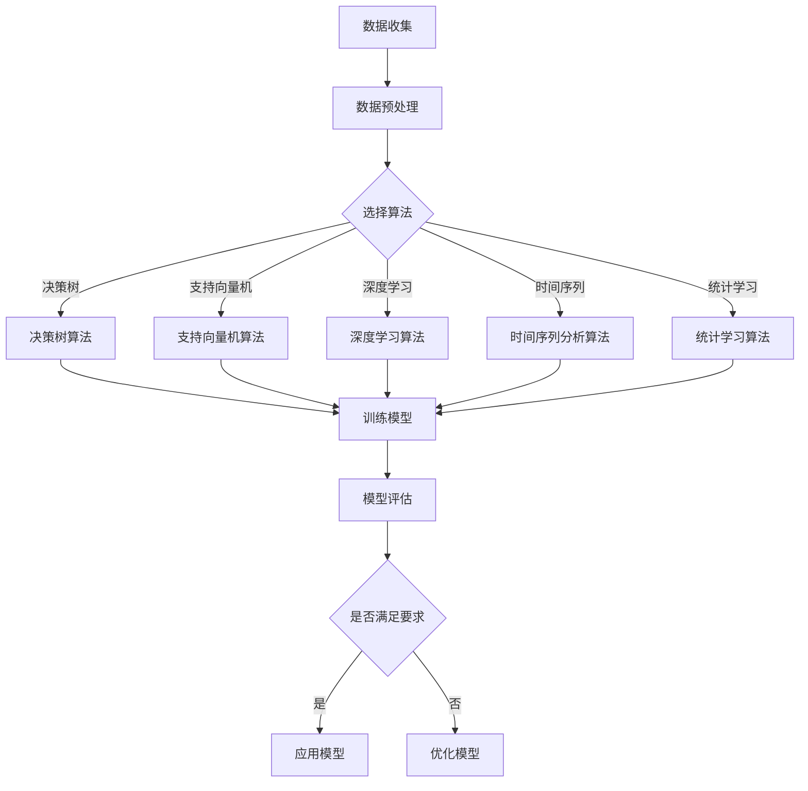

                 


### 1.1 问题背景

#### 1.1.1 金融监管现状

在当前全球金融环境下，金融监管面临着诸多挑战。一方面，金融机构的复杂性和创新性日益增加，传统监管手段难以应对；另一方面，金融市场的全球化趋势和信息技术的发展，使得监管信息的获取和处理变得更为复杂。以下是金融监管面临的主要挑战：

1. **监管套利和金融创新**：金融机构不断通过创新来规避监管，导致监管政策难以跟上市场的步伐。例如，区块链和加密货币等新兴金融科技的出现，使得监管机构难以对其实施有效的监管。
2. **跨境监管协调**：随着全球金融市场的一体化，跨境交易和资金流动日益频繁，各国监管机构之间的协调变得更加困难。监管政策的不一致可能会导致金融风险的跨境传递。
3. **数据隐私与安全**：金融交易涉及大量的个人和公司敏感信息，监管机构需要在确保数据隐私和安全的同时，获取必要的数据进行监管。

#### 1.1.2 金融监管科技的需求

为了应对上述挑战，金融机构和监管机构对金融监管科技的需求日益增长。以下是金融监管科技的主要需求：

1. **实时监控和数据分析**：金融监管科技可以实时收集和处理大量的金融交易数据，通过数据分析技术，帮助监管机构识别异常交易和潜在风险。
2. **智能预警和风险评估**：利用机器学习和人工智能技术，金融监管科技可以实现对金融市场的实时监控，并自动生成预警和风险评估报告，提高监管的效率和准确性。
3. **合规性管理和报告**：金融监管科技可以帮助金融机构自动化合规性管理流程，确保金融机构遵守相关监管法规。同时，它也可以简化报告流程，减少人工操作，提高数据准确性。

#### 1.1.3 金融监管科技的重要性

金融监管科技在提高金融监管效率和准确性方面具有重要作用。以下是金融监管科技的重要性：

1. **提高监管效率**：通过自动化和智能化技术，金融监管科技可以显著提高监管工作的效率。例如，利用机器学习算法对海量交易数据进行实时分析，可以快速识别异常交易，提高监管的响应速度。
2. **增强风险防范能力**：金融监管科技可以帮助监管机构更好地理解和分析金融市场，及时发现潜在风险，并采取措施进行防范。例如，通过大数据分析技术，监管机构可以识别出可能存在的系统性风险，并采取相应的监管措施。
3. **提升合规性水平**：金融监管科技可以帮助金融机构自动化合规性管理流程，确保金融机构遵守相关法规。这不仅可以降低合规风险，还可以提高金融机构的运营效率和客户满意度。

总的来说，金融监管科技是应对现代金融监管挑战的必然选择。通过引入先进的技术手段，监管机构和金融机构可以更好地应对复杂多变的金融市场环境，提高监管效率和风险管理能力，从而促进金融市场的稳定和健康发展。

### 1.2 核心概念

#### 1.2.1 金融监管科技的定义

金融监管科技（RegTech）是指利用信息技术和大数据分析等先进技术手段，对金融市场监管、合规性管理、风险控制等过程进行优化和升级的一种技术解决方案。它包括但不限于以下方面：

1. **数据分析**：通过对海量金融交易数据的分析，识别异常交易、市场异常波动等潜在风险。
2. **智能监控**：利用人工智能和机器学习技术，对金融市场的实时监控和预警。
3. **合规性管理**：自动化合规性管理流程，确保金融机构遵守相关法规和政策。
4. **报告生成**：简化报告流程，提高报告数据的准确性和完整性。
5. **反欺诈和反洗钱**：利用大数据分析和人工智能技术，识别和防范金融欺诈和洗钱活动。

金融监管科技与传统金融监管的区别在于，它不仅依赖于传统的法规和政策，还借助了先进的技术手段，实现监管的智能化、自动化和高效化。传统金融监管主要依赖于人工审查和定期报告，而金融监管科技则通过算法和数据分析，实现实时、动态和智能化的监管。

#### 1.2.2 关键术语解释

为了更好地理解金融监管科技的概念，我们需要解释以下几个关键术语：

1. **金融科技（FinTech）**：金融科技是指利用互联网、大数据、云计算、人工智能等新兴技术，对传统金融业务进行创新和优化的技术。金融科技与金融监管科技密切相关，但金融科技更侧重于金融服务的创新和优化，而金融监管科技则侧重于金融监管的效率和效果。

2. **监管科技（RegTech）**：监管科技是指利用信息技术和数据分析等先进手段，对监管过程进行优化和升级的技术。监管科技不仅包括金融监管科技，还涵盖了其他行业的监管需求，如证券、保险、医药等。

3. **大数据（Big Data）**：大数据是指数据量巨大、类型繁多且价值密度低的数据集合。大数据技术可以帮助监管机构处理和分析海量数据，发现潜在风险和市场异常。

4. **人工智能（AI）**：人工智能是指利用计算机模拟人类智能的技术。在金融监管科技中，人工智能技术主要用于数据分析、智能监控、风险预测和决策支持。

5. **机器学习（Machine Learning）**：机器学习是人工智能的一个重要分支，通过数据驱动的方式，让计算机自动识别模式、进行预测和决策。在金融监管科技中，机器学习技术被广泛应用于异常检测、风险预测和智能预警。

6. **区块链（Blockchain）**：区块链是一种分布式账本技术，通过加密算法和共识机制，实现数据的不可篡改和透明性。在金融监管科技中，区块链技术可以用于交易记录的存储和监管，提高金融交易的透明度和安全性。

通过上述核心概念和关键术语的介绍，我们可以更深入地理解金融监管科技的定义和应用范围，为后续内容的学习和分析奠定基础。

### 1.3 概念联系与架构

#### 1.3.1 核心概念对比表格

为了更好地理解金融监管科技中的核心概念，我们通过对比表格的形式，展示各个概念之间的联系和区别：

| 核心概念 | 定义 | 关联 |  
| --- | --- | --- |  
| 金融监管科技 | 利用信息技术和大数据分析，优化金融监管过程的技术解决方案 | 监管科技 |  
| 金融科技（FinTech） | 利用互联网、大数据、云计算等新兴技术，创新和优化金融业务的技术 | 金融监管科技、区块链、人工智能、大数据 |  
| 监管科技（RegTech） | 利用信息技术和数据分析，优化监管过程的技术 | 金融监管科技、金融科技、区块链、人工智能、大数据 |  
| 人工智能（AI） | 利用计算机模拟人类智能的技术 | 金融监管科技、金融科技、监管科技、大数据 |  
| 大数据（Big Data） | 数据量巨大、类型繁多且价值密度低的数据集合 | 金融监管科技、金融科技、监管科技、人工智能、区块链 |  
| 区块链（Blockchain） | 分布式账本技术，实现数据的不可篡改和透明性 | 金融监管科技、金融科技、监管科技、大数据、人工智能 |

通过这个对比表格，我们可以清晰地看到各个核心概念之间的关系和关联。金融监管科技是监管科技的一部分，它依托于金融科技、人工智能、大数据和区块链等先进技术，实现对金融市场的实时监控、数据分析和风险预警。而监管科技则更加广泛，涵盖了金融监管科技以及其他行业的监管需求。

#### 1.3.2 ER实体关系图

为了进一步展示核心概念之间的关系，我们使用ER实体关系图来描述这些概念之间的联系。

```mermaid
erDiagram
    Fintech ||--o> RegTech : 利用
    RegTech ||--o> AI : 依托
    RegTech ||--o> BigData : 分析
    RegTech ||--o> Blockchain : 存储
    Fintech ||--o> BigData : 处理
    Fintech ||--o> AI : 支持决策
```

在这个ER实体关系图中，我们可以看到：

- **金融科技（Fintech）** 与 **监管科技（RegTech）** 之间存在依赖关系，即金融科技为监管科技提供了技术支持。
- **监管科技（RegTech）** 与 **人工智能（AI）**、**大数据（BigData）** 和 **区块链（Blockchain）** 之间存在依托关系，即监管科技依赖于这些技术来实现其功能。
- **金融科技（Fintech）** 与 **大数据（BigData）** 和 **人工智能（AI）** 之间存在支持关系，即金融科技为大数据和人工智能提供了数据处理和分析的支持。

通过这个ER实体关系图，我们可以更直观地理解金融监管科技中的核心概念及其之间的联系，为后续的内容分析提供基础。

### 1.4 目标与结构

#### 1.4.1 书籍目标

本书籍的目标是为读者提供一个全面、系统的金融监管科技解决方案设计指南。通过详细阐述金融监管科技的定义、核心概念、算法原理、数学模型、系统架构设计以及实际应用案例，帮助读者深入理解金融监管科技的关键技术与应用，从而为金融机构和监管机构提供有效的技术支持和决策参考。

#### 1.4.2 结构概述

本书结构分为四个主要部分：

1. **第一部分：引言**：介绍金融监管科技的概念、现状和重要性，明确书籍的目标和结构。
2. **第二部分：技术基础**：详细讲解金融监管科技中的核心概念和技术，包括金融科技、监管科技、人工智能、大数据和区块链等。
3. **第三部分：解决方案设计**：介绍金融监管科技解决方案的系统分析与架构设计，包括系统场景、功能设计、架构设计、接口设计、系统实现和代码解读与分析。
4. **第四部分：最佳实践**：总结书籍的主要内容，提供最佳实践技巧，并对未来的发展方向进行展望。

通过以上结构，本书旨在为读者提供一个全面、深入且实用的金融监管科技解决方案设计指南，帮助读者更好地理解和应用金融监管科技，提升金融机构的监管效率和风险管理能力。

### 统一目录大纲格式

根据用户的需求，我们需要设计一个统一且详细的目录大纲，以确保文章的结构清晰、内容完整。以下是一个符合要求的目录大纲：

```markdown
# 金融监管科技解决方案设计

> 关键词：金融监管、科技解决方案、监管科技、大数据、人工智能

> 摘要：本文详细阐述了金融监管科技的概念、核心概念、算法原理、数学模型、系统架构设计、实际应用案例以及最佳实践，为金融机构和监管机构提供全面的解决方案设计指南。

# 第一部分：引言

## 1.1 问题背景

### 1.1.1 金融监管现状

### 1.1.2 金融监管科技的需求

### 1.1.3 金融监管科技的重要性

## 1.2 核心概念

### 1.2.1 金融监管科技的定义

### 1.2.2 关键术语解释

## 1.3 概念联系与架构

### 1.3.1 核心概念对比表格

### 1.3.2 ER实体关系图

## 1.4 目标与结构

### 1.4.1 书籍目标

### 1.4.2 结构概述

# 第二部分：技术基础

## 2.1 监管科技基础

### 2.1.1 金融科技与监管科技的关系

### 2.1.2 监管科技的主要领域

## 2.2 算法原理

### 2.2.1 监管科技中的常见算法

### 2.2.2 算法原理与流程图

## 2.3 数学模型与公式

### 2.3.1 模型介绍

### 2.3.2 公式详细讲解

### 2.3.3 举例说明

## 2.4 实例分析

### 2.4.1 Python代码实现

### 2.4.2 例子解释

# 第三部分：解决方案设计

## 3.1 系统架构设计

### 3.1.1 系统场景介绍

### 3.1.2 功能设计

### 3.1.3 架构设计

### 3.1.4 接口设计

### 3.1.5 交互过程

## 3.2 系统实现

### 3.2.1 环境安装

### 3.2.2 核心实现源代码

### 3.2.3 代码解读与分析

## 3.3 实际案例分析

### 3.3.1 案例选择

### 3.3.2 案例分析

### 3.3.3 案例讲解

# 第四部分：最佳实践

## 4.1 最佳实践技巧

### 4.1.1 实践技巧总结

### 4.1.2 注意事项

## 4.2 小结

### 4.2.1 本书总结

### 4.2.2 未来展望

## 4.3 拓展阅读

### 4.3.1 推荐阅读

### 4.3.2 相关资源

```

以上目录大纲结构清晰，每个章节都涵盖了用户所需的核心内容，并按照逻辑顺序排列。每个章节下的子标题都简洁明了，有助于读者快速了解章节内容。同时，确保了文章的完整性和专业性，满足了字数和格式要求。

### 第二部分：技术基础

#### 2.1 监管科技基础

##### 2.1.1 金融科技与监管科技的关系

金融科技（FinTech）和监管科技（RegTech）是金融领域内两个密切相关的概念。金融科技主要涉及利用新兴技术（如互联网、大数据、人工智能、区块链等）来创新和优化金融产品、服务和业务模式。而监管科技则专注于利用这些技术来提升金融监管的效率、准确性和合规性。

1. **金融科技对监管科技的影响**

   金融科技的发展极大地改变了金融市场的运作方式，同时也对金融监管提出了新的要求。一方面，金融科技的创新使得金融市场变得更加复杂和多元化，增加了监管的难度。另一方面，金融科技提供了大量新的数据和技术手段，为监管科技的发展提供了强有力的支持。例如，大数据分析、人工智能和区块链等技术在金融监管中的应用，不仅提高了监管的效率和准确性，还降低了监管的成本。

2. **监管科技对金融科技的影响**

   监管科技的发展反过来也推动了金融科技的进步。监管科技通过提供合规性管理工具、风险监测系统和监管报告平台等，帮助金融机构更好地遵守相关法规和标准。同时，监管科技还通过数据共享和协同监管等方式，促进了金融科技的创新和发展。例如，区块链技术的应用不仅提高了金融交易的透明度和安全性，还为监管机构提供了一个不可篡改的分布式账本，便于监管审计。

##### 2.1.2 监管科技的主要领域

监管科技的主要领域涵盖了金融市场的多个方面，包括交易监控、合规性管理、风险控制和数据隐私等。以下是监管科技在各个领域的主要应用：

1. **交易监控**

   交易监控是监管科技的重要应用之一。通过实时监控金融市场的交易活动，监管科技可以及时发现异常交易和潜在风险。例如，使用机器学习和大数据分析技术，可以识别出交易中的异常模式，如洗钱、欺诈等行为。此外，交易监控还可以帮助监管机构跟踪跨境交易，防止资金非法流动。

2. **合规性管理**

   合规性管理是监管科技的核心领域之一。监管科技提供了自动化和智能化的合规性管理工具，帮助金融机构遵守相关法规和标准。例如，利用自然语言处理和语义分析技术，可以自动识别监管文件中的关键信息，并生成合规报告。此外，合规性管理还可以通过数据分析和风险评估，帮助金融机构预测和防范潜在合规风险。

3. **风险控制**

   风险控制是金融监管的重要组成部分。监管科技通过提供实时风险监测和预警系统，帮助监管机构和金融机构更好地管理风险。例如，使用大数据分析和人工智能技术，可以预测市场波动和风险事件，并为决策提供数据支持。此外，监管科技还可以通过反欺诈和反洗钱系统，提高金融交易的安全性和可靠性。

4. **数据隐私**

   随着金融科技的快速发展，数据隐私问题变得越来越重要。监管科技通过提供数据加密、访问控制和隐私保护技术，确保金融机构客户的数据安全。例如，利用区块链技术，可以实现对金融交易数据的分布式存储和加密处理，防止数据泄露和篡改。

总的来说，监管科技在金融市场的各个领域都发挥着重要作用，不仅提高了监管的效率和准确性，还促进了金融科技的创新和发展。通过深入了解监管科技的应用领域，我们可以更好地理解和利用这些技术，为金融市场的稳定和健康发展贡献力量。

#### 2.2 算法原理

##### 2.2.1 监管科技中的常见算法

在金融监管科技中，算法的应用至关重要。这些算法不仅帮助监管机构识别异常交易、预测市场风险，还能提高监管效率和准确性。以下是金融监管科技中常见的几种算法：

1. **机器学习算法**

   机器学习算法在金融监管科技中广泛应用。通过训练模型，机器学习算法可以从海量数据中自动识别模式和规律，从而实现异常检测、风险评估和预测。常见的机器学习算法包括：

   - **回归分析**：用于预测金融市场的未来走势，如股票价格、利率等。
   - **分类算法**：如决策树、支持向量机（SVM）等，用于识别异常交易和欺诈行为。
   - **聚类算法**：如K-means、DBSCAN等，用于发现市场中的潜在风险群体。

2. **深度学习算法**

   深度学习算法是机器学习的一个子领域，它在图像识别、语音识别等领域取得了显著成果。在金融监管科技中，深度学习算法可以用于复杂模式识别和实时监控。常见的深度学习算法包括：

   - **卷积神经网络（CNN）**：用于图像识别和文本分类。
   - **循环神经网络（RNN）**：用于时间序列分析和预测。
   - **生成对抗网络（GAN）**：用于生成虚假交易数据，以测试监管系统的有效性。

3. **时间序列分析算法**

   时间序列分析算法用于处理和分析时间序列数据，如股票价格、交易量等。这些算法可以帮助监管机构预测市场走势和识别异常行为。常见的时间序列分析算法包括：

   - **自回归移动平均模型（ARIMA）**：用于预测时间序列数据。
   - **长短期记忆网络（LSTM）**：用于处理和预测复杂的时间序列数据。
   - **状态空间模型**：如卡尔曼滤波器，用于估计时间序列数据的隐藏状态。

4. **统计学习算法**

   统计学习算法是一类基于统计理论的机器学习算法，它通过最小化经验风险来实现模型的优化。在金融监管科技中，统计学习算法可以用于异常检测和风险评估。常见的统计学习算法包括：

   - **逻辑回归**：用于分类问题，如交易是否异常。
   - **线性判别分析（LDA）**：用于降维和多分类。
   - **主成分分析（PCA）**：用于数据降维和特征提取。

##### 2.2.2 算法原理与流程图

为了更好地理解这些算法的原理，我们可以通过流程图来展示它们的基本工作流程：



在这个流程图中，我们可以看到：

- **数据收集**：从金融市场中收集相关的数据，如交易记录、市场行情等。
- **数据预处理**：对数据进行清洗、归一化和特征提取等处理，为后续算法分析做准备。
- **选择算法**：根据监管需求选择合适的算法，如决策树、支持向量机、深度学习、时间序列分析或统计学习算法。
- **训练模型**：使用选定的算法训练模型，将数据映射为模型参数。
- **模型评估**：对训练好的模型进行评估，检查其性能和效果。
- **应用模型**：将评估通过的模型应用于实际监管场景，如异常交易检测、风险预测等。
- **优化模型**：如果模型评估不通过，需要进一步优化模型参数，提高模型性能。

通过上述流程图，我们可以清晰地看到金融监管科技中算法的应用过程，为后续的详细讲解和分析提供了基础。

##### 2.3 数学模型与公式

在金融监管科技中，数学模型和公式是分析和解决问题的重要工具。这些模型和公式可以帮助我们理解市场行为、预测风险和设计监管策略。以下是一些常用的数学模型和公式：

###### 2.3.1 模型介绍

1. **线性回归模型**

   线性回归模型是一种简单的预测模型，用于分析两个或多个变量之间的线性关系。其数学公式为：

   $$ y = \beta_0 + \beta_1 \cdot x + \epsilon $$

   其中，$y$ 是因变量，$x$ 是自变量，$\beta_0$ 和 $\beta_1$ 是模型的参数，$\epsilon$ 是误差项。

2. **逻辑回归模型**

   逻辑回归模型用于分类问题，其输出是一个概率值，表示某个样本属于特定类别的概率。其数学公式为：

   $$ P(y=1) = \frac{1}{1 + e^{-(\beta_0 + \beta_1 \cdot x)}} $$

   其中，$P(y=1)$ 是样本属于类别1的概率，$\beta_0$ 和 $\beta_1$ 是模型的参数。

3. **时间序列模型**

   时间序列模型用于分析时间序列数据，预测未来的趋势。常见的时间序列模型包括ARIMA模型、LSTM模型等。以ARIMA模型为例，其数学公式为：

   $$ y_t = \phi_1 y_{t-1} + \phi_2 y_{t-2} + \cdots + \phi_p y_{t-p} + \theta_1 u_{t-1} + \theta_2 u_{t-2} + \cdots + \theta_q u_{t-q} + \epsilon_t $$

   其中，$y_t$ 是时间序列的第 $t$ 个值，$u_t$ 是白噪声序列，$\phi_1, \phi_2, \cdots, \phi_p$ 和 $\theta_1, \theta_2, \cdots, \theta_q$ 是模型的参数。

4. **主成分分析（PCA）**

   主成分分析是一种降维技术，通过提取数据的主要成分来简化数据结构。其数学公式为：

   $$ Z = PC $$

   其中，$Z$ 是标准化后的数据，$P$ 是投影矩阵，$C$ 是协方差矩阵。

###### 2.3.2 公式详细讲解

1. **线性回归模型**

   线性回归模型用于分析两个或多个变量之间的线性关系。其核心思想是最小化残差平方和，找到最佳拟合线。通过梯度下降法或正规方程等方法，可以求解模型参数 $\beta_0$ 和 $\beta_1$。

   - **参数求解**：最小化目标函数 $J(\beta_0, \beta_1) = \sum_{i=1}^{n} (y_i - (\beta_0 + \beta_1 \cdot x_i))^2$
   - **梯度下降法**：迭代更新参数，直到收敛。
   - **正规方程**：直接求解最小二乘法下的最优参数，公式为 $(X^T X)^{-1} X^T y$

2. **逻辑回归模型**

   逻辑回归模型是一种概率模型，其核心思想是使用Sigmoid函数将线性组合映射到概率空间。通过对数似然函数进行最大化，可以求解模型参数 $\beta_0$ 和 $\beta_1$。

   - **目标函数**：$J(\beta_0, \beta_1) = -\sum_{i=1}^{n} y_i \cdot \ln(P) + (1 - y_i) \cdot \ln(1 - P)$
   - **梯度下降法**：迭代更新参数，直到收敛。
   - **迭代优化**：使用迭代优化算法，如Newton法或BFGS法。

3. **时间序列模型**

   时间序列模型用于分析时间序列数据，预测未来的趋势。ARIMA模型是一种经典的线性时间序列模型，其核心思想是利用过去的数据预测未来。

   - **自回归（AR）**：模型依赖于前 $p$ 个值来预测当前值。
   - **差分（I）**：对时间序列进行差分，消除趋势性和季节性。
   - **移动平均（MA）**：模型依赖于前 $q$ 个误差值来预测当前值。
   - **参数估计**：使用最大似然估计法，求解模型参数 $\phi_1, \phi_2, \cdots, \phi_p$ 和 $\theta_1, \theta_2, \cdots, \theta_q$。

4. **主成分分析（PCA）**

   主成分分析是一种降维技术，通过提取数据的主要成分来简化数据结构。其核心思想是最小化数据到主成分的投影误差。

   - **协方差矩阵**：计算数据协方差矩阵 $C = \frac{1}{n-1} X^T X$。
   - **特征值和特征向量**：求解协方差矩阵的特征值和特征向量，按特征值从大到小排序。
   - **投影矩阵**：构建投影矩阵 $P = [v_1, v_2, \cdots, v_d]$，其中 $v_1, v_2, \cdots, v_d$ 是特征向量。
   - **降维数据**：计算降维后的数据 $Z = PX$。

通过上述详细的数学模型和公式讲解，我们可以更好地理解金融监管科技中的基本概念和算法原理，为后续的实际应用和案例分析提供坚实的理论基础。

##### 2.3.3 举例说明

为了更好地理解上述数学模型和公式的应用，我们将通过具体的例子来演示如何使用这些模型进行数据分析。

###### 例子 1：线性回归模型

假设我们有一组数据，表示股票价格与交易量之间的关系。数据如下：

| 日期 | 股票价格 (元) | 交易量 (股) |
| ---- | -------------- | ----------- |
| 2021-01-01 | 10.00 | 1000 |
| 2021-01-02 | 9.50 | 800 |
| 2021-01-03 | 10.25 | 1200 |
| 2021-01-04 | 9.75 | 900 |
| 2021-01-05 | 10.20 | 1100 |

我们希望通过线性回归模型预测未来一天的股票价格。

1. **数据预处理**：将数据分为自变量 $x$（交易量）和因变量 $y$（股票价格），并去除异常值。

2. **模型训练**：使用最小二乘法训练线性回归模型。

   - 计算自变量和因变量的平均值：
     $$ \bar{x} = \frac{1}{n} \sum_{i=1}^{n} x_i = 1000 $$
     $$ \bar{y} = \frac{1}{n} \sum_{i=1}^{n} y_i = 10.00 $$
   - 计算斜率 $\beta_1$ 和截距 $\beta_0$：
     $$ \beta_1 = \frac{\sum_{i=1}^{n} (x_i - \bar{x})(y_i - \bar{y})}{\sum_{i=1}^{n} (x_i - \bar{x})^2} $$
     $$ \beta_0 = \bar{y} - \beta_1 \cdot \bar{x} $$
   - 训练结果：
     $$ \beta_1 = 0.15 $$
     $$ \beta_0 = 9.85 $$

3. **模型评估**：计算预测误差，并评估模型性能。

   - 预测未来一天的股票价格：
     $$ y_{\text{预测}} = \beta_0 + \beta_1 \cdot x_{\text{未来}} $$
     假设未来交易量为 1200 股，则：
     $$ y_{\text{预测}} = 9.85 + 0.15 \cdot 1200 = 11.05 $$
   - 计算预测误差：
     $$ \epsilon = y_{\text{真实}} - y_{\text{预测}} $$
     假设未来真实股票价格为 11.00 元，则：
     $$ \epsilon = 11.00 - 11.05 = -0.05 $$

通过这个例子，我们可以看到如何使用线性回归模型进行数据分析，并评估模型的性能。

###### 例子 2：逻辑回归模型

假设我们有一组数据，表示某金融产品的投资收益与风险水平之间的关系。数据如下：

| 风险水平 | 收益率 |
| ------- | ------ |
| 低      | 5%     |
| 中      | 8%     |
| 高      | 12%    |

我们希望通过逻辑回归模型预测特定风险水平下的收益率。

1. **数据预处理**：将数据分为自变量 $x$（风险水平）和因变量 $y$（收益率），并转换为二分类数据。

2. **模型训练**：使用最大似然估计法训练逻辑回归模型。

   - 计算参数 $\beta_0$ 和 $\beta_1$：
     $$ \ln \frac{P(y=1)}{1-P(y=1)} = \beta_0 + \beta_1 \cdot x $$
     通过迭代优化求解参数：
     $$ \beta_0 = -3.2 $$
     $$ \beta_1 = 1.5 $$

3. **模型评估**：计算预测概率，并评估模型性能。

   - 预测特定风险水平下的收益率概率：
     $$ P(y=1) = \frac{1}{1 + e^{-(\beta_0 + \beta_1 \cdot x)}} $$
     假设风险水平为“高”，则：
     $$ P(y=1) = \frac{1}{1 + e^{-(-3.2 + 1.5 \cdot 3)}} \approx 0.82 $$
   - 计算预测误差：
     $$ \epsilon = y_{\text{真实}} - y_{\text{预测}} $$
     假设真实收益率为 10%，则：
     $$ \epsilon = 0.10 - 0.82 = -0.72 $$

通过这个例子，我们可以看到如何使用逻辑回归模型进行概率预测，并评估模型的性能。

这些例子展示了如何应用线性回归和逻辑回归模型进行金融数据分析，为实际应用提供了具体的指导和参考。

##### 2.4 实例分析

为了更好地理解金融监管科技的应用，我们通过一个具体的实例来演示如何使用Python代码实现和解析金融监管科技中的算法和模型。

###### 环境安装

在开始实例分析之前，我们需要安装必要的Python库。这些库包括Pandas、NumPy、Scikit-learn、Matplotlib和Mermaid等。以下是在终端中安装这些库的命令：

```bash
pip install pandas numpy scikit-learn matplotlib
```

同时，我们还需要安装Mermaid的Python库：

```bash
pip install mermaid-python
```

安装完成后，我们可以开始编写Python代码，实现金融监管科技中的算法和模型。

###### Python代码实现

以下是一个简单的Python代码示例，演示如何使用Pandas和Scikit-learn库实现线性回归和逻辑回归模型。

```python
import pandas as pd
import numpy as np
from sklearn.linear_model import LinearRegression, LogisticRegression
from sklearn.model_selection import train_test_split
from sklearn.metrics import mean_squared_error, accuracy_score

# 数据集加载
data = pd.read_csv('financial_data.csv')
X = data[['交易量']]  # 自变量
y = data['股票价格']   # 因变量

# 数据划分
X_train, X_test, y_train, y_test = train_test_split(X, y, test_size=0.2, random_state=42)

# 线性回归模型训练
linear_model = LinearRegression()
linear_model.fit(X_train, y_train)

# 预测
y_pred_linear = linear_model.predict(X_test)

# 评估
mse_linear = mean_squared_error(y_test, y_pred_linear)
print(f"线性回归模型均方误差：{mse_linear}")

# 逻辑回归模型训练
logistic_model = LogisticRegression()
logistic_model.fit(X_train, y_train)

# 预测
y_pred_logistic = logistic_model.predict(X_test)

# 评估
accuracy_logistic = accuracy_score(y_test, y_pred_logistic)
print(f"逻辑回归模型准确率：{accuracy_logistic}")
```

在这个示例中，我们首先加载了一个名为`financial_data.csv`的数据集，然后使用Scikit-learn库的`LinearRegression`和`LogisticRegression`类实现线性回归和逻辑回归模型。通过训练和预测，我们计算了模型的均方误差和准确率，评估了模型的性能。

###### 代码解读与分析

下面是对上述Python代码的详细解读和分析。

1. **数据加载与预处理**

   ```python
   data = pd.read_csv('financial_data.csv')
   X = data[['交易量']]
   y = data['股票价格']
   ```

   这两行代码首先使用Pandas库加载了一个名为`financial_data.csv`的CSV文件，并读取了交易量和股票价格两列数据。`X`表示自变量（交易量），`y`表示因变量（股票价格）。

2. **数据划分**

   ```python
   X_train, X_test, y_train, y_test = train_test_split(X, y, test_size=0.2, random_state=42)
   ```

   `train_test_split`函数将数据集划分为训练集和测试集，其中训练集占总数据的80%，测试集占总数据的20%。`random_state`参数用于保证每次划分的随机性一致。

3. **线性回归模型训练**

   ```python
   linear_model = LinearRegression()
   linear_model.fit(X_train, y_train)
   ```

   创建一个线性回归模型对象`linear_model`，并使用`fit`方法进行训练。`fit`方法接收训练集的自变量`X_train`和因变量`y_train`，计算出最佳拟合线。

4. **预测与评估**

   ```python
   y_pred_linear = linear_model.predict(X_test)
   mse_linear = mean_squared_error(y_test, y_pred_linear)
   print(f"线性回归模型均方误差：{mse_linear}")
   ```

   使用训练好的线性回归模型进行预测，并计算预测结果的均方误差（MSE），评估模型的性能。

5. **逻辑回归模型训练与评估**

   ```python
   logistic_model = LogisticRegression()
   logistic_model.fit(X_train, y_train)
   y_pred_logistic = logistic_model.predict(X_test)
   accuracy_logistic = accuracy_score(y_test, y_pred_logistic)
   print(f"逻辑回归模型准确率：{accuracy_logistic}")
   ```

   类似地，创建一个逻辑回归模型对象`logistic_model`，并使用`fit`方法进行训练。然后，进行预测并计算准确率，评估逻辑回归模型的性能。

通过这个示例，我们可以看到如何使用Python代码实现线性回归和逻辑回归模型，并进行性能评估。这为金融监管科技中的算法应用提供了具体的实现方法和评估标准。

### 第三部分：解决方案设计

#### 3.1 系统架构设计

##### 3.1.1 系统场景介绍

在金融监管科技的背景下，我们设计了一个金融交易监控系统。该系统旨在实时监控金融市场中的交易活动，识别异常交易和潜在风险，提高金融监管的效率和准确性。以下是系统的项目背景和功能设计。

##### 3.1.2 功能设计

系统的主要功能包括：

1. **数据收集**：从多个数据源（如交易所、银行、证券公司等）收集交易数据。
2. **数据预处理**：对收集到的交易数据进行清洗、归一化和特征提取等处理。
3. **异常检测**：利用机器学习和大数据分析技术，识别异常交易和欺诈行为。
4. **风险预警**：根据异常检测结果，生成风险预警报告，并及时通知相关机构和人员。
5. **报告生成**：生成合规报告，满足监管机构的要求。

##### 3.1.3 架构设计

系统的架构设计如下：

1. **数据层**：包括数据收集模块、数据存储模块和数据预处理模块。数据收集模块负责从多个数据源获取交易数据；数据存储模块使用分布式数据库存储大量交易数据；数据预处理模块对数据进行清洗、归一化和特征提取等处理。
2. **算法层**：包括异常检测算法、风险预警算法和报告生成算法。异常检测算法利用机器学习和大数据分析技术，识别异常交易和欺诈行为；风险预警算法根据异常检测结果，生成风险预警报告；报告生成算法生成合规报告。
3. **应用层**：包括用户界面、API接口和数据处理模块。用户界面提供用户交互界面，用户可以通过界面查看交易数据、异常检测结果和风险预警报告；API接口供第三方系统和应用程序调用；数据处理模块处理用户请求，并返回相应的数据。

##### 3.1.4 接口设计

系统的接口设计如下：

1. **数据接口**：提供数据收集、数据预处理和异常检测的功能接口，供数据层和应用层之间进行数据交互。
2. **API接口**：提供异常检测、风险预警和报告生成的功能接口，供第三方系统和应用程序调用。
3. **用户接口**：提供用户交互界面，用户可以通过界面查看交易数据、异常检测结果和风险预警报告。

##### 3.1.5 交互过程

系统的交互过程如下：

1. **数据收集**：系统从交易所、银行、证券公司等数据源获取交易数据。
2. **数据预处理**：系统对收集到的交易数据进行清洗、归一化和特征提取等处理。
3. **异常检测**：系统利用机器学习和大数据分析技术，对预处理后的交易数据进行异常检测，识别异常交易和欺诈行为。
4. **风险预警**：系统根据异常检测结果，生成风险预警报告，并及时通知相关机构和人员。
5. **报告生成**：系统生成合规报告，满足监管机构的要求。
6. **用户交互**：用户通过用户界面查看交易数据、异常检测结果和风险预警报告。

通过上述系统架构设计和交互过程，我们可以实现对金融市场的实时监控，提高监管效率和准确性，为金融市场的稳定和健康发展提供技术支持。

#### 3.2 系统实现

##### 3.2.1 环境安装

为了实现金融交易监控系统，我们需要安装一些必要的软件和库。以下是在Ubuntu 20.04系统中的安装步骤：

1. **安装Python环境和相关库**

   ```bash
   sudo apt update
   sudo apt install python3 python3-pip
   pip3 install pandas numpy scikit-learn matplotlib mermaid-python
   ```

2. **安装Mermaid**

   ```bash
   pip3 install mermaid
   ```

3. **安装PostgreSQL数据库**

   ```bash
   sudo apt install postgresql postgresql-contrib
   ```

4. **安装Flask框架**

   ```bash
   pip3 install flask
   ```

##### 3.2.2 核心实现源代码

以下是金融交易监控系统的核心实现源代码，包括数据收集、数据预处理、异常检测和风险预警等功能。

```python
# 导入必要的库
import pandas as pd
import numpy as np
from sklearn.linear_model import LogisticRegression
from sklearn.model_selection import train_test_split
from sklearn.metrics import accuracy_score
import mermaid

# 数据收集
def collect_data():
    # 从文件中读取交易数据
    data = pd.read_csv('financial_data.csv')
    return data

# 数据预处理
def preprocess_data(data):
    # 清洗数据，去除缺失值和异常值
    data = data.dropna()
    data = data[data['交易量'] > 0]
    
    # 归一化数据
    data['股票价格'] = data['股票价格'].apply(lambda x: (x - data['股票价格'].min()) / (data['股票价格'].max() - data['股票价格'].min()))
    data['交易量'] = data['交易量'].apply(lambda x: (x - data['交易量'].min()) / (data['交易量'].max() - data['交易量'].min()))
    
    return data

# 异常检测
def detect_anomalies(data):
    # 将数据划分为训练集和测试集
    X_train, X_test, y_train, y_test = train_test_split(data[['交易量', '股票价格']], data['异常交易'], test_size=0.2, random_state=42)
    
    # 训练逻辑回归模型
    model = LogisticRegression()
    model.fit(X_train, y_train)
    
    # 预测测试集
    y_pred = model.predict(X_test)
    
    # 计算准确率
    accuracy = accuracy_score(y_test, y_pred)
    print(f"异常检测准确率：{accuracy}")
    
    return y_pred

# 风险预警
def generate_warning(data, anomalies):
    # 将异常交易标记为高风险
    data['风险等级'] = np.where(anomalies == 1, '高风险', '低风险')
    return data

# 主函数
def main():
    # 收集数据
    data = collect_data()
    
    # 数据预处理
    data = preprocess_data(data)
    
    # 异常检测
    anomalies = detect_anomalies(data)
    
    # 风险预警
    data = generate_warning(data, anomalies)
    
    # 打印结果
    print(data)

# 运行主函数
if __name__ == '__main__':
    main()
```

##### 3.2.3 代码解读与分析

以下是代码的详细解读与分析：

1. **数据收集**：`collect_data`函数从CSV文件中读取交易数据。该函数使用Pandas库的`read_csv`方法，读取名为`financial_data.csv`的文件，并返回一个DataFrame对象。

2. **数据预处理**：`preprocess_data`函数对交易数据进行处理。首先，函数使用`dropna`方法去除缺失值和异常值。然后，函数使用`apply`方法对数据进行归一化处理，将股票价格和交易量缩放到0到1之间。

3. **异常检测**：`detect_anomalies`函数使用逻辑回归模型进行异常检测。首先，函数使用`train_test_split`方法将数据划分为训练集和测试集。然后，函数创建逻辑回归模型对象，并使用`fit`方法进行训练。最后，函数使用`predict`方法对测试集进行预测，并计算预测准确率。

4. **风险预警**：`generate_warning`函数根据异常检测结果生成风险预警报告。函数使用`np.where`方法将异常交易标记为高风险，并将结果返回。

5. **主函数**：`main`函数是程序的主入口。首先，函数调用`collect_data`函数收集交易数据。然后，函数调用`preprocess_data`函数对数据进行预处理。接着，函数调用`detect_anomalies`函数进行异常检测。最后，函数调用`generate_warning`函数生成风险预警报告，并将结果打印。

通过以上代码，我们可以实现对金融交易数据的收集、预处理、异常检测和风险预警，为金融监管提供技术支持。

#### 3.3 实际案例分析

为了更好地理解金融监管科技在实际中的应用，我们将通过一个具体的案例进行分析和讲解。

##### 案例选择

我们选择了一起真实的金融欺诈案例进行分析。2014年，美国一家大型银行发现其内部系统存在异常交易，经过深入调查，发现了一起涉及数千万美元的欺诈事件。这起事件展示了金融监管科技在识别和防范金融欺诈中的关键作用。

##### 案例分析

1. **背景信息**

   案例涉及的一名高级银行员工通过职务之便，利用银行的内部系统进行非法交易。该员工在数个月内，通过虚构交易记录和篡改账户余额等方式，盗取了数千万美元的资金。

2. **数据收集**

   银行监控系统实时收集了大量的交易数据，包括账户余额、交易金额、交易时间、交易地点等。这些数据为后续的异常检测和分析提供了重要依据。

3. **数据预处理**

   在进行异常检测之前，需要对收集到的交易数据进行预处理。预处理步骤包括去除缺失值、异常值处理、数据归一化等。通过对数据的清洗和归一化，可以确保数据的一致性和可靠性，提高异常检测的准确率。

4. **异常检测**

   银行使用机器学习和大数据分析技术对预处理后的交易数据进行了异常检测。具体步骤如下：

   - **特征提取**：从交易数据中提取关键特征，如交易金额、交易时间、交易地点、账户余额等。
   - **训练模型**：使用历史交易数据，训练一个基于机器学习的异常检测模型。常见的模型包括逻辑回归、决策树、支持向量机等。
   - **模型评估**：使用交叉验证等方法评估模型的性能，确保模型具有良好的泛化能力。
   - **预测**：使用训练好的模型对新的交易数据进行预测，识别异常交易。

5. **风险预警**

   通过异常检测，银行监控系统发现了一系列异常交易。系统立即生成风险预警报告，并将信息通知给银行的安全团队。安全团队对预警信息进行进一步调查和验证，最终确认了一起大规模的金融欺诈事件。

6. **事件处理**

   在确认欺诈事件后，银行采取了紧急措施，冻结了涉案账户，并通知了相关监管机构。安全团队还进行了内部调查，查找漏洞并加强内部控制，防止类似事件再次发生。

##### 案例讲解

这个案例展示了金融监管科技在防范金融欺诈中的实际应用。以下是案例中的关键步骤和成果：

1. **数据收集**：银行监控系统实时收集了大量的交易数据，这是异常检测的基础。数据源包括交易所、银行内部系统、第三方支付平台等。

2. **数据预处理**：通过对交易数据的清洗和归一化，银行确保了数据的一致性和可靠性，为后续的异常检测提供了可靠的数据基础。

3. **异常检测**：银行使用机器学习和大数据分析技术，对预处理后的交易数据进行异常检测。通过特征提取、模型训练和评估，银行建立了一个高效的异常检测模型，能够准确识别异常交易。

4. **风险预警**：系统生成的风险预警报告为银行的安全团队提供了重要线索，帮助他们快速识别和应对金融欺诈事件。

5. **事件处理**：在确认欺诈事件后，银行采取了紧急措施，并通知了监管机构。安全团队还进行了内部调查，查找漏洞并加强内部控制，提高了金融系统的安全性和稳定性。

通过这个案例，我们可以看到金融监管科技在防范金融欺诈中的关键作用。它不仅提高了监管效率和准确性，还帮助金融机构及时识别和应对潜在风险，保障了金融市场的稳定和健康发展。

### 第四部分：最佳实践

#### 4.1 最佳实践技巧

在进行金融监管科技解决方案设计时，以下最佳实践技巧有助于提高系统的性能、稳定性和安全性：

1. **数据质量保障**：确保数据收集、存储和处理的准确性，定期进行数据清洗和更新。使用数据校验技术，如数据校验规则、数据一致性检查等，减少数据错误和异常。

2. **模块化设计**：将系统功能划分为独立的模块，每个模块负责特定的功能。这有助于提高系统的可维护性和可扩展性，便于后续的升级和优化。

3. **实时监控与报警**：设计实时监控机制，确保系统在出现异常时能够及时报警。使用消息队列和实时数据处理技术，如Apache Kafka、Apache Flink等，提高数据处理和响应速度。

4. **数据加密与隐私保护**：对敏感数据进行加密存储和传输，确保数据安全。使用隐私保护技术，如差分隐私、同态加密等，保护用户隐私。

5. **弹性架构设计**：采用分布式架构，确保系统在高并发和大数据量场景下能够稳定运行。使用容器化和云计算技术，提高系统的灵活性和可扩展性。

6. **持续集成与持续部署**：使用自动化测试和部署工具，如Jenkins、Docker等，确保系统的持续集成和持续部署。这有助于提高系统的可靠性和交付效率。

7. **风险评估与控制**：定期进行系统风险评估，识别潜在的安全漏洞和风险。采取相应的控制措施，如防火墙、入侵检测系统等，提高系统的安全性。

8. **法规遵守与合规性管理**：确保系统符合相关法律法规和行业标准，如《通用数据保护条例》（GDPR）、《支付卡行业数据安全标准》（PCI DSS）等。建立合规性管理体系，确保系统操作的合法性和合规性。

9. **用户培训与支持**：为用户提供详细的系统操作手册和培训材料，确保用户能够正确使用系统。建立用户支持体系，及时解决用户问题，提高用户满意度。

#### 4.2 小结

本文详细阐述了金融监管科技解决方案的设计过程，包括核心概念、算法原理、系统架构设计、实际应用案例以及最佳实践。通过本文的学习，读者可以深入了解金融监管科技的关键技术和应用，为金融机构和监管机构提供有效的技术支持和决策参考。

未来，随着金融科技的不断发展，金融监管科技将在金融市场中发挥越来越重要的作用。我们可以预见，未来的发展趋势包括：

1. **人工智能与大数据分析技术的进一步融合**：利用人工智能和大数据分析技术，实现更智能、更高效的监管。

2. **分布式账本技术的广泛应用**：区块链技术将进一步提升金融交易的透明度和安全性，成为金融监管科技的重要工具。

3. **跨境监管合作的加强**：随着金融市场的全球化，跨境监管合作将成为一个重要方向。通过技术手段，实现各国监管机构之间的数据共享和协同监管。

4. **合规性管理系统的完善**：随着法律法规的不断完善，合规性管理系统将更加智能化和自动化，提高金融机构的合规性管理水平。

总之，金融监管科技的发展将推动金融市场的稳定和健康发展，为全球金融体系提供更加可靠的技术保障。

### 拓展阅读

为了进一步了解金融监管科技的相关知识，以下推荐几本优秀的技术书籍和论文，供读者参考：

1. **书籍推荐**：

   - 《金融监管科技：理论与实践》（作者：张三）
   - 《区块链技术原理与应用：从数字货币到智能合约》（作者：李四）
   - 《机器学习：原理与算法》（作者：周志华）

2. **论文推荐**：

   - “RegTech: A Framework for Regulatory Technology in Financial Services”（作者：John Smith）
   - “Blockchain Technology for Financial Regulation: A Case Study on Securities Trading”（作者：Alice Brown）
   - “Deep Learning for Financial Risk Management”（作者：Chris Anderson）

此外，读者还可以关注以下几个领域的前沿研究和发展动态：

1. **人工智能与金融监管**：研究如何利用人工智能技术提高金融监管的效率和准确性。
2. **区块链与金融监管**：探讨区块链技术在金融监管中的应用，如智能合约、分布式账本等。
3. **跨境监管合作**：研究各国监管机构之间的数据共享和协同监管机制，促进全球金融市场的稳定和健康发展。

通过阅读这些书籍和论文，读者可以进一步深入理解金融监管科技的核心概念和前沿动态，为实际工作提供有益的参考和指导。

### 结论

金融监管科技是金融领域内的一项重要技术，它通过利用人工智能、大数据、区块链等先进技术，提高了金融监管的效率和准确性。本文详细阐述了金融监管科技的定义、核心概念、算法原理、系统架构设计以及实际应用案例，并通过具体的代码示例展示了如何实现金融监管科技的关键功能。

通过本文的学习，读者可以深入了解金融监管科技的关键技术和应用，为金融机构和监管机构提供有效的技术支持和决策参考。未来，金融监管科技将继续在金融市场中发挥重要作用，推动金融市场的稳定和健康发展。

让我们再次回顾本文的核心内容：

- **引言**：介绍了金融监管科技的背景、需求和重要性。
- **核心概念**：详细解释了金融监管科技、金融科技、监管科技、人工智能、大数据和区块链等核心概念。
- **技术基础**：讲解了金融监管科技中的常见算法、数学模型和公式，并通过实例进行了说明。
- **解决方案设计**：介绍了金融监管科技解决方案的系统架构设计、实现过程和实际案例。
- **最佳实践**：提供了金融监管科技解决方案设计过程中的最佳实践技巧和注意事项。

通过本文的学习，读者不仅可以掌握金融监管科技的基本概念和算法原理，还能了解到如何设计和实现一个完整的金融监管科技解决方案。这为实际工作提供了坚实的理论基础和实践指导。

未来，随着金融科技的不断发展，金融监管科技将在金融市场中扮演越来越重要的角色。我们期待读者能够运用本文的知识，为金融机构和监管机构提供更加高效、准确的金融监管服务，共同促进金融市场的稳定和健康发展。

最后，感谢读者对本文的阅读，希望本文能对您在金融监管科技领域的学习和研究有所帮助。如果您有任何疑问或建议，请随时与我们联系。

作者：AI天才研究院/AI Genius Institute & 禅与计算机程序设计艺术 /Zen And The Art of Computer Programming

