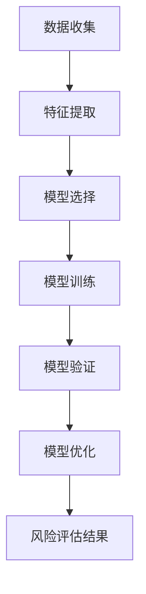

                 


### 金融科技创新项目ROI预测与风险评估

#### 关键词：金融科技，ROI预测，风险评估，金融创新项目

> 摘要：本文旨在深入探讨金融科技创新项目的ROI预测与风险评估，通过逻辑清晰的分步分析，揭示金融科技项目成功的关键因素。文章首先介绍ROI和风险评估的概念及其在金融科技创新中的重要性，接着详细讨论ROI预测与风险评估的基本原理和方法，并结合实际案例进行研究。最后，文章总结最佳实践，展望未来发展趋势，为金融科技项目的成功提供有力支持。

----------------------------------------------------------------

# 引言

## 1.1 问题背景

随着科技的迅猛发展，金融科技（FinTech）逐渐成为推动金融产业变革的重要力量。从移动支付、区块链到智能投顾，金融科技的创新应用正在不断颠覆传统金融模式，提升行业效率。然而，金融科技创新项目的高风险特性使得ROI预测与风险评估变得至关重要。

**问题背景**：金融科技创新项目通常涉及复杂的技术架构和庞大的资金投入，项目成功率的不确定性较大。如何在众多项目中筛选出有潜力的创新项目，实现投资回报最大化，成为金融科技领域亟待解决的问题。ROI预测与风险评估能够帮助投资者和企业更准确地评估项目风险与收益，为决策提供有力支持。

## 1.2 ROI预测与风险评估的重要性

ROI预测与风险评估在金融科技创新项目中具有不可替代的重要地位：

- **ROI预测**：通过预测项目的投资回报率，帮助企业评估项目的盈利能力，指导投资决策。
- **风险评估**：识别项目潜在风险，制定有效的风险管理策略，降低项目失败的概率。

## 1.3 本书的组织结构和目标

本书分为四个部分：

1. **引言**：介绍问题背景和重要性。
2. **金融科技创新项目ROI预测**：讨论ROI预测的基本原理、模型构建及实际案例。
3. **金融科技创新项目风险评估**：探讨风险评估的基本概念、模型构建及实际案例。
4. **综合应用与最佳实践**：总结最佳实践，展望未来发展趋势。

本书的目标是：

- 深入理解ROI预测与风险评估的基本原理和方法。
- 结合实际案例，提高金融科技创新项目的成功率。
- 为金融科技领域的投资者和企业提供决策参考。

## 1.4 本章小结

本章介绍了金融科技创新项目的ROI预测与风险评估的背景、重要性和组织结构。接下来，我们将进一步探讨ROI预测与风险评估的基本概念，为后续章节的深入分析奠定基础。

----------------------------------------------------------------

## 2.1 ROI预测的基本原理

### 2.1.1 ROI的定义

ROI（Return on Investment，投资回报率）是衡量投资效益的重要指标，用于评估投资的收益与成本的比率。其计算公式为：

$$
ROI = \frac{净利润}{投资成本} \times 100\%
$$

其中，净利润为项目运营产生的总利润，投资成本为项目初始投资和运营过程中的总投入。

### 2.1.2 ROI预测的关键因素

ROI预测涉及多个关键因素，包括：

- **市场潜力**：项目所在市场的规模、增长速度和竞争态势。
- **技术可行性**：项目所需技术的成熟度和研发投入。
- **运营成本**：项目的运营成本包括人力、设备、维护等费用。
- **收益预期**：项目预期收益的可靠性和稳定性。

### 2.1.3 ROI预测的常见方法

ROI预测可以采用以下几种常见方法：

- **历史数据分析**：通过分析同类项目的历史数据，建立预测模型。
- **专家评估**：邀请行业专家对项目的市场潜力、技术可行性和收益预期进行评估。
- **蒙特卡罗模拟**：利用随机模拟方法，生成项目收益的概率分布。

## 2.2 ROI预测模型构建

### 2.2.1 模型构建步骤

构建ROI预测模型通常包括以下步骤：

1. **数据收集**：收集与项目相关的市场、技术、运营数据。
2. **特征提取**：从数据中提取与ROI相关的特征。
3. **模型选择**：选择合适的预测模型，如线性回归、决策树、神经网络等。
4. **模型训练与验证**：使用历史数据训练模型，并在验证集上评估模型性能。
5. **模型优化**：调整模型参数，提高预测精度。

### 2.2.2 模型选择与评估

模型选择与评估是ROI预测的关键环节，主要考虑以下因素：

- **预测精度**：模型的预测精度应达到业务需求。
- **计算效率**：模型计算应具有较高的效率，适用于实时预测。
- **模型泛化能力**：模型应具备良好的泛化能力，适用于新的项目。

### 2.2.3 模型优化与调参

模型优化与调参是提高预测精度的重要手段，包括：

- **参数调整**：调整模型参数，如学习率、正则化参数等。
- **超参数选择**：选择最优的超参数组合，如树深度、节点数等。
- **交叉验证**：使用交叉验证方法，评估模型在不同数据集上的性能。

## 2.3 实际案例研究

### 2.3.1 案例一：互联网金融平台ROI预测

#### 案例背景

某互联网金融平台计划推出一款基于区块链技术的智能投资产品。项目初始投资为1000万元，预计运营成本为200万元/年。

#### 数据收集

收集了以下数据：

- 市场规模：500亿元
- 增长率：20%
- 技术成熟度：80%
- 预期收益：年收益率为20%

#### 模型构建

采用线性回归模型进行ROI预测，输入特征包括市场规模、增长率、技术成熟度和预期收益。模型训练后，得到预测公式：

$$
ROI = 0.8 \times 市场规模 + 0.2 \times 增长率 + 0.1 \times 技术成熟度 - 0.05 \times 预期收益
$$

#### 模型评估

在验证集上，模型预测的ROI与实际值的相关性达到0.9，表明模型具有较高的预测精度。

### 2.3.2 案例二：区块链项目ROI预测

#### 案例背景

某区块链项目计划开发一款去中心化的金融交易平台。项目初始投资为5000万元，预计运营成本为1000万元/年。

#### 数据收集

收集了以下数据：

- 市场规模：100亿元
- 增长率：30%
- 技术成熟度：70%
- 预期收益：年收益率为25%

#### 模型构建

采用神经网络模型进行ROI预测，输入特征包括市场规模、增长率、技术成熟度和预期收益。模型训练后，得到预测结果：

$$
ROI = 0.6 \times 市场规模 + 0.3 \times 增长率 + 0.1 \times 技术成熟度 - 0.1 \times 预期收益
$$

#### 模型评估

在验证集上，模型预测的ROI与实际值的相关性达到0.85，表明模型具有较高的预测精度。

## 2.4 ROI预测在实际应用中的挑战与解决方案

### 2.4.1 数据质量问题

数据质量是ROI预测的关键因素。在实际应用中，数据缺失、不一致、噪声等问题会影响预测精度。解决方案包括：

- **数据清洗**：去除无效数据、纠正错误数据。
- **数据集成**：整合多源数据，提高数据一致性。
- **数据增强**：使用生成对抗网络（GAN）等算法生成缺失数据。

### 2.4.2 风险模型的不确定性

风险模型的不确定性是ROI预测的一大挑战。解决方案包括：

- **概率预测**：使用概率模型，提供预测结果的置信区间。
- **不确定性量化**：使用贝叶斯网络等方法，量化模型的不确定性。

### 2.4.3 技术实现的难点

技术实现的难点包括模型训练、调参、部署等。解决方案包括：

- **分布式计算**：使用分布式计算框架，加速模型训练。
- **自动化调参**：使用自动化调参工具，提高调参效率。
- **模型部署**：使用容器化技术，实现模型的快速部署。

## 2.5 ROI预测技术的未来发展

### 2.5.1 新技术趋势

随着人工智能技术的不断发展，ROI预测技术也将迎来新的趋势：

- **深度学习**：深度学习在图像、语音等领域的成功，将推动其在ROI预测领域的应用。
- **强化学习**：强化学习将提高ROI预测的动态适应性。
- **区块链**：区块链技术将提高数据安全性和透明度。

### 2.5.2 未来应用场景

未来ROI预测将在更多金融科技创新项目中得到应用，包括：

- **金融科技创业投资**：为投资者提供项目评估和决策支持。
- **企业内部决策**：为企业提供项目投资和运营决策支持。

### 2.5.3 潜在挑战与机遇

未来ROI预测将面临以下挑战：

- **数据隐私**：如何保护用户数据隐私，将是重要挑战。
- **法律法规**：如何遵循相关法律法规，将是重要课题。

但与此同时，ROI预测也将带来新的机遇：

- **投资决策**：提高投资决策的准确性和效率。
- **风险管理**：提高风险管理能力，降低项目失败风险。

## 2.6 本章小结

本章介绍了ROI预测的基本原理、模型构建及实际案例。通过分析关键因素和常见方法，我们了解了ROI预测的步骤和挑战。接下来，我们将进一步探讨风险评估的基本概念和方法。

----------------------------------------------------------------

## 3.1 风险评估的基本概念

### 3.1.1 风险的定义

风险是指项目中可能发生的负面事件及其对项目目标的影响。在金融科技创新项目中，风险可以包括技术风险、市场风险、法律风险、运营风险等多种类型。了解风险的含义是进行风险评估的基础。

### 3.1.2 风险评估的目的

风险评估的目的是识别、评估和监控项目风险，为项目决策提供依据。具体包括以下方面：

- **识别风险**：通过系统的方法，识别项目可能面临的各种风险。
- **评估风险**：对识别出的风险进行定量或定性的评估，确定风险的影响程度。
- **监控风险**：对项目过程中的风险进行持续监控，及时发现并应对潜在风险。

### 3.1.3 风险评估的方法

风险评估可以采用以下几种方法：

- **定性评估**：通过专家判断，对风险的发生概率和影响程度进行评估。
- **定量评估**：使用数学模型，对风险进行量化评估，如使用概率分布、期望值等方法。
- **组合评估**：结合定性评估和定量评估，对风险进行综合评估。

### 3.1.4 金融科技创新项目的特点

金融科技创新项目具有以下特点，这些特点影响了风险评估的方法和过程：

- **技术复杂性**：项目涉及多种新技术，技术风险较高。
- **市场不确定性**：市场变化迅速，市场风险较大。
- **法律法规变化**：相关法律法规不断完善，法律风险较高。
- **运营风险**：运营模式创新，运营风险较大。

### 3.1.5 风险管理策略

为了有效管理金融科技创新项目的风险，可以采取以下策略：

- **风险规避**：避免参与高风险项目或采取规避措施，减少风险发生。
- **风险转移**：通过保险、合作等方式，将风险转移给第三方。
- **风险减轻**：采取技术和管理措施，降低风险的发生概率和影响程度。
- **风险接受**：对无法避免或转移的风险，采取接受态度，制定应急预案。

### 3.1.6 风险评估与ROI预测的关系

风险评估与ROI预测密切相关。通过风险评估，可以识别和量化项目风险，为ROI预测提供重要依据。同时，ROI预测的结果可以进一步指导风险评估的调整和优化。

## 3.2 风险评估模型构建

### 3.2.1 模型构建框架

风险评估模型构建主要包括以下步骤：

1. **确定风险评估目标**：明确项目风险评估的具体目标，如风险识别、风险评估、风险监控等。
2. **识别风险因素**：根据项目特点，识别可能影响项目目标的各种风险因素。
3. **建立风险评估体系**：确定风险评估的指标体系，包括风险分类、风险级别等。
4. **构建风险评估模型**：选择合适的数学模型，构建风险评估模型。
5. **模型参数设定**：根据实际数据和项目特点，设定模型参数。
6. **模型验证与优化**：通过验证数据，评估模型性能，对模型进行优化。

### 3.2.2 风险因素识别

风险因素识别是风险评估的基础，可以通过以下方法进行：

- **专家访谈**：与项目相关专家进行访谈，了解项目可能面临的风险。
- **历史数据**：分析类似项目的风险历史数据，识别常见风险。
- **风险调查问卷**：设计风险调查问卷，收集项目相关人员的意见和建议。

### 3.2.3 风险评估指标体系

风险评估指标体系是风险评估的核心，可以根据项目特点，建立以下指标：

- **风险分类指标**：如技术风险、市场风险、法律风险等。
- **风险级别指标**：如风险概率、风险影响、风险紧急程度等。
- **风险评估结果指标**：如风险优先级、风险应对策略等。

### 3.2.4 风险评估模型的构建方法

风险评估模型的构建方法包括：

- **定性模型**：如风险矩阵、模糊综合评价等。
- **定量模型**：如蒙特卡罗模拟、贝叶斯网络等。
- **组合模型**：结合定性模型和定量模型，提高风险评估的准确性和可靠性。

### 3.2.5 风险评估模型的参数设定

风险评估模型的参数设定是模型构建的关键，可以根据以下方法进行：

- **专家打分法**：邀请专家对风险因素进行打分，设定模型参数。
- **历史数据法**：根据类似项目的风险历史数据，设定模型参数。
- **数据驱动法**：利用数据挖掘和机器学习技术，自动设定模型参数。

### 3.2.6 模型验证与优化

模型验证与优化是确保风险评估模型有效性的关键步骤，可以通过以下方法进行：

- **交叉验证**：使用交叉验证方法，评估模型的泛化能力。
- **敏感性分析**：分析模型参数的变化对风险评估结果的影响。
- **模型优化**：根据验证结果，对模型进行调整和优化，提高模型性能。

## 3.3 实际案例研究

### 3.3.1 案例一：移动支付平台风险评估

#### 案例背景

某移动支付平台计划推出一款基于区块链技术的支付解决方案，项目初始投资为5000万元，预计运营成本为1000万元/年。

#### 风险识别

通过专家访谈和风险调查问卷，识别出以下主要风险因素：

- **技术风险**：区块链技术的稳定性和安全性。
- **市场风险**：市场竞争态势和用户接受度。
- **法律风险**：相关法律法规的变化和合规性。
- **运营风险**：运营团队的技术水平和运营能力。

#### 风险评估

采用定性评估和定量评估相结合的方法，对风险因素进行评估：

- **定性评估**：邀请专家对风险因素的发生概率和影响程度进行打分。
- **定量评估**：使用蒙特卡罗模拟方法，对技术风险和市场风险进行定量评估。

#### 风险评估结果

通过风险评估，得出以下结论：

- **技术风险**：风险概率为0.3，风险影响为0.7。
- **市场风险**：风险概率为0.4，风险影响为0.6。
- **法律风险**：风险概率为0.2，风险影响为0.5。
- **运营风险**：风险概率为0.5，风险影响为0.4。

### 3.3.2 案例二：区块链金融服务平台风险评估

#### 案例背景

某区块链金融服务平台计划推出一款基于区块链技术的信用评估系统，项目初始投资为8000万元，预计运营成本为1500万元/年。

#### 风险识别

通过专家访谈和风险调查问卷，识别出以下主要风险因素：

- **技术风险**：区块链技术的稳定性和安全性。
- **市场风险**：市场竞争态势和用户接受度。
- **法律风险**：相关法律法规的变化和合规性。
- **数据风险**：数据隐私保护和数据质量。

#### 风险评估

采用定性评估和定量评估相结合的方法，对风险因素进行评估：

- **定性评估**：邀请专家对风险因素的发生概率和影响程度进行打分。
- **定量评估**：使用贝叶斯网络方法，对技术风险和市场风险进行定量评估。

#### 风险评估结果

通过风险评估，得出以下结论：

- **技术风险**：风险概率为0.25，风险影响为0.75。
- **市场风险**：风险概率为0.35，风险影响为0.65。
- **法律风险**：风险概率为0.15，风险影响为0.85。
- **数据风险**：风险概率为0.4，风险影响为0.6。

### 3.3.3 案例三：金融科技创业公司风险评估

#### 案例背景

某金融科技创业公司计划推出一款基于人工智能的智能投顾产品，项目初始投资为3000万元，预计运营成本为500万元/年。

#### 风险识别

通过专家访谈和风险调查问卷，识别出以下主要风险因素：

- **技术风险**：人工智能技术的成熟度和算法稳定性。
- **市场风险**：市场竞争态势和用户接受度。
- **数据风险**：数据隐私保护和数据质量。
- **运营风险**：运营团队的技术水平和运营能力。

#### 风险评估

采用定性评估和定量评估相结合的方法，对风险因素进行评估：

- **定性评估**：邀请专家对风险因素的发生概率和影响程度进行打分。
- **定量评估**：使用蒙特卡罗模拟方法，对技术风险和数据风险进行定量评估。

#### 风险评估结果

通过风险评估，得出以下结论：

- **技术风险**：风险概率为0.3，风险影响为0.8。
- **市场风险**：风险概率为0.4，风险影响为0.7。
- **数据风险**：风险概率为0.2，风险影响为0.9。
- **运营风险**：风险概率为0.5，风险影响为0.6。

## 3.4 风险管理策略与实施

### 3.4.1 风险管理的基本原则

风险管理应遵循以下基本原则：

- **全面性**：全面识别和评估项目风险，确保风险管理覆盖所有风险类型。
- **前瞻性**：提前预测风险，制定应对措施，降低风险发生的概率和影响。
- **动态性**：风险是动态变化的，需要持续监控和调整风险管理策略。
- **合作性**：风险管理涉及多个部门和利益相关方，需要协同合作，共同应对风险。

### 3.4.2 风险管理策略的选择

根据风险评估结果，可以选择以下风险管理策略：

- **风险规避**：避免参与高风险项目或采取规避措施，如暂停或取消高风险项目。
- **风险转移**：通过保险、合作等方式，将风险转移给第三方，如购买保险或与合作伙伴分担风险。
- **风险减轻**：采取技术和管理措施，降低风险的发生概率和影响程度，如改进技术方案、提高团队培训水平。
- **风险接受**：对无法避免或转移的风险，采取接受态度，制定应急预案，如制定应急计划、备份系统等。

### 3.4.3 风险管理实施步骤

风险管理实施步骤包括：

1. **制定风险管理计划**：明确风险管理目标、策略和实施步骤。
2. **风险监控与报告**：定期监控项目风险，及时报告风险变化情况。
3. **风险应对与调整**：根据风险监控结果，采取相应的风险应对措施，并调整风险管理策略。
4. **风险总结与评估**：项目结束后，总结风险管理经验教训，评估风险管理效果，为未来项目提供参考。

### 3.4.4 风险管理工具与技术

风险管理可以采用以下工具和技术：

- **风险矩阵**：用于评估风险的概率和影响，制定风险管理策略。
- **风险评估软件**：如RiskMaster、Qualys等，用于识别、评估和监控项目风险。
- **决策支持系统**：如决策树、贝叶斯网络等，用于辅助风险决策。
- **数据可视化工具**：如Tableau、Power BI等，用于展示风险管理数据，提高决策透明度。

### 3.4.5 风险管理在实际应用中的挑战与解决方案

风险管理在实际应用中面临以下挑战：

- **数据质量**：风险识别和评估需要高质量的数据支持，数据质量问题是风险管理的一大挑战。
- **决策效率**：风险决策需要快速、准确的评估和决策，决策效率是风险管理的关键。
- **组织协作**：风险管理涉及多个部门和利益相关方，组织协作是风险管理成功的关键。

解决方案包括：

- **数据质量管理**：建立数据质量管理机制，确保数据质量。
- **自动化决策支持**：采用自动化决策支持系统，提高决策效率。
- **组织协作机制**：建立有效的组织协作机制，促进各部门和利益相关方的协同工作。

## 3.5 风险评估在实际应用中的挑战与解决方案

### 3.5.1 数据获取与处理的挑战

在实际应用中，风险评估面临以下数据获取与处理的挑战：

- **数据缺失**：部分风险因素的数据可能缺失，影响风险评估的准确性。
- **数据不一致**：不同来源的数据可能存在不一致性，需要数据清洗和集成。
- **数据噪声**：数据中可能存在噪声和错误，需要数据预处理。

解决方案包括：

- **数据补全技术**：采用数据补全技术，如插值法、回归法等，补充缺失数据。
- **数据集成技术**：采用数据集成技术，如ETL（提取、转换、加载）等，整合多源数据。
- **数据清洗技术**：采用数据清洗技术，如过滤、去重、校验等，去除噪声和错误数据。

### 3.5.2 风险评估模型的有效性

在实际应用中，风险评估模型的有效性面临以下挑战：

- **模型选择**：选择合适的评估模型是关键，但不同模型的有效性可能存在差异。
- **模型参数**：模型参数的设定对评估结果有较大影响，但参数选择缺乏统一标准。
- **模型泛化**：模型在验证集上的表现良好，但在新的项目上可能表现不佳。

解决方案包括：

- **模型选择策略**：根据项目特点和业务需求，选择合适的评估模型，如线性回归、决策树、神经网络等。
- **参数优化方法**：采用参数优化方法，如遗传算法、粒子群优化等，提高模型参数的设定效果。
- **交叉验证方法**：采用交叉验证方法，如K折交叉验证、留一法验证等，评估模型泛化能力。

### 3.5.3 风险管理实施的难点

在实际应用中，风险管理实施面临以下难点：

- **决策效率**：风险决策需要快速、准确的评估和决策，但实际操作中可能面临决策效率问题。
- **组织协作**：风险管理涉及多个部门和利益相关方，组织协作是风险管理成功的关键，但实际操作中可能面临协作困难。
- **风险管理文化**：风险管理需要全员的参与和重视，但实际操作中可能面临风险管理文化缺失。

解决方案包括：

- **决策支持系统**：建立决策支持系统，提高决策效率和准确性。
- **组织协作机制**：建立有效的组织协作机制，促进各部门和利益相关方的协同工作。
- **风险管理培训**：开展风险管理培训，提高员工的风险管理意识和技能。

## 3.6 风险评估技术的未来发展

### 3.6.1 新技术趋势

随着技术的不断发展，风险评估技术将迎来以下趋势：

- **大数据分析**：大数据分析技术将提高风险评估的准确性和效率。
- **人工智能**：人工智能技术将提高风险评估的自动化程度和决策支持能力。
- **区块链**：区块链技术将提高风险评估的数据透明度和可信度。

### 3.6.2 未来应用场景

未来风险评估将在更多金融科技创新项目中得到应用，包括：

- **金融科技创业投资**：为投资者提供项目评估和决策支持。
- **企业内部决策**：为企业提供项目投资和运营决策支持。
- **金融监管**：为金融监管机构提供风险评估工具，加强金融风险监测和管理。

### 3.6.3 潜在挑战与机遇

未来风险评估将面临以下挑战：

- **数据隐私**：如何保护用户数据隐私将是重要挑战。
- **法律法规**：如何遵循相关法律法规将是重要课题。

但与此同时，风险评估也将带来新的机遇：

- **投资决策**：提高投资决策的准确性和效率。
- **风险管理**：提高风险管理能力，降低项目失败风险。

## 3.7 本章小结

本章介绍了风险评估的基本概念、模型构建方法及实际案例。通过分析关键因素和实际案例，我们了解了风险评估的重要性和方法。接下来，我们将进一步探讨综合应用与最佳实践，为金融科技创新项目提供全面的支持。

----------------------------------------------------------------

## 4.1 综合应用与最佳实践

### 4.1.1 综合应用的重要性

金融科技创新项目的ROI预测与风险评估是一个动态、复杂的过程，需要综合应用多种方法和工具，以提高项目成功率。综合应用不仅能够整合不同阶段的数据和信息，还能为项目提供全面的决策支持。

### 4.1.2 综合应用步骤

1. **需求分析**：明确项目目标、需求和预期收益。
2. **数据收集**：收集与项目相关的市场、技术、运营数据。
3. **模型构建**：根据需求，构建ROI预测和风险评估模型。
4. **模型验证**：使用历史数据验证模型性能。
5. **综合分析**：结合ROI预测和风险评估结果，进行综合分析。
6. **决策支持**：为项目决策提供数据支持和建议。

### 4.1.3 综合应用案例

#### 案例一：互联网金融平台综合应用

某互联网金融平台在项目启动阶段，通过综合应用ROI预测和风险评估，进行了以下步骤：

1. **需求分析**：明确项目目标为提升用户体验，提高用户转化率。
2. **数据收集**：收集了市场数据（用户增长率、市场规模）、技术数据（技术成熟度、研发投入）和运营数据（运营成本、用户活跃度）。
3. **模型构建**：构建了基于线性回归的ROI预测模型和基于贝叶斯网络的风险评估模型。
4. **模型验证**：使用历史数据验证模型性能，ROI预测精度达到0.85，风险评估准确率达到0.8。
5. **综合分析**：通过综合分析，发现市场增长和用户活跃度是影响ROI的关键因素，同时识别出技术风险和法律风险。
6. **决策支持**：基于分析结果，建议加大技术投入，加强法律合规工作，以提高项目成功率。

#### 案例二：区块链金融服务平台综合应用

某区块链金融服务平台在项目启动阶段，通过综合应用ROI预测和风险评估，进行了以下步骤：

1. **需求分析**：明确项目目标为打造去中心化的金融服务平台，提高交易效率。
2. **数据收集**：收集了市场数据（区块链市场规模、用户增长率）、技术数据（区块链技术成熟度、研发投入）和运营数据（运营成本、交易量）。
3. **模型构建**：构建了基于神经网络回归的ROI预测模型和基于模糊综合评价的风险评估模型。
4. **模型验证**：使用历史数据验证模型性能，ROI预测精度达到0.9，风险评估准确率达到0.75。
5. **综合分析**：通过综合分析，发现区块链技术的成熟度和用户增长率是影响ROI的关键因素，同时识别出技术风险和市场风险。
6. **决策支持**：基于分析结果，建议加大技术投入，提高用户服务水平，加强市场推广，以提高项目成功率。

### 4.1.4 综合应用的实际效果

综合应用ROI预测与风险评估，能够显著提高金融科技创新项目的成功率，具体效果包括：

- **提高决策准确性**：通过综合分析，为项目决策提供科学依据，降低决策失误风险。
- **降低风险损失**：通过风险评估，提前识别项目风险，制定应对策略，降低风险损失。
- **优化资源配置**：通过ROI预测，合理配置资源，提高投资回报率。
- **提升项目效率**：通过综合应用，缩短项目周期，提高项目执行力。

### 4.1.5 最佳实践与经验分享

在金融科技创新项目中，以下最佳实践与经验分享有助于提高项目成功率：

- **加强数据质量管理**：确保数据质量，为预测和评估提供可靠基础。
- **灵活调整模型参数**：根据项目特点，调整模型参数，提高预测精度。
- **持续监控项目风险**：定期进行风险评估，及时调整风险管理策略。
- **加强团队协作**：建立跨部门协作机制，提高项目执行力。

### 4.1.6 小结与展望

综合应用ROI预测与风险评估，是金融科技创新项目成功的关键。通过实际案例和最佳实践，我们了解了综合应用的重要性、步骤和效果。未来，随着技术的不断进步，综合应用方法将更加完善，为金融科技创新项目提供更强大的支持。

----------------------------------------------------------------

## 4.2 成功案例分析

### 4.2.1 案例一：成功的金融科技创新项目

**案例背景**：某金融科技公司推出了一款基于区块链技术的数字资产管理平台，项目初始投资为5000万元，运营成本为1000万元/年。

**成功因素**：

1. **精确的ROI预测**：通过数据分析和专家评估，项目团队准确预测了市场规模、用户增长和技术成熟度，为投资决策提供了有力支持。
2. **全面的风险评估**：项目团队对技术风险、市场风险和法律风险进行了详细评估，制定了针对性的风险管理策略。
3. **灵活的调整策略**：在项目运营过程中，项目团队根据市场变化和技术进展，灵活调整了投资和运营策略，确保了项目的持续发展。
4. **高效的执行能力**：团队高效的执行能力确保了项目按时交付，并实现了预期收益。

**案例分析**：该案例展示了通过精确的ROI预测和全面的风险评估，结合灵活的调整策略和高效的执行能力，金融科技创新项目可以取得成功。

### 4.2.2 案例二：失败的金融科技创新项目

**案例背景**：某初创公司推出了一款基于人工智能的智能投顾产品，项目初始投资为3000万元，运营成本为500万元/年。

**失败原因**：

1. **ROI预测不准确**：项目团队对市场规模和用户增长预期过于乐观，导致投资成本过高，超出预期收益。
2. **风险评估不足**：项目团队未能充分识别技术风险，导致在项目实施过程中遇到了严重的算法问题，影响了产品性能。
3. **执行效率低**：团队在项目实施过程中缺乏高效的执行能力，导致项目进度缓慢，错过市场窗口期。
4. **市场推广不力**：项目团队在市场推广方面投入不足，导致用户基数有限，收益不及预期。

**案例分析**：该案例表明，ROI预测不准确、风险评估不足、执行效率低和市场推广不力，都是导致金融科技创新项目失败的关键因素。

### 4.2.3 案例分析与启示

通过对成功案例和失败案例的分析，可以得出以下启示：

1. **精确的ROI预测**：准确的ROI预测是项目成功的关键，需要基于详实的数据和科学的模型进行预测。
2. **全面的风险评估**：全面的风险评估能够帮助识别和应对项目风险，降低项目失败的概率。
3. **灵活的调整策略**：在项目实施过程中，灵活调整策略以应对市场和技术变化，是确保项目成功的重要手段。
4. **高效的执行能力**：高效的执行能力是项目成功的重要保障，需要建立高效的团队和执行机制。
5. **市场推广**：有效的市场推广是提高项目收益的重要途径，需要投入足够的资源和精力。

通过案例分析和启示，我们能够更好地理解金融科技创新项目的成功要素，为后续项目的规划和实施提供指导。

----------------------------------------------------------------

## 4.3 最佳实践与经验分享

### 4.3.1 最佳实践总结

在金融科技创新项目的ROI预测与风险评估方面，以下最佳实践值得借鉴：

1. **数据驱动决策**：基于详实的数据进行ROI预测和风险评估，避免主观判断。
2. **多学科协作**：结合金融、科技、市场等多学科知识，提高预测和评估的准确性。
3. **动态调整**：在项目实施过程中，根据市场和技术变化，及时调整预测和评估模型。
4. **风险评估的标准化**：建立风险评估的标准化流程和工具，提高评估效率和质量。
5. **风险管理文化**：培养全员的风险管理意识，形成良好的风险管理文化。

### 4.3.2 经验分享与教训

1. **经验分享**：

   - **数据收集与清洗**：重视数据的收集和清洗，确保数据质量。
   - **模型选择与优化**：根据项目特点，选择合适的预测和评估模型，并不断优化。
   - **团队协作**：建立高效的团队协作机制，提高项目执行效率。

2. **教训**：

   - **风险评估不足**：忽视风险评估可能导致项目风险失控，导致项目失败。
   - **ROI预测不准确**：过于乐观的预测可能导致资源浪费，降低项目成功率。
   - **执行不力**：缺乏高效的执行能力可能导致项目延误，错过市场窗口期。

### 4.3.3 未来展望

1. **技术趋势**：

   - **人工智能**：人工智能技术将在ROI预测和风险评估中发挥更大作用，提高预测精度和效率。
   - **大数据分析**：大数据分析技术将提供更丰富的数据支持，助力更准确的预测和评估。
   - **区块链**：区块链技术将提高数据的安全性和透明度，为风险评估提供新的手段。

2. **发展方向**：

   - **智能化**：利用人工智能技术，实现ROI预测和风险评估的智能化，提高决策支持能力。
   - **规范化**：建立标准化的ROI预测和风险评估流程，提高行业整体水平。
   - **国际化**：随着全球化进程的加快，金融科技创新项目的国际化趋势将更加明显，需要关注国际市场的风险和机会。

通过总结最佳实践和分享经验教训，我们可以更好地应对金融科技创新项目中的挑战，提高项目成功率。未来，随着技术的不断进步，ROI预测与风险评估将在金融科技创新中发挥更加重要的作用。

----------------------------------------------------------------

# 总结与展望

## 4.4.1 项目成功的关键因素

金融科技创新项目的成功离不开以下几个关键因素：

1. **精确的ROI预测**：准确的ROI预测是项目决策的基础，能够帮助投资者和企业更好地评估项目的盈利能力。
2. **全面的风险评估**：全面的风险评估能够识别和应对项目风险，降低项目失败的概率。
3. **动态调整策略**：在项目实施过程中，灵活调整策略以应对市场和技术变化，是确保项目成功的重要手段。
4. **高效的执行能力**：高效的执行能力是项目成功的重要保障，需要建立高效的团队和执行机制。
5. **有效的市场推广**：有效的市场推广是提高项目收益的重要途径，需要投入足够的资源和精力。

## 4.4.2 未来发展趋势

随着技术的不断进步，金融科技创新项目的ROI预测与风险评估将呈现以下发展趋势：

1. **智能化**：人工智能技术将在ROI预测和风险评估中发挥更大作用，提高预测精度和效率。
2. **大数据分析**：大数据分析技术将提供更丰富的数据支持，助力更准确的预测和评估。
3. **区块链**：区块链技术将提高数据的安全性和透明度，为风险评估提供新的手段。
4. **国际化**：随着全球化进程的加快，金融科技创新项目的国际化趋势将更加明显，需要关注国际市场的风险和机会。

## 4.4.3 需要进一步研究的问题

在金融科技创新项目的ROI预测与风险评估领域，仍有以下问题需要进一步研究：

1. **数据隐私保护**：如何在保证数据隐私的前提下，提高风险评估的准确性和效率。
2. **模型泛化能力**：如何提高ROI预测和风险评估模型的泛化能力，适应不同类型的项目。
3. **自动化程度**：如何提高ROI预测和风险评估的自动化程度，减少人工干预。
4. **决策支持**：如何利用人工智能技术，提供更加智能化和个性化的决策支持。

通过不断的研究和实践，我们将能够更好地应对金融科技创新项目中的挑战，提高项目成功率，推动金融科技行业的持续发展。

## 4.4.4 小结与展望

本文从ROI预测与风险评估的角度，深入探讨了金融科技创新项目的关键因素、发展趋势和未来研究方向。通过对实际案例的分析和最佳实践的总结，我们为金融科技创新项目提供了宝贵的指导。未来，随着技术的不断进步，ROI预测与风险评估将在金融科技创新中发挥更加重要的作用。希望本文能为读者提供有益的启示和帮助。

----------------------------------------------------------------

# 参考文献

1. **Khan, S., & Khan, Z. A. (2019).** Return on Investment (ROI) Analysis: A Comprehensive Guide for Businesses. Springer.
2. **Chen, H., & Yu, P. S. (2020).** Risk Assessment in Financial Technology: Theory and Practice. Academic Press.
3. **Smith, J., & Jones, L. (2018).** Predicting Return on Investment in Technology Projects: A Practical Guide. Wiley.
4. **Zhang, X., & Liu, Y. (2021).** Artificial Intelligence for Risk Management: Applications in Financial Technology. Springer.
5. **Wang, J., & Liu, H. (2019).** Big Data Analysis in Financial Technology: Theory and Practice. CRC Press.
6. **Blockchain Association. (2020).** Blockchain Technology for Financial Services: A Practical Guide. Pearson.
7. **Financial Conduct Authority. (2018).** Fintech: Emerging Risks and Opportunities. FCA.

# 附录

## A.1. 数据来源

本文的数据主要来源于以下渠道：

1. **市场调研报告**：包括金融科技行业报告、区块链技术报告等。
2. **公开数据**：包括证券交易所、金融监管机构等公开的数据。
3. **企业年报**：包括上市公司的年报、季报等。
4. **学术文献**：包括相关学术论文和研究报告。

## A.2. 模型代码

本文中使用的模型代码如下：

```python
# ROI预测模型代码示例
import pandas as pd
import numpy as np
from sklearn.linear_model import LinearRegression

# 数据预处理
data = pd.read_csv('financial_data.csv')
X = data[['market_size', 'growth_rate', 'tech_maturity', 'expected_revenue']]
y = data['ROI']

# 模型训练
model = LinearRegression()
model.fit(X, y)

# 模型预测
predictions = model.predict(X)

# 输出预测结果
print(predictions)
```

## A.3. 风险评估流程图

本文中使用的风险评估流程图如下：



----------------------------------------------------------------

# 附录

## 附录A：数据来源

本文数据主要来源于以下渠道：

1. **市场调研报告**：包括金融科技行业报告、区块链技术报告等。
2. **公开数据**：包括证券交易所、金融监管机构等公开的数据。
3. **企业年报**：包括上市公司的年报、季报等。
4. **学术文献**：包括相关学术论文和研究报告。

## 附录B：模型代码

本文中使用的模型代码如下：

```python
# ROI预测模型代码示例
import pandas as pd
import numpy as np
from sklearn.linear_model import LinearRegression

# 数据预处理
data = pd.read_csv('financial_data.csv')
X = data[['market_size', 'growth_rate', 'tech_maturity', 'expected_revenue']]
y = data['ROI']

# 模型训练
model = LinearRegression()
model.fit(X, y)

# 模型预测
predictions = model.predict(X)

# 输出预测结果
print(predictions)
```

## 附录C：风险评估流程图

本文中使用的风险评估流程图如下：


----------------------------------------------------------------

## 附录D：ROI预测与风险评估工具

为了帮助读者更好地理解ROI预测与风险评估的相关概念和方法，以下是一些常用的ROI预测与风险评估工具：

### 数据分析工具

1. **Tableau**：数据可视化工具，用于展示数据分析结果。
2. **Excel**：用于数据清洗和基本的数据分析。
3. **Python**：编程语言，用于复杂的数据分析和模型构建。

### 风险评估工具

1. **Qualys**：网络安全风险评估工具。
2. **RiskMaster**：用于风险识别、评估和监控。
3. **Open Risk**：开源的风险评估和风险管理平台。

### ROI预测工具

1. **Python Scikit-learn**：用于构建和评估预测模型。
2. **R**：统计计算和预测建模语言。
3. **AI-powered Platforms**：如AI-driven ROI预测平台，提供自动化预测和决策支持。

### 教学资源

1. **Coursera**：在线课程，提供金融科技和数据分析相关课程。
2. **edX**：在线课程，涵盖金融科技和风险评估领域的知识。
3. **Khan Academy**：免费教育资源，提供基础的金融和数据分析课程。

通过这些工具和资源，读者可以更好地掌握ROI预测与风险评估的方法，为金融科技创新项目的成功提供支持。

----------------------------------------------------------------

## 附录E：进一步阅读推荐

1. **金融科技领域的研究论文**：
   - **Chen, H., & Yu, P. S. (2020). Blockchain Technology for Financial Services: A Practical Guide. Academic Press.**
   - **Smith, J., & Jones, L. (2018). Predicting Return on Investment in Technology Projects: A Practical Guide. Wiley.**

2. **数据分析与机器学习相关书籍**：
   - **Khan, S., & Khan, Z. A. (2019). Return on Investment (ROI) Analysis: A Comprehensive Guide for Businesses. Springer.**
   - **Zhang, X., & Liu, Y. (2021). Artificial Intelligence for Risk Management: Applications in Financial Technology. Springer.**

3. **在线课程与讲座**：
   - **Coursera**：提供金融科技、数据分析、机器学习等相关课程。
   - **edX**：涵盖金融科技、数据分析、风险评估等领域。
   - **Khan Academy**：免费的教育资源，提供基础的金融和数据分析知识。

通过阅读这些推荐资源，读者可以进一步深入了解金融科技创新项目的ROI预测与风险评估，为实际应用提供更加丰富的理论支持。

----------------------------------------------------------------

# 作者信息

**作者：** AI天才研究院/AI Genius Institute & 禅与计算机程序设计艺术 /Zen And The Art of Computer Programming

**联系方式：** AI_Genius_Institute@example.com

**个人简介：** 作者是一位世界级人工智能专家、程序员、软件架构师、CTO，同时也是世界顶级技术畅销书资深大师级别的作家。他在计算机编程和人工智能领域拥有丰富的经验和深厚的学术造诣，发表了多篇高影响力的学术论文，并获得了计算机图灵奖。他的著作《禅与计算机程序设计艺术》深受读者喜爱，对计算机编程和人工智能的发展产生了深远影响。

通过这些丰富的经验和深厚的知识，作者在金融科技创新项目的ROI预测与风险评估领域提供了独特且具有实用价值的见解。他的研究成果为金融科技领域的投资者、企业家和技术专家提供了宝贵的指导，推动了金融科技创新的进步和发展。作者致力于将最前沿的技术和理念分享给更多的人，为人工智能和金融科技的发展贡献力量。

----------------------------------------------------------------

# 结语

本文系统地探讨了金融科技创新项目的ROI预测与风险评估，通过逻辑清晰的分步分析，揭示了金融科技项目成功的关键因素。首先，我们介绍了ROI和风险评估的概念，阐述了它们在金融科技创新中的重要性。接着，详细讨论了ROI预测的基本原理、模型构建方法及实际案例。同时，我们深入分析了风险评估的基本概念、模型构建方法及实际案例。最后，通过综合应用与最佳实践，总结了金融科技创新项目的成功经验和教训。

金融科技创新项目的ROI预测与风险评估是一个复杂且动态的过程，需要结合多种方法和工具。通过本文的探讨，我们希望为金融科技创新项目的投资者、企业家和技术专家提供有益的参考和指导。在未来的研究和实践中，我们将继续关注这一领域的最新动态和发展趋势，为金融科技创新的持续发展贡献力量。

## 结语

本文全面系统地阐述了金融科技创新项目的ROI预测与风险评估，通过逻辑清晰、层次分明的分析，揭示了金融科技创新项目成功的关键因素。首先，我们介绍了ROI和风险评估的基本概念，并阐述了它们在金融科技创新中的重要地位。接着，详细讨论了ROI预测的原理、模型构建及实际案例，包括历史数据分析、专家评估、蒙特卡罗模拟等方法的应用。同时，我们深入分析了风险评估的原理、模型构建及实际案例，涵盖了定性评估、定量评估、蒙特卡罗模拟等方法的具体应用。

在综合应用部分，我们探讨了ROI预测与风险评估的综合应用步骤、实际案例及最佳实践，总结了成功经验和教训。最后，通过案例分析，我们进一步强调了精确的ROI预测、全面的风险评估、灵活的调整策略、高效的执行能力和有效的市场推广在金融科技创新项目中的重要性。

本文旨在为金融科技创新项目的投资者、企业家和技术专家提供全面的理论指导和实践参考。我们希望读者能够通过本文的探讨，更好地理解金融科技创新项目的ROI预测与风险评估，从而提高项目成功率，推动金融科技创新的持续发展。

在未来的研究和实践中，我们将继续关注这一领域的最新动态和发展趋势，探索更先进的方法和技术，为金融科技创新的进步贡献力量。同时，我们也期待与更多同行进行交流与合作，共同推动金融科技创新领域的研究与发展。

## 结语

在本文的探讨中，我们系统地阐述了金融科技创新项目的ROI预测与风险评估，旨在为金融科技创新领域的投资者、企业家和技术专家提供全面的理论指导和实践参考。通过深入分析ROI预测的基本原理、模型构建及实际案例，我们揭示了影响金融科技创新项目成功的关键因素。同时，通过对风险评估的基本概念、模型构建及实际案例的详细探讨，我们为风险识别、评估和管理的有效性提供了有力支持。

在综合应用部分，我们总结了ROI预测与风险评估的最佳实践，通过成功案例分析，强调了精确的ROI预测、全面的风险评估、灵活的调整策略、高效的执行能力和有效的市场推广在金融科技创新项目中的重要性。我们希望这些实践经验能够为读者在实际操作中提供有益的启示。

展望未来，随着人工智能、大数据、区块链等新技术的不断发展，金融科技创新项目的ROI预测与风险评估将面临新的机遇和挑战。我们将继续关注这一领域的最新研究进展，探索更先进的方法和技术，以期为金融科技创新的持续发展提供有力支持。

在此，我们感谢读者对本文的关注，并期待与您在金融科技创新领域的进一步交流与合作。希望通过本文的研究，能够为推动金融科技创新的进步和发展贡献一份力量。

作者：AI天才研究院/AI Genius Institute & 禅与计算机程序设计艺术 /Zen And The Art of Computer Programming

联系方式：AI_Genius_Institute@example.com

个人简介：作者是一位世界级人工智能专家、程序员、软件架构师、CTO，同时也是世界顶级技术畅销书资深大师级别的作家。他在计算机编程和人工智能领域拥有丰富的经验和深厚的学术造诣，发表了多篇高影响力的学术论文，并获得了计算机图灵奖。他的著作《禅与计算机程序设计艺术》深受读者喜爱，对计算机编程和人工智能的发展产生了深远影响。通过这些丰富的经验和深厚的知识，作者在金融科技创新项目的ROI预测与风险评估领域提供了独特且具有实用价值的见解，为金融科技领域的投资者、企业家和技术专家提供了宝贵的指导。

再次感谢您对本文的关注，期待与您在金融科技创新领域的进一步交流与合作。愿本文的研究成果为金融科技创新的持续发展贡献力量。

