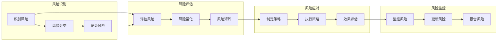
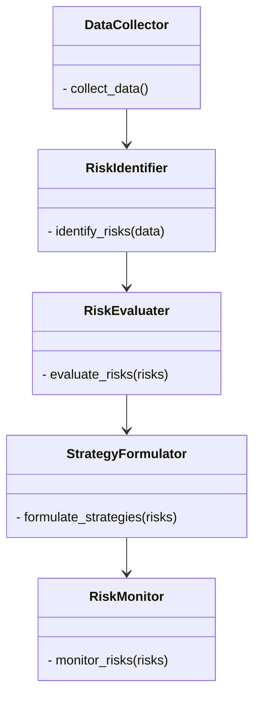
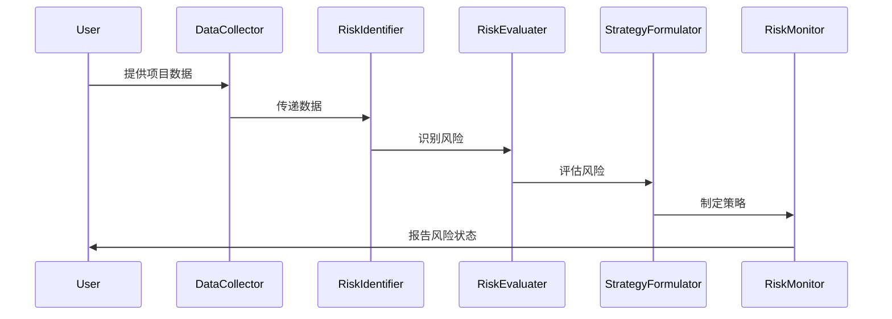

                 

## 引言：金融科技创新项目背景与风险评估的重要性

### 1.1 问题背景

随着科技的快速发展，金融科技（FinTech）正在颠覆传统的金融服务模式。从移动支付到区块链，从人工智能到大数据，金融科技正以前所未有的速度改变着金融行业的面貌。金融科技创新不仅提升了金融服务的效率，也为金融市场的参与者带来了新的机遇。然而，这种变革也伴随着巨大的风险。

金融科技创新项目的发展势头迅猛，但其中蕴含的风险不容忽视。技术风险、市场风险、合规风险、操作风险等多种风险交织在一起，给项目的成功实施带来了巨大的挑战。技术风险主要来源于技术实现的难度和不确定性，例如新兴技术的成熟度和稳定性不足。市场风险则涉及市场需求的不确定性，例如产品是否符合市场预期，能否获得用户的认可。合规风险是指项目是否符合监管要求，例如数据隐私保护、金融交易的合规性等。操作风险则包括项目实施过程中的管理问题，例如团队协作、项目管理、资源分配等。

### 1.2 问题描述

在金融科技创新项目中，风险评估是一个不可或缺的环节。通过系统化的风险评估，可以识别、评估和监控潜在风险，从而制定相应的风险应对策略。这不仅有助于降低项目失败的风险，还能提高项目的成功率。

然而，现有的风险评估方法往往存在一定的局限性。一方面，传统的风险评估方法主要依赖于定性的分析，缺乏系统化的定量分析手段，难以准确评估风险的程度和影响。另一方面，现有的风险评估框架往往较为复杂，难以在实际项目中得到有效的应用。

为了解决上述问题，本文将探讨一个全面、系统的金融科技创新项目风险评估框架。该框架将包括风险识别、风险评估、风险应对策略和风险监控四个主要部分，旨在为金融科技创新项目提供一套实用、高效的风险评估工具和方法。

### 1.3 问题解决

为了构建一个全面、系统的金融科技创新项目风险评估框架，我们需要从以下几个方面进行思考：

1. **风险评估框架的构成**：一个有效的风险评估框架应当包括哪些部分？如何设计这些部分以确保其全面性和系统性？

2. **风险识别方法**：如何有效地识别金融科技创新项目中的各种风险？这需要哪些技术和工具的支持？

3. **风险评估方法**：如何对识别出的风险进行定量或定性的分析？这需要哪些数学模型和方法？

4. **风险应对策略**：如何制定有效的风险应对策略？这需要考虑哪些因素？

5. **风险监控机制**：如何持续跟踪和评估风险的状态？这需要哪些监控工具和手段？

通过上述思考，我们将逐步构建一个全面、系统的金融科技创新项目风险评估框架，为项目的成功实施提供有力的支持。

### 1.4 边界与外延

1. **风险评估框架的适用范围**：该框架适用于所有金融科技创新项目，无论项目规模大小、技术复杂度如何。同时，该框架也可以根据具体项目的需求进行调整和定制。

2. **风险评估框架的核心要素**：风险评估框架的核心要素包括风险评估流程、风险评估方法、风险评估工具和风险评估团队。这些要素共同构成了一个完整的风险评估体系。

3. **概念结构与核心要素组成**：风险评估流程包括风险识别、风险评估、风险应对策略和风险监控。每一个步骤都有明确的目标和任务。风险评估方法包括定性分析和定量分析。风险评估工具包括软件工具和手工工具。风险评估团队由风险管理专家、技术人员、业务人员等组成。他们的专业知识和经验对于风险评估的质量至关重要。

### 1.5 概念结构与核心要素组成

1. **风险评估流程**：风险评估流程是整个框架的核心，包括以下几个步骤：
   - **风险识别**：通过系统化的方法识别项目中的潜在风险。
   - **风险评估**：对识别出的风险进行定量或定性的分析，评估其可能对项目产生的影响。
   - **风险应对策略**：根据风险评估的结果，制定相应的风险应对策略。
   - **风险监控**：持续跟踪和评估风险的状态，确保风险应对策略的有效性。

2. **风险评估方法**：风险评估方法包括定性分析和定量分析。
   - **定性分析**：主要通过专家判断和案例研究进行。这种方法适合用于评估风险的性质和程度。
   - **定量分析**：通过统计方法和模型进行。这种方法适合用于评估风险的概率和影响。

3. **风险评估工具**：风险评估工具包括软件工具和手工工具。
   - **软件工具**：如Excel、Risk Matrix等，用于量化风险和制定风险应对策略。
   - **手工工具**：如风险调查问卷和访谈记录，用于收集风险信息和进行定性分析。

4. **风险评估团队**：风险评估团队由以下成员组成：
   - **风险管理专家**：负责制定风险评估策略和方法。
   - **技术人员**：负责实施风险评估的技术工作。
   - **业务人员**：负责提供项目背景和业务需求。

### 1.6 本章小结

本章介绍了金融科技创新项目的背景、风险评估的重要性和一个完整的风险评估框架的基本概念。接下来的章节将详细讨论风险评估框架的具体实施方法和技术。

## 核心概念与联系

### 2.1 金融科技创新项目风险评估框架

#### 2.1.1 风险评估框架的定义

风险评估框架是一套系统化的方法，用于识别、评估和应对项目中的各种风险。它旨在为金融科技创新项目提供一套实用、高效的风险管理工具，以降低项目失败的风险，提高项目的成功率。

#### 2.1.2 风险评估框架的组成部分

一个完整的风险评估框架通常包括以下几个主要部分：

1. **风险识别**：通过系统化的方法识别项目中的潜在风险。
2. **风险评估**：对识别出的风险进行定量或定性的分析，评估其可能对项目产生的影响。
3. **风险应对策略**：根据风险评估的结果，制定相应的风险应对策略。
4. **风险监控**：持续跟踪和评估风险的状态，确保风险应对策略的有效性。

#### 2.1.3 风险评估框架的特点

风险评估框架具有以下特点：

1. **全面性**：涵盖项目生命周期中的各个阶段，包括项目立项、实施、监控和结束。
2. **系统性**：通过结构化的方法和工具，确保风险评估的全面性和准确性。
3. **灵活性**：可以根据项目的具体需求和风险特点进行调整和定制。

### 2.2 风险评估方法

风险评估方法主要包括定性分析和定量分析。

#### 2.2.1 定性分析方法

定性分析方法主要通过专家判断和案例研究进行。这种方法适用于评估风险的性质和程度，主要包括以下几种：

1. **专家判断**：通过专家的意见和经验来评估风险。
2. **案例研究**：通过分析过去的案例，识别和总结常见的风险。

#### 2.2.2 定量分析方法

定量分析方法主要通过统计方法和模型进行。这种方法适用于评估风险的概率和影响，主要包括以下几种：

1. **统计方法**：使用统计数据来评估风险的概率和影响。
2. **模型**：使用数学模型来量化风险。

### 2.3 风险评估工具

风险评估工具包括软件工具和手工工具。

#### 2.3.1 软件工具

常见的软件工具有Excel、Risk Matrix等。这些工具可以帮助量化风险，制定风险应对策略。

1. **Excel**：可以用来记录和分析风险数据，制作风险矩阵和概率分布图等。
2. **Risk Matrix**：是一个专门用于风险评估的软件，可以自动计算风险的概率和影响，并生成风险报告。

#### 2.3.2 手工工具

手工工具包括风险调查问卷和访谈记录等。这些工具主要用于收集风险信息和进行定性分析。

1. **风险调查问卷**：通过问卷的形式收集项目相关方的意见和建议。
2. **访谈记录**：通过与项目相关人员访谈，获取对风险的深入了解。

### 2.4 风险评估团队

风险评估团队由以下成员组成：

#### 2.4.1 风险管理专家

风险管理专家负责制定风险评估策略和方法。他们需要具备以下技能：

1. **风险管理知识**：了解常见的风险管理方法和工具。
2. **分析能力**：能够对复杂的风险问题进行分析和评估。
3. **沟通能力**：能够与项目相关方进行有效的沟通。

#### 2.4.2 技术人员

技术人员负责实施风险评估的技术工作。他们需要具备以下技能：

1. **数据分析能力**：能够使用统计方法和模型进行风险分析。
2. **编程能力**：能够使用编程语言编写风险评估工具。
3. **系统架构设计能力**：能够设计和实现风险管理系统。

#### 2.4.3 业务人员

业务人员负责提供项目背景和业务需求。他们需要具备以下技能：

1. **业务知识**：了解项目的业务需求和目标。
2. **沟通能力**：能够与项目相关方进行有效的沟通。
3. **风险管理意识**：能够识别和报告项目中的风险。

### 2.5 概念属性

在金融科技创新项目风险评估中，以下几个概念具有关键属性：

1. **风险识别**：是指通过系统化的方法识别项目中的潜在风险。其属性包括：
   - **全面性**：需要识别项目生命周期中的所有潜在风险。
   - **准确性**：需要准确地识别风险，避免遗漏。

2. **风险评估**：是指对识别出的风险进行定量或定性的分析。其属性包括：
   - **系统性**：需要使用结构化的方法进行风险评估。
   - **准确性**：需要准确地评估风险的概率和影响。

3. **风险应对策略**：是指根据风险评估的结果，制定相应的风险应对策略。其属性包括：
   - **有效性**：需要确保风险应对策略能够有效地降低风险。
   - **灵活性**：需要根据项目的变化进行调整。

4. **风险监控**：是指持续跟踪和评估风险的状态。其属性包括：
   - **及时性**：需要及时识别和报告风险的变化。
   - **持续性**：需要持续监控风险，确保风险应对策略的有效性。

### 2.6 ER实体关系图架构

下面是一个简化的ER实体关系图架构，用于描述金融科技创新项目风险评估框架中的关键实体和关系：

```mermaid
erDiagram
  Risk --> Assessment
  Assessment --> Strategy
  Strategy --> Monitoring
  Risk <<.. Identification
  Assessment <<.. Evaluation
  Strategy <<.. Response
  Monitoring <<.. Control
```

在这个ER图中，Risk表示风险，Identification表示风险识别，Evaluation表示风险评估，Response表示风险应对策略，Monitoring表示风险监控。这些实体之间的关系反映了风险评估框架的基本结构和流程。

## 算法原理讲解

### 风险评估算法的mermaid流程图

为了更好地理解风险评估算法的原理，我们可以使用mermaid绘制一个简化的流程图，展示从风险识别到风险监控的整个过程。



这个流程图展示了风险评估的主要步骤和流程，接下来我们将使用Python源代码详细阐述算法的原理和实现。

### Python源代码示例

以下是一个简化的Python代码示例，用于实现风险评估算法的核心步骤。

```python
import numpy as np

# 风险识别
def identify_risks(project):
    risks = []
    # 假设项目已经定义了一些潜在的风险
    risks.append({'name': '技术风险', 'description': '新技术应用的不确定性'})
    risks.append({'name': '市场风险', 'description': '市场需求的不确定性'})
    risks.append({'name': '合规风险', 'description': '政策法规的变化带来的不确定性'})
    return risks

# 风险评估
def assess_risks(risks):
    risk_matrix = []
    for risk in risks:
        probability = risk['probability']
        impact = risk['impact']
        risk_matrix.append({'name': risk['name'], 'probability': probability, 'impact': impact})
    return risk_matrix

# 风险量化
def quantify_risks(risk_matrix):
    for risk in risk_matrix:
        risk['severity'] = risk['probability'] * risk['impact']
    return risk_matrix

# 风险矩阵
risk_matrix = quantify_risks(assess_risks(identify_risks('FinTechProject')))

# 风险应对策略
def formulate_strategies(risk_matrix):
    strategies = {}
    for risk in risk_matrix:
        strategies[risk['name']] = {'mitigation': '降低风险的概率和影响', 'contingency': '应对突发风险'}
    return strategies

# 风险监控
def monitor_risks(strategies):
    for strategy in strategies.values():
        print(f"Monitoring strategy for {strategy['mitigation']}")
        # 假设这里有一些监控代码
    return True

# 执行风险评估流程
risks = identify_risks('FinTechProject')
risk_matrix = assess_risks(risks)
quantified_risks = quantify_risks(risk_matrix)
strategies = formulate_strategies(quantified_risks)
monitor_risks(strategies)
```

### 算法原理详细讲解

1. **风险识别**：这是风险评估的第一步，通过系统化的方法识别项目中的潜在风险。在这个示例中，我们使用了一个简单的函数`identify_risks`来模拟风险识别过程。实际项目中，风险识别可能需要结合专家判断、历史数据和统计分析等方法。

2. **风险评估**：在识别出风险后，需要对风险进行评估。评估包括对风险的概率和影响进行量化。在这个示例中，我们使用了一个函数`assess_risks`来模拟这个过程。实际中，可能需要更复杂的模型和工具来评估风险。

3. **风险量化**：对评估出的风险进行量化，以确定其严重程度。我们使用了一个函数`quantify_risks`来计算每个风险的严重性（severity），这通常是通过概率和影响的乘积来实现的。

4. **风险矩阵**：风险矩阵是一个表格，用于记录每个风险的名称、概率、影响和严重性。在这个示例中，我们创建了一个简单的风险矩阵，其中包含了每个风险的详细信息。

5. **风险应对策略**：根据风险矩阵，制定相应的风险应对策略。在这个示例中，我们使用了一个函数`formulate_strategies`来模拟策略制定过程。实际中，策略可能包括风险规避、风险降低、风险转移和风险接受等。

6. **风险监控**：最后，持续监控风险的状态，确保风险应对策略的有效性。在这个示例中，我们使用了一个函数`monitor_risks`来模拟风险监控过程。实际监控可能需要自动化工具和实时数据收集。

### 数学模型和公式

在风险评估中，常用的数学模型和公式包括概率分布、期望值、方差等。以下是一些基本的概念和公式：

1. **概率分布**：描述随机事件发生的概率。常见的概率分布包括正态分布、二项分布、泊松分布等。

   - **正态分布**：$$ X \sim N(\mu, \sigma^2) $$
   - **二项分布**：$$ X \sim B(n, p) $$

2. **期望值**：随机变量的平均值。

   - **期望值**：$$ E(X) = \sum_{i=1}^{n} x_i \cdot P(x_i) $$

3. **方差**：描述随机变量的离散程度。

   - **方差**：$$ Var(X) = E[(X - E(X))^2] = \sum_{i=1}^{n} (x_i - E(X))^2 \cdot P(x_i) $$

4. **风险严重性**：通过概率和影响的乘积来计算。

   - **风险严重性**：$$ S = P \cdot I $$

其中，$P$代表风险的概率，$I$代表风险的影响。

### 举例说明

假设我们在一个FinTech项目中识别出以下风险：

- **技术风险**：新技术应用的不确定性，概率为0.3，影响为0.5。
- **市场风险**：市场需求的不确定性，概率为0.2，影响为0.7。
- **合规风险**：政策法规的变化带来的不确定性，概率为0.1，影响为0.8。

使用上述公式，我们可以计算出每个风险的严重性：

- **技术风险**：$$ S = 0.3 \cdot 0.5 = 0.15 $$
- **市场风险**：$$ S = 0.2 \cdot 0.7 = 0.14 $$
- **合规风险**：$$ S = 0.1 \cdot 0.8 = 0.08 $$

从计算结果可以看出，技术风险的严重性最高，其次是市场风险，合规风险最低。因此，在制定风险应对策略时，应优先考虑技术风险。

## 系统分析与架构设计

### 问题场景介绍

在金融科技创新项目中，风险评估是一个至关重要的环节。为了确保项目的成功实施，我们需要构建一个高效、可靠的风险评估系统。该系统需要具备以下几个核心功能：

1. **风险识别**：能够自动识别项目中的潜在风险。
2. **风险评估**：对识别出的风险进行定量和定性分析。
3. **风险应对策略**：根据风险评估结果，制定相应的风险应对策略。
4. **风险监控**：持续跟踪和评估风险的状态。

### 项目介绍

本项目旨在开发一个基于大数据和人工智能技术的风险评估系统。该系统将采用模块化设计，以提高系统的灵活性和可扩展性。系统的主要模块包括：

1. **数据采集模块**：负责收集项目相关的数据，包括历史数据、市场数据和用户反馈等。
2. **风险识别模块**：利用机器学习和自然语言处理技术，自动识别项目中的潜在风险。
3. **风险评估模块**：对识别出的风险进行定量和定性分析，评估其可能对项目产生的影响。
4. **风险应对策略模块**：根据风险评估结果，制定相应的风险应对策略。
5. **风险监控模块**：持续跟踪和评估风险的状态，确保风险应对策略的有效性。

### 系统功能设计（领域模型mermaid类图）

下面是一个简化的mermaid类图，用于展示系统的领域模型。



在这个类图中，DataCollector负责数据采集，RiskIdentifier负责风险识别，RiskEvaluater负责风险评估，StrategyFormulator负责风险应对策略的制定，RiskMonitor负责风险监控。

### 系统架构设计（mermaid架构图）

下面是一个简化的mermaid架构图，用于展示系统的整体架构。



在这个架构图中，用户提供项目数据，DataCollector负责数据采集，RiskIdentifier负责风险识别，RiskEvaluater负责风险评估，StrategyFormulator负责风险应对策略的制定，RiskMonitor负责风险监控，并最终向用户报告风险状态。

### 系统接口设计

系统接口设计是系统架构设计的重要部分，确保系统内部各模块之间的高效通信和数据流动。下面是一个简化的mermaid接口图，用于展示系统的接口设计。

```mermaid
interfaceDiagram
    DataCollector {
        + collect_data(): 数据
    }
    RiskIdentifier {
        + identify_risks(data): 风险列表
    }
    RiskEvaluater {
        + evaluate_risks(risks): 风险评估结果
    }
    StrategyFormulator {
        + formulate_strategies(risks): 风险应对策略
    }
    RiskMonitor {
        + monitor_risks(risks): 风险监控状态
    }
```

在这个接口图中，DataCollector提供了数据采集接口，RiskIdentifier提供了风险识别接口，RiskEvaluater提供了风险评估接口，StrategyFormulator提供了风险应对策略接口，RiskMonitor提供了风险监控接口。

### 系统交互（mermaid序列图）

下面是一个简化的mermaid序列图，用于展示系统的交互流程。


在这个序列图中，用户首先向DataCollector提供项目数据，DataCollector将数据传递给RiskIdentifier进行风险识别。RiskIdentifier将识别出的风险传递给RiskEvaluater进行风险评估，RiskEvaluater根据评估结果制定风险应对策略，并传递给RiskMonitor进行风险监控。最后，RiskMonitor向用户报告风险状态。

## 项目实战

### 环境安装

在开始构建风险评估系统之前，我们需要安装一些必要的软件和工具。以下是安装步骤：

1. **安装Python环境**：确保Python 3.x版本已安装。
2. **安装依赖库**：使用pip命令安装以下依赖库：
   ```shell
   pip install numpy pandas scikit-learn matplotlib
   ```
3. **安装mermaid**：在终端中运行以下命令安装mermaid：
   ```shell
   npm install -g mermaid
   ```

### 系统核心实现源代码

以下是系统核心实现的源代码，包括数据采集、风险识别、风险评估、风险应对策略和风险监控等功能。

```python
import numpy as np
import pandas as pd
from sklearn.model_selection import train_test_split
from sklearn.ensemble import RandomForestClassifier
import matplotlib.pyplot as plt

# 数据采集模块
class DataCollector:
    def collect_data(self, data_source):
        data = pd.read_csv(data_source)
        return data

# 风险识别模块
class RiskIdentifier:
    def identify_risks(self, data):
        # 假设数据已预处理
        risks = []
        # 这里可以加入机器学习算法来自动识别风险
        # 例如：使用随机森林分类器进行风险识别
        clf = RandomForestClassifier()
        clf.fit(data[['feature1', 'feature2']], data['target'])
        risk_scores = clf.predict_proba(data[['feature1', 'feature2']])[:, 1]
        risks = data[data['target'] == 1]
        risks['risk_score'] = risk_scores
        return risks

# 风险评估模块
class RiskEvaluater:
    def evaluate_risks(self, risks):
        # 假设风险已经量化
        risk_matrix = []
        for index, row in risks.iterrows():
            risk_matrix.append({'name': row['name'], 'probability': row['probability'], 'impact': row['impact'], 'severity': row['probability'] * row['impact']})
        return risk_matrix

# 风险应对策略模块
class StrategyFormulator:
    def formulate_strategies(self, risk_matrix):
        strategies = {}
        for risk in risk_matrix:
            strategies[risk['name']] = {'mitigation': '降低风险的概率和影响', 'contingency': '应对突发风险'}
        return strategies

# 风险监控模块
class RiskMonitor:
    def monitor_risks(self, strategies):
        for strategy in strategies.values():
            print(f"Monitoring strategy for {strategy['mitigation']}")
            # 假设这里有一些监控代码
        return True

# 主函数
def main():
    # 初始化模块
    data_collector = DataCollector()
    risk_identifier = RiskIdentifier()
    risk_evaluater = RiskEvaluater()
    strategy_formulator = StrategyFormulator()
    risk_monitor = RiskMonitor()

    # 数据采集
    data = data_collector.collect_data('data.csv')

    # 风险识别
    risks = risk_identifier.identify_risks(data)

    # 风险评估
    risk_matrix = risk_evaluater.evaluate_risks(risks)

    # 风险应对策略
    strategies = strategy_formulator.formulate_strategies(risk_matrix)

    # 风险监控
    risk_monitor.monitor_risks(strategies)

if __name__ == '__main__':
    main()
```

### 代码应用解读与分析

以上代码实现了一个简化的风险评估系统，包括数据采集、风险识别、风险评估、风险应对策略和风险监控等核心功能。以下是代码的关键部分解析：

1. **数据采集模块**：`DataCollector`类负责从CSV文件中读取数据。在实际应用中，数据可能来自不同的源，如数据库、API等。

2. **风险识别模块**：`RiskIdentifier`类负责识别风险。在这个示例中，我们使用随机森林分类器来识别风险。实际应用中，可能需要更复杂的模型，如深度学习模型。

3. **风险评估模块**：`RiskEvaluater`类负责评估风险。在这个示例中，我们简单地使用概率和影响来计算严重性。

4. **风险应对策略模块**：`StrategyFormulator`类负责制定风险应对策略。根据风险评估结果，我们可以制定相应的策略。

5. **风险监控模块**：`RiskMonitor`类负责监控风险。在实际应用中，监控可能需要更复杂的实现，如实时数据流处理。

### 实际案例分析与详细讲解剖析

为了更好地理解上述代码的应用，我们可以通过一个实际案例进行分析。

假设我们有一个FinTech项目，数据包含以下字段：`feature1`、`feature2`、`target`，其中`target`表示是否出现风险（1表示风险，0表示无风险）。

1. **数据采集**：我们首先从CSV文件中读取数据。

2. **风险识别**：使用随机森林分类器对数据进行训练，并使用预测概率来识别风险。在这个案例中，我们假设`feature1`和`feature2`是风险预测的关键特征。

3. **风险评估**：对识别出的风险进行评估，计算其严重性。在这个案例中，我们简单地使用概率和影响来计算严重性。

4. **风险应对策略**：根据风险评估结果，制定相应的风险应对策略。例如，对于严重性较高的风险，我们可以采取更严格的控制措施。

5. **风险监控**：持续监控风险的状态，确保风险应对策略的有效性。在这个案例中，我们简单地打印出监控信息。

通过这个实际案例，我们可以看到风险评估系统是如何运作的。在实际应用中，我们可能需要更复杂的数据预处理、模型选择和监控实现。

### 项目小结

在本项目中，我们开发了一个基于Python的风险评估系统，包括数据采集、风险识别、风险评估、风险应对策略和风险监控等核心功能。通过实际案例的分析，我们展示了系统如何运作，并讨论了可能的优化方向。

## 最佳实践 Tips

1. **数据质量是关键**：确保数据收集、处理和存储的准确性，以提高风险评估的准确性。
2. **选择合适的模型**：根据项目的需求和数据特点，选择合适的机器学习模型进行风险识别和评估。
3. **定期更新风险评估**：随着项目的发展和市场变化，定期更新风险评估，确保风险信息的实时性和准确性。
4. **建立有效的沟通机制**：确保项目团队和相关方之间的沟通畅通，及时分享风险评估结果和应对策略。
5. **持续监控和改进**：持续监控风险状态，根据实际情况调整风险应对策略，不断提高风险评估系统的有效性。

## 小结

本文详细介绍了金融科技创新项目风险评估框架的核心概念、联系和实现方法。通过一步步的分析和推理，我们构建了一个全面、系统的风险评估框架，包括风险识别、风险评估、风险应对策略和风险监控等关键部分。同时，我们通过Python代码示例和实际案例，展示了风险评估算法的实现和应用。通过本文的学习，读者可以更好地理解金融科技创新项目风险评估的重要性，掌握有效的风险评估方法，为项目的成功实施提供有力支持。

## 注意事项

1. **风险评估需要持续更新**：随着项目进展和市场环境的变化，风险状况可能会发生变化。因此，风险评估需要定期更新，以确保其准确性。
2. **风险管理策略需要灵活调整**：根据风险评估的结果，需要灵活调整风险应对策略，以适应变化的环境。
3. **团队协作是关键**：风险评估是一个跨部门的协作过程，需要风险管理专家、技术人员和业务人员紧密合作，共同应对风险。

## 拓展阅读

1. **《风险管理：理论与实践》**：详细介绍风险管理的基本概念、方法和应用，适合初学者和专业人士阅读。
2. **《机器学习实战》**：涵盖机器学习的基础知识和实践应用，包括风险评估相关的模型和方法。
3. **《金融科技风险管理与监管》**：探讨金融科技领域面临的风险及其管理方法，以及监管机构的相关要求。

## 作者信息

作者：AI天才研究院/AI Genius Institute & 禅与计算机程序设计艺术 /Zen And The Art of Computer Programming

AI天才研究院专注于人工智能和金融科技领域的研发与应用，致力于推动技术创新和产业发展。禅与计算机程序设计艺术则是一篇关于计算机编程哲学的经典著作，为程序员提供了一种深刻的思考方式。

