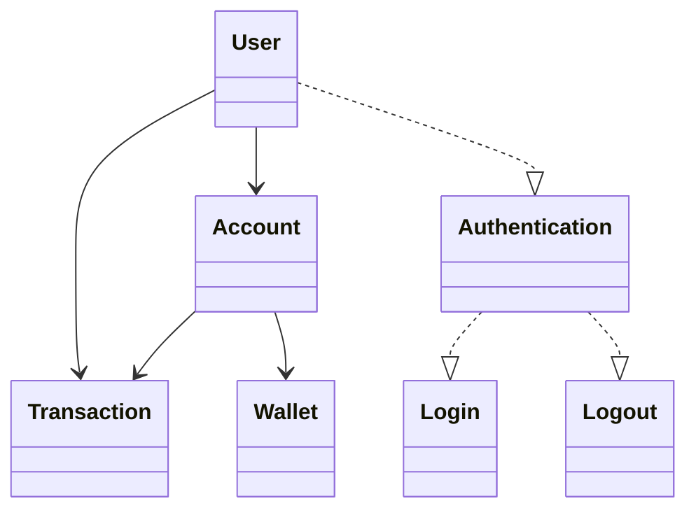
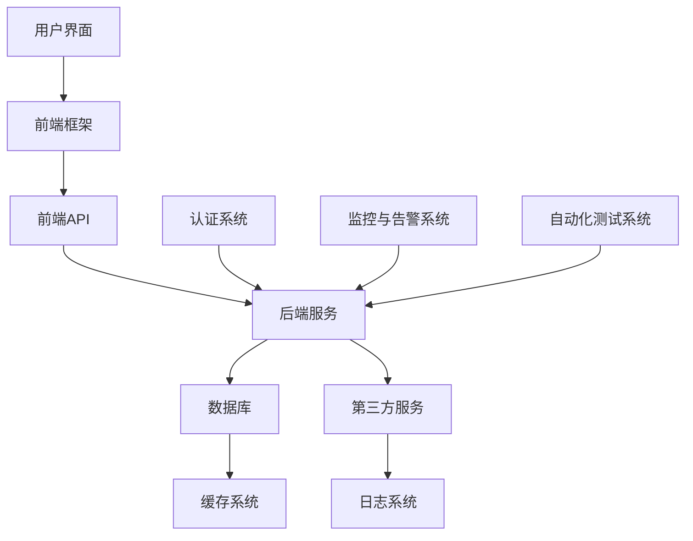
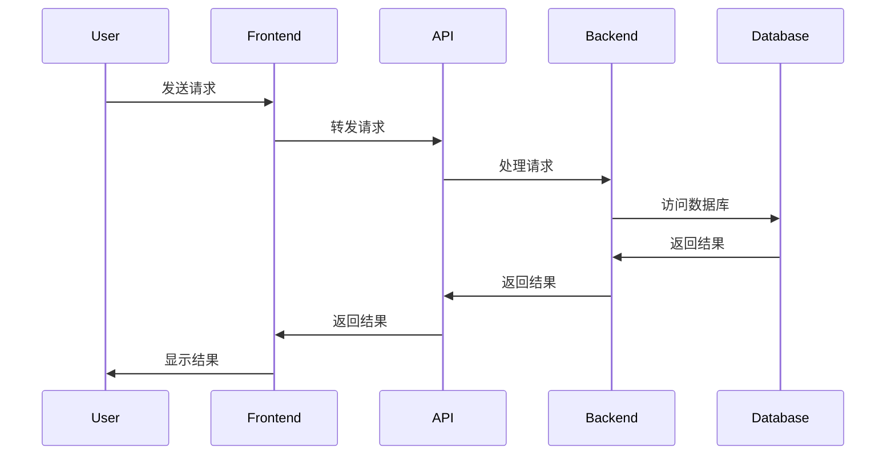

                 

# 金融科技用户体验优化平台

> 关键词：金融科技、用户体验、优化平台、系统架构、算法原理

> 摘要：本文将深入探讨金融科技用户体验优化平台的概念、设计原则、实现方法以及最佳实践。通过详细的分析和案例剖析，帮助读者理解金融科技领域用户体验优化的重要性，并掌握构建高效优化平台的技能。

## 第一部分: 金融科技与用户体验优化平台概述

### 第1章: 金融科技与用户体验优化平台背景介绍

#### 1.1.1 金融科技的发展历程

##### 1.1.1.1 金融科技的定义

金融科技（FinTech）是指利用新技术来变革和优化金融服务行业。它包括但不限于移动支付、区块链、大数据分析、云计算、人工智能等领域。

##### 1.1.1.2 金融科技的核心驱动力

金融科技的核心驱动力包括技术创新、用户需求变化和监管政策的支持。技术创新使得金融服务的效率和质量得到提升，用户需求变化驱动金融科技产品的不断迭代和优化，而监管政策的支持则为金融科技的健康发展提供了保障。

##### 1.1.1.3 金融科技在国内外的应用现状

金融科技在全球范围内得到广泛应用。在国内，互联网金融、区块链技术、智能投顾等领域的应用逐渐成熟；国际上，金融科技巨头如蚂蚁金服、腾讯金融等企业在支付、借贷、保险等领域取得了显著成果。

#### 1.1.2 用户体验优化的意义

##### 1.1.2.1 用户体验的定义

用户体验（User Experience, UX）是指用户在使用产品或服务时所感受到的整体体验。它包括情感、认知和行为的各个方面。

##### 1.1.2.2 用户体验优化的目的

用户体验优化的目的是通过改进产品的设计、功能和交互，提高用户满意度、忠诚度和转化率，从而实现商业目标。

##### 1.1.2.3 用户体验优化的核心要素

用户体验优化的核心要素包括易用性、可用性、美观性、情感共鸣和可持续性。这些要素共同构成了良好的用户体验。

#### 1.1.3 用户体验优化平台的必要性

##### 1.1.3.1 用户体验优化平台的作用

用户体验优化平台是一个集成了多种工具和技术的综合解决方案，用于收集、分析和优化用户体验数据。它能够帮助企业和开发团队快速识别和解决问题，提高产品服务质量。

##### 1.1.3.2 用户体验优化平台与传统优化方法比较

用户体验优化平台与传统优化方法相比，具有数据驱动、实时反馈、自动化优化等优势，能够更有效地提升用户体验。

##### 1.1.3.3 用户体验优化平台的发展趋势

随着人工智能、大数据和云计算等技术的发展，用户体验优化平台将变得更加智能化、个性化和自动化。

### 第2章: 金融科技用户体验优化平台的核心概念与联系

#### 2.1.1 金融科技用户体验优化平台的基本概念

##### 2.1.1.1 金融科技用户体验优化平台的定义

金融科技用户体验优化平台是一个集成了金融科技和用户体验优化技术的综合解决方案，用于提升金融产品的用户体验。

##### 2.1.1.2 金融科技用户体验优化平台的核心要素

金融科技用户体验优化平台的核心要素包括用户研究工具、数据分析工具、优化工具和反馈机制。

#### 2.1.2 用户体验优化平台的技术框架

##### 2.1.2.1 技术架构的设计原则

用户体验优化平台的技术架构设计应遵循模块化、可扩展、易维护的原则。

##### 2.1.2.2 技术组件的构成及作用

用户体验优化平台的技术组件包括前端界面、后端服务器、数据库和第三方服务。

#### 2.1.3 金融科技用户体验优化平台与相关概念的关联

##### 2.1.3.1 金融科技用户体验优化平台与用户研究的关系

金融科技用户体验优化平台通过用户研究工具收集用户数据，为优化提供基础。

##### 2.1.3.2 金融科技用户体验优化平台与数据驱动设计的联系

数据驱动设计是指通过数据分析来指导设计决策，金融科技用户体验优化平台是实现数据驱动设计的工具。

##### 2.1.3.3 金融科技用户体验优化平台与产品设计的关系

金融科技用户体验优化平台通过优化工具和反馈机制，帮助产品设计团队改进产品。

## 第二部分: 金融科技用户体验优化平台的系统分析与架构设计

### 第3章: 金融科技用户体验优化平台的系统分析与架构设计

#### 3.1.1 问题场景介绍

##### 3.1.1.1 金融科技领域的问题场景描述

在金融科技领域，用户体验问题主要表现在界面不友好、功能不完善、响应速度慢等方面。

##### 3.1.1.2 用户体验优化在金融科技中的具体应用场景

用户体验优化在金融科技中的应用场景包括移动支付、在线借贷、财富管理、保险产品等。

#### 3.1.2 系统功能设计

##### 3.1.2.1 领域模型设计（Mermaid类图）



##### 3.1.2.2 系统功能模块划分

系统功能模块划分为用户管理、账户管理、交易管理、钱包管理、认证系统等。

#### 3.1.3 系统架构设计

##### 3.1.3.1 系统架构设计原则

系统架构设计应遵循高可用性、高性能、易扩展的原则。

##### 3.1.3.2 系统架构设计（Mermaid架构图）



##### 3.1.3.3 系统模块之间的关系

系统模块之间的关系包括用户界面与前端框架、前端框架与前端API、后端服务与数据库、认证系统与用户管理模块等。

#### 3.1.4 系统接口设计和系统交互

##### 3.1.4.1 系统接口设计

系统接口设计包括用户接口、服务接口和API接口。

##### 3.1.4.2 系统交互设计（Mermaid序列图）



## 第三部分: 金融科技用户体验优化平台的算法原理讲解

### 第4章: 金融科技用户体验优化平台的算法原理讲解

#### 4.1.1 用户体验评估指标

##### 4.1.1.1 用户体验评估指标的定义

用户体验评估指标是指用于衡量用户体验质量的一系列量化指标。

##### 4.1.1.2 用户体验评估指标的类型及计算方法

用户体验评估指标包括易用性指标、可用性指标、性能指标、情感指标等。计算方法包括平均点击次数、转化率、平均停留时间、用户满意度评分等。

#### 4.1.2 优化算法原理讲解

##### 4.1.2.1 优化算法的基本原理

优化算法的基本原理是通过迭代优化方法，逐步改进用户体验评估指标，以达到最佳用户体验。

##### 4.1.2.2 优化算法的数学模型与公式

优化算法的数学模型通常是基于目标函数的最小化问题，例如：

$$
\min \sum_{i=1}^{n} (X_i - \mu)^2
$$

其中，$X_i$ 表示第 $i$ 个用户体验评估指标，$\mu$ 表示平均值。

##### 4.1.2.3 优化算法的Python源代码实现

```python
import numpy as np

def optimize_experience(data, target):
    n = len(data)
    mu = np.mean(data)
    while True:
        diff = data - mu
        mu_new = np.mean(data)
        if np.linalg.norm(diff) < 1e-6:
            break
        mu = mu_new
    return mu
```

## 第四部分: 金融科技用户体验优化平台的系统实现与项目实战

### 第5章: 金融科技用户体验优化平台的系统实现与项目实战

#### 5.1.1 环境安装

##### 5.1.1.1 开发环境搭建

在开发环境中安装必要的工具和库，例如 Python、Django、MySQL、Redis 等。

##### 5.1.1.2 系统所需组件安装

根据系统架构设计，安装前端框架（如 React、Vue）、后端框架（如 Django、Flask）、数据库（如 MySQL、PostgreSQL）等。

#### 5.1.2 系统核心实现

##### 5.1.2.1 系统核心模块设计与实现

系统核心模块包括用户管理、账户管理、交易管理、钱包管理、认证系统等。以用户管理模块为例，实现包括用户注册、登录、信息修改等功能。

##### 5.1.2.2 系统功能实现流程

系统功能实现流程包括需求分析、设计、编码、测试、部署等阶段。

#### 5.1.3 代码应用解读与分析

##### 5.1.3.1 代码解读

通过对核心模块的代码进行解读，理解其实现原理和关键技术。

##### 5.1.3.2 代码应用分析

分析代码在实际应用中的效果，包括性能、可靠性、可扩展性等方面。

#### 5.1.4 实际案例分析与详细讲解剖析

##### 5.1.4.1 案例一：用户行为分析

分析用户在平台上的行为数据，如登录次数、交易次数、页面停留时间等，为优化提供数据支持。

##### 5.1.4.2 案例二：界面优化

通过用户调研和数据分析，优化界面设计，提高用户体验。

##### 5.1.4.3 案例三：交互体验优化

通过改进交互设计，如按钮布局、提示信息等，提升用户交互体验。

#### 5.1.5 项目小结

##### 5.1.5.1 项目总结

对项目进行总结，包括项目完成情况、遇到的问题及解决方法、项目成果等。

##### 5.1.5.2 项目中遇到的问题及解决方法

总结项目过程中遇到的问题及解决方法，为后续项目提供参考。

##### 5.1.5.3 项目展望与未来工作方向

展望项目的未来发展，包括功能扩展、性能优化、用户体验提升等方面。

## 第五部分: 金融科技用户体验优化平台的最佳实践与注意事项

### 第6章: 金融科技用户体验优化平台的最佳实践与注意事项

#### 6.1.1 最佳实践技巧

##### 6.1.1.1 用户研究的方法与技巧

用户研究的方法包括问卷调查、用户访谈、行为观察等。技巧包括关注用户需求、避免主观偏见、确保数据质量等。

##### 6.1.1.2 用户体验评估的方法与技巧

用户体验评估的方法包括定量评估和定性评估。技巧包括选择合适的评估指标、避免单一指标评价、综合考虑用户满意度等。

##### 6.1.1.3 交互设计的方法与技巧

交互设计的方法包括线框图、原型设计、用户测试等。技巧包括遵循设计规范、关注用户操作流程、注重细节处理等。

#### 6.1.2 小结与展望

##### 6.1.2.1 全书总结

本书对金融科技用户体验优化平台进行了全面的阐述，包括概念、架构设计、算法原理、实战应用等方面。

##### 6.1.2.2 金融科技用户体验优化平台的发展趋势

随着人工智能、大数据等技术的不断发展，金融科技用户体验优化平台将朝着更加智能化、个性化、自动化的方向发展。

##### 6.1.2.3 未来的研究方向

未来的研究方向包括用户体验优化算法的创新、跨平台用户体验优化、智能化用户体验评估等。

## 第六部分: 拓展阅读

### 第7章: 拓展阅读

#### 7.1.1 金融科技相关书籍推荐

- 《金融科技：创新、风险与监管》
- 《区块链：从数字货币到智能合约》
- 《大数据时代：生活、工作与思维的大变革》

#### 7.1.2 用户体验优化相关书籍推荐

- 《用户体验要素》
- 《设计心理学》
- 《交互设计之路》

#### 7.1.3 参考资料

- 《金融科技用户体验优化平台设计指南》
- 《用户体验评估指标与优化方法》
- 《金融科技用户体验优化实践案例》

### 作者信息

作者：AI天才研究院/AI Genius Institute & 禅与计算机程序设计艺术 /Zen And The Art of Computer Programming

------------------------------------------------------------------

