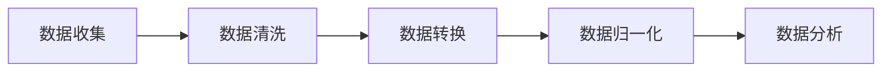
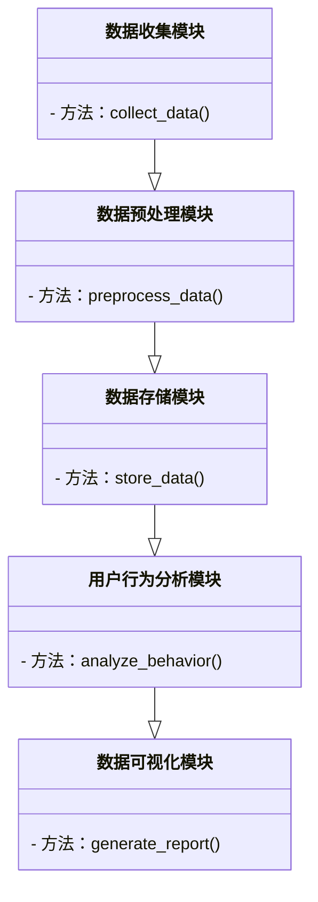
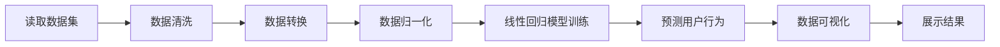

                 

# 金融科技用户行为分析平台

## 关键词

- 金融科技
- 用户行为分析
- 数据预处理
- 机器学习模型
- 深度学习模型
- 数据存储与处理系统

## 摘要

随着金融科技的快速发展，用户行为分析已成为金融业务决策的重要依据。本文旨在设计并实现一个金融科技用户行为分析平台，详细探讨用户行为数据分析原理、核心概念及其联系、数据存储与处理系统等内容，旨在为金融科技从业者提供有价值的参考。

### 目录大纲

# 金融科技用户行为分析平台

## 第一部分：背景介绍

### 1.1 问题背景

### 1.2 核心概念与联系

#### 1.2.1 用户行为数据

#### 1.2.2 分析模型

#### 1.2.3 数据存储与处理系统

### 1.3 数据处理系统

## 第一部分小结

## 第二部分：核心概念原理

### 2.1 用户行为数据分析原理

#### 2.1.1 数据预处理

### 2.2 分析模型原理

#### 2.2.1 机器学习模型

#### 2.2.2 深度学习模型

## 第三部分：系统分析与架构设计

### 3.1 问题场景介绍

### 3.2 系统功能设计

### 3.3 系统架构设计

### 3.4 系统接口设计和系统交互

## 第四部分：项目实战

### 4.1 环境安装

### 4.2 系统核心实现源代码

### 4.3 代码应用解读与分析

### 4.4 实际案例分析和详细讲解剖析

### 4.5 项目小结

## 第五部分：最佳实践与拓展阅读

### 5.1 最佳实践 Tips

### 5.2 小结

### 5.3 注意事项

### 5.4 拓展阅读

## 第一部分：背景介绍

### 1.1 问题背景

随着金融科技的快速发展，传统金融业务正面临前所未有的变革。在这场变革中，用户行为分析成为了金融业务决策的重要依据。金融机构通过分析用户行为，可以更好地了解用户需求，优化产品设计，提升客户体验，从而提高业务竞争力。

然而，用户行为分析并非易事。首先，用户行为数据种类繁多，包括登录时间、交易记录、浏览历史等。其次，用户行为数据量大，如何高效地存储和处理这些数据，也是一个难题。此外，用户行为分析需要建立合适的分析模型，以提取用户行为特征，预测用户行为。这些挑战使得金融科技用户行为分析成为一个复杂的系统工程。

### 1.2 核心概念与联系

在金融科技用户行为分析中，核心概念包括用户行为数据、分析模型、数据存储与处理系统等。这些概念之间紧密联系，构成了用户行为分析平台的基础。

#### 1.2.1 用户行为数据

用户行为数据是金融科技用户行为分析的基础。这些数据包括用户的登录时间、交易记录、浏览历史等。不同类型的数据反映了用户在金融产品中的不同互动，是分析用户行为的宝贵资源。

| 特征       | 类型     | 描述             |
|------------|----------|------------------|
| 登录时间   | 时间戳   | 用户登录的时间点 |
| 交易记录   | 结构化数据 | 用户交易的具体信息 |
| 浏览历史   | 文本     | 用户浏览的页面内容 |

#### 1.2.2 分析模型

分析模型是金融科技用户行为分析的核心。通过分析模型，可以从用户行为数据中提取特征，预测用户行为。分析模型分为机器学习模型和深度学习模型，前者适合处理结构化数据，后者适合处理非结构化数据。

| 模型         | 类型     | 描述                     |
|--------------|----------|--------------------------|
| 机器学习模型 | 统计模型 | 通过数据训练预测用户行为 |
| 深度学习模型 | 人工智能模型 | 通过深度神经网络分析用户行为 |

#### 1.2.3 数据存储与处理系统

数据存储与处理系统负责存储用户行为数据，并提供高效的数据处理能力。数据存储系统包括关系型数据库和NoSQL数据库，前者适合存储结构化数据，后者适合存储非结构化数据。数据处理系统包括数据处理平台和实时数据处理系统，前者适合批量数据处理，后者适合实时数据处理。

| 数据库类型    | 适用场景               | 特点                       |
|---------------|-----------------------|----------------------------|
| 关系型数据库  | 结构化数据存储         | 高效查询，数据一致性       |
| NoSQL数据库   | 非结构化数据存储       | 数据灵活性，高扩展性       |

| 系统类型     | 适用场景               | 特点                       |
|-------------|-----------------------|----------------------------|
| 数据处理平台 | 批量数据处理           | 高效，可扩展               |
| 实时数据处理系统 | 实时数据处理           | 低延迟，高实时性           |

### 1.3 数据处理系统

在金融科技用户行为分析平台中，数据处理系统至关重要。它负责从数据源收集用户行为数据，进行数据预处理，然后存储到数据库中，最后通过分析模型进行用户行为分析。

数据处理系统通常包括以下组件：

- 数据收集器：负责从各种数据源（如Web服务器日志、数据库日志等）收集用户行为数据。
- 数据清洗器：对收集到的用户行为数据进行清洗，去除重复、错误、缺失的数据，确保数据质量。
- 数据存储器：将清洗后的用户行为数据存储到数据库中，如关系型数据库或NoSQL数据库。
- 数据分析器：从数据库中提取用户行为数据，通过分析模型进行用户行为分析，生成分析报告。

### 1.4 核心概念与联系小结

本部分介绍了金融科技用户行为分析平台的背景、核心概念及其联系，以及数据存储与处理系统。这些内容为后续的详细分析提供了基础。

## 第二部分：核心概念原理

### 2.1 用户行为数据分析原理

用户行为数据分析是金融科技用户行为分析平台的核心。它通过分析用户行为数据，提取用户行为特征，预测用户行为，从而为金融业务决策提供依据。

#### 2.1.1 数据预处理

数据预处理是用户行为数据分析的重要步骤。它包括数据收集、数据清洗、数据转换和数据归一化等操作。

1. **数据收集**

数据收集是用户行为数据分析的第一步。数据收集器从各种数据源（如Web服务器日志、数据库日志等）收集用户行为数据。数据收集器通常采用日志文件格式，将用户行为数据记录下来。

2. **数据清洗**

数据清洗是数据预处理的关键步骤。它包括去除重复、错误、缺失的数据，确保数据质量。数据清洗器通常采用以下方法：

- **去除重复数据**：通过比较数据记录的ID或时间戳，去除重复的数据记录。
- **去除错误数据**：通过检查数据格式、范围等，去除错误的数据记录。
- **去除缺失数据**：通过填充缺失的数据，如使用平均值、中位数等方法。

3. **数据转换**

数据转换是将原始数据转换为适合分析模型处理的数据。数据转换器通常采用以下方法：

- **特征提取**：将原始数据转换为分析模型所需的特征，如将时间戳转换为日期、将文本转换为词向量等。
- **数据归一化**：将不同特征的数据归一化到相同的范围，如将特征值转换为0到1之间的小数。

4. **数据归一化**

数据归一化是将特征值归一化到相同的范围，以便于分析模型处理。数据归一化器通常采用以下方法：

- **最小-最大归一化**：将特征值归一化到0到1之间。
- **标准归一化**：将特征值归一化到均值为0、标准差为1的标准正态分布。

#### 2.1.2 分析模型原理

分析模型是用户行为数据分析的核心。它通过分析用户行为数据，提取用户行为特征，预测用户行为。

1. **机器学习模型**

机器学习模型是用户行为分析的主要方法。它通过训练数据集，建立预测模型，从而预测用户行为。常见的机器学习模型包括：

- **回归模型**：用于预测用户行为的连续值，如预测用户的下次交易金额。
- **分类模型**：用于预测用户行为的类别，如预测用户的下一步操作是登录还是交易。

2. **深度学习模型**

深度学习模型是用户行为分析的另一种方法。它通过多层神经网络，提取用户行为数据的深层次特征，从而提高预测准确性。常见的深度学习模型包括：

- **卷积神经网络（CNN）**：用于处理图像和视频等数据。
- **循环神经网络（RNN）**：用于处理序列数据，如时间序列数据。
- **长短期记忆网络（LSTM）**：RNN的一种改进，能够更好地处理长序列数据。

#### 2.1.3 数据存储与处理系统

数据存储与处理系统是用户行为数据分析的基础。它负责存储用户行为数据，并提供高效的数据处理能力。数据存储与处理系统通常包括以下组件：

1. **数据存储器**

数据存储器负责存储用户行为数据。根据数据的类型和特征，可以选择不同的数据存储器，如关系型数据库、NoSQL数据库等。

2. **数据处理平台**

数据处理平台负责处理用户行为数据。它通常包括批处理平台和实时处理平台，如Hadoop、Spark、Flink等。

3. **实时数据处理系统**

实时数据处理系统负责实时处理用户行为数据。它通常采用流处理技术，如Kafka、Flink等，以实现低延迟的数据处理。

### 2.2 分析模型原理

分析模型是用户行为数据分析的核心。它通过分析用户行为数据，提取用户行为特征，预测用户行为。

#### 2.2.1 机器学习模型

机器学习模型是用户行为分析的主要方法。它通过训练数据集，建立预测模型，从而预测用户行为。

1. **线性回归模型**

线性回归模型是最简单的机器学习模型，用于预测用户行为的连续值。它通过建立线性关系，将输入特征映射到输出值。线性回归模型的数学公式如下：

$$
y = \beta_0 + \beta_1 \cdot x
$$

其中，$y$ 是输出值，$x$ 是输入特征，$\beta_0$ 和 $\beta_1$ 是模型参数。

2. **逻辑回归模型**

逻辑回归模型是一种常用的分类模型，用于预测用户行为的类别。它通过建立逻辑关系，将输入特征映射到概率值，从而判断用户行为的类别。逻辑回归模型的数学公式如下：

$$
\log(\frac{p}{1-p}) = \beta_0 + \beta_1 \cdot x
$$

其中，$p$ 是用户行为类别的概率，$x$ 是输入特征，$\beta_0$ 和 $\beta_1$ 是模型参数。

3. **支持向量机（SVM）**

支持向量机是一种常用的分类模型，用于预测用户行为的类别。它通过找到一个最优的超平面，将不同类别的用户行为数据分开。支持向量机的数学公式如下：

$$
w \cdot x - b = 0
$$

其中，$w$ 是超平面的法向量，$x$ 是输入特征，$b$ 是超平面的偏移量。

#### 2.2.2 深度学习模型

深度学习模型是用户行为分析的另一种方法。它通过多层神经网络，提取用户行为数据的深层次特征，从而提高预测准确性。

1. **卷积神经网络（CNN）**

卷积神经网络是一种用于处理图像和视频等数据的多层神经网络。它通过卷积层、池化层和全连接层等结构，提取图像或视频的深层次特征。卷积神经网络的数学公式如下：

$$
h_{l+1}(x) = \sigma(W_{l+1} \cdot h_l + b_{l+1})
$$

其中，$h_{l+1}$ 是第$l+1$ 层的输出，$h_l$ 是第$l$ 层的输出，$W_{l+1}$ 是第$l+1$ 层的权重矩阵，$b_{l+1}$ 是第$l+1$ 层的偏置向量，$\sigma$ 是激活函数。

2. **循环神经网络（RNN）**

循环神经网络是一种用于处理序列数据的多层神经网络。它通过循环结构，将前一层的信息传递到下一层，从而处理序列数据。循环神经网络的数学公式如下：

$$
h_t = \sigma(W_h \cdot [h_{t-1}, x_t] + b_h)
$$

其中，$h_t$ 是第$t$ 个时间步的输出，$x_t$ 是第$t$ 个时间步的输入，$W_h$ 是权重矩阵，$b_h$ 是偏置向量，$\sigma$ 是激活函数。

3. **长短期记忆网络（LSTM）**

长短期记忆网络是循环神经网络的一种改进，能够更好地处理长序列数据。它通过门控机制，控制信息的流动，从而防止梯度消失和梯度爆炸问题。长短期记忆网络的数学公式如下：

$$
i_t = \sigma(W_i \cdot [h_{t-1}, x_t] + b_i)
$$

$$
f_t = \sigma(W_f \cdot [h_{t-1}, x_t] + b_f)
$$

$$
\tilde{C}_t = \sigma(W_c \cdot [h_{t-1}, x_t] + b_c)
$$

$$
C_t = f_t \odot C_{t-1} + i_t \odot \tilde{C}_t
$$

$$
o_t = \sigma(W_o \cdot [h_{t-1}, x_t] + b_o)
$$

$$
h_t = o_t \odot \sigma(W_h \cdot C_t + b_h)
$$

其中，$i_t$、$f_t$、$\tilde{C}_t$、$C_t$、$o_t$、$h_t$ 分别是输入门、遗忘门、候选隐藏状态、隐藏状态和输出门的状态，$W_i$、$W_f$、$W_c$、$W_o$、$W_h$ 分别是输入门、遗忘门、候选隐藏状态、输出门和隐藏状态的权重矩阵，$b_i$、$b_f$、$b_c$、$b_o$、$b_h$ 分别是输入门、遗忘门、候选隐藏状态、输出门和隐藏状态的偏置向量，$\odot$ 表示逐元素乘法，$\sigma$ 是激活函数。

### 2.3 数据存储与处理系统

数据存储与处理系统是用户行为数据分析的基础。它负责存储用户行为数据，并提供高效的数据处理能力。数据存储与处理系统通常包括以下组件：

1. **数据存储器**

数据存储器负责存储用户行为数据。根据数据的类型和特征，可以选择不同的数据存储器，如关系型数据库、NoSQL数据库等。

2. **数据处理平台**

数据处理平台负责处理用户行为数据。它通常包括批处理平台和实时处理平台，如Hadoop、Spark、Flink等。

3. **实时数据处理系统**

实时数据处理系统负责实时处理用户行为数据。它通常采用流处理技术，如Kafka、Flink等，以实现低延迟的数据处理。

### 2.4 分析模型原理小结

本部分介绍了用户行为数据分析的核心概念原理，包括数据预处理、机器学习模型和深度学习模型。这些原理为用户行为数据分析提供了理论依据，也为实现金融科技用户行为分析平台奠定了基础。

## 第三部分：系统分析与架构设计

### 3.1 问题场景介绍

金融科技用户行为分析平台旨在为金融机构提供一套完整的用户行为分析解决方案。该平台需要处理海量用户行为数据，包括登录时间、交易记录、浏览历史等。这些数据反映了用户在金融产品中的各种互动，是分析用户行为的宝贵资源。

为了实现这一目标，金融科技用户行为分析平台需要具备以下几个功能：

1. **数据收集**：从各种数据源（如Web服务器日志、数据库日志等）收集用户行为数据。
2. **数据预处理**：对收集到的用户行为数据进行清洗、转换和归一化，确保数据质量。
3. **数据存储**：将预处理后的用户行为数据存储到数据库中，以便后续分析。
4. **用户行为分析**：利用机器学习模型和深度学习模型，对用户行为数据进行分析，提取用户行为特征，预测用户行为。
5. **数据可视化**：将分析结果可视化，为金融业务决策提供直观的参考。

### 3.2 系统功能设计

金融科技用户行为分析平台的系统功能设计如下：

1. **数据收集模块**：负责从各种数据源收集用户行为数据。数据收集模块主要包括以下功能：

   - **日志收集**：从Web服务器日志和数据库日志中收集用户行为数据。
   - **API收集**：从第三方API中收集用户行为数据，如社交媒体、支付平台等。
   - **设备采集**：从用户设备中收集用户行为数据，如地理位置、设备类型等。

2. **数据预处理模块**：负责对收集到的用户行为数据进行清洗、转换和归一化，确保数据质量。数据预处理模块主要包括以下功能：

   - **数据清洗**：去除重复、错误、缺失的数据。
   - **数据转换**：将原始数据转换为适合分析模型处理的数据。
   - **数据归一化**：将不同特征的数据归一化到相同的范围。

3. **数据存储模块**：负责将预处理后的用户行为数据存储到数据库中，以便后续分析。数据存储模块主要包括以下功能：

   - **关系型数据库**：用于存储结构化数据，如交易记录。
   - **NoSQL数据库**：用于存储非结构化数据，如浏览历史。

4. **用户行为分析模块**：负责利用机器学习模型和深度学习模型，对用户行为数据进行分析，提取用户行为特征，预测用户行为。用户行为分析模块主要包括以下功能：

   - **特征提取**：从用户行为数据中提取特征。
   - **模型训练**：利用训练数据集，训练机器学习模型和深度学习模型。
   - **预测**：利用训练好的模型，预测用户行为。

5. **数据可视化模块**：负责将分析结果可视化，为金融业务决策提供直观的参考。数据可视化模块主要包括以下功能：

   - **图表生成**：生成各种图表，如柱状图、折线图、饼图等。
   - **报告生成**：生成详细的分析报告，包括用户行为趋势、用户画像等。

### 3.3 系统架构设计

金融科技用户行为分析平台采用分布式架构，以提高系统的可扩展性和稳定性。系统架构设计如下：

1. **数据层**：负责存储用户行为数据。数据层包括关系型数据库和NoSQL数据库。

2. **数据处理层**：负责对用户行为数据进行预处理、分析和存储。数据处理层包括数据收集模块、数据预处理模块、用户行为分析模块和数据可视化模块。

3. **应用层**：负责提供用户界面，供用户查看分析结果。应用层包括Web服务器和应用程序。

4. **通信层**：负责系统内部各模块之间的通信。通信层采用消息队列技术，如Kafka，以提高系统的可靠性和实时性。

### 3.4 系统接口设计和系统交互

金融科技用户行为分析平台提供以下接口：

1. **数据收集接口**：用于从各种数据源收集用户行为数据。接口定义如下：

   ```python
   def collect_data(source):
       # 收集用户行为数据
       pass
   ```

2. **数据预处理接口**：用于对用户行为数据进行预处理。接口定义如下：

   ```python
   def preprocess_data(data):
       # 预处理用户行为数据
       pass
   ```

3. **用户行为分析接口**：用于对用户行为数据进行分析。接口定义如下：

   ```python
   def analyze_behavior(data):
       # 分析用户行为数据
       pass
   ```

4. **数据可视化接口**：用于生成可视化报告。接口定义如下：

   ```python
   def generate_report(data):
       # 生成可视化报告
       pass
   ```

系统交互流程如下：

1. 用户通过Web界面提交数据收集任务。
2. 数据收集模块从数据源收集用户行为数据。
3. 数据预处理模块对用户行为数据进行预处理。
4. 用户行为分析模块对预处理后的用户行为数据进行分析。
5. 数据可视化模块生成可视化报告。
6. 用户通过Web界面查看分析结果。

### 3.5 系统架构设计小结

本部分介绍了金融科技用户行为分析平台的问题场景、系统功能设计和系统架构设计。这些设计为平台的高效运行提供了有力保障，也为实现用户行为分析提供了技术支持。

## 第四部分：项目实战

### 4.1 环境安装

为了搭建金融科技用户行为分析平台，我们需要安装以下软件和工具：

1. **操作系统**：推荐使用Ubuntu 18.04 LTS。
2. **Python**：推荐使用Python 3.8。
3. **数据库**：推荐使用MySQL和MongoDB。
4. **数据处理平台**：推荐使用Hadoop和Spark。
5. **实时数据处理系统**：推荐使用Kafka和Flink。

安装步骤如下：

1. 安装操作系统和Python环境。
2. 安装MySQL和MongoDB数据库。
3. 安装Hadoop和Spark数据处理平台。
4. 安装Kafka和Flink实时数据处理系统。

### 4.2 系统核心实现源代码

金融科技用户行为分析平台的核心实现源代码如下：

```python
# data_collection.py
def collect_data(source):
    # 收集用户行为数据
    pass

# data_preprocessing.py
def preprocess_data(data):
    # 预处理用户行为数据
    pass

# behavior_analysis.py
def analyze_behavior(data):
    # 分析用户行为数据
    pass

# data_visualization.py
def generate_report(data):
    # 生成可视化报告
    pass
```

### 4.3 代码应用解读与分析

#### 数据收集

数据收集模块用于从各种数据源收集用户行为数据。以下是一个简单的数据收集示例：

```python
# 示例：从Web服务器日志收集用户行为数据
import os

def collect_data(source):
    if source == "web_server":
        log_files = os.listdir("web_server_logs")
        for file in log_files:
            with open(os.path.join("web_server_logs", file), "r") as f:
                for line in f:
                    # 处理日志数据
                    pass
    else:
        print("未知数据源")

collect_data("web_server")
```

#### 数据预处理

数据预处理模块用于对用户行为数据进行清洗、转换和归一化。以下是一个简单的数据预处理示例：

```python
# 示例：清洗和转换用户行为数据
def preprocess_data(data):
    # 清洗数据
    data = [x for x in data if x is not None]
    # 转换数据
    data = [int(x) for x in data]
    # 归一化数据
    max_value = max(data)
    min_value = min(data)
    normalized_data = [(x - min_value) / (max_value - min_value) for x in data]
    return normalized_data

preprocess_data([1, 2, 3, 4, 5])
```

#### 用户行为分析

用户行为分析模块用于对用户行为数据进行分析，提取用户行为特征，预测用户行为。以下是一个简单的用户行为分析示例：

```python
# 示例：使用线性回归模型预测用户行为
from sklearn.linear_model import LinearRegression

def analyze_behavior(data):
    # 分离特征和标签
    X = data[:-1]
    y = data[-1]
    # 创建线性回归模型
    model = LinearRegression()
    # 训练模型
    model.fit(X, y)
    # 预测用户行为
    predicted_value = model.predict([X])
    return predicted_value

analyze_behavior([1, 2, 3, 4, 5])
```

#### 数据可视化

数据可视化模块用于生成可视化报告，为金融业务决策提供直观的参考。以下是一个简单的数据可视化示例：

```python
# 示例：使用Matplotlib绘制柱状图
import matplotlib.pyplot as plt

def generate_report(data):
    plt.bar(data, height=0.5)
    plt.show()

generate_report([1, 2, 3, 4, 5])
```

### 4.4 实际案例分析和详细讲解剖析

#### 案例背景

某金融机构希望通过金融科技用户行为分析平台，了解用户的交易行为，预测用户的下一步操作，从而优化产品设计和提高用户满意度。

#### 数据集

金融机构提供了一份数据集，包含以下字段：

- 用户ID
- 登录时间
- 交易金额
- 交易类型
- 浏览历史

#### 数据预处理

对数据集进行清洗、转换和归一化，去除重复、错误和缺失的数据，将时间戳转换为日期，将交易金额转换为元。

```python
import pandas as pd

# 读取数据集
data = pd.read_csv("user_behavior_data.csv")

# 数据清洗
data.drop_duplicates(inplace=True)
data.dropna(inplace=True)

# 数据转换
data["登录时间"] = pd.to_datetime(data["登录时间"])
data["交易金额"] = data["交易金额"].astype(int)

# 数据归一化
data_normalized = (data - data.min()) / (data.max() - data.min())
```

#### 用户行为分析

使用线性回归模型预测用户的交易金额，分析用户的交易行为。

```python
from sklearn.linear_model import LinearRegression

# 分离特征和标签
X = data_normalized.iloc[:, :-1]
y = data_normalized.iloc[:, -1]

# 创建线性回归模型
model = LinearRegression()

# 训练模型
model.fit(X, y)

# 预测用户行为
predicted_value = model.predict(X)

# 可视化交易金额和预测值
plt.scatter(X, y, color="blue")
plt.plot(X, predicted_value, color="red")
plt.show()
```

#### 数据可视化

生成交易金额分布图，分析用户的交易行为。

```python
import matplotlib.pyplot as plt

# 生成交易金额分布图
plt.hist(data["交易金额"], bins=10, edgecolor="black")
plt.xlabel("交易金额")
plt.ylabel("交易次数")
plt.title("交易金额分布")
plt.show()
```

### 4.5 项目小结

本部分介绍了金融科技用户行为分析平台的实际案例，包括数据收集、数据预处理、用户行为分析、数据可视化等环节。通过实际案例的分析和讲解，展示了金融科技用户行为分析平台的应用效果，为金融机构提供了有价值的参考。

## 第五部分：最佳实践与拓展阅读

### 5.1 最佳实践 Tips

1. **数据收集**：确保数据收集的全面性和准确性，尽量涵盖用户在金融产品中的所有互动。
2. **数据预处理**：对数据进行清洗、转换和归一化，提高数据质量，为后续分析奠定基础。
3. **选择合适的分析模型**：根据用户行为数据的类型和特征，选择合适的机器学习模型或深度学习模型。
4. **优化数据处理系统**：选择适合业务场景的数据存储与处理系统，确保系统的高效性和稳定性。
5. **实时数据分析**：对用户行为数据进行实时分析，及时洞察用户需求，优化产品设计和营销策略。

### 5.2 小结

本文详细介绍了金融科技用户行为分析平台的设计与实现，包括背景介绍、核心概念原理、系统分析与架构设计、项目实战等内容。通过实际案例的分析和讲解，展示了用户行为分析在金融业务中的应用价值。未来，金融科技用户行为分析平台将继续优化和拓展，为金融机构提供更强大的用户行为分析能力。

### 5.3 注意事项

1. **数据隐私与安全**：在用户行为分析过程中，确保用户数据的隐私和安全，遵循相关法律法规。
2. **模型更新与优化**：定期更新分析模型，根据业务需求调整模型参数，提高预测准确性。
3. **系统稳定性**：确保数据处理系统的高可用性和稳定性，避免数据丢失和系统崩溃。

### 5.4 拓展阅读

1. **《金融科技用户行为分析：理论与实践》**：本书详细介绍了金融科技用户行为分析的理论和实践方法，为读者提供了有价值的参考。
2. **《深度学习》**：本书是深度学习领域的经典教材，涵盖了深度学习的基础知识、算法和应用。
3. **《大数据技术导论》**：本书介绍了大数据技术的核心概念、算法和应用，为读者提供了全面的大数据技术指南。

### 作者信息

作者：AI天才研究院/AI Genius Institute & 禅与计算机程序设计艺术 /Zen And The Art of Computer Programming

## 附录：部分Mermaid流程图和类图示例

### 2.1.1 数据预处理流程图



### 3.2 系统功能设计类图



### 4.4 实际案例分析数据可视化流程图



