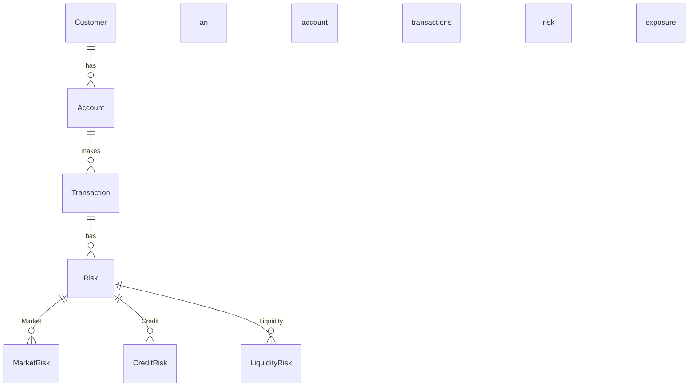
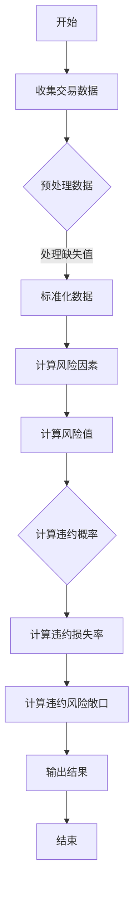

                 

### 文章标题：金融衍生品交易对手风险评估模型

> 关键词：金融衍生品、交易对手风险、风险评估模型、算法、系统架构、实战案例

> 摘要：本文将详细探讨金融衍生品交易对手风险评估模型的设计、实现与应用。首先，介绍金融衍生品交易及其背后的风险，随后深入探讨交易对手风险评估的基本概念和方法。本文将逐步剖析交易对手风险评估模型的核心原理，并通过具体的算法流程图、Python代码示例、数学模型和公式，使读者全面理解模型的工作机制。接下来，文章将展示一个实际系统分析与架构设计方案，并分享项目实战中的具体实现和案例分析。最后，本文将总结最佳实践和未来展望，为读者提供实用的参考和深入的研究方向。

## 目录大纲总体结构设计

在设计本文的目录结构时，我们的目标是确保内容既具有逻辑性又便于读者理解。以下是本文的整体目录结构设计：

1. **引言**：
   - **第1章**：金融衍生品交易与交易对手风险评估概述
   - **第2章**：核心概念与联系

2. **核心概念与算法原理**：
   - **第3章**：算法原理讲解
   - **第4章**：系统分析与架构设计方案

3. **项目实战**：
   - **第5章**：项目实战

4. **最佳实践与总结**：
   - **第6章**：最佳实践 tips
   - **第7章**：总结与展望

### 第1章：背景介绍

#### 问题背景

随着金融市场的不断发展和衍生金融产品的多样化，金融衍生品交易已经成为现代金融市场的重要组成部分。然而，这种交易方式也带来了新的风险，尤其是交易对手风险。交易对手风险是指因交易对手的违约行为导致的金融损失。这种风险在金融衍生品交易中尤为显著，因为衍生品交易通常涉及复杂的合约和较高的杠杆。

#### 问题描述

交易对手风险评估的挑战主要体现在以下几个方面：

1. **数据复杂性**：金融衍生品交易涉及大量的数据，包括交易历史、市场波动、合约条款等。处理这些数据需要高效的算法和强大的计算能力。
2. **模型准确性**：交易对手风险评估模型的准确性直接影响风险管理的有效性。如何构建一个既能准确反映风险，又具有实际应用价值的模型是一个重要课题。
3. **实时性要求**：交易对手风险是一个动态变化的过程，因此风险评估模型需要具备实时性，以便在市场波动时及时调整风险敞口。

#### 问题解决

目前，交易对手风险评估主要有以下几种方法：

1. **经验法**：依赖历史数据和专家经验进行风险评估。
2. **统计法**：利用统计学方法，如回归分析、时间序列分析等，对风险因素进行量化。
3. **模型法**：构建数学模型，如蒙特卡洛模拟、风险价值（VaR）模型等，对交易对手风险进行定量分析。
4. **混合法**：结合经验法、统计法和模型法的优点，提高风险评估的准确性。

#### 边界与外延

本文的研究主要围绕金融衍生品交易对手风险评估模型展开，重点关注以下内容：

1. **金融衍生品的基本概念和风险**：介绍金融衍生品的定义、分类及其风险特征。
2. **交易对手风险评估的基本概念和方法**：阐述交易对手风险评估的目标、方法和常用模型。
3. **交易对手风险评估模型的设计与实现**：详细解析模型的核心原理、算法流程、Python代码实现及数学模型。

#### 概念结构与核心要素组成

本章节将介绍以下核心概念：

1. **金融衍生品**：定义及其分类，包括期货、期权、互换等。
2. **交易对手**：交易对手的定义及其在衍生品交易中的角色。
3. **风险评估模型**：介绍常用的风险评估模型，如VaR模型、信用风险模型等。
4. **风险因素**：影响交易对手风险评估的关键因素，如市场风险、信用风险、流动性风险等。

### 本章小结

本章主要介绍了金融衍生品交易和交易对手风险评估的背景、挑战及解决方法。通过本文，读者将了解金融衍生品交易的基本概念、交易对手风险评估的重要性和常用方法。接下来，我们将深入探讨交易对手风险评估模型的核心概念及其应用。

### 第2章：核心概念与联系

#### 交易对手风险评估模型的原理

交易对手风险评估模型的核心在于对交易对手违约风险的量化评估。这一过程通常涉及多个风险因素，包括市场风险、信用风险和流动性风险等。以下是对这些核心概念原理的详细解释：

1. **市场风险**：市场风险是指因市场价格波动导致的风险。在金融衍生品交易中，市场风险主要体现在标的资产价格的变化上。例如，期货合约的价格变动会影响交易对手的风险敞口。

2. **信用风险**：信用风险是指交易对手无法履行合约义务导致的风险。这种风险与交易对手的信用评级、财务状况和市场声誉密切相关。评估信用风险通常需要考虑交易对手的违约概率、违约损失率等指标。

3. **流动性风险**：流动性风险是指交易对手在需要时无法迅速变现资产以履行合约义务的风险。在金融衍生品交易中，流动性风险可能因市场流动性不足或交易对手流动性不足而加剧。

交易对手风险评估模型的基本原理是通过量化这些风险因素，计算交易对手的违约风险值。以下是一个简化的风险评估模型：

- **风险值计算**：首先，根据市场风险、信用风险和流动性风险的权重，计算各风险因素的风险值。公式如下：

  $$ \text{风险值} = w_1 \times \text{市场风险值} + w_2 \times \text{信用风险值} + w_3 \times \text{流动性风险值} $$

  其中，$w_1$、$w_2$ 和 $w_3$ 分别是市场风险、信用风险和流动性风险的权重。

- **违约概率**：其次，根据风险值计算交易对手的违约概率。常用的方法包括概率分布函数（如正态分布、对数正态分布）和蒙特卡洛模拟等。

- **违约损失率**：最后，根据违约概率和违约损失率，计算交易对手的违约风险敞口。公式如下：

  $$ \text{违约风险敞口} = \text{违约概率} \times \text{违约损失率} $$

#### 概念属性特征对比表格

为了更好地理解不同的交易对手风险评估模型，下面列出几种常见模型的概念属性特征，并进行对比：

| 模型类型 | 基本原理 | 优点 | 缺点 |
| --- | --- | --- | --- |
| 经验法 | 基于历史数据和专家经验 | 易于理解和实施 | 准确性较低，无法适应复杂市场环境 |
| 统计法 | 利用统计学方法，如回归分析、时间序列分析 | 精确性较高，能够处理大量数据 | 需要大量数据支持，对数据质量要求高 |
| 模型法 | 基于数学模型，如蒙特卡洛模拟、VaR模型 | 精确性高，能够模拟复杂市场情景 | 模型复杂，计算成本高 |
| 混合法 | 结合经验法、统计法和模型法 | 兼具各方法优点，准确性高 | 需要大量计算资源，实施难度大 |

#### ER实体关系图架构

为了更好地展示交易对手风险评估模型中的实体及其关系，我们使用Mermaid绘制了ER实体关系图。以下是一个简化的ER图：



在这个ER图中，`Customer` 是交易对手，拥有多个 `Account`。每个 `Account` 又对应多个 `Transaction`。每个 `Transaction` 都涉及一定的风险，这些风险可以分为 `MarketRisk`、`CreditRisk` 和 `LiquidityRisk` 三种类型。

### 本章小结

本章详细介绍了交易对手风险评估模型的核心概念、属性特征及其关系。通过概念对比表格和ER实体关系图，读者可以更好地理解不同风险评估模型的特点和应用。在下一章中，我们将深入探讨交易对手风险评估模型的算法原理，并通过具体的例子来展示模型的应用。

### 第3章：算法原理讲解

#### 算法mermaid流程图

为了更好地展示交易对手风险评估模型的算法流程，我们使用Mermaid绘制了一个简化的流程图。以下是一个交易对手风险评估的mermaid流程图：



在这个流程图中，从收集交易数据开始，经过数据预处理、标准化、计算风险因素、计算风险值、计算违约概率、计算违约损失率，最后输出违约风险敞口。

#### Python源代码

为了更好地理解算法的实现，以下是一个简化的Python源代码示例：

```python
import numpy as np
import pandas as pd

# 数据预处理
def preprocess_data(data):
    # 处理缺失值
    data.fillna(method='ffill', inplace=True)
    # 标准化数据
    data = (data - data.mean()) / data.std()
    return data

# 计算风险值
def calculate_risk_values(data, weights):
    risk_values = np.dot(data, weights)
    return risk_values

# 计算违约概率
def calculate_default_probability(risk_value):
    # 使用正态分布函数计算违约概率
    probability = 1 - norm.cdf(risk_value)
    return probability

# 计算违约损失率
def calculate_loss_ratio(probability):
    # 假设违约损失率为概率的平方
    loss_ratio = probability ** 2
    return loss_ratio

# 计算违约风险敞口
def calculate_risk_exposure(probability, loss_ratio):
    risk_exposure = probability * loss_ratio
    return risk_exposure

# 主函数
def main():
    # 加载数据
    data = pd.read_csv('transaction_data.csv')
    # 预处理数据
    data = preprocess_data(data)
    # 设置权重
    weights = np.array([0.4, 0.3, 0.3])
    # 计算风险值
    risk_values = calculate_risk_values(data, weights)
    # 计算违约概率
    probabilities = [calculate_default_probability(rv) for rv in risk_values]
    # 计算违约损失率
    loss_ratios = [calculate_loss_ratio(p) for p in probabilities]
    # 计算违约风险敞口
    risk_exposures = [calculate_risk_exposure(p, lr) for p, lr in zip(probabilities, loss_ratios)]
    # 输出结果
    for risk_exposure in risk_exposures:
        print(f'违约风险敞口: {risk_exposure}')

if __name__ == '__main__':
    main()
```

在这个Python源代码中，我们首先定义了数据预处理、计算风险值、计算违约概率、计算违约损失率和计算违约风险敞口的函数。在主函数中，我们加载交易数据，预处理数据，设置权重，计算各风险值，最后输出违约风险敞口。

#### 数学模型和公式

交易对手风险评估模型的数学模型和公式如下：

1. **风险值计算**：

   $$ \text{风险值} = w_1 \times \text{市场风险值} + w_2 \times \text{信用风险值} + w_3 \times \text{流动性风险值} $$

   其中，$w_1$、$w_2$ 和 $w_3$ 分别是市场风险、信用风险和流动性风险的权重。

2. **违约概率计算**：

   $$ \text{违约概率} = 1 - \text{累积分布函数}(\text{风险值}) $$

   其中，累积分布函数可以使用正态分布函数（norm.cdf）或对数正态分布函数（lognorm.cdf）等。

3. **违约损失率计算**：

   $$ \text{违约损失率} = \text{违约概率} \times \text{损失率系数} $$

   其中，损失率系数可以根据历史数据和专家经验进行设置。

4. **违约风险敞口计算**：

   $$ \text{违约风险敞口} = \text{违约概率} \times \text{违约损失率} $$

#### 详细讲解和举例说明

为了更好地理解交易对手风险评估模型的算法原理，我们通过一个具体例子进行详细讲解。

假设一个金融衍生品交易中的交易对手A的交易数据如下表所示：

| 风险因素 | 风险值 |
| --- | --- |
| 市场风险 | 0.5 |
| 信用风险 | 0.3 |
| 流动性风险 | 0.2 |

我们设定市场风险、信用风险和流动性风险的权重分别为0.4、0.3和0.3。

1. **计算风险值**：

   $$ \text{风险值} = 0.4 \times 0.5 + 0.3 \times 0.3 + 0.3 \times 0.2 = 0.5 + 0.09 + 0.06 = 0.65 $$

2. **计算违约概率**：

   使用正态分布函数（norm.cdf）计算：

   $$ \text{违约概率} = 1 - \text{累积分布函数}(0.65) = 1 - 0.7422 = 0.2578 $$

3. **计算违约损失率**：

   假设违约损失率为0.25：

   $$ \text{违约损失率} = 0.2578 \times 0.25 = 0.06445 $$

4. **计算违约风险敞口**：

   $$ \text{违约风险敞口} = 0.2578 \times 0.06445 = 0.01671 $$

通过这个例子，我们可以看到如何使用交易对手风险评估模型计算交易对手的违约风险敞口。在实际应用中，风险值、违约概率和违约损失率等参数需要根据具体数据进行调整，以确保模型的准确性和实用性。

### 本章小结

本章详细介绍了交易对手风险评估模型的算法原理，包括流程图、Python源代码、数学模型和具体例子。通过本章的学习，读者可以全面理解交易对手风险评估模型的计算过程和实现方法。在下一章中，我们将进一步探讨系统分析与架构设计方案，为模型的应用提供更完整的视角。

