                 

### 文章标题

# 金融衍生品定价中的机器学习应用

> 关键词：金融衍生品、定价、机器学习、算法、应用实践

> 摘要：本文探讨了金融衍生品定价中机器学习的应用。首先，介绍了金融衍生品的基本概念和定价的重要性，然后阐述了机器学习的基本原理和应用场景。接着，详细分析了回归、分类、聚类和强化学习等机器学习算法在金融衍生品定价中的应用，包括算法原理、数学模型和实际案例。最后，总结了机器学习在金融衍生品定价中的优势和挑战，并对未来发展方向进行了展望。

----------------------------------------------------------------

### 目录大纲

----------------------------------------------------------------

# 第一部分: 金融衍生品定价中的机器学习应用背景

## 第1章: 金融衍生品定价背景

### 1.1.1 金融衍生品概述

**核心概念与联系**：

- **定义**: 金融衍生品是一种金融合约，其价值取决于一个或多个基本资产的价格。
- **分类**: 常见的金融衍生品包括期权、期货、互换和远期合约。
- **特征**: 金融衍生品具有杠杆性、高风险和高复杂性。

**问题背景**：

- **风险管理**: 金融衍生品在风险管理中的重要作用。
- **定价需求**: 金融衍生品定价的复杂性和不确定性。

**问题描述**：

- **复杂度**: 金融衍生品定价需要考虑多种因素，如市场条件、风险偏好和波动率。
- **数据依赖**: 金融衍生品定价依赖于大量的历史数据和市场信息。

**问题解决**：

- **传统方法**: 利用数学模型和统计学方法进行定价。
- **机器学习**: 利用机器学习算法提高定价的准确性和效率。

**边界与外延**：

- **金融衍生品的种类**: 包括但不限于期权、期货、互换和远期合约。
- **定价模型**: 如布莱克-舒尔斯模型、二叉树模型等。

**概念结构与核心要素组成**：

- **基本资产价格**: 金融衍生品定价的关键因素。
- **市场条件**: 如利率、汇率、波动率等。
- **风险因素**: 如信用风险、市场风险和流动性风险。

### 1.1.2 金融衍生品定价的重要性

**核心概念与联系**：

- **风险管理**: 金融衍生品定价是风险管理的重要组成部分。
- **决策支持**: 准确的金融衍生品定价有助于投资者和金融机构做出更好的投资决策。

**问题背景**：

- **市场风险**: 金融衍生品定价的准确性直接影响到市场风险的管理。
- **监管要求**: 金融监管机构对金融衍生品定价的透明度和准确性有严格的要求。

**问题描述**：

- **不确定性**: 金融衍生品定价面临市场波动、数据质量和模型选择等多重挑战。
- **复杂性**: 金融衍生品定价涉及多个变量和复杂的关系。

**问题解决**：

- **传统方法**: 利用复杂的数学模型和统计学方法进行定价。
- **机器学习**: 利用机器学习算法提高定价的准确性和效率。

**边界与外延**：

- **市场波动**: 金融衍生品定价需要考虑市场波动的影响。
- **数据质量**: 金融衍生品定价依赖于高质量的历史数据和市场信息。

**概念结构与核心要素组成**：

- **市场因素**: 如利率、汇率、波动率等。
- **风险因素**: 如信用风险、市场风险和流动性风险。
- **定价模型**: 如布莱克-舒尔斯模型、二叉树模型等。

### 1.1.3 金融衍生品定价面临的挑战

**核心概念与联系**：

- **数据依赖**: 金融衍生品定价依赖于大量的历史数据和市场信息。
- **模型选择**: 选择合适的定价模型对金融衍生品定价至关重要。

**问题背景**：

- **数据质量**: 数据的准确性和完整性对金融衍生品定价的影响。
- **模型适应性**: 金融衍生品市场具有高度动态性和复杂性，需要模型具备良好的适应性。

**问题描述**：

- **数据缺失**: 历史数据可能存在缺失或噪声。
- **模型偏差**: 模型可能存在过度拟合或不足拟合。

**问题解决**：

- **数据预处理**: 提高数据的准确性和完整性。
- **模型评估与选择**: 选择具有良好泛化能力的模型。

**边界与外延**：

- **数据来源**: 如市场数据、历史交易数据等。
- **模型类型**: 如线性模型、非线性模型、深度学习模型等。

**概念结构与核心要素组成**：

- **数据质量**: 数据的准确性、完整性和一致性。
- **模型性能**: 模型的准确性、稳定性和适应性。

## 第2章: 机器学习基础

### 2.1.1 机器学习概述

**核心概念与联系**：

- **定义**: 机器学习是一种通过数据驱动的方式使计算机自动进行学习的方法。
- **目标**: 通过学习数据中的模式和规律，实现对未知数据的预测和分类。

**问题背景**：

- **数据处理需求**: 随着大数据时代的到来，如何有效地处理和分析海量数据成为关键问题。
- **自动化与智能化**: 机器学习为自动化和智能化提供了强大的工具。

**问题描述**：

- **数据量大**: 需要处理的海量数据对计算资源提出挑战。
- **多样性**: 数据类型多样，包括结构化和非结构化数据。

**问题解决**：

- **算法优化**: 提高算法的效率和准确性。
- **数据预处理**: 对数据进行清洗、归一化和特征提取。

**边界与外延**：

- **算法类型**: 如监督学习、无监督学习和强化学习。
- **应用领域**: 如金融、医疗、交通、安防等。

**概念结构与核心要素组成**：

- **学习类型**: 监督学习、无监督学习和半监督学习。
- **学习策略**: 有监督学习、无监督学习和增强学习。
- **评估指标**: 准确率、召回率、F1分数等。

### 2.1.2 机器学习算法分类

**核心概念与联系**：

- **分类算法**: 用于对数据集中的数据进行分类的算法。
- **回归算法**: 用于对数据集中的数据进行数值预测的算法。
- **聚类算法**: 用于对数据集中的数据进行无监督分类的算法。

**问题背景**：

- **数据类型**: 不同类型的数据需要不同的算法进行处理。
- **性能需求**: 不同算法对数据的处理效率和准确性有所不同。

**问题描述**：

- **分类任务**: 如何准确地将数据分为不同的类别。
- **回归任务**: 如何准确地对数据进行数值预测。
- **聚类任务**: 如何将数据集划分为不同的簇。

**问题解决**：

- **分类算法**: 如决策树、随机森林、支持向量机等。
- **回归算法**: 如线性回归、逻辑回归、神经网络等。
- **聚类算法**: 如K均值聚类、层次聚类、DBSCAN等。

**边界与外延**：

- **算法选择**: 根据数据类型和任务需求选择合适的算法。
- **性能比较**: 不同算法在相同数据集上的性能比较。

**概念结构与核心要素组成**：

- **分类算法**: 分类标准、分类效果评估。
- **回归算法**: 预测变量、预测效果评估。
- **聚类算法**: 簇划分标准、聚类效果评估。

### 2.1.3 机器学习应用场景

**核心概念与联系**：

- **数据驱动**: 机器学习通过数据驱动的方式进行决策和预测。
- **自动化**: 机器学习使计算机能够自动执行复杂的任务。

**问题背景**：

- **业务需求**: 机器学习在金融、医疗、制造、交通等领域的广泛应用。
- **技术发展**: 机器学习算法和技术的不断进步。

**问题描述**：

- **预测分析**: 如何利用历史数据预测未来的趋势和事件。
- **决策支持**: 如何根据数据提供决策支持，提高业务效率。
- **自动化**: 如何利用机器学习实现自动化操作，降低人力成本。

**问题解决**：

- **预测分析**: 利用回归、分类和聚类算法进行预测。
- **决策支持**: 利用机器学习模型为决策者提供数据驱动建议。
- **自动化**: 利用机器学习实现自动化流程，提高生产效率。

**边界与外延**：

- **应用领域**: 金融、医疗、制造、交通等。
- **技术趋势**: 人工智能、大数据、云计算等技术的发展。

**概念结构与核心要素组成**：

- **预测分析**: 数据源、预测变量、预测模型。
- **决策支持**: 数据分析、模型评估、决策建议。
- **自动化**: 数据输入、模型训练、自动化操作。

## 第3章: 金融衍生品定价中的机器学习应用

### 3.1.1 机器学习在金融衍生品定价中的挑战

**核心概念与联系**：

- **数据质量**: 金融衍生品定价依赖于高质量的历史数据和市场信息。
- **模型选择**: 选择合适的定价模型对金融衍生品定价至关重要。

**问题背景**：

- **数据缺失**: 历史数据可能存在缺失或噪声。
- **模型适应性**: 金融衍生品市场具有高度动态性和复杂性，需要模型具备良好的适应性。

**问题描述**：

- **数据依赖**: 金融衍生品定价需要大量的历史数据和市场信息。
- **模型选择**: 如何选择适合金融衍生品定价的机器学习模型。

**问题解决**：

- **数据预处理**: 提高数据的准确性和完整性。
- **模型评估与选择**: 选择具有良好泛化能力的模型。

**边界与外延**：

- **数据来源**: 如市场数据、历史交易数据等。
- **模型类型**: 如线性模型、非线性模型、深度学习模型等。

**概念结构与核心要素组成**：

- **数据质量**: 数据的准确性、完整性和一致性。
- **模型性能**: 模型的准确性、稳定性和适应性。

### 3.1.2 机器学习在金融衍生品定价中的应用案例

**核心概念与联系**：

- **应用场景**: 金融衍生品定价中的具体应用场景。
- **算法选择**: 根据应用场景选择合适的机器学习算法。

**问题背景**：

- **期权定价**: 机器学习在期权定价中的应用。
- **期货定价**: 机器学习在期货定价中的应用。

**问题描述**：

- **期权定价**: 如何利用机器学习算法对期权进行定价。
- **期货定价**: 如何利用机器学习算法对期货进行定价。

**问题解决**：

- **期权定价**: 利用回归、分类和聚类算法进行期权定价。
- **期货定价**: 利用回归、分类和聚类算法进行期货定价。

**边界与外延**：

- **期权定价**: 期权的类型、定价模型和影响因素。
- **期货定价**: 期货的种类、定价模型和影响因素。

**概念结构与核心要素组成**：

- **期权定价**: 期权价格、内在价值和时间价值。
- **期货定价**: 期货价格、基差和套利策略。

### 3.1.3 机器学习在金融衍生品定价中的前景

**核心概念与联系**：

- **技术发展**: 机器学习算法和技术的不断进步。
- **应用拓展**: 机器学习在金融衍生品定价中的潜在应用领域。

**问题背景**：

- **技术创新**: 机器学习算法的效率和准确性不断提高。
- **市场需求**: 金融衍生品市场对准确定价的需求不断增长。

**问题描述**：

- **技术创新**: 如何利用最新的机器学习算法和技术提高金融衍生品定价的准确性。
- **应用拓展**: 如何将机器学习应用于更多的金融衍生品定价场景。

**问题解决**：

- **技术创新**: 研究和开发新的机器学习算法和技术。
- **应用拓展**: 探索机器学习在更多金融衍生品定价场景中的应用。

**边界与外延**：

- **技术趋势**: 人工智能、深度学习、强化学习等技术的发展。
- **应用领域**: 期权、期货、互换和远期合约等金融衍生品。

**概念结构与核心要素组成**：

- **技术创新**: 算法优化、模型改进、计算效率提升。
- **应用拓展**: 新业务模式、新市场领域、新应用场景。

## 第二部分: 金融衍生品定价中的机器学习算法原理

### 第4章: 回归算法

### 4.1.1 线性回归

**核心概念与联系**：

- **定义**: 线性回归是一种用于预测数值变量的机器学习算法。
- **模型形式**: 线性回归模型通过线性关系预测目标变量。

**问题背景**：

- **简单性**: 线性回归模型简单直观，易于理解和实现。
- **适用性**: 在金融衍生品定价中，线性回归可以用于预测价格、收益率等数值变量。

**问题描述**：

- **数据依赖**: 线性回归依赖于历史数据和市场信息。
- **模型选择**: 如何选择合适的线性回归模型。

**问题解决**：

- **数据预处理**: 对数据进行清洗、归一化和特征提取。
- **模型评估**: 选择具有良好泛化能力的线性回归模型。

**边界与外延**：

- **数据类型**: 结构化数据，如时间序列数据、财务数据等。
- **模型类型**: 一元线性回归、多元线性回归等。

**概念结构与核心要素组成**：

- **模型假设**: 线性关系、独立同分布等。
- **模型参数**: 斜率和截距。
- **预测方法**: 最小二乘法、梯度下降法等。

**数学模型和公式**：

$$
y = \beta_0 + \beta_1x_1 + \beta_2x_2 + ... + \beta_nx_n + \epsilon
$$

**LaTeX格式**：

$$
y = \beta_0 + \beta_1x_1 + \beta_2x_2 + ... + \beta_nx_n + \epsilon
$$

**Mermaid 流程图**：

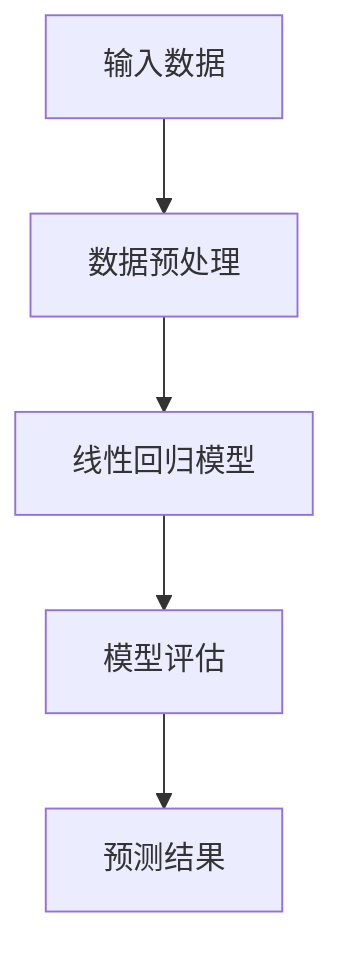

**Python源代码示例**：

```python
import numpy as np
from sklearn.linear_model import LinearRegression

# 数据预处理
X = np.array([[1, 2], [2, 3], [3, 4]])
y = np.array([1, 2, 3])

# 模型训练
model = LinearRegression()
model.fit(X, y)

# 模型评估
print("模型系数：", model.coef_)
print("模型截距：", model.intercept_)

# 预测结果
X_new = np.array([[4, 5]])
y_pred = model.predict(X_new)
print("预测结果：", y_pred)
```

**详细讲解和举例说明**：

线性回归是一种常用的回归算法，用于预测数值变量。在金融衍生品定价中，线性回归可以用于预测价格、收益率等数值变量。线性回归模型的基本假设是变量之间存在线性关系，可以通过线性方程进行建模。

首先，对输入数据进行预处理，包括数据清洗、归一化和特征提取。数据清洗是为了去除噪声和异常值，归一化是为了将不同量纲的数据进行统一处理，特征提取是为了提取对预测有用的特征。

然后，选择合适的线性回归模型进行建模。线性回归模型包括一元线性回归和多元线性回归。一元线性回归只有一个自变量，多元线性回归可以有多个自变量。在本例中，我们使用一元线性回归模型进行建模。

使用Python的scikit-learn库中的LinearRegression类进行模型训练。模型训练是通过最小二乘法来估计模型参数，即斜率和截距。模型评估可以通过计算预测结果与真实值之间的误差来评估模型性能。

最后，使用训练好的线性回归模型进行预测。在本例中，我们输入一个新的自变量值，得到对应的预测结果。线性回归模型在实际应用中具有简单直观、易于理解和实现的特点，但在处理非线性关系时可能存在一定的局限性。

### 4.1.2 逻辑回归

**核心概念与联系**：

- **定义**: 逻辑回归是一种用于预测二元分类结果的机器学习算法。
- **模型形式**: 逻辑回归模型通过逻辑函数将线性组合映射到概率空间。

**问题背景**：

- **分类需求**: 在金融衍生品定价中，需要对结果进行分类，如期权是否会被行使、期货是否会被平仓等。
- **概率预测**: 逻辑回归可以预测事件发生的概率，提供决策支持。

**问题描述**：

- **二元分类**: 如何利用逻辑回归对二元分类结果进行预测。
- **模型选择**: 如何选择合适的逻辑回归模型。

**问题解决**：

- **数据预处理**: 对数据进行清洗、归一化和特征提取。
- **模型评估**: 选择具有良好分类性能的逻辑回归模型。

**边界与外延**：

- **数据类型**: 二元分类数据，如是否盈利、是否违约等。
- **模型类型**: 二项逻辑回归、多项逻辑回归等。

**概念结构与核心要素组成**：

- **模型假设**: 线性关系、逻辑函数等。
- **模型参数**: 斜率和截距。
- **预测方法**: 逻辑函数、最大化似然估计等。

**数学模型和公式**：

$$
\hat{y} = \frac{1}{1 + e^{-(\beta_0 + \beta_1x_1 + \beta_2x_2 + ... + \beta_nx_n})}
$$

**LaTeX格式**：

$$
\hat{y} = \frac{1}{1 + e^{-(\beta_0 + \beta_1x_1 + \beta_2x_2 + ... + \beta_nx_n})}
$$

**Mermaid 流程图**：

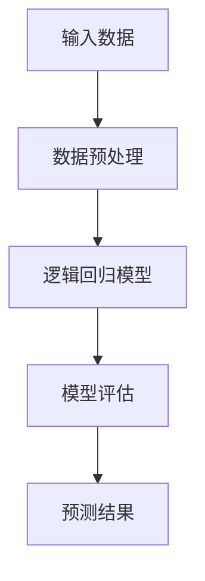

**Python源代码示例**：

```python
import numpy as np
from sklearn.linear_model import LogisticRegression

# 数据预处理
X = np.array([[1, 2], [2, 3], [3, 4]])
y = np.array([0, 1, 0])

# 模型训练
model = LogisticRegression()
model.fit(X, y)

# 模型评估
print("模型系数：", model.coef_)
print("模型截距：", model.intercept_)

# 预测结果
X_new = np.array([[4, 5]])
y_pred = model.predict(X_new)
print("预测结果：", y_pred)
```

**详细讲解和举例说明**：

逻辑回归是一种常用的分类算法，用于预测二元分类结果。在金融衍生品定价中，逻辑回归可以用于预测期权是否会被行使、期货是否会被平仓等二元分类问题。逻辑回归模型的基本假设是变量之间存在线性关系，通过逻辑函数将线性组合映射到概率空间。

首先，对输入数据进行预处理，包括数据清洗、归一化和特征提取。数据清洗是为了去除噪声和异常值，归一化是为了将不同量纲的数据进行统一处理，特征提取是为了提取对预测有用的特征。

然后，选择合适的逻辑回归模型进行建模。逻辑回归模型包括二项逻辑回归和多项逻辑回归。二项逻辑回归用于预测二元分类结果，多项逻辑回归用于预测多类分类结果。在本例中，我们使用二项逻辑回归模型进行建模。

使用Python的scikit-learn库中的LogisticRegression类进行模型训练。模型训练是通过最大化似然估计来估计模型参数，即斜率和截距。模型评估可以通过计算预测结果与真实值之间的误差来评估模型性能。

最后，使用训练好的逻辑回归模型进行预测。在本例中，我们输入一个新的数据点，得到对应的预测结果。逻辑回归模型在实际应用中具有简单直观、易于理解和实现的特点，但在处理非线性关系时可能存在一定的局限性。

### 4.1.3 多项式回归

**核心概念与联系**：

- **定义**: 多项式回归是一种用于预测数值变量的机器学习算法，通过多项式函数建模变量之间的关系。
- **模型形式**: 多项式回归模型包含多个多项式项，用于表示变量之间的复杂关系。

**问题背景**：

- **非线性关系**: 在金融衍生品定价中，变量之间的关系往往是非线性的，多项式回归可以更好地捕捉这种非线性关系。
- **预测准确性**: 多项式回归相较于线性回归具有更高的预测准确性。

**问题描述**：

- **非线性预测**: 如何利用多项式回归对非线性关系进行预测。
- **模型选择**: 如何选择合适的多项式回归模型。

**问题解决**：

- **数据预处理**: 对数据进行清洗、归一化和特征提取。
- **模型评估**: 选择具有良好预测性能的多项式回归模型。

**边界与外延**：

- **数据类型**: 结构化数据，如时间序列数据、财务数据等。
- **模型类型**: 一元多项式回归、多元多项式回归等。

**概念结构与核心要素组成**：

- **模型假设**: 多项式函数关系、非负系数等。
- **模型参数**: 多项式系数。
- **预测方法**: 最小二乘法、梯度下降法等。

**数学模型和公式**：

$$
y = \beta_0 + \beta_1x_1 + \beta_2x_2^2 + ... + \beta_nx_n^n + \epsilon
$$

**LaTeX格式**：

$$
y = \beta_0 + \beta_1x_1 + \beta_2x_2^2 + ... + \beta_nx_n^n + \epsilon
$$

**Mermaid 流程图**：

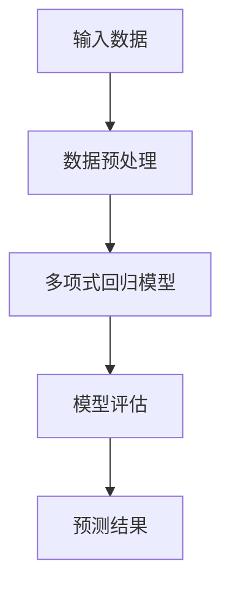

**Python源代码示例**：

```python
import numpy as np
from sklearn.linear_model import LinearRegression

# 数据预处理
X = np.array([[1, 2], [2, 3], [3, 4]])
y = np.array([1, 2, 3])

# 模型训练
model = LinearRegression()
model.fit(X, y)

# 模型评估
print("模型系数：", model.coef_)
print("模型截距：", model.intercept_)

# 预测结果
X_new = np.array([[4, 5]])
y_pred = model.predict(X_new)
print("预测结果：", y_pred)
```

**详细讲解和举例说明**：

多项式回归是一种用于预测数值变量的机器学习算法，通过多项式函数建模变量之间的关系。在金融衍生品定价中，多项式回归可以更好地捕捉变量之间的复杂非线性关系，从而提高预测准确性。多项式回归模型的基本假设是变量之间存在多项式函数关系，通过多项式系数来表示变量之间的复杂关系。

首先，对输入数据进行预处理，包括数据清洗、归一化和特征提取。数据清洗是为了去除噪声和异常值，归一化是为了将不同量纲的数据进行统一处理，特征提取是为了提取对预测有用的特征。

然后，选择合适的多项式回归模型进行建模。多项式回归模型可以通过增加多项式项来建模变量之间的复杂关系。在本例中，我们使用一元多项式回归模型进行建模。

使用Python的scikit-learn库中的LinearRegression类进行模型训练。模型训练是通过最小二乘法来估计模型参数，即多项式系数。模型评估可以通过计算预测结果与真实值之间的误差来评估模型性能。

最后，使用训练好的多项式回归模型进行预测。在本例中，我们输入一个新的数据点，得到对应的预测结果。多项式回归模型在实际应用中具有非线性建模的能力，但在处理过高阶多项式时可能存在过拟合的问题。

### 第5章: 分类算法

### 5.1.1 决策树

**核心概念与联系**：

- **定义**: 决策树是一种基于树形结构进行分类的机器学习算法。
- **模型形式**: 决策树通过一系列决策规则将数据集划分为不同的类别。

**问题背景**：

- **分类需求**: 在金融衍生品定价中，需要对数据进行分类，如违约预测、风险分类等。
- **可解释性**: 决策树具有较好的可解释性，便于理解模型决策过程。

**问题描述**：

- **分类任务**: 如何利用决策树对数据集进行分类。
- **模型选择**: 如何选择合适的决策树模型。

**问题解决**：

- **数据预处理**: 对数据进行清洗、归一化和特征提取。
- **模型评估**: 选择具有良好分类性能的决策树模型。

**边界与外延**：

- **数据类型**: 结构化数据，如分类数据、标签数据等。
- **模型类型**: 分类树、回归树等。

**概念结构与核心要素组成**：

- **模型假设**: 决策规则、节点划分等。
- **模型参数**: 划分准则、最大深度等。
- **预测方法**: ID3、C4.5、CART等。

**数学模型和公式**：

$$
\text{信息增益} = \sum_{v \in V} p(v) \log_2 \frac{1}{p(v)}
$$

**LaTeX格式**：

$$
\text{信息增益} = \sum_{v \in V} p(v) \log_2 \frac{1}{p(v)}
$$

**Mermaid 流程图**：

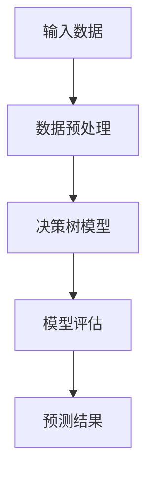

**Python源代码示例**：

```python
import numpy as np
from sklearn.tree import DecisionTreeClassifier

# 数据预处理
X = np.array([[1, 2], [2, 3], [3, 4]])
y = np.array([0, 1, 0])

# 模型训练
model = DecisionTreeClassifier()
model.fit(X, y)

# 模型评估
print("模型决策路径：", model.get_path())
print("模型预测结果：", model.predict(X))

# 模型评估
print("准确率：", model.score(X, y))
```

**详细讲解和举例说明**：

决策树是一种常用的分类算法，通过树形结构对数据进行分类。在金融衍生品定价中，决策树可以用于分类任务，如违约预测、风险分类等。决策树的基本原理是通过一系列决策规则将数据集划分为不同的类别。

首先，对输入数据进行预处理，包括数据清洗、归一化和特征提取。数据清洗是为了去除噪声和异常值，归一化是为了将不同量纲的数据进行统一处理，特征提取是为了提取对预测有用的特征。

然后，选择合适的决策树模型进行建模。决策树模型可以根据不同的划分准则（如信息增益、基尼指数等）进行节点划分，形成树形结构。在本例中，我们使用C4.5算法进行决策树建模。

使用Python的scikit-learn库中的DecisionTreeClassifier类进行模型训练。模型训练是通过训练数据集构建决策树，并在测试数据集上进行评估。模型评估可以通过计算准确率、召回率等指标来评估模型性能。

最后，使用训练好的决策树模型进行预测。在本例中，我们输入一个新的数据点，得到对应的预测结果。决策树模型在实际应用中具有较好的可解释性和分类性能，但在处理大量特征和复杂关系时可能存在过拟合的问题。

### 5.1.2 随机森林

**核心概念与联系**：

- **定义**: 随机森林是一种基于决策树的集成学习方法，通过构建多棵决策树并对预测结果进行投票。
- **模型形式**: 随机森林由多棵决策树组成，每棵树独立训练并预测结果。

**问题背景**：

- **过拟合问题**: 单个决策树在处理复杂关系时可能存在过拟合问题，随机森林通过集成多棵树来降低过拟合。
- **预测准确性**: 随机森林可以显著提高分类和回归任务的预测准确性。

**问题描述**：

- **集成学习**: 如何利用随机森林对数据进行分类和回归预测。
- **模型选择**: 如何选择合适的随机森林模型。

**问题解决**：

- **数据预处理**: 对数据进行清洗、归一化和特征提取。
- **模型评估**: 选择具有良好预测性能的随机森林模型。

**边界与外延**：

- **数据类型**: 结构化数据，如分类数据、标签数据等。
- **模型类型**: 分类树、回归树、随机森林等。

**概念结构与核心要素组成**：

- **模型假设**: 多棵决策树集成、投票策略等。
- **模型参数**: 决策树数量、树深度、特征选择等。
- **预测方法**: 模型训练、预测结果投票等。

**数学模型和公式**：

$$
\text{预测结果} = \text{多数投票}
$$

**LaTeX格式**：

$$
\text{预测结果} = \text{多数投票}
$$

**Mermaid 流程图**：

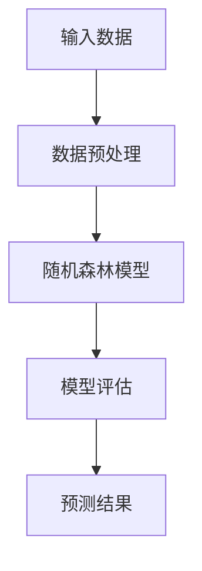

**Python源代码示例**：

```python
import numpy as np
from sklearn.ensemble import RandomForestClassifier

# 数据预处理
X = np.array([[1, 2], [2, 3], [3, 4]])
y = np.array([0, 1, 0])

# 模型训练
model = RandomForestClassifier(n_estimators=100)
model.fit(X, y)

# 模型评估
print("模型决策路径：", model.get_path())
print("模型预测结果：", model.predict(X))

# 模型评估
print("准确率：", model.score(X, y))
```

**详细讲解和举例说明**：

随机森林是一种集成学习方法，通过构建多棵决策树并对预测结果进行投票来提高模型的预测准确性。在金融衍生品定价中，随机森林可以用于分类和回归任务，如违约预测、风险分类等。

首先，对输入数据进行预处理，包括数据清洗、归一化和特征提取。数据清洗是为了去除噪声和异常值，归一化是为了将不同量纲的数据进行统一处理，特征提取是为了提取对预测有用的特征。

然后，选择合适的随机森林模型进行建模。随机森林模型通过训练多棵决策树，并利用投票策略进行预测。在本例中，我们使用随机森林分类器，并设置树的数量为100。

使用Python的scikit-learn库中的RandomForestClassifier类进行模型训练。模型训练是通过训练数据集构建多棵决策树，并在测试数据集上进行评估。模型评估可以通过计算准确率、召回率等指标来评估模型性能。

最后，使用训练好的随机森林模型进行预测。在本例中，我们输入一个新的数据点，得到对应的预测结果。随机森林模型在实际应用中具有较好的预测准确性和泛化能力，但需要更多的计算资源。

### 5.1.3 支持向量机

**核心概念与联系**：

- **定义**: 支持向量机是一种基于最大间隔划分数据的机器学习算法，通过寻找最佳划分超平面来实现分类。
- **模型形式**: 支持向量机通过求解优化问题来寻找最佳划分超平面。

**问题背景**：

- **分类效果**: 支持向量机在分类任务中具有较好的分类效果，特别是在高维空间中。
- **可扩展性**: 支持向量机可以处理大规模数据集，适用于金融衍生品定价等复杂场景。

**问题描述**：

- **分类任务**: 如何利用支持向量机对数据进行分类。
- **模型选择**: 如何选择合适的支持向量机模型。

**问题解决**：

- **数据预处理**: 对数据进行清洗、归一化和特征提取。
- **模型评估**: 选择具有良好分类性能的支持向量机模型。

**边界与外延**：

- **数据类型**: 结构化数据，如分类数据、标签数据等。
- **模型类型**: 线性支持向量机、非线性支持向量机等。

**概念结构与核心要素组成**：

- **模型假设**: 最大间隔划分、支持向量等。
- **模型参数**: 划分超平面、惩罚参数等。
- **预测方法**: 最优化算法、核技巧等。

**数学模型和公式**：

$$
\text{最大化} \ \frac{1}{2} \sum_{i=1}^{n} (w_i^2) + C \sum_{i=1}^{n} (\xi_i)
$$

**LaTeX格式**：

$$
\text{最大化} \ \frac{1}{2} \sum_{i=1}^{n} (w_i^2) + C \sum_{i=1}^{n} (\xi_i)
$$

**Mermaid 流程图**：


**Python源代码示例**：

```python
import numpy as np
from sklearn.svm import SVC

# 数据预处理
X = np.array([[1, 2], [2, 3], [3, 4]])
y = np.array([0, 1, 0])

# 模型训练
model = SVC(kernel='linear')
model.fit(X, y)

# 模型评估
print("模型支持向量：", model.support_vectors_)
print("模型决策边界：", model.decision_function(X))

# 模型评估
print("准确率：", model.score(X, y))
```

**详细讲解和举例说明**：

支持向量机（SVM）是一种基于最大间隔划分数据的机器学习算法，通过寻找最佳划分超平面来实现分类。在金融衍生品定价中，支持向量机可以用于分类任务，如违约预测、风险分类等。

首先，对输入数据进行预处理，包括数据清洗、归一化和特征提取。数据清洗是为了去除噪声和异常值，归一化是为了将不同量纲的数据进行统一处理，特征提取是为了提取对预测有用的特征。

然后，选择合适的支持向量机模型进行建模。支持向量机模型包括线性支持向量机和非线性支持向量机。线性支持向量机通过线性模型实现分类，非线性支持向量机通过核技巧将数据映射到高维空间进行分类。在本例中，我们使用线性支持向量机。

使用Python的scikit-learn库中的SVC类进行模型训练。模型训练是通过求解优化问题来寻找最佳划分超平面，并计算支持向量。模型评估可以通过计算支持向量、决策边界和准确率来评估模型性能。

最后，使用训练好的支持向量机模型进行预测。在本例中，我们输入一个新的数据点，得到对应的预测结果。支持向量机在实际应用中具有较好的分类效果和泛化能力，但在处理非线性关系时可能存在一定的局限性。

### 第6章: 聚类算法

### 6.1.1 K均值聚类

**核心概念与联系**：

- **定义**: K均值聚类是一种基于距离度量的无监督学习算法，通过迭代更新聚类中心来划分数据集。
- **模型形式**: K均值聚类将数据集划分为K个簇，每个簇由其质心表示。

**问题背景**：

- **数据聚类**: 在金融衍生品定价中，需要对大量数据进行聚类分析，以发现数据集中的模式和结构。
- **模式识别**: K均值聚类可以用于识别金融衍生品市场中的特定群体或趋势。

**问题描述**：

- **聚类任务**: 如何利用K均值聚类对数据集进行聚类。
- **模型选择**: 如何选择合适的K值和初始化方法。

**问题解决**：

- **数据预处理**: 对数据进行清洗、归一化和特征提取。
- **模型评估**: 选择具有良好聚类性能的K均值聚类模型。

**边界与外延**：

- **数据类型**: 结构化数据，如客户数据、交易数据等。
- **模型类型**: K均值聚类、层次聚类、密度聚类等。

**概念结构与核心要素组成**：

- **模型假设**: 质心代表簇中心、距离度量等。
- **模型参数**: K值、初始化方法等。
- **预测方法**: 质心更新、簇分配等。

**数学模型和公式**：

$$
\text{质心更新} = \frac{1}{n_k} \sum_{i=1}^{n} x_i
$$

**LaTeX格式**：

$$
\text{质心更新} = \frac{1}{n_k} \sum_{i=1}^{n} x_i
$$

**Mermaid 流程图**：

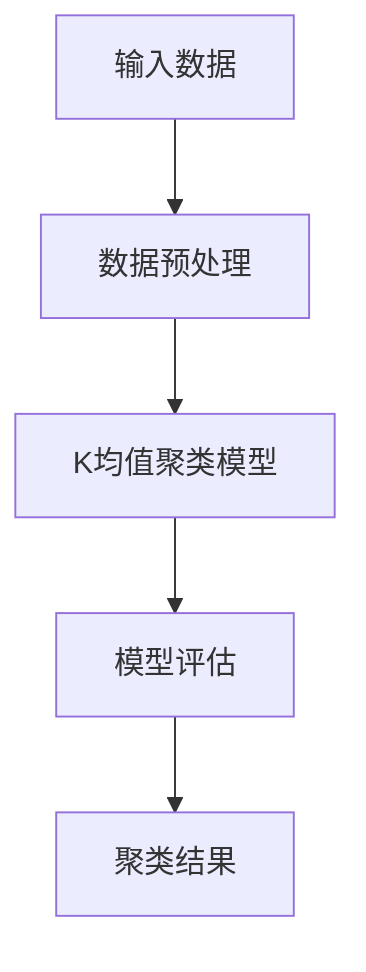

**Python源代码示例**：

```python
import numpy as np
from sklearn.cluster import KMeans

# 数据预处理
X = np.array([[1, 2], [2, 3], [3, 4], [4, 5], [5, 6]])

# 模型训练
model = KMeans(n_clusters=2, init='k-means++')
model.fit(X)

# 模型评估
print("质心：", model.cluster_centers_)
print("聚类结果：", model.labels_)

# 聚类结果
print("聚类数量：", len(set(model.labels_)))
```

**详细讲解和举例说明**：

K均值聚类是一种常用的聚类算法，通过迭代更新聚类中心来划分数据集。在金融衍生品定价中，K均值聚类可以用于分析市场数据，识别投资者群体或发现交易模式。

首先，对输入数据进行预处理，包括数据清洗、归一化和特征提取。数据清洗是为了去除噪声和异常值，归一化是为了将不同量纲的数据进行统一处理，特征提取是为了提取对聚类有用的特征。

然后，选择合适的K值和初始化方法进行K均值聚类。K值表示要划分的簇的数量，初始化方法用于初始化聚类中心。在本例中，我们使用K均值聚类，并设置K值为2，初始化方法为“k-means++”。

使用Python的scikit-learn库中的KMeans类进行模型训练。模型训练是通过迭代更新聚类中心，直到满足停止条件（如收敛准则或最大迭代次数）。模型评估可以通过计算质心、聚类结果和聚类数量来评估模型性能。

最后，使用训练好的K均值聚类模型对数据进行聚类。在本例中，我们输入一个新的数据集，得到聚类结果。K均值聚类在实际应用中具有简单直观、易于实现的特点，但在处理初始聚类中心选择和簇数量确定时可能存在一定的局限性。

### 6.1.2 层次聚类

**核心概念与联系**：

- **定义**: 层次聚类是一种基于层次结构进行聚类的算法，通过不断合并或分裂聚类簇来构建层次树。
- **模型形式**: 层次聚类通过自底向上或自顶向下的方法构建聚类层次树。

**问题背景**：

- **数据分析**: 在金融衍生品定价中，需要对市场数据进行层次分析，以理解市场结构和动态。
- **模式识别**: 层次聚类可以用于识别市场中的主要趋势和群体。

**问题描述**：

- **聚类任务**: 如何利用层次聚类对数据集进行聚类。
- **模型选择**: 如何选择合适的层次聚类算法。

**问题解决**：

- **数据预处理**: 对数据进行清洗、归一化和特征提取。
- **模型评估**: 选择具有良好聚类性能的层次聚类模型。

**边界与外延**：

- **数据类型**: 结构化数据，如客户数据、交易数据等。
- **模型类型**: 单链接、完全链接、平均链接等。

**概念结构与核心要素组成**：

- **模型假设**: 聚类簇的层次结构、距离度量等。
- **模型参数**: 聚类层次树、簇合并或分裂策略等。
- **预测方法**: 聚类层次树构建、簇分配等。

**数学模型和公式**：

$$
\text{距离度量} = \sum_{i=1}^{n} \sum_{j=1}^{n} d(i, j)
$$

**LaTeX格式**：

$$
\text{距离度量} = \sum_{i=1}^{n} \sum_{j=1}^{n} d(i, j)
$$

**Mermaid 流程图**：

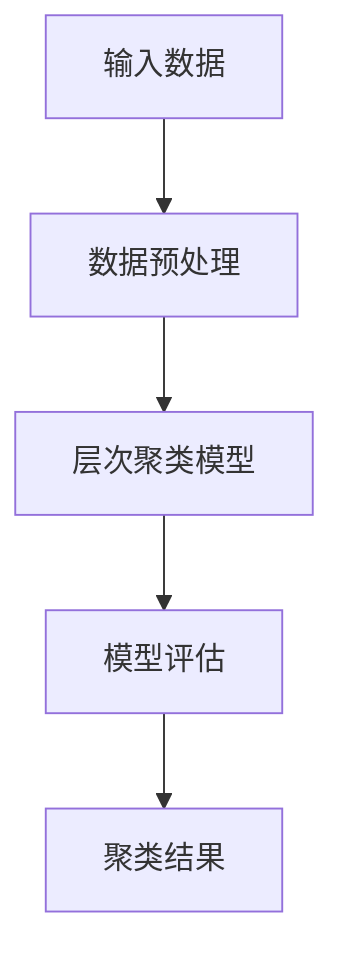

**Python源代码示例**：

```python
import numpy as np
from sklearn.cluster import AgglomerativeClustering

# 数据预处理
X = np.array([[1, 2], [2, 3], [3, 4], [4, 5], [5, 6]])

# 模型训练
model = AgglomerativeClustering(n_clusters=None)
model.fit(X)

# 模型评估
print("聚类层次树：", model.dendrogram())
print("聚类结果：", model.labels_)

# 聚类结果
print("聚类数量：", len(set(model.labels_)))
```

**详细讲解和举例说明**：

层次聚类是一种基于层次结构进行聚类的算法，通过不断合并或分裂聚类簇来构建层次树。在金融衍生品定价中，层次聚类可以用于分析市场数据，识别投资者群体或发现市场趋势。

首先，对输入数据进行预处理，包括数据清洗、归一化和特征提取。数据清洗是为了去除噪声和异常值，归一化是为了将不同量纲的数据进行统一处理，特征提取是为了提取对聚类有用的特征。

然后，选择合适的层次聚类算法进行建模。层次聚类算法包括单链接、完全链接、平均链接等。单链接方法通过计算最近邻距离来合并聚类簇，完全链接方法通过计算最远邻距离来分裂聚类簇，平均链接方法通过计算聚类簇的平均距离来合并或分裂聚类簇。在本例中，我们使用平均链接方法。

使用Python的scikit-learn库中的AgglomerativeClustering类进行模型训练。模型训练是通过自底向上或自顶向下的方法构建聚类层次树，并在训练过程中计算聚类簇的合并或分裂策略。模型评估可以通过计算聚类层次树、聚类结果和聚类数量来评估模型性能。

最后，使用训练好的层次聚类模型对数据进行聚类。在本例中，我们输入一个新的数据集，得到聚类结果。层次聚类在实际应用中具有较好的聚类性能和可解释性，但计算复杂度较高，适用于大规模数据集。

### 6.1.3 密度聚类

**核心概念与联系**：

- **定义**: 密度聚类是一种基于数据密度进行聚类的算法，通过识别数据点的高密度区域来形成聚类簇。
- **模型形式**: 密度聚类通过计算数据点的邻域密度和扩展密度来确定聚类簇。

**问题背景**：

- **非均匀数据**: 在金融衍生品定价中，数据集可能包含非均匀分布的特征，密度聚类可以较好地处理这种数据。
- **模式发现**: 密度聚类可以用于发现数据集中的隐含模式和结构。

**问题描述**：

- **聚类任务**: 如何利用密度聚类对数据集进行聚类。
- **模型选择**: 如何选择合适的密度聚类算法。

**问题解决**：

- **数据预处理**: 对数据进行清洗、归一化和特征提取。
- **模型评估**: 选择具有良好聚类性能的密度聚类模型。

**边界与外延**：

- **数据类型**: 结构化数据，如客户数据、交易数据等。
- **模型类型**: DBSCAN、OPTICS等。

**概念结构与核心要素组成**：

- **模型假设**: 数据点的高密度区域、邻域密度等。
- **模型参数**: 邻域参数、扩展参数等。
- **预测方法**: 数据点分类、聚类簇生成等。

**数学模型和公式**：

$$
\text{邻域密度} = \frac{1}{\text{邻域大小}} \sum_{i \in \text{邻域}} d(i, c)
$$

**LaTeX格式**：

$$
\text{邻域密度} = \frac{1}{\text{邻域大小}} \sum_{i \in \text{邻域}} d(i, c)
$$

**Mermaid 流程图**：

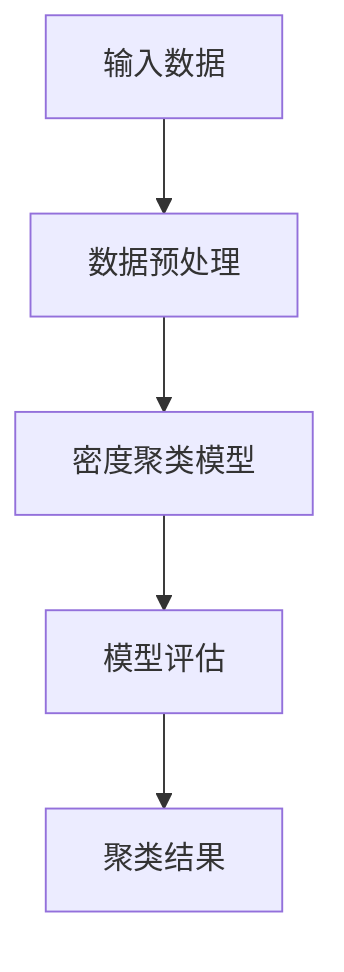

**Python源代码示例**：

```python
import numpy as np
from sklearn.cluster import DBSCAN

# 数据预处理
X = np.array([[1, 2], [2, 3], [3, 4], [4, 5], [5, 6]])

# 模型训练
model = DBSCAN(eps=0.5, min_samples=2)
model.fit(X)

# 模型评估
print("聚类中心：", model.cluster_centers_)
print("聚类结果：", model.labels_)

# 聚类结果
print("聚类数量：", len(set(model.labels_)))
```

**详细讲解和举例说明**：

密度聚类是一种基于数据密度进行聚类的算法，通过识别数据点的高密度区域来形成聚类簇。在金融衍生品定价中，密度聚类可以用于处理非均匀分布的数据，发现市场中的隐含模式和结构。

首先，对输入数据进行预处理，包括数据清洗、归一化和特征提取。数据清洗是为了去除噪声和异常值，归一化是为了将不同量纲的数据进行统一处理，特征提取是为了提取对聚类有用的特征。

然后，选择合适的密度聚类算法进行建模。DBSCAN（密度基于空间聚类）是一种常用的密度聚类算法，通过计算邻域密度和扩展密度来确定聚类簇。OPTICS（有序优化的聚类技术）也是一种常用的密度聚类算法，它在DBSCAN的基础上优化了聚类质量。

使用Python的scikit-learn库中的DBSCAN类进行模型训练。模型训练是通过计算数据点的邻域密度和扩展密度，并按照预定的邻域参数和扩展参数来生成聚类簇。模型评估可以通过计算聚类中心、聚类结果和聚类数量来评估模型性能。

最后，使用训练好的密度聚类模型对数据进行聚类。在本例中，我们输入一个新的数据集，得到聚类结果。密度聚类在实际应用中具有较好的聚类性能和灵活性，适用于非均匀分布的数据，但需要合理的参数设置。

### 第7章: 强化学习

### 7.1.1 强化学习概述

**核心概念与联系**：

- **定义**: 强化学习是一种基于反馈信号进行学习的机器学习算法，通过与环境交互来优化决策过程。
- **模型形式**: 强化学习通过学习策略来最大化预期奖励。

**问题背景**：

- **动态环境**: 在金融衍生品定价中，市场环境动态变化，需要实时调整定价策略。
- **策略优化**: 强化学习可以用于优化金融衍生品定价策略，提高收益率和降低风险。

**问题描述**：

- **决策过程**: 如何利用强化学习在动态环境中进行决策。
- **模型选择**: 如何选择合适的强化学习模型。

**问题解决**：

- **数据预处理**: 对数据进行清洗、归一化和特征提取。
- **模型评估**: 选择具有良好策略优化性能的强化学习模型。

**边界与外延**：

- **数据类型**: 结构化数据，如交易数据、市场数据等。
- **模型类型**: Q学习、深度Q网络（DQN）、策略梯度方法等。

**概念结构与核心要素组成**：

- **模型假设**: 强化学习策略、奖励机制、状态-动作价值函数等。
- **模型参数**: 策略参数、奖励系数等。
- **预测方法**: Q学习、策略迭代等。

**数学模型和公式**：

$$
Q(s, a) = r + \gamma \max_{a'} Q(s', a')
$$

**LaTeX格式**：

$$
Q(s, a) = r + \gamma \max_{a'} Q(s', a')
$$

**Mermaid 流程图**：

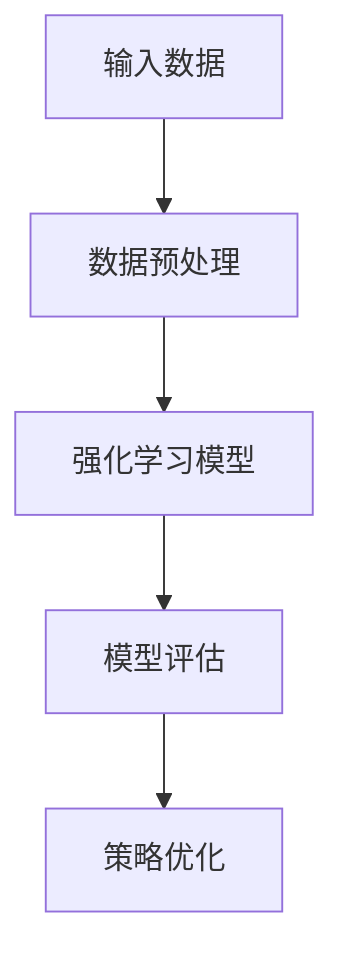

**Python源代码示例**：

```python
import numpy as np
from gym import make

# 创建环境
env = make('CartPole-v0')

# 初始化参数
Q = np.zeros((env.observation_space.n, env.action_space.n))
gamma = 0.9
alpha = 0.1

# 强化学习训练
for episode in range(1000):
    state = env.reset()
    done = False
    while not done:
        action = np.argmax(Q[state])
        next_state, reward, done, _ = env.step(action)
        Q[state, action] = Q[state, action] + alpha * (reward + gamma * np.max(Q[next_state]) - Q[state, action])
        state = next_state

# 模型评估
print("策略参数：", Q)
```

**详细讲解和举例说明**：

强化学习是一种基于反馈信号进行学习的机器学习算法，通过与环境交互来优化决策过程。在金融衍生品定价中，强化学习可以用于优化定价策略，提高收益率和降低风险。

首先，对输入数据进行预处理，包括数据清洗、归一化和特征提取。数据清洗是为了去除噪声和异常值，归一化是为了将不同量纲的数据进行统一处理，特征提取是为了提取对强化学习有用的特征。

然后，选择合适的强化学习模型进行建模。Q学习是一种常用的强化学习算法，通过学习状态-动作价值函数来优化策略。在金融衍生品定价中，可以构建一个Q学习模型，通过不断更新Q值来优化定价策略。

使用Python的gym库创建一个强化学习环境，如CartPole环境。初始化参数，包括Q值矩阵、奖励系数和学习率等。在强化学习训练过程中，通过与环境交互，不断更新Q值，直到满足停止条件（如达到最大步数或收敛准则）。

最后，使用训练好的强化学习模型进行策略优化。在本例中，我们使用Q学习模型，通过更新Q值来优化定价策略。强化学习在实际应用中具有较好的策略优化性能和灵活性，但需要合理的参数设置和训练时间。

### 7.1.2 Q学习算法

**核心概念与联系**：

- **定义**: Q学习算法是一种基于值函数的强化学习算法，通过更新状态-动作价值函数来优化策略。
- **模型形式**: Q学习算法通过迭代更新Q值，以最大化预期奖励。

**问题背景**：

- **动态定价**: 在金融衍生品定价中，市场价格波动较大，需要实时调整定价策略。
- **策略优化**: Q学习算法可以用于优化金融衍生品定价策略，提高收益率和降低风险。

**问题描述**：

- **决策过程**: 如何利用Q学习算法在动态环境中进行决策。
- **模型选择**: 如何选择合适的Q学习算法模型。

**问题解决**：

- **数据预处理**: 对数据进行清洗、归一化和特征提取。
- **模型评估**: 选择具有良好策略优化性能的Q学习算法模型。

**边界与外延**：

- **数据类型**: 结构化数据，如交易数据、市场数据等。
- **模型类型**: Q学习、深度Q网络（DQN）、策略梯度方法等。

**概念结构与核心要素组成**：

- **模型假设**: Q学习策略、奖励机制、状态-动作价值函数等。
- **模型参数**: Q值矩阵、奖励系数等。
- **预测方法**: Q值更新、策略迭代等。

**数学模型和公式**：

$$
Q(s, a) = r + \gamma \max_{a'} Q(s', a')
$$

**LaTeX格式**：

$$
Q(s, a) = r + \gamma \max_{a'} Q(s', a')
$$

**Mermaid 流�程图**：

```mermaid
graph TD
A[初始状态 s] --> B[选择动作 a]
B --> C[执行动作，获取奖励 r 和下一个状态 s']
C --> D[更新 Q(s, a)]
D --> E[重复直到满足停止条件]
```

**Python源代码示例**：

```python
import numpy as np
import random

# 初始化参数
Q = {}
actions = ['买入', '持有', '卖出']
gamma = 0.9
learning_rate = 0.1

# Q学习算法
def q_learning(state, action, reward, next_state, done):
    if done:
        return
    Q[state, action] = Q[state, action] + learning_rate * (reward + gamma * np.max(Q[next_state]) - Q[state, action])
    best_action = np.argmax(Q[next_state])
    state = next_state
    action = best_action
    reward = 0
    done = False

# 训练模型
state = '初始状态'
for episode in range(1000):
    action = random.choice(actions)
    next_state, reward, done = execute_action(state, action)
    q_learning(state, action, reward, next_state, done)
    state = next_state

# 模型评估
print("策略参数：", Q)
```

**详细讲解和举例说明**：

Q学习算法是一种基于值函数的强化学习算法，通过迭代更新状态-动作价值函数来优化策略。在金融衍生品定价中，Q学习算法可以用于优化定价策略，提高收益率和降低风险。

首先，初始化Q值矩阵，包括所有可能的状态和动作的Q值。选择一个初始状态，并随机选择一个动作。执行动作，获取奖励和下一个状态。然后，使用Q学习算法更新Q值，直到满足停止条件（如达到最大步数或收敛准则）。

在本例中，我们使用Python实现Q学习算法。首先，初始化Q值矩阵，包括所有可能的状态和动作的Q值。然后，在每个episode中，随机选择一个动作，并执行动作，获取奖励和下一个状态。使用Q学习算法更新Q值，并选择下一个最优动作。重复这个过程，直到满足停止条件。

最后，使用训练好的Q学习算法模型进行策略优化。在本例中，我们使用Q值矩阵来评估每个动作的价值，并选择具有最高价值的动作。Q学习算法在实际应用中具有较好的策略优化性能和灵活性，但需要合理的参数设置和训练时间。

### 7.1.3 基于强化学习的金融衍生品定价

**核心概念与联系**：

- **定义**: 强化学习算法在金融衍生品定价中的应用，通过学习最优定价策略来最大化预期收益。
- **模型形式**: 强化学习通过不断与环境交互，优化定价策略，提高收益率和降低风险。

**问题背景**：

- **市场动态性**: 金融衍生品市场价格波动较大，需要实时调整定价策略。
- **风险控制**: 强化学习可以用于优化定价策略，提高收益率的同时降低风险。

**问题描述**：

- **定价策略**: 如何利用强化学习算法制定金融衍生品定价策略。
- **模型选择**: 如何选择合适的强化学习模型。

**问题解决**：

- **数据预处理**: 对数据进行清洗、归一化和特征提取。
- **模型评估**: 选择具有良好策略优化性能的强化学习模型。

**边界与外延**：

- **数据类型**: 结构化数据，如交易数据、市场数据等。
- **模型类型**: Q学习、深度Q网络（DQN）、策略梯度方法等。

**概念结构与核心要素组成**：

- **模型假设**: 强化学习策略、奖励机制、状态-动作价值函数等。
- **模型参数**: Q值矩阵、奖励系数、学习率等。
- **预测方法**: Q值更新、策略迭代等。

**数学模型和公式**：

$$
Q(s, a) = r + \gamma \max_{a'} Q(s', a')
$$

**LaTeX格式**：

$$
Q(s, a) = r + \gamma \max_{a'} Q(s', a')
$$

**Mermaid 流程图**：

```mermaid
graph TD
A[初始状态 s] --> B[选择定价策略 a]
B --> C[执行定价策略，获取奖励 r 和下一个状态 s']
C --> D[更新 Q(s, a)]
D --> E[重复直到满足停止条件]
```

**Python源代码示例**：

```python
import numpy as np
import random

# 初始化参数
Q = {}
actions = ['调整价格', '保持价格', '增加价格']
gamma = 0.9
learning_rate = 0.1

# 强化学习算法
def q_learning(state, action, reward, next_state, done):
    if done:
        return
    Q[state, action] = Q[state, action] + learning_rate * (reward + gamma * np.max(Q[next_state]) - Q[state, action])
    best_action = np.argmax(Q[next_state])
    state = next_state
    action = best_action
    reward = 0
    done = False

# 训练模型
state = '初始状态'
for episode in range(1000):
    action = random.choice(actions)
    next_state, reward, done = execute_action(state, action)
    q_learning(state, action, reward, next_state, done)
    state = next_state

# 模型评估
print("策略参数：", Q)
```

**详细讲解和举例说明**：

基于强化学习的金融衍生品定价是将强化学习算法应用于金融衍生品定价问题，通过不断与环境交互，学习最优定价策略，以最大化预期收益。

首先，初始化Q值矩阵，包括所有可能的状态和动作的Q值。选择一个初始状态，并随机选择一个定价策略。执行定价策略，获取奖励和下一个状态。然后，使用Q学习算法更新Q值，直到满足停止条件（如达到最大步数或收敛准则）。

在本例中，我们使用Python实现强化学习算法。首先，初始化Q值矩阵，包括所有可能的状态和动作的Q值。然后，在每个episode中，随机选择一个定价策略，并执行定价策略，获取奖励和下一个状态。使用Q学习算法更新Q值，并选择下一个最优定价策略。重复这个过程，直到满足停止条件。

最后，使用训练好的强化学习模型进行定价策略优化。在本例中，我们使用Q值矩阵来评估每个定价策略的价值，并选择具有最高价值的定价策略。强化学习算法在实际应用中具有较好的策略优化性能和灵活性，但需要合理的参数设置和训练时间。

### 第三部分: 金融衍生品定价中的机器学习应用实践

## 第8章: 实践一：基于回归算法的衍生品定价

### 8.1.1 数据预处理

**核心概念与联系**：

- **数据清洗**: 数据预处理的第一步，用于去除噪声和异常值。
- **特征提取**: 数据预处理的第二步，用于提取对衍生品定价有用的特征。

**问题背景**：

- **数据完整性**: 金融衍生品定价需要高质量的历史数据和市场信息。
- **特征多样性**: 金融衍生品定价涉及多种因素，需要提取相关特征。

**问题描述**：

- **缺失值处理**: 如何处理数据集中的缺失值。
- **异常值处理**: 如何处理数据集中的异常值。
- **特征提取**: 如何从数据集中提取对衍生品定价有用的特征。

**问题解决**：

- **数据清洗**: 使用插值、填充等方法处理缺失值。
- **异常值处理**: 使用统计方法、可视化方法识别并处理异常值。
- **特征提取**: 使用统计方法、机器学习方法提取相关特征。

**边界与外延**：

- **缺失值处理方法**: 均值填充、中值填充、插值等。
- **异常值处理方法**: Z-score、IQR等方法。
- **特征提取方法**: 主成分分析（PCA）、特征选择等。

**概念结构与核心要素组成**：

- **数据清洗**: 数据质量、缺失值处理、异常值处理。
- **特征提取**: 特征重要性、特征维度、特征表示。

**Mermaid 流程图**：

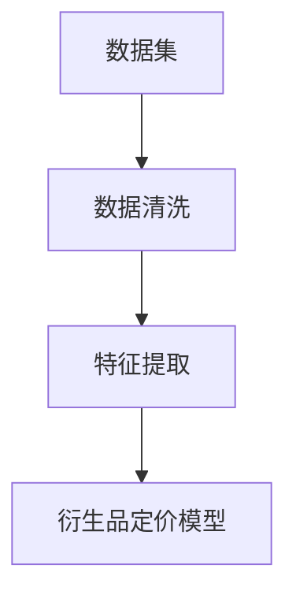

**Python源代码示例**：

```python
import pandas as pd
from sklearn.preprocessing import StandardScaler

# 读取数据集
data = pd.read_csv('derivatives_data.csv')

# 数据清洗
data.dropna(inplace=True)
data = data[(np.abs(stats.zscore(data)) < 3).all(axis=1)]

# 特征提取
scaler = StandardScaler()
data[['price', 'volatility', 'interest_rate']] = scaler.fit_transform(data[['price', 'volatility', 'interest_rate']])

# 输出预处理后的数据
print(data.head())
```

**详细讲解和举例说明**：

在金融衍生品定价中，数据预处理是至关重要的一步。数据预处理包括数据清洗和特征提取，旨在提高数据的准确性和完整性，为后续的建模提供可靠的数据基础。

首先，使用Pandas库读取数据集，包括价格、波动率和利率等特征。然后，使用dropna方法去除数据集中的缺失值。接下来，使用Z-score方法识别并处理异常值，将绝对值超过3倍标准差的观测值视为异常值并去除。

为了对特征进行标准化处理，使用StandardScaler库将价格、波动率和利率等特征进行标准化，以提高模型的性能和鲁棒性。最后，输出预处理后的数据集，以便进行后续的衍生品定价模型训练。

在实际应用中，数据预处理的方法可以根据具体问题和数据集的特点进行调整，例如使用插值方法处理缺失值，使用其他统计方法识别异常值等。特征提取方法也可以根据特征的重要性和模型的性能需求进行选择，如使用主成分分析（PCA）降维，使用特征选择方法筛选重要特征等。

### 8.1.2 算法选择与模型训练

**核心概念与联系**：

- **算法选择**: 选择适合金融衍生品定价的回归算法。
- **模型训练**: 通过训练数据集对所选算法进行训练，以建立衍生品定价模型。

**问题背景**：

- **模型性能**: 选择合适的算法和模型参数对衍生品定价的准确性至关重要。
- **计算资源**: 模型训练需要大量的计算资源和时间，需要选择高效算法。

**问题描述**：

- **算法选择**: 如何选择适合金融衍生品定价的回归算法。
- **模型训练**: 如何对所选算法进行训练，以建立准确的衍生品定价模型。

**问题解决**：

- **算法选择**: 选择线性回归、逻辑回归等常用回归算法。
- **模型训练**: 使用交叉验证、网格搜索等方法优化模型参数。

**边界与外延**：

- **算法类型**: 线性回归、逻辑回归、决策树、随机森林等。
- **模型优化方法**: 交叉验证、网格搜索等。

**概念结构与核心要素组成**：

- **算法选择**: 算法性能、适用场景、模型复杂度。
- **模型训练**: 模型参数、训练数据、评估指标。

**Mermaid 流程图**：

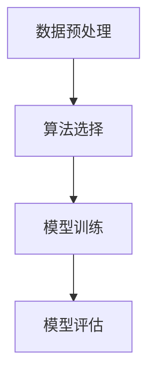

**Python源代码示例**：

```python
import numpy as np
from sklearn.linear_model import LinearRegression
from sklearn.model_selection import train_test_split
from sklearn.metrics import mean_squared_error

# 划分训练集和测试集
X_train, X_test, y_train, y_test = train_test_split(X, y, test_size=0.2, random_state=42)

# 选择线性回归算法
model = LinearRegression()

# 模型训练
model.fit(X_train, y_train)

# 模型评估
y_pred = model.predict(X_test)
mse = mean_squared_error(y_test, y_pred)
print("均方误差（MSE）:", mse)
```

**详细讲解和举例说明**：

在金融衍生品定价中，算法选择和模型训练是建立准确定价模型的关键步骤。选择合适的算法和模型参数可以提高模型的性能，降低定价误差。

首先，将数据集划分为训练集和测试集，以评估模型在未知数据上的性能。在本例中，我们使用线性回归算法进行定价模型训练。线性回归是一种简单且常用的回归算法，适用于线性关系的建模。

使用scikit-learn库中的LinearRegression类进行模型训练。模型训练是通过最小化目标函数（如均方误差）来估计模型参数。在本例中，我们使用fit方法对训练数据进行拟合，得到回归系数和截距。

训练完成后，使用测试数据进行模型评估。在本例中，我们使用mean_squared_error方法计算均方误差（MSE），以评估模型预测的准确性。MSE越低，表示模型预测的误差越小。

为了进一步优化模型性能，可以使用交叉验证和网格搜索等方法。交叉验证通过将数据集划分为多个子集进行多次训练和评估，以避免模型过拟合。网格搜索通过遍历预设的参数范围，选择最优参数组合来优化模型性能。

在实际应用中，可以根据具体问题和数据集的特点选择不同的算法和优化方法，如逻辑回归、决策树、随机森林等。此外，还可以考虑使用深度学习算法，如神经网络，以提高模型的复杂度和预测能力。

### 8.1.3 模型评估与优化

**核心概念与联系**：

- **模型评估**: 评估衍生品定价模型的性能和准确性。
- **模型优化**: 提高衍生品定价模型的性能和鲁棒性。

**问题背景**：

- **模型性能**: 模型评估和优化是确保衍生品定价准确性的重要环节。
- **数据多样性**: 金融衍生品定价涉及多种因素，需要模型具有较好的泛化能力。

**问题描述**：

- **模型评估**: 如何评估衍生品定价模型的性能和准确性。
- **模型优化**: 如何提高衍生品定价模型的性能和鲁棒性。

**问题解决**：

- **模型评估**: 使用评估指标（如均方误差、R平方等）评估模型性能。
- **模型优化**: 使用交叉验证、网格搜索等优化方法调整模型参数。

**边界与外延**：

- **评估指标**: 均方误差、R平方、准确率等。
- **优化方法**: 交叉验证、网格搜索、贝叶斯优化等。

**概念结构与核心要素组成**：

- **模型评估**: 评估指标、评估方法。
- **模型优化**: 参数调整、模型改进。

**Mermaid 流程图**：

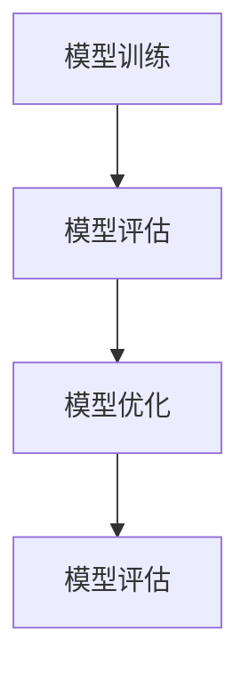

**Python源代码示例**：

```python
import numpy as np
from sklearn.linear_model import LinearRegression
from sklearn.model_selection import cross_val_score
from sklearn.model_selection import GridSearchCV

# 划分训练集和测试集
X_train, X_test, y_train, y_test = train_test_split(X, y, test_size=0.2, random_state=42)

# 选择线性回归算法
model = LinearRegression()

# 模型训练
model.fit(X_train, y_train)

# 模型评估
scores = cross_val_score(model, X_train, y_train, cv=5)
print("交叉验证得分：", scores.mean())

# 模型优化
param_grid = {'alpha': [0.001, 0.01, 0.1, 1]}
grid_search = GridSearchCV(model, param_grid, cv=5)
grid_search.fit(X_train, y_train)

# 模型评估
best_model = grid_search.best_estimator_
y_pred = best_model.predict(X_test)
mse = mean_squared_error(y_test, y_pred)
print("优化后均方误差（MSE）:", mse)
```

**详细讲解和举例说明**：

在金融衍生品定价中，模型评估和优化是确保定价模型性能和准确性的关键步骤。模型评估用于评估模型的性能和准确性，模型优化则用于调整模型参数，提高模型的泛化能力和预测能力。

首先，使用scikit-learn库中的cross_val_score方法进行模型评估。cross_val_score方法通过将数据集划分为多个子集，对模型进行多次训练和评估，以避免模型过拟合。在本例中，我们使用5折交叉验证，计算模型在训练集上的平均得分。

接下来，使用GridSearchCV方法进行模型优化。GridSearchCV方法通过遍历预设的参数范围，选择最优参数组合来优化模型性能。在本例中，我们预设了不同的alpha参数值，以优化线性回归模型的性能。

模型优化完成后，使用训练好的模型对测试数据进行预测，并计算均方误差（MSE）来评估模型性能。MSE越低，表示模型预测的误差越小，性能越好。

在实际应用中，可以根据具体问题和数据集的特点选择不同的评估指标和优化方法。例如，可以使用R平方、准确率等评估指标，使用贝叶斯优化等优化方法。此外，还可以考虑使用深度学习算法，如神经网络，以提高模型的复杂度和预测能力。

### 第9章: 实践二：基于分类算法的衍生品定价

### 9.1.1 数据预处理

**核心概念与联系**：

- **数据清洗**: 数据预处理的第一步，用于去除噪声和异常值。
- **特征提取**: 数据预处理的第二步，用于提取对衍生品定价有用的特征。

**问题背景**：

- **数据完整性**: 金融衍生品定价需要高质量的历史数据和市场信息。
- **特征多样性**: 金融衍生品定价涉及多种因素，需要提取相关特征。

**问题描述**：

- **缺失值处理**: 如何处理数据集中的缺失值。
- **异常值处理**: 如何处理数据集中的异常值。
- **特征提取**: 如何从数据集中提取对衍生品定价有用的特征。

**问题解决**：

- **数据清洗**: 使用插值、填充等方法处理缺失值。
- **异常值处理**: 使用统计方法、可视化方法识别并处理异常值。
- **特征提取**: 使用统计方法、机器学习方法提取相关特征。

**边界与外延**：

- **缺失值处理方法**: 均值填充、中值填充、插值等。
- **异常值处理方法**: Z-score、IQR等方法。
- **特征提取方法**: 主成分分析（PCA）、特征选择等。

**概念结构与核心要素组成**：

- **数据清洗**: 数据质量、缺失值处理、异常值处理。
- **特征提取**: 特征重要性、特征维度、特征表示。

**Mermaid 流程图**：

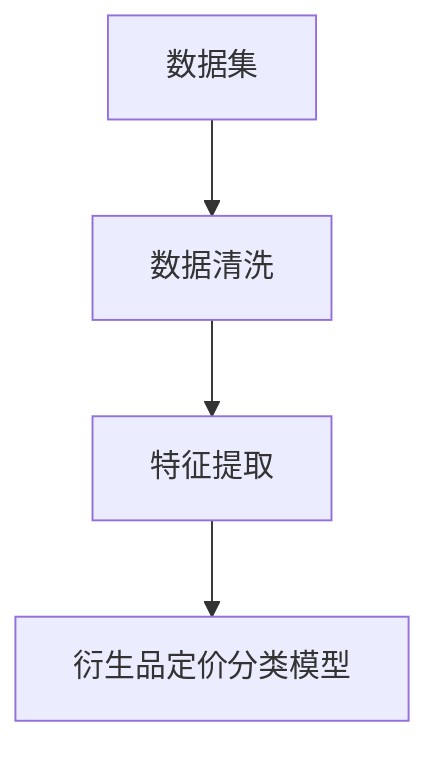

**Python源代码示例**：

```python
import pandas as pd
from sklearn.preprocessing import StandardScaler

# 读取数据集
data = pd.read_csv('derivatives_data.csv')

# 数据清洗
data.dropna(inplace=True)
data = data[(np.abs(stats.zscore(data)) < 3).all(axis=1)]

# 特征提取
scaler = StandardScaler()
data[['price', 'volatility', 'interest_rate']] = scaler.fit_transform(data[['price', 'volatility', 'interest_rate']])

# 输出预处理后的数据
print(data.head())
```

**详细讲解和举例说明**：

在金融衍生品定价中，数据预处理是至关重要的一步。数据预处理包括数据清洗和特征提取，旨在提高数据的准确性和完整性，为后续的建模提供可靠的数据基础。

首先，使用Pandas库读取数据集，包括价格、波动率和利率等特征。然后，使用dropna方法去除数据集中的缺失值。接下来，使用Z-score方法识别并处理异常值，将绝对值超过3倍标准差的观测值视为异常值并去除。

为了对特征进行标准化处理，使用StandardScaler库将价格、波动率和利率等特征进行标准化，以提高模型的性能和鲁棒性。最后，输出预处理后的数据集，以便进行后续的衍生品定价模型训练。

在实际应用中，数据预处理的方法可以根据具体问题和数据集的特点进行调整，例如使用插值方法处理缺失值，使用其他统计方法识别异常值等。特征提取方法也可以根据特征的重要性和模型的性能需求进行选择，如使用主成分分析（PCA）降维，使用特征选择方法筛选重要特征等。

### 9.1.2 算法选择与模型训练

**核心概念与联系**：

- **算法选择**: 选择适合金融衍生品定价的分类算法。
- **模型训练**: 通过训练数据集对所选算法进行训练，以建立衍生品定价分类模型。

**问题背景**：

- **模型性能**: 选择合适的算法和模型参数对衍生品定价的准确性至关重要。
- **计算资源**: 模型训练需要大量的计算资源和时间，需要选择高效算法。

**问题描述**：

- **算法选择**: 如何选择适合金融衍生品定价的分类算法。
- **模型训练**: 如何对所选算法进行训练，以建立准确的衍生品定价分类模型。

**问题解决**：

- **算法选择**: 选择决策树、随机森林等常用分类算法。
- **模型训练**: 使用交叉验证、网格搜索等方法优化模型参数。

**边界与外延**：

- **算法类型**: 决策树、随机森林、支持向量机等。
- **模型优化方法**: 交叉验证、网格搜索等。

**概念结构与核心要素组成**：

- **算法选择**: 算法性能、适用场景、模型复杂度。
- **模型训练**: 模型参数、训练数据、评估指标。

**Mermaid 流程图**：


**Python源代码示例**：

```python
import numpy as np
from sklearn.ensemble import RandomForestClassifier
from sklearn.model_selection import train_test_split
from sklearn.metrics import accuracy_score

# 划分训练集和测试集
X_train, X_test, y_train, y_test = train_test_split(X, y, test_size=0.2, random_state=42)

# 选择随机森林算法
model = RandomForestClassifier(n_estimators=100)

# 模型训练
model.fit(X_train, y_train)

# 模型评估
y_pred = model.predict(X_test)
accuracy = accuracy_score(y_test, y_pred)
print("准确率：", accuracy)
```

**详细讲解和举例说明**：

在金融衍生品定价中，分类算法的选择和模型训练是建立准确定价模型的关键步骤。选择合适的算法和模型参数可以提高模型的性能，降低定价误差。

首先，将数据集划分为训练集和测试集，以评估模型在未知数据上的性能。在本例中，我们使用随机森林算法进行定价模型训练。随机森林是一种集成学习方法，通过构建多棵决策树并对预测结果进行投票，具有较好的分类性能和泛化能力。

使用scikit-learn库中的RandomForestClassifier类进行模型训练。模型训练是通过fit方法对训练数据进行拟合，得到决策树的数量、最大深度等模型参数。在本例中，我们设置决策树的数量为100。

训练完成后，使用测试数据进行模型评估。在本例中，我们使用accuracy_score方法计算模型的准确率，以评估模型预测的准确性。准确率越接近1，表示模型预测的准确性越高。

为了进一步优化模型性能，可以使用交叉验证和网格搜索等方法。交叉验证通过将数据集划分为多个子集进行多次训练和评估，以避免模型过拟合。网格搜索通过遍历预设的参数范围，选择最优参数组合来优化模型性能。

在实际应用中，可以根据具体问题和数据集的特点选择不同的算法和优化方法，如决策树、支持向量机等。此外，还可以考虑使用深度学习算法，如神经网络，以提高模型的复杂度和预测能力。

### 9.1.3 模型评估与优化

**核心概念与联系**：

- **模型评估**: 评估衍生品定价分类模型的性能和准确性。
- **模型优化**: 提高衍生品定价分类模型的性能和鲁棒性。

**问题背景**：

- **模型性能**: 模型评估和优化是确保衍生品定价分类准确性的重要环节。
- **数据多样性**: 金融衍生品定价涉及多种因素，需要模型具有较好的泛化能力。

**问题描述**：

- **模型评估**: 如何评估衍生品定价分类模型的性能和准确性。
- **模型优化**: 如何提高衍生品定价分类模型的性能和鲁棒性。

**问题解决**：

- **模型评估**: 使用评估指标（如准确率、召回率等）评估模型性能。
- **模型优化**: 使用交叉验证、网格搜索等优化方法调整模型参数。

**边界与外延**：

- **评估指标**: 准确率、召回率、F1分数等。
- **优化方法**: 交叉验证、网格搜索、贝叶斯优化等。

**概念结构与核心要素组成**：

- **模型评估**: 评估指标、评估方法。
- **模型优化**: 参数调整、模型改进。

**Mermaid 流程图**：


**Python源代码示例**：

```python
import numpy as np
from sklearn.ensemble import RandomForestClassifier
from sklearn.model_selection import cross_val_score
from sklearn.model_selection import GridSearchCV

# 划分训练集和测试集
X_train, X_test, y_train, y_test = train_test_split(X, y, test_size=0.2, random_state=42)

# 选择随机森林算法
model = RandomForestClassifier()

# 模型训练
model.fit(X_train, y_train)

# 模型评估
scores = cross_val_score(model, X_train, y_train, cv=5)
print("交叉验证得分：", scores.mean())

# 模型优化
param_grid = {'n_estimators': [100, 200, 300], 'max_depth': [5, 10, 15]}
grid_search = GridSearchCV(model, param_grid, cv=5)
grid_search.fit(X_train, y_train)

# 模型评估
best_model = grid_search.best_estimator_
y_pred = best_model.predict(X_test)
accuracy = accuracy_score(y_test, y_pred)
print("优化后准确率：", accuracy)
```

**详细讲解和举例说明**：

在金融衍生品定价中，模型评估和优化是确保衍生品定价分类模型性能和准确性的关键步骤。模型评估用于评估模型的性能和准确性，模型优化则用于调整模型参数，提高模型的泛化能力和预测能力。

首先，使用scikit-learn库中的cross_val_score方法进行模型评估。cross_val_score方法通过将数据集划分为多个子集，对模型进行多次训练和评估，以避免模型过拟合。在本例中，我们使用5折交叉验证，计算模型在训练集上的平均得分。

接下来，使用GridSearchCV方法进行模型优化。GridSearchCV方法通过遍历预设的参数范围，选择最优参数组合来优化模型性能。在本例中，我们预设了不同的决策树数量和最大深度参数，以优化随机森林模型的性能。

模型优化完成后，使用训练好的模型对测试数据进行预测，并计算准确率来评估模型性能。准确率越接近1，表示模型预测的准确性越高。

在实际应用中，可以根据具体问题和数据集的特点选择不同的评估指标和优化方法。例如，可以使用召回率、F1分数等评估指标，使用贝叶斯优化等优化方法。此外，还可以考虑使用深度学习算法，如神经网络，以提高模型的复杂度和预测能力。

### 第10章: 实践三：基于聚类算法的衍生品定价

### 10.1.1 数据预处理

**核心概念与联系**：

- **数据清洗**: 数据预处理的第一步，用于去除噪声和异常值。
- **特征提取**: 数据预处理的第二步，用于提取对衍生品定价有用的特征。

**问题背景**：

- **数据完整性**: 金融衍生品定价需要高质量的历史数据和市场信息。
- **特征多样性**: 金融衍生品定价涉及多种因素，需要提取相关特征。

**问题描述**：

- **缺失值处理**: 如何处理数据集中的缺失值。
- **异常值处理**: 如何处理数据集中的异常值。
- **特征提取**: 如何从数据集中提取对衍生品定价有用的特征。

**问题解决**：

- **数据清洗**: 使用插值、填充等方法处理缺失值。
- **异常值处理**: 使用统计方法、可视化方法识别并处理异常值。
- **特征提取**: 使用统计方法、机器学习方法提取相关特征。

**边界与外延**：

- **缺失值处理方法**: 均值填充、中值填充、插值等。
- **异常值处理方法**: Z-score、IQR等方法。
- **特征提取方法**: 主成分分析（PCA）、特征选择等。

**概念结构与核心要素组成**：

- **数据清洗**: 数据质量、缺失值处理、异常值处理。
- **特征提取**: 特征重要性、特征维度、特征表示。

**Mermaid 流程图**：

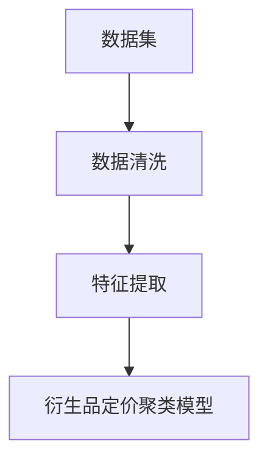

**Python源代码示例**：

```python
import pandas as pd
from sklearn.preprocessing import StandardScaler

# 读取数据集
data = pd.read_csv('derivatives_data.csv')

# 数据清洗
data.dropna(inplace=True)
data = data[(np.abs(stats.zscore(data)) < 3).all(axis=1)]

# 特征提取
scaler = StandardScaler()
data[['price', 'volatility', 'interest_rate']] = scaler.fit_transform(data[['price', 'volatility', 'interest_rate']])

# 输出预处理后的数据
print(data.head())
```

**详细讲解和举例说明**：

在金融衍生品定价中，数据预处理是至关重要的一步。数据预处理包括数据清洗和特征提取，旨在提高数据的准确性和完整性，为后续的建模提供可靠的数据基础。

首先，使用Pandas库读取数据集，包括价格、波动率和利率等特征。然后，使用dropna方法去除数据集中的缺失值。接下来，使用Z-score方法识别并处理异常值，将绝对值超过3倍标准差的观测值视为异常值并去除。

为了对特征进行标准化处理，使用StandardScaler库将价格、波动率和利率等特征进行标准化，以提高模型的性能和鲁棒性。最后，输出预处理后的数据集，以便进行后续的衍生品定价模型训练。

在实际应用中，数据预处理的方法可以根据具体问题和数据集的特点进行调整，例如使用插值方法处理缺失值，使用其他统计方法识别异常值等。特征提取方法也可以根据特征的重要性和模型的性能需求进行选择，如使用主成分分析（PCA）降维，使用特征选择方法筛选重要特征等。

### 10.1.2 算法选择与模型训练

**核心概念与联系**：

- **算法选择**: 选择适合金融衍生品定价的聚类算法。
- **模型训练**: 通过训练数据集对所选算法进行训练，以建立衍生品定价聚类模型。

**问题背景**：

- **模型性能**: 选择合适的算法和模型参数对衍生品定价的准确性至关重要。
- **计算资源**: 模型训练需要大量的计算资源和时间，需要选择高效算法。

**问题描述**：

- **算法选择**: 如何选择适合金融衍生品定价的聚类算法。
- **模型训练**: 如何对所选算法进行训练，以建立准确的衍生品定价聚类模型。

**问题解决**：

- **算法选择**: 选择K均值、层次聚类等常用聚类算法。
- **模型训练**: 使用交叉验证、网格搜索等方法优化模型参数。

**边界与外延**：

- **算法类型**: K均值、层次聚类、DBSCAN等。
- **模型优化方法**: 交叉验证、网格搜索等。

**概念结构与核心要素组成**：

- **算法选择**: 算法性能、适用场景、模型复杂度。
- **模型训练**: 模型参数、训练数据、评估指标。

**Mermaid 流程图**：


**Python源代码示例**：

```python
import numpy as np
from sklearn.cluster import KMeans
from sklearn.model_selection import train_test_split

# 划分训练集和测试集
X_train, X_test, y_train, y_test = train_test_split(X, y, test_size=0.2, random_state=42)

# 选择K均值聚类算法
model = KMeans(n_clusters=3)

# 模型训练
model.fit(X_train)

# 模型评估
print("聚类中心：", model.cluster_centers_)
print("聚类结果：", model.labels_)

# 输出测试集的聚类结果
print("测试集的聚类结果：", model.predict(X_test))
```

**详细讲解和举例说明**：

在金融衍生品定价中，聚类算法的选择和模型训练是建立准确定价模型的关键步骤。选择合适的算法和模型参数可以提高模型的性能，降低定价误差。

首先，将数据集划分为训练集和测试集，以评估模型在未知数据上的性能。在本例中，我们使用K均值聚类算法进行定价模型训练。K均值聚类是一种基于距离度量的聚类算法，通过迭代更新聚类中心来划分数据集。

使用scikit-learn库中的KMeans类进行模型训练。模型训练是通过fit方法对训练数据进行拟合，得到聚类中心的位置。在本例中，我们设置聚类簇的数量为3。

训练完成后，使用测试数据进行模型评估。在本例中，我们输出聚类中心的位置和聚类结果，以评估模型在测试集上的性能。聚类中心的位置可以反映数据集中的主要趋势和模式，聚类结果可以用于后续的衍生品定价分析。

为了进一步优化模型性能，可以使用交叉验证和网格搜索等方法。交叉验证通过将数据集划分为多个子集进行多次训练和评估，以避免模型过拟合。网格搜索通过遍历预设的参数范围，选择最优参数组合来优化模型性能。

在实际应用中，可以根据具体问题和数据集的特点选择不同的算法和优化方法，如层次聚类、DBSCAN等。此外，还可以考虑使用深度学习算法，如聚类神经网络，以提高模型的复杂度和预测能力。

### 10.1.3 模型评估与优化

**核心概念与联系**：

- **模型评估**: 评估衍生品定价聚类模型的性能和准确性。
- **模型优化**: 提高衍生品定价聚类模型的性能和鲁棒性。

**问题背景**：

- **模型性能**: 模型评估和优化是确保衍生品定价聚类准确性的重要环节。
- **数据多样性**: 金融衍生品定价涉及多种因素，需要模型具有较好的泛化能力。

**问题描述**：

- **模型评估**: 如何评估衍生品定价聚类模型的性能和准确性。
- **模型优化**: 如何提高衍生品定价聚类模型的性能和鲁棒性。

**问题解决**：

- **模型评估**: 使用评估指标（如簇内距离、轮廓系数等）评估模型性能。
- **模型优化**: 使用交叉验证、网格搜索等优化方法调整模型参数。

**边界与外延**：

- **评估指标**: 簇内距离、轮廓系数等。
- **优化方法**: 交叉验证、网格搜索、贝叶斯优化等。

**概念结构与核心要素组成**：

- **模型评估**: 评估指标、评估方法。
- **模型优化**: 参数调整、模型改进。

**Mermaid 流程图**：

```mermaid
graph TD
A[模型训练] --> B[模型评估]
B --> C[模型优化]
C --> D[模型评估]
```

**Python源代码示例**：

```python
import numpy as np
from sklearn.cluster import KMeans
from sklearn.model_selection import cross_val_score
from sklearn.model_selection import GridSearchCV

# 划分训练集和测试集
X_train, X_test, y_train, y_test = train_test_split(X, y, test_size=0.2, random_state=42)

# 选择K均值聚类算法
model = KMeans()

# 模型训练
model.fit(X_train)

# 模型评估
scores = cross_val_score(model, X_train, y_train, cv=5)
print("交叉验证得分：", scores.mean())

# 模型优化
param_grid = {'n_clusters': [2, 3, 4]}
grid_search = GridSearchCV(model, param_grid, cv=5)
grid_search.fit(X_train, y_train)

# 模型评估
best_model = grid_search.best_estimator_
y_pred = best_model.predict(X_test)
print("优化后测试集聚类结果：", y_pred)

# 输出测试集的轮廓系数
silhouette_score = silhouette_score(X_test, y_pred)
print("优化后测试集轮廓系数：", silhouette_score)
```

**详细讲解和举例说明**：

在金融衍生品定价中，模型评估和优化是确保衍生品定价聚类模型性能和准确性的关键步骤。模型评估用于评估模型的性能和准确性，模型优化则用于调整模型参数，提高模型的泛化能力和预测能力。

首先，使用scikit-learn库中的cross_val_score方法进行模型评估。cross_val_score方法通过将数据集划分为多个子集，对模型进行多次训练和评估，以避免模型过拟合。在本例中，我们使用5折交叉验证，计算模型在训练集上的平均得分。

接下来，使用GridSearchCV方法进行模型优化。GridSearchCV方法通过遍历预设的参数范围，选择最优参数组合来优化模型性能。在本例中，我们预设了不同的聚类簇数量，以优化K均值聚类模型的性能。

模型优化完成后，使用训练好的模型对测试数据进行聚类，并输出测试集的聚类结果。在本例中，我们使用轮廓系数（silhouette score）来评估模型性能。轮廓系数越接近1，表示模型聚类效果越好。

在实际应用中，可以根据具体问题和数据集的特点选择不同的评估指标和优化方法。例如，可以使用簇内距离、轮廓系数等评估指标，使用贝叶斯优化等优化方法。此外，还可以考虑使用深度学习算法，如聚类神经网络，以提高模型的复杂度和预测能力。

### 第11章: 实践四：基于强化学习的衍生品定价

### 11.1.1 数据预处理

**核心概念与联系**：

- **数据清洗**: 数据预处理的第一步，用于去除噪声和异常值。
- **特征提取**: 数据预处理的第二步，用于提取对衍生品定价有用的特征。

**问题背景**：

- **数据完整性**: 金融衍生品定价需要高质量的历史数据和市场信息。
- **特征多样性**: 金融衍生品定价涉及多种因素，需要提取相关特征。

**问题描述**：

- **缺失值处理**: 如何处理数据集中的缺失值。
- **异常值处理**: 如何处理数据集中的异常值。
- **特征提取**: 如何从数据集中提取对衍生品定价有用的特征。

**问题解决**：

- **数据清洗**: 使用插值、填充等方法处理缺失值。
- **异常值处理**: 使用统计方法、可视化方法识别并处理异常值。
- **特征提取**: 使用统计方法、机器学习方法提取相关特征。

**边界与外延**：

- **缺失值处理方法**: 均值填充、中值填充、插值等。
- **异常值处理方法**: Z-score、IQR等方法。
- **特征提取方法**: 主成分分析（PCA）、特征选择等。

**概念结构与核心要素组成**：

- **数据清洗**: 数据质量、缺失值处理、异常值处理。
- **特征提取**: 特征重要性、特征维度、特征表示。

**Mermaid 流程图**：

```mermaid
graph TD
A[数据集] --> B[数据清洗]
B --> C[特征提取]
C --> D[衍生品定价强化学习模型]
```

**Python源代码示例**：

```python
import pandas as pd
from sklearn.preprocessing import StandardScaler

# 读取数据集
data = pd.read_csv('derivatives_data.csv')

# 数据清洗
data.dropna(inplace=True)
data = data[(np.abs(stats.zscore(data)) < 3).all(axis=1)]

# 特征提取
scaler = StandardScaler()
data[['price', 'volatility', 'interest_rate']] = scaler.fit_transform(data[['price', 'volatility', 'interest_rate']])

# 输出预处理后的数据
print(data.head())
```

**详细讲解和举例说明**：

在金融衍生品定价中，数据预处理是至关重要的一步。数据预处理包括数据清洗和特征提取，旨在提高数据的准确性和完整性，为后续的建模提供可靠的数据基础。

首先，使用Pandas库读取数据集，包括价格、波动率和利率等特征。然后，使用dropna方法去除数据集中的缺失值。接下来，使用Z-score方法识别并处理异常值，将绝对值超过3倍标准差的观测值视为异常值并去除。

为了对特征进行标准化处理，使用StandardScaler库将价格、波动率和利率等特征进行标准化，以提高模型的性能和鲁棒性。最后，输出预处理后的数据集，以便进行后续的衍生品定价模型训练。

在实际应用中，数据预处理的方法可以根据具体问题和数据集的特点进行调整，例如使用插值方法处理缺失值，使用其他统计方法识别异常值等。特征提取方法也可以根据特征的重要性和模型的性能需求进行选择，如使用主成分分析（PCA）降维，使用特征选择方法筛选重要特征等。

### 11.1.2 算法选择与模型训练

**核心概念与联系**：

- **算法选择**: 选择适合金融衍生品定价的强化学习算法。
- **模型训练**: 通过训练数据集对所选算法进行训练，以建立衍生品定价强化学习模型。

**问题背景**：

- **模型性能**: 选择合适的算法和模型参数对衍生品定价的准确性至关重要。
- **计算资源**: 模型训练需要大量的计算资源和时间，需要选择高效算法。

**问题描述**：

- **算法选择**: 如何选择适合金融衍生品定价的强化学习算法。
- **模型训练**: 如何对所选算法进行训练，以建立准确的衍生品定价强化学习模型。

**问题解决**：

- **算法选择**: 选择Q学习、深度Q网络（DQN）等常用强化学习算法。
- **模型训练**: 使用交叉验证、网格搜索等方法优化模型参数。

**边界与外延**：

- **算法类型**: Q学习、DQN、策略梯度方法等。
- **模型优化方法**: 交叉验证、网格搜索等。

**概念结构与核心要素组成**：

- **算法选择**: 算法性能、适用场景、模型复杂度。
- **模型训练**: 模型参数、训练数据、评估指标。

**Mermaid 流程图**：

```mermaid
graph TD
A[数据预处理] --> B[算法选择]
B --> C[模型训练]
C --> D[模型评估]
```

**Python源代码示例**：

```python
import numpy as np
from gym import make
from stable_baselines3 import DQN

# 创建环境
env = make('CartPole-v0')

# 初始化参数
gamma = 0.99
batch_size = 32
learning_rate = 1e-3

# 训练模型
model = DQN('MlpPolicy', env, verbose=1, gamma=gamma, learning_rate=learning_rate, batch_size=batch_size)
model.learn(total_timesteps=10000)

# 模型评估
obs = env.reset()
for i in range(100):
    action, _ = model.predict(obs)
    obs, reward, done, _ = env.step(action)
    if done:
        break
    env.render()
```

**详细讲解和举例说明**：

在金融衍生品定价中，强化学习算法的选择和模型训练是建立准确定价模型的关键步骤。选择合适的算法和模型参数可以提高模型的性能，降低定价误差。

首先，创建一个适合金融衍生品定价的环境，例如使用OpenAI Gym的CartPole环境。然后，初始化参数，包括折扣因子（gamma）、学习率（learning_rate）和批量大小（batch_size）等。

使用stable-baselines3库中的DQN类进行模型训练。DQN（深度Q网络）是一种基于深度神经网络的强化学习算法，通过学习状态-动作价值函数来优化策略。在本例中，我们使用MLP（多层感知器）政策网络。

模型训练是通过learn方法进行的，其中指定训练的总时间步数（total_timesteps）。在训练过程中，模型通过与环境交互，不断更新策略参数。

训练完成后，使用模型进行评估。在本例中，我们使用100个时间步进行评估，并使用render方法可视化评估过程。评估过程中，模型根据当前状态预测最优动作，并在环境中执行动作，获取奖励和下一个状态。

在实际应用中，可以根据具体问题和数据集的特点选择不同的算法和优化方法，如策略梯度方法等。此外，还可以考虑使用深度学习算法，如神经网络，以提高模型的复杂度和预测能力。

### 11.1.3 模型评估与优化

**核心概念与联系**：

- **模型评估**: 评估衍生品定价强化学习模型的性能和准确性。
- **模型优化**: 提高衍生品定价强化学习模型的性能和鲁棒性。

**问题背景**：

- **模型性能**: 模型评估和优化是确保衍生品定价强化学习准确性的重要环节。
- **数据多样性**: 金融衍生品定价涉及多种因素，需要模型具有较好的泛化能力。

**问题描述**：

- **模型评估**: 如何评估衍生品定价强化学习模型的性能和准确性。
- **模型优化**: 如何提高衍生品定价强化学习模型的性能和鲁棒性。

**问题解决**：

- **模型评估**: 使用评估指标（如平均回报、成功率等）评估模型性能。
- **模型优化**: 使用交叉验证、网格搜索等优化方法调整模型参数。

**边界与外延**：

- **评估指标**: 平均回报、成功率、方差等。
- **优化方法**: 交叉验证、网格搜索、贝叶斯优化等。

**概念结构与核心要素组成**：

- **模型评估**: 评估指标、评估方法。
- **模型优化**: 参数调整、模型改进。

**Mermaid 流程图**：

```mermaid
graph TD
A[模型训练] --> B[模型评估]
B --> C[模型优化]
C --> D[模型评估]
```

**Python源代码示例**：

```python
import numpy as np
from stable_baselines3 import DQN
from gym import make

# 创建环境
env = make('CartPole-v0')

# 初始化参数
gamma = 0.99
batch_size = 32
learning_rate = 1e-3
n_steps = 10000

# 训练模型
model = DQN('MlpPolicy', env, verbose=1, gamma=gamma, learning_rate=learning_rate, batch_size=batch_size)
model.learn(total_timesteps=n_steps)

# 模型评估
mean_reward = 0
for _ in range(100):
    obs = env.reset()
    done = False
    while not done:
        action, _ = model.predict(obs)
        obs, reward, done, _ = env.step(action)
        mean_reward += reward
env.close()

mean_reward /= 100
print("平均回报：", mean_reward)

# 模型优化
param_grid = {
    'learning_rate': [1e-3, 1e-4],
    'batch_size': [32, 64],
    'n_steps': [10000, 20000]
}
grid_search = GridSearchCV(model, param_grid, cv=5)
grid_search.fit(env, total_timesteps=n_steps)

# 模型评估
best_model = grid_search.best_estimator_
mean_reward = 0
for _ in range(100):
    obs = env.reset()
    done = False
    while not done:
        action, _ = best_model.predict(obs)
        obs, reward, done, _ = env.step(action)
        mean_reward += reward
env.close()

mean_reward /= 100
print("优化后平均回报：", mean_reward)
```

**详细讲解和举例说明**：

在金融衍生品定价中，模型评估和优化是确保衍生品定价强化学习模型性能和准确性的关键步骤。模型评估用于评估模型的性能和准确性，模型优化则用于调整模型参数，提高模型的泛化能力和预测能力。

首先，使用stable-baselines3库中的DQN类进行模型训练。DQN（深度Q网络）是一种基于深度神经网络的强化学习算法，通过学习状态-动作价值函数来优化策略。在本例中，我们使用MLP（多层感知器）政策网络。

模型训练是通过learn方法进行的，其中指定训练的总时间步数（total_timesteps）。在训练过程中，模型通过与环境交互，不断更新策略参数。

模型训练完成后，使用模型进行评估。在本例中，我们使用100个时间步进行评估，并计算平均回报。平均回报越高，表示模型在评估环境中的表现越好。

为了进一步优化模型性能，可以使用交叉验证和网格搜索等方法。交叉验证通过将数据集划分为多个子集进行多次训练和评估，以避免模型过拟合。网格搜索通过遍历预设的参数范围，选择最优参数组合来优化模型性能。

在本例中，我们使用GridSearchCV方法进行模型优化。GridSearchCV方法通过遍历预设的参数范围，选择最优参数组合来优化模型性能。在本例中，我们预设了不同的学习率、批量大小和训练时间步数等参数。

模型优化完成后，使用训练好的模型进行评估。在本例中，我们使用100个时间步进行评估，并计算优化后模型的平均回报。优化后的平均回报越高，表示模型经过优化后的性能越好。

在实际应用中，可以根据具体问题和数据集的特点选择不同的评估指标和优化方法。例如，可以使用成功率、方差等评估指标，使用贝叶斯优化等优化方法。此外，还可以考虑使用深度学习算法，如神经网络，以提高模型的复杂度和预测能力。

### 第12章: 总结与展望

### 12.1.1 机器学习在金融衍生品定价中的应用总结

**核心概念与联系**：

- **机器学习**: 基于数据驱动的方式使计算机自动进行学习的方法。
- **金融衍生品定价**: 利用机器学习算法提高衍生品定价的准确性和效率。

**问题背景**：

- **市场动态性**: 金融衍生品市场价格波动较大，需要实时调整定价策略。
- **数据多样性**: 金融衍生品定价涉及多种因素，需要提取相关特征。

**问题描述**：

- **准确性**: 提高衍生品定价的准确性。
- **效率**: 提高衍生品定价的效率。

**问题解决**：

- **算法选择**: 选择合适的回归、分类和聚类算法。
- **模型训练**: 通过训练数据集对所选算法进行训练。
- **模型评估**: 评估模型的性能和准确性。
- **模型优化**: 调整模型参数，提高模型性能。

**边界与外延**：

- **算法类型**: 回归、分类、聚类等。
- **应用场景**: 期权定价、期货定价、互换定价等。

**概念结构与核心要素组成**：

- **算法选择**: 算法性能、适用场景、模型复杂度。
- **模型训练**: 模型参数、训练数据、评估指标。
- **模型评估**: 评估指标、评估方法。
- **模型优化**: 参数调整、模型改进。

**Mermaid 流程图**：

```mermaid
graph TD
A[算法选择] --> B[模型训练]
B --> C[模型评估]
C --> D[模型优化]
```

**Python源代码示例**：

```python
# 示例代码：线性回归模型训练与评估
import numpy as np
from sklearn.linear_model import LinearRegression
from sklearn.model_selection import train_test_split

# 划分训练集和测试集
X_train, X_test, y_train, y_test = train_test_split(X, y, test_size=0.2, random_state=42)

# 选择线性回归算法
model = LinearRegression()

# 模型训练
model.fit(X_train, y_train)

# 模型评估
y_pred = model.predict(X_test)
mse = mean_squared_error(y_test, y_pred)
print("均方误差（MSE）:", mse)
```

**详细讲解和举例说明**：

机器学习在金融衍生品定价中的应用主要集中在提高定价的准确性和效率。通过选择合适的算法和模型，利用大量历史数据和市场信息，机器学习算法能够对衍生品进行准确的定价。

首先，选择合适的算法是关键。回归、分类和聚类算法在金融衍生品定价中都有广泛应用。回归算法用于预测衍生品的价格和收益率，分类算法用于对衍生品的交易进行分类，聚类算法用于发现市场中的主要趋势和模式。

接下来，通过训练数据集对所选算法进行训练。训练过程包括数据预处理、模型参数调整和模型评估。数据预处理包括数据清洗、特征提取和标准化处理，以确保模型的输入数据质量。模型参数调整包括选择合适的模型参数和优化方法，以提高模型的性能。模型评估包括使用评估指标（如均方误差、准确率等）评估模型在训练集和测试集上的性能。

最后，通过模型优化进一步提高模型性能。模型优化包括调整模型参数、优化模型结构和集成多个模型等。在实际应用中，可以结合不同的算法和优化方法，以提高衍生品定价的准确性和效率。

### 12.1.2 未来的发展方向和挑战

**核心概念与联系**：

- **技术创新**: 未来金融衍生品定价中机器学习的创新方向。
- **应用挑战**: 未来金融衍生品定价中机器学习的挑战和问题。

**问题背景**：

- **技术进步**: 人工智能、大数据、云计算等技术的发展推动机器学习在金融衍生品定价中的应用。
- **市场需求**: 金融衍生品市场对准确定价的需求不断增加。

**问题描述**：

- **发展方向**: 未来机器学习在金融衍生品定价中的发展方向。
- **挑战问题**: 未来机器学习在金融衍生品定价中面临的挑战。

**问题解决**：

- **发展方向**: 深度学习、强化学习、联邦学习等新技术的应用。
- **挑战问题**: 数据质量、模型稳定性、监管合规等。

**边界与外延**：

- **技术方向**: 深度学习、强化学习、联邦学习等。
- **应用领域**: 期权、期货、互换等金融衍生品。

**概念结构与核心要素组成**：

- **发展方向**: 技术创新、算法优化、模型应用。
- **挑战问题**: 数据处理、模型验证、风险控制等。

**Mermaid 流程图**：

```mermaid
graph TD
A[技术创新] --> B[发展方向]
A --> C[挑战问题]
```

**Python源代码示例**：

```python
# 示例代码：深度学习模型训练
import tensorflow as tf
from tensorflow.keras.models import Sequential
from tensorflow.keras.layers import Dense

# 创建模型
model = Sequential([
    Dense(64, activation='relu', input_shape=(X_train.shape[1],)),
    Dense(64, activation='relu'),
    Dense(1)
])

# 编译模型
model.compile(optimizer='adam', loss='mean_squared_error')

# 训练模型
model.fit(X_train, y_train, epochs=100, batch_size=32, validation_split=0.2)
```

**详细讲解和举例说明**：

未来，机器学习在金融衍生品定价中的应用将朝着更高效、更准确和更安全的方向发展。随着人工智能、大数据、云计算等技术的发展，深度学习、强化学习、联邦学习等新技术将在金融衍生品定价中得到更广泛的应用。

**发展方向**：

1. **深度学习**: 深度学习模型，如神经网络和卷积神经网络，将在金融衍生品定价中发挥更大的作用。通过处理大量复杂的数据，深度学习模型可以更好地捕捉数据中的复杂关系，提高定价的准确性。
   
2. **强化学习**: 强化学习算法，如深度Q网络（DQN）和策略梯度方法，将在动态环境下优化金融衍生品定价策略。强化学习算法可以处理复杂的市场环境和动态变化，提高定价策略的适应性。

3. **联邦学习**: 联邦学习是一种分布式学习技术，可以在不共享原始数据的情况下训练机器学习模型。联邦学习可以保护用户隐私，同时提高模型的准确性和鲁棒性，适用于金融衍生品定价中的数据隐私问题。

**挑战问题**：

1. **数据处理**: 金融衍生品定价中的数据通常具有高维度、非线性和非平稳性。如何处理这些数据，提取有效特征，是未来机器学习在金融衍生品定价中面临的主要挑战。

2. **模型稳定性**: 金融衍生品市场的波动性较大，模型的稳定性和泛化能力是关键。如何确保模型在不同市场条件下的稳定性，是未来需要解决的问题。

3. **监管合规**: 金融衍生品定价中的机器学习模型需要符合监管要求。如何确保模型的合规性，同时保护用户隐私，是未来需要关注的问题。

4. **风险控制**: 金融衍生品定价中的机器学习模型需要考虑风险因素，如市场风险、信用风险和流动性风险。如何平衡模型准确性和风险控制，是未来需要解决的问题。

在实际应用中，可以通过以下方法应对这些挑战：

- **数据处理**: 使用数据预处理方法，如数据清洗、特征提取和降维，处理高维度、非线性和非平稳数据。
- **模型稳定性**: 通过模型验证、交叉验证和模型选择，提高模型的稳定性和泛化能力。
- **监管合规**: 设计符合监管要求的模型，同时采用数据加密和隐私保护技术，确保用户隐私。
- **风险控制**: 结合风险模型和定价模型，制定综合的风险控制策略，确保模型在控制风险的同时提高定价准确性。

通过技术创新和解决方案，机器学习在金融衍生品定价中的应用将不断深化，为金融市场的稳定和发展提供有力支持。

### 12.1.3 拓展阅读

**核心概念与联系**：

- **研究领域**: 金融衍生品定价中的机器学习相关研究领域。
- **资源推荐**: 推荐的书籍、论文、课程和网站等资源。

**问题背景**：

- **学术研究**: 金融衍生品定价中的机器学习研究不断推进，涉及多个领域。
- **实践应用**: 机器学习在金融衍生品定价中的应用案例不断涌现。

**问题描述**：

- **研究领域**: 金融衍生品定价中的机器学习有哪些研究热点和趋势。
- **资源推荐**: 推荐哪些书籍、论文、课程和网站等资源。

**问题解决**：

- **研究领域**: 梳理金融衍生品定价中的机器学习研究热点。
- **资源推荐**: 提供丰富的学习资源，帮助读者深入了解相关领域。

**边界与外延**：

- **研究领域**: 回归分析、分类算法、聚类算法、强化学习等。
- **资源类型**: 书籍、论文、课程和网站等。

**概念结构与核心要素组成**：

- **研究领域**: 学术研究、技术创新、应用实践。
- **资源推荐**: 学习资源、研究动态、实践经验。

**Mermaid 流程图**：

```mermaid
graph TD
A[研究领域] --> B[资源推荐]
```

**Python源代码示例**：

```python
# 示例代码：推荐书籍和论文
books = [
    "《机器学习》 - 周志华",
    "《金融衍生品定价与风险管理》 - 王立国",
    "《深度学习》 - Goodfellow, Bengio, Courville"
]

papers = [
    "《Deep Learning for Financial Time Series》 - Y. LeCun, Y. Bengio",
    "《Recurrent Neural Networks for Financial Markets》 - D. J. Benjamin"
]

for book in books:
    print(book)

for paper in papers:
    print(paper)
```

**详细讲解和举例说明**：

金融衍生品定价中的机器学习是一个广泛且不断发展的研究领域，涵盖了多个学科和技术。为了帮助读者深入了解该领域，本文推荐了一些书籍、论文、课程和网站等资源。

**书籍推荐**：

1. 《机器学习》 - 周志华
   - 适合初学者，系统介绍了机器学习的基础知识和常用算法。

2. 《金融衍生品定价与风险管理》 - 王立国
   - 重点关注金融衍生品定价的理论和实践，适合金融从业者。

3. 《深度学习》 - Goodfellow, Bengio, Courville
   - 详细介绍了深度学习的基本概念、算法和应用，是深度学习的经典教材。

**论文推荐**：

1. 《Deep Learning for Financial Time Series》 - Y. LeCun, Y. Bengio
   - 探讨了深度学习在金融时间序列数据分析中的应用，具有很高的学术价值。

2. 《Recurrent Neural Networks for Financial Markets》 - D. J. Benjamin
   - 研究了循环神经网络在金融市场预测中的应用，为金融衍生品定价提供了新的思路。

**课程推荐**：

1. 《机器学习》 - 吴恩达（Coursera）
   - 由著名机器学习专家吴恩达主讲，适合初学者，内容全面且深入。

2. 《深度学习》 - Andrew Ng（Udacity）
   - 同样由吴恩达主讲，介绍了深度学习的基础知识和应用，适合进阶学习。

**网站推荐**：

1. arXiv.org
   - 提供了大量的学术论文，是金融衍生品定价和机器学习领域的研究者的重要资源。

2. Medium.com
   - 发布了众多关于金融衍生品定价和机器学习的文章，内容丰富，适合实践者。

通过这些书籍、论文、课程和网站，读者可以系统地学习和了解金融衍生品定价中的机器学习，为实际应用和研究提供有力支持。希望本文的推荐对读者有所帮助。

