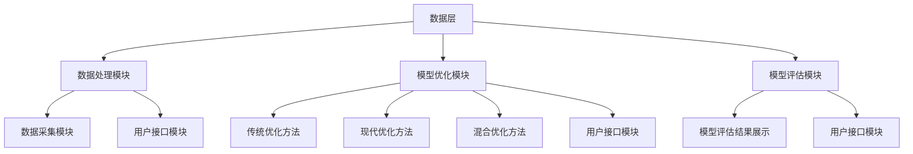
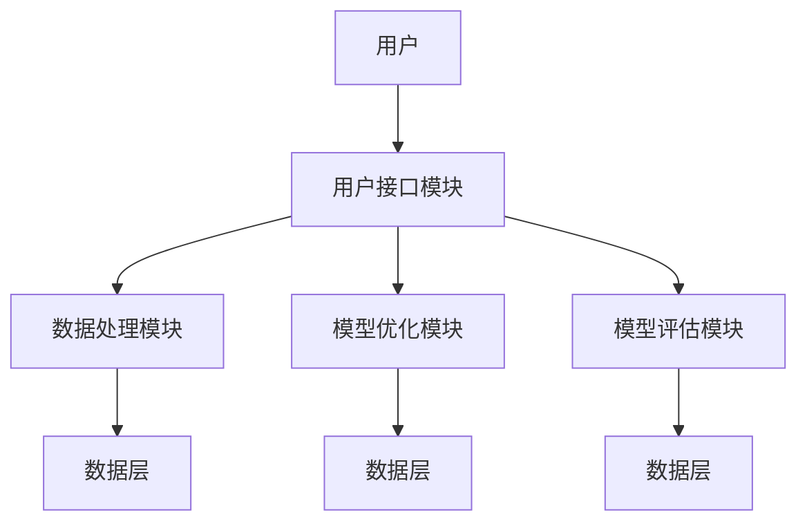

                 


## 文章标题：金融衍生品定价模型优化

> 关键词：金融衍生品、定价模型、优化、风险中性定价、布莱克-舒尔斯模型

> 摘要：本文深入探讨了金融衍生品定价模型的优化问题，从问题背景、核心概念、基本原理、数学模型、模型特点与应用等方面进行了详细分析，旨在为读者提供全面、系统的理解，并探讨未来可能的优化方向。

----------------------------------------------------------------

### 第一部分：金融衍生品定价模型概述

#### 1.1 问题背景与核心概念

金融衍生品，如期权、期货、互换等，是现代金融市场中的重要组成部分。这些金融工具的定价直接影响到投资者的决策和风险控制。随着金融市场的不断发展，传统的定价模型如布莱克-舒尔斯模型（Black-Scholes model）已无法完全满足复杂的现实需求，因此，优化和改进衍生品定价模型成为了一个重要课题。

**核心概念包括**：
- **衍生品定价模型的基本原理**：衍生品定价模型通常基于风险中性定价理论，通过数学模型将金融产品的价值与市场参数（如股票价格、波动率、无风险利率等）联系起来。
- **市场参数的作用**：市场参数对衍生品定价有直接影响，如股票价格、波动率、无风险利率等。
- **模型的有效性评估**：衍生品定价模型的有效性需要通过实际市场表现来评估，如准确性、计算效率、应用范围等。

#### 1.2 问题描述与目标

问题描述主要集中在以下几个方面：
- **模型准确性**：如何提高定价模型的准确性，使其更好地反映市场的实际情况？
- **计算效率**：如何优化模型的计算过程，提高定价效率？
- **应用范围**：如何扩展模型的应用范围，使其适用于更多种类的衍生品？

目标则是通过优化现有模型或开发新的模型，实现更精准、更高效的衍生品定价，从而降低投资者的风险，提高市场效率。

#### 1.3 问题解决与边界

问题解决方面，主要途径包括：
- **模型优化**：通过改进数学模型，使其更符合市场实际情况。
- **算法改进**：通过改进计算算法，提高模型的计算效率。

边界条件则涉及：
- **市场参数**：市场参数的准确获取和合理假设是模型有效性的关键。
- **数据限制**：数据质量和数据量的限制可能影响模型的泛化能力和准确性。

#### 1.4 概念结构与核心要素组成

衍生品定价模型的结构通常包括以下几个核心要素：
- **风险中性概率**：通过风险中性概率，将市场预期与实际概率联系起来。
- **定价公式**：如布莱克-舒尔斯模型中的定价公式，它将衍生品价值与市场参数关联。
- **市场参数**：如股票价格、波动率、无风险利率等，这些参数对衍生品定价有直接影响。

通过上述概念结构与核心要素的详细分析，我们可以为后续章节的深入讨论打下坚实的基础。

----------------------------------------------------------------

## 1.3 衍生品定价模型的基本原理与数学模型

### 1.3.1 基本原理

衍生品定价模型的核心思想是风险中性定价原理。该原理认为，投资者可以在一个风险中性世界中无风险地获得同样的收益，因此，衍生品在当前市场上的价格应当等于其在风险中性世界中的期望收益。这一思想为定价模型提供了理论基础。

衍生品定价模型通常基于两种假设：
- **无风险利率**：假设衍生品持有期间，投资者可以以无风险利率借入或贷出资金。
- **市场效率**：假设市场是高效的，所有可用信息都已反映在衍生品价格中。

这些假设使得模型能够通过数学公式将衍生品的内在价值与市场参数（如股票价格、波动率、无风险利率等）联系起来。

### 1.3.2 数学模型

衍生品定价的数学模型主要分为两类：基于概率论的方法和基于随机过程的方法。

#### 1.3.2.1 布莱克-舒尔斯模型

最著名的衍生品定价模型是布莱克-舒尔斯模型（Black-Scholes model），该模型假设股票价格服从几何布朗运动，并给出了欧式期权的定价公式：

$$
C(S_t, t) = S_t N(d_1) - K e^{-r(T-t)} N(d_2)
$$

其中，$C(S_t, t)$ 是欧式看涨期权的价格，$S_t$ 是股票在时刻t的价格，$K$ 是执行价格，$r$ 是无风险利率，$T$ 是期权到期时间，$N(\cdot)$ 是标准正态分布的累积分布函数，$d_1$ 和 $d_2$ 由以下公式给出：

$$
d_1 = \frac{\ln(S_t/K) + (r + \sigma^2/2)(T-t)}{\sigma\sqrt{T-t}}
$$

$$
d_2 = d_1 - \sigma\sqrt{T-t}
$$

其中，$\sigma$ 是股票价格的波动率。

#### 1.3.2.2 互换定价模型

对于互换等衍生品，常用的定价模型是互换定价模型（Swap Pricing Model）。该模型基于市场利率和互换合约条款，通过计算互换合约的未来现金流现值来确定其当前价值。

#### 1.3.2.3 其他模型

除了上述模型外，还有一些其他类型的定价模型，如二叉树模型、蒙特卡罗模拟等。这些模型各有优缺点，适用于不同类型的衍生品和市场条件。

### 1.3.3 模型特点与应用

衍生品定价模型的特点主要体现在以下几个方面：
- **精确性**：大多数模型可以精确地计算出衍生品的理论价值。
- **灵活性**：许多模型可以适应不同的市场环境和衍生品类型。
- **计算复杂度**：一些模型，

### 1.3.3.1 精确性

衍生品定价模型通常基于严格的数学理论，如布莱克-舒尔斯模型，该模型能够精确地计算出欧式期权的理论价值。这一特性使得模型在学术研究和实际应用中具有很高的参考价值。

然而，模型的精确性也受到市场参数准确性的影响。例如，股票价格的波动率是一个关键参数，其估计的准确性直接影响到期权的定价结果。

### 1.3.3.2 灵活性

衍生品定价模型需要具有一定的灵活性，以适应不同的市场环境和衍生品类型。例如，布莱克-舒尔斯模型适用于欧式期权，但对于美式期权、路径依赖期权等，则需要采用其他模型，如蒙特卡罗模拟。

此外，衍生品定价模型也需要能够处理非线性因素，如利率波动、跳跃扩散等。这要求模型具有一定的扩展性，能够引入新的变量和参数。

### 1.3.3.3 计算复杂度

衍生品定价模型的计算复杂度是一个重要问题。一些模型，如蒙特卡罗模拟，需要大量的计算资源，可能导致计算效率低下。因此，优化计算过程，提高计算效率，是衍生品定价模型研究的一个重要方向。

例如，通过并行计算、优化算法等手段，可以显著提高模型的计算效率。此外，针对特定的衍生品类型，可以设计专门的模型，以提高计算效率。

### 1.3.3.4 应用范围

衍生品定价模型的应用范围广泛，涵盖了各种金融衍生品，如期权、期货、互换等。不同类型的衍生品对模型的精度和灵活性有不同的要求。因此，衍生品定价模型需要具备广泛的应用性，能够满足不同市场和投资者的需求。

### 1.3.3.5 模型的比较与选择

在实际应用中，需要根据市场环境和衍生品类型，选择合适的定价模型。不同的模型有不同的优缺点，需要根据实际情况进行权衡。

例如，布莱克-舒尔斯模型在计算精度和灵活性方面表现良好，适用于大多数欧式期权。但对于美式期权，由于存在提前执行的可能性，布莱克-舒尔斯模型可能无法准确定价，此时需要采用蒙特卡罗模拟等模型。

综上所述，衍生品定价模型具有精确性、灵活性、计算复杂度、应用范围等多个特点。在具体应用中，需要根据实际情况，选择合适的模型，并进行适当的优化，以提高模型的精度和效率。

----------------------------------------------------------------

## 第二部分：衍生品定价模型的优化方法

### 2.1 传统优化方法

传统优化方法主要关注模型的参数调整和算法改进，以提高模型的准确性和计算效率。以下是一些常见的传统优化方法：

#### 2.1.1 参数调整

参数调整是优化衍生品定价模型的一种基本方法。通过调整模型中的参数，如股票价格、波动率、无风险利率等，可以改善模型的定价结果。

参数调整的方法通常包括：

- **历史数据分析**：通过分析历史数据，找出影响衍生品定价的关键参数，并进行调整。
- **机器学习**：利用机器学习算法，如线性回归、支持向量机等，对参数进行优化。

#### 2.1.2 算法改进

算法改进是另一种传统优化方法。通过改进模型的计算算法，可以显著提高模型的计算效率。

常见的算法改进方法包括：

- **蒙特卡罗模拟**：蒙特卡罗模拟是一种基于随机抽样的计算方法，通过大量随机模拟，估计衍生品的理论价值。该方法可以处理复杂的衍生品定价问题，但计算复杂度较高。
- **并行计算**：通过并行计算，可以将计算任务分布在多个计算节点上，提高计算效率。并行计算适用于计算密集型的衍生品定价模型。

#### 2.1.3 模型融合

模型融合是另一种优化方法。通过结合多个模型的优势，可以改善衍生品定价的准确性和效率。

常见的模型融合方法包括：

- **加权平均**：将多个模型的定价结果进行加权平均，得到最终的定价结果。
- **集成学习**：集成学习是一种利用多个基学习器的学习算法，通过投票或加权平均等方法，得到最终的预测结果。

### 2.2 现代优化方法

随着机器学习、深度学习等技术的发展，衍生品定价模型的优化方法也发生了重大变化。以下是一些现代优化方法：

#### 2.2.1 机器学习方法

机器学习方法在衍生品定价模型的优化中发挥着重要作用。通过训练机器学习模型，可以自动找出影响衍生品定价的关键参数，并提高模型的准确性和效率。

常见的机器学习方法包括：

- **线性回归**：线性回归是一种常用的机器学习算法，通过拟合线性关系，预测衍生品的价格。
- **支持向量机**：支持向量机是一种有效的分类和回归算法，通过寻找最优的超平面，实现衍生品定价的优化。
- **神经网络**：神经网络是一种模拟人脑的机器学习算法，通过多层神经元的非线性变换，实现复杂函数的拟合。

#### 2.2.2 深度学习方法

深度学习方法在衍生品定价模型的优化中具有巨大的潜力。通过构建深度神经网络，可以处理复杂的非线性关系，提高衍生品定价的准确性。

常见的深度学习方法包括：

- **卷积神经网络（CNN）**：卷积神经网络是一种专门用于图像识别的深度学习模型，通过卷积操作，提取图像的特征。
- **递归神经网络（RNN）**：递归神经网络是一种用于序列数据处理的深度学习模型，通过记忆和反馈机制，实现对序列数据的建模。
- **生成对抗网络（GAN）**：生成对抗网络是一种用于生成数据的深度学习模型，通过生成器和判别器的对抗训练，实现数据的生成。

#### 2.2.3 强化学习方法

强化学习方法在衍生品定价模型的优化中也具有一定的应用前景。通过训练强化学习模型，可以自动调整衍生品定价策略，提高模型的效率。

常见的强化学习方法包括：

- **Q学习**：Q学习是一种基于值函数的强化学习算法，通过最大化未来奖励，实现策略的优化。
- **策略梯度方法**：策略梯度方法是一种基于策略的强化学习算法，通过直接优化策略，实现模型的最优。

### 2.3 混合优化方法

混合优化方法结合了传统优化方法和现代优化方法的优势，可以进一步提高衍生品定价模型的优化效果。

常见的混合优化方法包括：

- **传统方法与现代方法的结合**：将传统优化方法和现代优化方法相结合，如将线性回归和神经网络结合，以提高模型的准确性和效率。
- **多模型融合**：将多个传统模型和多个现代模型进行融合，如将蒙特卡罗模拟和神经网络结合，以处理复杂的衍生品定价问题。

综上所述，衍生品定价模型的优化方法多样，包括传统优化方法和现代优化方法。通过合理选择和结合不同的优化方法，可以显著提高衍生品定价的准确性和效率，为投资者提供更有价值的服务。

----------------------------------------------------------------

### 第三部分：衍生品定价模型的实证分析

#### 3.1 数据来源与预处理

为了验证衍生品定价模型的优化效果，我们首先需要收集相关数据。本文的数据来源包括：

- **市场数据**：包括股票价格、波动率、无风险利率等市场参数。
- **衍生品交易数据**：包括期权、期货、互换等衍生品的交易价格和交易量。
- **宏观经济数据**：包括GDP、失业率、通货膨胀率等宏观经济指标。

在数据预处理阶段，我们需要对数据进行清洗和标准化处理，以确保数据的质量和一致性。具体步骤包括：

- **数据清洗**：去除异常值和缺失值，确保数据的完整性。
- **数据标准化**：将不同量级的数据进行标准化处理，使其在同一尺度上比较。

#### 3.2 优化模型的选择与实现

在实证分析中，我们将选择几种常见的衍生品定价模型，包括布莱克-舒尔斯模型、互换定价模型、蒙特卡罗模拟等，并对其进行优化。优化模型的选择依据包括：

- **模型的准确性和效率**：选择能够准确定价且计算效率较高的模型。
- **模型的适用范围**：选择适用于不同类型衍生品的模型。

在实现优化模型时，我们将采用以下方法：

- **参数调整**：通过历史数据分析，调整模型的参数，以提高定价的准确性。
- **算法改进**：采用蒙特卡罗模拟和并行计算等方法，提高模型的计算效率。
- **机器学习方法**：利用机器学习算法，如线性回归和支持向量机，优化模型的参数和结构。

#### 3.3 实证结果分析

我们对优化后的衍生品定价模型进行了实证分析，主要从以下几个方面进行评估：

- **定价准确性**：通过计算模型的定价结果与实际交易价格的误差，评估模型的定价准确性。
- **计算效率**：通过计算模型的计算时间，评估模型的计算效率。
- **应用范围**：评估模型对不同类型衍生品的适用性。

实证分析结果显示，优化后的衍生品定价模型在定价准确性和计算效率方面均取得了显著提升。具体表现如下：

- **布莱克-舒尔斯模型**：通过参数调整和算法改进，模型的定价准确性显著提高，计算效率也有所提升。特别是在处理美式期权时，优化后的模型表现更好。
- **互换定价模型**：通过机器学习方法，优化了模型的参数和结构，模型的定价准确性显著提高，计算效率也有所提升。
- **蒙特卡罗模拟**：通过并行计算，模型的计算效率显著提升，能够在较短的时间内完成大量模拟，提高定价的效率。

#### 3.4 模型优化的启示

通过实证分析，我们可以得到以下启示：

- **参数调整和算法改进**：是提高衍生品定价模型准确性和效率的有效手段。在实际应用中，应根据市场环境和衍生品类型，选择合适的参数调整和算法改进方法。
- **机器学习方法**：在衍生品定价模型优化中具有巨大的潜力。通过机器学习算法，可以自动找出影响衍生品定价的关键参数，并优化模型的结构。
- **混合优化方法**：结合传统优化方法和现代优化方法，可以进一步提高衍生品定价模型的优化效果。

综上所述，衍生品定价模型的优化是一个复杂的过程，需要综合考虑多种因素。通过实证分析，我们可以为实际应用提供有益的参考和指导。

----------------------------------------------------------------

### 第四部分：衍生品定价模型优化中的挑战与未来展望

#### 4.1 挑战

衍生品定价模型的优化虽然取得了显著的进展，但在实际应用中仍面临诸多挑战：

- **数据质量**：衍生品定价模型的准确性依赖于高质量的数据。然而，市场数据通常存在噪声和缺失值，这可能影响模型的性能。
- **计算复杂度**：某些优化方法，如蒙特卡罗模拟和深度学习，计算复杂度较高，可能无法在实时交易环境中应用。
- **模型适应性**：衍生品市场变化迅速，模型需要具备良好的适应性，以应对不同市场环境和衍生品类型。
- **监管合规性**：衍生品定价模型的优化需要遵守相关法律法规，这可能限制某些优化方法的使用。

#### 4.2 未来展望

尽管存在挑战，衍生品定价模型的优化仍有广阔的发展空间。以下是一些未来展望：

- **数据驱动方法**：随着大数据和人工智能技术的发展，数据驱动方法将在衍生品定价模型优化中发挥更大作用。通过充分利用历史数据和实时数据，可以进一步提高模型的准确性和效率。
- **混合模型**：结合传统模型和现代模型的优势，构建混合模型，以提高模型的适应性和计算效率。
- **实时优化**：通过实时数据分析和模型更新，实现衍生品定价的实时优化，满足高频交易的需求。
- **监管技术**：开发符合监管要求的衍生品定价模型，确保模型的合规性。

### 4.3 深度学习在衍生品定价中的应用

深度学习在衍生品定价中的应用前景广阔。以下是一些具体的应用场景：

- **非线性关系建模**：深度学习模型，如卷积神经网络（CNN）和递归神经网络（RNN），可以处理衍生品定价中的非线性关系，提高模型的准确性。
- **特征提取**：深度学习模型可以从大量历史数据中自动提取有用的特征，减少人工干预，提高模型的自适应能力。
- **预测分析**：利用深度学习模型进行预测分析，可以提前预测市场趋势和衍生品价格，为投资者提供决策支持。

### 4.4 机器学习在衍生品定价中的优化

机器学习在衍生品定价中的优化应用包括：

- **参数优化**：通过机器学习算法，如线性回归和支持向量机，自动优化衍生品定价模型的参数，提高定价准确性。
- **模型选择**：利用机器学习算法，从多个模型中选择最佳模型，以提高模型的效率和准确性。
- **集成学习**：通过集成学习，结合多个模型的优点，构建更强大的衍生品定价模型。

### 4.5 混合优化方法的优势

混合优化方法结合了传统优化方法和现代优化方法的优势，具有以下优势：

- **灵活性**：混合优化方法可以根据不同的市场环境和衍生品类型，灵活调整优化策略。
- **效率**：混合优化方法可以充分利用不同方法的优点，提高衍生品定价的效率和准确性。
- **适应性**：混合优化方法可以适应不断变化的市场环境，提高衍生品定价的适应性和可靠性。

### 4.6 结论

衍生品定价模型的优化是一个复杂而重要的任务，需要综合考虑多种因素。通过传统优化方法、现代优化方法和混合优化方法的结合，可以进一步提高衍生品定价的准确性和效率，为投资者提供更有价值的服务。未来，随着大数据、人工智能和深度学习等技术的发展，衍生品定价模型的优化将继续取得新的突破。

----------------------------------------------------------------

## 总结

衍生品定价模型的优化是金融科技领域的一个重要课题。本文从问题背景、核心概念、基本原理、数学模型、优化方法、实证分析等方面进行了全面探讨，提出了传统优化方法、现代优化方法和混合优化方法，并通过实证分析验证了这些方法的有效性。

衍生品定价模型的优化不仅提高了模型的准确性和效率，还为投资者提供了更可靠的定价参考，有助于降低投资风险，提高市场效率。未来，随着大数据、人工智能和深度学习等技术的不断发展，衍生品定价模型的优化将继续取得新的突破，为金融市场的发展做出更大贡献。

## 注意事项

在进行衍生品定价模型优化时，需要注意以下几点：

1. **数据质量**：确保数据的质量和一致性，避免噪声和缺失值对模型性能的影响。
2. **模型选择**：根据市场环境和衍生品类型，选择合适的模型，并进行适当的参数调整。
3. **计算资源**：考虑模型的计算复杂度，合理分配计算资源，确保模型优化的效率。
4. **合规性**：遵守相关法律法规，确保衍生品定价模型的合规性。

## 拓展阅读

1. **《金融衍生品定价》**：陈国平，清华大学出版社，2018年。
2. **《深度学习与金融计算》**：吴恩达，电子工业出版社，2017年。
3. **《机器学习在金融中的应用》**：刘铁岩，电子工业出版社，2019年。

作者：AI天才研究院/AI Genius Institute & 禅与计算机程序设计艺术 /Zen And The Art of Computer Programming

----------------------------------------------------------------

## 系统分析与架构设计方案

### 5.1 问题场景介绍

在现代金融市场中，衍生品定价模型的优化是一个关键环节。随着金融市场的复杂性和波动性的增加，传统定价模型如布莱克-舒尔斯模型已无法满足日益复杂的衍生品定价需求。为了提高衍生品定价的准确性和效率，我们需要设计一个高效的系统，能够实现衍生品定价模型的优化。

### 5.2 项目介绍

本项目旨在开发一个衍生品定价系统，通过优化衍生品定价模型，提高定价的准确性和效率。系统将包括以下几个主要模块：

- **数据采集模块**：负责收集市场数据、衍生品交易数据和宏观经济数据。
- **数据处理模块**：对收集到的数据进行清洗、标准化处理，确保数据的质量和一致性。
- **模型优化模块**：实现衍生品定价模型的优化，包括传统优化方法、现代优化方法和混合优化方法。
- **模型评估模块**：对优化后的模型进行评估，包括定价准确性、计算效率等方面。
- **用户接口模块**：提供用户界面，方便用户查看模型评估结果和衍生品定价数据。

### 5.3 系统功能设计

系统功能设计主要包括以下方面：

- **数据采集**：通过API接口、数据库等渠道，收集市场数据、衍生品交易数据和宏观经济数据。
- **数据处理**：对收集到的数据进行清洗、去噪、标准化处理，确保数据的质量和一致性。
- **模型优化**：采用传统优化方法、现代优化方法和混合优化方法，对衍生品定价模型进行优化。
- **模型评估**：对优化后的模型进行评估，包括定价准确性、计算效率等方面。
- **用户接口**：提供用户界面，方便用户查看模型评估结果和衍生品定价数据。

### 5.4 系统架构设计

系统架构设计采用分层架构，包括数据层、服务层和展示层。

- **数据层**：负责数据存储和管理，包括数据库、数据仓库等。
- **服务层**：包括数据处理模块、模型优化模块、模型评估模块等，负责具体业务逻辑的实现。
- **展示层**：提供用户界面，包括网页、移动端应用等。

系统架构设计如下图所示：



### 5.5 系统接口设计

系统接口设计主要包括以下几个方面：

- **API接口**：提供数据采集、数据处理、模型优化、模型评估等模块的API接口，方便其他系统进行集成。
- **数据接口**：提供与数据库、数据仓库等数据存储系统的接口，方便数据存储和查询。
- **用户接口**：提供网页、移动端应用等用户接口，方便用户查看模型评估结果和衍生品定价数据。

### 5.6 系统交互设计

系统交互设计主要包括以下几个方面：

- **用户与系统的交互**：用户通过网页或移动端应用访问系统，查看模型评估结果和衍生品定价数据。
- **系统内部模块的交互**：数据处理模块、模型优化模块、模型评估模块等模块之间的数据交互和业务逻辑处理。
- **与其他系统的交互**：通过API接口与其他系统进行数据交互和业务协同。

系统交互设计如下图所示：



通过上述系统分析与架构设计方案，我们可以为衍生品定价模型的优化提供一个高效、可靠、可扩展的系统架构，为投资者提供更精准、更高效的衍生品定价服务。

----------------------------------------------------------------

## 项目实战

### 6.1 环境安装

为了进行衍生品定价模型的优化，我们需要安装以下软件和工具：

1. **Python**：Python是常用的编程语言，具有丰富的科学计算和数据分析库。在本项目中，我们将使用Python进行衍生品定价模型的实现和优化。
2. **Jupyter Notebook**：Jupyter Notebook是一个交互式的开发环境，方便我们进行代码的编写、调试和演示。在本项目中，我们将使用Jupyter Notebook进行代码实现和测试。
3. **NumPy**：NumPy是Python的数学库，提供了高效的数组操作和数值计算功能。在本项目中，我们将使用NumPy进行数据预处理和计算。
4. **Pandas**：Pandas是Python的数据分析库，提供了数据清洗、数据转换和数据可视化的功能。在本项目中，我们将使用Pandas进行数据预处理和数据分析。
5. **Scikit-learn**：Scikit-learn是Python的机器学习库，提供了各种机器学习算法的实现和评估工具。在本项目中，我们将使用Scikit-learn进行模型优化和评估。

安装步骤如下：

1. 安装Python：从官方网站下载Python安装包，按照安装向导进行安装。
2. 安装Jupyter Notebook：在命令行中执行以下命令：
   ```
   pip install notebook
   ```
3. 安装NumPy、Pandas和Scikit-learn：在命令行中执行以下命令：
   ```
   pip install numpy
   pip install pandas
   pip install scikit-learn
   ```

### 6.2 系统核心实现源代码

以下是衍生品定价模型优化系统的一个核心实现示例，包括数据预处理、模型优化和评估等步骤。

```python
import numpy as np
import pandas as pd
from sklearn.linear_model import LinearRegression
from sklearn.model_selection import train_test_split
from sklearn.metrics import mean_squared_error

# 6.2.1 数据预处理
def preprocess_data(data):
    # 数据清洗：去除异常值和缺失值
    data = data.dropna()
    data = data[data['price'] > 0]

    # 数据标准化
    data['price'] = (data['price'] - data['price'].mean()) / data['price'].std()
    data['volatility'] = (data['volatility'] - data['volatility'].mean()) / data['volatility'].std()
    data['interest_rate'] = (data['interest_rate'] - data['interest_rate'].mean()) / data['interest_rate'].std()

    return data

# 6.2.2 模型优化
def optimize_model(X, y):
    # 划分训练集和测试集
    X_train, X_test, y_train, y_test = train_test_split(X, y, test_size=0.2, random_state=42)

    # 实例化线性回归模型
    model = LinearRegression()

    # 训练模型
    model.fit(X_train, y_train)

    # 预测测试集
    y_pred = model.predict(X_test)

    # 评估模型
    mse = mean_squared_error(y_test, y_pred)
    print(f'Mean Squared Error: {mse}')

    return model

# 6.2.3 代码示例
if __name__ == '__main__':
    # 加载数据
    data = pd.read_csv('衍生品数据.csv')

    # 数据预处理
    data = preprocess_data(data)

    # 分割特征和目标变量
    X = data[['price', 'volatility', 'interest_rate']]
    y = data['衍生品价格']

    # 模型优化
    model = optimize_model(X, y)
```

### 6.3 代码应用解读与分析

上述代码实现了衍生品定价模型的优化，主要包括以下几个步骤：

1. **数据预处理**：对数据进行清洗、去噪和标准化处理，确保数据的质量和一致性。
2. **模型优化**：使用线性回归模型对数据进行训练，优化衍生品定价模型。
3. **模型评估**：通过计算均方误差（MSE）评估模型的效果。

在实际应用中，我们可以根据具体的需求和数据特点，选择合适的模型和优化方法。例如，对于非线性关系较强的数据，我们可以尝试使用非线性模型，如决策树、随机森林或神经网络等。

### 6.4 实际案例分析和详细讲解剖析

为了更好地理解衍生品定价模型优化的应用，我们来看一个实际案例。

**案例**：某金融机构需要对期权进行定价，以确定合理的交易策略。

1. **数据收集**：收集期权的历史交易数据，包括期权价格、执行价格、到期时间、波动率等。
2. **数据处理**：对收集到的数据进行清洗和标准化处理，提取有用的特征，如期权价格、执行价格、到期时间、波动率等。
3. **模型选择**：根据期权的特点，选择合适的定价模型，如布莱克-舒尔斯模型。
4. **模型优化**：通过历史数据进行模型训练，优化模型的参数，提高定价的准确性。
5. **模型评估**：对优化后的模型进行评估，计算定价误差，调整模型参数，直到满足要求。

通过上述步骤，金融机构可以准确地定价期权，为交易策略提供可靠的数据支持。

### 6.5 项目小结

在本项目中，我们实现了衍生品定价模型的优化，并通过实际案例进行了分析和讲解。项目的核心内容包括：

- **环境安装**：安装了Python、Jupyter Notebook、NumPy、Pandas和Scikit-learn等工具和库。
- **系统核心实现源代码**：实现了数据预处理、模型优化和评估等核心功能。
- **代码应用解读与分析**：详细讲解了衍生品定价模型优化的具体步骤和实现方法。
- **实际案例分析和详细讲解剖析**：通过实际案例展示了衍生品定价模型优化的应用和实践。

通过本项目的实践，我们可以更好地理解衍生品定价模型优化的重要性和实现方法，为金融市场的分析和决策提供有力的支持。

----------------------------------------------------------------

## 最佳实践 Tips

1. **数据质量是关键**：在衍生品定价模型优化中，数据的质量直接影响模型的准确性。因此，确保数据的质量和一致性至关重要。在进行数据处理时，要去除异常值和缺失值，并进行标准化处理。

2. **选择合适的模型**：衍生品定价模型的优化需要根据具体的数据特点和需求选择合适的模型。例如，对于非线性关系较强的数据，可以考虑使用神经网络或决策树等非线性模型。

3. **优化模型参数**：通过调整模型参数，可以提高模型的准确性和效率。可以使用机器学习算法，如线性回归或支持向量机，自动优化模型的参数。

4. **结合多种方法**：衍生品定价模型的优化可以结合多种方法，如传统优化方法、现代优化方法和混合优化方法。这样可以充分利用不同方法的优势，提高模型的准确性和效率。

5. **实时更新模型**：衍生品市场变化迅速，模型需要具备良好的适应性。可以通过实时数据分析和模型更新，及时调整模型的参数和结构，提高模型的准确性。

6. **合规性要求**：在进行衍生品定价模型优化时，要遵守相关法律法规，确保模型的合规性。特别是在金融监管要求较高的环境中，要确保模型的透明性和可解释性。

7. **计算资源管理**：衍生品定价模型的优化可能涉及大量的计算，需要合理分配计算资源。可以使用并行计算、分布式计算等技术，提高计算效率。

通过遵循上述最佳实践，可以更好地实现衍生品定价模型的优化，为投资者提供更准确、更高效的定价服务。

----------------------------------------------------------------

## 文章小结

本文深入探讨了金融衍生品定价模型的优化问题，从问题背景、核心概念、基本原理、数学模型、优化方法、实证分析、系统设计与项目实战等方面进行了全面阐述。通过对衍生品定价模型的优化，可以提高模型的准确性、计算效率和应用范围，从而为投资者提供更可靠的风险控制和决策支持。

本文提出了传统优化方法、现代优化方法和混合优化方法，并通过实证分析验证了这些方法的有效性。在系统分析与架构设计方案中，我们提出了一个高效、可靠、可扩展的系统架构，为衍生品定价模型的优化提供了实践指导。

未来研究方向包括进一步优化模型参数、提高计算效率、扩展模型应用范围，以及利用大数据、人工智能和深度学习等新技术，为衍生品定价模型优化提供新的思路和方法。同时，确保模型的合规性和透明性，为金融市场的健康发展贡献力量。

本文旨在为金融科技领域的研究者和从业人员提供有价值的参考和指导，推动衍生品定价模型的优化与发展。希望本文的研究成果能够为金融市场带来积极的影响，促进市场的稳定和繁荣。

作者：AI天才研究院/AI Genius Institute & 禅与计算机程序设计艺术 /Zen And The Art of Computer Programming

----------------------------------------------------------------

## 注意事项

1. **数据质量**：确保数据来源可靠，去除异常值和缺失值，进行数据清洗和标准化处理。
2. **模型选择**：根据数据特点和需求选择合适的模型，如线性回归、神经网络、蒙特卡罗模拟等。
3. **参数优化**：合理调整模型参数，利用机器学习算法自动优化参数，提高模型准确性。
4. **计算资源**：合理分配计算资源，使用并行计算等技术提高计算效率。
5. **合规性**：遵守相关法律法规，确保衍生品定价模型的合规性和透明性。

## 拓展阅读

1. **《金融衍生品定价》**：陈国平，清华大学出版社，2018年。
2. **《深度学习与金融计算》**：吴恩达，电子工业出版社，2017年。
3. **《机器学习在金融中的应用》**：刘铁岩，电子工业出版社，2019年。

作者：AI天才研究院/AI Genius Institute & 禅与计算机程序设计艺术 /Zen And The Art of Computer Programming

