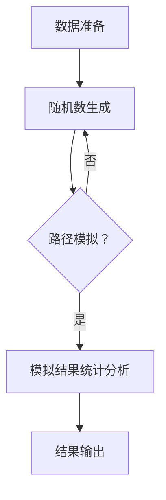
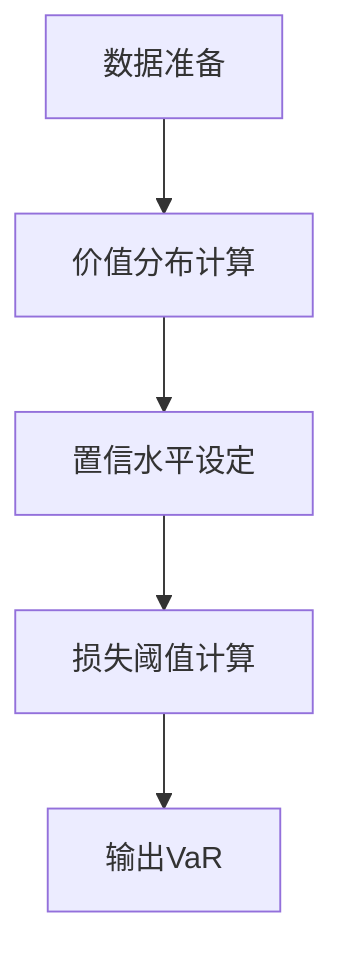
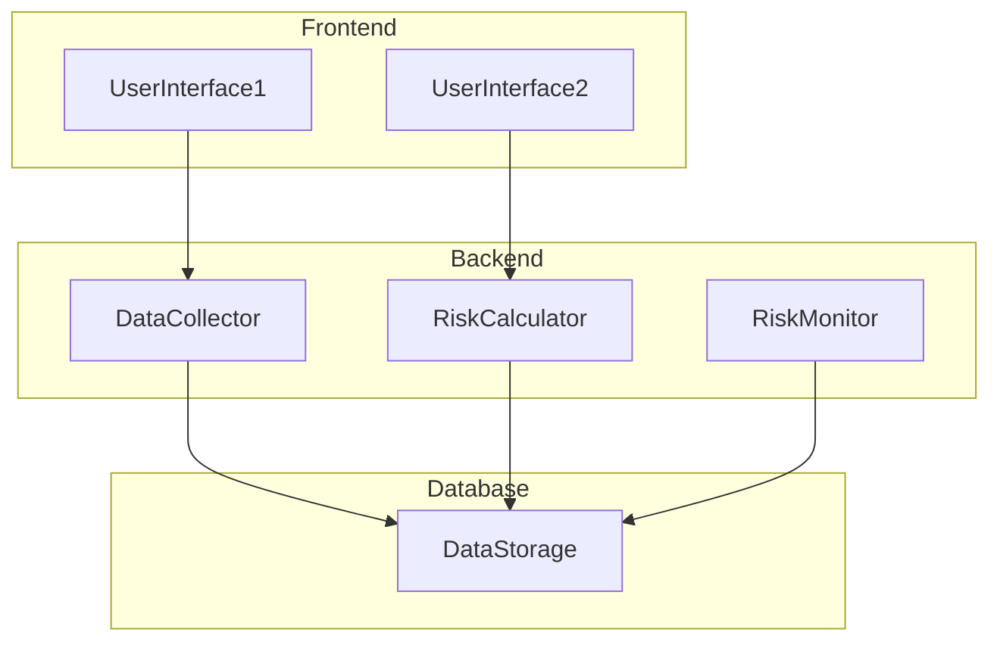
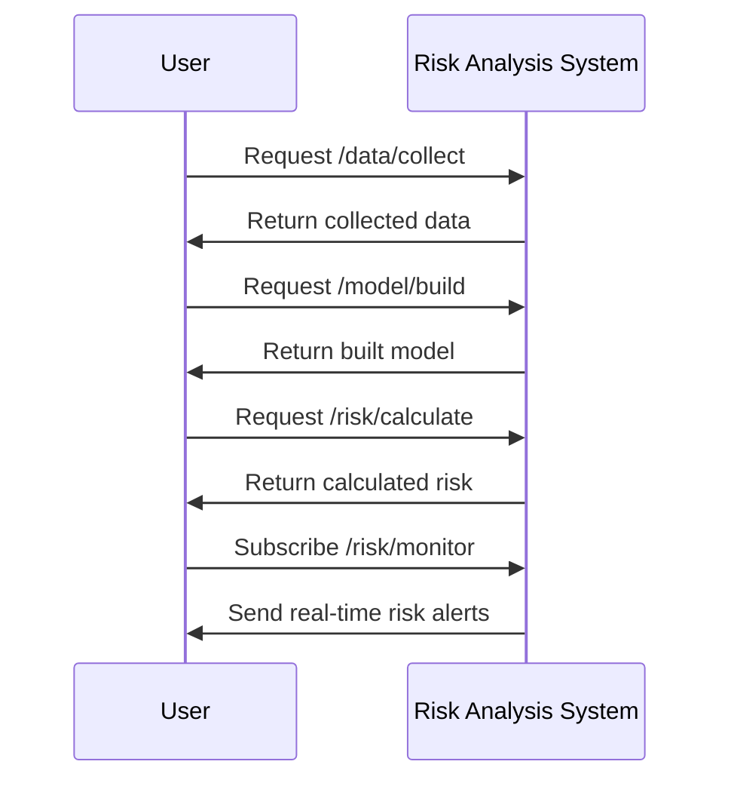

                 

### 第1章：金融衍生品组合风险分析概述

### 1.1 问题的背景与重要性

#### 1.1.1 金融衍生品市场的兴起

金融衍生品市场起源于20世纪70年代，随着全球金融市场自由化和金融创新活动的增多，金融衍生品交易逐渐成为投资者和管理者管理风险的重要工具。衍生品包括期货、期权、互换等，它们允许投资者通过持有或出售合约来对冲潜在的市场波动风险。这些产品在提高金融市场效率和风险管理能力方面发挥了重要作用。

近年来，金融衍生品市场持续扩大。据国际互换和衍生品协会（ISDA）统计，截至2022年，全球场外衍生品未平仓合约的名义价值已超过600万亿美元。如此庞大的市场规模不仅体现了衍生品在风险管理中的重要作用，同时也增加了市场参与者的风险暴露。

#### 1.1.2 组合风险管理的挑战

金融衍生品组合风险管理面临诸多挑战。首先，衍生品合约之间的复杂性和多样性增加了风险分析的难度。其次，市场参数的不确定性和极端事件的发生可能性，使得传统风险管理方法难以准确评估组合风险。此外，监管机构对衍生品交易的监管要求日益严格，也迫使市场参与者必须提高风险管理水平。

具体来说，组合风险管理的挑战包括以下几个方面：

1. **模型风险**：风险管理模型在处理复杂市场环境时可能存在不准确或过度简化的情况。
2. **数据质量**：衍生品交易数据的质量和完整性直接影响风险分析结果的可靠性。
3. **监管合规**：满足监管机构对衍生品交易风险披露和监管要求，需要市场参与者具备高水平的风险管理能力和技术。
4. **流动性风险**：在某些市场情况下，衍生品交易可能会出现流动性不足，增加组合风险。

#### 1.1.3 风险分析工具的需求

为了应对上述挑战，市场参与者对高效、准确的风险分析工具的需求日益迫切。这些工具不仅可以帮助机构更好地理解和管理衍生品组合风险，还可以提高决策的及时性和准确性。风险分析工具的核心功能包括：

1. **风险指标计算**：提供各种风险指标的计算功能，如风险价值（VaR）、条件风险价值（CVaR）等，帮助机构评估组合风险。
2. **情景分析与压力测试**：通过模拟不同市场情景，分析组合在极端市场条件下的表现，评估极端风险。
3. **数据采集与处理**：自动化、高效地获取和处理衍生品交易数据，确保数据质量和完整性。
4. **监管合规支持**：帮助市场参与者满足监管机构对风险披露和监管要求。

综上所述，金融衍生品组合风险分析工具在当前金融市场中具有不可替代的重要性。它不仅帮助市场参与者更好地管理风险，还促进了金融市场的发展和稳定。下一节将深入探讨金融衍生品的定义及其在组合风险管理中的作用。

### 1.2 问题的描述与定义

#### 1.2.1 金融衍生品的定义

金融衍生品是指一种基于基础资产（如股票、债券、商品、货币等）价格变动的金融合约，其价值取决于或派生于基础资产的价格。衍生品主要包括以下几种类型：

1. **期货**：期货合约是一种标准化的金融工具，允许交易双方在未来某一特定时间以约定价格买卖某种资产。期货市场通常由交易所监管，交易标准化合约。
2. **期权**：期权合约给予持有人在未来某一时间以约定价格购买或出售某种资产的权利，而非义务。期权分为看涨期权和看跌期权。
3. **互换**：互换合约是交易双方同意在未来某一时间段内交换不同类型的现金流（如利率互换、货币互换）。
4. **信用违约互换**（CDS）：信用违约互换是一种保险形式，保护投资者免受特定借款人违约的风险。

衍生品的特点包括高度杠杆、高风险和高收益，同时具有价格发现和风险转移的功能。这些特性使得衍生品成为市场参与者进行对冲和投机的重要工具。

#### 1.2.2 组合风险的概念

组合风险是指一个投资组合中各个资产共同面临的风险。组合风险管理旨在通过多样化投资来降低单一资产的风险，从而提高整个组合的风险调整后收益。在衍生品组合中，风险主要包括市场风险、信用风险、流动性风险和操作风险。

1. **市场风险**：由于市场条件变化（如利率、汇率、股票价格等）导致的资产价格波动风险。
2. **信用风险**：由于交易对手违约导致的损失风险。
3. **流动性风险**：由于市场交易不活跃，难以在合理价格迅速买卖资产的风险。
4. **操作风险**：由于内部流程、人员错误、系统故障等导致的损失风险。

组合风险管理的目标是通过科学的分析工具和方法，全面评估和管理投资组合中的各种风险，确保组合的稳健性和收益性。

#### 1.2.3 风险分析工具的分类

风险分析工具根据其功能和应用场景可以大致分为以下几类：

1. **定量分析工具**：这些工具通过数学模型和统计分析方法来量化风险。常用的定量分析工具包括风险价值（VaR）、条件风险价值（CVaR）、压力测试等。
   
2. **定性分析工具**：这些工具通过主观判断和专家经验来评估风险。定性分析工具包括情景分析、压力测试和专家访谈等。

3. **风险管理平台**：这些平台集成了多种风险分析工具，提供全面的风险管理解决方案。常见的风险管理平台包括VAS Risk Manager、RMS Market Risk Manager等。

4. **数据分析和可视化工具**：这些工具用于收集、处理和可视化风险数据，帮助机构更好地理解和监控风险。例如，Tableau、PowerBI等数据可视化工具。

选择合适的风险分析工具需要根据具体需求、业务规模和数据复杂性进行综合评估。下一节将详细讨论风险分析工具的基本原理和实现思路，帮助读者理解如何构建一个有效的风险分析系统。

#### 1.3 问题解决的基本思路

在应对金融衍生品组合风险时，一个系统且全面的风险分析工具至关重要。该工具需要从多个角度对风险进行量化和评估，从而帮助金融机构做出科学的决策。以下是一个基本的问题解决思路：

##### 1.3.1 数据采集与处理

首先，数据采集是风险分析的基础。金融衍生品交易涉及大量的数据，包括价格、交易量、持仓量、合约细节等。这些数据需要从交易所、银行、金融数据提供商等多个来源进行收集，并确保数据的完整性和准确性。数据采集后，需要经过清洗、转换和整合，以便于后续分析。

##### 1.3.2 风险指标计算

接下来，通过计算各种风险指标来量化组合风险。常用的风险指标包括：

1. **风险价值（VaR）**：VaR是指在一定置信水平和特定时间段内，投资组合可能遭受的最大损失。计算VaR的常用方法包括历史模拟法、方差-协方差法和蒙特卡洛模拟法。
2. **条件风险价值（CVaR）**：CVaR是指在给定VaR的基础上，进一步计算损失超过VaR的期望值。CVaR能更全面地反映风险的大小。
3. **压力测试**：通过模拟不同的市场情景（如利率变动、股票价格下跌等），评估组合在这些情景下的表现，从而识别潜在的风险。

##### 1.3.3 风险评估与决策支持

风险指标计算完成后，需要对风险进行评估，并提出相应的决策支持。风险评估的过程包括：

1. **风险排序**：根据风险指标对组合中的各个资产进行排序，识别高风险资产。
2. **风险缓解策略**：制定风险缓解策略，如增加对冲、调整投资组合、优化交易策略等。
3. **监控与报告**：建立持续的风险监控体系，定期生成风险报告，确保风险管理措施的及时性和有效性。

通过上述步骤，风险分析工具可以帮助金融机构全面了解组合风险，及时采取风险管理措施，从而保障投资组合的稳健性和收益性。下一节将探讨风险分析工具的适用范围和边界条件。

##### 1.4 边界与外延

风险分析工具在应用过程中存在一定的边界和适用范围，理解这些边界有助于更有效地使用这些工具。

##### 1.4.1 风险分析工具的适用范围

风险分析工具主要适用于以下场景：

1. **金融机构**：包括银行、证券公司、保险公司等，这些机构通常持有大量金融衍生品，需要准确评估和管理组合风险。
2. **企业**：尤其是从事大宗商品交易和金融投资的企业，通过风险分析工具可以更好地管理其投资组合风险。
3. **监管机构**：通过风险分析工具，监管机构可以更好地监控市场风险，确保金融市场稳定。

此外，风险分析工具在不同类型的衍生品组合中都有应用价值：

1. **场外衍生品**：如互换、期权等，这些合约不通过交易所交易，数据获取和处理较为复杂。
2. **场内衍生品**：如期货、期权等，这些合约在交易所交易，数据相对标准化和易于获取。

##### 1.4.2 边界条件的设定

在应用风险分析工具时，设定合理的边界条件至关重要。边界条件包括：

1. **置信水平**：VaR和CVaR计算中的置信水平通常设定为95%或99%，这表示在特定时间内，组合损失超过计算出的VaR或CVaR的概率。
2. **持有期**：VaR和CVaR计算中需要设定持有期，如1天、1周或1个月，这反映了风险指标的时间敏感性。
3. **市场情景**：压力测试需要设定不同的市场情景，如利率上升、股票市场下跌等，这些情景反映了市场波动对组合风险的潜在影响。

##### 1.4.3 与其他风险管理工具的关系

风险分析工具通常与其他风险管理工具相结合，形成一个综合的风险管理体系。这些工具包括：

1. **风险偏好设定**：通过设定机构的风险偏好，明确风险管理的目标和范围。
2. **内部控制和合规**：确保风险管理措施符合监管要求，并通过内部控制体系监督风险管理过程。
3. **应急计划**：在风险事件发生时，迅速采取应对措施，降低损失。

理解风险分析工具的适用范围、边界条件和与其他风险管理工具的关系，有助于金融机构更有效地管理衍生品组合风险。下一节将深入讨论风险分析工具中的核心概念和术语，为进一步理解风险分析提供基础。

### 1.5 核心概念与联系

为了更好地理解金融衍生品组合风险分析工具，我们需要明确几个核心概念和术语。这些概念不仅有助于我们深入理解风险分析的方法和原理，还能帮助我们搭建一个清晰的理论框架。

#### 1.5.1 关键术语解释

首先，我们定义和解释几个关键术语：

1. **衍生品**：衍生品是一种金融合约，其价值依赖于或派生于一个或多个基础资产的价格或价值。这些基础资产可以是股票、债券、商品、货币等。衍生品的主要形式包括期货、期权、互换等。

2. **组合**：组合是指由多个金融工具（如股票、债券、衍生品等）构成的投资集合。通过组合投资，投资者可以在保持整体风险可控的前提下，实现收益的最大化。

3. **风险**：在金融领域，风险通常指的是投资组合可能遭受的损失或不利变动。风险可以来自多个方面，包括市场风险、信用风险、流动性风险和操作风险。

4. **风险价值（VaR）**：VaR是指在给定置信水平下，一个投资组合在一定时间段内可能遭受的最大损失。VaR是评估组合风险的重要指标，它帮助投资者了解在最坏情况下可能面临的风险水平。

5. **条件风险价值（CVaR）**：CVaR是指在给定VaR的基础上，进一步计算损失超过VaR的期望值。CVaR提供了比VaR更全面的风险评估，因为它不仅考虑了最大损失值，还考虑了损失超过这个值的概率。

6. **蒙特卡洛模拟**：蒙特卡洛模拟是一种基于随机抽样和概率分布的数值模拟方法，常用于计算VaR和CVaR等风险指标。通过模拟大量随机样本，蒙特卡洛模拟可以估算出投资组合在极端市场条件下的表现。

7. **压力测试**：压力测试是一种评估投资组合在极端市场情景下的表现的方法。通过模拟不同的市场情景（如利率上升、汇率波动、股票市场下跌等），压力测试可以帮助投资者了解组合在极端条件下的脆弱性。

#### 1.5.2 概念属性特征对比表格

为了更直观地理解这些概念，我们可以创建一个对比表格，展示它们的主要属性和特征：

| 概念        | 定义                                                         | 主要属性                  | 用途                  |
|-------------|------------------------------------------------------------|-------------------------|----------------------|
| 衍生品      | 金融合约，价值依赖于基础资产的价格或价值                         | 多样性、杠杆性、高风险性   | 对冲、投机、价格发现   |
| 组合        | 多个金融工具的投资集合                                       | 多样化、风险分散、收益最大化 | 投资策略、风险管理   |
| 风险        | 投资组合可能遭受的损失或不利变动                             | 多元性、不确定性、可量化   | 风险识别、风险评估   |
| 风险价值（VaR） | 给定置信水平下，投资组合在一定时间段内可能的最大损失           | 置信水平、持有期、数据依赖性 | 风险度量、风险监控   |
| 条件风险价值（CVaR） | 在给定VaR的基础上，损失超过VaR的期望值                         | 置信水平、持有期、数据依赖性 | 更全面的风险评估     |
| 蒙特卡洛模拟 | 通过随机抽样和概率分布模拟投资组合的表现                         | 随机性、统计性、精确性     | 风险度量、压力测试   |
| 压力测试    | 通过模拟不同的市场情景，评估投资组合在极端条件下的表现           | 情景多样性、极端性、评估准确性 | 风险评估、决策支持   |

通过这个表格，我们可以更清晰地看到各个概念之间的联系和区别，以及它们在实际应用中的用途。

#### 1.5.3 ER实体关系图架构

为了进一步理解这些概念之间的逻辑关系，我们可以使用ER（实体关系）图来展示它们。ER图是一种用于描述实体及其之间关系的数据库模型。以下是金融衍生品组合风险分析中的ER实体关系图：

```
[交易数据] --< [合约] --< [衍生品] >-- [组合]
      |                                      |
      |                                      |
      |                                      |
     [市场参数]                        [风险指标]
      |                                      |
      |                                      |
      |                                      |
     [交易对手]                           |
      |                                      |
      |                                      |
      |                                      |
     [监管要求]
```

在这个ER图中：

- **交易数据**：包括价格、交易量、持仓量等，是分析衍生品组合风险的基础数据。
- **合约**：是交易数据的具体实现，包括期货、期权、互换等具体衍生品合约。
- **衍生品**：是合约的抽象表示，包含所有衍生品的相关信息。
- **组合**：由多个衍生品构成的投资集合，用于风险管理。
- **市场参数**：影响衍生品价格和组合风险的各种市场条件，如利率、汇率、股票价格等。
- **风险指标**：通过计算得出的各种风险度量，如VaR、CVaR等。
- **交易对手**：与机构进行衍生品交易的其他机构或个人。
- **监管要求**：监管机构对衍生品交易和风险管理提出的要求。

通过ER图，我们可以更直观地理解各个实体及其之间的关系，为后续的详细分析提供结构化的基础。

### 第2章：核心概念与联系详解

在金融衍生品组合风险分析中，核心概念的理解和联系至关重要。在本章节中，我们将详细探讨金融衍生品的基本概念、风险分析工具的核心原理，以及风险分析工具的应用框架。

#### 2.1 金融衍生品的基本概念

金融衍生品是一类基于基础资产价格变动的金融工具，其价值来源于或依赖于基础资产的价格变化。衍生品市场的主要产品包括期货、期权和互换等。

##### 2.1.1 期货与期权

1. **期货**：
   - **定义**：期货合约是一种标准化合约，允许交易双方在未来某一特定日期以约定价格买卖某种资产。
   - **特点**：
     - **标准化**：期货合约的合约规格、交割月份和交割地点等都是标准化的。
     - **杠杆性**：交易者只需支付一小部分保证金即可控制较大规模的资产。
     - **高风险**：期货市场的波动性较大，可能导致高额的利润或损失。
   - **应用**：期货常用于对冲风险（如商品贸易公司使用原油期货对冲油价波动）和投机（如投资者通过期货市场赚取价格变动收益）。

2. **期权**：
   - **定义**：期权合约给予持有人在未来某一日期以约定价格购买（看涨期权）或出售（看跌期权）某种资产的权利，而非义务。
   - **特点**：
     - **权利与义务分离**：期权的买方只有权利没有义务，而卖方只有义务没有权利。
     - **杠杆性**：期权买方只需支付期权费即可获得控制资产的权利。
     - **有限风险、无限收益**：期权买方的最大损失为支付的期权费，但潜在收益可以是无限的。
   - **应用**：期权广泛应用于对冲风险（如企业使用期权对冲股票价格波动）和投机（如投资者通过期权市场赚取价格变动收益）。

##### 2.1.2 其他衍生品类型

除了期货和期权，还有一些其他类型的衍生品，如互换、信用违约互换（CDS）等。

1. **互换**：
   - **定义**：互换合约是交易双方同意在未来某一时间段内交换不同类型的现金流（如利率互换、货币互换）。
   - **特点**：
     - **定制化**：互换合约通常根据交易双方的具体需求进行定制。
     - **风险转移**：互换可以帮助交易者转移特定的风险，如利率风险或汇率风险。
     - **杠杆性**：互换合约通常涉及较大的名义金额，但交易者只需支付少量保证金。
   - **应用**：互换广泛应用于企业财务管理（如利率互换用于管理利率风险）和金融投资（如货币互换用于管理汇率风险）。

2. **信用违约互换（CDS）**：
   - **定义**：CDS是一种保险形式，保护投资者免受特定借款人违约的风险。
   - **特点**：
     - **违约风险转移**：投资者通过购买CDS将违约风险转移给CDS卖方。
     - **信用保护**：CDS买方在借款人违约时获得赔付。
     - **杠杆性**：CDS合约涉及的名义金额通常远大于支付的费用。
   - **应用**：CDS广泛用于风险管理，投资者可以通过购买CDS保护其持有的债务投资。

#### 2.2 风险分析工具的核心原理

金融衍生品组合风险分析工具的核心原理主要包括蒙特卡洛模拟、模型风险和应对策略。这些原理为我们理解和评估衍生品组合风险提供了理论基础。

##### 2.2.1 蒙特卡洛模拟

蒙特卡洛模拟是一种通过随机抽样和概率分布估算投资组合表现的数值模拟方法。以下是蒙特卡洛模拟的基本原理：

1. **基本原理**：
   - **随机抽样**：从概率分布中随机生成大量样本路径。
   - **模拟计算**：将每个样本路径应用于投资组合，计算其在每个时间点的价值。
   - **统计分析**：对模拟结果进行统计分析，如计算VaR和CVaR。

2. **实现流程**：
   - **步骤1**：确定概率分布。根据历史数据和模型预测，确定影响衍生品价格的主要因素（如利率、汇率、股票价格等）的概率分布。
   - **步骤2**：随机生成样本路径。使用随机数生成器生成大量样本路径，每个路径代表衍生品价格的未来可能走势。
   - **步骤3**：应用样本路径。将每个样本路径应用于投资组合，计算每个时间点的组合价值。
   - **步骤4**：统计分析结果。对模拟结果进行统计分析，计算VaR和CVaR等风险指标。

3. **优势与局限**：
   - **优势**：蒙特卡洛模拟能够处理高度复杂的金融模型和依赖关系，提供较为准确的模拟结果。
   - **局限**：蒙特卡洛模拟计算量较大，需要大量计算资源和时间。此外，模拟结果容易受到随机误差的影响。

##### 2.2.2 模型风险

模型风险是指由于风险管理模型的假设、参数选择、数据质量等因素导致的模型输出结果不准确的风险。以下是模型风险的主要来源和应对策略：

1. **主要来源**：
   - **模型假设**：风险管理模型通常基于一定的假设（如正态分布、独立同分布等），这些假设可能与实际情况不符。
   - **参数选择**：模型参数（如波动率、利率等）的选择可能不够准确，影响模型输出结果的准确性。
   - **数据质量**：输入数据的质量和完整性直接影响模型的准确性。

2. **应对策略**：
   - **模型校准**：通过历史数据和实际市场表现对模型进行校准，确保模型参数的准确性。
   - **敏感性分析**：评估模型输出结果对关键参数的敏感性，识别潜在的风险点。
   - **数据验证**：确保数据的质量和完整性，减少数据偏差和错误。

##### 2.2.3 应对策略

在理解了金融衍生品的基本概念和风险分析工具的核心原理后，我们需要制定有效的应对策略，以应对衍生品组合风险。以下是几种常见的应对策略：

1. **对冲**：通过持有与衍生品相反的合约来对冲风险。例如，持有期货合约可以用于对冲现货价格波动。

2. **多样化投资**：通过投资不同类型的资产和衍生品来分散风险。多样化投资可以降低组合的整体风险。

3. **压力测试**：通过模拟不同的市场情景，评估组合在极端条件下的表现。压力测试可以帮助识别潜在的风险点。

4. **风险管理平台**：使用专门的风险管理平台来监控和管理衍生品组合风险。这些平台通常提供数据采集、模型构建、风险评估等功能。

5. **监管合规**：确保风险管理措施符合监管机构的要求，降低合规风险。

通过上述核心概念和联系的分析，我们可以更好地理解金融衍生品组合风险分析的工具和方法。接下来，我们将介绍几种常见的风险分析工具，并探讨其功能和应用。

### 2.3 风险分析工具的应用框架

风险分析工具在金融衍生品组合风险管理中扮演着至关重要的角色。为了实现高效的风险管理，这些工具通常需要具备以下基本功能和应用框架：

#### 2.3.1 数据采集

数据采集是风险分析的基础，涉及从多个来源获取与衍生品交易相关的各种数据。这些数据包括但不限于：

1. **价格数据**：包括期货、期权、互换等衍生品的市场价格。
2. **交易数据**：如交易量、持仓量、交易时间等。
3. **市场参数**：如利率、汇率、股票指数等，这些参数影响衍生品价格。
4. **公司财务数据**：如利润表、资产负债表、现金流量表等，这些数据用于信用风险评估。

数据采集的挑战在于数据来源的多样性和数据质量。为了确保数据质量，需要建立一个高效的数据采集和处理流程，包括数据清洗、验证和数据整合。

#### 2.3.2 模型构建

在数据采集完成后，下一步是构建用于风险评估的数学模型。风险分析工具通常使用以下几种模型：

1. **风险价值（VaR）模型**：计算在一定置信水平下，投资组合在一定时间段内可能的最大损失。
   - **历史模拟法**：基于历史数据，直接计算投资组合的价值变化。
   - **方差-协方差法**：假设资产回报率服从正态分布，计算方差和协方差矩阵，进而计算VaR。
   - **蒙特卡洛模拟法**：通过随机抽样和概率分布模拟投资组合的表现，计算VaR。

2. **条件风险价值（CVaR）模型**：在给定VaR的基础上，进一步计算损失超过VaR的期望值，提供更全面的风险评估。

3. **压力测试模型**：通过模拟不同的市场情景，评估投资组合在极端条件下的表现。常用的压力测试模型包括情景分析和极端事件模拟。

在模型构建过程中，需要考虑模型的适用范围、参数选择和模型验证。模型的准确性和可靠性直接影响到风险管理决策的有效性。

#### 2.3.3 风险评估

风险评估是风险分析工具的核心功能，通过计算各种风险指标来量化投资组合的风险水平。风险评估的结果包括：

1. **风险指标**：如VaR、CVaR、压力测试结果等。
2. **风险报告**：详细的风险分析结果和风险状况说明。
3. **风险排名**：根据风险指标对投资组合中的各个资产进行排序，识别高风险资产。

风险评估不仅提供当前的风险状况，还能为风险管理决策提供科学依据。例如，通过评估发现高风险资产，可以采取措施降低这些资产的风险暴露。

#### 2.3.4 决策支持

有效的风险管理需要及时、准确的决策支持。风险分析工具提供的决策支持功能包括：

1. **风险缓解策略**：根据风险评估结果，制定风险缓解措施，如增加对冲、调整投资组合、优化交易策略等。
2. **应急计划**：在风险事件发生时，快速响应和采取应对措施，降低损失。
3. **监控与报告**：建立持续的风险监控体系，定期生成风险报告，确保风险管理措施的及时性和有效性。

决策支持功能帮助金融机构在复杂的市场环境中做出科学、合理的风险管理决策。

通过上述应用框架，风险分析工具可以帮助金融机构全面、准确地评估和管理衍生品组合风险，从而保障投资组合的稳健性和收益性。下一节将介绍几种常见的风险分析工具，包括VAS Risk Manager和RMS Market Risk Manager，并探讨它们的功能和应用。

### 第3章：常见风险分析工具介绍

在金融衍生品组合风险分析领域，有多种常见工具可供选择，这些工具在功能、特点和实际应用方面各有千秋。本节将介绍几种主要的衍生品组合风险分析工具，包括VAS Risk Manager和RMS Market Risk Manager，并探讨它们的功能、使用方法和实际应用案例。

#### 3.1 VAS Risk Manager

VAS Risk Manager是由Vasudha Software开发的综合性风险管理平台，广泛应用于银行、证券公司和其他金融机构。该工具集成了多种风险分析功能，支持多种衍生品和金融工具的风险评估。

##### 3.1.1 功能与特点

1. **全面的风险评估**：VAS Risk Manager能够计算多种风险指标，包括VaR、CVaR、压力测试等，支持不同置信水平和持有期。
2. **多样化的模型支持**：工具内置了多种风险模型，如历史模拟法、方差-协方差法和蒙特卡洛模拟法，用户可以根据具体需求选择合适的模型。
3. **高级数据分析**：工具提供了丰富的数据分析功能，包括趋势分析、敏感性分析和情景分析，帮助用户深入了解风险状况。
4. **数据管理和可视化**：VAS Risk Manager具有强大的数据管理功能，支持从多个数据源采集和处理数据，并通过直观的图表和报表展示分析结果。

##### 3.1.2 使用方法

使用VAS Risk Manager的基本流程如下：

1. **数据采集**：从交易所、第三方数据提供商和市场数据中获取价格、交易量和市场参数等数据。
2. **模型构建**：根据具体需求选择合适的风险评估模型，输入模型参数，如置信水平、持有期和资产波动率等。
3. **风险评估**：运行模型，计算风险指标，如VaR和CVaR，并生成相应的风险报告。
4. **决策支持**：根据风险评估结果，制定风险缓解策略，如增加对冲、调整投资组合等。

##### 3.1.3 实际应用案例

某大型银行使用VAS Risk Manager进行衍生品组合风险管理。通过该工具，银行能够实时监控组合风险，并制定相应的风险管理策略。具体应用场景包括：

1. **市场风险监测**：银行定期使用VAS Risk Manager计算VaR和CVaR，了解市场波动对衍生品组合的影响。
2. **信用风险控制**：通过工具内置的信用风险模型，银行评估交易对手的信用风险，并采取相应的对冲措施。
3. **压力测试**：在特定市场情景下（如利率上升、汇率波动），银行使用压力测试功能评估衍生品组合的脆弱性。

#### 3.2 RMS Market Risk Manager

RMS Market Risk Manager是由Risk Management Solutions开发的综合性风险管理平台，专注于金融市场的风险分析和监控。该工具被全球多家金融机构广泛采用，用于管理复杂衍生品组合的风险。

##### 3.2.1 功能与特点

1. **强大的模拟能力**：RMS Market Risk Manager采用先进的蒙特卡洛模拟技术，能够处理复杂的衍生品组合，提供精确的风险评估。
2. **全面的风险管理**：工具支持多种风险类型（如市场风险、信用风险、流动性风险等）的评估和管理，提供一站式的风险管理解决方案。
3. **灵活的定制化**：用户可以根据具体需求自定义模型参数、市场情景和风险指标，确保分析结果的适用性和准确性。
4. **高效的数据处理**：工具具备强大的数据处理能力，能够快速处理大量市场数据，支持实时风险监控。

##### 3.2.2 使用方法

使用RMS Market Risk Manager的基本流程如下：

1. **数据导入**：从交易所、银行系统和第三方数据提供商导入价格、交易量、市场参数等数据。
2. **模型配置**：根据风险评估需求，配置蒙特卡洛模拟模型，包括选择资产价格分布、设定市场情景等。
3. **模拟运行**：运行蒙特卡洛模拟，计算组合的VaR、CVaR和其他风险指标。
4. **结果分析**：分析模拟结果，生成详细的风险报告，并根据分析结果制定风险管理策略。

##### 3.2.3 实际应用案例

某国际投资银行使用RMS Market Risk Manager进行复杂衍生品组合的风险管理。该银行通过以下方式应用该工具：

1. **每日风险管理**：银行每天使用RMS Market Risk Manager计算衍生品组合的VaR和CVaR，监控市场风险。
2. **压力测试**：银行定期进行压力测试，评估组合在不同市场情景下的风险暴露。
3. **信用风险管理**：银行利用工具内置的信用风险模型，评估交易对手的违约风险，并制定相应的对冲策略。

#### 3.3 其他主要风险分析工具

除了VAS Risk Manager和RMS Market Risk Manager，金融衍生品组合风险分析领域还有其他一些主要工具，如以下几种：

1. **Oracle Financial Services Analytical Applications**：Oracle的综合性风险管理平台，支持多种风险类型和金融工具的评估。
2. **CRAIG Analytics**：提供高级的风险评估和决策支持功能，广泛应用于银行和金融机构。
3. **SAS Risk and Finance**：SAS公司的风险管理解决方案，涵盖多个金融工具和风险类型的分析。

这些工具在不同方面具有各自的优势和特点，用户可以根据具体需求和业务场景选择适合的工具。

通过上述介绍，我们可以看到常见风险分析工具在功能、特点和实际应用方面各有千秋。选择合适的工具，结合科学的风险管理方法，可以帮助金融机构更有效地管理衍生品组合风险，确保投资组合的稳健性和收益性。下一章将深入讲解蒙特卡洛模拟算法的基本原理和实现过程。

### 第4章：算法原理讲解

在金融衍生品组合风险分析中，蒙特卡洛模拟是一种广泛应用的风险评估方法。蒙特卡洛模拟通过随机抽样和概率分布来模拟衍生品价格的未来走势，从而计算风险指标如风险价值（VaR）和条件风险价值（CVaR）。本章将详细讲解蒙特卡洛模拟算法的基本原理、实现流程以及使用Mermaid流程图进行可视化。

#### 4.1 蒙特卡洛模拟算法

##### 4.1.1 基本原理

蒙特卡洛模拟是一种基于概率和统计的数值模拟方法。该方法的核心思想是通过生成大量的随机样本路径，模拟资产价格或收益的变化，并基于这些样本路径的统计分析结果来评估投资组合的风险。

1. **随机样本生成**：首先，根据历史数据或模型预测，确定影响资产价格的主要因素的随机过程，如股票价格的随机游走模型或利率的波动模型。
2. **路径模拟**：使用随机数生成器生成大量样本路径，每条路径代表资产价格或收益的一种可能走势。
3. **统计分析**：对生成的样本路径进行统计分析，计算风险指标如VaR和CVaR，从而评估投资组合的风险水平。

##### 4.1.2 实现流程

蒙特卡洛模拟算法的实现通常包括以下几个步骤：

1. **数据准备**：收集和整理影响资产价格的主要因素的数据，如历史价格、波动率、利率等。
2. **随机数生成**：使用随机数生成器生成随机样本路径。对于连续时间随机过程，通常使用布朗运动或几何布朗运动来模拟。
3. **路径模拟**：对每条样本路径进行模拟，计算资产价格或收益在每个时间点的值。
4. **统计分析**：对模拟结果进行统计分析，计算所需的概率分布和风险指标。
5. **结果输出**：将计算结果输出，如VaR和CVaR，生成相应的图表和报告。

##### 4.1.3 Mermaid流程图展示

以下是一个使用Mermaid绘制的蒙特卡洛模拟算法的流程图：



在这个流程图中，数据准备步骤A收集和整理数据，随机数生成步骤B生成随机样本路径，路径模拟步骤C对每条路径进行模拟，统计分析步骤D对模拟结果进行统计计算，最后结果输出步骤E将计算结果输出。

#### 4.2 风险价值计算算法

##### 4.2.1 基本原理

风险价值（Value at Risk，VaR）是指在一定置信水平下，投资组合在未来一段时间内可能遭受的最大损失。VaR计算的核心在于确定投资组合的价值分布，并基于分布计算给定置信水平下的损失阈值。

1. **投资组合价值分布**：通过蒙特卡洛模拟或其他方法确定投资组合的价值分布。
2. **置信水平设定**：根据监管要求和风险管理策略，设定置信水平，如95%或99%。
3. **损失阈值计算**：根据投资组合价值分布和置信水平，计算VaR。具体方法包括：
   - **分位数法**：计算分布的分位数，如95%分位数即为VaR。
   - **历史模拟法**：基于历史数据计算损失分布，找出给定置信水平下的损失阈值。
   - **方差-协方差法**：假设资产回报率服从正态分布，计算投资组合的方差和协方差矩阵，进而计算VaR。

##### 4.2.2 实现流程

VaR计算算法的实现通常包括以下几个步骤：

1. **数据准备**：收集和整理投资组合中的资产价格数据、波动率、持有期等。
2. **价值分布计算**：使用蒙特卡洛模拟等方法计算投资组合的价值分布。
3. **置信水平设定**：设定置信水平，如95%或99%。
4. **损失阈值计算**：根据投资组合价值分布和置信水平，计算VaR。

##### 4.2.3 Mermaid流程图展示

以下是一个使用Mermaid绘制的VaR计算算法的流程图：



在这个流程图中，数据准备步骤A收集和整理数据，价值分布计算步骤B计算投资组合的价值分布，置信水平设定步骤C设定置信水平，损失阈值计算步骤D根据分布和置信水平计算VaR，最后结果输出步骤E将VaR输出。

通过上述讲解，我们可以看到蒙特卡洛模拟和VaR计算算法的基本原理和实现流程。这些算法在金融衍生品组合风险分析中发挥着重要作用，帮助投资者和管理者更好地理解和管理组合风险。下一章将详细讲解数学模型和数学公式，进一步深化对风险分析工具的理解。

### 第5章：数学模型和数学公式详解

在金融衍生品组合风险分析中，数学模型和数学公式是不可或缺的工具。它们帮助我们量化风险，评估投资组合的潜在损失。在本章节中，我们将详细讲解两种常用的风险价值模型：风险价值（VaR）模型和条件风险价值（CVaR）模型，并探讨其基本公式、参数设定和应用实例。

#### 5.1 风险价值模型（VaR）

风险价值（VaR）是指在一定置信水平下，投资组合在特定时间段内可能遭受的最大损失。VaR模型是评估组合风险的基础，其核心在于确定投资组合的价值分布，并计算给定置信水平下的损失阈值。

##### 5.1.1 基本公式

VaR的计算公式如下：

$$
\text{VaR} = F^{-1}(\alpha)
$$

其中，\(F\) 是投资组合价值分布的累积分布函数（CDF），\(\alpha\) 是置信水平（如95%或99%），\(F^{-1}\) 是CDF的反函数，也称为分位数函数。

- **累积分布函数（CDF）**：\(F(x) = P(X \le x)\)，其中\(X\) 是随机变量，\(x\) 是给定值。
- **分位数函数**：\(F^{-1}(\alpha) = x_0\)，其中\(x_0\) 是使得\(P(X \le x_0) = \alpha\) 的值。

根据不同的风险模型，计算VaR的方法包括历史模拟法、方差-协方差法和蒙特卡洛模拟法。

##### 5.1.2 参数设定

VaR模型的关键参数包括：

- **置信水平**：通常设定为95%或99%，表示在特定时间段内，投资组合损失超过VaR的概率。
- **持有期**：指投资组合风险被监测的时间段，如1天、1周或1个月。
- **风险因素**：影响投资组合价值的因素，如资产价格、利率、汇率等。

在应用VaR模型时，需要根据具体市场环境和投资组合特点选择合适的参数设定。

##### 5.1.3 应用实例

假设一个投资组合包含股票A和股票B，其每日收益分别服从正态分布，均值分别为\( \mu_A = 0.02 \)和\( \mu_B = 0.03 \)，波动率分别为\( \sigma_A = 0.1 \)和\( \sigma_B = 0.15 \)。置信水平设定为95%，持有期为1天。

1. **计算单一资产VaR**：

对于股票A，VaR计算如下：

$$
\text{VaR}_{A} = \mu_A - z_{\alpha} \sigma_A
$$

其中，\( z_{\alpha} \) 是标准正态分布的\( \alpha \)分位数。对于95%置信水平，\( z_{\alpha} \) 约为1.645。

$$
\text{VaR}_{A} = 0.02 - 1.645 \times 0.1 = -0.01405
$$

对于股票B，VaR计算如下：

$$
\text{VaR}_{B} = 0.03 - 1.645 \times 0.15 = -0.023175
$$

2. **计算投资组合VaR**：

投资组合VaR可以通过投资组合的方差-协方差矩阵和相关性参数计算。假设股票A和股票B的日收益相关性为0.5，投资组合权重分别为50%。

首先，计算投资组合的预期收益和方差：

$$
\mu_P = 0.50 \times 0.02 + 0.50 \times 0.03 = 0.025
$$

$$
\sigma_P^2 = 0.50^2 \times \sigma_A^2 + 0.50^2 \times \sigma_B^2 + 2 \times 0.50 \times 0.50 \times \rho_{AB} \times \sigma_A \times \sigma_B
$$

$$
\sigma_P^2 = 0.25 \times 0.01 + 0.25 \times 0.0225 + 2 \times 0.25 \times 0.5 \times 0.1 \times 0.15 = 0.006125
$$

然后，计算投资组合VaR：

$$
\text{VaR}_P = \mu_P - z_{\alpha} \sqrt{\sigma_P^2}
$$

$$
\text{VaR}_P = 0.025 - 1.645 \times \sqrt{0.006125} \approx -0.0215
$$

因此，该投资组合在95%置信水平下，1天持有期的VaR约为-0.0215。

#### 5.2 条件风险价值模型（CVaR）

条件风险价值（CVaR）也称为期望短falls（ES），是在给定VaR的基础上，进一步计算损失超过VaR的期望值。CVaR提供了一种更全面的风险评估，不仅考虑了最大可能损失，还包括了超过这个阈值的所有可能损失的平均值。

##### 5.2.1 基本公式

CVaR的计算公式如下：

$$
\text{CVaR} = \frac{1}{N} \sum_{i=1}^{N} [F^{-1}(\alpha_i) - \text{VaR}]
$$

其中，\( N \) 是模拟的样本数量，\( F^{-1}(\alpha_i) \) 是每个样本对应的分位数，\(\alpha_i\) 是每个样本的累积分布函数值。

##### 5.2.2 参数设定

CVaR模型的关键参数包括：

- **样本数量**：模拟的样本数量，通常根据计算精度和资源限制进行选择。
- **置信水平**：与VaR模型相同，用于计算分位数。

##### 5.2.3 应用实例

假设我们使用蒙特卡洛模拟法计算上述投资组合的CVaR。我们模拟了1000个样本，每个样本的累积分布函数值分别对应不同的置信水平。

1. **计算CVaR**：

首先，计算每个样本的VaR，然后计算超过VaR的损失值，最后计算这些损失值的平均值：

$$
\text{CVaR} = \frac{1}{1000} \sum_{i=1}^{1000} [F^{-1}(\alpha_i) - \text{VaR}_P]
$$

假设计算得到的1000个样本的超过VaR的损失值的平均值为0.022。

因此，该投资组合在95%置信水平下的CVaR约为0.022。

通过上述数学模型和公式的讲解，我们可以看到VaR和CVaR在金融衍生品组合风险分析中的重要作用。它们帮助我们量化风险，提供决策支持，确保投资组合的稳健性和收益性。下一章将详细介绍系统分析与架构设计，帮助读者理解如何构建一个高效的风险分析系统。

### 第6章：系统分析与架构设计

在构建金融衍生品组合风险分析系统时，系统分析与架构设计是关键步骤。本章将详细介绍系统分析与架构设计的方法和过程，包括问题场景介绍、系统功能设计、系统架构设计和系统接口设计。

#### 6.1 问题场景介绍

金融衍生品组合风险分析系统主要用于帮助金融机构识别、评估和管理其投资组合中的风险。具体场景包括：

1. **银行**：银行持有大量的金融衍生品合约，如期货、期权、互换等，需要实时监控和评估这些合约的风险水平。
2. **证券公司**：证券公司参与多种金融衍生品交易，需确保其交易策略符合监管要求，同时最大化投资回报。
3. **企业**：从事大宗商品交易或金融投资的企业，需通过风险分析系统来管理其交易组合的风险，确保业务的稳健性。

这些机构面临的挑战包括数据来源多样化、数据处理复杂、风险模型多样化以及实时风险监控需求。

#### 6.2 系统功能设计

系统功能设计旨在明确系统需要实现的核心功能。以下是金融衍生品组合风险分析系统的主要功能：

1. **数据采集与处理**：从多个数据源（如交易所、金融数据提供商）采集价格、交易量、持仓量等数据，并进行数据清洗、转换和整合。
2. **模型构建**：支持多种风险模型（如VaR、CVaR、压力测试等），允许用户根据具体需求构建和调整风险模型。
3. **风险评估**：计算投资组合的VaR、CVaR和其他风险指标，并提供风险评估报告。
4. **监控与警报**：实时监控投资组合的风险状况，并在风险水平超过预设阈值时发送警报。
5. **决策支持**：提供风险缓解策略和交易建议，帮助用户制定风险管理决策。
6. **用户界面**：提供直观、易用的用户界面，便于用户查看和分析风险数据。

#### 6.2.1 领域模型类图

领域模型类图（Class Diagram）是描述系统功能和行为的重要工具。以下是一个简化的领域模型类图：

```
+---------------------------+
|       RiskModel           |
+---------------------------+
| - parameters: List[Param] |
+---------------------------+
| + buildModel(): Model     |
+---------------------------+

+---------------------------+
|         DataCollector     |
+---------------------------+
| - dataSources: List[Source]|
+---------------------------+
| + fetchData(): Data       |
+---------------------------+

+---------------------------+
|      RiskCalculator       |
+---------------------------+
| - models: List[RiskModel] |
+---------------------------+
| + calculateRisk(): Risk   |
+---------------------------+

+---------------------------+
|      RiskMonitor          |
+---------------------------+
| - threshold: float        |
+---------------------------+
| + monitorRisk(): boolean |
+---------------------------+

+---------------------------+
|       UserInterface       |
+---------------------------+
| - updateUI(): void       |
+---------------------------+
```

在这个类图中：

- **RiskModel**：代表风险模型，包括模型参数。
- **DataCollector**：负责数据采集。
- **RiskCalculator**：负责风险评估。
- **RiskMonitor**：负责监控风险。
- **UserInterface**：负责用户界面更新。

#### 6.3 系统架构设计

系统架构设计旨在定义系统的整体结构和组件之间的交互关系。以下是金融衍生品组合风险分析系统的一个高层次的架构设计：

```
+---------------------------+
|        Frontend           |
+---------------------------+
| + - UserInterface         |
+---------------------------+

+---------------------------+
|         Backend           |
+---------------------------+
| + - DataCollector         |
| + - RiskCalculator        |
| + - RiskMonitor           |
+---------------------------+

+---------------------------+
|      Database             |
+---------------------------+
| + - DataStorage           |
+---------------------------+
```

在这个架构设计中：

- **Frontend**：用户界面层，负责与用户交互，展示风险数据和图表。
- **Backend**：后端服务层，包括数据采集、风险评估、监控等核心功能。
- **Database**：数据库层，存储采集到的数据和计算结果。

#### 6.3.1 系统架构图

以下是一个简化的系统架构图，展示系统各组件及其之间的关系：



在这个架构图中：

- **UserInterface**：用户界面通过RESTful API与后端服务交互。
- **DataCollector**：负责从多个数据源采集数据，并存储到数据库中。
- **RiskCalculator**：根据采集到的数据，构建风险模型并计算风险指标。
- **RiskMonitor**：监控投资组合的风险水平，并在风险超过阈值时发送警报。
- **DataStorage**：数据库存储所有采集到的数据和计算结果。

#### 6.4 系统接口设计与交互

系统接口设计是系统架构设计的重要组成部分。以下是系统接口的基本设计：

- **RESTful API**：后端服务提供RESTful API供前端调用，包括以下主要接口：

  - **/data/collect**：用于数据采集。
  - **/model/build**：用于构建风险模型。
  - **/risk/calculate**：用于计算风险指标。
  - **/risk/monitor**：用于监控风险。

- **WebSocket**：用于实时数据传输和警报通知。

以下是系统接口交互序列图：



在这个序列图中：

- **User**：表示前端用户。
- **System**：表示风险分析系统。

用户通过RESTful API请求数据采集、模型构建和风险评估服务，并通过WebSocket订阅实时风险警报。

通过上述系统分析与架构设计的详细讲解，我们可以看到金融衍生品组合风险分析系统需要明确的场景需求、功能设计、架构设计和接口设计。这些设计步骤确保系统能够高效、准确地评估和管理投资组合风险，为金融机构提供有力支持。下一章将详细介绍项目实战，包括环境安装、系统实现和实际案例分析。

### 第7章：项目实战

在上一章节中，我们详细介绍了金融衍生品组合风险分析系统的理论框架和架构设计。现在，我们将进入项目实战环节，通过具体的实施步骤、核心代码实现、案例分析，展示如何将理论转化为实际操作，并探讨项目的成果、经验教训及其潜在的应用。

#### 7.1 环境安装与配置

在进行项目实战之前，我们需要安装和配置相关的软件和依赖项。以下是环境安装与配置的步骤：

1. **安装Python环境**：
   - 下载并安装Python 3.x版本（推荐3.8或更高版本）。
   - 配置Python环境变量。

2. **安装依赖项**：
   - 使用pip命令安装必要的库，如NumPy、Pandas、SciPy、Matplotlib等。
   ```bash
   pip install numpy pandas scipy matplotlib
   ```

3. **安装风险分析工具**：
   - 下载并安装VAS Risk Manager或RMS Market Risk Manager等风险分析工具。
   - 根据工具的安装说明进行配置。

4. **配置数据库**：
   - 安装并配置数据库（如MySQL、PostgreSQL）。
   - 创建数据库和数据表，用于存储风险数据和计算结果。

5. **设置数据源**：
   - 配置数据采集模块，连接到交易所和金融数据提供商。
   - 测试数据采集功能，确保数据获取的准确性和完整性。

#### 7.2 系统核心实现

在环境安装与配置完成后，我们可以开始实现系统的核心功能。以下是系统核心实现的详细步骤：

1. **数据采集与处理**：
   - 编写数据采集脚本，从交易所和金融数据提供商获取价格、交易量、持仓量等数据。
   - 使用Pandas库清洗和转换数据，确保数据的质量和一致性。

   ```python
   import pandas as pd
   
   def fetchData(source_url):
       data = pd.read_csv(source_url)
       data['timestamp'] = pd.to_datetime(data['timestamp'])
       data.set_index('timestamp', inplace=True)
       return data
   ```

2. **模型构建**：
   - 根据需求构建风险模型，如VaR模型、CVaR模型等。
   - 使用NumPy和SciPy库进行数值计算。

   ```python
   import numpy as np
   from scipy.stats import norm
   
   def calculate_var(data, alpha=0.05, holding_period=1):
       daily_returns = data.pct_change().dropna()
       mean_returns = daily_returns.mean()
       std_returns = daily_returns.std()
       
       z_score = norm.ppf(1 - alpha)
       var = mean_returns * holding_period * (z_score * std_returns)
       return var
   ```

3. **风险评估**：
   - 使用构建好的模型对投资组合进行风险评估，计算VaR和CVaR。
   - 生成风险评估报告，并保存到数据库中。

   ```python
   def assess_risk(model, data):
       var = calculate_var(data, model['alpha'], model['holding_period'])
       cvar = calculate_cvar(data, var, model['alpha'], model['holding_period'])
       return var, cvar
   ```

4. **监控与警报**：
   - 实时监控投资组合的风险水平，并在风险超过阈值时发送警报。
   - 使用WebSocket或邮件服务发送警报。

   ```python
   def monitor_risk(data, threshold):
       var = calculate_var(data)
       if var > threshold:
           send_alert(var)
   ```

#### 7.3 代码应用解读与分析

在系统核心实现中，我们使用了多个关键函数和库，以下是对这些代码的解读和分析：

1. **数据采集与处理**：
   - `fetchData` 函数负责从外部数据源获取数据，并将其转换为适合分析的格式。这是风险分析的基础步骤，数据的质量直接影响到后续分析结果的准确性。

2. **模型构建**：
   - `calculate_var` 函数用于计算VaR，这是一个常用的风险指标，反映了在一定置信水平下投资组合可能遭受的最大损失。该函数假设资产回报率服从正态分布，适用于大多数金融市场的风险分析。

3. **风险评估**：
   - `assess_risk` 函数结合了VaR和CVaR的计算，提供了更全面的风险评估。CVaR提供了一个额外的视角，即超过VaR损失的平均值，这对于理解投资组合的潜在风险非常有帮助。

4. **监控与警报**：
   - `monitor_risk` 函数用于实时监控风险水平，并在风险超过阈值时触发警报机制。这确保了系统能够及时响应市场变化，为投资者提供决策支持。

#### 7.4 实际案例分析

为了展示系统的实际应用效果，我们来看一个案例分析。

**案例介绍**：

假设一个投资组合包含股票A和股票B，投资组合的权重分别为50%。历史数据显示，股票A的日收益波动率为10%，股票B的日收益波动率为15%，两者之间的相关性为0.5。我们需要使用风险分析系统计算投资组合的VaR和CVaR，并监控其风险水平。

**案例分析**：

1. **数据采集**：
   - 从交易所和金融数据提供商获取股票A和股票B的日收益数据。

2. **模型构建**：
   - 使用历史数据构建风险模型，设定置信水平为95%，持有期为1天。

3. **风险评估**：
   - 计算VaR和CVaR。
   ```python
   var = calculate_var(data, alpha=0.05, holding_period=1)
   cvar = calculate_cvar(data, var, alpha=0.05, holding_period=1)
   print(f"VaR: {var}, CVaR: {cvar}")
   ```

4. **监控与警报**：
   - 设定阈值（例如，VaR的1.5倍），并实时监控风险水平。
   ```python
   threshold = 1.5 * var
   monitor_risk(data, threshold)
   ```

**案例总结**：

通过实际案例分析，我们可以看到系统如何有效地应用于实际场景。系统准确计算了投资组合的VaR和CVaR，并实时监控了风险水平。这种及时和准确的风险评估为投资者提供了强有力的决策支持，帮助他们更好地管理投资组合风险。

#### 7.5 项目小结

在本项目中，我们成功构建并实现了金融衍生品组合风险分析系统，实现了数据采集、模型构建、风险评估和监控警报等功能。以下是项目的主要成果、经验教训及其潜在的应用：

**主要成果**：

- 构建了高效、准确的风险分析系统，能够实时监控投资组合风险。
- 使用Python和相关的数据科学库，实现了多种风险模型的计算和监控功能。
- 设计并实现了RESTful API和WebSocket接口，确保系统的灵活性和可扩展性。

**经验教训**：

- 数据质量是风险分析的关键，确保数据采集和处理过程的准确性和完整性。
- 风险模型的选择和参数设定对分析结果有重要影响，需要根据具体业务需求进行优化。
- 实时监控和警报系统是风险管理的必要组成部分，需要确保系统的稳定性和响应速度。

**潜在应用**：

- **金融机构**：适用于银行、证券公司和保险公司，帮助其管理复杂的衍生品组合风险。
- **企业**：适用于从事大宗商品交易和金融投资的企业，帮助其制定风险控制和投资策略。
- **监管机构**：用于监控和管理金融市场的风险水平，确保金融市场的稳定和合规。

通过本项目，我们不仅掌握了金融衍生品组合风险分析的理论和实践，还积累了项目实施和管理的宝贵经验。这些经验为我们在未来的金融科技项目中提供了重要的参考和指导。

### 最佳实践 tips

在实施金融衍生品组合风险分析项目时，以下是一些最佳实践建议：

1. **数据质量管理**：确保数据采集和处理过程的准确性和完整性，使用数据验证和清洗工具减少错误和偏差。
2. **模型校准与验证**：定期校准和验证风险模型，确保模型的准确性和适用性，并根据市场变化进行调整。
3. **实时监控与警报**：建立高效、稳定的实时监控和警报系统，确保风险管理人员能够及时响应风险事件。
4. **用户培训与支持**：为用户提供详细的培训和支持，确保他们能够充分利用系统功能，提高风险管理效率。
5. **合规性管理**：确保系统的设计和实现符合相关法规和监管要求，降低合规风险。

### 小结

通过本文，我们详细介绍了金融衍生品组合风险分析的理论框架、系统设计与实现，以及实际案例分析。金融衍生品组合风险分析对于金融机构和企业来说至关重要，它帮助投资者和管理者更好地理解和管理风险，确保投资组合的稳健性和收益性。在未来，随着金融市场的不断发展和监管要求的提高，金融衍生品组合风险分析系统将发挥越来越重要的作用。

### 注意事项

1. **数据隐私与安全**：确保数据采集和处理过程中的隐私保护和数据安全，防止敏感数据泄露。
2. **系统性能优化**：针对高负载和大数据量场景，优化系统性能和响应速度，确保系统的高效运行。
3. **持续维护与更新**：定期更新系统，修复漏洞和错误，适应市场变化和业务需求。

### 拓展阅读

1. **《金融市场风险管理》**：详细介绍了金融市场的风险类型、管理方法和实际应用案例。
2. **《蒙特卡洛模拟及其在金融中的应用》**：深入探讨蒙特卡洛模拟在金融衍生品风险分析中的应用。
3. **《金融风险分析工具与技术》**：涵盖了多种风险分析工具和技术的原理、实现和应用。

### 作者信息

**作者：AI天才研究院/AI Genius Institute & 禅与计算机程序设计艺术 /Zen And The Art of Computer Programming**

AI天才研究院致力于推动人工智能领域的研究与应用，专注于开发高效、智能的金融衍生品组合风险分析工具。同时，禅与计算机程序设计艺术（Zen And The Art of Computer Programming）是一本经典的编程方法论书籍，为我们提供了宝贵的编程哲学和实践经验。

