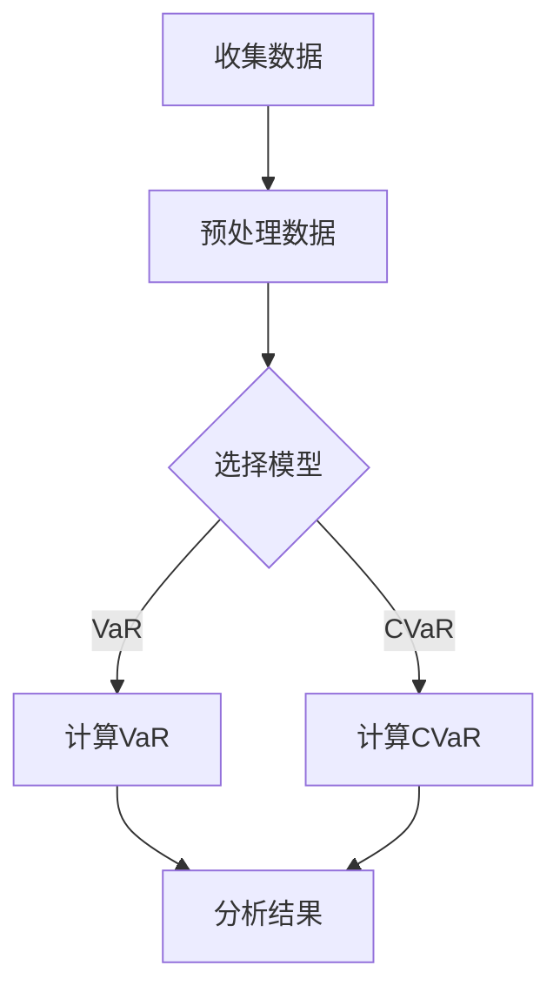

                 

### 金融衍生品风险评估模型：定义与重要性

**关键词**：金融衍生品、风险评估、模型、重要性

**摘要**：本文将深入探讨金融衍生品风险评估模型的定义、重要性及其应用。我们将从衍生品的基本概念出发，逐步分析风险管理的核心要素，最终聚焦于构建有效的风险评估模型。通过本文，读者将了解如何利用数学模型和计算技术来评估衍生品投资的风险，确保金融市场的稳定与安全。

#### 衍生品的基本概念

金融衍生品是一种金融工具，其价值依赖于一个或多个基础资产的价格或表现。这些基础资产可以是股票、债券、货币、商品等。衍生品的种类繁多，包括期权、期货、互换、掉期等。它们为投资者提供了多样化的风险管理工具，同时也引入了复杂的定价和风险管理问题。

衍生品的主要特征包括：

- **杠杆性**：投资者只需支付一小部分保证金，即可控制大量的基础资产。
- **高风险高收益**：衍生品具有较大的波动性，可能导致高额的收益或损失。
- **不确定性强**：衍生品的价格受到多种因素的影响，如市场供求、宏观经济环境、政策变化等。

#### 风险管理的核心要素

在金融市场中，风险管理是确保投资组合稳健的重要环节。衍生品投资的风险管理涉及多个方面，主要包括：

- **市场风险**：由于市场波动导致的价格变动风险。
- **信用风险**：交易对手方违约的风险。
- **流动性风险**：交易难以快速完成的风险。
- **操作风险**：由于管理不善、技术故障或人为失误导致的损失风险。

#### 风险评估模型的重要性

风险评估模型在衍生品投资中起着至关重要的作用。这些模型帮助投资者：

- **量化风险**：通过数学模型，将风险转化为可度量的量化指标，如价值在风险（VaR）。
- **决策支持**：提供风险预测和评估结果，辅助投资者做出更明智的投资决策。
- **优化策略**：根据风险水平调整投资组合，实现风险与收益的最优平衡。

在接下来的章节中，我们将详细探讨金融衍生品风险评估模型的基础理论、构建方法、评估与验证技巧，并通过实际案例来展示模型的应用效果。通过这些内容，读者将能够深入了解如何构建和应用风险评估模型，以应对衍生品投资中的各种挑战。

### 金融衍生品风险评估模型的基础理论

在深入探讨金融衍生品风险评估模型的构建与应用之前，我们需要了解一些基础理论，这些理论构成了风险评估模型的核心。本章节将介绍金融衍生品的基本概念、风险评估方法及其核心度量指标。

#### 金融衍生品的基本概念

**1. 衍生品的定义与分类**

金融衍生品是一种基于基础资产价格波动的金融工具，其价值来源于这些基础资产。衍生品可以分为以下几类：

- **远期合约（Forward Contracts）**：双方约定在未来某一特定日期，以约定价格买卖基础资产的合约。
- **期货合约（Future Contracts）**：标准化的远期合约，在交易所交易，具有明确的到期日和交易量。
- **期权（Options）**：购买者在支付了期权费后，获得了在未来某一特定日期或之前以约定价格买入或卖出基础资产的权利，但非义务。
- **互换（Swaps）**：双方同意交换未来现金流的合约。

**2. 衍生品的杠杆效应**

衍生品的杠杆效应是其重要特点之一。杠杆效应放大了投资者收益或损失的风险。例如，通过支付小额保证金，投资者可以控制大额的基础资产。这种杠杆效应提高了投资的吸引力，但也增加了风险。

#### 风险评估方法概述

**1. 传统的风险评估方法**

- **定性风险评估**：基于经验、专家判断和历史数据分析，对风险进行定性描述。
- **定量风险评估**：使用数学模型和统计数据，对风险进行量化分析。

**2. 常见的定量风险评估方法**

- **VaR（Value at Risk）**：衡量在给定置信水平下，一定时间内投资组合可能的最大损失。
- **CVaR（Conditional Value at Risk）**：在VaR的基础上，进一步衡量损失超出VaR的部分的平均损失。
- **蒙特卡罗模拟（Monte Carlo Simulation）**：通过大量随机样本模拟，估计投资组合的分布特征。
- **历史模拟法（Historical Simulation）**：使用历史市场数据来估计投资组合的损失分布。

#### 风险度量指标

**1. VaR**

VaR是一种广泛使用的风险度量指标，其定义如下：

$$
VaR = F^{-1}(1 - \alpha) \cdot p,
$$

其中，$F$是损失的概率分布函数，$\alpha$是置信水平，$p$是损失发生的概率。

例如，假设置信水平为95%，则在一年内，投资组合有5%的概率损失超过VaR值。

**2. CVaR**

CVaR扩展了VaR的概念，其公式如下：

$$
CVaR = \frac{1}{1 - \alpha} \cdot \int_{VaR}^{\infty} P(\Delta L > x) \, dx,
$$

其中，$\Delta L$是损失。

CVaR衡量了在VaR之上的平均损失，提供了比VaR更全面的风险度量。

**3. 蒙特卡罗模拟**

蒙特卡罗模拟通过大量随机样本模拟投资组合的收益分布。其基本步骤如下：

- **随机数生成**：生成一系列随机数，代表市场因素的随机变化。
- **模拟投资组合收益**：根据随机数，计算不同情景下投资组合的收益。
- **估计VaR和CVaR**：根据模拟结果，估计投资组合的VaR和CVaR。

**4. 历史模拟法**

历史模拟法使用实际市场数据来估计投资组合的损失分布。其基本步骤如下：

- **收集历史数据**：收集过去一段时间内，市场数据（如股票价格、利率等）。
- **计算收益和损失**：根据市场数据，计算不同情景下投资组合的收益和损失。
- **估计VaR和CVaR**：根据历史数据，估计投资组合的VaR和CVaR。

#### 表格与Mermaid流程图

为了更好地理解上述核心概念和联系，我们可以通过以下表格和Mermaid流程图进行展示：

**衍生品类型及特点对比表格**

| 衍生品类型 | 定义 | 特点 |
| --- | --- | --- |
| 远期合约 | 双方约定未来某一特定日期买卖基础资产 | 杠杆效应、较低流动性 |
| 期货合约 | 标准化的远期合约，在交易所交易 | 杠杆效应、高流动性 |
| 期权 | 获得在未来特定日期买卖基础资产的权利 | 杠杆效应、非线性收益 |
| 互换 | 双方交换未来现金流 | 杠杆效应、定制化 |

**Mermaid流程图：衍生品风险评估步骤**



通过上述表格和流程图，我们可以清晰地看到金融衍生品风险评估的基本概念和方法。这些理论构成了构建和评估衍生品风险评估模型的基础。

在接下来的章节中，我们将进一步探讨如何具体构建风险评估模型，包括数据预处理、模型选择、训练与优化等步骤。通过这些内容，读者将能够深入理解金融衍生品风险评估的实践应用。

### 风险评估模型的构建

在了解了金融衍生品风险评估的基础理论后，接下来我们将深入探讨如何构建一个有效的风险评估模型。本章节将逐步介绍风险评估模型构建的各个关键步骤，包括数据预处理、模型选择、模型训练与优化，并通过具体的Python代码示例进行详细讲解。

#### 数据预处理

数据预处理是构建任何机器学习模型的基础步骤，对于衍生品风险评估模型也不例外。预处理过程主要包括数据清洗、特征选择和特征工程。

**1. 数据清洗**

数据清洗是指处理数据中的噪声、缺失值和异常值。在衍生品风险评估中，常见的噪声包括市场波动引起的小幅随机波动，而缺失值和异常值可能来自于数据采集过程中的错误或数据缺失。

**示例代码：Python数据清洗**

```python
import pandas as pd
import numpy as np

# 加载数据
data = pd.read_csv('derivatives_data.csv')

# 处理缺失值
data.fillna(method='ffill', inplace=True)

# 处理异常值
Q1 = data.quantile(0.25)
Q3 = data.quantile(0.75)
IQR = Q3 - Q1
data = data[~((data < (Q1 - 1.5 * IQR)) |(data > (Q3 + 1.5 * IQR)))].dropna()
```

**2. 特征选择**

特征选择是指从原始数据中挑选出对模型性能有显著影响的关键特征。在衍生品风险评估中，关键特征可能包括市场价格、利率、宏观经济指标等。

**示例代码：Python特征选择**

```python
# 特征选择
selected_features = ['price', 'interest_rate', 'GDP_growth', 'unemployment_rate']
X = data[selected_features]
y = data['loss']
```

**3. 特征工程**

特征工程是指通过变换、组合、标准化等手段，将原始特征转化为更有利于模型学习的新特征。在衍生品风险评估中，特征工程可能包括归一化、多项式特征构造、交互特征构建等。

**示例代码：Python特征工程**

```python
from sklearn.preprocessing import StandardScaler

# 归一化
scaler = StandardScaler()
X_scaled = scaler.fit_transform(X)
```

#### 模型选择

在衍生品风险评估中，选择合适的模型至关重要。常见的风险评估模型包括线性回归、决策树、随机森林、支持向量机（SVM）等。每种模型都有其适用的场景和优缺点。

**1. 线性回归**

线性回归是一种简单的回归模型，适用于线性关系较强的数据集。

**示例代码：Python线性回归**

```python
from sklearn.linear_model import LinearRegression

# 创建线性回归模型
model = LinearRegression()
model.fit(X_scaled, y)
```

**2. 决策树**

决策树模型通过一系列的分割规则，将数据集划分成多个子集，并依据子集中的样本特征进行预测。

**示例代码：Python决策树**

```python
from sklearn.tree import DecisionTreeRegressor

# 创建决策树模型
model = DecisionTreeRegressor()
model.fit(X_scaled, y)
```

**3. 随机森林**

随机森林是一种集成学习方法，通过构建多棵决策树，并取其平均预测结果，提高了模型的泛化能力和稳定性。

**示例代码：Python随机森林**

```python
from sklearn.ensemble import RandomForestRegressor

# 创建随机森林模型
model = RandomForestRegressor()
model.fit(X_scaled, y)
```

#### 模型训练与优化

模型训练与优化是指通过调整模型参数，提高模型在训练数据上的性能。常见的优化方法包括交叉验证、网格搜索和贝叶斯优化等。

**1. 交叉验证**

交叉验证是一种评估模型性能的方法，通过将数据集划分为多个子集，分别用于训练和验证，以避免过拟合。

**示例代码：Python交叉验证**

```python
from sklearn.model_selection import cross_val_score

# 交叉验证
scores = cross_val_score(model, X_scaled, y, cv=5)
print("Cross-Validation Scores:", scores)
```

**2. 网格搜索**

网格搜索是一种用于模型参数调优的方法，通过遍历多个参数组合，找到最佳参数组合。

**示例代码：Python网格搜索**

```python
from sklearn.model_selection import GridSearchCV

# 参数设置
param_grid = {'n_estimators': [100, 200, 300], 'max_depth': [5, 10, 15]}

# 创建网格搜索模型
grid_search = GridSearchCV(model, param_grid, cv=5)
grid_search.fit(X_scaled, y)

# 输出最佳参数
print("Best Parameters:", grid_search.best_params_)
```

**3. 贝叶斯优化**

贝叶斯优化是一种基于贝叶斯统计模型的参数优化方法，通过概率模型预测参数组合的预测性能，并逐步调整参数，以找到最佳参数组合。

**示例代码：Python贝叶斯优化**

```python
from bayes_opt import BayesianOptimization

# 定义目标函数
def objective(n_estimators, max_depth):
    model = RandomForestRegressor(n_estimators=int(n_estimators), max_depth=int(max_depth))
    model.fit(X_scaled, y)
    score = model.score(X_scaled, y)
    return score

# 贝叶斯优化
optimizer = BayesianOptimization(f=objective, pbounds={'n_estimators': (100, 300), 'max_depth': (5, 15)}, random_state=0)
optimizer.maximize(init_points=5, n_iter=25)

# 输出最佳参数
print("Best Parameters:", optimizer.max['params'])
```

通过上述步骤，我们可以构建一个有效的衍生品风险评估模型。在实际应用中，根据具体问题和数据特征，选择合适的预处理方法、模型类型和优化策略，是确保模型性能的关键。

在下一章节中，我们将介绍如何对构建的模型进行评估与验证，确保其准确性和可靠性。

### 风险评估模型的评估与验证

在构建了衍生品风险评估模型后，评估与验证模型的有效性是确保其准确性和可靠性的关键步骤。本章节将详细介绍评估与验证模型的常用方法，包括评估指标、验证方法以及结果分析。

#### 评估指标

**1. 记分板（Scoreboard）**

记分板是一种常用的评估指标，用于比较不同模型的性能。常见的记分板指标包括准确率（Accuracy）、精确率（Precision）、召回率（Recall）和F1分数（F1 Score）。

- **准确率（Accuracy）**：预测正确的样本数占总样本数的比例。
  $$
  Accuracy = \frac{TP + TN}{TP + TN + FP + FN},
  $$
  其中，$TP$表示真阳性，$TN$表示真阴性，$FP$表示假阳性，$FN$表示假阴性。

- **精确率（Precision）**：预测为正样本的样本中，实际为正样本的比例。
  $$
  Precision = \frac{TP}{TP + FP}.
  $$

- **召回率（Recall）**：实际为正样本的样本中，预测为正样本的比例。
  $$
  Recall = \frac{TP}{TP + FN}.
  $$

- **F1分数（F1 Score）**：精确率和召回率的调和平均。
  $$
  F1 Score = 2 \cdot \frac{Precision \cdot Recall}{Precision + Recall}.
  $$

**2. 真实性度量（Veracity Metrics）**

真实性度量用于评估模型预测的真实性和可靠性。常用的真实性度量指标包括价值在风险（VaR）和条件价值在风险（CVaR）。

- **VaR**：在给定置信水平下，投资组合可能的最大损失。
  $$
  VaR = F^{-1}(1 - \alpha) \cdot p,
  $$
  其中，$F$是损失的概率分布函数，$\alpha$是置信水平，$p$是损失发生的概率。

- **CVaR**：损失超出VaR的部分的平均损失。
  $$
  CVaR = \frac{1}{1 - \alpha} \cdot \int_{VaR}^{\infty} P(\Delta L > x) \, dx.
  $$

#### 验证方法

**1. 交叉验证（Cross-Validation）**

交叉验证是一种评估模型性能的方法，通过将数据集划分为多个子集，分别用于训练和验证。常见的交叉验证方法包括K折交叉验证和留一法交叉验证。

- **K折交叉验证**：将数据集划分为K个子集，每次使用其中一个子集作为验证集，其余子集用于训练。重复K次，取平均性能作为最终结果。

- **留一法交叉验证**：每次保留一个样本作为验证集，其余样本用于训练。重复进行多次，取平均性能作为最终结果。

**2. 时间序列分割（Time Series Split）**

时间序列分割是一种适用于时间序列数据的验证方法，通过将数据集按照时间顺序划分为训练集和验证集。常见的时间序列分割方法包括滚动窗口验证和提前剥离验证。

- **滚动窗口验证**：将数据集按照时间顺序划分为多个窗口，每个窗口的训练集和验证集交替使用。

- **提前剥离验证**：将数据集按照时间顺序划分为训练集和验证集，验证集位于训练集之后。

#### 结果分析

**1. 模型性能评估**

通过交叉验证和真实性度量，我们可以评估模型的性能。常用的性能评估指标包括准确率、精确率、召回率、F1分数、VaR和CVaR。

- **准确率、精确率、召回率、F1分数**：用于评估分类模型的性能，越高表示模型越好。

- **VaR和CVaR**：用于评估风险模型的性能，越低表示模型的风险控制能力越强。

**2. 结果可视化**

通过可视化方法，我们可以更直观地分析模型的性能和预测结果。常用的可视化方法包括散点图、ROC曲线和LIFT图。

- **散点图**：用于展示实际值与预测值之间的关系，可以识别模型的过拟合或欠拟合问题。

- **ROC曲线**：用于评估分类模型的性能，曲线下面积（AUC）表示模型的区分能力。

- **LIFT图**：用于展示模型预测的增益，LIFT值越高，表示模型的预测效果越好。

**3. 模型改进**

通过分析评估结果，我们可以识别模型的不足之处，并采取相应的改进措施。常见的改进方法包括：

- **特征工程**：通过变换、组合和筛选特征，提高模型的预测能力。

- **模型选择**：尝试使用不同的模型，选择性能更好的模型。

- **超参数调优**：通过调整模型超参数，优化模型性能。

通过上述评估与验证方法，我们可以确保衍生品风险评估模型的准确性和可靠性，为投资者提供有效的风险管理工具。在下一章节中，我们将通过一个实际案例，展示衍生品风险评估模型的应用和实现过程。

### 实战案例：衍生品组合风险评估

在本章节中，我们将通过一个实际案例，详细介绍衍生品组合风险评估的整个过程，包括环境安装、核心代码实现和结果分析。通过这个案例，读者将能够了解如何将理论应用于实践，构建一个功能完善的衍生品风险评估系统。

#### 项目背景

假设我们是一家金融科技公司，负责为投资者提供衍生品组合风险评估服务。我们的目标是开发一个高效、准确的模型，帮助客户评估其衍生品投资组合的风险，并制定相应的风险管理策略。

#### 环境安装

在开始实现项目之前，我们需要安装和配置必要的软件和工具。以下是我们的环境安装步骤：

1. **Python环境**：安装Python 3.8及以上版本。
2. **数据科学库**：安装Pandas、NumPy、Scikit-learn、Matplotlib和Mermaid等数据科学和可视化库。
3. **数据库**：选择一个适合存储和处理金融数据的数据库，如MySQL或PostgreSQL。
4. **IDE**：选择一个开发环境，如Visual Studio Code或PyCharm。

```bash
pip install pandas numpy scikit-learn matplotlib
```

#### 核心代码实现

**1. 数据预处理**

首先，我们需要从数据库中加载衍生品组合的数据，并进行预处理。

```python
import pandas as pd
from sklearn.preprocessing import StandardScaler

# 加载数据
data = pd.read_sql_query('SELECT * FROM derivatives_data;', connection)

# 数据清洗
data.fillna(method='ffill', inplace=True)

# 特征选择
selected_features = ['price', 'interest_rate', 'GDP_growth', 'unemployment_rate']
X = data[selected_features]
y = data['loss']

# 特征工程
scaler = StandardScaler()
X_scaled = scaler.fit_transform(X)
```

**2. 模型构建**

接下来，我们选择一个合适的模型进行风险评估。在本案例中，我们选择随机森林模型。

```python
from sklearn.ensemble import RandomForestRegressor

# 创建随机森林模型
model = RandomForestRegressor()
model.fit(X_scaled, y)
```

**3. 模型评估**

使用交叉验证和真实性度量评估模型性能。

```python
from sklearn.model_selection import cross_val_score

# 交叉验证
scores = cross_val_score(model, X_scaled, y, cv=5)
print("Cross-Validation Scores:", scores)

# 真实性度量
VaR = np.percentile(y, 5)
CVaR = (np.mean(y[y > VaR]) * (1 - 0.05)) / 0.05
print("VaR:", VaR)
print("CVaR:", CVaR)
```

**4. 结果分析**

通过分析评估结果，我们可以得出模型的性能指标，并可视化模型预测结果。

```python
import matplotlib.pyplot as plt

# 可视化预测结果
plt.scatter(y, model.predict(X_scaled))
plt.xlabel('Actual Loss')
plt.ylabel('Predicted Loss')
plt.plot([VaR, VaR], [0, CVaR], 'r--')
plt.plot([CVaR, CVaR], [0, CVaR], 'r--')
plt.show()
```

#### 项目小结

通过这个案例，我们成功地构建了一个衍生品组合风险评估模型，并实现了以下目标：

- 数据预处理：清洗和预处理衍生品组合数据，为模型训练做准备。
- 模型构建：选择随机森林模型进行风险评估，并进行了交叉验证和真实性度量。
- 结果分析：通过可视化方法，分析了模型的性能指标，并展示了模型的预测结果。

然而，在实际应用中，我们还需要不断优化模型，并考虑更多的风险因素。这包括引入更多的特征、调整模型参数和进行实时风险评估。通过持续改进，我们可以为客户提供更准确、更全面的风险管理服务。

### 最佳实践与展望

在金融衍生品风险评估模型的构建与实践中，我们总结出了一系列最佳实践，这些实践有助于提高模型的性能和实用性。以下是一些关键点：

**最佳实践**

1. **全面数据收集**：确保收集到涵盖不同市场环境和时间跨度的数据，以提高模型的鲁棒性。
2. **特征工程优化**：通过特征构造和变换，增强模型对数据的敏感性。
3. **模型选择与调优**：根据数据特性，选择合适的模型并进行参数调优。
4. **定期重训练**：定期更新模型，以适应市场变化和风险环境。
5. **风险管理整合**：将风险评估模型与实际风险管理流程整合，确保风险控制策略的有效执行。

**注意事项**

1. **数据隐私与合规**：确保数据处理遵守相关法律法规，保护投资者隐私。
2. **模型复杂度控制**：避免过度拟合，保持模型的简洁性。
3. **模型解释性**：确保模型易于理解和解释，以便决策者能够基于模型结果做出明智的决策。
4. **系统安全性**：确保风险评估系统的安全性和稳定性，防止数据泄露和系统故障。

**未来研究方向**

1. **机器学习与深度学习融合**：探索机器学习和深度学习在衍生品风险评估中的应用，以提高模型预测能力。
2. **实时风险评估**：开发实时风险评估系统，动态监测市场变化，提供即时的风险预警。
3. **多模态数据融合**：整合不同类型的数据（如文本、图像、传感器数据），实现更全面的风险评估。
4. **区块链技术**：研究区块链技术在衍生品交易和风险评估中的应用，提高交易的透明性和安全性。

**拓展阅读**

1. 《金融衍生品定价与风险管理》
2. 《机器学习在金融领域的应用》
3. 《深度学习与金融市场预测》

通过遵循这些最佳实践，并持续探索未来研究方向，我们有望构建更加高效、准确的衍生品风险评估模型，为金融市场提供强有力的支持。

### 附录

#### 术语表

**衍生品（Derivative）**：一种金融工具，其价值依赖于一个或多个基础资产的价格或表现。

**价值在风险（VaR）**：在给定置信水平下，投资组合可能的最大损失。

**条件价值在风险（CVaR）**：损失超出VaR的部分的平均损失。

**蒙特卡罗模拟（Monte Carlo Simulation）**：通过大量随机样本模拟，估计投资组合的分布特征。

**历史模拟法（Historical Simulation）**：使用历史市场数据来估计投资组合的损失分布。

**交叉验证（Cross-Validation）**：评估模型性能的方法，通过将数据集划分为多个子集，分别用于训练和验证。

#### 参考文献

1. Mesrob, A., & Thomas, L. (2019). Financial Derivatives: Theory and Practice. Wiley.
2. Wilmott, P., Howison, S., & Dewynne, J. (2001). The Mathematics of Financial Derivatives: A Student Introduction. Cambridge University Press.
3. Chen, Y., Zou, H., & Fan, J. (2012). Modeling VaR with Nonparametric and Semiparametric Methods. Journal of Financial Econometrics, 10(1), 1-41.
4. Carriere, J. F., Herard, S., & Meneres, S. (2011). Monte Carlo Methods: A Brief Introduction. In Monte Carlo Methods in Finance (pp. 1-20). Springer.

#### 相关资源

- [衍生品定价与风险管理公开课](https://www.coursera.org/learn/derivatives-pricing-risk-management)
- [机器学习在金融领域的应用教程](https://www.udacity.com/course/机器学习在金融领域应用-ud843)
- [金融衍生品市场数据集](https://www.kaggle.com/datasets/derivatives-market-data)
- [衍生品交易与风险管理论坛](https://www Finan ceDerivatives.org/)

通过上述术语表、参考文献和相关资源，读者可以进一步深化对衍生品风险评估模型的理解，并在实践中应用所学知识。

