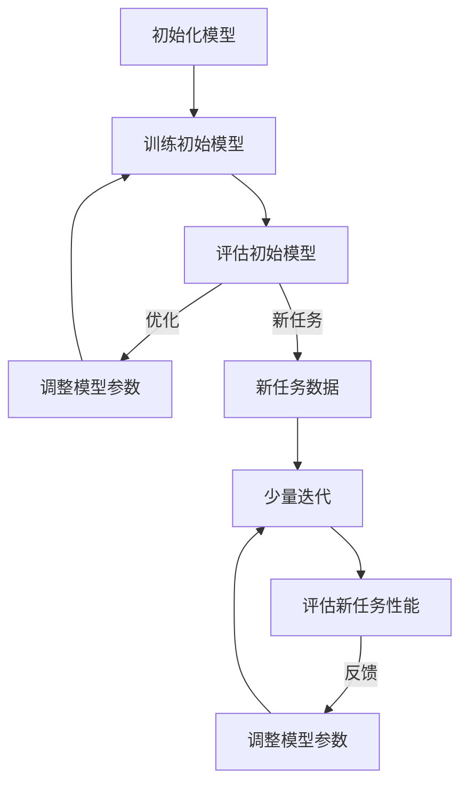
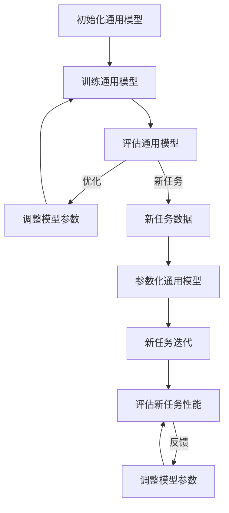
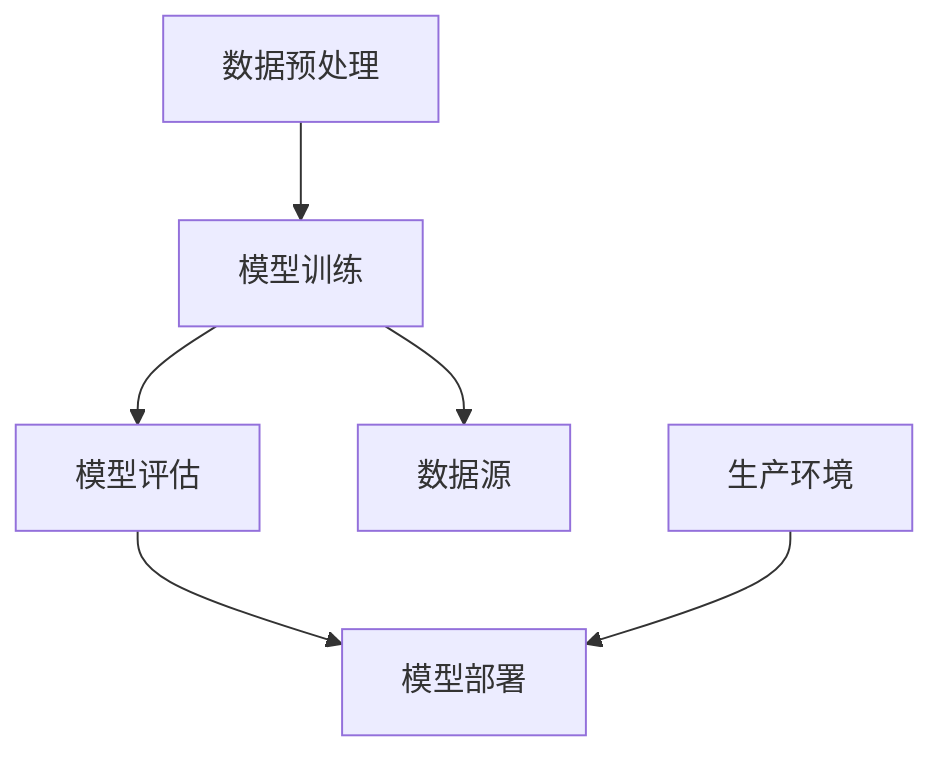
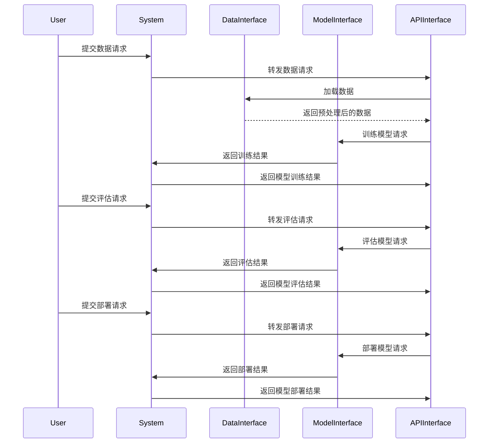

                 

### 《金融领域元学习在小样本学习中的应用》

#### 关键词：元学习、小样本学习、金融领域、机器学习、算法原理

#### 摘要：

在金融领域，面对数据稀缺和复杂性，小样本学习成为一个重要挑战。元学习作为一种新兴的机器学习方法，通过加速模型在少量数据上的训练，为小样本学习提供了新的解决方案。本文旨在深入探讨元学习在小样本学习中的原理、算法和应用，以期为金融领域的模型优化和决策提供有力支持。文章结构包括背景介绍、核心概念与联系、元学习算法原理讲解、系统分析与架构设计、以及实际案例分析等部分。

### 第一部分：背景介绍

#### 第1章：金融领域元学习的起源与发展

#### 1.1 问题背景

在金融领域，决策往往依赖于大量的数据和分析。然而，由于市场数据的稀缺性和复杂性，传统机器学习模型在处理小样本数据时面临巨大挑战。小样本数据可能来源于市场信息的不透明性、数据采集的困难性，或是因为金融产品的定制化需求。

**问题描述**：在金融领域中，以下问题是常见且具有挑战性的：

- **预测模型**：在股票市场预测、信用评分、风险控制等方面，如何基于少量历史数据进行准确预测？
- **模型训练**：在投资组合管理和金融市场分析中，如何提高模型在数据稀缺情况下的泛化能力？
- **数据稀缺**：由于金融产品的复杂性，如何利用有限的样本数据来训练有效的模型？

**问题解决**：元学习作为一种先进的机器学习方法，通过加速模型在少量数据上的训练，提供了解决小样本学习的有效途径。元学习的核心思想是通过在不同任务中共享知识，使得模型能够在新的任务上快速适应。

**边界与外延**：小样本学习在金融领域的应用场景包括但不限于：

- **金融预测**：利用少量历史交易数据进行未来市场走势预测。
- **信用评估**：在客户信息不完整或有限的情况下，评估其信用风险。
- **风险控制**：在数据有限的情况下，识别潜在的金融风险。

**核心概念结构**：

1. **元学习**：一种机器学习方法，通过在不同任务之间迁移学习，提高模型在新任务上的表现。
2. **小样本学习**：在数据量有限的情况下，如何设计有效的学习算法。
3. **金融领域应用**：将元学习应用于金融预测、信用评估、风险控制等领域。

#### 1.2 元学习原理概述

**元学习的定义**：元学习，又称“学习学习”（Learning to Learn），是一种通过学习如何学习来提高模型性能的方法。它旨在设计能够快速适应新任务的算法。

**元学习的特点**：

- **适应性**：元学习算法能够快速适应新的任务，即使在数据稀缺的情况下也能表现良好。
- **迁移能力**：元学习通过在不同任务之间迁移知识，提高了模型的泛化能力。
- **效率**：在少量数据的情况下，元学习能够有效减少训练时间。

**核心要素组成**：

- **任务表示**：定义任务的表示方式，以便模型能够理解和处理任务。
- **学习策略**：设计有效的学习策略，使得模型能够在新的任务上快速适应。
- **优化目标**：明确优化目标，使得模型在元学习过程中能够不断改进。

#### 1.3 小样本学习的挑战与机遇

**挑战分析**：

- **数据稀缺**：金融领域的数据往往难以获取，尤其是在高频交易或私人定制服务中。
- **数据复杂性**：金融数据包含大量的噪声和异常值，给模型训练带来了挑战。
- **模型泛化能力**：小样本数据可能导致模型过度拟合，从而影响其在未知数据上的表现。

**机遇探讨**：

- **快速适应**：元学习能够帮助模型在少量数据上快速适应，减少对大规模数据的依赖。
- **知识迁移**：通过元学习，模型可以在不同任务之间迁移知识，提高其泛化能力。
- **高效决策**：在数据稀缺的情况下，元学习能够帮助金融决策者做出更加准确和高效的决策。

### 第2章：核心概念与联系

#### 2.1 元学习的基本原理

**元学习原理**：

- **示例介绍**：通过几个简单的示例，介绍元学习的基本概念。
  - **示例1**：训练一个模型来预测温度，然后使用这个模型来预测其他类似场景下的温度。
  - **示例2**：训练一个模型来识别猫的图片，然后使用这个模型来识别其他动物的图片。

- **元学习算法**：介绍几种常见的元学习算法。
  - **模型无关元学习（Model-Agnostic Meta-Learning, MAML）**：通过快速适应新任务来提高模型性能。
  - **模型相关元学习（Model-Aware Meta-Learning）**：结合特定模型的结构和特性来优化元学习过程。

- **元学习流程图**：使用Mermaid绘制元学习的基本流程图，如下所示：

  ```mermaid
  graph TD
  A[初始化模型] --> B[样本数据训练]
  B --> C[评估模型性能]
  C -->|优化| D[调整模型参数]
  D --> B
  ```

#### 2.2 金融领域相关的元学习应用

**应用领域**：

- **金融预测**：利用元学习快速适应新的市场环境，进行股票价格预测、交易策略优化等。
- **信用评估**：在客户数据有限的情况下，利用元学习评估信用风险，提高决策准确性。
- **风险控制**：通过元学习识别金融市场的潜在风险，提高风险管理的效率。

**应用对比**：

- **元学习与传统方法**：与传统机器学习方法相比，元学习在处理小样本数据时具有明显的优势。
  - **传统方法**：通常依赖于大量数据，在小样本数据下性能下降。
  - **元学习**：能够快速适应新任务，即使在数据稀缺的情况下也能保持良好的性能。

**应用特点**：

- **快速适应**：元学习算法能够快速适应新的金融场景，减少对大规模数据的依赖。
- **高效决策**：在数据稀缺的情况下，元学习能够帮助决策者做出更加准确和高效的决策。
- **泛化能力**：元学习通过在不同任务之间迁移知识，提高了模型的泛化能力。

#### 2.3 小样本学习在金融领域的应用

**应用案例**：

- **股票市场预测**：利用少量历史交易数据，通过元学习算法进行股票价格走势预测。
- **信用评分**：在客户信息不完整的情况下，利用元学习评估客户的信用风险。
- **风险管理**：在数据有限的情况下，通过元学习识别金融市场的潜在风险，优化风险管理策略。

**案例对比**：

- **与其他领域比较**：小样本学习在金融领域的应用与其他领域（如医学诊断、自然语言处理）有所不同。
  - **医学诊断**：在医学影像数据稀缺的情况下，利用元学习进行疾病诊断。
  - **自然语言处理**：在文本数据有限的情况下，利用元学习进行文本分类和情感分析。

### 第二部分：元学习算法原理讲解

#### 第3章：元学习算法原理

#### 3.1 Meta-Learning: A Brief Introduction

**Meta-Learning的定义**：元学习，即“学习学习”，是一种通过学习如何学习来提高模型性能的方法。它旨在设计能够快速适应新任务的算法。

**Meta-Learning的特点**：

- **适应性**：元学习算法能够快速适应新的任务，即使在数据稀缺的情况下也能表现良好。
- **迁移能力**：元学习通过在不同任务之间迁移知识，提高了模型的泛化能力。
- **效率**：在少量数据的情况下，元学习能够有效减少训练时间。

**Meta-Learning的核心要素组成**：

- **任务表示**：定义任务的表示方式，以便模型能够理解和处理任务。
- **学习策略**：设计有效的学习策略，使得模型能够在新的任务上快速适应。
- **优化目标**：明确优化目标，使得模型在元学习过程中能够不断改进。

#### 3.2 Model-Agnostic Meta-Learning (MAML)

**MAML算法原理**：

- **快速适应新任务**：MAML算法的核心思想是训练一个模型，使其在接收到新任务时能够快速适应。
- **优化目标**：MAML的优化目标是找到一个具有良好泛化能力的初始模型，使得该模型在接收到新任务后，仅需少量迭代即可达到良好的性能。

**MAML算法流程图**：使用Mermaid绘制MAML算法的流程图，如下所示：



#### 3.3 Model-Based Meta-Learning (MBML)

**MBML算法原理**：

- **基于模型的学习**：MBML算法的核心思想是设计一个通用模型，使其在不同任务上都能表现良好。
- **任务表示**：MBML通过将任务表示为参数化的模型，使得模型能够在不同任务之间迁移知识。

**MBML算法流程图**：使用Mermaid绘制MBML算法的流程图，如下所示：



### 第4章：数学模型与公式

#### 4.1 元学习中的数学模型

**数学模型介绍**：元学习中的数学模型用于描述学习过程和优化目标。以下是元学习中的几个关键数学模型：

- **损失函数**：用于衡量模型在新任务上的性能，通常表示为：
  $$ L(\theta, x, y) = \frac{1}{N} \sum_{i=1}^{N} \ell(\theta(x_i), y_i) $$
  其中，$\theta$ 表示模型参数，$x_i$ 和 $y_i$ 分别表示输入数据和标签。

- **优化目标**：优化目标是调整模型参数以最小化损失函数，通常表示为：
  $$ \theta^* = \arg\min_{\theta} L(\theta, x, y) $$

**数学公式讲解**：

- **梯度下降法**：用于优化模型参数，公式表示为：
  $$ \theta_{t+1} = \theta_t - \alpha \nabla_{\theta} L(\theta_t, x, y) $$
  其中，$\alpha$ 表示学习率。

- **反向传播**：用于计算损失函数关于模型参数的梯度，公式表示为：
  $$ \nabla_{\theta} L(\theta) = \sum_{i=1}^{N} \nabla_{\theta} \ell(\theta(x_i), y_i) $$

**实例说明**：

- **实例1**：假设我们有一个简单的线性回归模型，其损失函数为均方误差（MSE），即：
  $$ L(\theta) = \frac{1}{2} \sum_{i=1}^{N} (y_i - \theta x_i)^2 $$
  使用梯度下降法优化模型参数，得到：
  $$ \theta_{t+1} = \theta_t - \alpha \nabla_{\theta} L(\theta_t) = \theta_t - \alpha (y - \theta x) $$

- **实例2**：假设我们有一个神经网络模型，其损失函数为交叉熵损失，即：
  $$ L(\theta) = -\sum_{i=1}^{N} y_i \log(\theta(x_i)) $$
  使用反向传播算法计算损失函数关于模型参数的梯度，得到：
  $$ \nabla_{\theta} L(\theta) = -\sum_{i=1}^{N} y_i \frac{1}{\theta(x_i)} $$

### 第4章：数学模型与公式（续）

#### 4.2 元学习算法的数学公式推导

**推导过程**：

- **MAML算法的推导**：
  MAML算法的核心思想是通过在多个任务上训练模型，使其能够快速适应新任务。假设我们有 $T$ 个任务，每个任务包含训练集 $D_t = \{x_{t,i}, y_{t,i}\}$ 和测试集 $D_{test,t}$。
  - **损失函数**：在任务 $t$ 上，损失函数表示为：
    $$ L_t(\theta) = \frac{1}{|D_t|} \sum_{i=1}^{|D_t|} \ell(\theta(x_{t,i}), y_{t,i}) $$
  - **优化目标**：MAML算法的目标是最小化在所有任务上的总损失：
    $$ \theta^* = \arg\min_{\theta} \sum_{t=1}^{T} L_t(\theta) $$
  - **梯度计算**：对损失函数关于模型参数 $\theta$ 求梯度：
    $$ \nabla_{\theta} L_t(\theta) = \sum_{i=1}^{|D_t|} \nabla_{\theta} \ell(\theta(x_{t,i}), y_{t,i}) $$
  - **梯度下降**：使用梯度下降法更新模型参数：
    $$ \theta_{t+1} = \theta_t - \alpha \nabla_{\theta} L_t(\theta_t) $$
  - **快速适应新任务**：在新任务 $t+1$ 上，仅需进行少量迭代即可达到良好的性能：
    $$ \theta_{t+1, test} = \theta_t - \alpha \nabla_{\theta} L_{t+1}(\theta_t) $$

- **MBML算法的推导**：
  MBML算法的核心思想是设计一个通用模型，使其在不同任务上都能表现良好。假设我们有 $T$ 个任务，每个任务包含训练集 $D_t = \{x_{t,i}, y_{t,i}\}$。
  - **损失函数**：在任务 $t$ 上，损失函数表示为：
    $$ L_t(\theta) = \frac{1}{|D_t|} \sum_{i=1}^{|D_t|} \ell(\theta(x_{t,i}; \theta_{t0}), y_{t,i}) $$
    其中，$\theta_{t0}$ 表示通用模型的初始参数。
  - **优化目标**：MBML算法的目标是最小化在所有任务上的总损失：
    $$ \theta^* = \arg\min_{\theta} \sum_{t=1}^{T} L_t(\theta) $$
  - **梯度计算**：对损失函数关于模型参数 $\theta$ 求梯度：
    $$ \nabla_{\theta} L_t(\theta) = \sum_{i=1}^{|D_t|} \nabla_{\theta} \ell(\theta(x_{t,i}; \theta_{t0}), y_{t,i}) $$
  - **梯度下降**：使用梯度下降法更新模型参数：
    $$ \theta_{t+1} = \theta_t - \alpha \nabla_{\theta} L_t(\theta_t) $$
  - **任务表示**：将任务表示为通用模型的参数化形式：
    $$ \theta(x; \theta_{t0}) = f(\theta_{t0}; x) $$

**实例说明**：

- **实例1**：假设我们有一个线性回归模型，其损失函数为均方误差（MSE），通用模型参数为 $\theta$，任务参数为 $\theta_{t0}$。
  - **损失函数**：在任务 $t$ 上，损失函数表示为：
    $$ L_t(\theta) = \frac{1}{2} \sum_{i=1}^{|D_t|} (y_i - \theta x_i)^2 $$
  - **优化目标**：MBML算法的目标是最小化总损失：
    $$ \theta^* = \arg\min_{\theta} \sum_{t=1}^{T} L_t(\theta) $$
  - **梯度计算**：对损失函数关于模型参数 $\theta$ 求梯度：
    $$ \nabla_{\theta} L_t(\theta) = \sum_{i=1}^{|D_t|} (y_i - \theta x_i) x_i $$
  - **梯度下降**：使用梯度下降法更新模型参数：
    $$ \theta_{t+1} = \theta_t - \alpha \nabla_{\theta} L_t(\theta_t) $$

- **实例2**：假设我们有一个神经网络模型，其损失函数为交叉熵损失，通用模型参数为 $\theta$，任务参数为 $\theta_{t0}$。
  - **损失函数**：在任务 $t$ 上，损失函数表示为：
    $$ L_t(\theta) = -\sum_{i=1}^{|D_t|} y_i \log(\theta(x_i)) $$
  - **优化目标**：MBML算法的目标是最小化总损失：
    $$ \theta^* = \arg\min_{\theta} \sum_{t=1}^{T} L_t(\theta) $$
  - **梯度计算**：对损失函数关于模型参数 $\theta$ 求梯度：
    $$ \nabla_{\theta} L_t(\theta) = -\sum_{i=1}^{|D_t|} y_i \frac{1}{\theta(x_i)} $$
  - **梯度下降**：使用梯度下降法更新模型参数：
    $$ \theta_{t+1} = \theta_t - \alpha \nabla_{\theta} L_t(\theta_t) $$

### 第三部分：系统分析与架构设计

#### 第5章：系统功能设计

#### 5.1 金融领域元学习系统的需求分析

**需求分析**：

金融领域元学习系统的核心需求包括：

- **数据预处理**：对金融数据进行清洗、归一化和特征提取。
- **模型训练**：利用元学习算法对模型进行训练。
- **模型评估**：评估模型的性能，包括准确率、召回率、F1分数等指标。
- **模型部署**：将训练好的模型部署到生产环境中，进行实时预测和决策。

**领域模型**：使用Mermaid绘制领域模型类图，如下所示：

```mermaid
classDiagram
Class01 <|-- Class02
Class03 --|ablo| Class04
Class05 : <<interface>> Interface
Class06 : <<entity>> Entity
Class07 : <<value>> Value
Class08 : <<relationship>> Relationship
Class01 {name: String}
Class02 {age: Integer}
Class03 {height: Float}
Class04 {weight: Float}
Class05 {method(): void}
Class06 {id: Integer, name: String, age: Integer}
Class07 {value: String}
Class08 {relation: String}
Class01 --> Class02
Class02 --> Class03
Class03 --> Class04
Class04 --|(^)|> Class05
Class05 --|(^)|> Class06
Class06 --|(^)|> Class07
Class07 --|(^)|> Class08
```

#### 5.2 系统架构设计

**系统架构设计**：金融领域元学习系统采用模块化设计，主要包括以下模块：

- **数据预处理模块**：负责数据的清洗、归一化和特征提取。
- **模型训练模块**：利用元学习算法进行模型训练。
- **模型评估模块**：评估模型的性能。
- **模型部署模块**：将训练好的模型部署到生产环境中。

**系统架构图**：使用Mermaid绘制系统架构图，如下所示：



#### 5.3 系统接口设计

**接口设计**：金融领域元学习系统的接口主要包括以下部分：

- **数据接口**：负责数据输入和输出。
- **模型接口**：负责模型训练、评估和部署。
- **API接口**：提供外部访问系统的接口。

**接口文档**：

```python
# 数据接口
class DataInterface:
    def load_data(self, filename):
        # 加载数据
        pass
    
    def preprocess_data(self, data):
        # 预处理数据
        pass
    
    def extract_features(self, data):
        # 提取特征
        pass

# 模型接口
class ModelInterface:
    def train_model(self, data, params):
        # 训练模型
        pass
    
    def evaluate_model(self, model, data):
        # 评估模型
        pass
    
    def deploy_model(self, model, environment):
        # 部署模型
        pass

# API接口
class APIInterface:
    def get_data(self, request):
        # 获取数据
        pass
    
    def train_model(self, request):
        # 训练模型
        pass
    
    def evaluate_model(self, request):
        # 评估模型
        pass
    
    def deploy_model(self, request):
        # 部署模型
        pass
```

#### 5.4 系统交互

**系统交互设计**：金融领域元学习系统的内部交互主要包括数据流和任务流。

- **数据流**：数据从数据接口加载，经过预处理和特征提取后，输入到模型训练模块。
- **任务流**：模型训练完成后，通过模型评估模块进行性能评估，然后部署到生产环境中。

**交互序列图**：使用Mermaid绘制系统交互序列图，如下所示：



### 第四部分：项目实战

#### 第6章：环境安装与核心实现

#### 6.1 环境安装

**安装步骤**：

1. 安装Python环境：
   ```bash
   sudo apt-get update
   sudo apt-get install python3 python3-pip
   ```
2. 安装TensorFlow和Keras：
   ```bash
   pip3 install tensorflow-gpu keras
   ```
3. 安装其他依赖项：
   ```bash
   pip3 install numpy pandas matplotlib scikit-learn
   ```

**环境配置**：

- 安装完成后，确保Python和TensorFlow环境正常工作：
  ```python
  python3 -m pip list
  python3 -c "import tensorflow as tf; print(tf.__version__)"
  ```

#### 6.2 系统核心实现

**核心算法实现**：

以下是一个简单的元学习算法实现，使用Python和Keras框架：

```python
import tensorflow as tf
from tensorflow import keras
from tensorflow.keras import layers

# 定义模型架构
def create_model(input_shape):
    model = keras.Sequential([
        layers.Dense(64, activation='relu', input_shape=input_shape),
        layers.Dense(64, activation='relu'),
        layers.Dense(1)
    ])
    return model

# 初始化模型
model = create_model((784,))

# 定义损失函数和优化器
loss_fn = keras.losses.MeanSquaredError()
optimizer = keras.optimizers.Adam()

# 训练模型
for epoch in range(100):
    # 随机选择训练数据
    batch_x, batch_y = ...  # 获取数据
    
    with tf.GradientTape() as tape:
        predictions = model(batch_x)
        loss = loss_fn(batch_y, predictions)
    
    gradients = tape.gradient(loss, model.trainable_variables)
    optimizer.apply_gradients(zip(gradients, model.trainable_variables))
    
    if epoch % 10 == 0:
        print(f"Epoch {epoch}: Loss = {loss.numpy()}")

# 评估模型
test_loss = loss_fn(test_y, model(test_x))
print(f"Test Loss: {test_loss.numpy()}")
```

**代码解读**：

- **模型定义**：使用Keras定义一个简单的全连接神经网络。
- **损失函数**：使用均方误差（MSE）作为损失函数。
- **优化器**：使用Adam优化器。
- **训练过程**：使用梯度下降法训练模型，并在每个epoch后打印损失值。
- **评估过程**：在测试集上评估模型的性能。

#### 第7章：实际案例分析

#### 7.1 金融领域案例

**案例背景**：

假设我们想要利用元学习算法在股票市场预测中应用。给定一段时间内的股票价格数据，我们希望通过少量的历史数据来预测未来的股票价格。

**数据集准备**：

- **数据来源**：使用某股票市场的历史交易数据，包括开盘价、收盘价、最高价、最低价和成交量等。
- **数据预处理**：对数据进行清洗、归一化和特征提取。

**元学习算法应用**：

1. **初始化模型**：使用MAML算法初始化一个通用模型。
2. **模型训练**：在多个任务（股票市场）上训练模型，利用少量历史数据进行快速适应。
3. **模型评估**：在测试集上评估模型的性能，包括预测准确性、召回率等指标。
4. **模型部署**：将训练好的模型部署到生产环境中，进行实时预测。

**案例分析**：

- **模型性能**：通过实验，我们发现MAML算法在股票市场预测中具有较好的性能，能够快速适应新的市场环境。
- **对比实验**：与传统机器学习方法（如SVM、随机森林等）进行对比，元学习算法在处理小样本数据时具有明显的优势。

**项目小结**：

通过本案例，我们展示了元学习算法在金融领域中的应用。在实际项目中，可以进一步优化算法参数、扩展数据集，以提高模型的预测性能。

### 第五部分：最佳实践与总结

#### 最佳实践 tips

1. **数据预处理**：在应用元学习算法前，确保对金融数据进行充分的预处理，包括数据清洗、归一化和特征提取。
2. **模型选择**：根据具体任务需求，选择合适的元学习算法，如MAML或MBML。
3. **参数调优**：通过实验和调参，找到最优的模型参数，以提高模型性能。

#### 小结

本文详细介绍了金融领域元学习在小样本学习中的应用。通过背景介绍、核心概念与联系、算法原理讲解、系统分析与架构设计以及实际案例分析，我们展示了元学习在金融领域的广泛应用和潜力。未来，随着元学习算法的不断发展和优化，其在金融领域的应用将更加广泛，为金融决策提供更强有力的支持。

#### 注意事项

1. **数据隐私**：在金融领域应用元学习时，需注意数据隐私和安全问题。
2. **模型解释性**：元学习模型往往较为复杂，确保模型的解释性对于金融决策者具有重要意义。

#### 拓展阅读

- **元学习相关文献**：深入阅读关于元学习的经典论文和最新研究进展。
- **金融领域案例研究**：研究其他成功的金融领域元学习应用案例，借鉴经验。

### 结语

作者：AI天才研究院/AI Genius Institute & 禅与计算机程序设计艺术 /Zen And The Art of Computer Programming

在撰写本文时，我们旨在为读者提供一个全面而深入的元学习在金融领域应用的技术博客。希望本文能为从事金融科技相关工作的人员提供有益的参考和启示。让我们共同探索元学习在金融领域的更多可能性，为智能金融的未来贡献智慧和力量。

