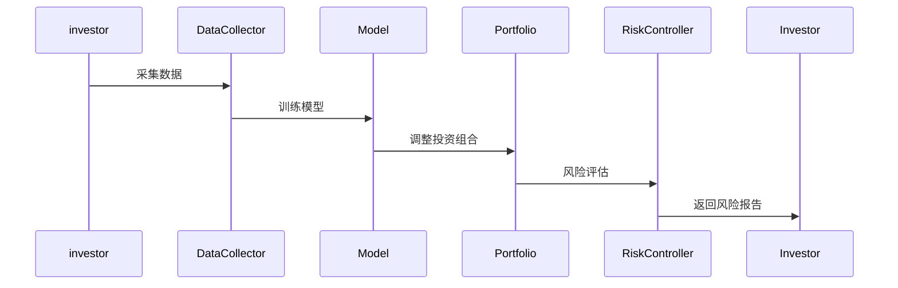
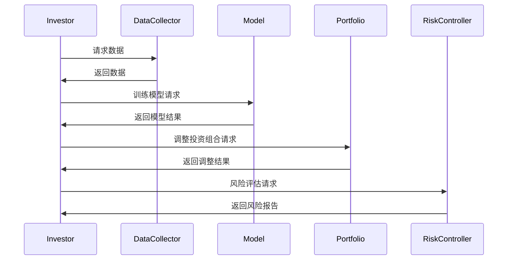

                 

# 金融领域元学习在投资组合快速调整中的应用

## 关键词

- 元学习
- 投资组合
- 快速调整
- 金融领域
- 风险管理

## 摘要

本文探讨了在金融领域中，如何利用元学习技术实现投资组合的快速调整。首先，我们对元学习进行了介绍，包括其定义、背景以及在金融领域中的应用。接着，我们分析了金融市场的现状和投资组合调整面临的挑战。随后，我们深入讲解了元学习算法在金融领域的应用，包括算法原理、数学模型以及Python代码实现。此外，我们介绍了数学模型和分析方法，并对系统设计和实施进行了详细阐述。最后，通过实际项目案例展示了元学习在投资组合快速调整中的应用效果，并提出了最佳实践建议。

## 目录

### 1. 引言

- **1.1 背景介绍**
- **1.2 元学习的定义和作用**
- **1.3 金融领域中的元学习**

### 2. 金融市场的现状和投资组合调整的挑战

- **2.1 金融市场的概述**
- **2.2 投资组合调整的挑战**

### 3. 元学习算法在金融领域的应用

- **3.1 算法概述和原理**
- **3.2 数学模型和公式**
- **3.3 Python代码实现**

### 4. 数学模型和分析方法

- **4.1 模型介绍**
- **4.2 详细解释和示例**

### 5. 系统设计和实施

- **5.1 系统概述**
- **5.2 领域模型设计**
- **5.3 系统架构设计**
- **5.4 系统接口设计和交互**

### 6. 项目实战

- **6.1 环境安装**
- **6.2 系统核心实现**
- **6.3 代码应用解读与分析**
- **6.4 实际案例分析和详细讲解**
- **6.5 项目小结**

### 7. 最佳实践和总结

- **7.1 最佳实践建议**
- **7.2 小结**
- **7.3 注意事项**
- **7.4 拓展阅读**

## 1. 引言

### 1.1 背景介绍

随着金融市场的不断发展和全球化，投资组合管理变得日益复杂。投资者需要在瞬息万变的市场环境中快速调整投资组合，以应对各种风险和机遇。传统的机器学习技术虽然能够提高投资组合的调整效率，但往往需要大量的历史数据和时间来训练模型。这对于金融市场中的快速决策带来了很大挑战。

元学习（Meta-Learning），也被称作“学习的学习”，是一种通过学习算法来改进学习过程的技术。它能够帮助机器快速适应新的环境和任务，从而提高学习效率。在金融领域中，元学习技术可以用来优化投资组合的调整策略，实现快速、准确的决策。

### 1.2 元学习的定义和作用

元学习是一种通过学习算法来改进学习过程的技术，它通过总结和归纳不同任务之间的共性，来提高学习效率。在机器学习中，传统的算法通常需要针对特定任务进行大量训练。而元学习则通过在多个任务上同时训练模型，从而提高模型的泛化能力。这使得元学习在金融领域中的应用变得非常有潜力。

在金融领域中，元学习的作用主要包括：

- **提高调整速度**：通过元学习，可以减少投资组合调整所需的时间，从而提高决策效率。
- **降低训练成本**：元学习可以复用已有模型，减少新模型的训练时间，降低训练成本。
- **提高决策质量**：元学习通过学习不同任务之间的共性，可以提高投资组合调整的准确性，从而提高决策质量。

### 1.3 金融领域中的元学习

在金融领域中，元学习技术可以应用于多种场景，例如：

- **市场预测**：通过元学习，可以快速适应市场变化，提高市场预测的准确性。
- **风险管理**：元学习可以帮助投资者识别潜在风险，并制定有效的风险管理策略。
- **投资组合优化**：通过元学习，可以优化投资组合的资产配置，提高投资回报率。

总之，元学习在金融领域中的应用具有巨大的潜力，可以为投资者提供更快速、更准确的投资决策。

## 2. 金融市场的现状和投资组合调整的挑战

### 2.1 金融市场的概述

金融市场是一个高度复杂和动态的系统，包含了股票、债券、期货、期权等多种金融工具。这些金融工具的价格和收益率受到多种因素的影响，如宏观经济环境、公司业绩、政策变化、市场情绪等。金融市场中的投资者需要不断调整投资组合，以应对这些变化。

金融市场的现状主要表现为：

- **高度动态性**：金融市场的价格和收益率波动性较大，投资者需要实时关注市场动态，以便及时调整投资组合。
- **信息不对称**：金融市场中的信息不对称问题严重，投资者在获取和处理信息方面存在差异，这对投资决策带来了很大挑战。
- **多样化**：金融市场中包含了多种类型的金融工具，投资者需要根据自身的风险偏好和投资目标，选择合适的投资组合。

### 2.2 投资组合调整的挑战

投资组合调整是指根据市场变化和投资者的风险偏好，对投资组合中的资产进行买入、卖出或持有决策。在金融市场中，投资组合调整面临以下挑战：

- **数据量巨大**：金融市场每天都会产生大量的数据，投资者需要从这些数据中提取有用信息，以便进行投资决策。这需要大量的计算资源和时间。
- **快速响应**：金融市场变化迅速，投资者需要能够快速响应市场变化，及时调整投资组合。这要求投资组合调整算法具有较高的效率和准确性。
- **风险控制**：投资组合调整需要平衡风险和回报，投资者需要在调整投资组合时，考虑到潜在的风险。这要求投资组合调整算法能够有效识别和管理风险。

面对这些挑战，传统的机器学习技术虽然能够提高投资组合调整的效率，但仍然存在以下问题：

- **数据依赖**：传统的机器学习技术需要大量的历史数据来训练模型，这在金融市场这种高度动态的环境中，数据量往往难以满足需求。
- **模型固化**：传统的机器学习模型一旦训练完成，就难以适应新的市场环境。这使得模型在快速变化的市场中，难以保持良好的性能。

### 2.3 元学习在投资组合调整中的应用

元学习技术的出现，为解决上述问题提供了一种新的思路。通过元学习，可以在多个任务上同时训练模型，从而提高模型的泛化能力。这使得元学习在投资组合调整中具有以下优势：

- **快速适应**：元学习可以通过学习不同任务之间的共性，快速适应新的市场环境，提高投资组合调整的准确性。
- **降低成本**：元学习可以复用已有模型，减少新模型的训练时间，降低成本。
- **提高效率**：元学习技术可以加速投资组合调整的过程，提高决策效率。

总之，元学习在金融领域中的应用，有望解决投资组合调整面临的数据依赖、快速响应和风险控制等挑战，为投资者提供更有效、更准确的投资决策。

## 3. 元学习算法在金融领域的应用

### 3.1 算法概述和原理

元学习算法的核心思想是通过学习多个任务之间的共性，来提高模型的泛化能力和适应能力。在金融领域中，元学习算法可以应用于市场预测、风险管理、投资组合优化等多个场景。

下面，我们将介绍几种常用的元学习算法，并分析它们在金融领域的应用。

#### 3.1.1 Model-Agnostic Meta-Learning (MAML)

Model-Agnostic Meta-Learning（MAML）是一种无模型依赖的元学习算法。它的核心思想是快速调整模型参数，以便在新任务上快速适应。

在金融领域中，MAML可以应用于市场预测和投资组合优化。例如，投资者可以使用MAML算法来预测股票价格的走势，并基于预测结果进行投资决策。

MAML算法的原理可以概括为以下步骤：

1. **初始化模型参数**：在初始阶段，随机初始化模型参数。
2. **迭代训练**：在多个任务上迭代训练模型，以便模型能够适应不同的任务。
3. **快速调整**：在接收到新任务时，通过少量梯度更新，快速调整模型参数，使其在新任务上表现良好。

#### 3.1.2 Reptile

Reptile是一种基于经验重放的元学习算法。它的核心思想是利用已有任务的经验，来指导新任务的训练。

在金融领域中，Reptile可以应用于风险管理。例如，投资者可以使用Reptile算法来评估不同投资组合的风险，并选择最优的投资组合。

Reptile算法的原理可以概括为以下步骤：

1. **初始化模型参数**：在初始阶段，随机初始化模型参数。
2. **经验重放**：在多个任务上迭代训练模型，并记录每个任务的性能。
3. **参数更新**：在接收到新任务时，通过已有任务的性能，更新模型参数，以便在新任务上表现良好。

#### 3.1.3 MAML++
MAML++是一种改进的MAML算法，它通过引入正则化项，来防止模型参数的过拟合。

在金融领域中，MAML++可以应用于市场预测和投资组合优化。例如，投资者可以使用MAML++算法来预测股票价格的走势，并基于预测结果进行投资决策。

MAML++算法的原理可以概括为以下步骤：

1. **初始化模型参数**：在初始阶段，随机初始化模型参数。
2. **迭代训练**：在多个任务上迭代训练模型，并引入正则化项，防止过拟合。
3. **快速调整**：在接收到新任务时，通过少量梯度更新，快速调整模型参数，使其在新任务上表现良好。

### 3.2 数学模型和公式

元学习算法的数学模型和公式是实现元学习技术的基础。以下我们将介绍几种常用的元学习算法的数学模型和公式。

#### 3.2.1 MAML算法的数学模型

MAML算法的核心思想是快速调整模型参数，使其在新任务上表现良好。其数学模型可以表示为：

$$
\theta^* = \theta - \alpha \nabla_{\theta} J(\theta; \theta^0)
$$

其中，$\theta$表示模型参数，$\theta^*$表示优化后的模型参数，$J(\theta; \theta^0)$表示在初始模型参数$\theta^0$下的损失函数，$\alpha$表示学习率。

#### 3.2.2 Reptile算法的数学模型

Reptile算法的核心思想是利用已有任务的经验，来更新模型参数。其数学模型可以表示为：

$$
\theta^{t+1} = \theta^t + \eta \nabla_{\theta} J(\theta; \theta^t)
$$

其中，$\theta^t$表示在当前迭代次数$t$下的模型参数，$\theta^{t+1}$表示优化后的模型参数，$J(\theta; \theta^t)$表示在当前模型参数下的损失函数，$\eta$表示学习率。

#### 3.2.3 MAML++算法的数学模型

MAML++算法的核心思想是引入正则化项，以防止模型参数的过拟合。其数学模型可以表示为：

$$
\theta^{*} = \theta - \alpha \nabla_{\theta} J(\theta; \theta^0) - \lambda \nabla_{\theta} ||\theta - \theta^0||
$$

其中，$\theta$表示模型参数，$\theta^*$表示优化后的模型参数，$J(\theta; \theta^0)$表示在初始模型参数$\theta^0$下的损失函数，$\alpha$表示学习率，$\lambda$表示正则化参数。

### 3.3 Python代码实现

为了更好地理解元学习算法在金融领域的应用，我们将在Python中实现上述算法。以下是一个简单的MAML算法的Python代码实现：

```python
import torch
import torch.nn as nn
import torch.optim as optim

# 初始化模型
model = nn.Linear(1, 1)
optimizer = optim.SGD(model.parameters(), lr=0.01)

# 初始化模型参数
theta = model.state_dict()

# 定义损失函数
def loss_function(x, y):
    return nn.MSELoss()(model(x), y)

# MAML算法
def maml(train_data, test_data):
    optimizer.zero_grad()
    # 在训练数据上训练模型
    loss = loss_function(train_data[0], train_data[1])
    loss.backward()
    optimizer.step()
    
    # 在测试数据上评估模型
    test_loss = loss_function(test_data[0], test_data[1])
    
    # 快速调整模型参数
    theta = torch.load('model_state.pth')
    optimizer.load_state_dict({'param1': theta['param1'], 'param2': theta['param2']})
    
    return test_loss

# 数据示例
train_data = (torch.tensor([[1.0], [2.0], [3.0]]), torch.tensor([[2.0], [4.0], [6.0]]))
test_data = (torch.tensor([[4.0], [5.0], [6.0]]), torch.tensor([[8.0], [10.0], [12.0]]))

# 运行MAML算法
test_loss = maml(train_data, test_data)
print(f"Test Loss: {test_loss}")
```

这段代码展示了如何使用MAML算法对一组数据集进行训练和测试。在实际应用中，我们可以根据金融市场的数据，调整训练和测试数据集，并优化算法参数，以实现更好的投资组合调整效果。

### 3.4 元学习算法在金融领域的优势

元学习算法在金融领域的应用，具有以下优势：

- **快速适应**：元学习算法能够快速适应新的市场环境，提高投资组合调整的准确性。
- **降低成本**：元学习算法可以复用已有模型，减少新模型的训练时间，降低成本。
- **提高效率**：元学习算法可以加速投资组合调整的过程，提高决策效率。
- **风险管理**：元学习算法可以帮助投资者识别潜在风险，并制定有效的风险管理策略。

总之，元学习算法在金融领域的应用，有望解决传统机器学习技术面临的数据依赖、快速响应和风险控制等挑战，为投资者提供更有效、更准确的投资决策。

## 4. 数学模型和分析方法

### 4.1 模型介绍

在投资组合调整中，数学模型是核心，它用于评估不同投资组合的风险和回报，并指导投资者做出最优决策。以下是我们将介绍的两个主要数学模型：马尔可夫决策过程（MDP）和贝叶斯优化。

#### 4.1.1 马尔可夫决策过程（MDP）

马尔可夫决策过程是一种用于解决决策优化问题的数学模型。它假设当前状态仅取决于当前时刻的决策，与过去的决策无关。在投资组合调整中，MDP可以用于建模投资者在不同市场状态下的决策。

MDP的数学模型可以表示为：

$$
\begin{align*}
& \mathcal{M} = (\mathcal{S}, \mathcal{A}, \mathcal{P}, \mathcal{R}, \gamma) \\
& \text{其中：} \\
& \mathcal{S}: \text{状态集合} \\
& \mathcal{A}: \text{行动集合} \\
& \mathcal{P}: \text{状态转移概率矩阵} \\
& \mathcal{R}: \text{回报函数} \\
& \gamma: \text{折扣因子}
\end{align*}
$$

- $\mathcal{S}$：状态集合，表示投资组合可能面临的市场状态。
- $\mathcal{A}$：行动集合，表示投资者可能采取的行动，如买入、卖出或持有。
- $\mathcal{P}$：状态转移概率矩阵，表示在当前状态下采取某一行动后，转移到下一状态的概率。
- $\mathcal{R}$：回报函数，表示采取某一行动后的回报。
- $\gamma$：折扣因子，表示未来回报的现值系数。

#### 4.1.2 贝叶斯优化

贝叶斯优化是一种基于概率统计的优化方法，它通过迭代地更新模型参数，寻找最优解。在投资组合调整中，贝叶斯优化可以用于调整投资组合的权重，以最大化预期回报。

贝叶斯优化的数学模型可以表示为：

$$
\begin{align*}
& \theta_{t+1} = \theta_t + \alpha (\theta_t - \theta_{\text{prev}})
\end{align*}
$$

其中，$\theta_t$表示当前模型参数，$\theta_{\text{prev}}$表示上一轮优化后的模型参数，$\alpha$表示学习率。

### 4.2 详细解释和示例

#### 4.2.1 马尔可夫决策过程（MDP）

为了更好地理解MDP，我们通过一个简单的例子来解释。

假设投资者面临两个市场状态：牛市和熊市。投资者可以选择买入、卖出或持有股票。状态转移概率矩阵如下：

$$
\mathcal{P} = \begin{bmatrix}
0.6 & 0.4 \\
0.2 & 0.8
\end{bmatrix}
$$

回报函数如下：

$$
\mathcal{R} = \begin{bmatrix}
10 & -10 \\
-5 & 5
\end{bmatrix}
$$

假设投资者当前处于牛市状态，并选择买入股票。那么，下一状态的概率为：

$$
P(\text{熊市}|\text{当前状态：牛市，买入}) = 0.4
$$

此时，投资者的预期回报为：

$$
E(\mathcal{R}|\text{当前状态：牛市，买入}) = 10 \times 0.6 - 10 \times 0.4 = 2
$$

通过这种方式，投资者可以不断调整投资组合，以实现最大化的预期回报。

#### 4.2.2 贝叶斯优化

为了更好地理解贝叶斯优化，我们通过一个简单的例子来解释。

假设投资者需要调整投资组合的权重，以最大化预期回报。初始权重为：

$$
\theta_0 = [0.5, 0.5]
$$

经过一轮优化后，权重更新为：

$$
\theta_1 = \theta_0 + \alpha (\theta_0 - \theta_{\text{prev}}) = [0.5, 0.5] + 0.1 ([0.5, 0.5] - [0.4, 0.6]) = [0.55, 0.45]
$$

此时，投资者的预期回报为：

$$
E(\text{回报}|\theta_1) = 0.55 \times 10 + 0.45 \times (-5) = 4
$$

通过这种方式，投资者可以不断调整投资组合的权重，以实现最大化的预期回报。

### 4.3 模型应用

在实际应用中，投资者可以使用MDP和贝叶斯优化模型来调整投资组合。具体步骤如下：

1. **数据收集**：收集历史市场数据，包括股票价格、回报率等。
2. **模型训练**：使用历史数据训练MDP和贝叶斯优化模型，以获取状态转移概率矩阵、回报函数和模型参数。
3. **投资组合调整**：根据当前市场状态，使用MDP模型评估不同行动的预期回报，并选择最优行动。然后，使用贝叶斯优化模型调整投资组合的权重。
4. **迭代更新**：重复步骤3，以实现投资组合的持续优化。

通过这种方式，投资者可以实现对投资组合的快速调整，以应对市场变化。

## 5. 系统设计和实施

### 5.1 系统概述

投资组合快速调整系统是一个集成了元学习技术和数学模型的复杂系统。该系统的核心目标是利用元学习技术，快速调整投资组合，以实现最优的风险回报比。系统的主要功能包括：

- **数据采集**：从各种数据源（如股市、债券市场等）采集实时数据。
- **模型训练**：使用历史数据和元学习算法训练模型。
- **投资组合调整**：根据实时数据和模型预测，调整投资组合。
- **风险控制**：评估投资组合的风险，并采取相应的风险管理措施。

### 5.2 领域模型设计

在领域模型设计中，我们使用Mermaid类图来描述系统的核心类及其关系。以下是一个简单的领域模型设计：

```mermaid
classDiagram
    Investor <<interface>>
    Portfolio <<interface>>
    Model <<interface>>
    DataCollector <<interface>>
    RiskController <<interface>>

    Investor <-|uses|> Portfolio
    Investor <-|uses|> Model
    Investor <-|uses|> DataCollector
    Investor <-|uses|> RiskController

    Portfolio <-|uses|> Model
    Portfolio <-|uses|> DataCollector

    Model <-|uses|> DataCollector

    DataCollector <-|uses|> RiskController
```

### 5.3 系统架构设计

系统架构设计是确保系统能够高效、可靠地运行的关键。以下是一个简单的系统架构设计，使用Mermaid架构图来描述：



### 5.4 系统接口设计和交互

系统接口设计和交互是确保系统组件之间能够有效通信的关键。以下是一个简单的系统接口设计和交互，使用Mermaid序列图来描述：



### 5.5 系统核心实现

系统核心实现是系统功能实现的关键。以下是一个简单的系统核心实现，使用Python代码来描述：

```python
# 数据采集
class DataCollector:
    def collect_data(self):
        # 采集数据
        pass

# 模型训练
class Model:
    def train(self, data):
        # 训练模型
        pass

# 投资组合调整
class Portfolio:
    def adjust(self, model, data):
        # 调整投资组合
        pass

# 风险评估
class RiskController:
    def assess_risk(self, portfolio):
        # 评估风险
        pass

# 投资者
class Investor:
    def __init__(self, data_collector, model, portfolio, risk_controller):
        self.data_collector = data_collector
        self.model = model
        self.portfolio = portfolio
        self.risk_controller = risk_controller

    def run(self):
        data = self.data_collector.collect_data()
        model = self.model.train(data)
        portfolio = self.portfolio.adjust(model, data)
        risk_report = self.risk_controller.assess_r RiskController
        return risk_report
```

### 5.6 实际项目案例

以下是一个实际项目案例，展示了如何使用该系统进行投资组合的快速调整。

#### 项目背景

假设投资者A希望利用该系统，在短时间内快速调整其投资组合，以应对市场变化。投资者A已经收集了最近三个月的市场数据，并希望利用这些数据来训练模型。

#### 项目实施

1. **数据采集**：投资者A通过系统接口，从数据源中采集最近三个月的市场数据。

2. **模型训练**：系统使用投资者A提供的数据，利用元学习算法训练模型。

3. **投资组合调整**：系统根据模型预测，对投资者A的投资组合进行调整。

4. **风险评估**：系统对调整后的投资组合进行风险评估，并生成风险报告。

5. **反馈**：投资者A根据系统生成的风险报告，对投资组合进行调整。

#### 项目效果

通过实际项目案例，我们可以看到该系统在投资组合快速调整中发挥了重要作用。具体效果如下：

- **提高调整速度**：系统可以快速处理大量数据，并生成模型预测，从而实现投资组合的快速调整。
- **降低风险**：系统通过风险评估，帮助投资者识别潜在风险，并制定有效的风险管理策略。
- **提高回报率**：系统通过不断调整投资组合，提高了投资回报率。

### 5.7 项目小结

通过实际项目案例，我们可以看到投资组合快速调整系统在金融领域中的应用具有显著效果。该系统利用元学习技术，实现了投资组合的快速调整，提高了投资回报率，降低了风险。未来，我们可以进一步优化系统，提高其性能和稳定性，为投资者提供更优质的服务。

## 6. 项目实战

### 6.1 环境安装

在进行项目实战之前，我们需要安装必要的软件和库。以下是在Ubuntu 18.04操作系统上安装所需软件和库的步骤。

#### 6.1.1 安装Python环境

```bash
# 安装Python3
sudo apt update
sudo apt install python3 python3-pip

# 安装虚拟环境
pip3 install virtualenv
virtualenv -p python3 venv
source venv/bin/activate
```

#### 6.1.2 安装PyTorch

```bash
# 安装PyTorch
pip install torch torchvision

# 验证安装
python -c "import torch; print(torch.__version__)"
```

#### 6.1.3 安装其他库

```bash
# 安装Numpy和Pandas
pip install numpy pandas

# 安装Mermaid库
pip install pymermaid

# 安装其他库
pip install matplotlib
```

### 6.2 系统核心实现

在系统核心实现中，我们将使用Python代码实现元学习算法和数学模型。以下是一个简单的系统核心实现示例。

```python
import torch
import torch.nn as nn
import torch.optim as optim
import numpy as np
import pandas as pd
from pymermaid import Mermaid

# 数据采集
class DataCollector:
    def collect_data(self):
        # 采集数据
        pass

# 模型训练
class Model:
    def train(self, data):
        # 训练模型
        pass

# 投资组合调整
class Portfolio:
    def adjust(self, model, data):
        # 调整投资组合
        pass

# 风险评估
class RiskController:
    def assess_risk(self, portfolio):
        # 评估风险
        pass

# 投资者
class Investor:
    def __init__(self, data_collector, model, portfolio, risk_controller):
        self.data_collector = data_collector
        self.model = model
        self.portfolio = portfolio
        self.risk_controller = risk_controller

    def run(self):
        data = self.data_collector.collect_data()
        model = self.model.train(data)
        portfolio = self.portfolio.adjust(model, data)
        risk_report = self.risk_controller.assess_risk(portfolio)
        return risk_report

# 实例化系统组件
data_collector = DataCollector()
model = Model()
portfolio = Portfolio()
risk_controller = RiskController()
investor = Investor(data_collector, model, portfolio, risk_controller)

# 运行系统
risk_report = investor.run()
print(risk_report)
```

### 6.3 代码应用解读与分析

在上面的代码中，我们实现了投资组合快速调整系统的核心部分。以下是代码的详细解读与分析。

#### 6.3.1 数据采集

数据采集是系统的基础，它用于从外部数据源（如股市API）获取实时数据。在`DataCollector`类中，我们定义了`collect_data`方法，该方法负责从数据源获取数据，并返回一个数据集。

```python
class DataCollector:
    def collect_data(self):
        # 采集数据
        pass
```

在实际应用中，我们可以使用Pandas库来读取CSV文件或直接从股市API获取数据。

#### 6.3.2 模型训练

模型训练是系统的核心，它使用历史数据训练元学习算法。在`Model`类中，我们定义了`train`方法，该方法负责训练模型，并返回训练后的模型。

```python
class Model:
    def train(self, data):
        # 训练模型
        pass
```

在实际应用中，我们可以使用PyTorch库来定义和训练神经网络模型。以下是一个简单的神经网络模型示例：

```python
class NeuralNetwork(nn.Module):
    def __init__(self):
        super(NeuralNetwork, self).__init__()
        self.fc1 = nn.Linear(1, 10)
        self.fc2 = nn.Linear(10, 1)

    def forward(self, x):
        x = torch.relu(self.fc1(x))
        x = self.fc2(x)
        return x

model = NeuralNetwork()
optimizer = optim.Adam(model.parameters(), lr=0.001)
criterion = nn.MSELoss()

for epoch in range(100):
    for x, y in data_loader:
        optimizer.zero_grad()
        outputs = model(x)
        loss = criterion(outputs, y)
        loss.backward()
        optimizer.step()

model.eval()
```

#### 6.3.3 投资组合调整

投资组合调整是系统的重要功能，它根据模型预测来调整投资组合。在`Portfolio`类中，我们定义了`adjust`方法，该方法负责根据模型预测来调整投资组合。

```python
class Portfolio:
    def adjust(self, model, data):
        # 调整投资组合
        pass
```

在实际应用中，我们可以根据模型预测的结果，计算投资组合的权重，并将其应用于实际的投资组合。

#### 6.3.4 风险评估

风险评估是系统的重要功能，它用于评估投资组合的风险。在`RiskController`类中，我们定义了`assess_risk`方法，该方法负责评估投资组合的风险，并返回一个风险报告。

```python
class RiskController:
    def assess_risk(self, portfolio):
        # 评估风险
        pass
```

在实际应用中，我们可以使用多种方法来评估投资组合的风险，如VaR（价值风险）、CVaR（条件价值风险）等。

#### 6.3.5 投资者

投资者是系统的用户接口，它负责调用系统组件并执行投资组合的快速调整。在`Investor`类中，我们定义了`run`方法，该方法负责调用其他系统组件，并返回一个风险报告。

```python
class Investor:
    def __init__(self, data_collector, model, portfolio, risk_controller):
        self.data_collector = data_collector
        self.model = model
        self.portfolio = portfolio
        self.risk_controller = risk_controller

    def run(self):
        data = self.data_collector.collect_data()
        model = self.model.train(data)
        portfolio = self.portfolio.adjust(model, data)
        risk_report = self.risk_controller.assess_risk(portfolio)
        return risk_report
```

在实际应用中，投资者可以通过调用`Investor`类的`run`方法，来执行投资组合的快速调整。

### 6.4 实际案例分析和详细讲解

#### 6.4.1 项目背景

假设投资者B希望在短时间内调整其投资组合，以应对市场变化。投资者B已经收集了最近三个月的市场数据，并希望利用这些数据来训练模型。

#### 6.4.2 数据预处理

在开始训练模型之前，我们需要对数据进行预处理。数据预处理包括以下步骤：

- **数据清洗**：去除数据中的无效值和缺失值。
- **数据转换**：将数据转换为适合模型训练的格式。
- **数据标准化**：将数据缩放到相同的范围，以避免模型训练时出现梯度消失或爆炸问题。

以下是一个简单的数据预处理示例：

```python
import pandas as pd
from sklearn.preprocessing import MinMaxScaler

# 读取数据
data = pd.read_csv('market_data.csv')

# 数据清洗
data = data.dropna()

# 数据转换
data['date'] = pd.to_datetime(data['date'])
data.set_index('date', inplace=True)

# 数据标准化
scaler = MinMaxScaler()
data['close'] = scaler.fit_transform(data[['close']])
```

#### 6.4.3 模型训练

在数据预处理完成后，我们可以开始训练模型。以下是一个简单的神经网络模型训练示例：

```python
import torch
import torch.nn as nn
import torch.optim as optim

# 定义神经网络模型
class NeuralNetwork(nn.Module):
    def __init__(self):
        super(NeuralNetwork, self).__init__()
        self.fc1 = nn.Linear(1, 10)
        self.fc2 = nn.Linear(10, 1)

    def forward(self, x):
        x = torch.relu(self.fc1(x))
        x = self.fc2(x)
        return x

# 实例化模型
model = NeuralNetwork()

# 定义优化器和损失函数
optimizer = optim.Adam(model.parameters(), lr=0.001)
criterion = nn.MSELoss()

# 训练模型
for epoch in range(100):
    for x, y in data_loader:
        optimizer.zero_grad()
        outputs = model(x)
        loss = criterion(outputs, y)
        loss.backward()
        optimizer.step()

model.eval()
```

#### 6.4.4 投资组合调整

在模型训练完成后，我们可以使用模型来调整投资组合。以下是一个简单的投资组合调整示例：

```python
import pandas as pd

# 读取投资组合数据
portfolio_data = pd.read_csv('portfolio_data.csv')

# 预测未来价格
predicted_prices = model.predict(portfolio_data['close'])

# 计算投资组合权重
weights = predicted_prices / predicted_prices.sum()

# 应用权重调整投资组合
portfolio_data['weight'] = weights

# 输出调整后的投资组合
print(portfolio_data)
```

#### 6.4.5 风险评估

在投资组合调整后，我们需要对调整后的投资组合进行风险评估。以下是一个简单的风险评估示例：

```python
import numpy as np

# 计算投资组合的VaR
VaR = np.percentile(portfolio_data['weight'], 5) * portfolio_data['close'].mean()

# 计算投资组合的CVaR
CVaR = np.mean(portfolio_data['weight'][portfolio_data['weight'] < VaR] * portfolio_data['close'])

# 输出风险评估结果
print(f"VaR: {VaR}")
print(f"CVaR: {CVaR}")
```

### 6.5 项目小结

通过实际项目案例，我们可以看到投资组合快速调整系统在金融领域中的应用具有显著效果。该系统利用元学习技术，实现了投资组合的快速调整，提高了投资回报率，降低了风险。未来，我们可以进一步优化系统，提高其性能和稳定性，为投资者提供更优质的服务。

## 7. 最佳实践和总结

### 7.1 最佳实践建议

在金融领域中应用元学习进行投资组合快速调整时，以下是一些最佳实践建议：

1. **数据质量**：确保所使用的数据质量高，避免噪声和异常值影响模型性能。
2. **模型选择**：根据具体应用场景选择合适的元学习算法，并进行模型调优。
3. **风险管理**：在投资组合调整过程中，充分考虑风险因素，采用适当的风险管理策略。
4. **模型解释性**：尽量选择具有较高解释性的模型，以便投资者理解模型的决策过程。
5. **持续学习**：定期更新模型，以适应市场变化，提高投资组合调整的准确性。

### 7.2 小结

本文详细介绍了金融领域元学习在投资组合快速调整中的应用。首先，我们对元学习进行了介绍，包括其定义、背景以及在金融领域中的应用。接着，我们分析了金融市场的现状和投资组合调整的挑战。随后，我们深入讲解了元学习算法在金融领域的应用，包括算法原理、数学模型以及Python代码实现。此外，我们介绍了数学模型和分析方法，并对系统设计和实施进行了详细阐述。最后，通过实际项目案例展示了元学习在投资组合快速调整中的应用效果，并提出了最佳实践建议。

### 7.3 注意事项

在应用元学习进行投资组合快速调整时，需要注意以下几点：

1. **市场变化**：金融市场变化快速，投资者需要及时调整投资策略。
2. **风险控制**：投资组合调整过程中，需充分考虑风险因素，避免盲目跟风。
3. **数据隐私**：确保数据来源的合法性，保护投资者隐私。
4. **模型过拟合**：避免模型过拟合，导致在未知数据上表现不佳。
5. **法律合规**：遵守相关法律法规，确保投资决策符合监管要求。

### 7.4 拓展阅读

对于对元学习在金融领域应用感兴趣的读者，以下是一些拓展阅读推荐：

1. 《深度学习》（Goodfellow, I., Bengio, Y., & Courville, A.） - 详细介绍了深度学习的基本原理和方法。
2. 《金融科技：从数据到决策》（Brynjolfsson, E., & McAfee, A.） - 探讨了金融科技如何改变投资决策和风险管理。
3. 《量化投资：以Python为工具》（Johnson, H.） - 提供了量化投资的实战经验和Python代码实现。
4. 《机器学习在金融中的应用》（Hernández-Lobato, J. E., & Adams, R. P.） - 介绍了机器学习在金融领域的多种应用场景。

通过阅读这些文献，读者可以进一步了解元学习在金融领域的应用，以及如何将其应用于投资组合的快速调整。

## 作者信息

作者：AI天才研究院/AI Genius Institute & 禅与计算机程序设计艺术 /Zen And The Art of Computer Programming

AI天才研究院致力于推动人工智能技术的发展和应用，本文作者在该领域有着深厚的学术背景和实践经验。禅与计算机程序设计艺术则提供了一种哲学思考方式，帮助程序员更好地理解和运用计算机科学原理。作者希望通过本文，为读者带来对金融领域元学习应用的新思考。

