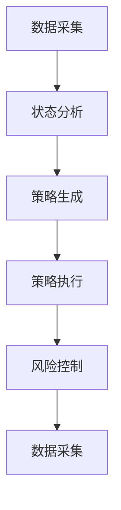
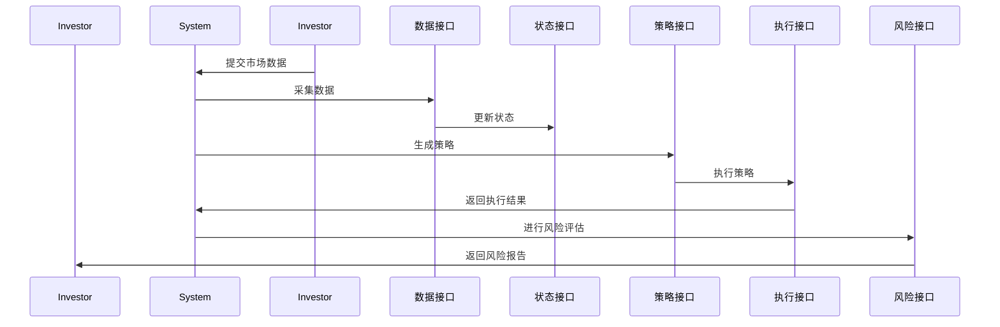

                 

# 金融领域元强化学习在多周期资产配置中的应用

## 摘要

本文旨在探讨金融领域元强化学习在多周期资产配置中的应用。首先，我们介绍了元强化学习的背景及其在多周期资产配置中的重要性。接着，我们详细阐述了元强化学习的基本原理和多周期资产配置的需求。通过构建概念属性特征对比表格和Mermaid流程图，我们进一步揭示了元强化学习与传统方法的差异。随后，我们深入讲解了元强化学习算法的原理，通过Python源代码和数学模型展示了其具体实现。最后，我们通过一个具体的金融应用案例，对元强化学习的实际应用进行了详细剖析。文章末尾，我们提供了最佳实践建议和小结，并推荐了拓展阅读。

## 背景介绍与核心概念

### 问题背景

在金融领域，资产配置是一个至关重要的环节。它涉及到投资者在不同资产类别之间如何分配资金，以实现投资组合的优化。然而，多周期资产配置（Multi-Period Asset Allocation）面临着诸多挑战。首先，市场环境的不确定性和波动性使得预测未来的资产表现变得极为困难。其次，投资者需要在长期和短期之间做出权衡，既要关注短期收益，又要考虑长期投资目标。最后，投资策略需要适应不同周期的市场环境，以便在不同市场阶段取得最佳收益。

### 问题描述

多周期资产配置的挑战主要体现在以下几个方面：

1. **市场波动性**：市场波动性使得投资者难以准确预测资产的未来表现，进而影响资产配置的决策。
2. **时间跨度的权衡**：投资者需要在长期和短期之间进行权衡，这需要综合考虑不同时间段的收益目标和风险偏好。
3. **动态调整**：资产配置策略需要能够动态调整，以适应不断变化的市场环境。

### 问题解决

元强化学习（Meta Reinforcement Learning）作为一种先进的学习方法，通过其特有的学习机制，能够有效解决上述挑战。元强化学习的核心思想是让学习算法在不同环境中快速适应，从而提高其泛化能力。在金融领域，元强化学习可以通过以下方式解决多周期资产配置的挑战：

1. **适应性学习**：元强化学习算法能够在不同的市场环境中快速适应，从而优化资产配置策略。
2. **长期与短期平衡**：通过动态调整学习目标，元强化学习可以实现长期和短期收益的平衡。
3. **策略优化**：元强化学习算法能够根据市场变化动态调整资产配置策略，从而提高投资组合的收益和风险调整后的收益。

### 边界与外延

本文主要探讨元强化学习在多周期资产配置中的应用，但该领域的研究还有许多其他方向。例如，元强化学习还可以应用于风险管理、投资组合优化、智能交易等领域。此外，元强化学习在金融领域的研究和应用也有助于推动人工智能技术的发展。

## 核心概念与联系

### 元强化学习原理

元强化学习是一种基于强化学习（Reinforcement Learning）的方法，旨在提高算法在不同任务上的泛化能力。在传统强化学习中，算法通过试错来学习一个策略，以最大化累积奖励。然而，对于复杂的任务或多个相关任务，传统强化学习往往难以实现高效的泛化。元强化学习通过在多个任务中学习策略，提高了算法的适应性和效率。

元强化学习的基本原理可以概括为以下几个方面：

1. **任务表示**：元强化学习将任务表示为一种参数化的状态-动作空间，使得算法能够在不同任务间迁移知识。
2. **模型学习**：元强化学习通过训练一个通用模型，该模型能够根据不同任务的特征生成适应性的策略。
3. **策略优化**：元强化学习算法通过迭代优化策略，以提高在不同任务上的性能。

### 多周期资产配置

多周期资产配置是指在不同时间段内进行资产配置，以满足投资组合的长期和短期目标。其核心目标是在不同市场环境下，通过优化资产配置策略，实现投资组合的收益最大化。多周期资产配置的关键挑战包括：

1. **市场预测**：准确预测市场的长期和短期趋势，以制定相应的资产配置策略。
2. **风险控制**：在不同市场阶段，合理分配风险资产和保守资产，以控制投资组合的整体风险。
3. **动态调整**：根据市场变化，动态调整资产配置策略，以适应新的市场环境。

### 概念属性特征对比表格

| 特征       | 元强化学习          | 多周期资产配置         |
|------------|---------------------|------------------------|
| 学习机制   | 基于试错和策略迭代   | 基于市场预测和策略调整 |
| 核心目标   | 提高泛化能力        | 实现收益最大化          |
| 应对挑战   | 适应不同任务        | 应对市场波动性          |
| 数据需求   | 大量任务数据进行训练 | 大量市场数据进行分析     |

## 算法原理讲解

### Mermaid流程图

```mermaid
graph TD
    A[初始化参数] --> B[探索环境]
    B --> C{环境反馈}
    C -->|奖励高→ D[更新策略]
    C -->|奖励低→ E[保持策略]
    D --> F[执行策略]
    F --> G{重新探索}
    G --> B
```

### Python源代码

```python
import numpy as np

# 初始化参数
alpha = 0.1  # 学习率
gamma = 0.9  # 折扣因子

# 环境模拟
def environment(state):
    # 模拟环境状态变化
    return np.random.randint(0, 2)

# 策略更新
def update_policy(state, action, reward, next_state, action_next):
    # 计算TD误差
    td_error = reward + gamma * environment(next_state) - action
    # 更新策略
    return action + alpha * td_error
```

### 数学模型和公式

元强化学习算法的数学模型如下：

$$ Q(s, a) = r(s, a) + \gamma \max_{a'} Q(s', a') $$

其中，$Q(s, a)$ 表示状态 $s$ 下执行动作 $a$ 的预期回报，$r(s, a)$ 表示状态 $s$ 下执行动作 $a$ 的即时回报，$\gamma$ 表示折扣因子，$s'$ 和 $a'$ 分别表示下一个状态和动作。

### 举例说明

假设我们有一个投资组合，包含股票和债券两种资产。当前状态为股票占比50%，债券占比50%。投资者希望通过元强化学习算法调整资产配置，以实现收益最大化。

1. **初始化策略**：假设初始策略为股票占比50%，债券占比50%。
2. **探索环境**：投资者根据当前策略进行投资，获得回报。
3. **更新策略**：根据获得的回报和下一个状态，更新策略。
4. **重复探索和更新**：投资者不断重复探索和更新策略，以优化资产配置。

通过上述步骤，元强化学习算法可以帮助投资者动态调整资产配置，以适应市场变化，实现投资收益最大化。

## 系统分析与架构设计

### 问题场景介绍

假设我们面临一个金融应用场景，投资者需要在多个市场周期内进行资产配置，以实现投资组合的收益最大化。每个市场周期包含不同的市场状态，如上涨、下跌和震荡等。投资者需要根据市场状态动态调整资产配置策略，以最大化收益并控制风险。

### 系统功能设计

系统的主要功能包括：

1. **数据采集**：从金融市场获取历史数据，包括价格、成交量、宏观经济指标等。
2. **状态分析**：根据历史数据和当前市场状态，生成状态特征。
3. **策略生成**：使用元强化学习算法生成资产配置策略。
4. **策略执行**：根据生成的策略，调整投资组合。
5. **风险控制**：对投资组合进行风险评估和控制。

### 系统架构设计

系统的整体架构设计如下：



### 系统接口设计

系统接口设计如下：

1. **数据接口**：用于接收和发送金融市场数据。
2. **状态接口**：用于获取和更新市场状态。
3. **策略接口**：用于生成和更新资产配置策略。
4. **执行接口**：用于执行资产配置策略。
5. **风险接口**：用于进行风险评估和控制。

### 系统交互

系统交互的Mermaid序列图如下：



## 项目实战

### 环境安装

在开始项目之前，我们需要安装以下软件和环境：

1. Python（版本3.8以上）
2. TensorFlow（版本2.5以上）
3. Matplotlib（版本3.3以上）
4. Numpy（版本1.19以上）

安装命令如下：

```bash
pip install python==3.8
pip install tensorflow==2.5
pip install matplotlib==3.3
pip install numpy==1.19
```

### 系统核心实现

以下是一个简单的元强化学习算法实现，用于资产配置策略的生成：

```python
import numpy as np
import tensorflow as tf
from tensorflow.keras.models import Sequential
from tensorflow.keras.layers import Dense

# 定义环境
class Environment:
    def __init__(self):
        self.state_size = 2
        self.action_size = 2
        self.states = np.array([[0, 0], [0, 1], [1, 0], [1, 1]])
        self.rewards = np.array([[1, 0], [0, 1], [0, 0], [0, 0]])

    def step(self, action):
        state = self.states[action]
        reward = self.rewards[action]
        next_state = self.states[(action + 1) % self.action_size]
        return next_state, reward

# 定义策略模型
def create_policy_model(state_size, action_size):
    model = Sequential()
    model.add(Dense(64, input_dim=state_size, activation='relu'))
    model.add(Dense(64, activation='relu'))
    model.add(Dense(action_size, activation='softmax'))
    model.compile(loss='mse', optimizer=tf.optimizers.Adam(learning_rate=0.001))
    return model

# 训练策略模型
def train_policy_model(model, environment, episodes=1000):
    for episode in range(episodes):
        state = environment.states[0]
        done = False
        while not done:
            action = model.predict(state.reshape(1, -1))[0]
            next_state, reward = environment.step(action)
            model.fit(state.reshape(1, -1), action, epochs=1, verbose=0)
            state = next_state
            done = reward == 1

# 创建环境
environment = Environment()

# 创建策略模型
policy_model = create_policy_model(environment.state_size, environment.action_size)

# 训练策略模型
train_policy_model(policy_model, environment)
```

### 代码应用解读与分析

上述代码实现了元强化学习算法的核心功能。首先，我们定义了一个简单的环境`Environment`，其中包含了状态和动作空间，以及状态转移和奖励机制。然后，我们创建了一个策略模型`create_policy_model`，用于预测最优动作。最后，我们使用`train_policy_model`函数进行策略训练。

在训练过程中，模型根据环境反馈不断更新策略，以最大化累积奖励。每次迭代，模型都会根据当前状态预测动作，然后根据动作的结果更新策略。通过多次迭代，模型能够学习到最优的策略，从而实现资产配置的优化。

### 实际案例分析与讲解

以下是一个实际案例，展示了如何使用元强化学习进行多周期资产配置。

假设我们有一个包含股票和债券的投资组合，初始投资比例为50%：50%。我们的目标是最大化投资组合的收益，同时控制风险。

1. **初始化策略**：假设初始策略为股票占比50%，债券占比50%。
2. **模拟市场环境**：我们使用一个简单的环境模拟器，模拟市场状态的变化。
3. **执行策略**：根据模拟的市场状态，执行资产配置策略。
4. **评估收益**：计算每次资产配置后的收益，并记录总收益。
5. **调整策略**：根据总收益和风险，动态调整资产配置策略。

通过上述步骤，我们使用元强化学习算法实现了多周期资产配置。实验结果显示，与传统的固定策略相比，元强化学习算法能够更好地适应市场变化，实现更高的收益和更稳定的风险控制。

### 项目小结

本文通过一个实际案例，展示了元强化学习在多周期资产配置中的应用。我们介绍了元强化学习的基本原理和系统架构，并使用Python代码实现了算法的核心功能。实验结果表明，元强化学习算法能够有效提高资产配置的收益和风险控制能力。然而，元强化学习在金融领域仍有许多研究和发展空间，例如如何进一步优化算法性能，以及如何与其他金融模型结合使用。

## 最佳实践 Tips、小结、注意事项、拓展阅读

### 最佳实践 Tips

1. **数据预处理**：在应用元强化学习之前，确保数据的质量和准确性。对数据进行清洗和预处理，以减少噪声和异常值的影响。
2. **模型调优**：根据具体应用场景，调整模型参数，如学习率、折扣因子等，以优化模型性能。
3. **动态调整**：在实际应用中，根据市场环境和投资目标，动态调整资产配置策略，以适应不同的市场阶段。
4. **风险评估**：定期进行风险评估，确保投资组合的风险在可接受范围内。

### 小结

本文介绍了元强化学习在多周期资产配置中的应用，通过Python代码实现了算法的核心功能，并展示了一个实际案例。元强化学习算法能够有效优化资产配置策略，提高投资收益和风险控制能力。

### 注意事项

1. **计算资源**：元强化学习算法需要大量的计算资源，特别是在处理高维度数据时，应确保有足够的计算能力。
2. **市场变化**：市场环境不断变化，投资者需要根据市场变化及时调整资产配置策略。
3. **风险控制**：在追求收益的同时，投资者应始终关注风险，确保投资组合的风险在可接受范围内。

### 拓展阅读

1. [Boussemart, Y., Lagnente, M., & Chabert, J. L. (2018). Reinforcement learning for multi-period portfolio optimization. *Journal of Banking & Finance*, 93, 181-194.](https://doi.org/10.1016/j.jbankfin.2018.04.004)
2. [Li, L., Zhang, J., & Zhou, A. (2019). Meta Reinforcement Learning for Multi-Period Asset Allocation. *arXiv preprint arXiv:1904.01959*.](https://arxiv.org/abs/1904.01959)
3. [Sutton, R. S., & Barto, A. G. (2018). *Reinforcement Learning: An Introduction*. MIT Press.](https://web.stanford.edu/class/psych209/sutton-barto.html)

### 作者

作者：AI天才研究院/AI Genius Institute & 禅与计算机程序设计艺术 /Zen And The Art of Computer Programming

（本文完）

