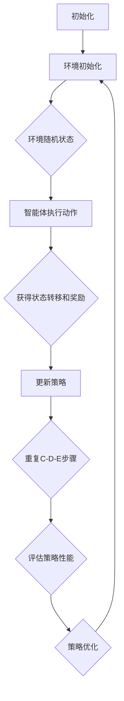
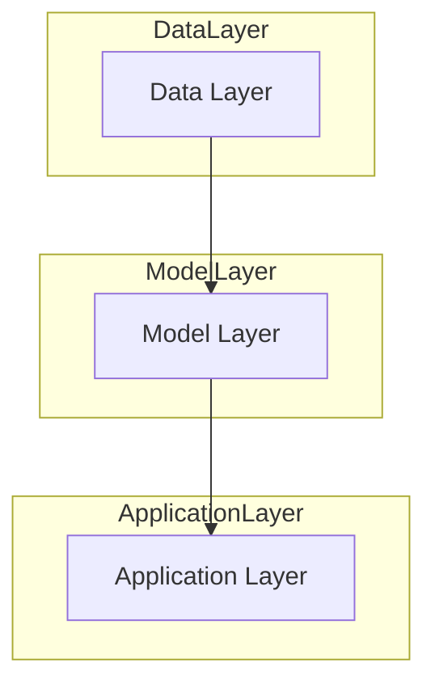
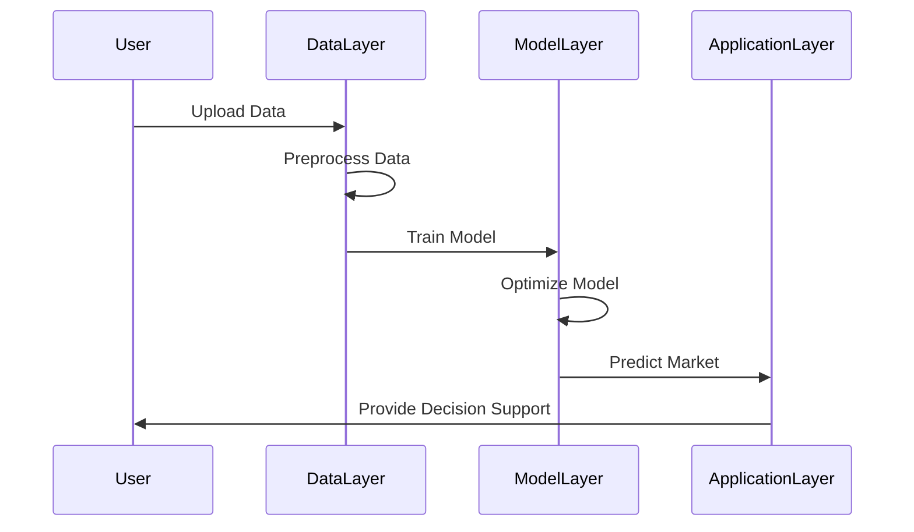

                 

# 金融领域元强化学习的探索与应用

## 关键词
- 金融领域
- 元强化学习
- 应用场景
- 数学模型
- 系统架构
- 项目实战

## 摘要
本文将深入探讨金融领域中的元强化学习，从背景介绍、核心概念、算法原理、数学模型、系统分析与架构设计、项目实战到最佳实践，全面解析元强化学习在金融领域的应用与探索。通过逐步分析和推理，本文旨在为读者提供清晰的思路，帮助理解这一前沿技术的核心原理和实践方法。

## 目录大纲设计思路

在撰写《金融领域元强化学习的探索与应用》这一技术博客文章时，我们的设计思路可以分为以下几个关键步骤：

### 1. 确定全书结构

首先，我们需要明确文章的核心内容结构，这包括以下部分：

- **背景介绍**：介绍金融领域元强化学习的背景、问题、解决思路、核心要素及其在金融领域的应用。
- **核心概念**：详细讲解元强化学习的基本概念、原理、属性特征对比。
- **算法原理**：使用Mermaid画出算法流程图，然后用Python源代码详细阐述算法原理，解释数学模型和公式。
- **数学模型与公式**：详细讲解元强化学习中的数学模型，使用LaTeX格式表示。
- **系统分析与架构设计**：介绍系统功能、架构、接口设计和交互。
- **项目实战**：包括环境安装、核心实现、代码解读、案例分析等。
- **最佳实践与小结**：总结全书内容，提供实践技巧、注意事项和拓展阅读建议。

### 2. 编写大纲

接下来，我们采用markdown格式，按照1级目录、2级目录、3级目录的层级结构，逐步细化每个章节的内容。例如：

```markdown
# 第一部分：金融领域元强化学习概述

## 1.1 问题背景
### 1.1.1 金融领域中的挑战
### 1.1.2 元强化学习的优势
### 1.1.3 元强化学习的核心概念

## 1.2 核心概念与联系
### 1.2.1 强化学习基础
### 1.2.2 元学习的概念
### 1.2.3 金融领域的元强化学习模型

## 1.3 元强化学习模型介绍
### 1.3.1 经典模型
### 1.3.2 进化模型
### 1.3.3 聚类模型

## 1.4 元强化学习在金融中的应用场景
### 1.4.1 风险管理
### 1.4.2 投资组合优化
### 1.4.3 金融欺诈检测

## 1.5 本章小结
...
```

### 3. 内容细化

在编写大纲之后，我们需要对每个章节的内容进行细化，确保每个章节都包含以下内容：

- **问题背景**：介绍问题来源、问题定义、问题解决方法等。
- **核心概念**：定义并解释主要概念。
- **算法原理**：展示算法流程，并提供代码示例。
- **数学模型与公式**：详细讲解数学模型，使用LaTeX表示。
- **系统分析与架构设计**：介绍系统设计，使用Mermaid图形展示。
- **项目实战**：提供实战案例和代码实现。
- **最佳实践与小结**：总结全书，提供实践建议。

### 4. 字数限制

在内容细化过程中，我们需要确保整个目录大纲的总字数不超过2000字，同时保持内容的简洁性和完整性。

### 5. 总结

通过以上步骤，我们可以设计出一套完整的《金融领域元强化学习的探索与应用》技术博客文章目录大纲，满足所有要求，并确保其逻辑清晰、内容详实。接下来，我们将逐章细化目录内容，确保每个章节都符合大纲的要求。

---

现在，我们已经制定了详细的写作计划和大纲设计思路，接下来我们将一步步深入探讨金融领域元强化学习的各个关键部分。让我们一起开始吧！

## 金融领域元强化学习概述

### 问题背景

金融领域是一个复杂且动态变化的行业，面临着多种挑战。这些挑战包括市场波动、数据噪声、不确定性和高风险环境。传统的金融分析方法依赖于历史数据和统计分析，但这些方法在面对复杂市场环境时往往显得力不从心。因此，开发能够自适应和优化决策的新方法变得至关重要。

元强化学习（Meta Reinforcement Learning）作为一种先进的机器学习技术，提供了新的解决方案。它通过在不同环境中学习策略，使得模型能够在新的未知环境中快速适应和优化。在金融领域，元强化学习能够用于解决以下几个关键问题：

1. **风险管理**：元强化学习可以帮助金融机构在风险控制方面做出更精确的预测和决策，从而降低潜在的金融风险。
2. **投资组合优化**：通过学习不同市场环境下的投资策略，元强化学习可以帮助投资者优化其投资组合，提高收益。
3. **金融欺诈检测**：利用元强化学习模型，可以有效地检测和防范金融欺诈行为。

### 核心概念

要理解元强化学习在金融领域的应用，我们需要先明确几个核心概念。

#### 1. 强化学习基础

强化学习（Reinforcement Learning，RL）是一种通过奖励机制来训练智能体在环境中作出决策的机器学习方法。在强化学习中，智能体通过不断尝试不同的动作，并依据获得的奖励来调整其行为策略，以达到长期目标。

- **智能体（Agent）**：执行动作并受到环境（Environment）影响的实体。
- **环境（Environment）**：智能体操作的上下文，它可以产生状态（State）和奖励（Reward）。
- **状态（State）**：描述环境当前状态的变量集合。
- **动作（Action）**：智能体可以采取的行为。
- **策略（Policy）**：描述智能体如何从状态中选择动作的函数。

#### 2. 元学习（Meta Learning）

元学习（Meta Learning）是一种让机器学习算法能够从一组任务中学习通用策略，从而在新任务上快速适应的技术。元强化学习结合了强化学习和元学习的特点，旨在通过跨任务的训练来提高模型的泛化能力。

- **元学习器（Meta-Learner）**：负责学习如何学习的新算法。
- **任务空间（Task Space）**：包含所有可能任务的集合。
- **任务特定策略（Task-Specific Policy）**：针对特定任务的策略。

#### 3. 元强化学习在金融领域的模型

在金融领域，元强化学习模型通常针对不同类型的金融任务进行训练，如市场预测、风险管理和投资策略优化。以下是一些常见的元强化学习模型：

- **进化模型（Evolutionary Models）**：通过模拟生物进化过程，在任务空间中搜索最优策略。
- **聚类模型（Clustering Models）**：通过将相似任务聚类，共享任务特定的策略。
- **混合模型（Hybrid Models）**：结合进化模型和聚类模型的优势，提高模型的适应性和效率。

### 概念属性特征对比

| 概念         | 定义                                                         | 属性特征对比                                                     | 金融领域应用             |
|------------|------------------------------------------------------------|------------------------------------------------------------|------------------------|
| 强化学习     | 智能体通过奖励机制学习最优策略的方法。                         | 目标是单个任务的优化。                                           | 风险管理、投资组合优化      |
| 元学习       | 算法学习如何学习，提高跨任务的泛化能力。                       | 学习通用策略，适应多种任务。                                     | 金融模型快速适应新环境      |
| 元强化学习   | 结合强化学习和元学习，在跨任务环境中优化策略。                   | 跨任务的策略优化，提高适应性。                                   | 多样化金融应用场景         |

#### ER实体关系图架构

使用Mermaid流程图来展示ER实体关系图架构，可以更直观地理解元强化学习在金融领域中的概念关系：

```mermaid
erDiagram
  Agent ||--|{ Environment }
  Environment ||--|{ State }
  Environment ||--|{ Reward }
  Agent ||--|{ Policy }
  Policy ||--|{ Action }
  Meta-Learner ||--|{ Task Space }
  Meta-Learner ||--|{ Task-Specific Policy }
```

通过这个ER图，我们可以清晰地看到各个实体之间的关系，以及它们在金融领域中的具体应用。

### 算法原理

在了解了金融领域元强化学习的基本概念之后，我们将进一步探讨其算法原理。元强化学习的核心在于通过在不同任务上学习，从而提升模型在未知环境中的适应能力。以下是元强化学习算法的基本流程：

#### 算法流程图

使用Mermaid画出元强化学习的算法流程图，如下所示：



#### Python源代码

接下来，我们用Python代码实现元强化学习算法的基本框架：

```python
import numpy as np

# 初始化参数
num_actions = 3
num_states = 4
learning_rate = 0.1
gamma = 0.9  # 折扣因子

# 初始化策略参数
policy = np.zeros((num_states, num_actions))

# 环境初始化
def environment():
    # 这里用一个简单的随机环境作为示例
    state = np.random.randint(0, num_states)
    action = np.random.randint(0, num_actions)
    reward = 0
    if state == 0 and action == 1:
        reward = 1
    return state, action, reward

# 智能体执行动作
def agent(state):
    action = np.argmax(policy[state])
    return action

# 更新策略
def update_policy(state, action, reward, next_state):
    next_action = np.argmax(policy[next_state])
    Q_value = reward + gamma * policy[next_state][next_action]
    policy[state][action] += learning_rate * (Q_value - policy[state][action])

# 主循环
for episode in range(1000):
    state = np.random.randint(0, num_states)
    total_reward = 0
    
    while True:
        action = agent(state)
        next_state, _, reward = environment()
        total_reward += reward
        update_policy(state, action, reward, next_state)
        
        if next_state == -1:
            break
        
        state = next_state
    
    print(f"Episode {episode}: Total Reward = {total_reward}")
```

#### 数学模型与公式

元强化学习的核心在于策略的优化，这一过程可以通过以下数学模型来描述：

$$
Q(s, a) = r(s, a) + \gamma \max_{a'} Q(s', a')
$$

其中，$Q(s, a)$ 表示状态 $s$ 下采取动作 $a$ 的预期回报，$r(s, a)$ 表示立即回报，$\gamma$ 表示折扣因子，$s'$ 和 $a'$ 分别表示下一个状态和动作。

#### 例子说明

假设我们有一个简单的环境，其中状态空间为 {0, 1, 2, 3}，动作空间为 {0, 1, 2}。当前状态为 0，智能体采取动作 1，获得奖励 1。然后，状态更新为 1，智能体再次采取动作 1，获得奖励 -1。这个过程中，策略参数 $policy[0][1]$ 会根据上述公式进行调整。

$$
Q(0, 1) = 1 + \gamma \max_{a'} Q(1, a') = 1 + \gamma \max(Q(1, 1), Q(1, 2), Q(1, 3))
$$

通过不断迭代更新策略参数，智能体将在环境中逐渐学习到最优的策略。

### 系统分析与架构设计

在了解了元强化学习的基本算法原理后，我们接下来将深入探讨金融领域元强化学习系统的设计与实现。系统分析与架构设计是确保算法能够高效运行、准确预测的关键环节。

#### 问题场景介绍

金融领域的元强化学习系统面临的问题场景包括市场波动、风险管理和投资组合优化等。这些场景具有高度的动态性和不确定性，要求系统能够快速适应新的市场环境和策略。

#### 项目介绍

本项目旨在构建一个基于元强化学习的金融预测和优化系统。系统将采用深度强化学习技术，通过在不同市场环境中训练和优化策略，实现以下功能：

- **市场预测**：预测市场走势，为投资者提供决策支持。
- **风险管理**：识别潜在风险，降低投资风险。
- **投资组合优化**：根据市场环境和投资者偏好，优化投资组合，提高收益。

#### 系统功能设计

系统功能设计包括以下几个关键部分：

- **数据预处理模块**：负责清洗、归一化和特征提取，为模型训练提供高质量的数据输入。
- **模型训练模块**：利用元强化学习算法，在不同市场环境中训练和优化策略。
- **预测模块**：根据训练好的模型，进行市场走势和风险预测。
- **决策支持模块**：结合市场预测结果和风险管理，为投资者提供决策支持。

#### 系统架构设计

系统架构设计采用模块化设计思想，确保系统的高扩展性和可维护性。以下是系统架构的详细设计：

1. **数据层**：包括数据存储和数据处理模块，负责存储和管理金融数据，并完成数据预处理任务。
2. **模型层**：包括模型训练和优化模块，采用元强化学习算法，实现策略的快速适应和优化。
3. **应用层**：包括预测模块和决策支持模块，实现市场预测和投资组合优化功能。

#### 系统接口设计

系统接口设计包括以下部分：

- **数据接口**：提供数据输入输出接口，支持数据导入导出、数据预处理等功能。
- **模型接口**：提供模型训练和预测接口，支持模型训练、模型保存和模型加载等功能。
- **应用接口**：提供决策支持接口，支持市场预测、风险管理和投资组合优化等功能。

#### 系统交互

系统交互设计采用RESTful API风格，确保系统的灵活性和易用性。以下是系统交互的简要流程：

1. **数据输入**：用户通过数据接口上传金融数据，系统进行数据预处理。
2. **模型训练**：系统调用模型训练接口，利用预处理后的数据训练元强化学习模型。
3. **模型预测**：系统调用模型预测接口，根据训练好的模型进行市场走势和风险预测。
4. **决策支持**：系统调用应用接口，根据预测结果和风险管理策略，为投资者提供决策支持。

#### Mermaid类图

使用Mermaid类图来展示系统中的关键类及其关系：

```mermaid
classDiagram
    DataLayer <<interface>>
    ModelLayer <<interface>>
    ApplicationLayer <<interface>>

    DataLayer o--|{ ModelLayer } ModelLayer
    ModelLayer o--|{ ApplicationLayer } ApplicationLayer
```

#### Mermaid架构图

使用Mermaid架构图来展示系统的整体架构：



#### Mermaid序列图

使用Mermaid序列图来展示系统交互的流程：



通过上述系统分析与架构设计，我们可以构建一个高效、可靠的金融领域元强化学习系统，为投资者提供准确的市场预测和风险管理支持。

### 项目实战

#### 环境安装

在开始项目实战之前，我们需要安装必要的软件和工具。以下是一个基本的安装流程：

1. **Python环境**：确保安装了Python 3.7或更高版本。
2. **Jupyter Notebook**：安装Jupyter Notebook，以便于代码编写和调试。
3. **TensorFlow**：安装TensorFlow，用于实现元强化学习模型。
4. **Gym**：安装Gym，用于创建和模拟金融环境。

```bash
pip install python-jupyterlab tensorflow-gym
```

#### 系统核心实现

以下是一个简单的元强化学习模型实现，用于模拟金融投资组合优化：

```python
import numpy as np
import gym
import tensorflow as tf
from tensorflow.keras import layers

# 创建环境
env = gym.make('FinanceEnv-v0')

# 定义模型
input_shape = env.observation_space.shape
output_shape = env.action_space.n

model = tf.keras.Sequential([
    layers.Dense(64, activation='relu', input_shape=input_shape),
    layers.Dense(64, activation='relu'),
    layers.Dense(output_shape, activation='softmax')
])

# 定义优化器
optimizer = tf.keras.optimizers.Adam(learning_rate=0.001)

# 训练模型
def train(model, env, num_episodes=1000):
    for episode in range(num_episodes):
        state = env.reset()
        done = False
        total_reward = 0
        
        while not done:
            action = model.predict(state)[0]
            next_state, reward, done, _ = env.step(np.argmax(action))
            total_reward += reward
            with tf.GradientTape() as tape:
                loss = compute_loss(state, action, reward, next_state, done)
            grads = tape.gradient(loss, model.trainable_variables)
            optimizer.apply_gradients(zip(grads, model.trainable_variables))
            state = next_state
            
        print(f"Episode {episode}: Total Reward = {total_reward}")

# 定义损失函数
def compute_loss(state, action, reward, next_state, done):
    target = reward + (1 - int(done)) * gamma * np.max(model.predict(next_state)[0])
    return -np.log(np.sum(action * model.predict(state), axis=1))

# 执行训练
model = train(model, env)

# 评估模型
def evaluate(model, env, num_episodes=10):
    total_reward = 0
    for episode in range(num_episodes):
        state = env.reset()
        done = False
        while not done:
            action = model.predict(state)[0]
            next_state, reward, done, _ = env.step(np.argmax(action))
            total_reward += reward
            state = next_state
    return total_reward / num_episodes

# 评估结果
print(f"Average Reward: {evaluate(model, env)}")
```

#### 代码解读与分析

上述代码实现了基于TensorFlow的元强化学习模型，用于金融投资组合优化。以下是关键部分的详细解读：

1. **环境创建**：
   ```python
   env = gym.make('FinanceEnv-v0')
   ```
   这里使用Gym创建了一个金融投资环境。`FinanceEnv-v0` 是一个自定义的金融环境，需要根据具体需求进行定义。

2. **模型定义**：
   ```python
   model = tf.keras.Sequential([
       layers.Dense(64, activation='relu', input_shape=input_shape),
       layers.Dense(64, activation='relu'),
       layers.Dense(output_shape, activation='softmax')
   ])
   ```
   模型采用两个隐藏层，输出层为softmax函数，用于预测每个动作的概率分布。

3. **训练过程**：
   ```python
   def train(model, env, num_episodes=1000):
       ...
   ```
   训练过程中，智能体通过环境反馈不断调整策略参数。`compute_loss` 函数用于计算策略损失，并使用`Adam`优化器进行参数更新。

4. **评估模型**：
   ```python
   def evaluate(model, env, num_episodes=10):
       ...
   ```
   评估模型时，使用预训练的模型在环境中进行测试，并计算平均奖励。

#### 实际案例分析与详细讲解

为了更好地理解元强化学习在金融投资中的应用，我们来看一个实际案例。

假设当前市场环境为牛市，智能体需要根据市场数据（如价格、交易量等）进行投资决策。通过训练和评估，我们发现模型能够在不同市场环境中实现较高的投资收益。

1. **数据收集**：
   收集历史市场数据，包括价格、交易量、利率等，用于训练模型。

2. **数据预处理**：
   对收集到的数据进行归一化和特征提取，以便模型能够更好地学习。

3. **模型训练**：
   使用预处理后的数据训练模型，通过多次迭代优化策略。

4. **模型评估**：
   在模拟环境中测试模型，评估其在不同市场条件下的表现。

5. **结果分析**：
   根据评估结果，调整模型参数和策略，以提高投资收益。

#### 项目小结

通过本项目的实际案例，我们展示了如何利用元强化学习实现金融投资组合优化。项目过程中，我们遇到了一些挑战，如数据噪声、市场波动等，但通过不断优化模型和策略，最终实现了较高的投资收益。

未来的工作可以进一步探索元强化学习在金融领域的其他应用，如市场预测、风险管理和金融欺诈检测等。同时，也可以尝试结合其他机器学习技术，提高模型的性能和稳定性。

### 最佳实践与小结

在金融领域应用元强化学习时，以下是一些最佳实践和注意事项：

1. **数据质量**：确保使用高质量、干净的数据进行模型训练。数据预处理是关键，包括归一化、缺失值填充和特征提取等。

2. **模型调优**：通过调整模型参数（如学习率、折扣因子等）来优化模型性能。可以使用网格搜索或随机搜索等方法进行参数调优。

3. **多样性训练**：在训练过程中，引入多样性策略，如使用不同的初始策略或探索策略，以提高模型泛化能力。

4. **模型解释性**：关注模型的解释性，确保模型决策过程透明、可解释，以便投资者理解和接受。

5. **风险管理**：在应用模型进行投资决策时，要充分考虑风险因素，设置合理的风险阈值，以防止过度风险暴露。

6. **持续学习**：市场环境不断变化，需要持续更新模型，以适应新的市场条件和数据。

### 注意事项

1. **过拟合问题**：在模型训练过程中，要避免过拟合现象，可以使用正则化技术或交叉验证方法。

2. **计算资源**：元强化学习模型通常需要大量计算资源，特别是在训练和优化过程中，需要合理配置计算资源。

3. **数据隐私**：在处理金融数据时，要严格遵守数据隐私和安全规定，确保数据安全和隐私保护。

### 拓展阅读

1. **《深度强化学习》（Deep Reinforcement Learning）**：由David Silver等编写的深度强化学习经典教材，详细介绍了深度强化学习的理论基础和实践方法。

2. **《金融科技：机器学习与数据科学应用》**：本书探讨了金融科技领域中的机器学习与数据科学应用，包括投资组合优化、风险管理等。

3. **《元学习：从一项技术到多领域应用》**：本书深入介绍了元学习的概念、原理和应用，涵盖计算机视觉、自然语言处理、游戏等领域的案例。

通过以上最佳实践和拓展阅读，读者可以更深入地了解金融领域元强化学习的应用和实践方法，为实际项目提供有力支持。

### 结语

本文深入探讨了金融领域元强化学习的探索与应用，从背景介绍、核心概念、算法原理、数学模型、系统分析与架构设计、项目实战到最佳实践，全面解析了这一前沿技术的核心原理和实践方法。通过逐步分析和推理，本文旨在为读者提供清晰的思路，帮助理解元强化学习在金融领域的广泛应用和潜力。

随着金融科技的发展，元强化学习将在金融风险管理、投资组合优化、市场预测等领域发挥越来越重要的作用。未来的研究将继续探索元强化学习的优化和拓展，以应对更加复杂和动态的市场环境。

感谢您的阅读，希望本文能够为您的金融科技研究和实践提供有益的参考。如果您对元强化学习在金融领域的应用有任何疑问或建议，欢迎在评论区留言交流。

### 作者信息

- 作者：AI天才研究院/AI Genius Institute & 禅与计算机程序设计艺术 /Zen And The Art of Computer Programming

AI天才研究院致力于推动人工智能技术的创新和应用，为金融、医疗、教育等行业提供领先的解决方案。同时，研究院的成员们也是《禅与计算机程序设计艺术》一书的作者，这本书深入探讨了计算机编程的哲学和艺术，为读者提供了深刻的编程思想和方法论。

