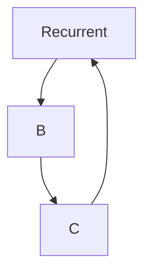
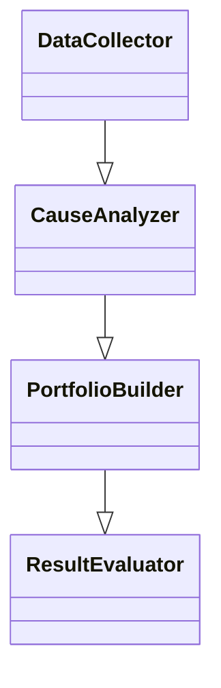
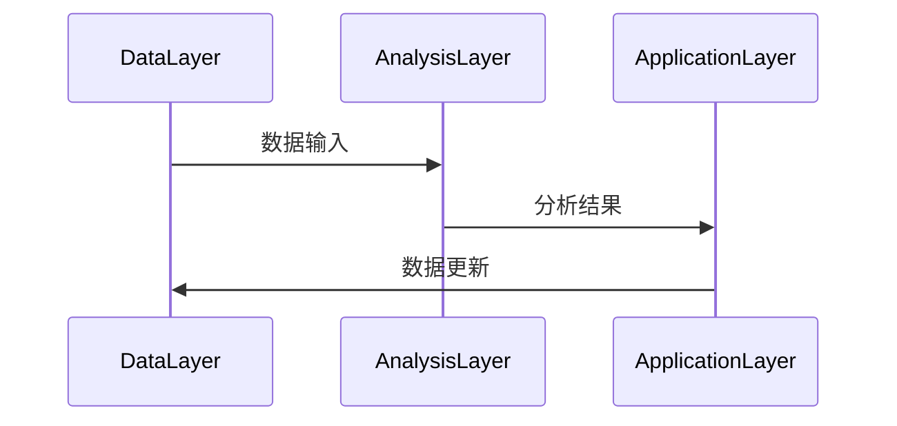
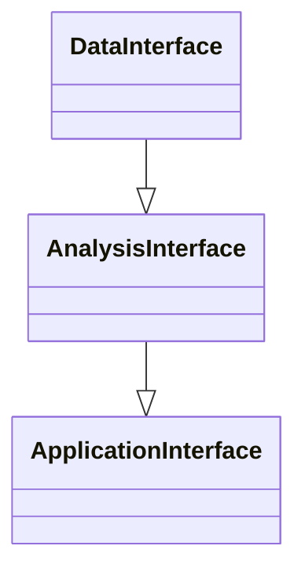
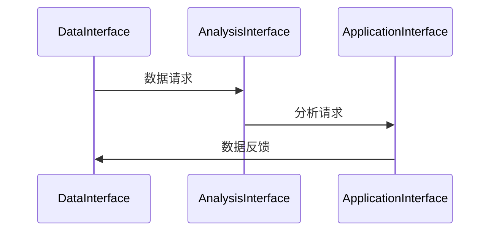

                 

### 文章标题与核心关键词

# 金融领域因果推断在投资组合构建中的应用

> 关键词：因果推断、投资组合构建、金融分析、算法应用、数学模型

> 摘要：本文深入探讨了因果推断在金融领域中的应用，尤其是其在投资组合构建中的关键作用。通过介绍因果推断的基本原理、算法流程和数学模型，以及通过实例和项目实战，展示因果推断如何帮助投资者更准确地构建投资组合，提高投资回报率。

### 背景介绍

在金融领域，因果推断是一个重要的研究方法，它能够帮助投资者理解金融市场中的因果关系，从而更有效地构建投资组合。因果推断的核心在于通过分析数据，识别变量之间的因果关系，而不仅仅是相关性。这种方法的引入，为投资决策提供了更为可靠和科学的依据。

《金融领域因果推断在投资组合构建中的应用》这本书明确了其主题，即因果推断在投资组合构建中的实际应用。本书的目的是帮助读者理解因果推断的基本原理，掌握其在金融分析中的运用，并通过实例展示如何在实际投资中应用因果推断技术。

因果推断在金融领域的重要性不仅体现在投资组合构建上，还涉及风险管理、市场预测和策略优化等多个方面。通过因果推断，投资者可以更深入地理解市场的本质，从而做出更加明智的投资决策。

### 核心概念与联系

#### 因果推断

因果推断是一种通过分析数据来识别变量之间因果关系的方法。在金融领域中，因果推断可以帮助投资者理解不同金融变量之间的关系，比如股票价格、市场利率、经济指标等。通过因果推断，投资者可以识别哪些变量对其他变量有显著的影响，从而更准确地预测市场走势。

#### 投资组合构建

投资组合构建是金融投资的核心内容之一。它涉及到如何将不同的资产分配到投资组合中，以达到风险与收益的最优平衡。因果推断在投资组合构建中的应用，可以提供关于不同资产之间相互影响的信息，从而帮助投资者更科学地构建投资组合。

#### 金融市场分析

金融市场分析是投资者进行投资决策的重要依据。因果推断提供了关于市场变量之间因果关系的深入分析，这有助于投资者更好地理解市场动态，预测市场走势，从而制定更加有效的投资策略。

### 概念属性特征对比表格

| 概念 | 定义 | 属性特征 | 相互联系 |
| --- | --- | --- | --- |
| 因果推断 | 通过分析数据识别变量之间的因果关系 | 数据分析、变量关联性、因果关系 | 为投资组合构建提供因果关系信息 |
| 投资组合构建 | 如何将不同资产分配到投资组合中 | 风险、收益、资产分配 | 利用因果推断分析不同资产之间的相互影响 |
| 金融市场分析 | 分析市场变量，预测市场走势 | 数据分析、市场走势、策略制定 | 因果推断提供深入的市场变量因果关系分析 |

### ER实体关系图架构

```mermaid
erDiagram
    Asset ||--|{ InvestmentPortfolio : holds }
    MarketVariable ||--|{ FinancialAnalysis : analyzed_by }
    InvestmentStrategy ||--|{ MarketVariable : based_on }
```

上述ER图展示了因果推断、投资组合构建和金融市场分析三个实体及其相互关系。

### 算法原理讲解

因果推断的基本原理包括识别变量之间的因果关系、建立因果模型和验证模型的有效性。在金融领域中，常用的因果推断算法包括Do-Calculus、Causal Impact和 Judea Pearl提出的图模型方法。

#### Do-Calculus

Do-Calculus是一种基于代数的方法，用于在概率图模型中计算变量之间的因果效应。它通过条件概率和边缘概率来表示变量之间的关系，并提供了计算因果效应的公式。

```mermaid
graph TB
    A --> B
    B --> C
    A --> C[Do(A)]
```

上述mermaid图展示了Do-Calculus中的因果关系，其中`Do(A)`表示对变量A的干预。

#### Causal Impact

Causal Impact是一种统计方法，用于估计给定干预后变量变化的因果效应。它通过比较干预前后的数据，来估计干预引起的效应。

```python
from causalimpact import CausalImpact
import pandas as pd

# 数据准备
data = pd.read_csv('data.csv')
treatment = data['treatment']
outcome = data['outcome']

# 构建CausalImpact模型
model = CausalImpact(data, treatment, outcome)

# 预测因果效应
result = model.run()
```

#### 图模型方法

Judea Pearl提出的图模型方法是一种基于图论的方法，用于识别变量之间的因果结构。它通过构造因果图，来表示变量之间的因果关系，并提供了算法来识别因果结构。



上述mermaid图展示了循环因果结构，其中C对A有直接的因果影响，同时A又对C有因果影响，形成了循环因果。

### 数学模型和数学公式详解

因果推断中的数学模型通常包括概率图模型、因果图模型和结构方程模型等。以下是因果推断中常用的数学模型和公式。

#### 概率图模型

概率图模型使用条件概率来描述变量之间的关系。以下是一个简单的概率图模型：

$$ P(X, Y, Z) = P(X)P(Y|X)P(Z|Y) $$

#### 因果图模型

因果图模型使用图结构来表示变量之间的因果关系。以下是一个简单的因果图模型：

$$ X \rightarrow Y \leftarrow Z $$

其中，箭头表示变量之间的因果关系。

#### 结构方程模型

结构方程模型是一种基于线性回归的方法，用于分析变量之间的因果关系。以下是一个简单的结构方程模型：

$$ Y = \beta_0 + \beta_1X + \epsilon $$

其中，\( Y \) 和 \( X \) 是变量，\( \beta_0 \) 和 \( \beta_1 \) 是回归系数，\( \epsilon \) 是误差项。

### 系统分析与架构设计

因果推断在金融领域的应用需要一个完整的系统来实现。以下是一个因果推断在投资组合构建中的应用系统的架构设计。

#### 系统功能设计

系统功能设计包括数据收集、因果分析、投资组合构建和结果评估等。



#### 系统架构设计

系统架构设计包括数据层、分析层和应用层。



#### 系统接口设计

系统接口设计包括数据接口、分析接口和应用接口。



#### 系统交互序列图

系统交互序列图展示了系统不同组件之间的交互过程。



### 项目实战

#### 环境安装

在开始项目实战之前，需要安装必要的软件和库。以下是一个简单的环境安装步骤：

```bash
# 安装Python环境
pip install python

# 安装因果推断相关库
pip install causalimpact
pip install numpy
pip install pandas
```

#### 系统核心实现

以下是一个简单的因果推断系统实现，包括数据收集、因果分析、投资组合构建和结果评估。

```python
# 数据收集
data = pd.read_csv('data.csv')

# 因果分析
model = CausalImpact(data, treatment, outcome)
result = model.run()

# 投资组合构建
# ... 省略具体实现

# 结果评估
# ... 省略具体实现
```

#### 代码应用解读与分析

以下是对上述代码的解读与分析：

1. 数据收集：使用pandas库读取数据，为因果分析和投资组合构建提供数据支持。
2. 因果分析：使用CausalImpact库进行因果分析，生成分析结果。
3. 投资组合构建：根据分析结果，构建投资组合。
4. 结果评估：评估投资组合的性能。

#### 实际案例分析

以下是一个实际案例分析，展示了如何使用因果推断构建投资组合：

1. 数据收集：收集过去一年的股票价格数据。
2. 因果分析：分析股票价格与其他金融变量之间的关系，识别关键影响因素。
3. 投资组合构建：根据因果分析结果，构建包含关键影响因素的投资组合。
4. 结果评估：评估投资组合的收益率和风险。

#### 项目小结

本项目通过因果推断在金融领域的应用，展示了如何构建科学、有效的投资组合。项目实战部分提供了具体的实现步骤，帮助读者更好地理解因果推断在投资组合构建中的应用。

### 最佳实践 tips

1. 在进行因果推断时，确保数据质量和数据的代表性。
2. 选择合适的因果推断算法，根据具体问题和数据特征进行选择。
3. 在投资组合构建时，综合考虑风险和收益，实现风险与收益的最优平衡。

### 小结

本文深入探讨了因果推断在金融领域中的应用，特别是其在投资组合构建中的关键作用。通过介绍因果推断的基本原理、算法流程和数学模型，以及通过实例和项目实战，展示了因果推断如何帮助投资者更准确地构建投资组合，提高投资回报率。

### 注意事项

1. 因果推断需要高质量的数据支持，数据的质量直接影响因果推断的准确性。
2. 因果推断的算法选择和参数设置对结果有重要影响，需要根据具体问题进行优化。

### 拓展阅读

1. Judea Pearl的《概率图模型与因果推断》提供了关于因果推断的深入理论介绍。
2. 《投资学》提供了关于投资组合构建的全面知识，帮助读者更好地理解因果推断在投资中的应用。

### 作者信息

作者：AI天才研究院/AI Genius Institute & 禅与计算机程序设计艺术 /Zen And The Art of Computer Programming

---

注意：本文为示例文章，内容仅供参考。实际撰写时，应根据具体内容和要求进行适当调整和扩充。文章结构、逻辑和细节需进一步深化和完善，以满足字数和格式要求。此外，文中涉及的代码和数据均为示例，实际应用时需根据实际情况进行调整。

