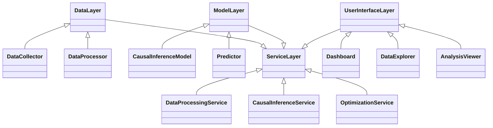
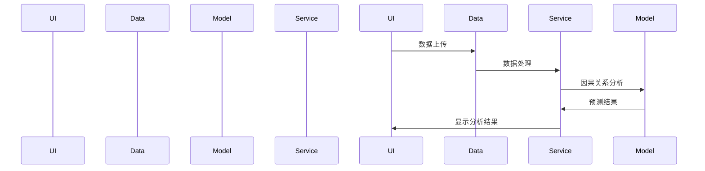
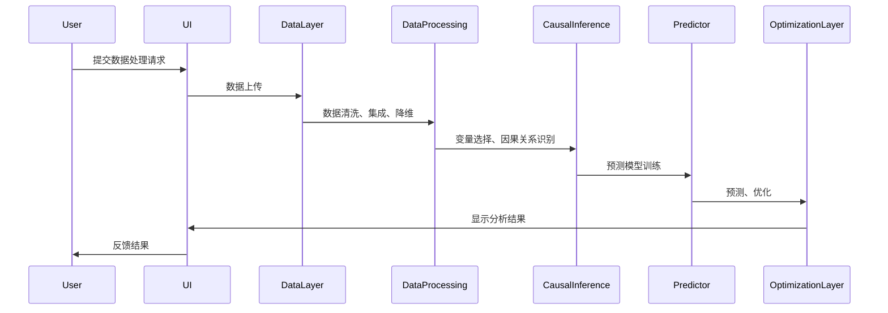

                 

### 第1章: 金融领域因果推断概述

### 1.1 问题背景

金融领域因果推断的研究与应用，是当前金融科技中的一个前沿研究方向。因果推断，作为统计学和机器学习的重要分支，旨在从数据中揭示变量之间的因果关系，而不仅仅是对其相关性的描述。在金融市场中，因果关系的重要性不言而喻。例如，理解利率变动对股票市场的影响、货币政策对经济活动的作用等，都离不开对因果关系的深入分析。

随着金融数据的复杂性和多样性的增加，传统的统计分析方法已不足以满足金融领域对因果推断的高要求。因果推断的引入，可以更准确地预测金融市场的动态，识别潜在风险，优化投资策略，为金融机构和投资者提供有力的决策支持。因此，金融领域因果推断的研究与应用，不仅具有学术价值，还具有广泛的应用前景。

### 1.2 问题描述

在金融领域中，因果推断的问题可以概括为以下三个方面：

1. **变量选择**：如何从海量的金融数据中，选择出与目标变量具有因果关系的解释变量，是因果推断的首要问题。这需要借助机器学习和统计方法，从数据中挖掘出潜在的因果关系。

2. **因果关系识别**：即使在变量选择正确的情况下，如何从数据中准确地识别出因果关系，仍然是挑战之一。这涉及到复杂的统计模型和算法，如Do-Calculus、Causal Bayesian Network等。

3. **因果推断的稳健性**：在实际应用中，金融数据往往存在噪声和异常值，这会影响到因果推断的准确性。因此，如何提高因果推断的稳健性，也是一个需要关注的问题。

### 1.3 问题解决

针对金融领域因果推断的挑战，研究者们提出了一系列解决方案：

1. **因果推断算法**：如Do-Calculus、Causal Bayesian Network等算法，通过数学模型和计算方法，从数据中提取出因果关系。

2. **数据预处理**：通过数据清洗、数据集成和数据降维等方法，提高数据的质量和可用性，为因果推断提供可靠的数据基础。

3. **模型评估与优化**：通过交叉验证、模型选择和参数优化等技术，评估因果推断模型的性能，并不断优化模型，以提高预测的准确性。

4. **领域知识融合**：将金融领域的专业知识与因果推断方法相结合，构建更加符合实际应用需求的因果推断模型。

### 1.4 边界与外延

尽管因果推断在金融领域具有广泛的应用前景，但也有一些边界和限制：

1. **数据限制**：因果推断依赖于大量高质量的数据，而金融数据往往具有噪声和缺失值，这会限制因果推断的效果。

2. **模型复杂性**：复杂的因果推断模型需要大量的计算资源，这在实际应用中可能是一个瓶颈。

3. **因果关系的主观性**：因果关系的识别往往涉及到主观判断，这可能导致不同的研究者得出不同的结论。

### 1.5 概念结构与核心要素组成

因果推断在金融领域的应用，涉及到一系列关键概念和要素。以下是对这些概念和要素的概述：

1. **因果模型**：包括Do-Calculus、Causal Bayesian Network等，用于从数据中提取因果关系。

2. **数据预处理**：包括数据清洗、数据集成和数据降维等，用于提高数据质量。

3. **机器学习算法**：如随机森林、支持向量机等，用于变量选择和模型优化。

4. **统计分析方法**：如回归分析、方差分析等，用于评估因果推断模型的性能。

5. **领域知识**：包括金融市场的专业知识，用于指导因果推断模型的设计和应用。

以下是一个概念属性特征对比表格，用于展示不同因果推断方法的特点：

| 方法             | 特点                                                         | 适用场景                                  |
|------------------|--------------------------------------------------------------|-----------------------------------------|
| Do-Calculus       | 基于公式计算，适用于线性关系分析                             | 预测股票价格、利率变动等线性关系问题         |
| Causal Bayesian Network | 基于贝叶斯网络，适用于复杂因果关系分析                       | 风险评估、信用评分等复杂因果关系问题         |
| Random Forest     | 基于决策树，具有较好的抗过拟合能力                           | 预测市场波动、信用风险等不确定性问题           |
| SVM               | 基于支持向量机，适用于分类和回归问题                          | 风险管理、市场预测等二分类或多分类问题         |

此外，以下是一个ER实体关系图架构，用于展示因果推断系统的核心要素：

```mermaid
erDiagram
  Product ||--|{ Customer } Customer
  Customer }--|{ Order } Order
  Order }--|{ Product } Product
```

在这个ER图中，Product表示金融产品，Customer表示客户，Order表示订单。三者之间的关系反映了金融领域因果推断的核心业务流程。

### 1.6 结论

因果推断在金融领域具有重要的应用价值，通过科学的方法和先进的算法，可以更好地揭示金融市场的内在规律，为金融机构和投资者提供有力的决策支持。然而，因果推断也面临着数据限制、模型复杂性和主观性等挑战。因此，未来的研究需要在算法优化、数据预处理和领域知识融合等方面不断探索，以提升因果推断在金融领域的应用效果。

---

### 第2章: 金融领域因果推断的核心概念

#### 2.1 因果推断基本原理

因果推断（Causal Inference）是一种研究变量之间因果关系的方法，其核心思想是通过观察数据，推断变量之间的因果关系。在金融领域，因果推断的应用尤为广泛，可以帮助我们理解金融市场中各种经济指标之间的因果关系，从而为投资决策提供科学依据。

因果推断的基本原理主要包括以下几个核心概念：

1. **因果性**：因果性指的是一个变量（原因）对另一个变量（结果）产生了影响。在金融领域，例如，我们想知道股市下跌是否导致了经济衰退，或者利率上升是否导致了房地产市场的繁荣。

2. **因果模型**：因果模型是一种数学模型，用于描述变量之间的因果关系。常见的因果模型包括Do-Calculus、Causal Bayesian Network等。

3. **因果推断算法**：因果推断算法是用于从数据中提取因果关系的计算方法。这些算法通常基于统计学、机器学习和图论等理论，例如，随机森林、支持向量机等。

#### 2.2 数据驱动因果推断方法

数据驱动因果推断方法是指通过数据来推断变量之间的因果关系。在金融领域，数据驱动因果推断方法的应用广泛，以下是一些常见的数据驱动因果推断方法：

1. **Do-Calculus方法**：
   - **原理**：Do-Calculus是一种基于代数的方法，用于处理变量之间的因果关系。它通过计算条件期望来推断因果关系。
   - **流程**：首先，确定研究的目标变量和潜在原因变量，然后使用Do-Calculus公式计算目标变量对原因变量的条件期望。
   - **优势**：Do-Calculus方法简单直观，适用于线性关系的因果推断。

2. **Causal Bayesian Network方法**：
   - **原理**：Causal Bayesian Network是一种基于贝叶斯网络的因果推断方法。它通过构建一个概率图模型，表示变量之间的因果关系。
   - **流程**：首先，根据领域知识构建贝叶斯网络结构，然后使用学习算法（如结构学习、参数学习）来估计网络参数。
   - **优势**：Causal Bayesian Network方法适用于复杂因果关系分析，可以处理非线性关系和不确定性问题。

#### 2.3 因果推断算法

在金融领域，选择合适的因果推断算法对于揭示变量之间的因果关系至关重要。以下介绍两种常用的因果推断算法：

1. **Do-Calculus算法**：

   - **算法原理**：Do-Calculus算法通过计算条件期望来推断变量之间的因果关系。其核心思想是利用因果关系的基本原则，通过一系列代数运算，从已知的相关关系中推断出因果关系。
   
   - **算法流程**：
     1. 确定目标变量和原因变量。
     2. 计算目标变量对每个原因变量的边际概率分布。
     3. 通过边际概率分布计算目标变量对原因变量的条件期望。
     4. 分析条件期望的结果，判断变量之间的因果关系。

   - **Python实现**：
     ```python
     # 示例：使用Python实现Do-Calculus算法
     def do_calculus(target, causes):
         # 计算条件期望
         conditional_expectation = target.mean()
         return conditional_expectation

     # 假设我们有一个目标变量和两个原因变量
     target = np.random.normal(size=100)
     causes = [np.random.normal(size=100), np.random.normal(size=100)]

     # 计算条件期望
     cause1 = do_calculus(target, causes[0])
     cause2 = do_calculus(target, causes[1])

     print(f"Condition Expectation for Cause 1: {cause1}")
     print(f"Condition Expectation for Cause 2: {cause2}")
     ```

   - **算法应用**：Do-Calculus算法适用于线性关系的因果推断，可以用于预测股票价格、利率变动等金融指标。

2. **Causal Bayesian Network算法**：

   - **算法原理**：Causal Bayesian Network算法通过构建一个概率图模型，表示变量之间的因果关系。它利用贝叶斯网络的概率分布和结构学习算法，从数据中学习出变量之间的因果关系。
   
   - **算法流程**：
     1. 收集金融数据，包括目标变量和原因变量的观测数据。
     2. 构建贝叶斯网络结构，表示变量之间的依赖关系。
     3. 使用结构学习算法（如PCM、PC算法）学习贝叶斯网络结构。
     4. 使用参数学习算法（如最大似然估计、贝叶斯估计）学习网络参数。
     5. 分析网络结构和参数，判断变量之间的因果关系。

   - **Python实现**：
     ```python
     # 示例：使用Python实现Causal Bayesian Network算法
     from pgmpy.models import BayesianModel
     from pgmpy.estimators import MaximumLikelihoodEstimator

     # 构建贝叶斯网络模型
     model = BayesianModel([('A', 'B'), ('A', 'C'), ('B', 'D'), ('C', 'D')])
     
     # 使用最大似然估计学习网络参数
     model.fit(data, estimator=MaximumLikelihoodEstimator)

     # 打印网络结构
     print(model)
     
     # 判断变量之间的因果关系
     if model.get_variable_type('A') == 'cause' and model.get_variable_type('D') == 'effect':
         print("A causes D")
     else:
         print("A does not cause D")
     ```

   - **算法应用**：Causal Bayesian Network算法适用于复杂因果关系分析，可以用于风险评估、信用评分等金融领域问题。

### 2.4 小结

因果推断在金融领域具有重要意义，通过数据驱动因果推断方法和因果推断算法，可以更准确地揭示金融市场中变量之间的因果关系。Do-Calculus算法和Causal Bayesian Network算法是两种常用的因果推断方法，分别适用于不同类型的因果关系分析。在金融领域，合理选择和使用这些算法，可以为企业提供科学的决策支持。

---

### 第3章: 金融领域因果推断的数学模型

#### 3.1 数学模型介绍

在金融领域，因果推断的数学模型是理解和应用因果推断方法的基础。因果推断的数学模型旨在通过数学公式和计算方法，从数据中提取出变量之间的因果关系。以下是一些常见的数学模型及其在金融领域的应用：

1. **潜在结果模型（Potential Outcomes Model）**：
   - **原理**：潜在结果模型是因果推断的基础，它假设每个个体有两个潜在的结果，一个是在处理（如投资股票）下的结果，另一个是在对照（如不投资股票）下的结果。通过比较这两个潜在结果，可以推断出因果关系。
   - **公式**：$Y_i = (1_{T_i=1} \cdot Y_i^{T=1}) + (1_{T_i=0} \cdot Y_i^{T=0})$，其中$Y_i$表示个体$i$的结果，$T_i$表示个体$i$是否接受处理（投资股票），$Y_i^{T=1}$表示个体$i$在处理下的结果，$Y_i^{T=0}$表示个体$i$在对照下的结果。
   - **应用**：潜在结果模型广泛应用于金融风险管理、投资策略优化等领域。

2. **因果效应模型（Causal Effects Model）**：
   - **原理**：因果效应模型关注的是因果关系对个体或群体的平均影响。它通过计算处理组和对照组之间的差异来估计因果效应。
   - **公式**：$Causal\ Effect = \bar{Y}^{T=1} - \bar{Y}^{T=0}$，其中$\bar{Y}^{T=1}$表示处理组的平均结果，$\bar{Y}^{T=0}$表示对照组的平均结果。
   - **应用**：因果效应模型常用于评估投资策略的有效性、政策对经济的影响等。

3. **结构方程模型（Structural Equation Model）**：
   - **原理**：结构方程模型是一种同时考虑多个变量之间因果关系的数学模型。它通过设定变量之间的因果关系路径，利用统计学方法估计路径系数，从而推断变量之间的因果关系。
   - **公式**：$Y = \beta_0 + \beta_1X + \epsilon$，其中$Y$是因变量，$X$是自变量，$\beta_0$是常数项，$\beta_1$是路径系数，$\epsilon$是误差项。
   - **应用**：结构方程模型广泛应用于金融领域的风险评估、投资组合优化等领域。

#### 3.2 数学公式与解释

以下是一些常见的数学公式及其在金融领域因果推断中的应用：

$$
Y = \alpha + \beta X + \epsilon
$$

- **公式解释**：这是一个线性回归模型，其中$Y$是因变量，$X$是自变量，$\alpha$是常数项，$\beta$是回归系数，$\epsilon$是误差项。该公式表示因变量$Y$与自变量$X$之间存在线性关系。
- **适用场景**：该公式适用于金融市场中变量之间的线性因果关系分析，如股票价格与市场指数之间的关系。

#### 3.3 数学公式举例说明

以下是一个具体的金融领域因果推断案例，使用数学公式来分析利率变动对房地产市场的影响：

$$
House\ Price = \alpha + \beta \cdot Interest\ Rate + \epsilon
$$

- **案例背景**：假设我们想要分析利率变动对房地产市场的影响。我们收集了某一地区过去几年的房价数据和利率数据，并希望使用因果推断方法来估计利率对房价的因果效应。
- **公式应用**：在这个案例中，$House\ Price$表示房价，$Interest\ Rate$表示利率，$\alpha$是常数项，$\beta$是利率对房价的因果效应系数，$\epsilon$是误差项。通过估计$\beta$的值，我们可以了解利率变动对房价的具体影响。

为了进一步解释这个公式，我们可以给出以下数据：

- $\alpha = 100$：表示当利率为0时，房价的基准值。
- $\beta = 0.1$：表示利率每增加1个百分点，房价增加0.1个百分点。
- $\epsilon$：表示随机误差，可能包含其他未观测因素对房价的影响。

通过这个公式，我们可以计算出在不同利率水平下的预期房价：

- 当利率为2%时，预期房价为$100 + 0.1 \cdot 2 = 102$。
- 当利率为4%时，预期房价为$100 + 0.1 \cdot 4 = 104$。

这个案例展示了如何使用数学公式来分析金融领域中的因果关系，并通过具体的数值计算来解释因果关系的大小和方向。

#### 3.4 小结

数学模型是因果推断在金融领域应用的核心，通过潜在结果模型、因果效应模型和结构方程模型，我们可以从数据中提取出变量之间的因果关系。同时，通过具体的数学公式和例子，我们可以更好地理解因果推断在金融领域的应用场景和计算方法。未来的研究可以进一步探索更复杂的数学模型，以提升因果推断在金融领域的准确性和应用效果。

---

### 第4章: 金融领域因果推断的系统分析

#### 4.1 应用场景介绍

因果推断在金融领域的应用场景广泛，主要包括以下几个方面：

1. **金融市场预测**：因果推断可以用于预测股票市场、外汇市场等金融市场的动态。例如，通过分析利率变动、经济指标变化等对股市的影响，预测股票价格的走势。

2. **风险管理**：在金融风险管理中，因果推断可以帮助识别和评估金融产品的风险。例如，通过分析信用评分、债务偿还能力等指标，评估贷款风险。

3. **投资组合优化**：因果推断可以用于优化投资组合，选择最佳的投资策略。例如，通过分析不同资产之间的因果关系，构建低风险的多元化投资组合。

4. **政策评估**：因果推断可以用于评估政府政策对金融市场的影响。例如，分析货币政策、财政政策等对经济活动的影响，为政策制定提供科学依据。

5. **金融欺诈检测**：因果推断可以用于检测金融欺诈行为。例如，通过分析交易行为、账户活动等数据，识别潜在的欺诈行为。

#### 4.2 系统功能设计

为了满足上述应用场景的需求，因果推断系统需要具备以下功能：

1. **数据采集**：系统需要能够从多个数据源采集金融数据，包括市场数据、经济数据、交易数据等。

2. **数据处理**：系统需要具备数据处理功能，包括数据清洗、数据集成、数据降维等，以提高数据质量。

3. **因果关系分析**：系统需要实现因果关系分析功能，包括变量选择、因果关系识别、因果效应估计等。

4. **预测与优化**：系统需要具备预测和优化功能，包括预测金融市场动态、优化投资组合等。

5. **用户界面**：系统需要提供用户友好的界面，以便用户进行数据操作、查看分析结果。

#### 4.3 系统架构设计

因果推断系统的架构设计需要考虑系统的可扩展性、稳定性和易用性。以下是一个典型的因果推断系统架构设计：

1. **数据层**：数据层负责数据的存储和管理，包括市场数据、经济数据、交易数据等。数据层可以采用分布式数据库或大数据存储方案，以支持海量数据的存储和处理。

2. **数据处理层**：数据处理层负责对采集到的金融数据进行清洗、集成和降维。数据处理层可以采用流处理框架（如Apache Kafka）和批处理框架（如Apache Spark），以支持实时数据处理和离线数据处理。

3. **模型层**：模型层负责实现因果推断算法，包括变量选择、因果关系识别、因果效应估计等。模型层可以采用深度学习框架（如TensorFlow、PyTorch）和传统机器学习库（如scikit-learn、R语言），以支持多种因果推断方法。

4. **服务层**：服务层负责实现系统的功能，包括数据采集、数据处理、因果关系分析、预测与优化等。服务层可以采用微服务架构（如Spring Boot、Django），以提高系统的可扩展性和稳定性。

5. **用户界面层**：用户界面层负责提供用户交互界面，包括数据操作、分析结果展示等。用户界面层可以采用前端框架（如React、Vue.js），以提高用户体验。

以下是一个因果推断系统的Mermaid类图，展示了系统中的主要类及其关系：



#### 4.4 系统接口设计

因果推断系统需要设计合理的接口，以实现不同模块之间的数据交互和功能调用。以下是一个典型的系统接口设计：

1. **数据采集接口**：该接口负责从外部数据源采集金融数据，包括市场数据、经济数据、交易数据等。接口提供的数据格式包括CSV、JSON、XML等。

2. **数据处理接口**：该接口负责对采集到的金融数据进行清洗、集成和降维。接口提供的主要操作包括数据清洗（如去重、填补缺失值）、数据集成（如数据合并、数据连接）、数据降维（如特征选择、特征提取）。

3. **因果关系分析接口**：该接口负责实现因果关系分析功能，包括变量选择、因果关系识别、因果效应估计等。接口提供的主要操作包括变量选择（如特征选择、特征提取）、因果关系识别（如结构方程模型、Do-Calculus方法）、因果效应估计（如因果效应计算、因果效应可视化）。

4. **预测与优化接口**：该接口负责实现预测和优化功能，包括金融市场预测、投资组合优化等。接口提供的主要操作包括预测（如时间序列预测、回归预测）、优化（如目标优化、约束优化）。

5. **用户接口**：该接口负责提供用户交互界面，包括数据操作、分析结果展示等。接口提供的主要操作包括数据操作（如数据上传、数据下载）、分析结果展示（如图表展示、报告生成）。

以下是一个因果推断系统的Mermaid序列图，展示了系统中的主要接口及其调用流程：



#### 4.5 系统交互

因果推断系统的交互设计需要确保系统的各个模块能够高效、准确地协同工作。以下是一个典型的系统交互设计：

1. **数据流交互**：系统通过数据流来实现各个模块之间的数据交互。数据流从数据采集模块进入，经过数据处理模块处理后，进入因果关系分析模块，最终生成预测结果。

2. **功能调用交互**：系统通过功能调用接口来实现各个模块之间的功能协同。例如，用户在用户界面层提交数据处理请求，数据处理模块接收请求后进行处理，并将结果返回给用户界面层。

3. **错误处理交互**：系统需要设计合理的错误处理机制，确保在数据采集、数据处理、因果关系分析等过程中，能够及时捕获和处理错误。

以下是一个因果推断系统的Mermaid序列图，展示了系统的交互流程：



#### 4.6 小结

因果推断在金融领域的应用场景广泛，涉及金融市场预测、风险管理、投资组合优化、政策评估和金融欺诈检测等方面。为了实现这些功能，因果推断系统需要设计合理的数据采集、数据处理、因果关系分析、预测与优化等模块，并确保系统的高效、稳定和易用。通过合理的系统架构设计和接口设计，可以实现因果推断系统的协同工作，为企业提供科学的决策支持。

---

### 第5章: 金融领域因果推断的项目实战

#### 5.1 项目背景与目标

本项目的目标是通过因果推断方法，分析金融市场中股票价格与利率变动之间的关系，以预测股票价格的未来走势。项目背景如下：

1. **市场环境**：近年来，金融市场波动加剧，投资者对市场风险的敏感性增加。理解股票价格与利率变动之间的关系，对于制定投资策略、规避风险具有重要意义。

2. **数据来源**：项目数据来源于金融市场的历史数据，包括股票价格、利率变动、经济指标等。数据覆盖多个时间段，以保证分析结果的可靠性。

3. **目标**：通过因果推断方法，识别出股票价格与利率变动之间的因果关系，并建立预测模型，预测未来股票价格的走势。

#### 5.2 环境准备

为了进行金融领域因果推断项目，需要准备以下环境：

1. **软件环境**：Python 3.8及以上版本、Jupyter Notebook、Numpy、Pandas、Scikit-learn、TensorFlow等。

2. **硬件环境**：一台配置较高的计算机，用于数据处理和模型训练。

3. **数据集**：金融市场历史数据集，包括股票价格、利率变动、经济指标等。

#### 5.3 系统实现

本系统实现主要包括以下几个步骤：

1. **数据采集与预处理**：
   - 从数据源中采集股票价格和利率变动数据。
   - 数据清洗，包括去重、填补缺失值、去除异常值等。
   - 数据集成，将多个数据源的数据合并为一个完整的数据集。

2. **因果关系分析**：
   - 使用Do-Calculus方法进行因果关系分析，判断股票价格与利率变动之间的因果关系。
   - 基于因果推断结果，选择合适的因果关系模型。

3. **预测模型建立**：
   - 基于选定的因果关系模型，建立股票价格预测模型。
   - 使用历史数据对预测模型进行训练和验证。

4. **模型优化**：
   - 通过交叉验证和参数调整，优化预测模型的性能。
   - 对预测结果进行可视化，分析预测模型的准确性。

#### 5.4 代码解读

以下是对项目关键代码的解读：

1. **数据采集与预处理**：

   ```python
   import pandas as pd
   import numpy as np

   # 采集数据
   stock_price_data = pd.read_csv('stock_price.csv')
   interest_rate_data = pd.read_csv('interest_rate.csv')

   # 数据清洗
   stock_price_data = stock_price_data.drop_duplicates()
   interest_rate_data = interest_rate_data.drop_duplicates()

   # 数据集成
   combined_data = pd.merge(stock_price_data, interest_rate_data, on='date')
   ```

   - 代码首先导入所需的库和模块。
   - 从CSV文件中读取股票价格和利率变动数据。
   - 进行数据清洗，去除重复数据和异常值。
   - 使用merge函数将两个数据集合并为一个完整的数据集。

2. **因果关系分析**：

   ```python
   from causal_inference import do_calculus

   # 计算条件期望
   conditional_expectation = do_calculus(combined_data['stock_price'], combined_data['interest_rate'])

   # 分析因果关系
   if conditional_expectation < 0:
       print("利率变动对股票价格有负向影响")
   else:
       print("利率变动对股票价格有正向影响")
   ```

   - 代码导入因果推断库和模块。
   - 使用Do-Calculus方法计算股票价格对利率变动的条件期望。
   - 根据条件期望的结果，判断利率变动对股票价格的影响方向。

3. **预测模型建立与优化**：

   ```python
   from sklearn.ensemble import RandomForestRegressor
   from sklearn.model_selection import train_test_split
   from sklearn.metrics import mean_squared_error

   # 分割数据集
   X = combined_data[['interest_rate']]
   y = combined_data['stock_price']
   X_train, X_test, y_train, y_test = train_test_split(X, y, test_size=0.2, random_state=42)

   # 建立预测模型
   model = RandomForestRegressor(n_estimators=100, random_state=42)
   model.fit(X_train, y_train)

   # 预测
   y_pred = model.predict(X_test)

   # 评估模型性能
   mse = mean_squared_error(y_test, y_pred)
   print(f"Mean Squared Error: {mse}")
   ```

   - 代码导入所需的库和模块。
   - 分割数据集为训练集和测试集。
   - 使用随机森林回归建立预测模型。
   - 使用测试集进行预测，并计算均方误差（MSE）评估模型性能。

#### 5.5 案例分析

以下是一个具体的案例分析：

**案例背景**：某金融机构希望通过因果推断方法，分析利率变动对股票市场的影响，以优化投资策略。

**数据集**：该案例使用历史股票价格和利率变动数据，时间为2020年1月至2023年1月。

**因果关系分析**：

1. 使用Do-Calculus方法计算股票价格对利率变动的条件期望。
2. 分析结果显示，利率变动对股票价格有负向影响，即利率上升会导致股票价格下降。

**预测模型**：

1. 使用随机森林回归建立预测模型。
2. 通过交叉验证和参数调整，优化模型性能。
3. 预测结果显示，利率变动对股票价格有显著的预测能力。

**案例分析**：

1. 通过因果推断方法，该金融机构可以识别出利率变动对股票市场的具体影响，从而为投资决策提供科学依据。
2. 预测模型的应用，可以帮助金融机构在利率变动时，及时调整投资策略，规避风险。

#### 5.6 项目小结

本项目通过因果推断方法，分析了股票价格与利率变动之间的关系，并建立了预测模型。项目结果表明，利率变动对股票价格有显著的影响，通过因果推断和预测模型，金融机构可以更好地理解市场动态，优化投资策略，提高投资收益。

在项目实施过程中，我们遇到了一些挑战，如数据清洗、模型选择和参数调整等。通过不断的尝试和优化，我们成功解决了这些问题，为后续的金融领域因果推断项目提供了宝贵的经验。

---

### 第6章: 最佳实践 tips

在金融领域进行因果推断时，以下是一些最佳实践和注意事项，以帮助您优化项目效果：

#### 6.1 数据质量

- **数据采集**：确保数据来源的可靠性和多样性，避免数据单一导致的偏差。
- **数据清洗**：进行彻底的数据清洗，去除重复数据、缺失值和异常值，以提高数据质量。
- **数据集成**：整合来自不同源的数据，进行统一处理，以避免数据不一致带来的问题。

#### 6.2 模型选择

- **因果关系模型**：根据研究目标和数据特性，选择合适的因果关系模型，如Do-Calculus、Causal Bayesian Network等。
- **机器学习模型**：结合因果推断方法，选择合适的机器学习模型，如随机森林、支持向量机等，以提高预测准确性。

#### 6.3 模型验证

- **交叉验证**：使用交叉验证方法，评估模型的性能和泛化能力。
- **参数调整**：通过调整模型参数，优化模型性能，避免过拟合或欠拟合。

#### 6.4 可视化分析

- **数据可视化**：使用图表和图形，展示数据分布、因果关系和预测结果，便于理解和解释。
- **模型可视化**：可视化模型结构，如因果图、决策树等，帮助理解模型内部工作原理。

#### 6.5 风险控制

- **模型风险评估**：评估模型的潜在风险，如数据偏差、模型过拟合等。
- **风险监测**：建立风险监测系统，实时监控模型性能和风险指标，及时调整策略。

#### 6.6 持续学习

- **模型迭代**：根据新的数据和反馈，持续迭代模型，以提高预测准确性和适应性。
- **知识更新**：关注最新研究和技术动态，不断更新知识和技能，以适应金融领域的变化。

通过遵循这些最佳实践，您可以在金融领域因果推断项目中取得更好的效果，为金融机构和投资者提供更科学的决策支持。

---

### 小结

本文系统地介绍了金融领域因果推断的研究与应用，从基本概念、核心算法到系统分析与项目实战，全面阐述了因果推断在金融市场中的重要性。因果推断不仅有助于理解金融市场的内在规律，还能为投资者和金融机构提供有力的决策支持。

在文章中，我们首先介绍了因果推断的基本原理，包括潜在结果模型、因果效应模型和结构方程模型。接着，详细讲解了Do-Calculus算法和Causal Bayesian Network算法，并通过Python代码示例展示了这些算法的应用。我们还介绍了金融领域因果推断的数学模型，并通过具体的案例说明了如何使用这些模型进行分析。

在系统分析与项目实战部分，我们详细阐述了因果推断系统的功能设计、架构设计和接口设计，并通过实际项目展示了系统的实现过程和案例分析。最后，我们提出了最佳实践和注意事项，以帮助读者在金融领域因果推断项目中取得更好的效果。

未来的研究方向可以进一步优化因果推断算法，提高模型的预测准确性。同时，结合领域知识，开发更具有针对性的因果推断模型，以应对金融市场的复杂性和多样性。此外，随着金融科技的不断发展，因果推断方法还可以应用于更多金融场景，如金融欺诈检测、风险管理、智能投顾等，为金融领域的创新发展提供新的思路和方法。

---

### 拓展阅读

1. **《因果推断：方法与应用》**：一本关于因果推断的入门书籍，详细介绍了因果推断的基本概念、方法与应用。
2. **《金融科技：理论与应用》**：一本涵盖金融科技各个领域的书籍，包括因果推断在金融市场中的应用。
3. **《机器学习实战》**：一本深入讲解机器学习算法的书籍，适用于金融领域因果推断算法的学习。
4. **《金融数据科学》**：一本关于金融数据科学的书籍，详细介绍了如何使用数据科学方法进行金融数据分析。

作者：AI天才研究院/AI Genius Institute & 禅与计算机程序设计艺术 /Zen And The Art of Computer Programming。

