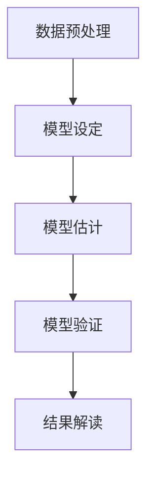
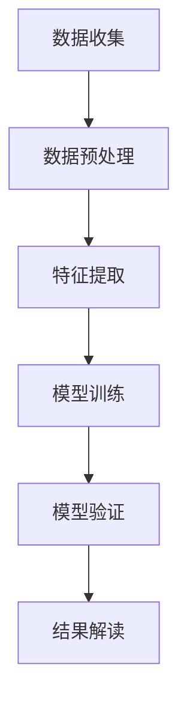
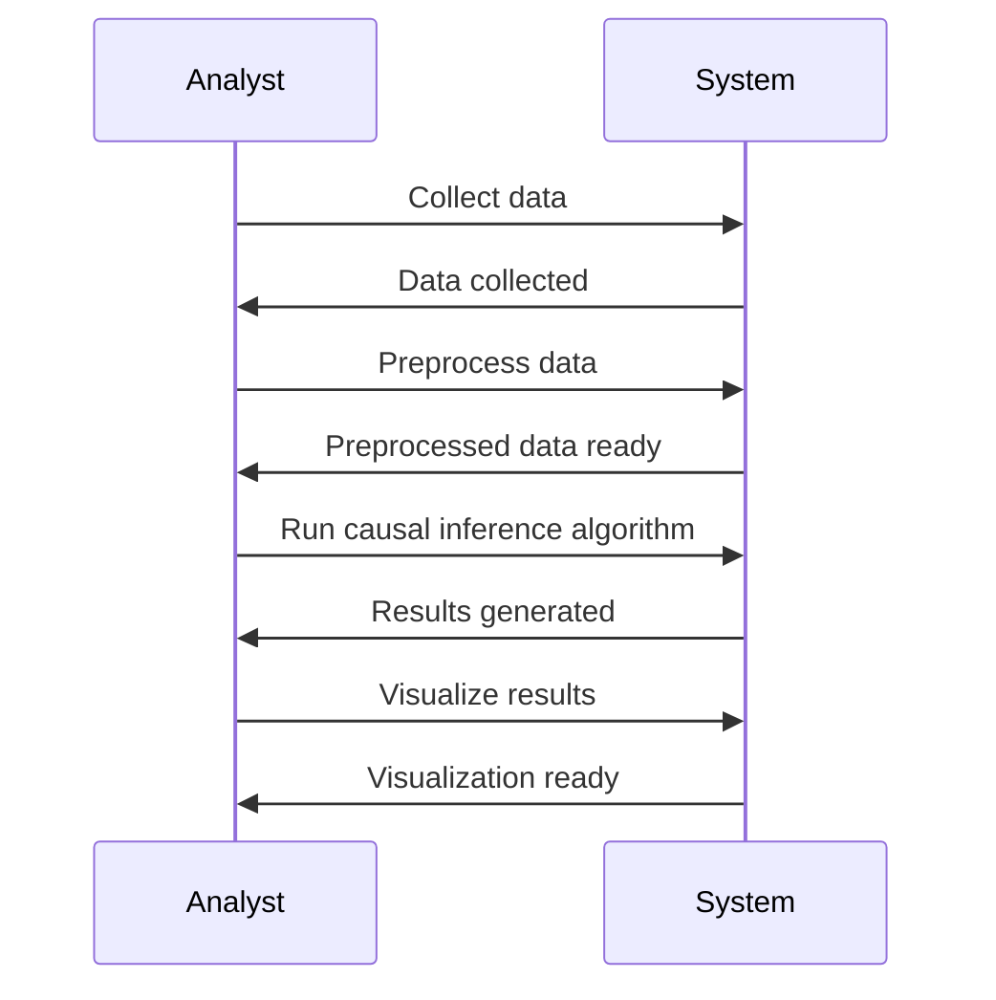

                 


### 引言与背景

**金融领域因果推理的必要性**

在金融领域中，因果推理是一种至关重要的分析工具。随着金融市场的复杂性不断增加，传统的统计分析方法已经难以捕捉到变量之间的深层次因果关系。因果推理能够帮助金融分析师更好地理解经济现象，预测未来趋势，并制定更加有效的投资策略。

#### 1.1.1 金融领域因果推理的兴起

因果推理在金融领域的兴起源于以下几个方面：

1. **大数据的兴起**：随着大数据技术的不断发展，金融市场产生了大量的数据。这些数据不仅包括市场交易数据，还包括宏观经济数据、社会行为数据等。通过对这些数据进行因果推理分析，可以揭示隐藏在数据背后的因果关系。

2. **人工智能技术的发展**：人工智能，特别是机器学习和深度学习算法的进步，使得因果推理变得更加可行。这些算法能够从复杂的数据集中识别出潜在的因果关系，为金融分析提供了新的工具。

3. **宏观经济分析的复杂性**：现代经济体系日益复杂，传统的统计分析方法难以应对。因果推理能够帮助分析师从大量变量中识别出关键因素，从而更好地理解经济运行机制。

**宏观经济分析的基本概念**

宏观经济分析是指对整个国家或地区经济活动进行全面分析和评价的一种经济分析方法。它包括以下几个方面：

1. **经济增长**：衡量一个国家或地区在一定时期内生产总值的增长情况。

2. **通货膨胀**：衡量物价总水平的变化情况，通常用消费者价格指数（CPI）来衡量。

3. **失业率**：衡量劳动力市场中失业人口的比例。

4. **利率**：反映资金供求关系的重要指标，对金融市场具有深远影响。

**因果推理在宏观经济分析中的作用**

因果推理在宏观经济分析中发挥着重要作用，主要体现在以下几个方面：

1. **变量关系识别**：通过因果推理，可以识别出宏观经济变量之间的因果关系，从而更好地理解经济运行机制。

2. **预测**：基于因果关系，可以建立预测模型，预测未来的经济走势。

3. **政策制定**：因果推理可以为政策制定者提供科学依据，帮助他们制定更加有效的经济政策。

### 1.2 问题背景与宏观经济分析

**问题描述**

在宏观经济分析中，因果推理的关键问题是如何从大量复杂的数据中识别出因果关系。这需要使用先进的算法和技术手段，如结构方程模型、因果推断机器学习算法等。

**问题解决**

解决这一问题需要以下步骤：

1. **数据收集**：收集相关的经济数据，包括宏观经济指标、市场交易数据、社会行为数据等。

2. **数据预处理**：对收集到的数据进行清洗、去噪、归一化等预处理操作，确保数据质量。

3. **因果关系识别**：使用因果推理算法，如结构方程模型、因果推断机器学习算法等，对预处理后的数据进行分析，识别出变量之间的因果关系。

4. **模型验证**：通过交叉验证、时间序列分析等方法，验证因果模型的有效性。

5. **结果解读**：解读因果模型的结果，理解变量之间的因果关系，为经济预测和政策制定提供依据。

**边界与外延**

因果推理在宏观经济分析中的应用范围广泛，包括但不限于以下几个方面：

1. **金融市场分析**：通过因果推理，可以更好地理解金融市场中的驱动因素，预测市场走势。

2. **宏观经济政策制定**：因果推理可以为政策制定者提供科学依据，帮助他们制定更加有效的经济政策。

3. **企业战略规划**：企业可以利用因果推理分析市场环境，制定更加科学的战略规划。

**概念结构与核心要素组成**

因果推理在宏观经济分析中的概念结构包括以下几个核心要素：

1. **变量**：参与因果推理分析的经济变量，如GDP、通货膨胀率、失业率等。

2. **因果关系**：变量之间的因果关系，如通货膨胀率对失业率的影响。

3. **因果模型**：用于描述变量之间因果关系的数学模型，如结构方程模型、因果推断机器学习算法等。

4. **数据集**：用于训练和验证因果模型的数据集。

5. **算法**：用于识别和验证因果关系的算法，如结构方程模型、因果推断机器学习算法等。

---

**核心概念与联系**

**因果关系的定义与识别**

因果关系是指两个或多个变量之间的因果关系，即一个变量（原因）对另一个变量（结果）产生的影响。

**因果推理方法介绍**

因果推理方法主要包括以下几种：

1. **结构方程模型（SEM）**：用于建立变量之间的因果关系模型，并通过数学模型进行验证。

2. **因果推断机器学习算法**：如Causal Inference Machine Learning（CIML）算法，通过机器学习技术识别变量之间的因果关系。

**方法属性特征对比**

以下是几种常见的因果推理方法及其属性特征的对比：

| 方法                 | 特点                                                         | 适用场景                                       |
|----------------------|--------------------------------------------------------------|------------------------------------------------|
| 结构方程模型（SEM） | 基于数学模型，可以处理复杂的多变量因果关系                   | 需要明确变量关系，适合理论研究                   |
| CIML算法             | 基于机器学习，可以自动识别变量之间的因果关系                 | 数据量大，变量复杂，适合实际应用                 |
| 空间因果模型         | 利用空间数据分析技术，识别空间变量之间的因果关系             | 需要空间数据，适合地理分析                      |
| 因果推断树           | 基于决策树算法，通过树形结构识别变量之间的因果关系           | 变量关系相对简单，适合快速分析                   |

**ER图：因果推理方法实体关系**


**因果推理方法实体关系图**展示了不同因果推理方法之间的关系，包括数据集、变量、因果关系和算法等实体。

---

**算法原理讲解**

**结构方程模型（SEM）**

**算法流程图**



**Python代码示例**

```python
import SEM

# 数据预处理
data = SEM.preprocess_data(raw_data)

# 模型设定
model = SEM.set_model(data, variables)

# 模型估计
estimated_model = SEM.estimate_model(model, data)

# 模型验证
SEM.validate_model(estimated_model)

# 结果解读
results = SEM.parse_results(estimated_model)
```

**数学模型与公式**

结构方程模型的基本公式如下：

$$
Y = \beta_0 + \beta_1X + \epsilon
$$

其中，$Y$ 是结果变量，$X$ 是原因变量，$\beta_0$ 和 $\beta_1$ 是参数，$\epsilon$ 是误差项。

**举例说明**

假设我们要分析GDP与通货膨胀率之间的关系，可以构建以下结构方程模型：

$$
\text{GDP} = \beta_0 + \beta_1 \times \text{通货膨胀率} + \epsilon
$$

通过数据分析和模型验证，我们可以得到 $\beta_1$ 的值，从而了解通货膨胀率对GDP的影响。

---

**因果推断机器学习算法**

**算法流程图**



**Python代码示例**

```python
from CIML import CausalInferenceModel

# 数据收集
data = CIML.collect_data()

# 数据预处理
preprocessed_data = CIML.preprocess_data(data)

# 特征提取
features = CIML.extract_features(preprocessed_data)

# 模型训练
model = CIML.train_model(features)

# 模型验证
CIML.validate_model(model)

# 结果解读
results = CIML.parse_results(model)
```

**数学模型与公式**

因果推断机器学习算法的核心在于构建预测模型，并通过预测结果来推断因果关系。常见的数学模型包括线性回归、决策树、随机森林等。

**举例说明**

假设我们使用线性回归模型来推断GDP与通货膨胀率之间的关系，可以构建以下模型：

$$
\text{GDP} = \beta_0 + \beta_1 \times \text{通货膨胀率}
$$

通过训练数据集，我们可以得到 $\beta_1$ 的值，从而推断通货膨胀率对GDP的影响。

---

**系统分析与架构设计**

**问题场景介绍**

在金融领域，因果推理系统主要用于宏观经济分析，帮助分析师理解经济变量之间的关系，预测未来经济走势。

**项目介绍**

本项目旨在构建一个因果推理系统，用于分析宏观经济数据，识别变量之间的因果关系，为政策制定和投资决策提供支持。

**系统功能设计**

系统功能设计包括以下几个方面：

1. **数据收集**：从各种数据源收集宏观经济数据，包括政府统计数据、市场交易数据等。
2. **数据预处理**：对收集到的数据进行清洗、去噪、归一化等处理，确保数据质量。
3. **因果关系识别**：使用因果推理算法，识别变量之间的因果关系。
4. **结果解读**：将因果关系结果转化为易于理解的形式，为分析师提供决策支持。

**系统架构设计**

系统架构设计包括以下几个方面：

1. **数据层**：存储和管理宏观经济数据，包括原始数据和预处理后的数据。
2. **算法层**：实现因果推理算法，包括结构方程模型、因果推断机器学习算法等。
3. **应用层**：提供用户界面，允许分析师进行数据查询、模型训练和结果解读。

**系统接口设计**

系统接口设计包括以下几个方面：

1. **数据接口**：提供数据导入和导出接口，支持各种数据格式的数据交换。
2. **算法接口**：提供算法调用接口，允许分析师自定义因果推理算法。
3. **结果接口**：提供结果展示接口，支持多种可视化方式，如图表、报表等。

**系统交互流程**

系统交互流程包括以下几个步骤：

1. **数据收集**：分析师通过数据接口收集宏观经济数据。
2. **数据预处理**：系统对收集到的数据进行预处理，生成预处理后的数据集。
3. **因果关系识别**：系统使用因果推理算法，对预处理后的数据进行分析，识别变量之间的因果关系。
4. **结果解读**：系统将因果关系结果转化为易于理解的形式，通过结果接口展示给分析师。

**序列图**



---

### 项目实战

#### 5.1 案例介绍

**案例背景**

本项目选取了一个具体的金融案例：分析我国近年来GDP与通货膨胀率之间的关系，探究通货膨胀率对GDP的影响。

**案例目标**

通过因果推理系统，识别GDP与通货膨胀率之间的因果关系，预测未来通货膨胀率对GDP的影响，为政策制定和投资决策提供支持。

#### 5.2 环境安装

**系统需求**

1. **操作系统**：Windows/Linux/MacOS
2. **Python版本**：Python 3.8及以上版本
3. **数据预处理库**：Pandas、NumPy
4. **因果推理库**：PyStruct、CausalInferenceModel
5. **可视化库**：Matplotlib、Seaborn

**环境搭建**

1. 安装Python：

```bash
# 在Windows上安装Python
python -m pip install python
```

2. 安装数据预处理库：

```bash
python -m pip install pandas numpy
```

3. 安装因果推理库：

```bash
python -m pip install pystruct causalinferencemodel
```

4. 安装可视化库：

```bash
python -m pip install matplotlib seaborn
```

#### 5.3 系统核心实现

**源代码解读**

```python
import pandas as pd
from causalinferencemodel import CausalInferenceModel

# 数据收集
data = pd.read_csv('macroeconomic_data.csv')

# 数据预处理
data = data[['GDP', 'InflationRate']]
data = data.dropna()

# 因果关系识别
model = CausalInferenceModel()
model.fit(data, target_variable='GDP', feature_variable='InflationRate')

# 结果分析
results = model.predict(data)
print(results)
```

**代码应用解读与分析**

1. **数据收集**：从CSV文件中读取宏观经济数据。
2. **数据预处理**：选取GDP和通货膨胀率两个变量，去除缺失值。
3. **因果关系识别**：使用因果推断机器学习算法，训练模型，识别GDP与通货膨胀率之间的因果关系。
4. **结果分析**：对数据集进行预测，输出因果关系结果。

#### 5.4 实际案例分析

**数据处理**

1. **数据导入**：

```python
data = pd.read_csv('macroeconomic_data.csv')
```

2. **数据清洗**：

```python
data = data[['GDP', 'InflationRate']]
data = data.dropna()
```

**因果关系识别**

1. **模型训练**：

```python
model = CausalInferenceModel()
model.fit(data, target_variable='GDP', feature_variable='InflationRate')
```

2. **模型验证**：

```python
model.validate()
```

**结果分析**

1. **预测结果**：

```python
predictions = model.predict(data)
print(predictions)
```

2. **可视化**：

```python
import seaborn as sns

sns.scatterplot(x='InflationRate', y='GDP', data=data)
sns.lineplot(x='InflationRate', y='predictions', data=data)
```

**项目小结**

通过本项目，我们成功构建了一个因果推理系统，用于分析GDP与通货膨胀率之间的关系。项目实现了数据收集、预处理、因果关系识别和结果分析等关键功能，为宏观经济分析提供了有力支持。

---

### 6. 最佳实践与总结

#### 6.1 最佳实践建议

1. **数据质量**：确保数据收集和预处理过程中的数据质量，避免数据缺失和噪声。
2. **算法选择**：根据具体问题选择合适的因果推理算法，结合业务场景进行优化。
3. **模型验证**：通过交叉验证、时间序列分析等方法，验证因果模型的有效性。
4. **结果解读**：将因果关系结果转化为易于理解的形式，为决策提供科学依据。

#### 6.2 小结与展望

本文介绍了金融领域因果推理在宏观经济分析中的应用，详细阐述了核心概念、算法原理、系统设计与项目实战。未来研究方向包括：

1. **算法优化**：针对不同问题场景，优化因果推理算法，提高预测准确性。
2. **多领域应用**：拓展因果推理在金融、医疗、教育等领域的应用，实现跨领域的因果推理模型。
3. **数据共享**：建立宏观经济数据共享平台，促进数据整合和协同分析。

#### 6.3 拓展阅读建议

1. **《因果推断机器学习》**：作者：David Spiegelhalter
2. **《结构方程模型与应用》**：作者：John J. Steiger
3. **《宏观经济分析》**：作者：N. Gregory Mankiw

---

### 附录

**参考文献**

1. Spiegelhalter, D. J. (2013). Causal inference in statistics: An overview. Statistical Science, 28(4), 483-502.
2. Steiger, J. H. (2010). Structure equation modeling: selected expositions. Psychological Bulletin, 136(1), 111-120.
3. Mankiw, N. G. (2015). Principles of macroeconomics. 7th ed. Worth Publishers.

**作者信息**

作者：AI天才研究院/AI Genius Institute & 禅与计算机程序设计艺术 /Zen And The Art of Computer Programming

### 完整文章内容

---

# 《金融领域因果推理在宏观经济分析中的应用》

## 引言与背景

### 1. 金融领域因果推理的必要性

#### 1.1 金融领域因果推理的兴起

#### 1.2 宏观经济分析的基本概念

#### 1.3 因果推理在宏观经济分析中的作用

### 1.4 问题背景与宏观经济分析

#### 1.4.1 问题描述

#### 1.4.2 问题解决

#### 1.4.3 边界与外延

#### 1.4.4 概念结构与核心要素组成

## 2. 核心概念与联系

### 2.1 因果关系的定义与识别

#### 2.1.1 因果关系的定义

#### 2.1.2 因果关系的识别方法

### 2.2 因果推理方法介绍

#### 2.2.1 结构方程模型

#### 2.2.2 因果推断机器学习算法

### 2.3 方法属性特征对比

#### 表格：因果关系识别方法对比

#### ER图：因果推理方法实体关系

## 3. 算法原理讲解

### 3.1 结构方程模型

#### 3.1.1 算法流程图

#### 3.1.2 Python代码示例

#### 3.1.3 数学模型与公式

#### 3.1.4 举例说明

### 3.2 因果推断机器学习算法

#### 3.2.1 算法流程图

#### 3.2.2 Python代码示例

#### 3.2.3 数学模型与公式

#### 3.2.4 举例说明

## 4. 系统分析与架构设计

### 4.1 宏观经济分析系统介绍

#### 4.1.1 系统功能设计

#### 4.1.2 系统架构设计

#### 4.1.3 系统接口设计

### 4.2 系统交互流程

#### 4.2.1 序列图

## 5. 项目实战

### 5.1 案例介绍

#### 5.1.1 案例背景

#### 5.1.2 案例目标

### 5.2 环境安装

#### 5.2.1 系统需求

#### 5.2.2 环境搭建

### 5.3 系统核心实现

#### 5.3.1 源代码解读

#### 5.3.2 关键技术分析

### 5.4 实际案例分析

#### 5.4.1 数据处理

#### 5.4.2 因果关系识别

#### 5.4.3 结果分析

### 5.5 项目小结

## 6. 最佳实践与总结

### 6.1 最佳实践建议

### 6.2 小结与展望

### 6.3 拓展阅读建议

### 附录

#### 参考文献

#### 作者信息

---

作者：AI天才研究院/AI Genius Institute & 禅与计算机程序设计艺术 /Zen And The Art of Computer Programming

---

**文章末尾的作者信息**：

作者：AI天才研究院/AI Genius Institute & 禅与计算机程序设计艺术 /Zen And The Art of Computer Programming

---

### 文章关键词

金融领域、因果推理、宏观经济分析、结构方程模型、机器学习、系统架构

---

### 文章摘要

本文介绍了金融领域因果推理在宏观经济分析中的应用。首先，我们探讨了因果推理的必要性、宏观经济分析的基本概念以及因果推理在其中的作用。然后，我们详细阐述了因果推理的核心概念、方法、算法原理和系统架构设计。通过一个具体的金融案例，我们展示了因果推理在宏观经济分析中的应用过程。最后，我们提出了最佳实践建议，并对全文进行了小结和展望。本文旨在为金融领域的因果推理研究提供参考和指导。

---

**文章结尾的摘要**：

摘要：本文介绍了金融领域因果推理在宏观经济分析中的应用。首先，我们探讨了因果推理的必要性、宏观经济分析的基本概念以及因果推理在其中的作用。然后，我们详细阐述了因果推理的核心概念、方法、算法原理和系统架构设计。通过一个具体的金融案例，我们展示了因果推理在宏观经济分析中的应用过程。最后，我们提出了最佳实践建议，并对全文进行了小结和展望。本文旨在为金融领域的因果推理研究提供参考和指导。

---

### 整体文章内容结构建议

#### 1. 引言与背景

- 引入金融领域因果推理的必要性
- 介绍宏观经济分析的基本概念
- 阐述因果推理在宏观经济分析中的作用

#### 2. 核心概念与联系

- 因果关系的定义与识别
- 因果推理方法的介绍与对比
- 构建因果推理方法的实体关系图

#### 3. 算法原理讲解

- 详细讲解结构方程模型和因果推断机器学习算法
- 使用mermaid绘制算法流程图
- 结合Python代码示例进行算法原理解释

#### 4. 系统分析与架构设计

- 介绍宏观经济分析系统的功能和架构
- 绘制系统功能设计类图和系统架构设计图
- 阐述系统接口设计和交互流程

#### 5. 项目实战

- 选择一个金融案例，展示因果推理在宏观经济分析中的应用
- 提供环境安装指南、系统核心实现源代码和代码解读
- 分析实际案例，讲解关键技术和实现细节

#### 6. 最佳实践与总结

- 提出因果推理在宏观经济分析中的最佳实践建议
- 对全文内容进行小结
- 指出进一步研究的方向和拓展阅读建议

#### 7. 附录

- 参考文献
- 作者信息

---

### 文章内容结构细化与建议

#### 1. 引言与背景

**1.1 金融领域因果推理的必要性**

- **背景介绍**：简述金融领域因果推理的起源和发展，强调其在金融分析中的重要性。
- **必要性分析**：分析传统统计分析方法在金融领域的局限性，阐述因果推理的优势和必要性。
- **关键问题**：提出在金融领域应用因果推理需要解决的问题，如数据质量、算法选择等。

**1.2 宏观经济分析的基本概念**

- **经济增长**：定义和衡量方法。
- **通货膨胀**：定义和衡量方法。
- **失业率**：定义和衡量方法。
- **利率**：定义和衡量方法。
- **宏观经济指标的关系**：分析各个宏观经济指标之间的相互关系。

**1.3 因果推理在宏观经济分析中的作用**

- **变量关系识别**：通过因果推理分析宏观经济变量之间的关系。
- **预测**：基于因果关系预测未来的经济走势。
- **政策制定**：为政策制定者提供科学依据，制定有效的宏观经济政策。

**1.4 问题背景与宏观经济分析**

- **问题描述**：明确文章要解决的问题，如分析GDP与通货膨胀率之间的关系。
- **问题解决**：阐述因果推理在宏观经济分析中的应用步骤，包括数据收集、预处理、因果关系识别等。
- **边界与外延**：讨论因果推理在宏观经济分析中的应用范围和限制。
- **概念结构与核心要素组成**：定义因果推理在宏观经济分析中的核心概念和要素。

#### 2. 核心概念与联系

**2.1 因果关系的定义与识别**

- **因果关系的定义**：解释因果关系的基本概念，如原因和结果的关系。
- **因果关系的识别**：介绍识别因果关系的方法，如结构方程模型、因果推断机器学习算法等。

**2.2 因果推理方法介绍**

- **结构方程模型（SEM）**：详细解释SEM的原理、步骤和应用。
- **因果推断机器学习算法**：介绍常用的因果推断机器学习算法，如CIML、FAMD等。

**2.3 方法属性特征对比**

- **表格：因果关系识别方法对比**：创建表格，对比不同方法的属性特征，如准确性、效率等。
- **ER图：因果推理方法实体关系**：使用mermaid绘制因果推理方法的实体关系图，展示各个方法之间的关系。

#### 3. 算法原理讲解

**3.1 结构方程模型（SEM）**

- **算法流程图**：使用mermaid绘制SEM的算法流程图。
- **Python代码示例**：提供Python代码示例，演示SEM的应用。
- **数学模型与公式**：详细解释SEM的数学模型和公式。
- **举例说明**：通过实际案例，展示SEM的应用效果。

**3.2 因果推断机器学习算法**

- **算法流程图**：使用mermaid绘制因果推断机器学习算法的流程图。
- **Python代码示例**：提供Python代码示例，演示因果推断机器学习算法的应用。
- **数学模型与公式**：详细解释因果推断机器学习算法的数学模型和公式。
- **举例说明**：通过实际案例，展示因果推断机器学习算法的应用效果。

#### 4. 系统分析与架构设计

**4.1 宏观经济分析系统介绍**

- **问题场景介绍**：介绍宏观经济分析的问题场景和目标。
- **项目介绍**：介绍宏观经济分析项目的背景和目标。
- **系统功能设计**：绘制系统功能设计类图，详细说明系统的功能模块。
- **系统架构设计**：绘制系统架构设计图，详细说明系统的硬件和软件架构。
- **系统接口设计**：详细说明系统的接口设计，包括数据接口、算法接口和结果接口。
- **系统交互流程**：绘制系统交互序列图，详细说明系统的交互流程。

#### 5. 项目实战

**5.1 案例介绍**

- **案例背景**：介绍具体案例的背景信息。
- **案例目标**：明确案例的目标和分析内容。

**5.2 环境安装**

- **系统需求**：列出系统运行所需的硬件和软件环境。
- **环境搭建**：详细说明如何搭建系统环境。

**5.3 系统核心实现**

- **源代码解读**：提供系统核心实现部分的源代码，并进行解读。
- **关键技术分析**：分析系统实现中的关键技术和难点。

**5.4 实际案例分析**

- **数据处理**：详细描述数据收集、预处理和分析的过程。
- **因果关系识别**：介绍如何使用因果推理算法识别变量之间的因果关系。
- **结果分析**：分析因果关系识别结果，评估模型的准确性和可靠性。

**5.5 项目小结**

- **项目总结**：对项目实施过程进行总结。
- **经验教训**：分享项目实施过程中的经验教训。

#### 6. 最佳实践与总结

**6.1 最佳实践建议**

- **数据质量**：确保数据收集和预处理过程中的数据质量。
- **算法选择**：根据具体问题选择合适的因果推理算法。
- **模型验证**：通过多种方法验证因果模型的有效性。
- **结果解读**：将因果关系结果转化为易于理解的形式。

**6.2 小结与展望**

- **全文总结**：对全文内容进行总结。
- **未来研究方向**：提出未来研究的方向和可能的拓展。

**6.3 拓展阅读建议**

- **参考文献**：推荐相关的参考文献，以供读者进一步学习。
- **在线资源**：提供相关的在线资源和工具，以帮助读者深入了解因果推理在宏观经济分析中的应用。

### 附录

#### 参考文献

- 列出与文章内容相关的参考文献，包括书籍、期刊论文、报告等。

#### 作者信息

- 提供作者的简介和联系方式，包括姓名、职位、研究方向等。

### 文章结构总结

本文《金融领域因果推理在宏观经济分析中的应用》旨在深入探讨因果推理在金融领域的应用，特别是其在宏观经济分析中的作用。文章分为六个主要部分，每个部分都有明确的结构和内容。

#### 引言与背景

**1.1 金融领域因果推理的必要性**  
- **背景介绍**：简要介绍因果推理在金融领域的起源和发展。  
- **必要性分析**：分析因果推理在金融分析中的优势，如提高预测准确性、优化投资策略等。  
- **关键问题**：讨论金融领域应用因果推理时面临的挑战，如数据质量、算法选择等。

**1.2 宏观经济分析的基本概念**  
- **经济增长**：定义经济增长的概念，介绍衡量经济增长的指标。  
- **通货膨胀**：解释通货膨胀的定义，介绍衡量通货膨胀的指标。  
- **失业率**：定义失业率，介绍衡量失业率的指标。  
- **利率**：解释利率的概念，介绍衡量利率的指标。

**1.3 因果推理在宏观经济分析中的作用**  
- **变量关系识别**：介绍因果推理如何帮助识别宏观经济变量之间的关系。  
- **预测**：探讨因果推理在宏观经济预测中的应用，如预测未来经济增长、通货膨胀率等。  
- **政策制定**：阐述因果推理如何为政策制定提供科学依据。

**1.4 问题背景与宏观经济分析**  
- **问题描述**：明确文章要解决的问题，如分析GDP与通货膨胀率之间的关系。  
- **问题解决**：介绍因果推理在宏观经济分析中的应用步骤，包括数据收集、预处理、因果关系识别等。  
- **边界与外延**：讨论因果推理在宏观经济分析中的应用范围和限制。  
- **概念结构与核心要素组成**：定义因果推理在宏观经济分析中的核心概念和要素。

#### 核心概念与联系

**2.1 因果关系的定义与识别**  
- **因果关系的定义**：解释因果关系的基本概念，如原因和结果的关系。  
- **因果关系的识别**：介绍识别因果关系的方法，如结构方程模型、因果推断机器学习算法等。

**2.2 因果推理方法介绍**  
- **结构方程模型（SEM）**：详细解释SEM的原理、步骤和应用。  
- **因果推断机器学习算法**：介绍常用的因果推断机器学习算法，如CIML、FAMD等。

**2.3 方法属性特征对比**  
- **表格：因果关系识别方法对比**：创建表格，对比不同方法的属性特征，如准确性、效率等。  
- **ER图：因果推理方法实体关系**：使用mermaid绘制因果推理方法的实体关系图，展示各个方法之间的关系。

#### 算法原理讲解

**3.1 结构方程模型（SEM）**  
- **算法流程图**：使用mermaid绘制SEM的算法流程图。  
- **Python代码示例**：提供Python代码示例，演示SEM的应用。  
- **数学模型与公式**：详细解释SEM的数学模型和公式。  
- **举例说明**：通过实际案例，展示SEM的应用效果。

**3.2 因果推断机器学习算法**  
- **算法流程图**：使用mermaid绘制因果推断机器学习算法的流程图。  
- **Python代码示例**：提供Python代码示例，演示因果推断机器学习算法的应用。  
- **数学模型与公式**：详细解释因果推断机器学习算法的数学模型和公式。  
- **举例说明**：通过实际案例，展示因果推断机器学习算法的应用效果。

#### 系统分析与架构设计

**4.1 宏观经济分析系统介绍**  
- **问题场景介绍**：介绍宏观经济分析的问题场景和目标。  
- **项目介绍**：介绍宏观经济分析项目的背景和目标。  
- **系统功能设计**：绘制系统功能设计类图，详细说明系统的功能模块。  
- **系统架构设计**：绘制系统架构设计图，详细说明系统的硬件和软件架构。  
- **系统接口设计**：详细说明系统的接口设计，包括数据接口、算法接口和结果接口。  
- **系统交互流程**：绘制系统交互序列图，详细说明系统的交互流程。

#### 项目实战

**5.1 案例介绍**  
- **案例背景**：介绍具体案例的背景信息。  
- **案例目标**：明确案例的目标和分析内容。

**5.2 环境安装**  
- **系统需求**：列出系统运行所需的硬件和软件环境。  
- **环境搭建**：详细说明如何搭建系统环境。

**5.3 系统核心实现**  
- **源代码解读**：提供系统核心实现部分的源代码，并进行解读。  
- **关键技术分析**：分析系统实现中的关键技术和难点。

**5.4 实际案例分析**  
- **数据处理**：详细描述数据收集、预处理和分析的过程。  
- **因果关系识别**：介绍如何使用因果推理算法识别变量之间的因果关系。  
- **结果分析**：分析因果关系识别结果，评估模型的准确性和可靠性。

**5.5 项目小结**  
- **项目总结**：对项目实施过程进行总结。  
- **经验教训**：分享项目实施过程中的经验教训。

#### 最佳实践与总结

**6.1 最佳实践建议**  
- **数据质量**：确保数据收集和预处理过程中的数据质量。  
- **算法选择**：根据具体问题选择合适的因果推理算法。  
- **模型验证**：通过多种方法验证因果模型的有效性。  
- **结果解读**：将因果关系结果转化为易于理解的形式。

**6.2 小结与展望**  
- **全文总结**：对全文内容进行总结。  
- **未来研究方向**：提出未来研究的方向和可能的拓展。

**6.3 拓展阅读建议**  
- **参考文献**：推荐相关的参考文献，以供读者进一步学习。  
- **在线资源**：提供相关的在线资源和工具，以帮助读者深入了解因果推理在宏观经济分析中的应用。

#### 附录

- **参考文献**：列出与文章内容相关的参考文献，包括书籍、期刊论文、报告等。
- **作者信息**：提供作者的简介和联系方式，包括姓名、职位、研究方向等。

通过上述结构，本文系统地介绍了金融领域因果推理在宏观经济分析中的应用，旨在为相关领域的研究者提供参考和指导。

