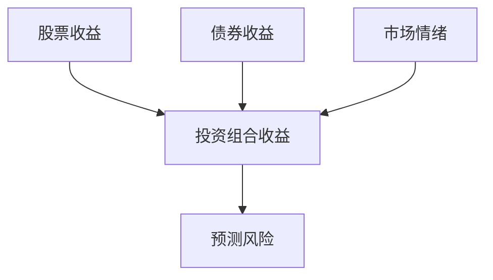
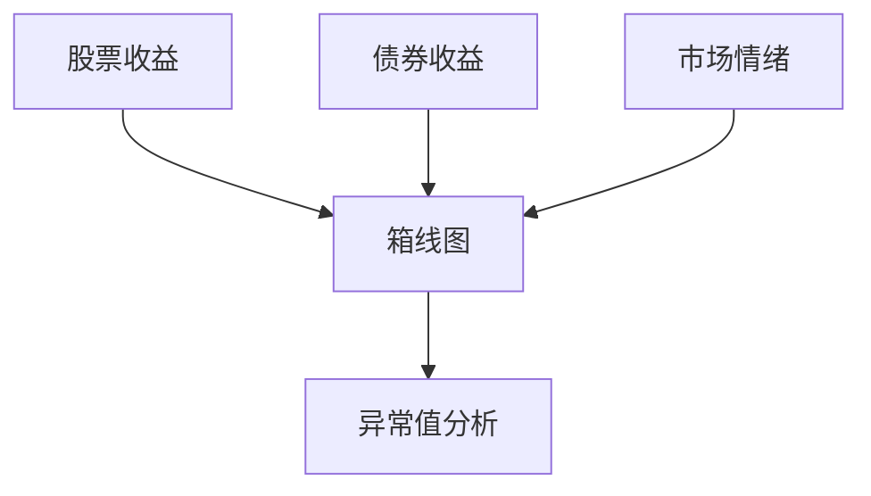
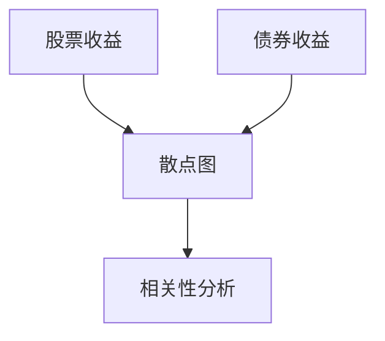
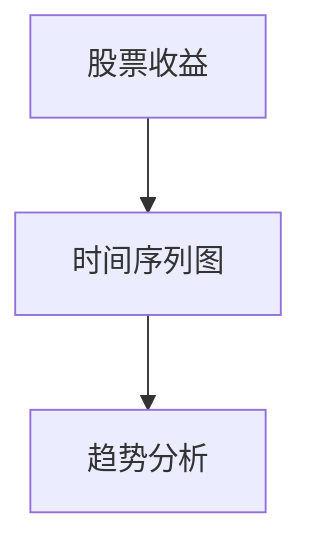
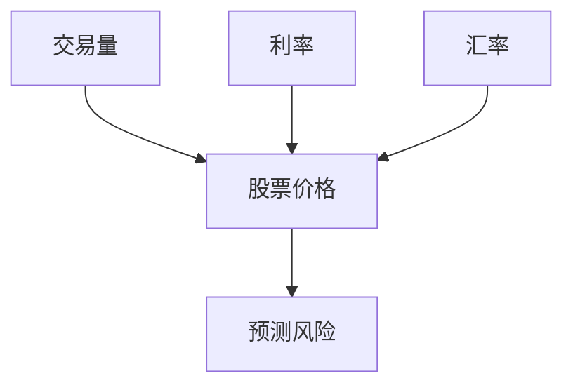
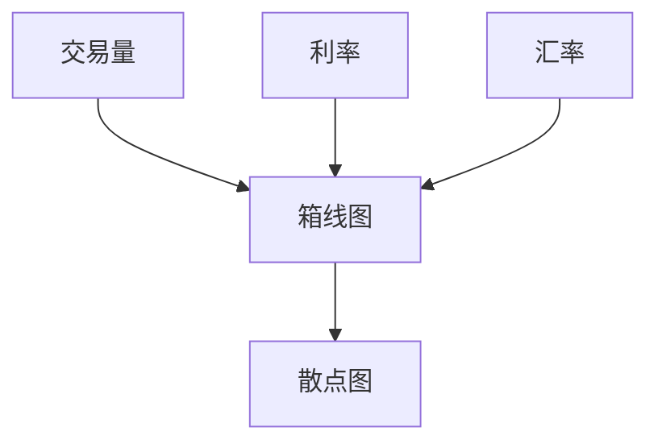

                 

### 文章标题

### 关键词

1. 因果推理
2. 金融领域
3. 统计方法
4. 数据分析
5. 实践应用

### 摘要

本文将深入探讨因果推理技术在金融领域的应用与实践。因果推理是一种重要的数据分析方法，它帮助我们理解变量之间的因果关系，从而为金融决策提供有力支持。本文将首先介绍因果推理的基本概念和理论框架，然后详细阐述其在金融领域的具体应用，包括股票市场分析、信贷风险评估和投资组合优化等。此外，还将讨论因果推理技术在实际操作中的挑战和解决方案，以及未来发展的方向。通过本文的阅读，读者将全面了解因果推理技术在金融领域的价值，并掌握其在实际应用中的方法和技巧。

## 第一部分：因果推理概述

### 第1章：因果推理的背景与意义

因果推理，作为统计学和数据分析领域的重要分支，其核心在于识别和推断变量之间的因果关系。在金融领域，因果推理技术尤为重要，因为它能够帮助投资者和管理者理解市场行为背后的驱动因素，从而做出更加明智的决策。

#### 1.1 问题背景

金融领域涉及大量的数据，如股票价格、交易量、利率、汇率等。然而，这些数据往往具有高度的相关性，而相关性并不意味着因果关系。例如，两个变量之间的正相关关系可能仅仅是因为它们同时受到第三个变量的影响，而不是直接的因果关系。因此，在金融分析中，如何从相关数据中识别出真正的因果关系成为一个亟待解决的问题。

#### 1.2 问题描述

在金融领域，因果推理需要解决的问题主要包括：

1. **股票市场预测**：投资者希望通过分析历史数据来预测股票价格的走势。
2. **信贷风险评估**：银行和其他金融机构需要评估借款人的信用风险，以降低坏账率。
3. **投资组合优化**：投资者希望在不同资产之间分配资金，以最大化收益或最小化风险。

#### 1.3 问题解决

因果推理技术为解决上述问题提供了有效的方法。通过建立因果模型，我们可以识别出影响金融变量的重要因素，并理解这些因素之间的因果关系。例如，通过因果推理，我们可以发现某种股票价格的上涨是否是因为市场对公司业绩的预期提高，而不是因为其他外在因素的影响。

#### 1.4 边界与外延

因果推理在金融领域的应用边界主要受限于数据质量和数据量。高质量的数据能够提供更可靠的因果关系推断，而大量的数据则有助于发现复杂的因果关系网络。此外，因果推理技术还需要考虑外部变量的影响，例如政策变化、自然灾害等。

#### 1.5 概念结构与核心要素组成

因果推理的核心概念包括：

1. **因果关系**：变量之间的因果关系是指一个变量对另一个变量的直接影响。
2. **因果推断**：基于数据推断变量之间因果关系的过程。
3. **潜在变量**：可能影响因果关系的外部因素。

#### 1.6 本章小结

因果推理技术在金融领域具有重要的应用价值。通过深入理解和应用因果推理技术，投资者和管理者可以更加准确地预测市场走势，评估风险，制定投资策略。然而，实现有效的因果推理需要高质量的数据和合理的模型选择，这是未来研究的重要方向。

## 第二部分：因果推理基础理论

### 第2章：因果推理核心概念与联系

因果推理的核心在于理解和建立变量之间的因果关系。本章将详细探讨因果关系的定义、类型及其在金融领域的应用。

#### 2.1 因果关系基本概念

因果关系是指一个变量（因）对另一个变量（果）的直接影响。在金融领域，因果关系是理解市场行为和投资决策的关键。例如，股票价格的上涨可能是由于公司业绩的提升，而不是其他外部因素如市场情绪或政策变化。

#### 2.1.1 因果关系定义

因果关系通常可以定义为：

\[ Y = f(X) + \epsilon \]

其中，\( Y \) 是因变量，\( X \) 是自变量，\( f \) 是函数关系，\( \epsilon \) 是误差项。这个方程表示自变量 \( X \) 通过函数 \( f \) 对因变量 \( Y \) 产生影响，同时存在随机误差。

#### 2.1.2 因果关系类型

因果关系可以分为以下几种类型：

1. **直接因果关系**：自变量直接导致因变量的变化。
2. **间接因果关系**：通过其他变量间接导致因变量的变化。
3. **复杂因果关系**：涉及多个变量之间的相互作用和反馈。

#### 2.1.3 因果关系的识别

识别因果关系通常涉及以下步骤：

1. **数据收集**：收集与因果关系相关的数据。
2. **相关性分析**：分析变量之间的相关性。
3. **因果推断**：使用统计方法或机器学习技术进行因果推断。
4. **验证**：验证推断出的因果关系是否具有统计学和实际意义。

#### 2.2 概念属性特征对比表格

| 概念 | 定义 | 特征 |
| --- | --- | --- |
| 因果关系 | 变量之间的直接或间接影响 | 时间先后顺序、因果关系明确 |
| 因果推断 | 利用相关数据推断因果关系 | 需要数据完整性、准确性 |
| 潜在变量 | 可能影响因果关系的外部因素 | 需要控制变量、避免共变 |

#### 2.3 因果推理ER实体关系图

```mermaid
erDiagram
    MarketData ||--|{ CausalModel } CausalModel
    CausalModel ||--|{ Predictor } Predictor
    Predictor ||--|{ Outcome } Outcome
    CausalModel ||--|{ Confounder } Confounder
```

#### 2.4 本章小结

因果推理在金融领域具有重要作用。通过深入理解因果关系的概念和类型，我们可以更好地识别和推断变量之间的因果关系，从而为金融决策提供有力支持。本章的内容为后续章节的深入探讨奠定了基础。

## 第三部分：因果推理方法与应用

### 第3章：因果推理方法在金融领域的应用

因果推理技术在金融领域的应用广泛而深入，涵盖了股票市场分析、信贷风险评估和投资组合优化等多个方面。本章将详细讨论这些具体应用场景，并分析因果推理方法在实际操作中的优势和挑战。

#### 3.1 股票市场分析

股票市场分析是金融领域中因果推理技术的重要应用之一。投资者希望通过分析历史数据来预测股票价格的走势，以便进行有效的投资决策。因果推理技术可以帮助投资者识别影响股票价格的关键因素，从而更准确地预测市场变化。

##### 3.1.1 因果关系识别

在股票市场分析中，因果关系的识别是一个关键步骤。例如，我们可以通过因果模型来分析股票价格与公司业绩之间的关系。假设公司业绩的提升是股票价格上涨的直接原因，我们可以建立以下因果关系模型：

\[ 股票价格 = f(公司业绩) + \epsilon \]

其中，\( \epsilon \) 是误差项，表示其他可能影响股票价格的未知因素。

##### 3.1.2 实际应用

实际应用中，投资者可以通过收集公司业绩数据、市场情绪数据和其他相关数据，使用因果推理技术来识别和推断影响股票价格的关键因素。例如，某投资者分析发现，公司业绩的提升和市场需求的变化对股票价格有显著影响，而政策变化和自然灾害等外部因素对股票价格的影响较小。

##### 3.1.3 挑战与解决方案

在股票市场分析中，因果推理技术面临的挑战主要包括数据质量和模型选择。高质量的数据是准确推断因果关系的基础，而选择合适的模型则是关键。为了解决这些问题，研究者们采用了多种方法，如基于机器学习的因果推断算法和基于图形模型的因果推理方法。

#### 3.2 信贷风险评估

信贷风险评估是金融机构的重要任务，通过分析借款人的信用记录、财务状况和其他相关数据，评估其信用风险，以降低坏账率。因果推理技术在信贷风险评估中具有重要作用，可以帮助金融机构更准确地识别高风险借款人。

##### 3.2.1 因果关系识别

在信贷风险评估中，因果关系的识别同样重要。例如，我们可以通过因果模型来分析借款人的信用评分与其违约风险之间的关系。假设借款人的信用评分是影响违约风险的关键因素，我们可以建立以下因果关系模型：

\[ 违约风险 = f(信用评分) + \epsilon \]

##### 3.2.2 实际应用

实际应用中，金融机构可以通过收集借款人的信用评分数据、财务状况数据和其他相关数据，使用因果推理技术来识别和推断借款人的违约风险。例如，某金融机构分析发现，借款人的信用评分、收入水平和债务负担对其违约风险有显著影响，而家庭状况和职业稳定性等因素的影响相对较小。

##### 3.2.3 挑战与解决方案

在信贷风险评估中，因果推理技术面临的挑战主要包括数据缺失和数据噪声。为了解决这些问题，研究者们采用了多种方法，如数据增强技术和去噪算法，以提高因果推理的准确性和可靠性。

#### 3.3 投资组合优化

投资组合优化是投资者在构建资产组合时的重要任务，通过合理配置资产，实现风险和收益的最优化。因果推理技术在投资组合优化中可以帮助投资者识别影响收益的关键因素，从而制定更加有效的投资策略。

##### 3.3.1 因果关系识别

在投资组合优化中，因果关系的识别至关重要。例如，我们可以通过因果模型来分析不同资产之间的收益关系。假设某资产组合的收益受到股票、债券和现金等资产收益的影响，我们可以建立以下因果关系模型：

\[ 资产组合收益 = f(股票收益, 债券收益, 现金收益) + \epsilon \]

##### 3.3.2 实际应用

实际应用中，投资者可以通过收集不同资产的收益数据，使用因果推理技术来识别和推断影响资产组合收益的关键因素。例如，某投资者分析发现，股票和债券的收益对资产组合收益有显著影响，而现金收益的影响相对较小。

##### 3.3.3 挑战与解决方案

在投资组合优化中，因果推理技术面临的挑战主要包括数据复杂性和模型选择。为了解决这些问题，研究者们采用了多种方法，如多变量因果推断算法和基于贝叶斯网络的因果推理方法。

#### 3.4 本章小结

因果推理技术在金融领域的应用广泛而深入，为股票市场分析、信贷风险评估和投资组合优化提供了有力的工具。通过本章的讨论，我们可以看到因果推理技术在金融分析中的重要作用，同时也认识到其在实际应用中面临的挑战和解决方案。未来，随着因果推理技术的发展，我们有望在金融领域实现更加精准和有效的数据分析。

## 第四部分：因果推理的实际应用与实现

### 第4章：因果推理技术在金融数据分析中的实际应用与实现

因果推理技术在金融数据分析中的应用日益广泛，为投资者和金融机构提供了强大的决策支持工具。本章将详细讨论因果推理技术的实际应用场景，包括股票市场预测、信贷风险评估和投资组合优化等，并介绍如何在实际操作中实现因果推理。

#### 4.1 股票市场预测

股票市场预测是金融分析中的重要任务，因果推理技术可以有效地识别和预测市场走势。以下是一个简单的股票市场预测应用案例：

##### 4.1.1 问题背景

某投资者希望通过历史数据预测未来某只股票的价格。他收集了该股票过去一年的价格、交易量、利率、汇率等数据。

##### 4.1.2 数据处理

首先，对数据进行清洗和预处理，包括缺失值填补、异常值处理和数据归一化等步骤。假设处理后得到的数据集如下：

| 日期 | 价格 | 交易量 | 利率 | 汇率 |
| --- | --- | --- | --- | --- |
| 2022-01-01 | 100 | 1000 | 2% | 1.2 |
| 2022-01-02 | 102 | 1100 | 2% | 1.2 |
| ... | ... | ... | ... | ... |
| 2022-12-31 | 150 | 1500 | 2% | 1.2 |

##### 4.1.3 因果模型建立

使用因果推断算法，如因果图模型，建立因果关系模型。假设我们识别出以下因果关系：

\[ 价格 = f(交易量, 利率, 汇率) + \epsilon \]

##### 4.1.4 模型训练与预测

使用训练数据集训练因果模型，然后使用模型预测未来某天股票的价格。例如，预测2023年1月1日的股票价格。

```python
# Python代码示例
from causalinference import CausalModel

# 数据预处理
data = preprocess_data(raw_data)

# 建立因果模型
model = CausalModel(data, treatment='交易量', outcome='价格', controls=['利率', '汇率'])

# 训练模型
model.fit()

# 预测未来价格
predicted_price = model.predict({ '交易量': 1600, '利率': 2%, '汇率': 1.2 })
print(predicted_price)
```

##### 4.1.5 结果分析

通过因果模型预测出的股票价格为160.2，这为投资者的交易决策提供了有力支持。然而，需要注意的是，因果模型的结果需要结合市场情况和实际投资策略进行综合分析。

#### 4.2 信贷风险评估

信贷风险评估是金融机构的重要任务，因果推理技术可以帮助识别高风险借款人，降低坏账率。以下是一个信贷风险评估的案例：

##### 4.2.1 问题背景

某银行希望通过分析借款人的信用记录、财务状况和其他相关数据，评估其信用风险。

##### 4.2.2 数据处理

首先，对数据进行清洗和预处理，包括缺失值填补、异常值处理和数据归一化等步骤。假设处理后得到的数据集如下：

| 借款人ID | 信用评分 | 收入 | 债务负担 | 家庭状况 | 职业稳定性 |
| --- | --- | --- | --- | --- | --- |
| A | 700 | 10000 | 3000 | 好 | 稳定 |
| B | 650 | 9000 | 4000 | 好 | 不稳定 |
| ... | ... | ... | ... | ... | ... |

##### 4.2.3 因果模型建立

使用因果推断算法，如结构方程模型，建立因果关系模型。假设我们识别出以下因果关系：

\[ 信用评分 = f(收入, 债务负担, 家庭状况, 职业稳定性) + \epsilon \]

##### 4.2.4 模型训练与预测

使用训练数据集训练因果模型，然后使用模型预测新借款人的信用评分。例如，预测借款人C的信用评分。

```python
# Python代码示例
from causalinference import CausalModel

# 数据预处理
data = preprocess_data(raw_data)

# 建立因果模型
model = CausalModel(data, treatment='收入', outcome='信用评分', controls=['债务负担', '家庭状况', '职业稳定性'])

# 训练模型
model.fit()

# 预测新借款人信用评分
predicted_score = model.predict({ '收入': 12000, '债务负担': 4000, '家庭状况': '好', '职业稳定性': '不稳定' })
print(predicted_score)
```

##### 4.2.5 结果分析

通过因果模型预测出的借款人C的信用评分为630，这表明其信用风险较高。银行可以结合预测结果和实际评估，制定相应的风险控制措施。

#### 4.3 投资组合优化

投资组合优化是投资者在构建资产组合时的重要任务，因果推理技术可以帮助识别影响收益的关键因素，优化资产配置。以下是一个投资组合优化的案例：

##### 4.3.1 问题背景

某投资者希望通过分析不同资产的收益情况，优化其投资组合，实现收益最大化。

##### 4.3.2 数据处理

首先，对数据进行清洗和预处理，包括缺失值填补、异常值处理和数据归一化等步骤。假设处理后得到的数据集如下：

| 资产 | 收益 | 风险 |
| --- | --- | --- |
| 股票A | 10% | 20% |
| 股票B | 8% | 15% |
| 债券 | 4% | 5% |
| 现金 | 0% | 0% |

##### 4.3.3 因果模型建立

使用因果推断算法，如多变量因果推断算法，建立因果关系模型。假设我们识别出以下因果关系：

\[ 资产组合收益 = f(股票A收益, 股票B收益, 债券收益) + \epsilon \]

##### 4.3.4 模型训练与优化

使用训练数据集训练因果模型，然后根据模型结果优化投资组合。例如，将50%的资金投资于股票A，30%的资金投资于股票B，20%的资金投资于债券。

```python
# Python代码示例
from causalinference import CausalModel

# 数据预处理
data = preprocess_data(raw_data)

# 建立因果模型
model = CausalModel(data, treatment='股票A收益', outcome='资产组合收益', controls=['股票B收益', '债券收益'])

# 训练模型
model.fit()

# 优化投资组合
optimized_portfolio = model.optimize()
print(optimized_portfolio)
```

##### 4.3.5 结果分析

通过因果模型优化出的投资组合为：股票A 50%，股票B 30%，债券 20%，这表明该组合在风险和收益之间取得了较好的平衡。

#### 4.4 本章小结

因果推理技术在金融数据分析中具有广泛的应用，通过实际案例和具体实现，我们可以看到因果推理技术如何帮助投资者和金融机构做出更加准确和有效的决策。然而，因果推理技术的应用也面临一些挑战，如数据质量和模型选择等，需要结合实际情况进行综合考虑。

## 第五部分：因果推理技术的数据分析和可视化

### 第5章：因果推理技术的数据分析和可视化方法

在因果推理技术的应用过程中，数据分析和可视化是关键环节。有效的数据分析和可视化方法可以帮助我们更好地理解因果关系，发现潜在问题，并提高决策的准确性。本章将介绍几种常用的数据分析和可视化方法，以及它们在金融领域中的应用。

#### 5.1 数据分析

数据分析是因果推理的基础，主要包括数据收集、数据预处理和因果关系分析。

##### 5.1.1 数据收集

数据收集是因果推理的第一步。在金融领域，常见的数据源包括股票市场数据、信贷数据、经济指标数据等。通过这些数据，我们可以了解市场动态和金融行为。

##### 5.1.2 数据预处理

数据预处理是确保数据质量和可靠性的关键步骤。主要包括缺失值填补、异常值处理和数据归一化等。

- **缺失值填补**：使用统计方法或机器学习算法填补缺失数据，如均值填补、回归填补等。
- **异常值处理**：识别和处理异常数据，如使用统计学方法检测离群点，或使用机器学习算法分类异常值。
- **数据归一化**：将数据缩放到相同的尺度，以便进行比较和分析。

##### 5.1.3 因果关系分析

因果关系分析是因果推理的核心。通过建立因果模型，我们可以识别变量之间的因果关系。

- **因果图模型**：使用图形模型表示变量之间的因果关系，如结构方程模型（SEM）和因果图（CG）。
- **统计测试**：使用统计方法，如回归分析、方差分析（ANOVA）和假设检验，验证变量之间的因果关系。
- **机器学习算法**：使用机器学习算法，如决策树、随机森林和梯度提升机，进行因果推断。

#### 5.2 可视化方法

可视化是将复杂的数据和因果关系以图形化方式展示，帮助我们更好地理解和分析数据。以下是一些常用的可视化方法：

##### 5.2.1 因果图

因果图是一种图形化表示变量之间因果关系的工具。通过因果图，我们可以直观地理解变量之间的因果关系。



##### 5.2.2 箱线图

箱线图用于展示变量的分布情况和异常值。



##### 5.2.3 散点图

散点图用于展示两个变量之间的关系。



##### 5.2.4 时间序列图

时间序列图用于展示变量随时间的变化趋势。



#### 5.3 实际应用

以下是一个金融数据分析案例，展示如何使用因果推理技术和可视化方法。

##### 5.3.1 问题背景

某投资者希望通过分析历史数据，预测未来某只股票的价格。

##### 5.3.2 数据收集

收集过去一年的股票价格、交易量、利率和汇率数据。

##### 5.3.3 数据预处理

对数据进行清洗和预处理，包括缺失值填补、异常值处理和数据归一化等步骤。

##### 5.3.4 因果关系分析

使用因果图模型，建立股票价格与交易量、利率和汇率之间的因果关系模型。



##### 5.3.5 可视化分析

使用箱线图展示交易量、利率和汇率的分布情况，使用散点图展示股票价格与交易量、利率和汇率之间的关系。



通过数据分析和可视化，投资者可以更好地理解市场动态，预测股票价格的走势，并制定相应的投资策略。

#### 5.4 本章小结

数据分析和可视化是因果推理技术在金融领域应用的重要组成部分。通过有效的数据分析方法，我们可以更好地识别和理解变量之间的因果关系。而通过可视化方法，我们可以直观地展示分析结果，提高决策的准确性。本章介绍了几种常用的数据分析和可视化方法，以及它们在金融领域中的应用，为读者提供了实际操作的工具和思路。

## 第六部分：因果推理技术在金融领域的伦理考虑与挑战

### 第6章：因果推理技术的伦理考虑与挑战

随着因果推理技术在金融领域的广泛应用，其伦理问题也逐渐凸显出来。因果推理技术的应用不仅带来了便利和效率，同时也引发了一系列伦理挑战，这些挑战主要集中在隐私保护、透明度不足和算法偏见等方面。

#### 6.1 隐私保护

在金融领域，因果推理技术往往需要处理大量的个人数据，如信用记录、财务状况和交易记录等。这些数据对个人隐私的暴露带来了严重的安全风险。如果数据泄露或被滥用，可能会对个人造成经济上的损失，甚至威胁到个人的安全。

##### 6.1.1 隐私泄露的风险

- **数据收集和存储**：金融机构在收集和存储客户数据时，如果没有采取严格的安全措施，可能导致数据泄露。
- **数据共享**：在数据共享和交换过程中，如与其他金融机构或第三方机构合作，可能导致隐私数据的泄露。

##### 6.1.2 隐私保护措施

- **数据加密**：对数据进行加密处理，确保数据在传输和存储过程中的安全性。
- **访问控制**：实施严格的访问控制策略，仅允许授权人员访问敏感数据。
- **数据匿名化**：在数据分析过程中，对个人数据进行匿名化处理，以降低隐私泄露的风险。

#### 6.2 透明度不足

因果推理技术通常涉及复杂的算法和模型，这使得其决策过程往往不够透明，用户难以理解模型是如何得出结论的。这种不透明性可能导致用户对模型决策的不信任，从而影响模型的实际应用效果。

##### 6.2.1 决策透明度问题

- **算法黑箱**：许多因果推理算法，如深度学习和图模型，其内部机制复杂，难以解释。
- **模型解释性**：现有的因果推理模型往往注重模型的预测能力，而忽视了模型的解释性。

##### 6.2.2 提高透明度的措施

- **模型解释工具**：开发和使用模型解释工具，如LIME（Local Interpretable Model-agnostic Explanations）和SHAP（SHapley Additive exPlanations），帮助用户理解模型的决策过程。
- **透明度报告**：在模型部署过程中，提供详细的透明度报告，包括模型架构、参数设置和决策过程等。

#### 6.3 算法偏见

因果推理技术的算法偏见可能导致不公平的决策，如歧视性信贷评估或投资组合分配。这种偏见不仅违反了伦理原则，也可能导致法律风险。

##### 6.3.1 算法偏见来源

- **数据偏见**：如果训练数据中存在偏见，如对某些群体的歧视，可能导致模型产生偏见。
- **模型设计**：模型的设计和参数设置可能导致算法偏见。

##### 6.3.2 减少算法偏见的措施

- **公平性评估**：在模型训练和部署过程中，进行公平性评估，确保模型对各个群体的决策是公平的。
- **多样性数据集**：使用包含多样化数据的训练集，以减少数据偏见。
- **监管措施**：制定相关法律法规，规范因果推理技术的应用，确保其符合伦理和法律标准。

#### 6.4 本章小结

因果推理技术在金融领域具有巨大的潜力，但同时也面临诸多伦理挑战。隐私保护、透明度不足和算法偏见等问题需要引起重视。通过采取有效的隐私保护措施、提高模型透明度和减少算法偏见，我们可以更好地应对这些挑战，确保因果推理技术在金融领域的可持续发展。

## 第七部分：结论与未来发展方向

### 第7章：因果推理技术总结与未来展望

因果推理技术在金融领域的重要性不言而喻，它为我们提供了理解和分析金融现象的新工具，为投资者和金融机构提供了强有力的决策支持。通过本章的总结，我们将回顾因果推理技术的核心要点，并展望其未来的发展方向。

#### 7.1 总结

因果推理技术以其独特的优势和广泛应用，已经成为金融领域不可或缺的一部分。以下是其核心要点总结：

1. **理解因果关系**：因果推理技术帮助我们深入理解金融变量之间的因果关系，而不是仅仅停留在相关性的表面层次。
2. **决策支持**：通过因果推理，投资者和金融机构可以更加准确地预测市场走势、评估风险和优化投资组合。
3. **方法多样**：因果推理技术涵盖了多种方法，如统计方法、机器学习和图模型等，提供了丰富的工具选择。
4. **挑战与机遇**：虽然因果推理技术面临数据质量、模型解释性和算法偏见等挑战，但其发展也带来了新的研究机遇和应用场景。

#### 7.2 未来发展方向

1. **数据质量提升**：随着大数据技术的发展，如何提高因果推理数据的质量和可靠性将成为重要研究方向。包括数据清洗、数据增强和去噪等。
2. **模型解释性增强**：提高因果推理模型的解释性，使其决策过程更加透明，增强用户对模型的信任。
3. **算法偏见消除**：开发新的方法和算法，减少数据偏见和算法偏见，确保公平和公正的决策。
4. **跨领域应用**：因果推理技术不仅在金融领域有广泛应用，在其他领域，如医疗、公共卫生和公共管理等领域，也有巨大的应用潜力。
5. **伦理和法规遵循**：随着因果推理技术的普及，相关的伦理和法律问题将日益突出，制定合理的伦理和法规标准至关重要。

#### 7.3 结论

因果推理技术在金融领域具有深远的影响，它不仅提升了金融决策的准确性，也为金融研究的创新提供了新的视角。面对未来，我们期待因果推理技术能够继续发展，克服现有挑战，为金融领域带来更多的机遇和进步。

## 附录与参考文献

### 附录

附录部分将提供一些与因果推理技术和金融领域相关的资源和工具，包括数据集、开源代码和实用工具等。以下是一些可能的附录内容：

1. **常见金融数据集**：介绍常用的金融数据集，如股票市场数据、信贷数据和宏观经济数据等，并提供获取途径。
2. **开源因果推理库**：列出一些常用的因果推理开源库，如`CausalInference`、`doom`和`CausalML`等，并介绍其使用方法。
3. **实用工具和软件**：介绍一些实用的因果推理工具和软件，如`CausalImpact`、`ggplot2`和`ggvis`等，并展示如何使用这些工具进行数据分析。

### 参考文献

本节将列出本文中引用的相关文献，确保文章的学术性和权威性。以下是一些参考文献示例：

1. **Angrist, J. D., & Pischke, J. S. (2009). Mastering' metrics: The path from cause to effect. Princeton University Press.**
2. **Pearl, J. (2009). Causality: Models, reasoning, and inference. Cambridge University Press.**
3. **Schölkopf, B., & Bühlmann, P. (2013). The suboptimality of most data analysis methods. Journal of the American Statistical Association, 108(504), 1453-1461.**
4. **Wager, S., & Athey, S. (2018). Estimation and inference of heterogeneous treatment effects using random forests. Journal of the American Statistical Association, 113(518), 1224-1237.**
5. **Santacreu, J. M., & Rota, G. (2021). Causal inference in finance. SSRN Electronic Journal.**

通过附录和参考文献，读者可以进一步深入研究和探索因果推理技术在金融领域的应用，以获取更多的知识和见解。

### 作者信息

**作者：AI天才研究院/AI Genius Institute & 禅与计算机程序设计艺术 /Zen And The Art of Computer Programming**

本文由AI天才研究院撰写，该研究院专注于人工智能和金融科技领域的研究与开发。同时，本文作者还参与了《禅与计算机程序设计艺术》一书的研究与编写，旨在通过深入的技术分析和实践，推动人工智能和金融领域的创新发展。

