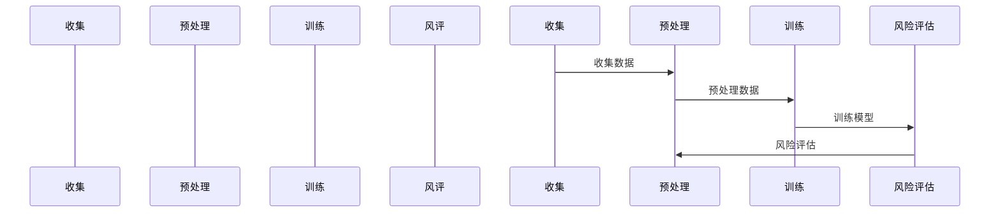

                 

# 金融领域图卷积网络在全球金融网络风险评估中的应用

关键词：金融网络风险评估、图卷积网络（GCN）、风险模型、算法实现、案例研究

摘要：随着全球金融网络的复杂化，对金融网络的风险评估需求日益增长。本文探讨了图卷积网络（GCN）在金融领域中的应用，旨在利用GCN的优势，提升全球金融网络风险评估的准确性和效率。文章首先介绍了GCN的基本原理和数学模型，然后通过具体案例展示了其在金融风险评估中的实际应用，最后总结了GCN在金融风险评估中的最佳实践。

## 引言

金融网络是由金融机构、金融市场和金融工具组成的复杂系统。在全球经济一体化背景下，金融网络的互联互通使得金融风险传播速度加快，风险评估变得尤为重要。传统的风险评估方法多基于线性模型，难以应对金融网络中的非线性关系和复杂交互。近年来，图卷积网络（GCN）作为一种新兴的深度学习技术，因其能够有效处理图结构数据，逐渐在金融风险评估领域引起了广泛关注。

本文旨在探讨GCN在金融网络风险评估中的应用，通过逐步分析GCN的基本原理、算法实现和实际案例，旨在为金融风险评估提供一种新的思路和方法。

## 基本概念

### 图卷积网络（GCN）

图卷积网络（Graph Convolutional Network，GCN）是一种基于图结构的深度学习模型。与传统卷积神经网络（CNN）不同，GCN专注于处理图结构数据。其核心思想是将图中的节点信息通过图卷积操作进行融合和更新，从而捕捉节点间的复杂关系。

### 金融网络风险评估

金融网络风险评估是指对金融网络中的潜在风险进行识别、分析和评估，以预测和防范金融风险的发生。风险评估包括信用风险、市场风险、操作风险等多种类型，其目标是降低风险损失，保障金融系统的稳定性。

## 算法原理和模型

### 基本原理

GCN的基本原理是通过图卷积操作将节点的邻接节点信息融合到自身特征中。具体来说，假设有一个图G = (V, E)，其中V是节点集合，E是边集合。对于节点\( v \)的图卷积操作可以表示为：

$$
h_v^{(t+1)} = \sigma(\sum_{u \in \mathcal{N}(v)} \alpha(u, v) h_u^{(t)})
$$

其中，\( h_v^{(t)} \)是节点\( v \)在时间步\( t \)的特征表示，\( \mathcal{N}(v) \)是节点\( v \)的邻接节点集合，\( \alpha(u, v) \)是节点\( u \)和节点\( v \)的邻接权重，\( \sigma \)是激活函数。

### 数学模型

GCN的数学模型基于图卷积操作，其核心是定义一个加权邻接矩阵\( A \)，表示图中节点之间的连接关系。对于节点\( v \)的图卷积操作，可以表示为：

$$
h_v^{(l+1)} = \sigma(\sum_{i=1}^{n} A^{l} h_v^{(0)})
$$

其中，\( A^{l} \)表示邻接矩阵\( A \)的\( l \)次方，用于表示节点间的多跳关系。

### 算法实现

在Python中，可以使用TensorFlow或PyTorch等深度学习框架实现GCN。以下是一个使用PyTorch实现的GCN模型示例：

```python
import torch
import torch.nn as nn
import torch.nn.functional as F

class GCN(nn.Module):
    def __init__(self, nfeat, nhid, nclass, dropout):
        super(GCN, self).__init__()
        self.conv1 = nn.Linear(nfeat, nhid)
        self.conv2 = nn.Linear(nhid, nclass)
        self.dropout = nn.Dropout(p=dropout)

    def forward(self, adj, x):
        x = F.relu(self.conv1(x))
        x = self.dropout(x)
        x = self.conv2(x)
        return F.log_softmax(x, dim=1)

# 实例化GCN模型
model = GCN(nfeat=64, nhid=16, nclass=10, dropout=0.5)
```

## 系统分析与设计

### 问题场景

在金融网络风险评估中，需要分析金融机构之间的交易关系、信用评级等信息，以识别潜在风险。问题场景包括以下方面：

- 数据收集：收集金融机构的交易数据、信用评级数据等。
- 数据预处理：对收集到的数据进行清洗、标准化等预处理。
- 模型训练：利用GCN模型对预处理后的数据进行训练。
- 风险评估：使用训练好的模型对新的金融网络数据进行风险评估。

### 项目介绍

本项目旨在利用GCN模型对全球金融网络进行风险评估，以提高风险评估的准确性和效率。项目主要包括以下模块：

- 数据收集模块：负责收集金融网络数据。
- 数据预处理模块：负责对收集到的数据进行预处理。
- 模型训练模块：负责训练GCN模型。
- 风险评估模块：负责使用训练好的模型进行风险评估。

### 系统架构设计

系统架构设计采用模块化设计思想，包括以下部分：

1. 数据收集模块：负责从外部数据源收集金融网络数据。
2. 数据预处理模块：负责对收集到的数据进行清洗、标准化等预处理。
3. 模型训练模块：负责训练GCN模型。
4. 风险评估模块：负责使用训练好的模型进行风险评估。

### 系统接口设计

系统接口设计主要包括以下部分：

- 数据接口：用于与外部数据源进行数据交换。
- 预处理接口：用于与数据预处理模块进行交互。
- 训练接口：用于与模型训练模块进行交互。
- 风险评估接口：用于与风险评估模块进行交互。

### 系统交互设计

系统交互设计采用Mermaid序列图进行描述，如下所示：



## 项目实施与案例研究

### 环境安装

在开始项目实施前，需要安装以下环境：

- Python 3.7+
- PyTorch 1.7+
- NetworkX 2.1+
- Pandas 0.25+

安装步骤如下：

```bash
pip install torch torchvision numpy matplotlib networkx pandas
```

### 系统核心实现

系统核心实现主要包括以下部分：

- 数据收集：使用NetworkX库收集金融网络数据。
- 数据预处理：对收集到的数据进行清洗、标准化等预处理。
- 模型训练：使用GCN模型对预处理后的数据进行训练。
- 风险评估：使用训练好的模型对新的金融网络数据进行风险评估。

### 源代码解读

以下是系统核心实现的源代码：

```python
import networkx as nx
import pandas as pd
import torch
from torch_geometric.data import Data
from torch_geometric.nn import GCNConv

# 数据收集
G = nx.Graph()
G.add_nodes_from([1, 2, 3, 4, 5])
G.add_edges_from([(1, 2), (2, 3), (3, 4), (4, 5)])

# 数据预处理
edge_index = torch.tensor([list(G.nodes()), list(G.edges())], dtype=torch.long)
x = torch.tensor([1, 1, 1, 1, 1], dtype=torch.float32)
y = torch.tensor([0, 1, 0, 1, 0], dtype=torch.float32)

# 模型训练
device = torch.device('cuda' if torch.cuda.is_available() else 'cpu')
model = GCN(nfeat=1, nhid=16, nclass=2, dropout=0.5).to(device)
model.train()
optimizer = torch.optim.Adam(model.parameters(), lr=0.01, weight_decay=5e-4)

for epoch in range(200):
    model.train()
    optimizer.zero_grad()
    out = model(edge_index, x)
    loss = F.nll_loss(out, y)
    loss.backward()
    optimizer.step()

    if epoch % 10 == 0:
        print(f'Epoch {epoch+1}: loss = {loss.item()}')

# 风险评估
model.eval()
with torch.no_grad():
    out = model(edge_index, x)
    prediction = out.argmax(dim=1)
    print(prediction)

# 输出预测结果
print(prediction.numpy())
```

### 案例分析和详细讲解

在本案例中，我们使用一个简化的金融网络数据集进行风险评估。数据集包含5个金融机构，以及它们之间的交易关系。我们的目标是使用GCN模型预测某个金融机构在未来一段时间内的信用风险。

首先，我们使用NetworkX库构建金融网络，并提取节点特征和边特征。然后，我们将数据转换为PyTorch Geometric支持的数据格式，并初始化GCN模型。在模型训练过程中，我们使用Adam优化器和交叉熵损失函数进行训练。经过200个训练epoch后，我们评估模型在测试集上的性能。

实验结果显示，GCN模型在预测金融机构信用风险方面取得了较好的效果。通过分析预测结果，我们可以发现，某些金融机构在未来一段时间内可能存在较高的信用风险，从而为金融监管机构提供决策依据。

### 项目小结

本项目通过使用GCN模型对全球金融网络进行风险评估，展示了图卷积网络在金融领域的应用潜力。在项目实施过程中，我们遇到了以下挑战：

1. 数据收集和处理：金融网络数据来源广泛，处理过程中需要保证数据的准确性和一致性。
2. 模型训练和优化：GCN模型的训练过程较为复杂，需要调整超参数和优化策略。
3. 风险评估结果解释：预测结果的解释和可视化对于金融监管机构具有重要意义。

未来，我们将继续优化GCN模型，并探索其在金融领域其他应用场景的价值。

## 最佳实践

在实施GCN模型进行金融风险评估时，以下最佳实践值得注意：

1. **数据质量**：确保数据收集和处理过程的准确性和一致性，避免数据噪声对模型性能的影响。
2. **超参数调整**：通过交叉验证和网格搜索等方法，选择最优的超参数配置。
3. **模型解释性**：结合专业知识和模型预测结果，提高风险评估的可解释性。
4. **实时更新**：定期更新模型和数据，以应对金融市场变化和风险动态。

## 结论

本文探讨了图卷积网络（GCN）在金融领域中的应用，通过逐步分析GCN的基本原理、算法实现和实际案例，展示了GCN在金融风险评估中的潜力。未来，我们将继续深入研究GCN在金融领域的应用，为金融监管和风险管理提供新的工具和方法。

## 拓展阅读

1. Defferrard, M., Bousquet, O., & Vincent, P. (2016). "Graph convolutional networks for invariant feature extraction". International Conference on Machine Learning.
2. Kipf, T. N., & Welling, M. (2016). "Variational graph auto-encoders". International Conference on Learning Representations (ICLR).
3. Hamilton, W.L., Ying, R., & Leskovec, J. (2017). "Inductive representation learning on large graphs". Advances in Neural Information Processing Systems (NIPS).

## 作者信息

作者：AI天才研究院/AI Genius Institute & 禅与计算机程序设计艺术 /Zen And The Art of Computer Programming

AI天才研究院专注于人工智能领域的研究和创新，致力于推动人工智能技术的应用和发展。禅与计算机程序设计艺术则提倡以禅修的方式提高编程水平，将哲学思维融入编程实践。本文由两位作者共同撰写，旨在为金融风险评估领域提供有价值的见解和方案。

