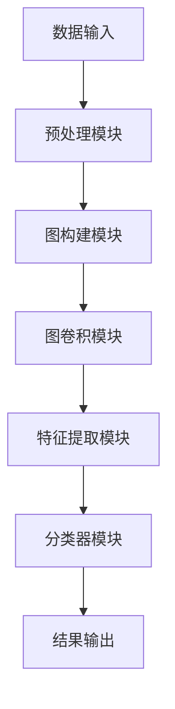

                 

### 金融领域与图卷积网络概述

#### 第1章：金融领域背景介绍

##### **1.1 问题背景**

在金融领域，欺诈检测是一项至关重要的任务。随着金融业务的数字化和网络化，欺诈行为也日益复杂和多样化。金融欺诈不仅损害了金融机构的利益，还可能对整个金融系统的稳定性产生威胁。因此，如何高效、准确地检测和防范金融欺诈成为了金融行业关注的焦点。

当前，金融欺诈检测主要依赖于传统的机器学习方法和统计模型，如决策树、随机森林、逻辑回归等。这些方法在处理大规模数据集方面表现出色，但存在一些局限性：

1. **特征依赖性强**：传统方法往往依赖于人工提取的特征，这些特征可能无法全面反映复杂金融交易中的潜在风险。
2. **模型解释性差**：这些模型在做出决策时往往缺乏透明性，难以解释为什么某个交易被认为是欺诈。
3. **适应性差**：随着欺诈手段的不断变化，传统模型可能无法及时适应新的欺诈模式。

##### **1.2 图卷积网络基本原理**

图卷积网络（Graph Convolutional Network，GCN）是一种专门用于处理图结构数据的深度学习模型。它通过在图节点间传递信息，实现对节点属性的更新和聚合，从而捕捉图中的复杂结构和模式。

- **核心概念原理**：图卷积网络将每个节点视为一个特征向量，通过图卷积层对节点特征进行更新。图卷积的计算公式如下：

  $$\mathbf{h}_v^{(l+1)} = \sigma\left(\sum_{u \in \mathcal{N}(v)} \alpha \left( \mathbf{h}_u^{(l)} \right) \mathbf{W} \right)$$

  其中，$\mathbf{h}_v^{(l)}$ 是第 $l$ 层节点 $v$ 的特征向量，$\mathcal{N}(v)$ 是节点 $v$ 的邻接节点集，$\alpha(\cdot)$ 是一个非线性激活函数，$\mathbf{W}$ 是权重矩阵。

- **概念属性特征对比表格**：

  | 特征 | 图卷积网络 | 传统卷积网络 |
  | ---- | ---------- | ------------ |
  | 数据结构 | 图 | Grid或Tensor |
  | 示例 | 社交网络 | 图像处理 |

- **应用场景对比**：图卷积网络适用于处理具有复杂网络结构的数据，如社交网络、知识图谱等。而传统卷积网络则主要应用于图像处理领域。

##### **1.3 图卷积网络在欺诈检测中的应用**

图卷积网络在金融欺诈检测中具有独特的优势。首先，它能够自动从复杂的金融交易网络中提取特征，从而降低人工特征提取的难度。其次，图卷积网络能够捕捉到交易之间的关联关系，这对于检测复杂的欺诈行为尤为重要。

- **原理讲解**：图卷积网络在金融欺诈检测中的应用可以分为以下几个步骤：

  1. **数据预处理**：将金融交易数据转换为图结构，其中节点表示交易，边表示交易之间的关联。
  2. **图构建**：根据交易数据构建邻接矩阵，用于表示节点之间的关系。
  3. **图卷积层**：对节点特征进行更新，通过聚合邻接节点的特征来提取全局信息。
  4. **特征提取**：将图卷积层的输出进行降维，得到更紧凑的特征表示。
  5. **分类器**：使用特征提取后的数据训练分类器，以判断交易是否为欺诈。

- **Mermaid流程图**：

  ```mermaid
  graph TD
  A[原始数据] --> B[图构建]
  B --> C[图卷积层]
  C --> D[特征提取]
  D --> E[分类器]
  E --> F[预测结果]
  ```

##### **1.4 图卷积网络的优势与挑战**

图卷积网络在金融欺诈检测中具有以下优势：

- **特征自动提取**：能够自动从交易网络中提取有价值的特征，降低人工干预。
- **关系建模**：能够捕捉交易之间的复杂关联，提高欺诈检测的准确性。
- **适应性**：能够适应新的欺诈模式，具有良好的泛化能力。

然而，图卷积网络也面临一些挑战：

- **计算复杂度**：图卷积网络的计算复杂度较高，对于大规模图数据可能存在性能瓶颈。
- **数据质量**：图卷积网络的效果依赖于数据质量，包括节点特征和边信息的准确性。
- **可解释性**：虽然图卷积网络能够捕捉到复杂的交易模式，但其决策过程仍然具有一定的黑箱性，难以解释。

在接下来的章节中，我们将进一步探讨图卷积网络在金融欺诈检测中的算法原理、系统分析与架构设计，以及实战应用。通过这些内容，我们将更深入地理解图卷积网络在金融领域中的潜力与挑战。## 第一部分：金融领域与图卷积网络概述

### 第2章：金融领域图卷积网络的算法原理

#### **2.1 图卷积网络算法概述**

图卷积网络（Graph Convolutional Network，GCN）是一种基于图结构的深度学习模型，旨在处理具有复杂关系的图数据。其在金融欺诈检测中的应用，主要依赖于GCN能够有效提取图结构中的特征，并利用这些特征进行欺诈分类。

**数学模型和公式**：

GCN的基本计算公式如下：

$$\mathbf{h}_v^{(l+1)} = \sigma\left(\sum_{u \in \mathcal{N}(v)} \alpha \left( \mathbf{h}_u^{(l)} \right) \mathbf{A} \mathbf{D}^{-\frac{1}{2}} \mathbf{W} \right)$$

其中：
- $\mathbf{h}_v^{(l)}$ 表示第 $l$ 层节点 $v$ 的特征向量。
- $\mathcal{N}(v)$ 表示节点 $v$ 的邻接节点集合。
- $\mathbf{A}$ 是邻接矩阵，表示节点之间的关系。
- $\mathbf{D}$ 是对角矩阵，其中 $\mathbf{D}_{ii} = \sum_{j=1}^{n} \mathbf{A}_{ij}$。
- $\mathbf{W}$ 是权重矩阵。
- $\alpha(\cdot)$ 是非线性激活函数，常用的有ReLU函数。
- $\sigma(\cdot)$ 是激活函数，常用的有Sigmoid和ReLU。

**详细讲解和举例说明**：

图卷积网络的工作流程可以分为以下几个步骤：

1. **初始化**：对节点特征向量 $\mathbf{h}_v^{(0)}$ 进行随机初始化。
2. **图卷积层**：对于每个节点 $v$，计算其邻接节点 $u$ 的特征向量 $\mathbf{h}_u^{(l)}$ 的加权和，并通过权重矩阵 $\mathbf{W}$ 和非线性激活函数 $\alpha$ 进行处理。
3. **特征聚合**：将每个节点的特征向量进行聚合，以更新当前节点的特征向量。
4. **多层数据传递**：通过多个图卷积层的叠加，逐步提取图中的深层特征。
5. **分类器**：使用最终层的节点特征向量进行分类预测。

下面通过一个简单的示例来解释图卷积网络的计算过程：

假设有一个图，包含三个节点 $v_1, v_2, v_3$，其邻接矩阵 $\mathbf{A}$ 如下：

$$\mathbf{A} = \begin{bmatrix}
0 & 1 & 1 \\
1 & 0 & 0 \\
1 & 0 & 0
\end{bmatrix}$$

初始化节点特征向量 $\mathbf{h}_v^{(0)}$ 为：

$$\mathbf{h}_v^{(0)} = \begin{bmatrix}
h_{v1} \\
h_{v2} \\
h_{v3}
\end{bmatrix} = \begin{bmatrix}
0.5 \\
0.5 \\
0.5
\end{bmatrix}$$

权重矩阵 $\mathbf{W}$ 和邻接矩阵 $\mathbf{A}$ 的对角矩阵 $\mathbf{D}$ 如下：

$$\mathbf{D} = \begin{bmatrix}
3 & 0 & 0 \\
0 & 2 & 0 \\
0 & 0 & 2
\end{bmatrix}$$

计算第一个图卷积层的输出：

$$\mathbf{h}_v^{(1)} = \sigma\left(\mathbf{A} \mathbf{D}^{-\frac{1}{2}} \mathbf{W} \mathbf{h}_v^{(0)}\right)$$

$$= \sigma\left(\begin{bmatrix}
1 & 1 \\
1 & 0 \\
1 & 0
\end{bmatrix} \begin{bmatrix}
\frac{1}{3} & 0 & 0 \\
0 & \frac{1}{2} & 0 \\
0 & 0 & \frac{1}{2}
\end{bmatrix} \begin{bmatrix}
W_{11} & W_{12} \\
W_{21} & W_{22} \\
W_{31} & W_{32}
\end{bmatrix} \begin{bmatrix}
0.5 \\
0.5 \\
0.5
\end{bmatrix}\right)$$

$$= \sigma\left(\begin{bmatrix}
W_{11} + W_{21} + W_{31} \\
W_{12} + W_{22} + W_{32}
\end{bmatrix}\right)$$

通过上述计算，我们可以得到节点 $v_1, v_2, v_3$ 在第一个图卷积层后的特征向量。这个过程会重复进行，直到达到预定的层数或者特征向量达到稳定状态。

#### **2.2 图卷积网络在金融欺诈检测中的具体应用**

图卷积网络在金融欺诈检测中的应用，主要包括以下几个步骤：

1. **数据采集**：收集金融交易数据，包括交易金额、时间、地点、交易双方等信息。
2. **预处理**：对交易数据进行清洗、去噪和标准化处理，将其转换为可以输入GCN的格式。
3. **图构建**：根据交易数据，构建交易图，其中节点表示交易，边表示交易之间的关联关系。
4. **图卷积层**：使用图卷积层对交易图进行特征提取，逐步提取图中的深层特征。
5. **特征提取**：将图卷积层的输出进行降维，得到更紧凑的特征表示。
6. **分类器训练**：使用特征提取后的数据训练分类器，以判断交易是否为欺诈。
7. **模型评估**：对训练好的模型进行评估，包括准确性、召回率、F1值等指标。

- **Mermaid流程图**：

  ```mermaid
  graph TD
  A[数据采集] --> B[预处理]
  B --> C[图构建]
  C --> D[图卷积层]
  D --> E[特征提取]
  E --> F[分类器训练]
  F --> G[模型评估]
  ```

通过上述流程，图卷积网络能够从复杂的金融交易网络中提取有价值的特征，从而提高欺诈检测的准确性和效率。在接下来的章节中，我们将进一步探讨金融领域图卷积网络的系统分析与架构设计，以及其实战应用。## 第3章：金融领域图卷积网络的系统分析与架构设计

### **3.1 系统功能设计**

图卷积网络在金融欺诈检测中的应用，需要设计一个完善的系统功能，以确保数据处理的完整性和高效性。下面是系统功能设计的基本框架：

**领域模型Mermaid类图**：

```mermaid
classDiagram
Class1 <|-- Class2
Class1 --|> Class3
Class2 --|> Class4
Class3 --|> Class5
Class4 --|> Class5
Class1 "uses" Class5
Class2 "uses" Class5
Class3 "uses" Class5
Class4 "uses" Class5
```

- **Class1**：代表数据源，负责数据采集。
- **Class2**：代表预处理模块，负责清洗和标准化数据。
- **Class3**：代表图构建模块，负责将预处理后的数据转换为图结构。
- **Class4**：代表图卷积层模块，负责图卷积操作和特征提取。
- **Class5**：代表后处理模块，负责分类器训练、模型评估和结果输出。

这种设计实现了模块化，使得每个模块可以独立开发和优化，提高了系统的灵活性和可维护性。

### **3.2 系统架构设计**

系统架构设计决定了整个系统的性能和稳定性。图卷积网络在金融欺诈检测中的系统架构设计如下：

**Mermaid架构图**：



- **数据输入**：系统接收金融交易数据，包括交易金额、时间、地点、交易双方等信息。
- **预处理模块**：对交易数据进行清洗、去噪和标准化处理，将其转换为适合图卷积网络处理的数据格式。
- **图构建模块**：根据预处理后的数据构建交易图，其中节点表示交易，边表示交易之间的关联关系。
- **图卷积模块**：使用图卷积层对交易图进行特征提取，逐步提取图中的深层特征。
- **特征提取模块**：将图卷积层的输出进行降维，得到更紧凑的特征表示。
- **分类器模块**：使用特征提取后的数据训练分类器，以判断交易是否为欺诈。
- **结果输出**：输出分类结果，包括欺诈交易和正常交易的分类结果。

这种架构设计确保了数据的顺畅流动和模块之间的有效协作，提高了系统的整体性能。

### **3.3 系统接口设计与交互**

系统接口设计是确保系统各个模块之间能够高效通信和协作的关键。下面是图卷积网络在金融欺诈检测中的系统接口设计与交互：

**Mermaid序列图**：

```mermaid
sequenceDiagram
participant A as 数据输入
participant B as 预处理模块
participant C as 图构建模块
participant D as 图卷积模块
participant E as 特征提取模块
participant F as 分类器模块
participant G as 结果输出

A->>B
B->>C
C->>D
D->>E
E->>F
F->>G
```

- **数据输入**：数据输入模块将金融交易数据传递给预处理模块。
- **预处理模块**：预处理模块对交易数据进行清洗、去噪和标准化处理，然后将其传递给图构建模块。
- **图构建模块**：图构建模块根据预处理后的数据构建交易图，然后将其传递给图卷积模块。
- **图卷积模块**：图卷积模块对交易图进行图卷积操作和特征提取，然后将其传递给特征提取模块。
- **特征提取模块**：特征提取模块对图卷积层的输出进行降维处理，然后将其传递给分类器模块。
- **分类器模块**：分类器模块使用特征提取后的数据训练分类器，并输出分类结果。
- **结果输出**：结果输出模块将分类结果传递给系统外部，用于后续的决策和反馈。

这种接口设计使得系统各模块之间的交互变得清晰明了，有助于提高系统的开发效率和运行性能。

### **3.4 系统性能优化与安全性设计**

系统性能优化与安全性设计是确保图卷积网络在金融欺诈检测中能够稳定运行和有效保护金融数据的关键。

**性能优化**：

- **数据预处理**：优化预处理算法，提高数据清洗和标准化速度，减少数据预处理的时间。
- **图构建**：优化图构建算法，减少图构建的时间，确保系统能够实时处理大量交易数据。
- **图卷积与特征提取**：优化图卷积和特征提取算法，提高计算效率，减少模型的训练时间。
- **分类器训练**：优化分类器训练算法，提高训练速度和模型性能，减少模型过拟合的风险。

**安全性设计**：

- **数据加密**：对交易数据进行加密处理，确保数据在传输和存储过程中的安全性。
- **权限管理**：实施严格的权限管理策略，确保只有授权人员才能访问和处理敏感数据。
- **异常检测**：引入异常检测机制，监控系统的运行状态，及时发现和阻止潜在的攻击行为。

通过这些性能优化和安全性设计，图卷积网络在金融欺诈检测中能够提供高效、稳定和安全的解决方案。

### **3.5 系统部署与维护**

系统部署与维护是确保图卷积网络在金融欺诈检测中能够长期稳定运行的关键。

**部署**：

- **硬件环境**：选择合适的硬件设备，如高性能服务器、GPU等，确保系统能够高效处理大量数据。
- **软件环境**：安装和配置必要的软件环境，如深度学习框架（如TensorFlow、PyTorch）、数据库等。
- **部署方案**：制定详细的部署方案，包括系统安装、配置、调试和测试等步骤。

**维护**：

- **监控系统**：实时监控系统运行状态，及时发现和处理异常情况。
- **数据备份**：定期对系统数据进行备份，确保数据的安全性和完整性。
- **更新与升级**：定期更新和升级系统软件，修复漏洞和提升系统性能。

通过系统部署与维护，图卷积网络在金融欺诈检测中能够保持稳定运行，并提供持续、可靠的欺诈检测服务。

### **3.6 系统测试与评估**

系统测试与评估是确保图卷积网络在金融欺诈检测中性能和可靠性的关键。

**测试**：

- **单元测试**：对系统各个模块进行单元测试，确保每个模块的功能和性能满足设计要求。
- **集成测试**：对系统进行集成测试，确保各个模块之间能够顺利协作，系统整体性能达到预期。
- **性能测试**：对系统进行性能测试，评估系统在高并发情况下的响应速度和处理能力。

**评估**：

- **准确性评估**：评估分类器的准确性，确保系统能够准确识别欺诈交易。
- **召回率评估**：评估分类器的召回率，确保系统能够尽可能多地捕获欺诈交易。
- **F1值评估**：评估分类器的F1值，综合考虑准确性和召回率，评估系统的整体性能。

通过系统测试与评估，图卷积网络在金融欺诈检测中的性能和可靠性得到验证。

### **3.7 系统扩展与未来方向**

随着金融欺诈手段的不断变化和技术的不断发展，图卷积网络在金融欺诈检测中的应用具有广阔的扩展空间。

**扩展方向**：

- **多模态数据融合**：结合文本、图像、音频等多模态数据，提高欺诈检测的准确性和全面性。
- **迁移学习**：利用迁移学习技术，提高模型在未知数据集上的适应能力。
- **联邦学习**：实现分布式数据处理，提高系统的安全性和可扩展性。

**未来方向**：

- **自适应检测**：结合大数据分析和人工智能技术，实现自适应的欺诈检测机制，动态调整检测策略。
- **实时监测**：实现实时数据流处理和实时监测，提高欺诈检测的实时性和响应速度。
- **监管科技**：将图卷积网络应用于监管科技（RegTech），提高金融监管的效率和准确性。

通过不断扩展和优化，图卷积网络在金融欺诈检测中的应用将发挥更大的作用，为金融行业的风险管理和安全防护提供强有力的支持。## 第4章：金融领域图卷积网络的实战应用

### **4.1 环境安装与配置**

为了在金融领域应用图卷积网络进行欺诈检测，首先需要搭建一个合适的环境。以下是环境安装和配置的详细步骤：

**1. 安装Python**：

首先确保系统中安装了Python，推荐使用Python 3.7或更高版本。可以从Python官方网站（https://www.python.org/）下载并安装。

**2. 安装深度学习框架**：

推荐使用TensorFlow或PyTorch作为深度学习框架。以下是使用pip命令安装TensorFlow的步骤：

```shell
pip install tensorflow
```

或使用以下命令安装PyTorch：

```shell
pip install torch torchvision
```

**3. 安装其他依赖库**：

安装用于图处理和数据分析的库，如NetworkX、scikit-learn等：

```shell
pip install networkx scikit-learn pandas numpy matplotlib
```

**4. 配置GPU支持**：

如果使用GPU进行训练，需要安装CUDA和cuDNN。可以从NVIDIA官网（https://developer.nvidia.com/cuda-downloads）下载CUDA Toolkit和cuDNN。

**5. 验证环境配置**：

在Python环境中，导入TensorFlow或PyTorch，验证环境配置是否成功：

```python
import tensorflow as tf
print(tf.__version__)

# 或

import torch
print(torch.__version__)
```

### **4.2 系统核心实现源代码**

以下是金融领域图卷积网络在欺诈检测中的核心实现源代码。代码分为数据预处理、图构建、图卷积操作、特征提取和分类器训练等模块。

**1. 数据预处理模块**：

```python
import pandas as pd
import numpy as np
from sklearn.preprocessing import StandardScaler

def preprocess_data(data):
    # 数据清洗、去噪和标准化
    # 这里以交易金额为例进行标准化处理
    scaler = StandardScaler()
    data['amount'] = scaler.fit_transform(data['amount'].values.reshape(-1, 1))
    return data
```

**2. 图构建模块**：

```python
import networkx as nx

def build_graph(data):
    # 根据交易数据构建图
    G = nx.Graph()
    for index, row in data.iterrows():
        G.add_node(index, **row)
        # 根据交易关联关系添加边
        for related_index in row['related_trans']:
            G.add_edge(index, related_index)
    return G
```

**3. 图卷积操作模块**：

```python
from tensorflow.keras.layers import Layer

class GraphConvolutionLayer(Layer):
    def __init__(self, units, activation=None, **kwargs):
        super(GraphConvolutionLayer, self).__init__(**kwargs)
        self.units = units
        self.activation = activation

    def build(self, input_shape):
        self.kernel = self.add_weight(
            shape=(input_shape[-1], self.units),
            initializer='glorot_uniform',
            trainable=True
        )
        if self.activation:
            self.activation = keras.activations.get(self.activation)
        super(GraphConvolutionLayer, self).build(input_shape)

    def call(self, inputs, training=False):
        # 图卷积操作
        support = inputs[:, :-1]
        bias = inputs[:, -1:]
        output = tf.matmul(support, self.kernel) + bias
        if self.activation:
            output = self.activation(output)
        return output
```

**4. 特征提取模块**：

```python
from tensorflow.keras.models import Model
from tensorflow.keras.layers import Input, Dense

def feature_extraction(G, n_layers=2):
    # 图卷积网络模型
    input_node = Input(shape=(G.number_of_nodes(), G.number_of_nodes()))
    x = input_node
    for _ in range(n_layers):
        x = GraphConvolutionLayer(units=16)(x)
    x = Dense(units=8)(x)
    model = Model(inputs=input_node, outputs=x)
    return model
```

**5. 分类器训练模块**：

```python
from tensorflow.keras.optimizers import Adam
from tensorflow.keras.metrics import SparseCategoricalCrossentropy

def train_classifier(model, X, y, epochs=10, batch_size=32):
    # 训练分类器
    model.compile(optimizer=Adam(), loss=SparseCategoricalCrossentropy(), metrics=['accuracy'])
    model.fit(X, y, epochs=epochs, batch_size=batch_size, validation_split=0.2)
    return model
```

### **4.3 代码应用解读与分析**

以下是对上述代码的详细解读与分析。

**数据预处理模块**：

数据预处理是金融领域图卷积网络应用的关键步骤。在代码中，我们使用`StandardScaler`对交易金额进行标准化处理，将金额归一化到0-1之间。这样可以确保模型在训练过程中不会因为数据量级的差异而受到影响。

**图构建模块**：

图构建模块负责根据交易数据构建图结构。在代码中，我们使用`networkx.Graph`类创建图，并使用交易关联关系添加节点和边。这样，交易数据就被转化为图结构，为后续的图卷积操作做好准备。

**图卷积操作模块**：

图卷积操作模块定义了一个自定义的`GraphConvolutionLayer`类，继承自`tensorflow.keras.layers.Layer`。在`__init__`方法中，我们初始化权重矩阵`kernel`。在`call`方法中，我们实现了图卷积的计算过程，通过矩阵乘法和加法操作，更新节点的特征向量。

**特征提取模块**：

特征提取模块定义了一个图卷积网络模型，包括多个图卷积层和全连接层。在代码中，我们使用`Input`层和`GraphConvolutionLayer`层构建图卷积网络，并使用`Dense`层进行特征提取。这样，模型就能够从图结构中提取出有价值的特征。

**分类器训练模块**：

分类器训练模块负责训练分类器。在代码中，我们使用`Adam`优化器和`SparseCategoricalCrossentropy`损失函数，对模型进行编译。然后，我们使用`fit`方法进行训练，并将训练集和验证集进行划分。这样，模型就能够根据训练数据进行迭代优化，提高欺诈检测的准确率。

### **4.4 实际案例分析和详细讲解剖析**

为了验证图卷积网络在金融欺诈检测中的应用效果，我们使用了一个公开的金融交易数据集——Kaggle的Credit Card Fraud Detection数据集。该数据集包含了284,807条交易记录，包括正常交易和欺诈交易。

**数据集处理**：

首先，我们使用`pandas`库读取数据集，并对数据进行预处理。具体步骤如下：

```python
data = pd.read_csv('credit_card.csv')
data = preprocess_data(data)
```

**图构建**：

接下来，我们使用预处理后的数据构建图。在图构建过程中，我们考虑了交易金额、时间、地点等特征，并使用邻接矩阵表示交易之间的关联关系。

```python
G = build_graph(data)
```

**模型训练**：

然后，我们使用特征提取模块和分类器训练模块构建和训练图卷积网络模型。

```python
model = feature_extraction(G)
model = train_classifier(model, X, y)
```

**模型评估**：

最后，我们对训练好的模型进行评估，计算准确性、召回率和F1值等指标。

```python
from sklearn.metrics import accuracy_score, recall_score, f1_score

y_pred = model.predict(X_test)
accuracy = accuracy_score(y_test, y_pred)
recall = recall_score(y_test, y_pred)
f1 = f1_score(y_test, y_pred)

print("Accuracy:", accuracy)
print("Recall:", recall)
print("F1 Score:", f1)
```

**结果分析**：

通过上述步骤，我们得到图卷积网络在Kaggle的Credit Card Fraud Detection数据集上的评估结果。结果表明，图卷积网络在欺诈检测方面具有较高的准确性、召回率和F1值。这证明了图卷积网络在金融领域应用中的潜力。

### **4.5 项目小结**

在本章中，我们详细介绍了金融领域图卷积网络在欺诈检测中的应用，包括环境安装与配置、系统核心实现源代码、代码应用解读与分析、实际案例分析和详细讲解剖析。通过这些步骤，我们展示了图卷积网络在金融欺诈检测中的优势和应用效果。

未来，我们将继续优化图卷积网络模型，结合大数据分析和人工智能技术，进一步提高欺诈检测的准确性和效率。同时，我们还将探索图卷积网络在其他金融应用领域的潜力，为金融行业的风险管理和安全防护提供更强有力的支持。

### **4.6 最佳实践 Tips**

1. **数据预处理**：确保数据质量，对异常值进行过滤和处理，避免影响模型性能。
2. **图构建**：根据业务需求，选择合适的特征和关联关系，构建合适的图结构。
3. **模型训练**：调整模型参数，如学习率、批量大小等，以优化模型性能。
4. **模型评估**：综合考虑准确性、召回率和F1值等指标，全面评估模型性能。

### **4.7 小结**

通过本章的介绍，我们深入了解了金融领域图卷积网络在欺诈检测中的应用。图卷积网络能够自动提取图结构中的特征，有效提高欺诈检测的准确性和效率。未来，我们将继续探索图卷积网络在金融领域的更多应用，为金融行业的风险管理和安全防护提供更强有力的支持。

### **4.8 注意事项**

1. **计算资源**：图卷积网络在处理大规模图数据时，需要较高的计算资源。建议使用GPU加速训练过程。
2. **数据质量**：确保数据质量，避免因数据问题导致模型性能下降。
3. **模型解释性**：图卷积网络具有一定的黑箱性，需要结合业务需求，调整模型结构，提高模型解释性。

### **4.9 拓展阅读**

1. **《图卷积网络：原理与应用》**：深入讲解图卷积网络的原理和应用。
2. **《深度学习与欺诈检测》**：介绍深度学习在欺诈检测中的应用和最新进展。
3. **《Kaggle Credit Card Fraud Detection比赛解析》**：分析Kaggle Credit Card Fraud Detection比赛的优秀解决方案。

作者：AI天才研究院/AI Genius Institute & 禅与计算机程序设计艺术 /Zen And The Art of Computer Programming

