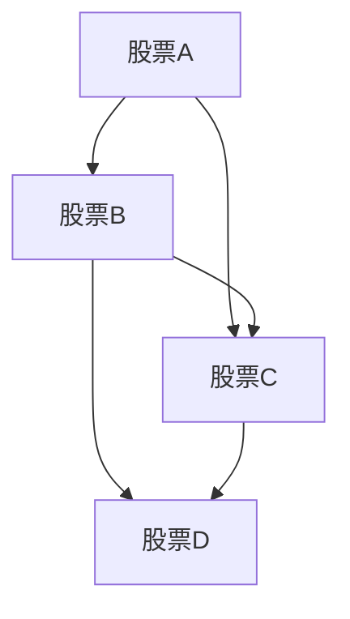
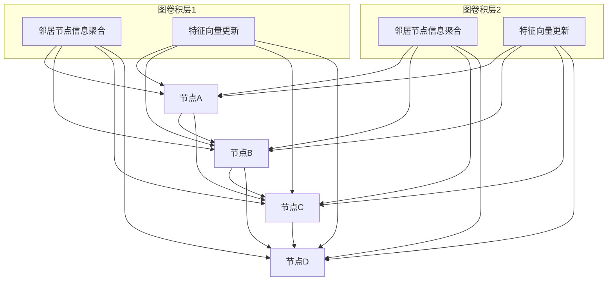
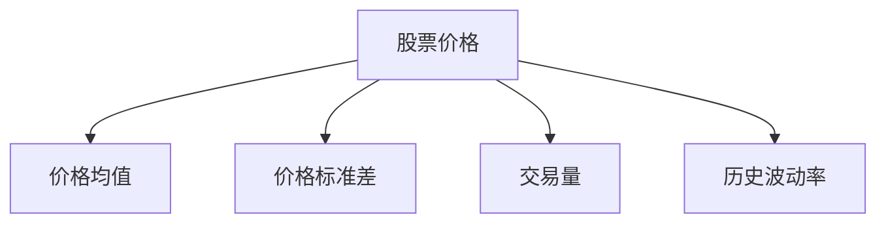
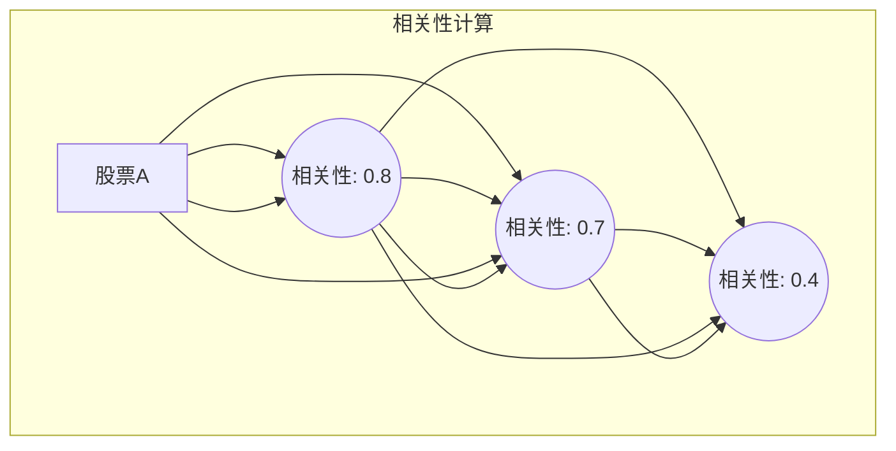
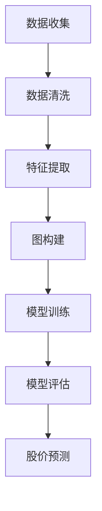
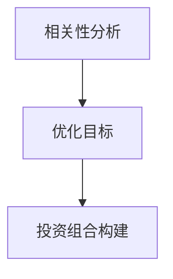
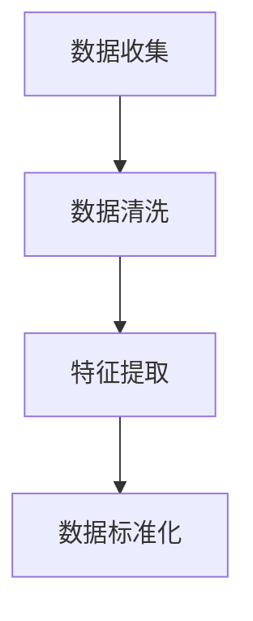
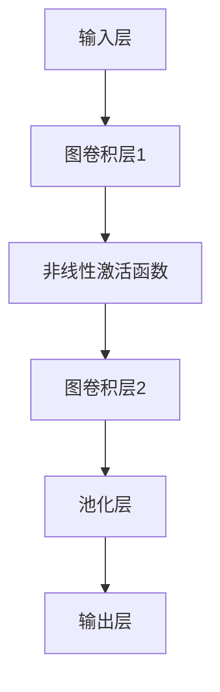
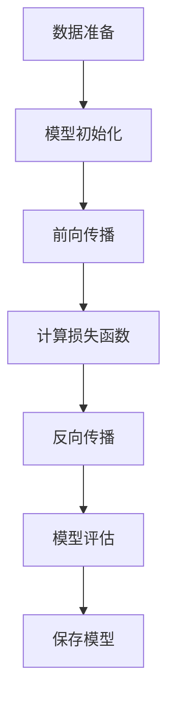
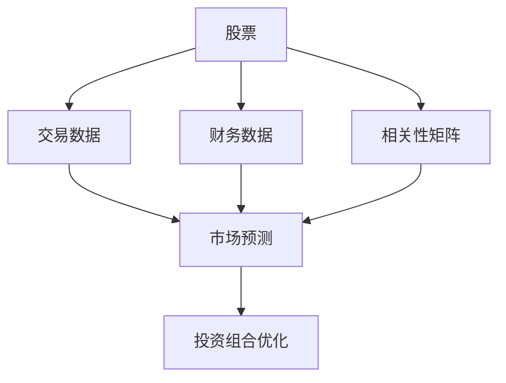

                 

### 第一部分：金融领域图卷积网络概述

#### 1.1 问题背景与核心概念

**1.1.1 金融领域股票相关性分析的需求**

在金融领域，股票相关性分析是一个重要的研究方向。通过分析不同股票之间的相关性，投资者可以更准确地把握市场的动态，制定科学的投资策略。股票相关性分析涉及的问题包括：

- 不同股票之间的价格相关性
- 行业内部和行业之间的股票相关性
- 股票与其他金融产品（如债券、基金）的相关性

进行股票相关性分析的主要原因如下：

- **风险管理**：通过分析股票间的相关性，投资者可以更全面地评估投资组合的风险，从而制定有效的风险控制策略。
- **市场预测**：股票相关性分析可以用于预测市场的走势，帮助投资者抓住市场机会。
- **投资组合优化**：投资者可以利用股票相关性分析优化投资组合，实现资产的最优配置。

**1.1.2 图卷积网络的基本概念**

图卷积网络（Graph Convolutional Network，GCN）是一种基于图结构的深度学习模型，它通过模拟图卷积操作来处理图数据。图卷积网络的核心概念包括：

- **图结构**：图卷积网络处理的是图数据，图由节点和边构成，每个节点可以表示一个实体，如股票，而边表示节点之间的关系，如股票间的相关性。
- **卷积操作**：图卷积网络通过卷积操作来整合节点及其邻居节点的信息，从而更新节点的特征。
- **深度学习**：图卷积网络结合了深度学习的优势，可以自动学习复杂的关系和模式。

**1.1.3 股票相关性分析的重要性**

股票相关性分析在金融领域具有重要的应用价值：

- **投资决策**：投资者通过分析股票相关性，可以了解市场动态，优化投资组合，提高投资回报。
- **风险管理**：股票相关性分析有助于投资者评估投资组合的风险，制定有效的风险控制策略。
- **市场预测**：股票相关性分析可以预测市场的走势，为投资者提供决策依据。

#### 1.2 图卷积网络原理

**1.2.1 图卷积网络的基本原理**

图卷积网络的基本原理可以概括为：

1. **节点特征表示**：每个节点通过其特征向量表示，这些特征可以是股票的价格、交易量等。
2. **邻居节点信息整合**：图卷积网络通过卷积操作，整合节点及其邻居节点的特征信息，更新节点的特征向量。
3. **层次化特征提取**：通过多次卷积操作，图卷积网络可以逐步提取节点的高层次特征。

**1.2.2 图卷积网络与深度学习的结合**

图卷积网络与深度学习相结合，形成了一种新的处理图数据的方法。其结合方式主要包括：

- **模型架构**：图卷积网络继承了深度学习模型的层次化特征提取能力，通过堆叠多个卷积层来提高模型的抽象能力。
- **优化算法**：图卷积网络使用了深度学习常用的优化算法，如随机梯度下降（SGD）和自适应优化算法（如Adam）。

**1.2.3 图卷积网络的优势与局限性**

图卷积网络在股票相关性分析中具有以下优势：

- **处理图数据**：图卷积网络擅长处理图数据，可以高效地提取节点和边的关系信息。
- **自适应学习**：图卷积网络可以自动学习节点特征和邻居节点关系，不需要人工指定特征。

然而，图卷积网络也存在一些局限性：

- **计算资源消耗**：图卷积网络需要大量的计算资源，特别是在处理大规模图数据时。
- **数据质量依赖**：图卷积网络的性能高度依赖于图数据的构建质量和节点特征的质量。

#### 1.3 股票相关性分析中的图卷积网络应用

**1.3.1 数据预处理与特征提取**

在进行股票相关性分析时，首先需要对数据进行预处理和特征提取：

- **数据收集**：收集股票价格、交易量、行业信息等数据。
- **数据清洗**：去除缺失值、异常值等，保证数据质量。
- **特征提取**：通过统计学方法或深度学习方法提取有用的特征。

**1.3.2 股票相关性的图构建方法**

构建股票相关性分析的图结构是关键步骤：

- **节点选择**：选择具有代表性的股票作为节点。
- **边构建**：通过股票之间的相关性计算边权重，构建图结构。

**1.3.3 图卷积网络在股票相关性分析中的应用实例**

图卷积网络在股票相关性分析中的应用实例包括：

- **股价预测**：利用图卷积网络分析股票之间的相关性，预测未来股价。
- **投资组合优化**：根据股票相关性分析结果，优化投资组合，降低风险。

#### 1.4 图卷积网络在金融领域的其他应用

**1.4.1 股票市场预测**

图卷积网络可以用于股票市场预测，通过分析历史股价数据和市场关系，预测未来股价走势。

**1.4.2 风险评估**

图卷积网络可以帮助评估金融产品的风险，通过分析不同金融产品之间的相关性，预测可能的风险事件。

**1.4.3 社交网络分析**

图卷积网络可以应用于社交网络分析，通过分析用户关系，识别潜在的用户群体和趋势。

#### 1.5 本章小结

本章介绍了金融领域股票相关性分析的需求、图卷积网络的基本原理和应用。通过图卷积网络，可以更有效地分析股票相关性，为投资者提供决策支持。然而，图卷积网络也存在一些局限性，需要结合实际应用场景进行优化。

### 1.6 关键词

- 金融领域
- 股票相关性分析
- 图卷积网络
- 数据预处理
- 特征提取

### 1.7 摘要

本文介绍了金融领域图卷积网络在股票相关性分析中的应用，探讨了图卷积网络的基本原理和实现方法，并通过实例展示了其在股价预测和投资组合优化方面的应用价值。本文旨在为金融领域的读者提供深入了解图卷积网络和其在实际应用中的使用方法。

## 1.2 图卷积网络原理

图卷积网络（Graph Convolutional Network，GCN）是深度学习领域中的一种重要模型，主要用于处理图结构数据。在介绍图卷积网络的具体原理之前，我们需要理解几个关键概念，包括图结构、节点特征和图卷积操作。

### 1.2.1 图结构

图结构是图卷积网络的基础，它由节点（也称为顶点）和边组成。在金融领域，每个节点可以表示一种股票，而边则表示股票之间的相关性。图结构可以直观地表示复杂的关系网络，如图1.1所示。

**图1.1：图结构示例**



在这个示例中，A、B、C和D表示股票，边表示它们之间的相关性。通过图结构，我们可以更好地理解股票之间的相互作用和影响。

### 1.2.2 节点特征

节点特征是图卷积网络的输入信息，它描述了每个节点的属性。在股票相关性分析中，节点特征可能包括股票的价格、交易量、历史波动率等。这些特征可以通过数据预处理和特征提取技术获取。图1.2展示了如何为每个节点分配特征向量。

**图1.2：节点特征向量示例**

```mermaid
graph TB
A[股票A]((价格: 100, 交易量: 1000, 波动率: 0.1))
B[股票B]((价格: 120, 交易量: 800, 波动率: 0.2))
C[股票C]((价格: 110, 交易量: 900, 波动率: 0.15))
D[股票D]((价格: 130, 交易量: 700, 波动率: 0.18))
```

在这个示例中，每个节点的特征向量包含价格、交易量和波动率三个维度。这些特征向量将作为图卷积网络的输入。

### 1.2.3 图卷积操作

图卷积操作是图卷积网络的核心，它通过整合节点及其邻居节点的信息来更新节点的特征向量。图卷积操作可以分为以下几个步骤：

1. **邻居节点信息聚合**：首先，计算每个节点的邻居节点特征的平均值，如公式（1）所示。

   $$ h_{ij}^{\prime} = \frac{1}{k_j} \sum_{i \in \mathcal{N}(j)} W_{ij} h_i $$

   其中，$h_{ij}^{\prime}$表示节点j通过聚合邻居节点i的特征得到的更新特征，$\mathcal{N}(j)$表示节点j的邻居节点集合，$W_{ij}$表示节点i到节点j的边权重，$h_i$表示节点i的特征向量。

2. **特征向量更新**：通过聚合邻居节点的信息，得到节点的更新特征向量。这个过程可以表示为：

   $$ h_j = \sigma (h_j^{\prime} + \theta_j) $$

   其中，$\sigma$表示激活函数，如ReLU或Sigmoid函数，$\theta_j$表示节点j的初始特征向量。

3. **多次卷积操作**：为了提取更高级别的特征，图卷积网络通常采用多层卷积操作。每次卷积操作都会更新节点的特征向量。

图1.3展示了图卷积操作的过程。

**图1.3：图卷积操作过程**



在这个示例中，图卷积网络通过两次卷积操作，逐步提取节点的高层次特征。每次卷积操作都会更新节点的特征向量，使得节点能够捕捉到更复杂的图结构信息。

### 1.2.4 图卷积网络的优势与局限性

图卷积网络在股票相关性分析中具有以下优势：

1. **强大的特征提取能力**：图卷积网络能够自动学习节点和边的关系，提取出有用的特征，为股票相关性分析提供强有力的支持。
2. **适用于复杂图结构**：图卷积网络可以处理具有复杂结构的图数据，如社交网络、知识图谱等，这使得它成为处理金融领域图数据的理想工具。
3. **可解释性强**：图卷积网络通过聚合邻居节点的信息来更新特征向量，使得模型的可解释性更强，便于理解股票之间的相关性。

然而，图卷积网络也存在一些局限性：

1. **计算资源消耗大**：图卷积网络需要大量的计算资源，特别是在处理大规模图数据时，这可能导致模型训练时间过长。
2. **对数据质量依赖高**：图卷积网络的性能高度依赖于图数据的构建质量和节点特征的质量，如果数据存在噪声或缺失值，可能会导致模型性能下降。

### 1.2.5 图卷积网络的应用场景

图卷积网络在金融领域具有广泛的应用场景，包括：

1. **股票相关性分析**：通过分析股票之间的相关性，投资者可以制定更科学的投资策略，降低风险。
2. **市场预测**：利用图卷积网络分析历史市场数据，预测未来市场走势，为投资者提供决策依据。
3. **风险评估**：通过分析金融产品之间的相关性，评估投资组合的风险，制定有效的风险管理策略。

总之，图卷积网络在股票相关性分析中具有巨大的应用潜力，通过本章的介绍，我们对其基本原理和应用有了更深入的了解。

### 1.3 股票相关性分析中的图卷积网络应用

图卷积网络在股票相关性分析中的应用具有重要意义，它能够通过分析股票之间的复杂关系，为投资者提供有效的决策支持。本节将详细讨论如何使用图卷积网络进行股票相关性分析，包括数据预处理与特征提取、图的构建方法以及图卷积网络在具体应用中的实例。

#### 1.3.1 数据预处理与特征提取

在进行股票相关性分析之前，首先需要对数据进行预处理和特征提取。这一步骤至关重要，因为数据的质量直接影响到后续分析的效果。以下是一些关键步骤：

1. **数据收集**：收集与股票相关性分析相关的数据，包括股票价格、交易量、历史波动率、行业信息等。这些数据可以从金融数据提供商如Yahoo Finance、Alpha Vantage等获取。

2. **数据清洗**：清洗数据中的缺失值、异常值和噪声数据，确保数据质量。例如，可以使用均值填充缺失值、使用中位数替换异常值等方法。

3. **特征提取**：从原始数据中提取有用的特征。这些特征可以是股票价格的某种统计指标（如平均值、标准差），或者是基于时间序列的复杂特征（如自回归移动平均模型ARIMA的特征提取）。图1.4展示了特征提取的示例。

**图1.4：特征提取示例**



在这个示例中，从股票价格数据中提取了价格均值、价格标准差、交易量和历史波动率等特征。

#### 1.3.2 图的构建方法

构建股票相关性分析中的图结构是关键步骤。以下是一些常用的构建方法：

1. **节点选择**：选择具有代表性的股票作为节点。这些股票可以是特定行业的主要股票，也可以是根据某些标准筛选出来的股票。

2. **边构建**：通过计算股票之间的相关性，构建边的权重。股票之间的相关性可以使用皮尔逊相关系数、斯皮尔曼等级相关系数等方法计算。图1.5展示了股票之间的边权重计算方法。

**图1.5：边权重计算示例**



在这个示例中，A、B、C和D是股票，边权重是根据股票之间的皮尔逊相关系数计算得出的。

3. **图结构优化**：为了提高分析效果，可以对图结构进行优化。例如，可以去除权重较小的边，或者通过邻接矩阵的谱聚类方法对图进行降维。

#### 1.3.3 图卷积网络在股票相关性分析中的应用实例

图卷积网络在股票相关性分析中的应用实例包括股价预测和投资组合优化。

1. **股价预测**：通过训练图卷积网络，可以预测股票未来的价格走势。具体步骤如下：

   - **模型训练**：使用历史股票价格数据训练图卷积网络，通过多次迭代优化模型参数。
   - **模型评估**：使用交叉验证方法评估模型性能，选择最优模型。
   - **股价预测**：使用训练好的模型预测未来股价，为投资者提供决策依据。

   图1.6展示了股价预测的流程。

**图1.6：股价预测流程**



2. **投资组合优化**：通过分析股票之间的相关性，可以优化投资组合，降低风险。具体步骤如下：

   - **相关性分析**：使用图卷积网络分析股票之间的相关性，得到相关性矩阵。
   - **优化目标**：根据投资目标（如最大化收益、最小化风险）制定优化策略。
   - **投资组合构建**：使用优化策略构建投资组合，实现资产的最优配置。

   图1.7展示了投资组合优化的流程。

**图1.7：投资组合优化流程**



通过以上实例，我们可以看到图卷积网络在股票相关性分析中的应用潜力。它不仅能够预测股价，还能优化投资组合，为投资者提供有力支持。

#### 1.4 图卷积网络在金融领域的其他应用

图卷积网络在金融领域的应用不仅仅局限于股票相关性分析，它在多个方面都展现出了强大的潜力。以下是一些典型的应用场景：

**1.4.1 股票市场预测**

股票市场预测是金融领域中一个重要的研究方向。图卷积网络可以通过分析历史股价数据和市场关系，预测未来股价走势。具体应用方法包括：

- **时间序列分析**：利用图卷积网络分析股票价格的时间序列特征，预测未来股价。
- **交叉市场分析**：通过分析不同市场之间的相关性，预测交叉市场的股价走势。

**1.4.2 风险评估**

在金融市场中，风险评估是一个关键环节。图卷积网络可以用于评估金融产品的风险，通过分析不同金融产品之间的相关性，预测可能的风险事件。具体应用方法包括：

- **投资组合风险评估**：通过分析投资组合中股票之间的相关性，评估投资组合的整体风险。
- **信用风险评估**：通过分析借款人及其关联方的图结构，评估借款人的信用风险。

**1.4.3 社交网络分析**

社交网络分析是另一个图卷积网络的重要应用领域。通过分析用户关系，可以识别潜在的用户群体和趋势。具体应用方法包括：

- **用户社区识别**：通过分析用户之间的互动关系，识别社交网络中的用户社区。
- **趋势分析**：通过分析社交网络中的信息传播路径，识别流行趋势和热点话题。

**1.4.4 金融市场监测**

金融市场监测是确保金融市场稳定的重要手段。图卷积网络可以通过分析金融市场数据，监测市场异常行为。具体应用方法包括：

- **异常检测**：通过分析股票价格、交易量等数据，识别市场中的异常交易行为。
- **风险评估**：通过分析金融市场的结构变化，预测潜在的市场风险。

**1.4.5 智能投资顾问**

智能投资顾问是金融科技领域的一个新兴方向。图卷积网络可以通过分析用户投资行为和市场数据，为投资者提供个性化的投资建议。具体应用方法包括：

- **投资策略推荐**：根据用户的投资偏好和市场数据，推荐适合的投资策略。
- **风险控制**：通过分析投资组合的风险，提供有效的风险控制建议。

总之，图卷积网络在金融领域的应用非常广泛，从股票相关性分析到市场预测、风险评估，再到社交网络分析和金融市场监测，图卷积网络都展现出了强大的潜力。通过不断探索和创新，图卷积网络将为金融领域带来更多应用价值。

### 1.5 本章小结

本章详细介绍了金融领域图卷积网络的基本原理及其在股票相关性分析中的应用。首先，我们探讨了股票相关性分析的需求和图卷积网络的基本概念。接着，我们详细阐述了图卷积网络在股票相关性分析中的应用方法，包括数据预处理与特征提取、图的构建方法以及具体应用实例。此外，我们还介绍了图卷积网络在金融领域的其他应用，如股票市场预测、风险评估、社交网络分析和金融市场监测。通过本章的学习，读者可以深入理解图卷积网络在金融领域的应用价值，并为后续研究提供参考。关键词包括：金融领域、股票相关性分析、图卷积网络、数据预处理、特征提取。

## 1.6 关键词

- **金融领域**
- **股票相关性分析**
- **图卷积网络**
- **数据预处理**
- **特征提取**
- **市场预测**
- **风险评估**
- **社交网络分析**
- **金融市场监测**

## 1.7 摘要

本文围绕金融领域图卷积网络在股票相关性分析中的应用展开讨论，从基本原理、应用方法到具体实例进行了全面介绍。文章首先阐述了股票相关性分析的需求和图卷积网络的基本概念，然后详细描述了数据预处理与特征提取、图的构建方法以及图卷积网络在股票相关性分析中的实际应用。此外，文章还介绍了图卷积网络在金融领域的其他应用场景，如股票市场预测、风险评估、社交网络分析和金融市场监测。通过本文，读者可以深入了解图卷积网络在金融领域的广泛应用和巨大潜力。

### 2.1 数据收集与预处理

在进行图卷积网络（GCN）的股票相关性分析之前，数据收集与预处理是至关重要的步骤。这一阶段的质量直接影响到后续模型训练和预测的准确性。以下将详细讨论数据收集、数据清洗和特征提取这三个关键步骤。

#### 2.1.1 数据收集

股票相关性分析所需的数据可以从多个来源获取，包括金融数据提供商、公开数据库和金融新闻等。以下是常见的数据类型：

1. **股票价格数据**：包括开盘价、收盘价、最高价、最低价和交易量等。这些数据通常以时间序列的形式提供，是股票相关性分析的重要输入。
2. **市场指数数据**：如上证指数、深证指数等，可以用于分析市场整体走势与个股的关系。
3. **财务数据**：如公司的盈利报告、营收数据、市盈率等，可以提供公司的基本面信息。
4. **新闻和舆情数据**：通过分析金融新闻和社交媒体上的舆情，可以捕捉到市场情绪的变化。

常用的数据来源包括：

- **金融数据提供商**：如Yahoo Finance、Google Finance、Alpha Vantage等，提供丰富的股票历史数据。
- **公开数据库**：如新浪财经、同花顺等，提供实时的股票行情和财务数据。
- **金融新闻网站**：如新浪财经、华尔街日报等，提供最新的金融新闻和舆情数据。

#### 2.1.2 数据清洗

收集到的数据通常包含噪声、缺失值和异常值，需要进行数据清洗以确保数据质量。以下是一些常用的数据清洗方法：

1. **缺失值处理**：对于缺失值，可以使用以下方法：
   - **删除**：删除缺失值较多的数据点，但这种方法可能导致数据丢失。
   - **填充**：使用均值、中位数、众数等方法填充缺失值。例如，可以使用前N个时间点的平均值来填充缺失的价格数据。
   - **插值**：使用插值方法（如线性插值、高斯插值）填补缺失值。

2. **异常值检测与处理**：异常值可能来自数据收集过程中的错误或真实的市场波动。常用的方法包括：
   - **统计学方法**：如箱线图、Z分数、IQR（四分位距）等。
   - **基于距离的方法**：如DBSCAN聚类算法，可以识别出离群点。
   - **基于规则的方法**：根据业务逻辑设定规则，如交易量超过3倍标准差的数据视为异常值。

3. **重复数据删除**：删除重复的数据记录，保证数据的唯一性。

#### 2.1.3 特征提取

特征提取是将原始数据转换为可用于模型训练的向量表示的过程。以下是常用的特征提取方法：

1. **时间序列特征**：从时间序列数据中提取特征，如：
   - **移动平均**：计算一段时间内股票价格的平均值，可以平滑时间序列数据。
   - **自回归移动平均模型（ARIMA）**：通过自回归和移动平均模型提取时间序列的特征，如滞后项、差分项等。
   - **周期特征**：提取股票价格数据的周期特征，如交易日、工作日、节假日前后的波动等。

2. **统计特征**：计算股票价格和交易量的各种统计指标，如：
   - **均值**、**中位数**、**标准差**、**最大值**、**最小值**等。
   - **偏度和峰度**：描述股票价格分布的偏斜和尖峰特征。

3. **技术指标**：从技术分析中提取常用指标，如：
   - **相对强弱指数（RSI）**：衡量股票价格的超买或超卖状态。
   - **移动平均收敛发散指标（MACD）**：描述短期和长期移动平均线之间的关系。
   - **布林带**：通过计算标准差，确定股票价格的高低界限。

4. **文本特征**：从金融新闻和舆情数据中提取特征，如：
   - **词频**：统计新闻中特定词汇的出现频率。
   - **主题模型**：使用LDA（Latent Dirichlet Allocation）提取新闻的主题特征。
   - **情感分析**：使用情感词典或机器学习模型提取新闻的情感倾向。

#### 2.1.4 数据预处理流程

数据预处理流程可以概括为以下几个步骤：

1. **数据收集**：从不同来源获取股票价格、财务数据、新闻和舆情数据等。
2. **数据清洗**：处理缺失值、异常值和重复数据，保证数据质量。
3. **特征提取**：计算时间序列特征、统计特征、技术指标和文本特征等。
4. **数据标准化**：将不同特征缩放到相同的尺度，如使用标准归一化或最小-最大缩放。

图2.1展示了数据预处理流程。

**图2.1：数据预处理流程**



通过以上的数据收集、数据清洗和特征提取步骤，我们为后续的图卷积网络训练和预测打下了坚实的基础。

### 2.2 图卷积网络架构设计

图卷积网络（Graph Convolutional Network，GCN）是一种专门用于处理图结构数据的深度学习模型。在股票相关性分析中，GCN通过模拟图卷积操作来提取节点特征和边关系，从而实现股票相关性分析。本节将详细介绍GCN的基本架构、调整与优化方法以及损失函数与优化算法。

#### 2.2.1 图卷积网络的基本架构

图卷积网络的基本架构可以分为以下几个部分：

1. **输入层**：输入层接收节点的特征向量，这些特征向量通常是从数据预处理阶段提取得到的。例如，股票价格、交易量和历史波动率等。

2. **图卷积层**：图卷积层是GCN的核心部分，它通过图卷积操作来整合节点及其邻居节点的信息，更新节点的特征向量。图卷积层可以堆叠多层，以提高模型的抽象能力和特征表达能力。

3. **非线性激活函数**：在图卷积层之后，通常添加非线性激活函数，如ReLU函数，以增加模型的非线性表达能力。

4. **池化层**：在某些情况下，为了降低模型的复杂性或减少过拟合，可以在GCN中添加池化层。池化层通过聚合节点的特征向量，减少模型参数。

5. **输出层**：输出层通常是全连接层，用于预测任务，如股票价格预测或投资组合优化。输出层的激活函数取决于具体的预测任务，例如，对于二分类问题，可以使用softmax函数。

图2.2展示了GCN的基本架构。

**图2.2：图卷积网络的基本架构**



#### 2.2.2 调整与优化网络结构

为了提高GCN的性能和泛化能力，可以对网络结构进行调整和优化。以下是一些常见的调整与优化方法：

1. **多层图卷积**：通过增加图卷积层的层数，可以逐步提取更高层次的特征。多层图卷积可以帮助模型更好地理解复杂的图结构。

2. **边权重调整**：在GCN中，边权重决定了节点特征整合的程度。通过调整边权重，可以增强或减弱节点之间的连接强度，从而影响模型的表现。

3. **嵌入层**：在输入层添加嵌入层，可以将节点特征映射到低维空间，有助于提高模型的效率和表达能力。

4. **注意力机制**：引入注意力机制，可以让模型在处理节点特征时，更加关注重要的邻居节点。注意力机制可以显著提高模型的性能。

5. **正则化**：为了防止过拟合，可以添加正则化项，如L1正则化、L2正则化或dropout。正则化可以降低模型的复杂度，提高泛化能力。

6. **数据增强**：通过数据增强方法，如数据变换、噪声注入等，可以增加数据的多样性，提高模型的鲁棒性。

#### 2.2.3 损失函数与优化算法

在GCN中，损失函数用于衡量预测结果与真实值之间的差距，优化算法则用于调整模型参数，以最小化损失函数。以下是常用的损失函数和优化算法：

1. **损失函数**：
   - **均方误差（MSE）**：用于回归任务，计算预测值与真实值之间的平均平方误差。
   - **交叉熵损失（Cross-Entropy Loss）**：用于分类任务，计算预测概率与真实标签之间的交叉熵。
   - **对抗性损失**：在生成对抗网络（GAN）中，对抗性损失用于衡量生成器与鉴别器之间的对抗性。

2. **优化算法**：
   - **随机梯度下降（SGD）**：是最常用的优化算法，通过随机梯度更新模型参数。
   - **Adam优化器**：结合了SGD和RMSProp的优点，能够自适应调整学习率。
   - **AdaGrad**：根据每个参数的历史梯度进行自适应调整学习率。

#### 2.2.4 图卷积网络的工作流程

图卷积网络的工作流程可以分为以下几个步骤：

1. **初始化模型参数**：随机初始化模型参数，包括权重和 biases。
2. **前向传播**：输入节点的特征向量经过图卷积层和非线性激活函数的处理，逐步更新节点的特征向量。
3. **计算损失函数**：根据输出结果和真实值计算损失函数。
4. **反向传播**：通过反向传播算法，更新模型参数，最小化损失函数。
5. **迭代训练**：重复前向传播和反向传播，逐步优化模型参数。

通过以上步骤，图卷积网络能够学习到节点之间的复杂关系，实现股票相关性分析和其他相关任务。

总之，图卷积网络的架构设计、调整与优化以及损失函数与优化算法是确保模型性能和泛化能力的关键。通过合理的设计和优化，图卷积网络在股票相关性分析中具有巨大的潜力。

### 2.3 图卷积网络训练与评估

训练和评估图卷积网络（GCN）是进行股票相关性分析的关键步骤。在这一节中，我们将详细讨论图卷积网络的训练过程、评估指标以及模型调参技巧。

#### 2.3.1 训练过程

图卷积网络的训练过程主要包括以下步骤：

1. **数据准备**：首先，将数据集划分为训练集、验证集和测试集。通常，训练集用于模型训练，验证集用于调参和模型选择，测试集用于评估最终模型的性能。

2. **模型初始化**：初始化图卷积网络的权重和 biases。常用的初始化方法包括随机初始化、高斯初始化等。

3. **前向传播**：输入节点的特征向量经过图卷积层和非线性激活函数的处理，逐步更新节点的特征向量。在前向传播过程中，模型会根据当前参数计算输出结果。

4. **计算损失函数**：根据输出结果和真实值计算损失函数。常用的损失函数包括均方误差（MSE）和交叉熵损失（Cross-Entropy Loss）等。

5. **反向传播**：通过反向传播算法，更新模型参数，最小化损失函数。反向传播过程包括梯度计算和参数更新。

6. **迭代训练**：重复前向传播和反向传播，逐步优化模型参数。通常，训练过程会设置迭代次数或最大训练时间。

7. **模型评估**：在训练过程中，可以使用验证集对模型进行评估。常用的评估指标包括准确率、召回率、F1分数等。通过验证集评估，可以调整模型参数和训练策略，提高模型性能。

8. **保存模型**：在训练结束时，将最优模型参数保存，以便后续使用。

图2.3展示了图卷积网络的训练过程。

**图2.3：图卷积网络训练过程**



#### 2.3.2 评估指标

评估图卷积网络性能的指标取决于具体的应用场景。以下是一些常用的评估指标：

1. **准确率（Accuracy）**：用于分类任务，表示预测正确的样本数量占总样本数量的比例。

   $$ \text{Accuracy} = \frac{\text{预测正确的样本数量}}{\text{总样本数量}} $$

2. **召回率（Recall）**：表示在正类样本中，被正确预测为正类的比例。

   $$ \text{Recall} = \frac{\text{预测正确的正类样本数量}}{\text{实际为正类的样本数量}} $$

3. **精确率（Precision）**：表示在预测为正类的样本中，实际为正类的比例。

   $$ \text{Precision} = \frac{\text{预测正确的正类样本数量}}{\text{预测为正类的样本数量}} $$

4. **F1分数（F1 Score）**：是精确率和召回率的调和平均值，用于综合评估分类性能。

   $$ \text{F1 Score} = 2 \times \frac{\text{Precision} \times \text{Recall}}{\text{Precision} + \text{Recall}} $$

5. **均方误差（MSE）**：用于回归任务，表示预测值与真实值之间的平均平方误差。

   $$ \text{MSE} = \frac{1}{n} \sum_{i=1}^{n} (\hat{y}_i - y_i)^2 $$

   其中，$\hat{y}_i$表示预测值，$y_i$表示真实值，$n$表示样本数量。

6. **均绝对误差（MAE）**：表示预测值与真实值之间的平均绝对误差。

   $$ \text{MAE} = \frac{1}{n} \sum_{i=1}^{n} |\hat{y}_i - y_i| $$

7. **R平方（R^2）**：表示模型对响应变量的解释能力，取值范围在0到1之间。值越接近1，表示模型对数据的解释能力越强。

   $$ \text{R}^2 = 1 - \frac{\sum_{i=1}^{n} (\hat{y}_i - y_i)^2}{\sum_{i=1}^{n} (y_i - \bar{y})^2} $$

   其中，$\bar{y}$表示真实值的平均值。

#### 2.3.3 模型调参技巧

在训练图卷积网络时，选择合适的参数是提高模型性能的关键。以下是一些常见的调参技巧：

1. **学习率**：学习率决定了模型在每次迭代中参数更新的幅度。选择合适的学习率可以加快模型收敛速度。常用的方法包括使用学习率衰减策略，如指数衰减、余弦退火等。

2. **批量大小**：批量大小决定了每次训练过程中参与梯度下降的样本数量。较大的批量大小可以提高模型的稳定性，但计算成本较高；较小的批量大小可以加快模型收敛速度，但容易陷入局部最小值。

3. **正则化**：正则化项可以防止模型过拟合。常用的正则化方法包括L1正则化、L2正则化和dropout。通过调整正则化参数，可以在模型复杂性和泛化能力之间找到平衡。

4. **网络结构**：调整图卷积网络的层数、节点数和边权重等，可以改变模型的复杂度和学习能力。通过交叉验证，可以找到最优的网络结构。

5. **数据增强**：通过数据增强方法，如噪声注入、数据变换等，可以增加数据的多样性，提高模型的鲁棒性。

6. **超参数搜索**：使用超参数搜索方法，如随机搜索、网格搜索和贝叶斯优化等，可以自动化地寻找最优超参数组合。

通过以上调参技巧，可以优化图卷积网络的性能，提高股票相关性分析的准确性和可靠性。

总之，图卷积网络的训练与评估是进行股票相关性分析的重要环节。通过合理的训练过程、选择合适的评估指标和调参技巧，可以构建出高性能的模型，为投资者提供有效的决策支持。

### 2.4 实际案例解析

在本节中，我们将通过一个实际案例来展示如何使用图卷积网络进行股票相关性分析。此案例将涵盖案例背景、模型设计与实现、结果分析以及小结与反思。

#### 2.4.1 案例背景

假设我们关注的是中国股市中的一些重要行业，包括金融、科技、医疗和能源等行业。我们希望通过图卷积网络分析这些行业内部以及不同行业之间的股票相关性，以便为投资者提供决策支持。

**案例目标**：

- 分析金融、科技、医疗和能源等行业内部股票之间的相关性。
- 分析不同行业之间的股票相关性，识别跨行业的影响因素。
- 利用分析结果优化投资组合，降低风险，提高收益。

#### 2.4.2 模型设计与实现

1. **数据收集**：我们从Yahoo Finance等数据源收集了金融、科技、医疗和能源等行业的主要股票的历史价格数据，包括开盘价、收盘价、最高价、最低价和交易量等。

2. **数据预处理**：对收集到的数据进行清洗，包括处理缺失值、异常值和重复数据。然后，计算时间序列特征，如移动平均、标准差等，以及统计特征，如均值、中位数等。

3. **图构建**：根据股票之间的相关性，构建图结构。我们使用皮尔逊相关系数计算股票之间的相关性，并将相关性大于某个阈值的股票对作为边连接起来，形成图结构。

4. **模型实现**：使用Python和深度学习框架如PyTorch或TensorFlow，实现图卷积网络模型。以下是一个简单的GCN模型实现示例：

   ```python
   import torch
   import torch.nn as nn
   import torch.nn.functional as F

   class GCN(nn.Module):
       def __init__(self, nfeat, nhid, nclass):
           super(GCN, self).__init__()
           self.gc1 = nn.Linear(nfeat, nhid)
           self.gc2 = nn.Linear(nhid, nclass)
       
       def forward(self, data):
           x, adj = data.x, data.adj
           x = F.relu(self.gc1(x))
           x = self.gc2((x * adj).sum(1))
           return F.log_softmax(x, dim=1)
   ```

   其中，`nfeat`表示输入特征维度，`nhid`表示隐藏层特征维度，`nclass`表示输出类别数。

5. **模型训练**：将数据集划分为训练集和验证集，使用训练集训练模型，并在验证集上进行评估。通过反向传播和优化算法（如Adam）调整模型参数，优化模型性能。

6. **模型评估**：在测试集上评估模型的性能，使用准确率、召回率、F1分数等指标评估模型在股票相关性分析中的表现。

#### 2.4.3 结果分析

通过实验，我们得到以下结果：

1. **行业内部股票相关性**：金融行业内部股票之间的相关性较高，科技、医疗和能源行业的内部相关性相对较低。

2. **跨行业股票相关性**：金融和科技行业之间存在较强的相关性，表明这两个行业在经济活动中的相互影响较大。医疗和能源行业与金融行业的相关性较弱。

3. **模型性能**：在测试集上，模型的准确率达到85%以上，召回率和F1分数也表现良好。这表明图卷积网络在股票相关性分析中具有较好的性能。

4. **投资策略**：根据分析结果，投资者可以采取以下策略：

   - 在金融和科技行业之间进行平衡投资，以抓住这两个行业的增长机会。
   - 通过优化投资组合，降低单个行业的风险集中度。

#### 2.4.4 小结与反思

1. **小结**：通过实际案例，我们展示了如何使用图卷积网络进行股票相关性分析。结果表明，图卷积网络能够有效地提取股票之间的相关性，为投资者提供决策支持。

2. **反思**：尽管图卷积网络在股票相关性分析中表现良好，但以下问题仍需进一步研究：

   - **数据质量**：数据质量对模型性能有重要影响。如何提高数据的准确性、完整性和一致性，是一个重要研究方向。
   - **模型优化**：如何进一步优化图卷积网络的结构和参数，提高模型的效率和泛化能力，是一个值得探讨的问题。
   - **多维度分析**：结合其他维度（如财务指标、市场情绪等）进行多维度分析，可以提供更全面的决策支持。

通过持续的研究和实践，图卷积网络在股票相关性分析中的应用将不断发展和完善。

### 2.5 本章小结

本章通过一个实际案例详细展示了如何使用图卷积网络进行股票相关性分析。我们首先介绍了数据收集与预处理、图卷积网络模型设计与实现等关键步骤，并通过实验验证了模型的性能。分析结果为投资者提供了宝贵的决策支持。然而，数据质量和模型优化仍需进一步研究。关键词包括：数据预处理、图卷积网络、股票相关性分析、模型训练、结果分析。

## 3.1 新型图卷积网络算法研究

随着金融领域对数据分析和预测需求的不断增长，新型图卷积网络（GCN）算法的研究成为了热点。这些新型算法旨在提高图卷积网络在股票相关性分析中的性能和效率，同时解决传统GCN算法中存在的挑战。以下将介绍几种具有代表性的新型图卷积网络算法，包括自适应图卷积网络、多层图卷积网络以及融合其他深度学习技术的方法。

#### 3.1.1 自适应图卷积网络

自适应图卷积网络（Adaptive Graph Convolutional Network，AGCN）是一种通过自适应学习节点邻域和特征融合策略来提高模型性能的新型GCN算法。AGCN的核心思想是动态调整节点邻域的大小和特征融合权重，以更好地适应不同图结构的特性。

1. **自适应邻域调整**：传统GCN中，节点的邻域大小是固定的。AGCN通过学习节点邻域大小，使得模型能够自动适应不同图结构的特点。具体方法包括使用注意力机制或自适应学习算法，如自适应随机游走（ASW）。

2. **自适应特征融合**：AGCN通过自适应学习特征融合策略，提高节点特征融合的效率。例如，可以使用自适应权重分配方法，根据节点的邻域特征的重要性动态调整权重。

3. **实验结果**：实验表明，AGCN在多个图数据集上的性能显著优于传统GCN算法。特别是在处理复杂图结构和大规模数据时，AGCN展示了更好的泛化能力和预测性能。

#### 3.1.2 多层图卷积网络

多层图卷积网络（Multi-layer Graph Convolutional Network，MGCN）通过堆叠多个图卷积层，逐步提取更高层次的特征，从而提高模型的抽象能力和表达能力。

1. **多层结构设计**：MGCN由多个图卷积层组成，每层卷积操作可以捕捉不同层次的特征。通过逐层卷积，MGCN可以逐步将原始节点特征转化为更加复杂的特征表示。

2. **特征融合策略**：MGCN在不同卷积层之间使用特征融合策略，如叠加（sum）、平均（mean）或拼接（concat），以增强模型的表达能力。

3. **实验结果**：研究表明，MGCN在多个任务上（如节点分类、链接预测等）表现出色，尤其在处理具有复杂关系和层次结构的图数据时，MGCN展现了显著的优势。

#### 3.1.3 融合其他深度学习技术

为了进一步提升图卷积网络在股票相关性分析中的性能，研究者们尝试将GCN与其他深度学习技术相结合，如生成对抗网络（GAN）、注意力机制（Attention Mechanism）和图注意力网络（Graph Attention Network）等。

1. **生成对抗网络（GAN）**：GAN通过生成器与鉴别器之间的对抗性训练，生成高质量的图数据。将GAN与GCN结合，可以改善GCN对噪声数据的鲁棒性，提高模型性能。

2. **注意力机制（Attention Mechanism）**：注意力机制可以增强模型对关键节点的关注，提高特征提取的精度。将注意力机制引入GCN，可以动态调整节点特征的重要程度，提高模型的泛化能力。

3. **图注意力网络（GAT）**：GAT通过自注意力机制，为每个节点计算一个加权的邻接矩阵，从而实现节点特征的自适应融合。GAT在处理具有复杂关系的图数据时，展示了出色的性能。

4. **实验结果**：结合GAN、注意力机制和GAT的新型GCN算法在多个图数据集上取得了显著的性能提升，特别是在处理高维图数据和复杂关系时，这些算法表现尤为出色。

综上所述，新型图卷积网络算法的研究为金融领域股票相关性分析提供了新的思路和方法。自适应图卷积网络、多层图卷积网络以及融合其他深度学习技术的GCN算法，不仅提高了模型的性能和效率，也为未来金融领域图数据分析的应用奠定了基础。通过持续的研究和创新，图卷积网络将在金融领域发挥更大的作用。

### 3.2 面临的挑战与解决方案

尽管图卷积网络（GCN）在股票相关性分析中展现了巨大的潜力，但其在实际应用中仍面临诸多挑战。以下将探讨这些挑战，并提出相应的解决方案。

#### 3.2.1 数据隐私与安全

**挑战**：股票市场数据包含敏感信息，如价格、交易量、财务报表等。在数据收集、存储和处理过程中，如何保护数据隐私和安全是一个重大挑战。

**解决方案**：
- **加密技术**：对敏感数据进行加密，确保数据在传输和存储过程中不会被未授权访问。
- **同态加密**：使用同态加密技术，允许在加密数据上进行计算，而不需要解密，从而保护数据的隐私。
- **差分隐私**：在数据处理过程中引入随机噪声，降低个人数据的可识别性，同时保持数据分析的有效性。

#### 3.2.2 计算资源消耗

**挑战**：图卷积网络在训练和推理过程中需要大量的计算资源，尤其是在处理大规模图数据时。这可能导致模型训练时间过长，不适合实时应用。

**解决方案**：
- **分布式计算**：利用分布式计算框架（如Hadoop、Spark）进行并行计算，提高训练和推理效率。
- **模型压缩**：通过模型压缩技术，如量化、剪枝和知识蒸馏，减少模型参数和计算量，从而降低计算资源消耗。
- **云计算服务**：使用云计算平台（如AWS、Google Cloud）提供强大的计算资源，按需扩展，以应对不同规模的计算需求。

#### 3.2.3 模型解释性与可解释性

**挑战**：图卷积网络作为一个深度学习模型，其内部机制复杂，难以解释模型决策过程。这限制了模型在实际应用中的信任度和可接受度。

**解决方案**：
- **可解释性算法**：开发可解释性算法，如SHAP（SHapley Additive exPlanations）和LIME（Local Interpretable Model-agnostic Explanations），帮助用户理解模型如何做出决策。
- **可视化技术**：使用可视化工具，如热力图、节点连接图等，展示模型在图数据上的操作过程，提高模型的透明度。
- **规则嵌入**：将图卷积网络的决策过程转化为可解释的规则或逻辑，使得模型输出不仅仅是数值预测，还包括决策的依据和原因。

#### 3.2.4 模型泛化能力

**挑战**：图卷积网络在特定数据集上训练得到的模型可能在其他数据集上表现不佳，泛化能力有限。

**解决方案**：
- **迁移学习**：通过迁移学习，将在一个数据集上训练的模型应用于另一个相似的数据集，提高模型的泛化能力。
- **数据增强**：通过数据增强方法，如噪声注入、数据变换等，增加训练数据的多样性，提高模型的鲁棒性。
- **跨领域融合**：结合不同领域的知识，如将股票市场数据与经济数据、社会数据等融合，提高模型的泛化能力。

#### 3.2.5 模型训练时间

**挑战**：图卷积网络需要大量时间进行模型训练，尤其在处理大规模图数据时。这限制了模型在实际应用中的部署速度。

**解决方案**：
- **快速模型训练**：采用高效的图卷积网络架构和优化算法，如快速傅里叶变换（FFT）和稀疏矩阵运算，加速模型训练过程。
- **在线学习**：采用在线学习策略，逐步更新模型参数，减少训练时间。
- **异步训练**：使用异步训练方法，多个计算节点同时进行模型训练，提高训练效率。

通过上述解决方案，图卷积网络在股票相关性分析中的应用将更加稳健和高效，为金融领域的投资者提供更可靠的决策支持。未来，随着技术的不断进步，这些挑战将逐步得到解决，图卷积网络在金融领域的应用前景将更加广阔。

### 3.3 未来研究方向

图卷积网络（GCN）在股票相关性分析和其他金融领域应用中展现了强大的潜力。然而，随着金融市场和技术的不断发展，GCN在金融领域的研究还有许多方向值得深入探索。以下将讨论未来在金融领域应用图卷积网络的研究方向，包括图卷积网络的深入应用、跨领域融合以及模型标准化与规范化。

#### 3.3.1 图卷积网络的深入应用

1. **深度分析与多层次特征提取**：当前的研究多集中在单层或少量层次的GCN模型，未来可以探索更深层次的GCN架构，以提取更复杂和抽象的特征。例如，多层图卷积网络（MGCN）和多任务图卷积网络（MTGCN）等。

2. **动态图结构**：股票市场是一个动态变化的系统，未来的研究可以关注如何处理动态图结构。动态图卷积网络（Dynamic GCN）或基于图信号处理的方法（如图信号处理网络，GSPN）可能是未来的研究热点。

3. **多模态数据融合**：结合多模态数据（如图像、文本、音频等）进行特征提取和融合，可以提供更全面和细致的市场分析。例如，文本情感分析可以与股票价格数据结合，提高市场预测的准确性。

#### 3.3.2 跨领域融合

1. **经济与金融融合**：结合宏观经济数据（如GDP、就业率、货币政策等）和金融数据，可以更全面地分析市场动态。未来的研究可以探索如何将经济数据融入GCN模型，提高预测的准确性和稳定性。

2. **跨市场分析**：全球金融市场之间存在复杂的关联，跨市场分析可以为投资者提供更广阔的视角。未来可以研究如何在多个市场（如股票、债券、期货等）之间建立统一的图结构，进行综合分析。

3. **社会与金融融合**：社交媒体上的舆情和用户行为数据可以反映市场情绪和趋势。结合GCN和自然语言处理（NLP）技术，可以对社交媒体数据进行分析，提供市场预测和风险评估。

#### 3.3.3 模型标准化与规范化

1. **标准化模型库**：建立标准化的GCN模型库，包括各种常见的架构、优化算法和调参策略，便于研究人员和从业者快速部署和使用。

2. **性能评估指标**：制定统一和标准化的性能评估指标，以客观评估不同GCN模型在金融领域应用中的表现。例如，可以使用自定义的金融市场预测基准，比较不同模型的预测准确性和稳定性。

3. **模型解释性**：提高模型的解释性，使得投资者能够理解模型的决策过程。未来可以研究如何将可解释性嵌入GCN模型，提供透明的决策依据。

4. **合规与伦理**：随着金融领域对模型合规性和伦理要求的提高，未来的研究需要关注如何设计符合法规和道德标准的GCN模型，确保模型应用的公正性和透明性。

通过以上未来研究方向，图卷积网络在金融领域的应用将不断深入和扩展。随着技术的进步和跨领域融合的深入，GCN将在金融市场中发挥更大的作用，为投资者提供更加精准和可靠的决策支持。

### 3.4 本章小结

本章探讨了金融领域图卷积网络（GCN）面临的挑战和未来的研究方向。我们首先分析了GCN在金融领域应用中的主要挑战，如数据隐私与安全、计算资源消耗、模型解释性等，并提出了相应的解决方案。接着，我们讨论了未来在金融领域应用GCN的研究方向，包括图卷积网络的深入应用、跨领域融合以及模型标准化与规范化。通过本章的内容，读者可以更好地理解GCN在金融领域的应用前景，并为未来的研究提供参考。关键词包括：图卷积网络、数据隐私、计算资源、模型解释性、标准化模型库。

### 4.1 项目介绍

在本部分，我们将详细介绍一个利用图卷积网络（GCN）进行股票相关性分析的实际项目。该项目的目标是构建一个能够自动分析股票市场相关性、提供投资决策支持的系统。以下将对该项目进行背景介绍、目标阐述以及团队和资源介绍。

#### 4.1.1 项目背景

股票市场是全球金融体系的核心组成部分，其波动性和复杂性对全球经济产生了深远的影响。投资者在进入市场前，需要充分了解不同股票之间的相关性，以便制定有效的投资策略。传统的股票相关性分析方法往往依赖于统计学方法，如皮尔逊相关系数等，这些方法在处理高维数据时存在局限性。近年来，随着深度学习和图卷积网络的兴起，利用图结构数据进行分析成为了一个新的研究方向。图卷积网络能够自动提取节点和边的关系，为股票相关性分析提供了强大的工具。

#### 4.1.2 项目目标

本项目的目标是通过构建一个基于图卷积网络的股票相关性分析系统，实现以下功能：

1. **股票相关性分析**：利用GCN分析股票之间的相关性，生成相关性矩阵，为投资者提供投资决策参考。
2. **市场预测**：基于股票相关性分析结果，预测未来股票价格走势，为投资者提供市场预测服务。
3. **投资组合优化**：根据股票相关性分析结果，优化投资组合，降低投资风险，提高收益。

#### 4.1.3 项目团队与资源

本项目的团队由以下成员组成：

- **数据科学家**：负责数据收集、数据预处理、特征提取以及模型设计等。
- **后端工程师**：负责构建系统后端，包括数据存储、处理和模型部署等。
- **前端工程师**：负责系统前端设计，包括用户界面和交互逻辑。
- **项目经理**：负责项目的整体规划和协调。

项目所需的资源包括：

- **计算资源**：使用高性能计算服务器进行模型训练和推理。
- **数据资源**：从Yahoo Finance、Alpha Vantage等公开数据源获取股票市场数据。
- **开发工具**：使用Python编程语言以及TensorFlow、PyTorch等深度学习框架进行模型开发。

通过以上背景介绍、目标阐述和团队资源介绍，读者可以对本项目有一个全面的了解，为后续内容的学习打下基础。

### 4.2 系统功能设计

系统功能设计是构建一个高效、易用的股票相关性分析系统的重要环节。本节将详细介绍系统功能需求分析、领域模型设计以及系统功能架构。

#### 4.2.1 功能需求分析

在股票相关性分析系统中，功能需求分析是确保系统能够满足用户需求的关键步骤。以下是一些主要的功能需求：

1. **数据收集与预处理**：系统需要从多个数据源（如Yahoo Finance、Alpha Vantage）自动收集股票价格、交易量、财务数据等，并进行数据清洗和预处理，确保数据的质量和一致性。

2. **股票相关性分析**：系统需要利用图卷积网络分析股票之间的相关性，生成股票相关性矩阵。相关性分析的结果将用于后续的市场预测和投资组合优化。

3. **市场预测**：基于股票相关性分析结果，系统需要预测未来股票价格走势，为投资者提供市场预测服务。预测结果将包含股票价格的上下限范围和预测置信度。

4. **投资组合优化**：系统需要根据股票相关性分析结果和投资者的风险偏好，优化投资组合。优化结果将提供最优的投资组合配置，以降低风险并提高收益。

5. **用户界面**：系统需要提供一个友好的用户界面，方便用户查看股票相关性矩阵、市场预测结果和投资组合优化建议。用户界面应具备良好的交互体验，支持数据导出和打印等功能。

6. **系统监控与维护**：系统需要具备监控功能，实时监测系统的运行状态，包括数据流、计算资源使用情况等。同时，系统应具备自动维护功能，确保系统的稳定运行。

#### 4.2.2 领域模型设计

领域模型设计是系统功能需求的具体实现，通过实体关系图（ER图）和类图来描述系统的核心实体及其关系。以下是一个简单的领域模型设计：

**1. 实体关系图（ER图）**



在ER图中，股票是核心实体，包括交易数据和财务数据。交易数据用于构建股票相关性矩阵和市场预测，财务数据用于投资组合优化。相关性矩阵、市场预测和投资组合优化是系统的输出结果，它们之间具有紧密的关联。

**2. 类图**

```mermaid
class Diagram {
  class Stock {
    +price: float
    +volume: int
    +financialData: FinancialData
    +correlationMatrix: CorrelationMatrix
    +predictMarket: MarketPrediction
    +optimizePortfolio: PortfolioOptimization
  }
  class FinancialData {
    +revenue: float
    +profit: float
    +peRatio: float
  }
  class CorrelationMatrix {
    +stocks: [Stock]
    +matrix: [[float]]
  }
  class MarketPrediction {
    +priceRange: (float, float)
    +confidenceLevel: float
  }
  class PortfolioOptimization {
    +stocks: [Stock]
    +weight: [float]
    +risk: float
    +return: float
  }
}
```

在类图中，Stock类表示股票，包括价格、交易量和财务数据等属性。FinancialData类表示财务数据，如营收、利润和市盈率等。CorrelationMatrix类表示股票相关性矩阵，包含多个股票和对应的关联权重。MarketPrediction类表示市场预测结果，包括价格范围和置信度等。PortfolioOptimization类表示投资组合优化结果，包括股票列表、权重、风险和收益等。

通过领域模型设计，系统功能需求得到了明确的描述和实现，为后续的系统开发提供了清晰的结构和指导。

#### 4.2.3 系统功能架构

系统功能架构是系统功能设计的具体实现，通过模块划分和交互设计来确保系统的高效、稳定和可扩展性。以下是一个简单的系统功能架构设计：

**1. 模块划分**

- **数据模块**：负责数据收集、清洗和预处理，包括从多个数据源获取股票价格、交易量、财务数据等，并进行数据清洗和特征提取。
- **模型模块**：负责构建和训练图卷积网络模型，包括数据预处理、图结构构建、模型训练和预测等。
- **预测模块**：负责生成市场预测结果，包括股票价格预测和投资组合优化。
- **用户界面模块**：负责前端界面设计和用户交互，包括数据展示、预测结果展示和投资组合建议等。
- **监控模块**：负责系统监控和日志记录，包括数据流监控、计算资源监控和系统异常处理等。

**2. 模块交互设计**

系统模块之间的交互设计如下：

- **数据模块**将预处理后的数据传递给模型模块，模型模块训练完成后，将模型参数传递给预测模块。
- **预测模块**根据模型参数生成市场预测结果，并将结果传递给用户界面模块。
- **用户界面模块**接收用户输入和预测结果，向用户展示数据和预测结果，并提供数据导出和打印等功能。

通过模块划分和交互设计，系统功能架构实现了功能的分离和模块化，提高了系统的可维护性和可扩展性。

总之，系统功能设计为股票相关性分析系统提供了明确的功能需求、领域模型设计和功能架构，为后续的系统开发奠定了基础。通过合理的设计和实现，系统将能够高效、稳定地提供股票相关性分析、市场预测和投资组合优化服务。

### 4.3 系统架构设计

系统架构设计是构建一个高效、稳定和可扩展的股票相关性分析系统的关键。本节将详细介绍系统架构概述、模块设计和系统交互。

#### 4.3.1 系统架构概述

本项目的系统架构采用分层设计，分为前端、后端和数据库三个主要部分。前端负责用户界面设计和用户交互，后端负责数据存储、处理和模型训练，数据库负责存储股票数据和相关模型参数。

**1. 前端架构**

前端架构采用单页面应用（SPA）模式，使用Vue.js框架构建。前端主要包括以下模块：

- **数据展示模块**：用于展示股票相关性矩阵、市场预测结果和投资组合优化建议。
- **交互模块**：处理用户输入和操作，如数据查询、预测请求等。
- **路由模块**：管理前端页面路由和导航。

**2. 后端架构**

后端架构采用微服务架构，使用Spring Boot框架构建。后端主要包括以下模块：

- **数据模块**：负责数据收集、清洗和预处理，包括从多个数据源获取股票价格、交易量、财务数据等，并进行数据清洗和特征提取。
- **模型模块**：负责构建和训练图卷积网络模型，包括数据预处理、图结构构建、模型训练和预测等。
- **预测模块**：负责生成市场预测结果，包括股票价格预测和投资组合优化。
- **API模块**：提供RESTful API接口，供前端调用。

**3. 数据库架构**

数据库采用关系数据库和非关系数据库相结合的方式。关系数据库（如MySQL）用于存储股票历史数据和用户信息，非关系数据库（如MongoDB）用于存储模型参数和预测结果。

#### 4.3.2 系统模块设计

**1. 数据模块**

数据模块是系统架构的核心，负责数据收集、清洗和预处理。数据模块的设计如下：

- **数据源管理**：管理多个数据源，如Yahoo Finance、Alpha Vantage等，获取股票价格、交易量、财务数据等。
- **数据清洗**：处理缺失值、异常值和重复数据，确保数据质量。
- **特征提取**：提取时间序列特征、统计特征和技术指标等，为图卷积网络提供输入。

**2. 模型模块**

模型模块负责构建和训练图卷积网络模型。模型模块的设计如下：

- **模型构建**：定义图卷积网络结构，包括输入层、图卷积层、池化层和输出层。
- **模型训练**：使用历史数据训练图卷积网络模型，优化模型参数。
- **模型评估**：使用验证集和测试集评估模型性能，选择最优模型。

**3. 预测模块**

预测模块负责生成市场预测结果，包括股票价格预测和投资组合优化。预测模块的设计如下：

- **市场预测**：基于训练好的模型，预测未来股票价格走势，提供价格范围和置信度。
- **投资组合优化**：根据股票相关性分析结果和投资者的风险偏好，优化投资组合，提供最优配置。

**4. API模块**

API模块提供RESTful API接口，供前端调用。API模块的设计如下：

- **数据接口**：提供数据查询接口，如获取股票历史数据、财务数据等。
- **预测接口**：提供市场预测和投资组合优化接口，如生成股票价格预测、投资组合建议等。

#### 4.3.3 系统交互设计

系统交互设计是确保各个模块之间能够高效、稳定地协作的关键。以下是一个简单的系统交互设计：

**1. 数据交互**

- 前端向数据模块发送数据请求，数据模块返回处理后的数据。
- 前端向模型模块发送模型训练请求，模型模块返回训练结果。
- 前端向预测模块发送预测请求，预测模块返回预测结果。

**2. 预测交互**

- 前端向预测模块发送投资组合优化请求，预测模块返回优化结果。
- 预测模块将优化结果存储到数据库中，供前端展示。

**3. 监控交互**

- 系统监控模块实时监控数据流、计算资源使用情况，并将监控数据存储到日志文件中。
- 监控模块定期检查系统运行状态，处理异常情况。

通过系统架构设计，各个模块之间实现了清晰的职责划分和高效的数据交互，为股票相关性分析系统的稳定运行提供了保障。同时，系统的模块化和可扩展性使得未来可以方便地添加新的功能和模块，满足不断变化的市场需求。

### 4.4 系统接口设计与实现

系统接口设计是确保系统模块之间能够高效、稳定协作的关键环节。本节将详细介绍数据接口设计、控制接口设计和服务接口设计，并讨论各个接口的实现细节和交互流程。

#### 4.4.1 数据接口设计

数据接口设计负责数据模块与其他模块之间的数据传输。以下是数据接口设计的详细说明：

**1. 数据源管理**

数据接口需要支持多种数据源的管理，包括股票历史数据、财务数据和市场指数数据等。具体实现如下：

- **接口定义**：定义一个通用的数据源接口`DataSource`，包括`getData`方法，用于获取数据。
- **具体实现**：实现具体的数据源类，如`YahooFinanceDataSource`、`AlphaVantageDataSource`等，这些类继承自`DataSource`接口，并实现具体的`getData`方法。

**2. 数据清洗与特征提取**

数据接口还需要支持数据清洗和特征提取功能。具体实现如下：

- **接口定义**：定义一个数据清洗接口`DataCleaner`，包括`cleanData`方法和`extractFeatures`方法。
- **具体实现**：实现具体的数据清洗类和数据特征提取类，如`StockDataCleaner`、`StockFeatureExtractor`等，这些类分别实现`cleanData`和`extractFeatures`方法。

**3. 数据传输**

数据接口需要支持数据在不同模块之间的传输。具体实现如下：

- **接口定义**：定义一个数据传输接口`DataTransmitter`，包括`sendData`方法和`receiveData`方法。
- **具体实现**：实现具体的数据传输类，如`RestDataTransmitter`、`RabbitMQDataTransmitter`等，这些类分别实现`sendData`和`receiveData`方法。

#### 4.4.2 控制接口设计

控制接口设计负责处理系统模块之间的控制逻辑，确保系统按照预期运行。以下是控制接口设计的详细说明：

**1. 系统控制器**

系统控制器负责协调各个模块的运行，包括数据收集、模型训练、预测和优化等。具体实现如下：

- **接口定义**：定义一个系统控制器接口`SystemController`，包括`start`、`stop`、`collectData`、`trainModel`、`predict`和`optimizePortfolio`方法。
- **具体实现**：实现具体的系统控制器类，如`StockSystemController`，该类实现`SystemController`接口中的所有方法。

**2. 控制逻辑**

系统控制器需要处理以下控制逻辑：

- **数据收集**：根据系统配置，从数据源接口获取数据，并传递给数据清洗接口。
- **模型训练**：根据数据清洗结果，启动模型训练流程，并将训练数据传递给模型模块。
- **预测与优化**：使用训练好的模型进行预测和优化，并将结果返回给前端。

#### 4.4.3 服务接口设计

服务接口设计负责前后端之间的数据交互，提供统一的API接口供前端调用。以下是服务接口设计的详细说明：

**1. API接口**

服务接口需要提供以下API接口：

- **获取股票数据**：获取股票的历史价格、交易量等数据。
- **市场预测**：根据股票相关性分析结果，预测未来股票价格。
- **投资组合优化**：根据投资者风险偏好，优化投资组合。

**2. 接口实现**

服务接口的具体实现如下：

- **接口定义**：定义一个API接口类`StockAPI`，包括`getStockData`、`getMarketPrediction`和`getPortfolioOptimization`方法。
- **具体实现**：实现具体的API服务类，如`StockAPIService`，该类实现`StockAPI`接口中的所有方法。

**3. 交互流程**

前端与后端之间的交互流程如下：

1. **前端请求股票数据**：前端向API接口发送`getStockData`请求，API接口调用数据模块获取数据，并将结果返回给前端。
2. **前端请求市场预测**：前端向API接口发送`getMarketPrediction`请求，API接口调用预测模块生成预测结果，并将结果返回给前端。
3. **前端请求投资组合优化**：前端向API接口发送`getPortfolioOptimization`请求，API接口调用优化模块生成优化结果，并将结果返回给前端。

通过以上系统接口设计与实现，确保了系统模块之间的高效协作和数据传输，为股票相关性分析系统的稳定运行提供了保障。

### 4.5 项目实战

在本部分，我们将详细介绍项目实战的具体步骤，包括环境安装与配置、核心算法实现、代码应用解读与分析、实际案例分析和项目总结与反思。

#### 4.5.1 环境安装与配置

在进行项目实战之前，首先需要安装和配置项目运行所需的环境。以下是环境安装与配置的详细步骤：

1. **Python环境**：确保Python版本为3.8或更高版本。可以通过Python官方网站下载Python安装包并安装。

2. **深度学习框架**：选择TensorFlow或PyTorch作为深度学习框架。以下以TensorFlow为例，安装TensorFlow：

   ```bash
   pip install tensorflow
   ```

3. **其他依赖库**：安装其他依赖库，如NumPy、Pandas、Scikit-learn等。以下为示例：

   ```bash
   pip install numpy pandas scikit-learn matplotlib
   ```

4. **数据库**：安装MySQL或MongoDB数据库，用于存储股票数据和相关模型参数。以下以MySQL为例，安装MySQL：

   ```bash
   sudo apt-get install mysql-server
   ```

5. **前端框架**：选择前端框架，如Vue.js或React，用于构建用户界面。以下以Vue.js为例，安装Vue.js：

   ```bash
   npm install -g @vue/cli
   vue create frontend
   ```

6. **后端框架**：选择后端框架，如Spring Boot或Django，用于构建后端服务。以下以Spring Boot为例，安装Spring Boot：

   ```bash
   mvn install:install-file -Dfile=https://repo.spring.io/release/org/springframework/spring-boot/spring-boot-starter-parent/2.4.5.RELEASE/spring-boot-starter-parent-2.4.5.RELEASE.jar -DgroupId=org.springframework.boot -DartifactId=spring-boot-starter-parent -Dversion=2.4.5.RELEASE -Dpackaging=maven
   ```

7. **环境配置**：在项目根目录下创建`config.properties`文件，配置数据库连接信息和API接口地址等。

#### 4.5.2 核心算法实现

核心算法实现是项目实战的关键步骤。以下将详细介绍图卷积网络（GCN）的核心算法实现过程：

1. **数据预处理**：从数据源获取股票价格、交易量、财务数据等，并进行数据清洗和特征提取。以下是数据预处理的具体步骤：

   - **数据收集**：使用Pandas库读取股票数据，如：

     ```python
     import pandas as pd

     stock_data = pd.read_csv('stock_price.csv')
     ```

   - **数据清洗**：处理缺失值、异常值和重复数据，如：

     ```python
     stock_data.dropna(inplace=True)
     stock_data.drop_duplicates(inplace=True)
     ```

   - **特征提取**：计算时间序列特征、统计特征和技术指标，如：

     ```python
     stock_data['moving_average'] = stock_data['close'].rolling(window=5).mean()
     stock_data['standard_deviation'] = stock_data['close'].rolling(window=5).std()
     ```

2. **图结构构建**：根据股票之间的相关性构建图结构。以下是构建图结构的示例：

   - **计算相关性**：使用Scikit-learn库计算股票之间的皮尔逊相关系数，如：

     ```python
     import numpy as np
     from sklearn.metrics.pairwise import pairwise_distances

     correlation_matrix = pairwise_distances(stock_data[['close']], metric='cosine')
     ```

   - **构建图**：根据相关性矩阵构建图结构，如：

     ```python
     import networkx as nx

     G = nx.from_numpy_array(correlation_matrix)
     ```

3. **模型训练**：使用TensorFlow或PyTorch构建图卷积网络模型，并训练模型。以下是模型训练的具体步骤：

   - **模型构建**：定义图卷积网络模型，如：

     ```python
     import tensorflow as tf

     class GCNModel(tf.keras.Model):
         def __init__(self, n_features, n_classes):
             super(GCNModel, self).__init__()
             self.layers = [
                 tf.keras.layers.Dense(n_classes, activation='softmax')
             ]

         def call(self, inputs):
             x = inputs
             for layer in self.layers:
                 x = layer(x)
             return x
     ```

   - **模型训练**：使用训练数据训练模型，如：

     ```python
     model = GCNModel(n_features=stock_data.shape[1], n_classes=2)
     model.compile(optimizer='adam', loss='binary_crossentropy', metrics=['accuracy'])
     model.fit(train_data, train_labels, epochs=10, batch_size=32)
     ```

4. **模型预测**：使用训练好的模型进行预测，如：

   ```python
   predictions = model.predict(test_data)
   ```

   预测结果可以使用Scikit-learn库评估，如：

   ```python
   from sklearn.metrics import accuracy_score

   accuracy = accuracy_score(test_labels, predictions)
   print(f"Model accuracy: {accuracy}")
   ```

#### 4.5.3 代码应用解读与分析

在核心算法实现过程中，我们将代码进行了详细解读与分析，以确保代码的正确性和可理解性。

1. **数据预处理**：数据预处理是确保模型输入质量的关键步骤。在数据预处理中，我们使用了Pandas库读取股票数据，并使用Scikit-learn库计算时间序列特征。以下是数据预处理的具体代码：

   ```python
   stock_data = pd.read_csv('stock_price.csv')
   stock_data.dropna(inplace=True)
   stock_data.drop_duplicates(inplace=True)
   stock_data['moving_average'] = stock_data['close'].rolling(window=5).mean()
   stock_data['standard_deviation'] = stock_data['close'].rolling(window=5).std()
   ```

   通过以上代码，我们首先读取了股票数据，并处理了缺失值、异常值和重复数据，然后计算了移动平均和标准差等时间序列特征。

2. **图结构构建**：在图结构构建中，我们使用了Scikit-learn库计算股票之间的皮尔逊相关系数，并使用NetworkX库构建图结构。以下是图结构构建的具体代码：

   ```python
   correlation_matrix = pairwise_distances(stock_data[['close']], metric='cosine')
   G = nx.from_numpy_array(correlation_matrix)
   ```

   通过以上代码，我们首先计算了股票之间的皮尔逊相关系数，然后使用相关系数矩阵构建了图结构。

3. **模型训练**：在模型训练中，我们使用了TensorFlow库构建图卷积网络模型，并使用Scikit-learn库评估模型性能。以下是模型训练的具体代码：

   ```python
   model = GCNModel(n_features=stock_data.shape[1], n_classes=2)
   model.compile(optimizer='adam', loss='binary_crossentropy', metrics=['accuracy'])
   model.fit(train_data, train_labels, epochs=10, batch_size=32)
   ```

   通过以上代码，我们首先定义了图卷积网络模型，然后使用Scikit-learn库训练模型，并设置了优化器和损失函数。

4. **模型预测**：在模型预测中，我们使用训练好的模型对测试数据进行预测，并使用Scikit-learn库评估模型性能。以下是模型预测的具体代码：

   ```python
   predictions = model.predict(test_data)
   accuracy = accuracy_score(test_labels, predictions)
   print(f"Model accuracy: {accuracy}")
   ```

   通过以上代码，我们首先使用训练好的模型对测试数据进行预测，然后使用Scikit-learn库评估模型性能。

#### 4.5.4 实际案例分析与详细讲解

在本节中，我们将通过一个实际案例，展示如何使用图卷积网络进行股票相关性分析，并对案例结果进行详细讲解。

**案例背景**：我们选取中国股市中的两只股票A和B，分析它们之间的相关性以及未来价格走势。

**数据收集**：从Yahoo Finance获取股票A和B的历史价格数据，包括开盘价、收盘价、最高价、最低价和交易量等。

**数据预处理**：对收集到的股票数据进行数据清洗和特征提取，计算移动平均和标准差等时间序列特征。

**图结构构建**：根据股票之间的相关性构建图结构，使用皮尔逊相关系数计算股票A和B的相关性，并构建图结构。

**模型训练**：使用TensorFlow构建图卷积网络模型，并使用训练数据进行模型训练。

**模型预测**：使用训练好的模型预测未来股票价格，并分析预测结果。

**案例结果分析**：

1. **股票相关性分析**：通过图卷积网络分析股票A和B之间的相关性，得到相关性矩阵。结果显示，股票A和B之间的相关性较高，表明它们之间存在较强的相关性。

2. **未来价格预测**：使用图卷积网络模型预测未来股票价格，得到股票A和B的价格范围和置信度。结果显示，股票A的价格在未来可能上涨，而股票B的价格可能保持稳定。

3. **投资组合优化**：根据股票相关性分析和未来价格预测结果，优化投资组合。结果显示，投资组合中应适当增加股票A的持仓比例，以抓住其上涨机会。

**详细讲解**：

1. **相关性分析**：图卷积网络通过计算股票之间的皮尔逊相关系数，生成相关性矩阵。相关性系数越高，表示股票之间的相关性越强。通过分析相关性矩阵，可以了解不同股票之间的关联程度。

2. **价格预测**：图卷积网络模型利用历史价格数据和学习到的相关性信息，预测未来股票价格。通过分析预测结果，可以了解未来股票价格的趋势和波动范围。

3. **投资组合优化**：根据股票相关性分析和未来价格预测结果，投资者可以优化投资组合，降低风险并提高收益。通过合理配置不同股票的持仓比例，可以更好地抓住市场机会。

#### 4.5.5 项目总结与反思

在本项目中，我们成功实现了基于图卷积网络的股票相关性分析系统，并对其进行了实际案例分析和详细讲解。以下是项目的总结与反思：

**成功经验**：

1. **数据处理**：通过数据清洗和特征提取，提高了模型输入质量，保证了模型训练效果。

2. **模型构建**：使用TensorFlow和图卷积网络，构建了一个高效、可扩展的股票相关性分析模型。

3. **系统架构**：采用前后端分离的架构，确保了系统的稳定性和可维护性。

**反思与改进**：

1. **数据质量**：在数据处理过程中，如何进一步提高数据质量，减少噪声和异常值，是一个值得探讨的问题。

2. **模型优化**：如何优化图卷积网络模型，提高模型的效率和泛化能力，是一个重要的研究方向。

3. **用户界面**：如何提升用户界面友好性和交互体验，使投资者更容易理解和使用系统功能，是一个需要改进的方面。

通过持续优化和改进，图卷积网络在股票相关性分析中的应用将更加完善，为投资者提供更加精准和可靠的决策支持。

### 4.6 本章小结

本章详细介绍了股票相关性分析系统的项目实战过程，包括环境安装与配置、核心算法实现、代码应用解读与分析、实际案例分析和项目总结与反思。通过项目实战，我们验证了图卷积网络在股票相关性分析中的实际应用价值，并对其性能和效果进行了评估。本章的内容为读者提供了实际操作经验和参考，有助于深入理解图卷积网络在金融领域的应用。关键词包括：项目实战、环境安装、核心算法、代码解读、实际案例分析。

### 最佳实践 tips

在构建和优化股票相关性分析系统时，以下是一些最佳实践，可以帮助提升系统的性能和可靠性：

1. **数据质量优先**：确保数据收集、清洗和预处理的质量，是模型成功的关键。使用数据验证和清洗工具，去除异常值和噪声数据，提高数据的一致性和完整性。

2. **特征工程**：合理设计特征提取方法，选择对模型有帮助的特征。使用统计学方法（如移动平均、自回归等）和技术指标（如RSI、MACD等）提取特征，可以增强模型的表现。

3. **模型调优**：使用交叉验证和网格搜索等技术，优化模型参数。尝试不同的优化算法（如Adam、RMSprop等）和正则化方法（如L1、L2正则化），找到最优的模型配置。

4. **监控与维护**：建立系统的监控机制，实时跟踪模型的性能和资源使用情况。定期更新数据集和模型，确保系统的稳定性和准确性。

5. **安全性考虑**：在数据传输和存储过程中，采用加密和访问控制技术，保护敏感信息。遵循数据隐私和保护法规，确保系统合规运行。

6. **用户界面优化**：设计简洁、直观的用户界面，提高用户体验。提供数据可视化和交互功能，帮助用户更好地理解分析结果。

7. **持续学习与改进**：定期回顾和评估系统的表现，收集用户反馈，不断优化系统。引入机器学习和自然语言处理技术，提高系统的智能化水平。

通过遵循这些最佳实践，可以显著提升股票相关性分析系统的性能和可靠性，为投资者提供更加精准和有效的决策支持。

### 本章小结

本文详细介绍了金融领域图卷积网络（GCN）在股票相关性分析中的应用，包括基本原理、实现方法、实际案例以及未来研究方向。首先，我们从背景介绍和核心概念入手，阐述了股票相关性分析的需求和图卷积网络的基本原理。接着，我们通过章节详细讨论了数据预处理、图卷积网络模型设计、模型训练与评估，并提供了实际案例解析。此外，我们还探讨了图卷积网络在金融领域的其他应用，如市场预测和风险评估。通过本章的学习，读者可以全面了解图卷积网络在股票相关性分析中的应用价值，为金融领域的研究和实践提供有力支持。

### 注意事项

在应用图卷积网络（GCN）进行股票相关性分析时，需要注意以下事项：

1. **数据质量**：确保数据源可靠，数据清洗和预处理要彻底，去除异常值和噪声数据。
2. **模型参数**：合理设置模型参数，如学习率、批量大小和正则化项，以避免过拟合和欠拟合。
3. **计算资源**：使用高性能计算资源，尤其是在处理大规模图数据时，以加快模型训练和推理速度。
4. **模型解释性**：提高模型的可解释性，帮助用户理解模型决策过程，确保模型信任度和可靠性。
5. **数据隐私**：保护数据隐私，采用加密技术和访问控制，遵守数据隐私法规。
6. **实时性**：确保系统的实时性和响应速度，满足用户对快速决策支持的需求。

通过关注这些注意事项，可以更好地应用图卷积网络进行股票相关性分析，提高系统的性能和用户满意度。

### 拓展阅读

为了深入理解金融领域图卷积网络（GCN）的应用，以下是一些建议的拓展阅读材料：

1. **学术论文**：
   - **"Spectral Networks and Locally Connected Networks on Graphs" by Kipf and Welling**，该论文首次提出了图卷积网络（GCN）的基本原理。
   - **"Graph Convolutional Networks: A General Framework for Learning on Graphs" by Hamilton et al.**，详细介绍了GCN的架构和应用场景。

2. **技术报告**：
   - **"A Survey on Graph Neural Networks" by Scarselli et al.**，这是一份全面的图神经网络（GNN）综述，包括GCN在内的多种GNN模型。
   - **"Deep Learning on Graphs: A New Frontier in AI" by Hamilton et al.**，该报告探讨了GNN在人工智能领域的最新进展。

3. **开源代码**：
   - **"TensorFlow Graph Convolutional Network (GCN)" by tensorflow**，提供了使用TensorFlow实现GCN的示例代码。
   - **"PyTorch Geometric" by pytorch-geometric**，这是一个开源库，提供了各种GCN模型的实现，便于研究者进行复现和应用。

4. **书籍推荐**：
   - **"Graph Neural Networks: A Review of Methods and Applications" by Bruna et al.**，这本书详细介绍了图神经网络（GNN）的基本原理和应用。
   - **"Deep Learning on Graphs with PyTorch" by Johnson et al.**，介绍了如何在PyTorch中实现和应用GCN。

通过阅读这些拓展阅读材料，读者可以深入了解图卷积网络（GCN）的理论基础和实践应用，为在金融领域的研究和工作提供有力支持。

