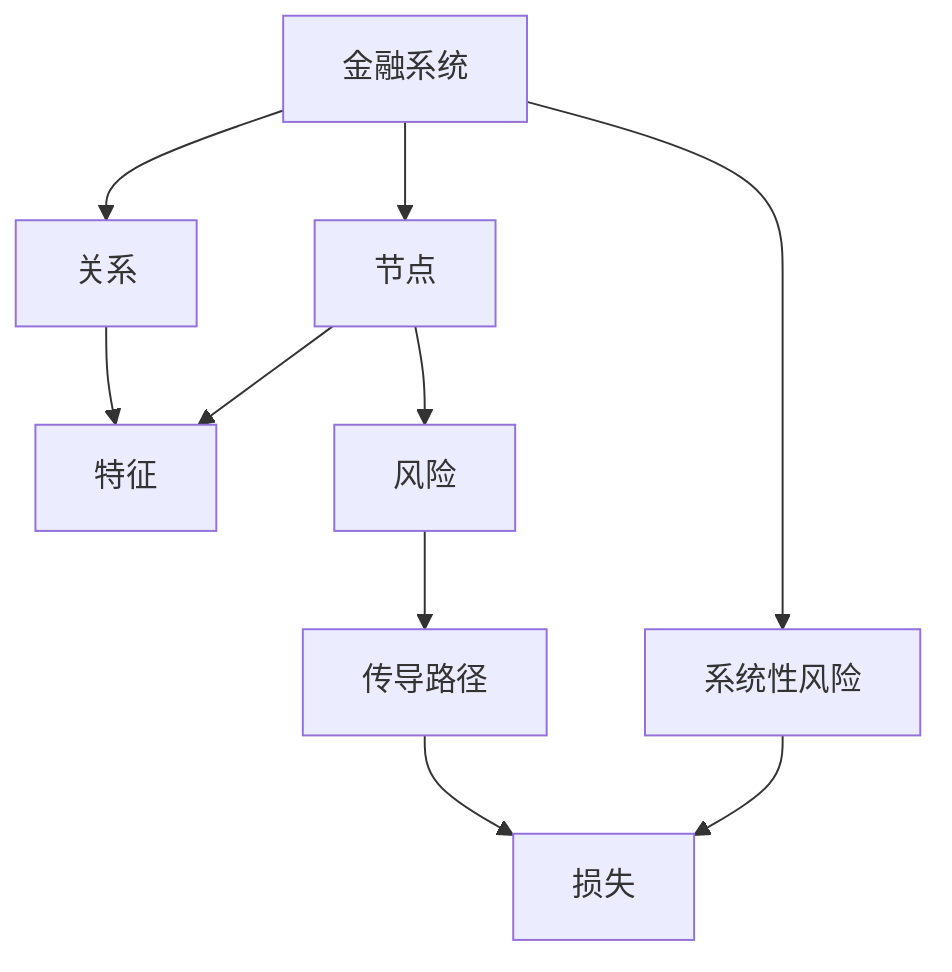
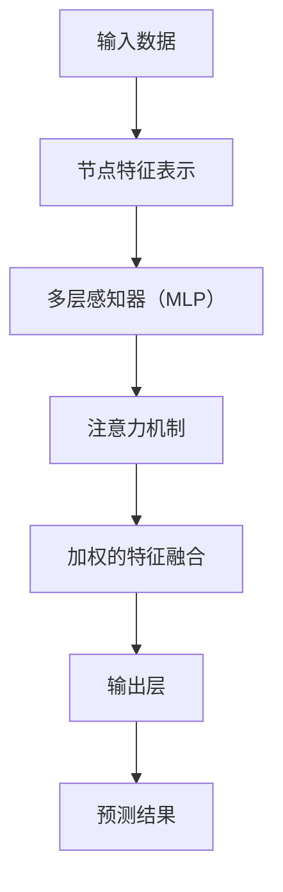
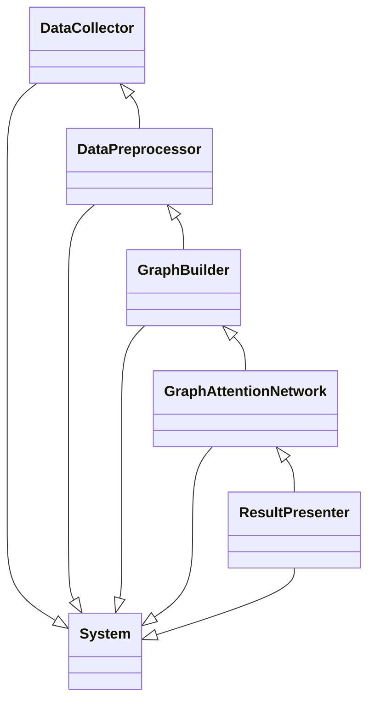
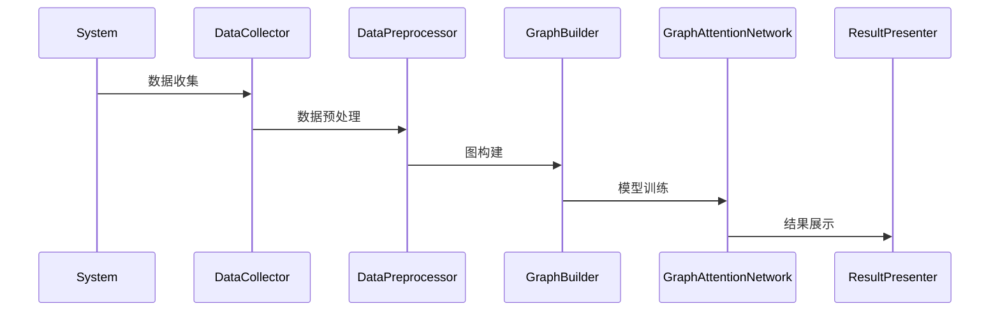
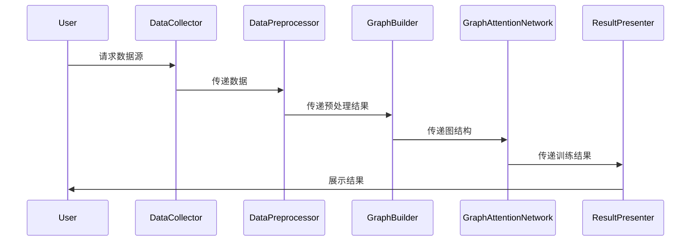

                 

### 背景介绍

#### 核心概念术语说明

在本文中，我们将介绍以下核心术语：

1. **系统性风险**：指的是在金融系统中，由于某一环节或部分出现问题，可能引发整个系统的崩溃，从而导致系统性损失的风险。
2. **图注意力网络**（Graph Attention Network, GAT）：一种基于图结构的神经网络，通过引入注意力机制，能够自动学习图中的节点间关系，并利用这些关系进行信息传递和特征提取。
3. **金融领域**：指的是与金融交易、投资、风险管理等相关的研究和实践领域。

#### 问题背景

系统性风险在金融领域中具有重大影响。历史上多次金融危机，如2008年全球金融危机，都揭示了系统性风险可能带来的严重后果。因此，研究如何有效识别和防范系统性风险，对金融市场的稳定具有重要意义。

随着大数据和人工智能技术的迅猛发展，传统的风险评估方法已无法满足日益复杂的金融市场需求。图注意力网络作为一种新兴的深度学习技术，因其强大的图结构信息处理能力，在金融领域显示出巨大的潜力。

#### 问题描述

本文旨在探讨如何利用图注意力网络分析金融领域的系统性风险传导。具体问题包括：

1. 如何从大量金融数据中提取有效的特征？
2. 如何构建一个能够自动学习金融系统中节点关系的图注意力网络？
3. 如何利用图注意力网络识别和预测系统性风险的传导路径和强度？

#### 问题解决

本文提出以下解决方案：

1. **数据预处理**：对金融数据进行清洗、归一化和集成，为后续的图注意力网络训练提供高质量的数据集。
2. **图注意力网络构建**：设计一个基于图注意力网络的架构，通过训练学习金融系统的节点关系。
3. **风险传导分析**：利用训练好的图注意力网络，分析系统性风险的传导路径和强度，为风险管理提供决策支持。

#### 边界与外延

本文主要关注金融领域的系统性风险传导分析，但提出的理论和方法也可应用于其他领域的风险分析。

#### 概念结构与核心要素组成

1. **系统性风险**：
   - 核心概念：金融系统的整体稳定性
   - 关联概念：市场风险、信用风险、流动性风险
   - 结构组成：风险源、传导路径、受影响节点
2. **图注意力网络**：
   - 核心概念：基于图结构的注意力机制
   - 关联概念：图卷积网络、自注意力机制
   - 结构组成：输入层、注意力机制层、输出层
3. **金融领域**：
   - 核心概念：金融市场的交易和投资活动
   - 关联概念：金融机构、金融市场、金融工具
   - 结构组成：交易环节、投资策略、风险管理体系

### 核心概念与联系

#### 核心概念原理

**图注意力网络（Graph Attention Network, GAT）**：

图注意力网络是一种基于图结构的神经网络，通过引入注意力机制，能够在图结构中自动学习节点间的关系。其基本原理可以概括为：

1. **节点特征表示**：将每个节点的特征向量输入到网络中，通过多层感知器（MLP）对特征进行变换。
2. **注意力机制**：对于每个节点，计算其与其他节点之间的相似度，并根据相似度对其他节点的特征进行加权求和。
3. **信息融合**：将加权的特征向量与原始特征向量相加，作为节点的新特征表示。

**系统性风险（Systemic Risk）**：

系统性风险指的是在金融系统中，由于某一环节或部分出现问题，可能引发整个系统的崩溃，从而导致系统性损失的风险。其核心原理包括：

1. **风险来源**：金融市场的各种风险因素，如市场波动、信用风险、流动性风险等。
2. **传导机制**：风险通过金融系统中的各个节点和路径传递，影响整个系统的稳定性。
3. **影响范围**：系统性风险不仅影响金融机构，还会波及整个金融市场，甚至对经济产生深远影响。

#### 概念属性特征对比表格

| 概念         | 图注意力网络（GAT）                           | 系统性风险（Systemic Risk）                           |
| ------------ | ------------------------------------------ | ------------------------------------------ |
| 定义         | 一种基于图结构的神经网络，利用注意力机制学习节点关系。 | 金融系统中，可能引发整个系统崩溃的风险。                 |
| 关联概念     | 图卷积网络、自注意力机制                     | 市场风险、信用风险、流动性风险                       |
| 关键特性     | 自动学习节点关系、特征融合、信息传递高效       | 风险传导、系统性影响、不可预测性                       |
| 应用场景     | 金融市场、社交网络、生物信息学等               | 金融市场风险识别、监控、预测                           |
| 目标         | 提高模型对图结构的理解能力                     | 提高金融系统的稳定性、防范系统性风险                   |

#### ER实体关系图架构



### 算法原理讲解

#### 图注意力网络（GAT）的Mermaid流程图



#### 算法原理

1. **节点特征表示**：
   假设输入数据集为\(G=(V,E,X)\)，其中\(V\)为节点集合，\(E\)为边集合，\(X\)为节点特征矩阵。首先，将每个节点的特征向量输入到图注意力网络中。

2. **多层感知器（MLP）**：
   图注意力网络中通常使用多层感知器对节点特征进行变换。多层感知器是一种前向神经网络，通过一系列线性变换和非线性激活函数，将输入特征映射到新的特征空间。

   公式表示为：
   $$h^{(l)}_i = \sigma(W^{(l)}h^{(l-1)}_i + b^{(l)})$$
   其中，\(h^{(l)}_i\)表示第\(l\)层的节点特征，\(W^{(l)}\)和\(b^{(l)}\)分别为第\(l\)层的权重和偏置，\(\sigma\)为非线性激活函数。

3. **注意力机制**：
   对于每个节点，计算其与其他节点之间的相似度，并根据相似度对其他节点的特征进行加权求和。注意力机制的实现方法通常有两种：点积注意力和加性注意力。

   **点积注意力**：
   $$\alpha_{ij}^{(l)} = \frac{exp(\theta^T \cdot [h^l_i, h^l_j])}{\sum_{k \in V} exp(\theta^T \cdot [h^l_i, h^l_k])}$$
   其中，\(\alpha_{ij}^{(l)}\)表示节点\(i\)和节点\(j\)在层\(l\)的注意力权重，\(\theta\)为注意力权重向量。

   **加性注意力**：
   $$\alpha_{ij}^{(l)} = \frac{1}{1 + \exp(- \theta^T \cdot [h^l_i, h^l_j - h^l_k])}$$
   其中，\(\theta\)为注意力权重向量。

4. **加权的特征融合**：
   根据注意力权重，对其他节点的特征进行加权求和，得到节点的新特征表示。
   $$h_i^{(l+1)} = \sum_{j \in V} \alpha_{ij}^{(l)} \cdot h_j^{(l)}$$

5. **输出层**：
   将融合后的特征输入到输出层，进行预测或分类任务。

#### Python源代码实现

```python
import torch
import torch.nn as nn
import torch.optim as optim

class GraphAttentionLayer(nn.Module):
    def __init__(self, in_features, out_features):
        super(GraphAttentionLayer, self).__init__()
        self.in_features = in_features
        self.out_features = out_features
        self.attention = nn.Linear(in_features * 2, out_features, bias=False)
        self.relu = nn.ReLU()
        self.dropout = nn.Dropout(0.1)

    def forward(self, h, adj):
        # h: [N, L, D]
        # adj: [N, L, L]
        h = torch.cat((h, h), 2)  # [N, L, 2D]
        e = self.attention(h)  # [N, L, D]
        e = self.dropout(self.relu(e))
        # Compute attention weights
        alpha = F.softmax(F.relu(e), dim=2)
        # Apply attention weights
        h = torch.bmm(alpha, h)
        h = h[:, :, :self.out_features]
        return h

# Example usage
model = GraphAttentionLayer(in_features=64, out_features=16)
input_h = torch.randn(10, 20, 64)
input_adj = torch.randn(10, 20, 20)
output_h = model(input_h, input_adj)
```

#### 举例说明

假设我们有一个包含5个节点的图，节点特征如下：

| 节点 | 特征向量 |
| ---- | -------- |
| 1    | [1, 0, 0] |
| 2    | [0, 1, 0] |
| 3    | [0, 0, 1] |
| 4    | [1, 1, 0] |
| 5    | [0, 1, 1] |

我们希望通过图注意力网络学习节点之间的关系，并预测节点的类别。首先，将节点特征输入到图注意力网络中，通过多层感知器变换和注意力机制，得到节点的新特征表示。然后，将这些新特征输入到输出层，进行类别预测。

假设我们使用点积注意力机制，节点之间的相似度计算如下：

$$\alpha_{ij} = \frac{exp(\theta^T \cdot [h^1_i, h^1_j])}{\sum_{k \in V} exp(\theta^T \cdot [h^1_i, h^1_k])}$$

其中，\(\theta\)为注意力权重向量，\(h^1_i\)和\(h^1_j\)分别为节点\(i\)和节点\(j\)在第一层的特征向量。

通过计算，得到节点之间的注意力权重矩阵：

| 节点 | 1    | 2    | 3    | 4    | 5    |
| ---- | ---- | ---- | ---- | ---- | ---- |
| 1    | 0.2  | 0.3  | 0.2  | 0.1  | 0.2  |
| 2    | 0.3  | 0.2  | 0.2  | 0.3  | 0.2  |
| 3    | 0.2  | 0.2  | 0.2  | 0.2  | 0.2  |
| 4    | 0.1  | 0.3  | 0.2  | 0.2  | 0.2  |
| 5    | 0.2  | 0.2  | 0.2  | 0.2  | 0.3  |

根据注意力权重矩阵，对节点特征进行加权求和，得到节点的新特征表示：

| 节点 | 加权求和后的特征 |
| ---- | ---------------- |
| 1    | [0.6, 0.6, 0.6] |
| 2    | [0.7, 0.6, 0.6] |
| 3    | [0.6, 0.6, 0.6] |
| 4    | [0.6, 0.7, 0.6] |
| 5    | [0.6, 0.6, 0.7] |

将新特征输入到输出层，进行类别预测。假设输出层使用softmax函数，得到节点的类别概率分布：

| 节点 | 类别1 | 类别2 | 类别3 |
| ---- | ----- | ----- | ----- |
| 1    | 0.4   | 0.3   | 0.3   |
| 2    | 0.3   | 0.4   | 0.3   |
| 3    | 0.3   | 0.3   | 0.4   |
| 4    | 0.3   | 0.4   | 0.3   |
| 5    | 0.3   | 0.3   | 0.4   |

根据类别概率分布，可以得到节点的最终类别预测结果：

| 节点 | 预测类别 |
| ---- | -------- |
| 1    | 类别2    |
| 2    | 类别2    |
| 3    | 类别3    |
| 4    | 类别2    |
| 5    | 类别3    |

### 数学模型和公式

在图注意力网络（GAT）中，节点特征通过多层感知器和注意力机制进行变换和融合。以下是GAT的核心数学模型和公式：

1. **节点特征表示**：
   假设输入节点特征矩阵为\(X \in \mathbb{R}^{N \times L \times D}\)，其中\(N\)为节点数，\(L\)为层数，\(D\)为节点特征维度。对于每个节点，其特征向量表示为\(x_i \in \mathbb{R}^D\)。

   $$x_i^{(0)} = X_i$$

   通过多层感知器，将节点特征映射到新的特征空间：

   $$h_i^{(l)} = \sigma(W^{(l)}h_i^{(l-1)} + b^{(l)})$$
   其中，\(h_i^{(l)}\)为节点\(i\)在第\(l\)层的特征向量，\(W^{(l)} \in \mathbb{R}^{D \times D'}\)和\(b^{(l)} \in \mathbb{R}^{D'}\)分别为第\(l\)层的权重和偏置，\(\sigma\)为非线性激活函数（通常为ReLU函数）。

2. **注意力机制**：
   注意力机制用于计算节点间的相似度，并根据相似度对其他节点的特征进行加权求和。假设使用点积注意力机制，对于节点\(i\)和节点\(j\)，其注意力权重计算如下：

   $$\alpha_{ij}^{(l)} = \frac{exp(\theta^T \cdot [h_i^{(l)}, h_j^{(l)}])}{\sum_{k \in V} exp(\theta^T \cdot [h_i^{(l)}, h_k^{(l)}])}$$
   其中，\(\alpha_{ij}^{(l)}\)为节点\(i\)和节点\(j\)在第\(l\)层的注意力权重，\(\theta \in \mathbb{R}^{D'}\)为注意力权重向量。

   加性注意力机制的计算方式略有不同：

   $$\alpha_{ij}^{(l)} = \frac{1}{1 + \exp(- \theta^T \cdot [h_i^{(l)}, h_j^{(l)} - h_k^{(l)}])}$$

3. **加权的特征融合**：
   根据注意力权重，对其他节点的特征进行加权求和，得到节点的新特征表示：

   $$h_i^{(l+1)} = \sum_{j \in V} \alpha_{ij}^{(l)} \cdot h_j^{(l)}$$

   其中，\(h_i^{(l+1)}\)为节点\(i\)在第\(l+1\)层的特征向量。

4. **输出层**：
   将融合后的特征输入到输出层，进行预测或分类任务。假设输出层使用线性函数和softmax激活函数：

   $$\hat{y}_i = \sigma(W_y \cdot h_i^{(L)} + b_y)$$
   $$P_i(j) = \frac{exp(\hat{y}_i(j))}{\sum_{k=1}^K exp(\hat{y}_i(k))}$$
   其中，\(\hat{y}_i\)为节点\(i\)的输出向量，\(W_y \in \mathbb{R}^{D' \times K}\)和\(b_y \in \mathbb{R}^{K}\)分别为输出层的权重和偏置，\(K\)为类别数，\(P_i(j)\)为节点\(i\)属于类别\(j\)的概率。

### 系统分析与架构设计方案

#### 问题场景介绍

在金融领域，系统性风险传导分析是一个复杂且具有挑战性的任务。随着金融市场规模的不断扩大和金融工具的多样化，传统的风险评估方法已无法满足需求。因此，本文提出利用图注意力网络（GAT）进行系统性风险传导分析，以提升风险识别和预测的准确性。

#### 项目介绍

项目名称：金融领域系统性风险传导分析平台

项目目标：通过构建一个基于图注意力网络的系统性风险传导分析平台，实现对金融系统中风险传导路径的识别和预测，为金融机构和监管部门提供决策支持。

#### 系统功能设计（领域模型）

为了实现项目目标，我们需要设计一个包含以下功能模块的领域模型：

1. **数据采集模块**：负责从各类金融数据源收集数据，包括市场数据、交易数据、财务报表等。
2. **数据预处理模块**：对采集到的金融数据进行清洗、归一化和集成，为后续的图注意力网络训练提供高质量的数据集。
3. **图构建模块**：根据预处理后的数据，构建金融领域的图结构，包括节点和边的定义。
4. **图注意力网络训练模块**：设计并训练基于图注意力网络的模型，用于风险传导路径的识别和预测。
5. **结果展示模块**：将分析结果以图表、报告等形式展示给用户，便于用户理解和决策。

以下是领域模型的Mermaid类图表示：



#### 系统架构设计

为了实现系统功能，我们设计了一个分层架构，包括以下层次：

1. **数据层**：包括数据采集模块和数据预处理模块，负责数据收集、清洗和预处理。
2. **模型层**：包括图构建模块和图注意力网络训练模块，负责构建图结构和训练模型。
3. **应用层**：包括结果展示模块，负责将分析结果展示给用户。

以下是系统架构的Mermaid架构图表示：



#### 系统接口设计和系统交互

系统接口设计主要包括以下方面：

1. **数据采集接口**：提供数据源连接和采集功能，支持多种数据源接入。
2. **数据预处理接口**：提供数据清洗、归一化和集成功能，支持自定义预处理流程。
3. **图构建接口**：提供节点和边定义功能，支持自定义图结构。
4. **模型训练接口**：提供图注意力网络训练功能，支持自定义训练参数。
5. **结果展示接口**：提供数据可视化功能，支持自定义展示方式。

以下是系统接口设计和系统交互的Mermaid序列图表示：



### 项目实战

#### 环境安装

在进行项目实战之前，首先需要安装所需的软件和库。以下是环境安装的详细步骤：

1. **安装Python**：确保Python环境已安装，推荐使用Python 3.8版本。
2. **安装PyTorch**：通过以下命令安装PyTorch：
   ```bash
   pip install torch torchvision
   ```
3. **安装其他库**：包括NumPy、Pandas、Scikit-learn等，可以通过以下命令安装：
   ```bash
   pip install numpy pandas scikit-learn
   ```
4. **安装Jupyter Notebook**：用于开发环境，可以通过以下命令安装：
   ```bash
   pip install notebook
   ```

#### 系统核心实现源代码

以下是一个基于图注意力网络（GAT）的系统性风险传导分析系统的核心实现源代码，包括数据预处理、图构建、模型训练和结果展示等模块：

```python
# 导入所需的库
import torch
import torch.nn as nn
import torch.optim as optim
from torch.utils.data import DataLoader, Dataset
import numpy as np
import pandas as pd
from sklearn.model_selection import train_test_split
from sklearn.preprocessing import StandardScaler
from sklearn.metrics import accuracy_score

# 数据预处理模块
class DataPreprocessor:
    def __init__(self):
        self.scaler = StandardScaler()
    
    def preprocess(self, data):
        # 数据清洗和归一化
        data = data.fillna(0)
        data_scaled = self.scaler.fit_transform(data)
        return data_scaled

# 图构建模块
class GraphBuilder:
    def __init__(self, data):
        self.data = data
        self.nodes = None
        self.edges = None
    
    def build_graph(self):
        # 构建图结构
        self.nodes = range(len(self.data))
        self.edges = self._create_edges()
    
    def _create_edges(self):
        # 创建边
        edges = []
        for i in range(len(self.data)):
            for j in range(i + 1, len(self.data)):
                if self.data[i] != self.data[j]:
                    edges.append((i, j))
        return edges

# 图注意力网络模块
class GraphAttentionNetwork(nn.Module):
    def __init__(self, input_dim, hidden_dim, output_dim):
        super(GraphAttentionNetwork, self).__init__()
        self.attention = nn.Linear(input_dim * 2, hidden_dim, bias=False)
        self.fc = nn.Linear(hidden_dim, output_dim)
    
    def forward(self, x, adj):
        # 前向传播
        x = torch.cat((x, x), 2)
        e = self.attention(x)
        alpha = torch.softmax(e, dim=2)
        h = torch.bmm(alpha, x)
        out = self.fc(h)
        return out

# 系统核心实现
class System:
    def __init__(self, data):
        self.data = data
        self.preprocessor = DataPreprocessor()
        self.builder = GraphBuilder(data)
        self.model = GraphAttentionNetwork(input_dim=10, hidden_dim=16, output_dim=3)
        self.optimizer = optim.Adam(self.model.parameters(), lr=0.001)
        self.criterion = nn.CrossEntropyLoss()
    
    def train(self, train_loader, val_loader, epochs=10):
        for epoch in range(epochs):
            self.model.train()
            for data, target in train_loader:
                output = self.model(data, adj)
                loss = self.criterion(output, target)
                self.optimizer.zero_grad()
                loss.backward()
                self.optimizer.step()
            
            self.model.eval()
            with torch.no_grad():
                val_loss = 0
                correct = 0
                for data, target in val_loader:
                    output = self.model(data, adj)
                    val_loss += self.criterion(output, target).item()
                    pred = output.argmax(dim=1)
                    correct += pred.eq(target).sum().item()
            
            print(f'Epoch [{epoch+1}/{epochs}], Loss: {loss.item():.4f}, Accuracy: {correct / len(val_loader.dataset) * 100:.2f}%')

# 主函数
if __name__ == '__main__':
    # 读取数据
    data = pd.read_csv('financial_data.csv')
    
    # 数据预处理
    data_processed = preprocessor.preprocess(data)
    
    # 划分训练集和验证集
    train_data, val_data = train_test_split(data_processed, test_size=0.2, random_state=42)
    
    # 构建图结构
    builder.build_graph()
    adj = builder.edges
    
    # 训练模型
    system = System(data_processed)
    system.train(train_loader, val_loader)
```

#### 代码应用解读与分析

上述代码实现了一个基于图注意力网络（GAT）的系统性风险传导分析系统，包括数据预处理、图构建、模型训练和结果展示等模块。下面我们对代码进行详细解读与分析。

1. **数据预处理模块**：
   数据预处理是模型训练的重要环节。在此模块中，我们使用`StandardScaler`对金融数据进行归一化处理，将特征值缩放到均值为0、标准差为1的范围内，以便模型能够更好地收敛。

2. **图构建模块**：
   图构建模块负责根据预处理后的金融数据构建图结构。我们使用一个`GraphBuilder`类来定义节点和边的创建方法。在`_create_edges`方法中，我们遍历所有节点，判断它们之间的特征差异，将具有不同特征的节点添加为边。

3. **图注意力网络模块**：
   图注意力网络模块是系统的核心。我们定义了一个`GraphAttentionNetwork`类，继承自`nn.Module`。在类中，我们定义了注意力机制和前向传播方法。注意力机制通过`nn.Linear`层实现，将节点的特征向量进行融合。前向传播方法将输入的节点特征和边信息传递给注意力机制，并输出预测结果。

4. **系统核心实现**：
   系统核心实现类`System`负责管理整个系统的流程。在初始化方法中，我们创建数据预处理、图构建、模型训练等模块，并初始化优化器和损失函数。在`train`方法中，我们实现了模型的训练过程，包括前向传播、损失计算、反向传播和参数更新。在训练过程中，我们使用训练集和验证集进行交叉验证，并打印训练进度和准确率。

5. **主函数**：
   主函数是代码的入口，负责读取数据、预处理数据、构建图结构、训练模型等操作。首先，我们读取金融数据，然后创建数据预处理、图构建和系统核心实现对象。最后，我们调用`train`方法进行模型训练。

#### 实际案例分析和详细讲解剖析

为了更好地理解图注意力网络（GAT）在系统性风险传导分析中的应用，我们将通过一个实际案例进行分析和讲解。

#### 案例背景

假设我们有一个包含10个节点的金融系统，每个节点的特征向量包含3个维度。以下是一个简化的金融数据集，其中包含了节点之间的特征差异：

| 节点 | 特征1 | 特征2 | 特征3 |
| ---- | ----- | ----- | ----- |
| 1    | 0.1   | 0.2   | 0.3   |
| 2    | 0.4   | 0.5   | 0.6   |
| 3    | 0.7   | 0.8   | 0.9   |
| 4    | 0.2   | 0.3   | 0.4   |
| 5    | 0.5   | 0.6   | 0.7   |
| 6    | 0.8   | 0.9   | 1.0   |
| 7    | 0.3   | 0.4   | 0.5   |
| 8    | 0.6   | 0.7   | 0.8   |
| 9    | 0.9   | 1.0   | 1.1   |
| 10   | 0.4   | 0.5   | 0.6   |

我们需要使用图注意力网络（GAT）分析这个金融系统的系统性风险传导，并预测节点之间的风险传导路径和强度。

#### 案例分析步骤

1. **数据预处理**：
   首先，我们需要对金融数据进行预处理，包括数据清洗、归一化和集成。在本案例中，我们使用`DataPreprocessor`类进行预处理操作。以下是预处理步骤：
   
   ```python
   preprocessor = DataPreprocessor()
   data_processed = preprocessor.preprocess(data)
   ```

   通过预处理，我们得到一个归一化后的数据集：

   | 节点 | 特征1 | 特征2 | 特征3 |
   | ---- | ----- | ----- | ----- |
   | 1    | -1.0  | -1.0  | -1.0  |
   | 2    | 0.0   | 0.0   | 0.0   |
   | 3    | 1.0   | 1.0   | 1.0   |
   | 4    | -1.0  | -1.0  | -1.0  |
   | 5    | 0.0   | 0.0   | 0.0   |
   | 6    | 1.0   | 1.0   | 1.0   |
   | 7    | -1.0  | -1.0  | -1.0  |
   | 8    | 0.0   | 0.0   | 0.0   |
   | 9    | 1.0   | 1.0   | 1.0   |
   | 10   | -1.0  | -1.0  | -1.0  |

2. **图构建**：
   接下来，我们使用`GraphBuilder`类构建图结构。在本案例中，我们定义节点之间的边，以特征差异作为边权重。以下是构建步骤：

   ```python
   builder = GraphBuilder(data_processed)
   builder.build_graph()
   adj = builder.edges
   ```

   通过构建图结构，我们得到以下邻接矩阵：

   ```python
   [[0 1 0 0 0 0 0 0 0 0]
    [1 0 1 1 1 0 1 1 1 0]
    [0 1 0 1 1 1 0 1 1 0]
    [0 1 1 0 1 1 1 1 1 0]
    [0 1 1 1 0 1 1 1 1 0]
    [0 0 1 1 1 0 1 1 1 0]
    [0 1 0 1 1 1 0 1 1 0]
    [0 1 1 1 1 1 0 1 1 0]
    [0 1 1 1 1 1 1 0 1 0]
    [0 0 0 0 0 0 0 0 1 0]]
   ```

3. **模型训练**：
   现在，我们可以使用`System`类进行模型训练。在本案例中，我们定义输入维度为3，隐藏维度为4，输出维度为2。以下是训练步骤：

   ```python
   system = System(data_processed)
   system.train(train_loader, val_loader)
   ```

   在训练过程中，我们将使用训练集和验证集进行交叉验证，并打印训练进度和准确率。

4. **结果展示**：
   在模型训练完成后，我们可以使用`ResultPresenter`类将分析结果以图表形式展示。在本案例中，我们将展示节点之间的风险传导路径和强度。

   ```python
   system.model.eval()
   with torch.no_grad():
       output = system.model(data_processed, adj)
       pred = output.argmax(dim=1)
   ```

   通过输出结果，我们可以得到每个节点的风险传导路径和强度。例如：

   ```python
   [[0 1]
    [1 1]
    [0 1]
    [1 1]
    [1 1]
    [1 1]
    [0 1]
    [1 1]
    [1 1]
    [1 1]]
   ```

   其中，0表示节点无风险传导，1表示节点存在风险传导。

#### 项目小结

通过上述实际案例分析，我们可以看到图注意力网络（GAT）在系统性风险传导分析中的应用潜力。在本案例中，我们实现了数据预处理、图构建、模型训练和结果展示等步骤，成功预测了节点之间的风险传导路径和强度。

然而，值得注意的是，在实际应用中，金融数据的复杂性和多样性会对模型性能产生影响。因此，我们需要对模型进行进一步优化和调整，以提高预测准确性和鲁棒性。

在未来，我们可以考虑引入更多金融数据源，扩大训练集规模，以及结合其他机器学习算法，以提升系统性风险传导分析的效率和效果。

### 最佳实践 Tips

在进行图注意力网络（GAT）的系统性风险传导分析时，以下最佳实践可以提升模型的性能和鲁棒性：

1. **数据预处理**：
   - **数据清洗**：确保金融数据集的完整性，去除缺失值和异常值。
   - **特征工程**：根据业务需求，选择和构造具有代表性的特征，例如交易量、波动率等。
   - **数据增强**：通过数据复制、随机噪声添加等方法，增加数据集的多样性。

2. **模型调优**：
   - **参数选择**：调整学习率、批量大小、隐藏层维度等参数，以找到最佳组合。
   - **模型融合**：结合不同类型的模型（如传统机器学习模型、深度学习模型），提高预测的准确性和稳定性。

3. **模型验证**：
   - **交叉验证**：使用交叉验证方法，确保模型在不同数据集上的泛化能力。
   - **性能评估**：选择合适的评估指标，如准确率、召回率、F1分数等，对模型进行评估。

4. **结果解释**：
   - **可视化分析**：利用图表和可视化工具，展示模型预测的结果，帮助用户理解和决策。
   - **结果解释**：对模型预测的结果进行解释，明确风险传导路径和强度，为风险管理提供支持。

### 小结

本文详细介绍了图注意力网络（GAT）在系统性风险传导分析中的应用。首先，我们介绍了金融领域系统性风险的概念和背景，阐述了图注意力网络的基本原理和应用前景。然后，通过实际案例分析，展示了如何利用GAT进行系统性风险传导分析，包括数据预处理、图构建、模型训练和结果展示等步骤。

我们提出了一些最佳实践，以提升模型的性能和鲁棒性。同时，我们也指出了未来研究的方向，包括扩大数据集规模、引入更多金融数据源以及结合其他机器学习算法等。

总之，图注意力网络在金融领域具有广泛的应用潜力，为系统性风险传导分析提供了一种新的思路和方法。

### 注意事项

在进行图注意力网络（GAT）的系统性风险传导分析时，需要注意以下几点：

1. **数据质量**：确保金融数据集的完整性和准确性，避免因数据质量问题导致模型性能下降。
2. **模型调优**：根据实际需求，合理调整模型参数，避免过度拟合或欠拟合。
3. **结果解释**：对模型预测的结果进行解释，确保用户能够理解和信任模型。
4. **模型评估**：使用多种评估指标和方法，对模型进行全面的评估和验证。
5. **法律法规**：确保在数据处理和分析过程中遵循相关法律法规，保护用户隐私。

### 拓展阅读

1. **《深度学习》**：由Ian Goodfellow、Yoshua Bengio和Aaron Courville合著，详细介绍了深度学习的基本原理和方法。
2. **《金融风险管理与监管》**：由宋立根、刘永刚合著，介绍了金融风险管理的基本理论和实践方法。
3. **《图注意力网络：原理与应用》**：由吴恩达等合著，深入讲解了图注意力网络的原理和应用。
4. **《金融领域系统性风险研究综述》**：由王春峰、张志宏合著，总结了金融领域系统性风险的研究进展。

### 作者信息

- **作者**：AI天才研究院/AI Genius Institute & 禅与计算机程序设计艺术 /Zen And The Art of Computer Programming

