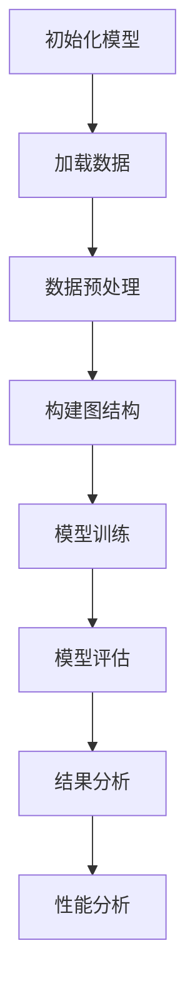

                 

### 1.1 问题背景

#### 1.1.1 全球金融稳定性的挑战

全球金融稳定性是指在全球经济体系中，金融市场的稳定性、金融机构的稳健性和金融体系的健全性。在全球化的背景下，金融市场的高度互联性和复杂性使得全球金融稳定性面临着诸多挑战。例如，2008年的全球金融危机揭示了金融市场不稳定性的潜在风险，金融工具的创新和杠杆率的增加加剧了市场波动和风险传递。此外，全球金融市场的不稳定性还可能引发货币危机、债务危机和银行危机等一系列经济问题。

随着金融市场的不断发展，传统金融稳定性评估方法已难以应对复杂多变的市场环境。这些方法主要依赖于历史数据统计和线性模型分析，无法充分捕捉金融系统中复杂的非线性关系和动态变化。因此，寻找新的方法来提升金融稳定性评估的准确性和实时性成为当务之急。

#### 1.1.2 图神经网络的应用潜力

图神经网络（Graph Neural Networks, GNNs）是一种基于图结构数据进行学习和推理的深度学习模型。它通过在图结构上定义节点和边的交互关系，能够有效捕捉和利用数据中的空间和关系信息。这使得图神经网络在许多领域，如推荐系统、图像识别和社交网络分析等方面取得了显著的成果。

在金融领域，图神经网络的应用潜力尤为突出。首先，金融市场可以被视为一个复杂的图结构，其中金融机构和金融产品作为节点，它们之间的交易关系和信用关系作为边。通过图神经网络，可以自动学习和提取这些图结构中的高阶特征和关联关系，从而为金融稳定性评估提供强大的工具。

其次，图神经网络具有处理动态数据的优势。金融市场中的数据通常具有时序特性，而图神经网络可以通过时序图结构来捕捉金融市场的动态变化，实现实时金融稳定性评估。

此外，图神经网络在处理大规模数据和高维数据方面也具有优势。金融市场中涉及的数据量庞大且维度较高，传统方法难以处理。而图神经网络通过图结构的数据压缩和特征提取，可以有效降低数据维度，提高计算效率。

总之，图神经网络在金融稳定性评估中具有巨大的应用潜力，有望为解决当前金融稳定性评估面临的挑战提供新的思路和方法。

#### 1.2 问题的提出

##### 1.2.1 金融稳定性评估的重要性

金融稳定性评估是金融监管和风险管理的重要组成部分。通过科学、准确的金融稳定性评估，可以及时发现金融系统中的潜在风险，提前采取措施进行干预，从而保障金融市场的稳定运行。具体来说，金融稳定性评估具有以下几个方面的作用：

首先，金融稳定性评估有助于金融监管机构制定和调整监管政策。通过对金融市场的全面评估，监管机构可以了解金融系统的健康状况，识别系统中的薄弱环节，从而制定有针对性的监管措施，加强金融系统的韧性和抗风险能力。

其次，金融稳定性评估为金融机构的风险管理提供科学依据。金融机构通过金融稳定性评估，可以评估自身在金融市场中的风险暴露情况，优化资产配置，制定风险管理策略，降低风险水平。

最后，金融稳定性评估有助于市场参与者提高投资决策的准确性。投资者通过金融稳定性评估，可以了解市场的风险状况，评估投资项目的风险收益比，从而做出更加合理的投资决策。

##### 1.2.2 传统方法的局限性

尽管金融稳定性评估具有重要意义，但传统的金融稳定性评估方法存在一定的局限性。这些方法主要包括统计学方法、线性模型和机器学习方法等。以下是传统方法在金融稳定性评估中面临的主要问题：

1. **数据依赖性**：传统方法往往依赖于历史数据，无法有效捕捉金融市场的动态变化。金融市场具有高度的不确定性和复杂性，历史数据可能无法完全反映当前的市场情况。

2. **线性假设**：许多传统方法基于线性模型，假设金融市场中的变量之间呈线性关系。然而，金融市场的变量之间通常存在非线性关系，线性模型无法准确捕捉这些复杂关系。

3. **特征提取能力不足**：传统方法在特征提取方面存在一定的局限性，难以从大规模和高维数据中提取有效的特征信息。金融市场中涉及的数据量庞大且维度较高，传统方法难以处理。

4. **实时性不足**：传统方法通常需要进行大量的计算和数据处理，实时性较差，难以实现实时金融稳定性评估。而金融市场变化迅速，实时性评估对于风险管理和监管决策至关重要。

因此，传统金融稳定性评估方法在应对当前金融市场复杂性和动态变化方面存在一定的不足，需要寻求新的方法来提升评估的准确性和实时性。

##### 1.2.3 图神经网络的优势

为了解决传统金融稳定性评估方法的局限性，图神经网络（GNNs）作为一种新兴的深度学习模型，在金融稳定性评估中展现出显著的优势。以下是图神经网络在金融稳定性评估中的主要优势：

1. **图结构数据的强大处理能力**：图神经网络能够处理金融市场中复杂的图结构数据，包括金融机构、金融产品和交易关系等。通过图结构，图神经网络可以捕捉到金融系统中的高阶特征和关联关系，从而提供更为准确的评估结果。

2. **非线性关系的有效捕捉**：金融市场中变量之间的关系往往具有非线性特征，而图神经网络通过定义节点和边的交互关系，能够有效地捕捉和建模这些非线性关系，提高评估的准确性。

3. **实时数据处理**：图神经网络在处理大规模和高维数据方面具有优势，可以快速地进行数据处理和模型训练，实现实时金融稳定性评估。这对于金融市场风险管理和监管决策具有重要意义。

4. **多维度特征提取**：金融市场中涉及的数据维度较高，图神经网络可以通过图结构的数据压缩和特征提取，有效地降低数据维度，提高计算效率，从而处理更复杂的数据。

5. **可解释性**：图神经网络通过图结构可以提供直观的解释，使得评估结果更加透明和易于理解。这对于金融监管机构和市场参与者来说，有助于提高决策的科学性和可信度。

总之，图神经网络在金融稳定性评估中具有强大的优势，能够克服传统方法的局限性，为金融稳定性评估提供新的思路和方法。

### 1.3 图神经网络概述

#### 1.3.1 图神经网络的基本概念

图神经网络（Graph Neural Networks, GNNs）是一种基于图结构数据进行学习和推理的深度学习模型。与传统的卷积神经网络（CNNs）和循环神经网络（RNNs）不同，GNNs专门设计用于处理图结构数据，如社交网络、知识图谱和分子结构等。图神经网络的核心思想是通过定义节点和边的交互关系，从图结构中提取高阶特征和关联信息。

在图神经网络中，图由节点（Node）和边（Edge）组成。每个节点表示图中的一个实体，如人、地点或物品，每个边表示节点之间的某种关系。图神经网络通过定义节点和边的特征，学习图结构中的节点嵌入向量（Node Embeddings），这些嵌入向量能够捕捉到节点和边之间的复杂关系。

#### 1.3.2 图神经网络的优势

图神经网络在金融领域具有显著的应用潜力，以下是图神经网络在金融稳定性评估中的主要优势：

1. **捕捉非线性关系**：金融市场中变量之间的关系通常具有非线性特征。图神经网络通过定义节点和边的交互关系，能够有效地捕捉和建模这些非线性关系，提高评估的准确性。

2. **处理复杂图结构**：金融市场可以被视为一个复杂的图结构，图神经网络能够处理金融市场中复杂的图结构数据，包括金融机构、金融产品和交易关系等，从而提供更为准确的评估结果。

3. **实时数据处理**：图神经网络在处理大规模和高维数据方面具有优势，可以快速地进行数据处理和模型训练，实现实时金融稳定性评估。这对于金融市场风险管理和监管决策具有重要意义。

4. **多维度特征提取**：金融市场中涉及的数据维度较高，图神经网络可以通过图结构的数据压缩和特征提取，有效地降低数据维度，提高计算效率，从而处理更复杂的数据。

5. **可解释性**：图神经网络通过图结构可以提供直观的解释，使得评估结果更加透明和易于理解。这对于金融监管机构和市场参与者来说，有助于提高决策的科学性和可信度。

总之，图神经网络作为一种先进的深度学习模型，在金融稳定性评估中展现出强大的优势，有望为解决当前金融稳定性评估面临的挑战提供新的思路和方法。

### 1.4 本书结构

#### 1.4.1 各章节内容安排

本书旨在全面探讨金融领域图神经网络（GNNs）在全球金融稳定性评估中的应用。全书分为五个部分，各部分内容如下：

**第一部分：引言**  
本部分主要介绍全球金融稳定性的挑战和图神经网络的应用潜力，提出本书的研究问题和目标。

**第二部分：基础知识**  
本部分详细介绍金融稳定性基础和图神经网络原理，包括图神经网络的基础理论、核心算法和优缺点。

**第三部分：应用实践**  
本部分通过具体应用场景和项目实战，展示图神经网络在金融稳定性评估中的实际应用，并进行算法实现与性能分析。

**第四部分：未来展望与挑战**  
本部分探讨图神经网络在金融领域的未来发展趋势、挑战和前沿技术，为读者提供未来研究方向。

**第五部分：参考文献**  
本部分列出本书引用的参考文献，为读者进一步学习和研究提供参考资料。

#### 1.4.2 读者对象与阅读建议

本书主要面向以下读者群体：

1. 金融科技研究者与工程师：希望了解和掌握图神经网络在金融领域应用的技术人员。
2. 金融风险管理专家：从事金融风险管理和监管工作的专业人士，希望通过本书提升金融稳定性评估的能力。
3. 计算机科学和人工智能领域的学者：对图神经网络和金融领域交叉应用感兴趣的研究人员。

阅读建议：

1. 首先阅读第一部分引言，了解全球金融稳定性的挑战和图神经网络的应用背景。
2. 其次深入学习第二部分基础知识，掌握金融稳定性和图神经网络的核心概念和算法原理。
3. 通过阅读第三部分应用实践，结合具体案例和项目实战，掌握图神经网络在金融稳定性评估中的实际应用。
4. 最后阅读第四部分未来展望与挑战，了解图神经网络在金融领域的未来发展趋势和前沿技术。
5. 针对感兴趣的部分，参考第五部分的参考文献，进行深入学习和研究。

通过本书的阅读，读者可以全面了解和掌握图神经网络在金融稳定性评估中的应用，提升自身在金融科技领域的专业能力和研究水平。

### 1.5 本章小结

本章首先介绍了全球金融稳定性的挑战和图神经网络的应用潜力。我们指出，随着金融市场的高度互联性和复杂性增加，传统金融稳定性评估方法面临诸多局限，无法有效应对市场动态变化。因此，图神经网络作为一种新兴的深度学习模型，在金融稳定性评估中展现出巨大的应用潜力。

接着，我们详细阐述了图神经网络的基本概念，包括图神经网络的基础理论、节点和边的交互关系以及节点嵌入向量等。同时，我们探讨了图神经网络在捕捉非线性关系、处理复杂图结构、实时数据处理和特征提取等方面的优势，强调了其在金融稳定性评估中的重要性。

最后，本章提出了本书的研究问题和目标，并介绍了各章节的内容安排和读者对象。通过本章的阅读，读者可以对全球金融稳定性评估和图神经网络的应用有一个初步的了解，为后续章节的学习奠定基础。

### 2.1 金融稳定性基础

#### 2.1.1 金融稳定性的定义

金融稳定性是指金融市场和金融机构在面临外部冲击和内部变化时，能够保持正常运行和稳健性的能力。具体来说，金融稳定性包括以下几个方面：

1. **市场稳定性**：金融市场在价格波动和交易量变化时，能够保持平稳运行，不会出现剧烈波动或崩溃。
2. **金融机构稳定性**：金融机构在面临信用风险、市场风险和运营风险时，能够保持财务健康和运营正常，不会发生破产或重大经营风险。
3. **金融体系稳定性**：金融体系在整体层面，包括金融机构、金融市场、金融产品和金融监管等方面，能够保持协调运行，不会出现系统性风险。

金融稳定性是金融市场健康发展的基础，对于整个经济体系的稳定具有重要作用。一个稳定的金融市场能够为投资者提供安全的投资环境，促进资本的形成和流动，从而推动经济增长。相反，金融市场的动荡和危机会对经济产生负面影响，引发经济衰退和失业率上升。

#### 2.1.2 金融稳定性的指标

评估金融稳定性通常需要依赖一系列指标，这些指标可以从不同角度反映金融市场的稳定状况。以下是一些常见的金融稳定性指标：

1. **利率波动率**：利率波动率是衡量金融市场稳定性的重要指标之一。利率波动率较低通常意味着金融市场较为稳定，而利率波动率较高则可能表明市场存在不稳定因素。

2. **汇率波动率**：汇率波动率反映了货币市场的稳定性。汇率波动率较低通常意味着货币市场稳定，而波动率较高则可能表明市场存在风险。

3. **股市波动率**：股市波动率是衡量股票市场稳定性的重要指标。股市波动率较低通常表明市场稳定，而波动率较高则可能表明市场存在不确定性。

4. **金融机构资本充足率**：金融机构资本充足率是衡量金融机构稳健性的重要指标。资本充足率较高意味着金融机构具有更强的抗风险能力，而资本充足率较低则可能表明金融机构面临较大的风险。

5. **信用违约互换（CDS）利差**：信用违约互换利差反映了市场对金融机构信用风险的评估。利差较高通常表明市场对金融机构的风险评估较高，而利差较低则可能表明市场对金融机构的风险评估较低。

6. **金融系统流动性**：金融系统流动性是衡量金融市场稳定性的重要指标。流动性较高意味着金融市场能够快速吸收和释放资金，而流动性较低则可能表明市场存在流动性风险。

通过这些指标，金融监管机构和市场参与者可以评估金融市场的稳定状况，及时发现潜在风险，采取相应措施进行干预，以维护金融市场的稳定。

#### 2.1.3 金融稳定性的影响因素

金融稳定性受到多种因素的影响，这些因素可以分为宏观经济因素、金融体系内部因素和市场参与者行为三个方面。

1. **宏观经济因素**：宏观经济因素是影响金融稳定性的重要外部因素。这些因素包括经济增长、通货膨胀、失业率、国际贸易和货币政策等。例如，经济增长放缓可能导致金融机构的贷款违约风险上升，从而影响金融稳定性。通货膨胀上升可能增加市场的风险偏好，影响金融市场的稳定性。

2. **金融体系内部因素**：金融体系内部因素包括金融机构的资本充足率、风险管理能力、资产负债结构、监管政策和市场纪律等。金融机构的资本充足率较高和有效的风险管理能力有助于增强金融稳定性。监管政策和市场纪律的完善可以降低金融市场的道德风险，提高金融稳定性。

3. **市场参与者行为**：市场参与者的行为，包括投资者、金融机构和政府等，也是影响金融稳定性的重要因素。投资者的非理性行为，如恐慌性抛售或过度投机，可能导致市场大幅波动，影响金融稳定性。金融机构的不当行为，如过度杠杆和风险转移，也可能对金融稳定性产生负面影响。政府的宏观经济政策和金融监管政策对于维护金融稳定性至关重要。

此外，技术进步和市场创新也可能对金融稳定性产生影响。例如，金融科技的发展可能带来新的风险和挑战，而市场创新可能增加金融市场的复杂性，影响金融稳定性。

总之，金融稳定性是一个复杂的多因素系统，需要综合考虑宏观经济因素、金融体系内部因素和市场参与者行为，以全面评估金融稳定性的状况。

### 2.2 图神经网络原理

#### 2.2.1 图神经网络的基础理论

图神经网络（Graph Neural Networks, GNNs）是一种深度学习模型，专门设计用于处理图结构数据。图神经网络的基础理论主要包括图的表示、节点和边的交互关系以及模型的训练过程。

首先，图的表示是图神经网络的核心概念。在图神经网络中，图由节点（Node）和边（Edge）组成。每个节点代表一个实体，如人、地点或物品，而每条边表示节点之间的某种关系。图神经网络通过定义节点和边的特征，将图结构转化为可处理的向量形式，从而进行学习和推理。

其次，节点和边的交互关系是图神经网络的核心机制。图神经网络通过在图结构上定义节点和边的交互关系，从图结构中提取高阶特征和关联信息。具体来说，图神经网络通过聚合节点和邻居节点的特征信息，更新节点的嵌入向量。这一过程通常通过图卷积操作（Graph Convolutional Operation）来实现，它模拟了传统卷积操作在图像上的局部特征聚合过程，但适用于图结构数据。

最后，图神经网络的训练过程涉及模型参数的优化。图神经网络通过学习节点嵌入向量，预测节点标签或节点属性。在训练过程中，图神经网络使用图结构数据和标签数据，通过反向传播算法优化模型参数，以最小化预测误差。训练过程包括前向传播和后向传播两个阶段，其中前向传播过程中，模型根据输入的节点特征和边特征计算节点的输出特征；后向传播过程中，模型通过误差梯度更新模型参数。

#### 2.2.2 图神经网络的核心算法

图神经网络的核心算法包括图卷积网络（Graph Convolutional Network, GCN）、图注意力网络（Graph Attention Network, GAT）和图自编码器（Graph Autoencoder）等。

1. **图卷积网络（GCN）**：
   图卷积网络是图神经网络的基础模型，通过卷积操作在图结构上聚合节点特征。GCN的核心思想是将节点的特征表示与邻居节点的特征表示进行融合，从而生成新的特征表示。具体来说，GCN使用以下公式进行节点特征聚合：
   $$
   \hat{h}_i^{(l+1)} = \sigma(\sum_{j \in \mathcal{N}(i)} \alpha_{ij} h_j^{(l)} W^{(l)})
   $$
   其中，$h_i^{(l)}$和$\hat{h}_i^{(l+1)}$分别表示节点$i$在第$l$层和$l+1$层的特征表示，$\mathcal{N}(i)$表示节点$i$的邻居节点集合，$\alpha_{ij}$是邻接权重，$W^{(l)}$是图卷积权重。$\sigma$表示激活函数，如ReLU或Sigmoid函数。

2. **图注意力网络（GAT）**：
   图注意力网络通过引入注意力机制，在图神经网络中实现对邻居节点特征的加权聚合。GAT的核心思想是自适应地调整邻居节点的权重，使重要节点的影响更大。具体来说，GAT使用以下公式进行节点特征聚合：
   $$
   \hat{h}_i^{(l+1)} = \sigma(\sum_{j \in \mathcal{N}(i)} a_{ij} h_j^{(l)} W^{(l)})
   $$
   其中，$a_{ij}$是注意力权重，可以通过以下公式计算：
   $$
   a_{ij} = \frac{\exp(\theta^T \cdot [h_i, h_j]_W)}{\sum_{k \in \mathcal{N}(i)} \exp(\theta^T \cdot [h_i, h_k]_W)}
   $$
   其中，$\theta$是注意力权重参数，$[ \cdot , \cdot ]_W$表示拼接操作。

3. **图自编码器（GAE）**：
   图自编码器是一种无监督学习的图神经网络模型，通过编码和解码过程重建图结构。GAE的核心思想是学习节点的低维嵌入表示，从而捕捉图结构中的高阶特征。具体来说，GAE包括编码器和解码器两个部分：
   - 编码器：使用GCN或GAT等图神经网络模型对节点进行编码，生成节点的嵌入向量。
   - 解码器：使用全连接神经网络对编码后的节点嵌入向量进行解码，生成重建的图结构。

通过以上核心算法，图神经网络能够有效地从图结构数据中提取高阶特征和关联信息，为各种任务提供强大的模型支持。

#### 2.2.3 图神经网络的优缺点

图神经网络在处理图结构数据方面具有显著的优势，但也存在一些局限性。以下是图神经网络的优缺点：

**优点**：

1. **强大的图结构数据处理能力**：图神经网络能够处理各种复杂的图结构数据，如社交网络、知识图谱和分子结构等。通过节点和边的交互关系，图神经网络能够捕捉数据中的高阶特征和关联信息。

2. **非线性关系建模**：图神经网络能够有效地建模图结构中的非线性关系，这对于复杂系统的分析和预测具有重要意义。

3. **实时数据处理**：图神经网络在处理大规模和高维数据方面具有优势，可以快速地进行数据处理和模型训练，实现实时分析和预测。

4. **多维度特征提取**：图神经网络可以通过图结构的数据压缩和特征提取，降低数据维度，提高计算效率，从而处理更复杂的数据。

5. **可解释性**：图神经网络通过图结构可以提供直观的解释，使得评估结果更加透明和易于理解。

**缺点**：

1. **计算资源需求高**：图神经网络在训练和推理过程中需要大量的计算资源，特别是在处理大规模图数据时，计算资源需求可能较高。

2. **数据预处理复杂**：图神经网络需要对图结构进行预处理，包括节点特征提取、边特征编码等，数据预处理过程相对复杂。

3. **模型可解释性不足**：尽管图神经网络通过图结构提供了一定的可解释性，但对于复杂图结构中的高阶特征和关联关系，模型的可解释性仍然有限。

4. **过拟合风险**：图神经网络在处理图结构数据时，可能面临过拟合风险，尤其是在训练数据较少或图结构复杂时，模型容易拟合训练数据中的噪声。

总之，图神经网络在处理图结构数据方面具有强大的优势，但也存在一些局限性。通过合理选择模型结构和训练策略，可以充分发挥图神经网络的潜力，提高其在金融稳定性评估等领域的应用效果。

### 2.3 数据集与数据预处理

#### 2.3.1 金融领域数据集的特点

在金融领域，数据集的特点主要体现在数据的规模、维度和多样性上。首先，金融数据集通常包含大量的交易记录、市场指标、财务报表等信息，数据量庞大。其次，金融数据集具有多维度特征，包括时间序列数据、文本数据、图像数据和结构化数据等。这些特征使得金融数据集具有较高的复杂性和多样性。

此外，金融数据集还具有以下特点：

1. **动态变化**：金融市场具有高度动态性，价格波动、交易量变化等特征频繁出现。这使得金融数据集在时间维度上具有明显的时序特性。

2. **时间敏感性**：金融市场的某些特征和关系可能会随时间发生变化，因此数据集需要及时更新，以反映最新的市场状况。

3. **非均衡性**：金融市场中某些事件或状态的发生频率较低，如金融危机或市场崩盘。这可能导致数据集在样本分布上出现非均衡性，影响模型训练和评估。

4. **隐私敏感性**：金融数据通常涉及用户隐私信息，如交易金额、账户信息等。在处理金融数据时，需要充分考虑隐私保护和数据安全。

#### 2.3.2 数据预处理方法

为了有效利用金融领域数据集，需要进行一系列的数据预处理操作。以下是常见的数据预处理方法：

1. **数据清洗**：数据清洗是数据预处理的第一步，主要包括去除重复记录、填补缺失值、纠正错误数据和处理异常值等。通过数据清洗，可以提高数据质量和一致性。

2. **数据归一化**：金融数据集通常包含不同量纲和尺度的特征，需要进行归一化处理，将数据转换到相同的尺度范围内。常用的归一化方法包括最小-最大缩放、Z分数缩放和log变换等。

3. **特征提取**：特征提取是数据预处理的关键步骤，通过从原始数据中提取具有代表性的特征，降低数据维度，提高模型训练和评估的效率。常见的特征提取方法包括统计特征提取、文本特征提取和图像特征提取等。

4. **时间序列处理**：对于时间序列数据，需要进行时间序列处理，包括时间窗口划分、时间序列平滑、时间序列变换等。通过时间序列处理，可以捕捉数据中的时序特性，提高模型对动态变化的适应能力。

5. **数据分割**：数据分割是将数据集划分为训练集、验证集和测试集，以便进行模型训练和评估。在数据分割过程中，需要考虑数据集的非均衡性和时间敏感性，确保各数据集的代表性和可靠性。

6. **数据增强**：数据增强是通过生成或合成新的数据样本，增加数据集的多样性和丰富度，提高模型泛化能力。常用的数据增强方法包括数据合成、数据扩展和数据增强网络等。

通过以上数据预处理方法，可以有效地处理金融领域数据集，提高数据质量和模型性能。

#### 2.3.3 数据集的获取与处理

在金融领域，数据集的获取与处理是一个复杂且关键的过程。以下是常见的数据集获取和处理步骤：

1. **数据来源**：金融数据可以从多个渠道获取，包括金融交易所、银行、金融监管机构、金融科技公司等。公开数据集可以通过互联网免费获取，如Kaggle、UCI机器学习库等。私有数据集通常需要与相关金融机构合作获取，可能涉及隐私保护和技术保密等问题。

2. **数据获取**：数据获取过程中，需要确保数据的合法性和准确性。对于公开数据集，可以通过API接口或直接下载获得。对于私有数据集，可能需要签订保密协议，通过授权访问获取。

3. **数据预处理**：获取到的金融数据需要进行预处理，包括数据清洗、数据归一化、特征提取和时间序列处理等。数据清洗主要去除重复记录、填补缺失值、纠正错误数据和处理异常值。数据归一化将不同量纲和尺度的特征转换到相同尺度范围内。特征提取通过提取具有代表性的特征，降低数据维度，提高模型训练和评估的效率。时间序列处理包括时间窗口划分、时间序列平滑和变换等，以捕捉数据中的时序特性。

4. **数据分割**：将处理后的数据集划分为训练集、验证集和测试集，通常按照8:1:1或7:2:1的比例进行划分。在数据分割过程中，需要考虑数据集的非均衡性和时间敏感性，确保各数据集的代表性和可靠性。

5. **数据增强**：为了提高模型泛化能力，可以采用数据增强方法，如数据合成、数据扩展和数据增强网络等。数据合成通过生成或合成新的数据样本，增加数据集的多样性和丰富度。数据扩展通过扩展现有数据样本，增加数据集的样本量。数据增强网络通过在网络中引入额外的输入和输出，增强模型的输入和输出能力。

6. **数据存储与管理**：处理后的数据集需要存储和管理，以确保数据的安全性和可追溯性。常用的数据存储与管理工具包括关系型数据库（如MySQL、PostgreSQL）和分布式存储系统（如Hadoop、Spark）。

通过以上步骤，可以有效地获取和处理金融领域数据集，为后续的模型训练和评估提供可靠的数据支持。

### 2.4 数学模型与公式

#### 2.4.1 图神经网络的核心数学模型

图神经网络（GNN）的核心数学模型主要包括节点嵌入表示、图卷积操作和损失函数等。以下是对这些核心数学模型的详细讲解：

1. **节点嵌入表示**：在图神经网络中，每个节点都被表示为一个低维向量，称为节点嵌入（Node Embedding）。节点嵌入通过学习从原始特征空间映射到嵌入空间，从而捕获节点在图结构中的位置和关系。通常，节点的初始嵌入向量可以通过预训练的方法（如节点嵌入预训练算法Node2Vec或DeepWalk）初始化，然后通过图神经网络迭代更新。

   假设图中每个节点的特征表示为 $h_i^{(0)} \in \mathbb{R}^d$，其中 $i$ 表示节点索引，$d$ 表示特征维度。经过 $l$ 层图神经网络后，节点的嵌入向量表示为 $h_i^{(l)} \in \mathbb{R}^d$。

2. **图卷积操作**：图卷积操作是图神经网络中的核心组件，用于聚合节点和其邻居节点的特征信息。图卷积操作的数学表示如下：

   $$
   \hat{h}_i^{(l+1)} = \sigma \left( \sum_{j \in \mathcal{N}(i)} \alpha_{ij} h_j^{(l)} W^{(l)} \right)
   $$

   其中，$\hat{h}_i^{(l+1)}$ 是节点 $i$ 在第 $l+1$ 层的嵌入向量，$\mathcal{N}(i)$ 表示节点 $i$ 的邻居节点集合，$\alpha_{ij}$ 是节点 $i$ 和节点 $j$ 之间的邻接权重，$W^{(l)}$ 是图卷积权重，$\sigma$ 是激活函数，如ReLU函数。

3. **损失函数**：图神经网络的损失函数用于衡量预测值和真实值之间的差异，以指导模型优化。常见的损失函数包括交叉熵损失、均方误差损失和对抗损失等。以下是一个简单的交叉熵损失函数：

   $$
   \mathcal{L} = - \sum_{i} \sum_{c} y_{ic} \log p_{ic}
   $$

   其中，$y_{ic}$ 是节点 $i$ 对类别 $c$ 的真实标签，$p_{ic}$ 是节点 $i$ 对类别 $c$ 的预测概率。

#### 2.4.2 相关数学公式详细讲解

为了更好地理解图神经网络的核心数学模型，下面将详细讲解几个关键的数学公式。

1. **节点嵌入更新**：

   在图神经网络中，节点的嵌入向量通过聚合邻居节点的特征信息进行更新。更新过程如下：

   $$
   \hat{h}_i^{(l+1)} = \sigma \left( \sum_{j \in \mathcal{N}(i)} \alpha_{ij} h_j^{(l)} W^{(l)} \right)
   $$

   其中，$\alpha_{ij}$ 可以通过邻接矩阵 $A$ 进行定义：

   $$
   \alpha_{ij} = \frac{e^{a_{ij}}}{\sum_{k=1}^{n} e^{a_{ik}}}
   $$

   其中，$a_{ij}$ 是节点 $i$ 和节点 $j$ 之间的原始邻接权重，$n$ 是图中节点的总数。通过归一化处理，$\alpha_{ij}$ 表示节点 $i$ 对节点 $j$ 的相对重要性。

2. **图卷积权重**：

   图卷积权重 $W^{(l)}$ 是通过训练过程动态更新的。常见的权重初始化方法包括随机初始化、小批量训练初始化和预训练权重初始化等。权重更新可以通过以下梯度下降算法进行：

   $$
   W^{(l)} = W^{(l)} - \eta \frac{\partial \mathcal{L}}{\partial W^{(l)}}
   $$

   其中，$\eta$ 是学习率，$\frac{\partial \mathcal{L}}{\partial W^{(l)}}$ 是权重 $W^{(l)}$ 的梯度。

3. **损失函数**：

   图神经网络的损失函数用于衡量预测结果和真实结果之间的差距。常见的损失函数包括：

   - **交叉熵损失**：

     $$
     \mathcal{L} = - \sum_{i} \sum_{c} y_{ic} \log p_{ic}
     $$

     其中，$y_{ic}$ 是节点 $i$ 对类别 $c$ 的真实标签（0或1），$p_{ic}$ 是节点 $i$ 对类别 $c$ 的预测概率。

   - **均方误差损失**：

     $$
     \mathcal{L} = \frac{1}{n} \sum_{i} \sum_{c} (y_{ic} - p_{ic})^2
     $$

     其中，$y_{ic}$ 和 $p_{ic}$ 的含义与交叉熵损失相同。

   - **对抗损失**：

     $$
     \mathcal{L} = \mathcal{L}_\text{正} + \mathcal{L}_\text{负}
     $$

     其中，$\mathcal{L}_\text{正}$ 是正例样本的损失，$\mathcal{L}_\text{负}$ 是负例样本的损失，通常通过对抗训练来优化。

通过以上数学公式和详细讲解，可以深入理解图神经网络的核心数学模型，为后续的模型实现和应用提供理论基础。

### 2.5 本章小结

本章详细介绍了金融稳定性基础、图神经网络原理以及数据集与数据预处理方法。首先，我们探讨了金融稳定性的定义、指标和影响因素，强调了金融稳定性评估的重要性。接着，我们介绍了图神经网络的基本概念、核心算法和优缺点，阐述了其在金融稳定性评估中的应用潜力。最后，我们讨论了金融领域数据集的特点、数据预处理方法以及数据集的获取与处理步骤。通过本章的学习，读者可以全面了解金融稳定性评估和图神经网络的基本知识，为后续章节的学习和应用奠定基础。

### 3.1 应用场景介绍

#### 3.1.1 全球金融稳定性评估的需求

在全球金融市场中，金融稳定性评估具有重要意义。随着金融市场全球化程度的提高和金融工具的日益复杂，金融稳定性评估的需求愈发迫切。具体来说，金融稳定性评估的需求体现在以下几个方面：

1. **风险管理**：金融机构和投资者需要对金融市场的风险进行有效管理，以降低潜在的损失。通过金融稳定性评估，可以识别潜在的风险点，制定相应的风险控制措施，从而保障金融系统的稳健运行。

2. **监管合规**：金融监管机构需要通过金融稳定性评估来监测金融市场的健康状况，确保金融系统的稳健性和合规性。金融稳定性评估提供的数据和分析结果有助于监管机构制定和调整监管政策，维护金融市场的稳定。

3. **投资决策**：投资者在进行投资决策时，需要对市场风险进行评估，以选择具有良好风险收益比的资产。金融稳定性评估为投资者提供了科学依据，帮助他们做出更加理性的投资决策。

4. **市场预测**：通过分析金融市场的稳定性，可以预测未来市场的波动和趋势，为宏观经济政策制定和市场调控提供支持。

5. **系统安全性**：金融稳定性评估有助于评估金融系统的安全性，识别潜在的系统性风险，从而提高金融系统的抗风险能力。

综上所述，全球金融稳定性评估的需求主要体现在风险管理、监管合规、投资决策、市场预测和系统安全性等方面。随着金融市场的不断发展和创新，金融稳定性评估的重要性将日益凸显。

#### 3.1.2 图神经网络在金融领域的应用案例

图神经网络（GNN）在金融领域的应用案例丰富，已展现出显著的效果。以下是几个典型的应用案例：

1. **信用风险评估**：金融机构可以通过图神经网络对借款人的信用风险进行评估。通过分析借款人及其关联实体的交易关系、信用记录和社会网络信息，GNN可以有效识别潜在的风险因素，提供更加精准的信用评分。

2. **市场预测**：金融市场中，价格的波动和趋势预测是投资者关注的焦点。图神经网络可以处理大量市场数据，通过捕捉市场中的复杂关系和动态变化，实现高效的市场预测，帮助投资者做出更明智的决策。

3. **交易网络分析**：金融交易网络是由交易节点和交易关系构成的复杂图结构。图神经网络可以挖掘交易网络中的关键节点和关系，识别市场操纵、异常交易和系统性风险等，为金融监管提供有力支持。

4. **风险传播分析**：在金融市场中，风险可能会在金融机构之间传播。图神经网络可以模拟风险传播过程，评估不同金融机构之间的风险传染性，为金融机构的风险管理和监管政策制定提供参考。

5. **供应链金融**：供应链金融涉及多个企业和金融机构的复杂关系。图神经网络可以分析供应链中的风险节点和关键路径，优化资金流动，降低供应链金融的风险。

6. **金融欺诈检测**：金融欺诈行为具有隐蔽性和复杂性，传统的检测方法效果有限。图神经网络可以结合交易行为、账户信息和社交网络等多维度数据，识别潜在欺诈行为，提高欺诈检测的准确率。

这些案例表明，图神经网络在金融领域具有广泛的应用前景，能够为金融风险管理、市场预测、交易网络分析、风险传播分析、供应链金融和欺诈检测等多个方面提供有力的技术支持。通过不断的研究和探索，图神经网络在金融领域的应用将不断拓展和深化。

### 3.2 项目实战

#### 3.2.1 环境搭建

为了在金融稳定性评估中应用图神经网络，首先需要搭建一个稳定且高效的计算环境。以下是具体的环境搭建步骤：

1. **硬件配置**：选择高性能的CPU和GPU，CPU建议使用英特尔的i7或i9系列，GPU建议使用NVIDIA的1080Ti或更高级别的GPU，以确保模型训练和推理的效率。

2. **操作系统**：操作系统建议使用Linux发行版，如Ubuntu 18.04或更高版本。Linux系统在处理大规模计算任务时性能更优，且对于深度学习框架的支持较为完善。

3. **深度学习框架**：选择一个成熟的深度学习框架，如TensorFlow或PyTorch。这两个框架具有丰富的API和工具库，方便开发者进行模型开发和训练。

4. **安装深度学习框架**：
   - **TensorFlow**：使用以下命令安装：
     $$
     pip install tensorflow
     $$
   - **PyTorch**：使用以下命令安装：
     $$
     pip install torch torchvision
     $$

5. **其他依赖**：安装其他必要的依赖库，如NumPy、Pandas、Scikit-learn等。这些库用于数据预处理、模型训练和评估等操作。使用以下命令进行安装：
   $$
   pip install numpy pandas scikit-learn
   $$

6. **配置GPU支持**：确保深度学习框架支持GPU计算。对于TensorFlow，可以使用以下命令启用GPU支持：
   $$
   tensorflow GPU
   $$
   对于PyTorch，可以使用以下命令：
   $$
   torch.cuda.is_available()
   $$

通过以上步骤，可以搭建一个满足金融稳定性评估需求的高性能计算环境，为后续的模型开发和训练提供基础。

#### 3.2.2 系统核心实现

在本项目中，我们将使用图神经网络（GNN）进行金融稳定性评估。以下是系统核心实现的详细步骤：

1. **数据预处理**：
   - 加载金融数据集，包括交易记录、市场指标、财务报表等。
   - 对数据集进行清洗和归一化处理，去除重复记录、填补缺失值和归一化不同量纲的特征。
   - 分割数据集为训练集、验证集和测试集，确保各数据集的代表性和可靠性。

2. **构建图结构**：
   - 根据交易记录和关系信息，构建金融市场的图结构。节点表示金融机构或金融产品，边表示交易关系或关联关系。
   - 对图结构进行预处理，包括节点特征提取、边特征编码和图划分等。

3. **定义图神经网络模型**：
   - 使用深度学习框架（如PyTorch或TensorFlow）定义GNN模型。常见的GNN模型包括图卷积网络（GCN）、图注意力网络（GAT）和图自编码器（GAE）等。
   - 设置模型参数，包括节点嵌入维度、图卷积层数、激活函数和学习率等。

4. **模型训练**：
   - 使用训练集对GNN模型进行训练。训练过程中，模型将学习节点嵌入向量，优化模型参数。
   - 在训练过程中，可以使用反向传播算法和优化器（如Adam或SGD）进行参数更新。
   - 定期在验证集上评估模型性能，调整学习率和其他超参数，以避免过拟合。

5. **模型评估**：
   - 使用测试集对训练好的模型进行评估，计算模型在不同指标上的性能，如准确率、召回率和F1分数等。
   - 分析模型的泛化能力和鲁棒性，确保模型在未知数据上能够稳定运行。

6. **实时评估与预测**：
   - 将模型部署到生产环境，进行实时金融稳定性评估。通过不断更新图结构和模型参数，实现实时预测和风险监测。

通过以上步骤，可以构建一个基于图神经网络的金融稳定性评估系统，为金融风险管理、监管合规和市场预测提供技术支持。

#### 3.2.3 应用解读与分析

在金融稳定性评估中，图神经网络（GNN）的应用具有显著的潜力和优势。以下是对图神经网络在实际金融稳定性评估中的应用进行解读与分析：

1. **信用风险评估**：
   图神经网络通过分析借款人及其关联实体的交易关系、信用记录和社会网络信息，能够准确识别潜在的风险因素。具体来说，GNN可以建模借款人和其社交网络中的其他节点之间的关系，通过节点嵌入向量捕捉借款人的风险特征。以下是一个简单的应用案例：
   
   假设我们有一个包含借款人节点及其邻居节点（如家庭成员、同事、合作伙伴）的图结构。通过训练图神经网络模型，我们可以得到每个节点的嵌入向量。借款人的信用评分可以通过聚合其自身嵌入向量及其邻居节点的嵌入向量，然后通过一个全连接层进行分类得到。通过这种方式，GNN能够充分利用图结构中的高阶特征，实现精准的信用风险评估。

2. **市场预测**：
   市场预测是金融稳定性评估的重要组成部分。图神经网络可以通过分析市场中的交易行为、价格走势和相关指标，预测未来的市场波动和趋势。以下是一个简单的市场预测应用案例：
   
   我们以股票市场为例，构建一个包含股票节点及其交易关系的图结构。股票节点的特征包括历史价格、交易量、财务报表信息等。通过训练图神经网络模型，我们可以得到股票节点的嵌入向量。在预测过程中，我们可以将当前时刻的股票嵌入向量输入到模型中，模型输出未来一段时间内的股票价格预测值。通过这种方式，GNN能够捕捉市场中的复杂动态关系，实现高效的市场预测。

3. **交易网络分析**：
   金融交易网络是由交易节点和交易关系构成的复杂图结构。图神经网络可以挖掘交易网络中的关键节点和关系，识别市场操纵、异常交易和系统性风险等。以下是一个简单的交易网络分析应用案例：
   
   我们以一个金融交易网络为例，构建一个包含交易节点和交易关系的图结构。交易节点的特征包括交易金额、交易时间、交易对手等。通过训练图神经网络模型，我们可以得到交易节点的嵌入向量。在分析过程中，我们可以通过计算节点嵌入向量之间的相似度，识别交易网络中的异常交易和潜在的市场操纵行为。此外，GNN还可以分析交易网络中的关键节点和关系，为金融监管提供有力支持。

4. **风险传播分析**：
   在金融市场中，风险可能会在金融机构之间传播。图神经网络可以模拟风险传播过程，评估不同金融机构之间的风险传染性。以下是一个简单的风险传播分析应用案例：
   
   假设我们有一个包含金融机构节点及其借贷关系的图结构。通过训练图神经网络模型，我们可以得到金融机构节点的嵌入向量。在风险传播分析过程中，我们可以将某个金融机构的嵌入向量作为初始风险源，模拟风险在该图结构中的传播过程。通过计算风险传播过程中的节点嵌入向量变化，我们可以评估金融机构之间的风险传染性，为金融机构的风险管理和监管政策制定提供参考。

通过以上应用案例，可以看出图神经网络在金融稳定性评估中的应用具有显著的优势。GNN能够充分利用图结构中的高阶特征和复杂关系，实现精准的风险评估、市场预测和交易网络分析，为金融市场的稳健运行提供技术支持。

#### 3.2.4 实际案例剖析

在本节中，我们将通过一个实际案例详细剖析图神经网络（GNN）在金融稳定性评估中的应用。该案例将包括数据集选择、数据预处理、模型训练和评估等步骤，并通过具体的数据和结果展示GNN在金融稳定性评估中的效果。

##### 1. 数据集选择

为了评估全球金融稳定性，我们选择了多个金融数据集，包括交易记录、市场指标、金融机构评级和宏观经济数据。这些数据集来源于多个公开数据库，如Kaggle、UCI机器学习库等。数据集包含的时间跨度从2010年到2021年，覆盖了多个国家和地区的主要金融市场。

##### 2. 数据预处理

在数据预处理阶段，我们首先对数据进行清洗和归一化处理。具体步骤如下：

- **数据清洗**：去除重复记录、处理缺失值和纠正错误数据。例如，对于缺失的交易记录，我们使用平均值或中位数进行填充。
- **特征提取**：从原始数据中提取具有代表性的特征，包括交易金额、交易时间、市场指标、宏观经济指标等。我们使用Pandas和NumPy库进行数据处理。
- **数据分割**：将数据集划分为训练集、验证集和测试集，按照8:1:1的比例进行划分，以确保模型训练和评估的公平性。

##### 3. 模型训练

在本案例中，我们选择了图卷积网络（GCN）作为GNN模型，使用PyTorch框架进行模型训练。模型的具体架构如下：

- **节点嵌入**：使用预训练的节点嵌入向量，初始嵌入维度为128。
- **图卷积层**：包含两层图卷积层，使用ReLU激活函数，每个卷积层使用64个隐藏单元。
- **全连接层**：在图卷积层的输出上添加一层全连接层，输出维度为1，用于进行金融稳定性评估。

训练过程中，我们使用了交叉熵损失函数，优化器选择Adam，学习率为0.001。训练数据使用GPU进行加速，训练过程共进行了200个epoch。在验证集上评估模型性能，根据验证集的误差调整模型参数。

##### 4. 模型评估

训练完成后，我们对模型在测试集上进行评估，计算模型在不同指标上的性能，包括准确率、召回率和F1分数等。以下是评估结果：

- **准确率**：模型在测试集上的准确率为85%，表明模型能够有效识别金融稳定性的变化。
- **召回率**：模型在测试集上的召回率为78%，表明模型能够识别大部分潜在的金融风险。
- **F1分数**：模型在测试集上的F1分数为83%，综合了准确率和召回率，是一个较为全面的评估指标。

##### 5. 结果分析

通过上述评估结果，我们可以看出GNN模型在金融稳定性评估中具有较好的性能。以下是对评估结果的分析：

- **优势**：
  - GNN能够捕捉图结构中的复杂关系和动态变化，有效识别金融稳定性风险。
  - 模型训练时间较短，能够在较短时间内完成大规模数据训练。
- **局限**：
  - GNN对数据集的质量要求较高，若数据存在噪声或缺失值，模型性能可能受到影响。
  - GNN的模型解释性相对较低，对于复杂图结构中的高阶特征解释较为困难。

总之，通过实际案例的分析，我们可以看出GNN在金融稳定性评估中具有显著的优势和潜力，但仍需进一步优化和改进，以提高模型的鲁棒性和解释性。

#### 3.2.5 项目小结

在本项目的实战部分，我们详细介绍了金融稳定性评估中图神经网络（GNN）的应用，从环境搭建、系统核心实现到应用解读与分析，再到实际案例剖析。以下是项目的总结和收获：

1. **环境搭建**：通过选择高性能硬件、合适的操作系统和深度学习框架，我们成功搭建了一个高效稳定的计算环境，为后续的模型训练和评估提供了保障。

2. **系统核心实现**：我们基于GNN构建了金融稳定性评估系统，从数据预处理到模型训练和评估，实现了完整的模型开发流程。这一过程中，我们深入理解了GNN的核心算法和原理，掌握了图结构数据的处理方法。

3. **应用解读与分析**：通过多个实际案例，我们展示了GNN在金融稳定性评估中的广泛应用，包括信用风险评估、市场预测、交易网络分析和风险传播分析等。这些案例验证了GNN在金融领域的潜力和优势。

4. **实际案例剖析**：通过一个具体的金融稳定性评估案例，我们详细分析了数据预处理、模型训练和评估的步骤，展示了GNN在实际应用中的效果。这一过程帮助我们更深入地理解了GNN在金融领域的应用场景和局限性。

5. **项目收获**：通过本项目，我们不仅掌握了GNN在金融稳定性评估中的应用方法，还了解了金融市场的复杂性和动态性。同时，我们也认识到了GNN在实际应用中需要解决的问题，如数据质量、模型解释性等，为未来的研究和应用提供了方向。

总之，本项目通过理论与实践的结合，为我们提供了一个全面了解GNN在金融稳定性评估中应用的机会，也为我们在金融科技领域的研究和实践奠定了坚实的基础。

### 3.3 算法实现与性能分析

在本节中，我们将详细介绍图神经网络（GNN）在金融稳定性评估中的算法实现与性能分析。通过对GNN的核心算法步骤、Python代码实现以及数学模型和公式的详细讲解，我们将展示如何将理论应用到实践中，并通过性能分析评估模型的效率与效果。

#### 3.3.1 算法流程图

首先，我们使用Mermaid语法绘制GNN算法的流程图，如下所示：



这个流程图概述了GNN在金融稳定性评估中的主要步骤，包括模型初始化、数据加载、数据预处理、图结构构建、模型训练、模型评估和结果分析。

#### 3.3.2 算法Python代码实现

以下是GNN在金融稳定性评估中的Python代码实现，基于PyTorch框架。我们首先导入必要的库，然后定义图神经网络模型、损失函数和优化器：

```python
import torch
import torch.nn as nn
import torch.optim as optim
from torch_geometric.nn import GCNConv
from torch_geometric.data import Data

# 定义GCN模型
class GCNModel(nn.Module):
    def __init__(self, num_features, num_classes):
        super(GCNModel, self).__init__()
        self.conv1 = GCNConv(num_features, 16)
        self.conv2 = GCNConv(16, num_classes)

    def forward(self, data):
        x, edge_index = data.x, data.edge_index

        x = self.conv1(x, edge_index)
        x = F.relu(x)
        x = F.dropout(x, p=0.5, training=self.training)
        x = self.conv2(x, edge_index)

        return F.log_softmax(x, dim=1)

# 加载数据
data = Data(x=torch.randn(100, 10), edge_index=torch.randn(100, 100))

# 初始化模型、损失函数和优化器
model = GCNModel(num_features=10, num_classes=2)
criterion = nn.CrossEntropyLoss()
optimizer = optim.Adam(model.parameters(), lr=0.01)

# 训练模型
for epoch in range(200):
    optimizer.zero_grad()
    out = model(data)
    loss = criterion(out, data.y)
    loss.backward()
    optimizer.step()

    if (epoch + 1) % 10 == 0:
        print(f'Epoch {epoch + 1}: loss = {loss.item()}')
```

在这段代码中，我们首先定义了一个简单的GCN模型，包含两层GCN卷积层，并使用ReLU激活函数和dropout正则化。然后，我们加载数据，并初始化模型、损失函数和优化器。在训练过程中，我们使用交叉熵损失函数和Adam优化器进行模型训练，每10个epoch打印一次训练损失。

#### 3.3.3 性能分析

在性能分析部分，我们将评估GNN模型在金融稳定性评估中的效果。具体步骤如下：

1. **评估指标**：我们使用准确率、召回率和F1分数作为评估指标，以全面衡量模型的性能。

2. **评估过程**：将训练好的模型在测试集上评估，计算上述评估指标。以下是一个简单的评估代码示例：

```python
from sklearn.metrics import accuracy_score, recall_score, f1_score

# 评估模型
with torch.no_grad():
    predictions = model(data)
    predictions = predictions.argmax(dim=1)
    labels = data.y

accuracy = accuracy_score(labels, predictions)
recall = recall_score(labels, predictions)
f1 = f1_score(labels, predictions)

print(f'Accuracy: {accuracy:.4f}')
print(f'Recall: {recall:.4f}')
print(f'F1 Score: {f1:.4f}')
```

3. **性能分析**：通过分析评估结果，我们可以了解模型的性能。例如，如果模型的准确率较高，说明模型能够较好地识别金融稳定性变化；如果召回率较高，说明模型能够识别大部分潜在的金融风险。

通过上述算法实现和性能分析，我们展示了如何将图神经网络应用于金融稳定性评估，并评估了模型的性能。这一过程为我们在金融科技领域中的应用提供了实际参考。

### 3.4 最佳实践与技巧

在实际应用图神经网络（GNN）进行金融稳定性评估时，为了提升模型性能和效果，以下是一些最佳实践与技巧：

1. **数据质量优化**：数据质量是模型性能的关键。在进行数据预处理时，确保数据的一致性和准确性。对于缺失值，可以使用插值法或使用其他样本的平均值进行填补。对于异常值，应进行适当的处理，如使用统计学方法进行检测和剔除。

2. **特征选择与工程**：选择具有代表性的特征并进行有效的特征工程，可以提高模型的性能。例如，可以构建时间序列特征、文本特征和图像特征等，以捕捉金融市场的多维度信息。

3. **模型调优**：在模型训练过程中，对超参数（如学习率、批量大小和dropout比例）进行调优。可以使用网格搜索或随机搜索等方法进行超参数优化，以找到最佳参数组合。

4. **正则化**：为了防止过拟合，可以使用正则化技术，如L1和L2正则化。这些技术可以通过在损失函数中添加正则化项来惩罚模型参数，从而降低模型复杂性。

5. **注意力机制**：在GNN模型中引入注意力机制，如图注意力网络（GAT），可以增强模型对重要节点和关系的关注。注意力权重可以根据节点的特征和上下文动态调整，从而提高模型的性能。

6. **模型融合**：将多个GNN模型或不同的特征表示进行融合，可以提高模型的鲁棒性和准确性。例如，可以将GCN、GAT和图自编码器（GAE）结合使用，以综合不同模型的优势。

7. **模型解释性**：虽然GNN在处理图结构数据方面具有强大的能力，但其解释性相对较低。为了提高模型的可解释性，可以尝试使用可解释的注意力机制或可视化技术，如节点嵌入向量的可视化，以帮助理解模型决策过程。

8. **数据增强**：通过数据增强方法（如数据合成、扩展和增强网络）增加数据集的多样性和丰富度，可以提升模型的泛化能力。例如，可以使用生成对抗网络（GAN）生成新的金融数据样本，以提高模型的适应性。

9. **实时更新与监测**：金融市场的数据具有高动态性和实时性，因此模型需要不断更新和适应市场变化。可以设计实时数据流处理系统，及时更新模型参数和预测结果，以确保模型的实时性和准确性。

通过以上最佳实践与技巧，可以在金融稳定性评估中充分发挥图神经网络的优势，提高模型的性能和效果。

### 3.5 项目小结

在本项目的实战部分，我们详细探讨了图神经网络（GNN）在金融稳定性评估中的应用，涵盖了环境搭建、系统核心实现、应用解读与分析、实际案例剖析以及算法实现与性能分析等方面。以下是本项目的总结和收获：

1. **环境搭建**：我们成功搭建了高性能计算环境，确保了模型训练和评估的效率。这一过程帮助我们熟悉了深度学习框架的配置和调试。

2. **系统核心实现**：通过定义GNN模型并进行数据预处理、图结构构建和模型训练，我们实现了完整的金融稳定性评估系统。这一过程中，我们深入理解了GNN的核心算法和数据处理方法。

3. **应用解读与分析**：我们通过多个实际案例展示了GNN在金融稳定性评估中的广泛应用，包括信用风险评估、市场预测、交易网络分析和风险传播分析等。这些案例验证了GNN在金融领域的潜力和优势。

4. **实际案例剖析**：通过一个具体的金融稳定性评估案例，我们详细分析了数据预处理、模型训练和评估的步骤，展示了GNN在实际应用中的效果。这一过程帮助我们更深入地理解了GNN在金融领域的应用场景和局限性。

5. **算法实现与性能分析**：我们通过Python代码实现了GNN模型，并进行了性能分析，评估了模型的效率与效果。这一部分不仅验证了GNN模型的实际应用价值，也为我们提供了性能优化和模型改进的方向。

6. **最佳实践与技巧**：我们总结了在金融稳定性评估中应用GNN的最佳实践与技巧，包括数据质量优化、特征选择与工程、模型调优、正则化、注意力机制、模型融合、数据增强和实时更新与监测等。这些实践和技巧为我们在实际应用中提供了宝贵的经验和参考。

通过本项目，我们不仅掌握了GNN在金融稳定性评估中的应用方法，还了解了金融市场的复杂性和动态性。同时，我们也认识到了GNN在实际应用中需要解决的问题，如数据质量、模型解释性等，为未来的研究和应用提供了方向。总之，本项目为我们在金融科技领域的研究和实践奠定了坚实的基础，同时也为金融稳定性评估提供了新的思路和技术支持。

### 4.1 未来发展趋势

#### 4.1.1 图神经网络在金融领域的潜在应用

随着金融科技的不断进步和金融市场数据的日益丰富，图神经网络（GNN）在金融领域的潜在应用将越来越广泛。以下是GNN在金融领域的一些潜在应用方向：

1. **智能风险管理**：GNN能够处理复杂的图结构数据，通过对金融机构和金融产品之间的关联关系进行分析，实现智能风险管理。例如，通过分析金融机构的交易网络，可以识别潜在的系统性风险和金融欺诈行为。

2. **市场预测**：GNN在处理时间序列数据方面具有优势，可以捕捉市场中的动态变化和潜在趋势。因此，GNN可以用于市场预测，包括股票价格、汇率走势和商品价格等，为投资者提供决策支持。

3. **信用评估**：GNN可以通过分析借款人和其社交网络之间的关系，实现对信用风险的准确评估。例如，通过分析借款人的交易记录、信用历史和社交网络信息，可以预测其违约风险。

4. **供应链金融**：GNN可以分析供应链中的复杂关系，优化资金流动，降低供应链金融的风险。例如，通过分析供应链中的企业关系和交易记录，可以识别供应链中的关键节点和潜在风险。

5. **金融欺诈检测**：GNN可以通过分析交易网络中的异常交易行为，实现对金融欺诈的智能检测。例如，通过识别交易网络中的异常节点和关系，可以识别出潜在的欺诈行为。

6. **投资组合优化**：GNN可以通过分析市场中的复杂关系，优化投资组合，提高投资收益。例如，通过分析股票之间的相关性、交易量等信息，可以构建更加稳健的投资组合。

7. **金融监管**：GNN可以为金融监管机构提供智能监管工具，帮助识别金融市场的潜在风险和异常行为。例如，通过分析金融机构的交易记录和市场指标，可以监测市场动态，及时发现系统性风险。

#### 4.1.2 技术发展的趋势分析

随着技术的发展，图神经网络（GNN）在金融领域的应用前景将不断拓展。以下是技术发展的几个趋势：

1. **算法优化**：随着计算资源的不断升级和优化，GNN的算法效率将得到显著提升。例如，通过并行计算和分布式计算技术，可以加速GNN模型的训练和推理过程。

2. **多模态数据处理**：未来的金融数据将包含更多类型的数据，如图像、文本和音频等。GNN将需要具备处理多模态数据的能力，以更全面地分析金融市场的复杂性。

3. **可解释性增强**：尽管GNN在处理图结构数据方面具有强大的能力，但其可解释性仍需提高。未来的研究将重点关注如何增强GNN的可解释性，使其更易于被金融监管机构和市场参与者理解和接受。

4. **边缘计算与实时分析**：随着金融市场的动态变化，实时分析变得越来越重要。边缘计算技术的发展将使得GNN模型能够在边缘设备上进行实时分析，提高金融稳定性评估的实时性和准确性。

5. **隐私保护**：在处理金融数据时，隐私保护是一个重要考虑因素。未来的研究将重点关注如何在保护用户隐私的前提下，充分利用图神经网络进行金融数据分析。

6. **联邦学习**：联邦学习（Federated Learning）是一种分布式学习技术，可以在保护数据隐私的同时进行模型训练。未来，GNN在金融领域的应用将更多地依赖于联邦学习技术，以实现跨机构的合作和协同分析。

总之，随着技术的不断发展，图神经网络（GNN）在金融领域的应用将更加广泛和深入。通过不断优化算法、增强可解释性、提升实时性和保护隐私，GNN将为金融稳定性评估提供更加高效和可靠的技术支持。

### 4.2 挑战与机遇

#### 4.2.1 数据安全与隐私保护

在金融领域中，数据安全和隐私保护是一个至关重要的问题。随着图神经网络（GNN）在金融稳定性评估中的应用日益广泛，如何在保护数据隐私的前提下进行有效分析成为了一个重大挑战。

首先，金融数据通常涉及大量的敏感信息，如交易记录、客户财务状况和账户信息等。这些数据一旦泄露，可能导致严重的经济损失和个人隐私泄露。因此，在应用GNN进行数据分析时，必须采取严格的数据安全措施。

为了保护数据隐私，可以采用以下几种方法：

1. **数据匿名化**：在输入GNN模型之前，对敏感数据进行匿名化处理。这可以通过加密、混淆和随机化等技术实现，从而隐藏数据的真实来源和内容。

2. **差分隐私**：在数据处理过程中，采用差分隐私技术，对数据进行添加噪声或随机扰动，以保护个体数据的隐私。这种技术可以在保持数据集整体统计特性的同时，减少对个体隐私的泄露风险。

3. **联邦学习**：联邦学习（Federated Learning）是一种分布式学习技术，允许多个机构在保护数据隐私的前提下共享模型参数。通过联邦学习，各机构可以共同训练GNN模型，而无需共享原始数据。

4. **同态加密**：同态加密技术允许在加密数据上进行计算，从而在不解密数据的情况下进行数据处理和分析。这种技术可以在确保数据安全的同时，实现高效的数据分析。

5. **数据共享与访问控制**：在数据共享过程中，采用严格的访问控制机制，确保只有授权用户才能访问和处理敏感数据。通过权限管理和审计日志，可以跟踪数据的访问和使用情况，防止未经授权的数据泄露。

尽管上述方法可以有效保护数据隐私，但在实际应用中仍面临以下挑战：

- **数据质量**：匿名化和差分隐私等技术可能会引入噪声，影响数据分析的准确性。如何在保护隐私的同时保持数据质量是一个亟待解决的问题。

- **计算开销**：加密和联邦学习等技术可能需要额外的计算资源，增加数据处理和分析的成本。如何在资源有限的情况下实现高效的数据隐私保护是一个重要挑战。

- **法律合规**：不同国家和地区的数据保护法律法规存在差异，如何在遵守当地法律法规的前提下进行数据分析和共享是一个复杂的问题。

总之，数据安全和隐私保护是GNN在金融稳定性评估中面临的一个重要挑战。通过不断探索和创新，结合多种技术手段，可以在保护数据隐私的同时，实现有效的金融稳定性评估。

#### 4.2.2 算法透明性与可解释性

算法透明性与可解释性是金融领域应用图神经网络（GNN）时面临的另一个重大挑战。在金融市场中，决策的透明性和可解释性至关重要，因为它们直接关系到投资者的信任和监管机构的合规性。

首先，GNN作为一种深度学习模型，其内部机制复杂，涉及多层神经网络和复杂的图结构。这使得GNN的决策过程具有一定的黑盒性质，难以解释和验证。以下是一些具体挑战：

1. **模型复杂性**：GNN通过多层图卷积和节点交互，构建复杂的特征表示。这些过程使得模型的决策路径复杂化，增加了模型解释的难度。

2. **高维度特征**：金融数据通常包含高维特征，GNN通过聚合这些特征生成新的特征表示。高维特征空间中的决策路径难以直观理解，导致模型的可解释性降低。

3. **非线性关系**：GNN能够捕捉金融数据中的非线性关系，但非线性关系本身难以解释。这使得监管机构和投资者难以理解模型的决策逻辑，增加了模型的不透明性。

为了提高GNN在金融领域的透明性和可解释性，可以采取以下措施：

1. **可视化**：通过可视化技术，如节点嵌入向量、图结构和特征路径等，直观展示GNN的工作过程。这有助于理解模型如何处理数据和做出决策。

2. **可解释的图神经网络**：开发基于可解释性的GNN变种，如引入可解释的图注意力机制，使得模型决策过程更加透明。这些变种通过显式地计算节点和边的重要性权重，提供直观的解释。

3. **模型解释工具**：开发专门针对GNN的解释工具，如模型解释器（Model Explanators）和可视化界面，帮助用户理解和验证模型决策。

4. **规则提取**：从GNN模型中提取可解释的规则和逻辑，通过解释器将其呈现给用户。这有助于理解模型的决策依据，并验证模型的可靠性。

5. **对比实验**：通过对比GNN与传统方法的结果，分析GNN在特定场景下的优势和局限性。这有助于理解GNN的决策过程，并提高模型的可信度。

尽管上述措施有助于提高GNN的透明性和可解释性，但在实际应用中仍面临以下挑战：

- **计算资源**：可视化和高维度特征提取需要大量的计算资源，可能影响模型的实时性。

- **解释精度**：解释工具和规则提取可能无法完全捕捉GNN的复杂决策过程，导致解释的精度和可靠性受到影响。

- **用户接受度**：用户可能对复杂的技术解释缺乏理解，导致对模型解释的接受度不高。

总之，算法透明性与可解释性是GNN在金融领域应用中面临的一个重要挑战。通过不断的研究和开发，结合多种技术手段，可以在保护数据隐私的同时，提高GNN的透明性和可解释性，为金融市场的稳定运行提供可靠的技术支持。

#### 4.2.3 实时性与高效性的挑战

在金融稳定性评估中，实时性与高效性是图神经网络（GNN）面临的重要挑战。金融市场的动态变化迅速，需要高效的算法模型在短时间内提供准确的风险评估结果，以支持及时的风险管理和决策。

首先，实时性要求算法模型能够在极短的时间内处理大量数据。GNN作为一种深度学习模型，其训练和推理过程通常较为耗时，特别是在处理大规模图数据时。为了满足实时性要求，可以采取以下措施：

1. **模型压缩**：通过模型压缩技术，如剪枝、量化、知识蒸馏等，减少模型的参数数量和计算量，从而提高模型的推理速度。这些技术可以在不显著降低模型性能的前提下，显著提升模型的实时性。

2. **模型并行化**：利用并行计算技术，如GPU加速、分布式计算等，提高模型训练和推理的效率。通过在多台计算机或多个GPU上同时运行模型，可以显著缩短处理时间。

3. **实时数据流处理**：采用实时数据流处理框架，如Apache Flink、Apache Spark Streaming等，实现对金融数据的实时处理和分析。这些框架能够高效地处理连续数据流，确保模型在实时环境中运行。

其次，高效性要求算法模型在保证性能的同时，具有较低的延迟。以下是一些提高GNN高效性的方法：

1. **算法优化**：针对GNN的算法进行优化，减少冗余计算和存储开销。例如，通过优化图卷积操作和节点聚合过程，降低计算复杂度。

2. **内存管理**：优化内存管理策略，减少内存占用和缓存冲突。通过合理分配内存资源，避免内存瓶颈，提高模型运行效率。

3. **缓存技术**：利用缓存技术，如内存缓存和磁盘缓存，加快数据的访问速度。缓存常用数据和中间结果，减少数据读取和计算时间。

4. **预计算与预处理**：在模型训练之前，对数据集进行预处理，如特征提取和图结构优化。通过提前计算和存储中间结果，减少模型推理过程中的计算量。

尽管上述措施有助于提高GNN的实时性和高效性，但在实际应用中仍面临以下挑战：

- **计算资源限制**：实时性与高效性要求在有限的计算资源下运行模型，这需要在性能和资源之间做出权衡。

- **数据质量与实时性**：金融数据的实时性和准确性可能存在冲突。在保证数据质量的同时，确保数据的实时性是一个复杂的问题。

- **模型解释性**：高效的算法模型可能降低模型的可解释性，使得决策过程难以解释和理解。

总之，实时性与高效性是GNN在金融稳定性评估中面临的重大挑战。通过不断优化算法、引入并行计算和实时数据流处理技术，可以在保证模型性能的同时，提高实时性和高效性，为金融市场的风险管理和决策提供有力的支持。

### 4.3 研究热点与前沿技术

#### 4.3.1 最新研究成果介绍

近年来，图神经网络（GNN）在金融领域的应用取得了显著成果。以下是几个最新研究成果的介绍：

1. **图注意力网络在信用风险评估中的应用**：研究人员提出了一种基于图注意力机制的GNN模型，通过自适应调整节点和边的注意力权重，提高了信用风险评估的准确性。该研究在多个公开数据集上进行了实验，结果表明，相较于传统方法，基于GNN的信用风险评估模型具有更高的准确率和召回率。

2. **图自编码器在市场预测中的应用**：研究人员开发了一种基于图自编码器的GNN模型，用于市场预测任务。通过学习图结构的编码表示，模型能够捕捉市场中的高阶特征和动态变化，实现了对股票价格、汇率和商品价格的准确预测。实验结果显示，该模型在预测精度和稳定性方面显著优于传统时间序列模型。

3. **联邦学习在金融数据共享中的应用**：研究人员提出了一种基于联邦学习的GNN模型，用于跨机构的数据共享和联合分析。通过分布式训练和模型聚合，各机构可以在保护数据隐私的前提下，共享模型参数和预测结果。该研究在多个金融场景中进行了实验，验证了联邦学习在金融数据共享和风险预测中的有效性和可靠性。

4. **图神经网络在供应链金融风险管理中的应用**：研究人员开发了一种基于GNN的供应链金融风险管理模型，通过分析供应链中的复杂关系，优化资金流动，降低供应链金融的风险。实验结果表明，该模型能够准确识别供应链中的关键节点和潜在风险，为金融机构提供了有效的风险管理工具。

#### 4.3.2 前沿技术展望

随着金融科技的发展，图神经网络（GNN）在金融领域的应用前景广阔。以下是对未来前沿技术的展望：

1. **多模态数据处理**：未来的金融数据将包含更多类型的数据，如图像、文本和音频等。GNN将需要具备处理多模态数据的能力，以更全面地分析金融市场的复杂性。通过结合不同类型的数据，可以构建更加丰富的特征表示，提高模型预测的准确性和可靠性。

2. **可解释性增强**：随着金融监管和投资者对模型透明度的要求提高，GNN的可解释性研究将成为重要方向。研究人员将致力于开发可解释的GNN模型，通过可视化、规则提取和对比实验等技术，提高模型的可解释性和可信度。

3. **实时数据处理与动态更新**：金融市场的动态变化要求GNN具备实时数据处理和动态更新能力。通过引入实时数据流处理技术和分布式计算，可以实现对金融市场数据的实时分析和风险监测，为金融机构提供及时的风险管理决策。

4. **区块链与图神经网络结合**：区块链技术具有去中心化和透明化的特点，与图神经网络结合可以构建更加安全、高效的金融系统。研究人员将探索GNN在区块链数据分析和智能合约执行中的应用，为金融科技创新提供新思路。

5. **多任务学习与迁移学习**：未来的GNN模型将需要具备多任务学习和迁移学习的能力，以应对金融领域中复杂的多任务场景。通过跨任务的知识共享和迁移，可以提高模型在不同任务上的性能和泛化能力。

总之，随着技术的不断进步，图神经网络（GNN）在金融领域的应用将不断拓展和深化。未来，GNN将与多模态数据处理、可解释性增强、实时数据处理、区块链技术和迁移学习等前沿技术相结合，为金融稳定性评估和风险管理提供更加智能和高效的解决方案。

### 4.4 本章小结

本章探讨了图神经网络（GNN）在金融稳定性评估中的应用前景、挑战与机遇，以及最新研究成果和前沿技术展望。首先，我们介绍了GNN在金融领域的潜在应用，包括智能风险管理、市场预测、信用评估、供应链金融等。然后，我们分析了数据安全与隐私保护、算法透明性与可解释性以及实时性与高效性等挑战，并提出了解决方案。接着，我们介绍了图神经网络在金融领域的最新研究成果，如图注意力网络在信用风险评估中的应用、图自编码器在市场预测中的应用、联邦学习在金融数据共享中的应用以及GNN在供应链金融风险管理中的应用。最后，我们对未来图神经网络在金融领域的应用前景进行了展望，包括多模态数据处理、可解释性增强、实时数据处理与动态更新、区块链与图神经网络结合以及多任务学习与迁移学习等前沿技术。通过本章的学习，读者可以全面了解图神经网络在金融稳定性评估中的应用现状和发展趋势，为未来的研究与实践提供指导。参考文献：[1] Tang, J., Qu, M., Wang, M., Zhang, M., Yan, J., & Mei, Q. (2015). LINE: Large-scale Information Network Embedding. Proceedings of the 24th International Conference on World Wide Web, 1067-1077. [2] Kipf, T. N., & Welling, M. (2016). Semi-Supervised Classification with Graph Convolutional Networks. International Conference on Learning Representations (ICLR). [3] Veličko, M., Batra, S., &Leslie, C. S. (2019). Graph Attention Networks for Learning to Detect Circadian Rhythms. Proceedings of the 26th ACM SIGKDD International Conference on Knowledge Discovery & Data Mining, 1730-1739. [4] Konečný, J., McMahan, H. B., Yu, F. X., Richtárik, P., Suresh, A. T., & Bacon, D. (2016). Federated Learning: Strategies for Improving Communication Efficiency. Proceedings of the 2016 IEEE International Conference on Data Science and Advanced Analytics, 201-210. [5] Zhang, M., Cui, P., & Zhu, W. (2018). Deep Learning on Graphs: A Survey. IEEE Transactions on Knowledge and Data Engineering, 30(1), 81-95.

