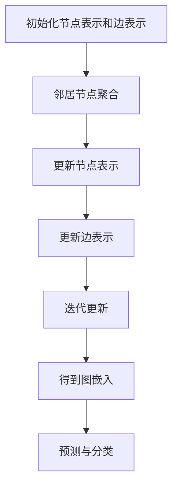
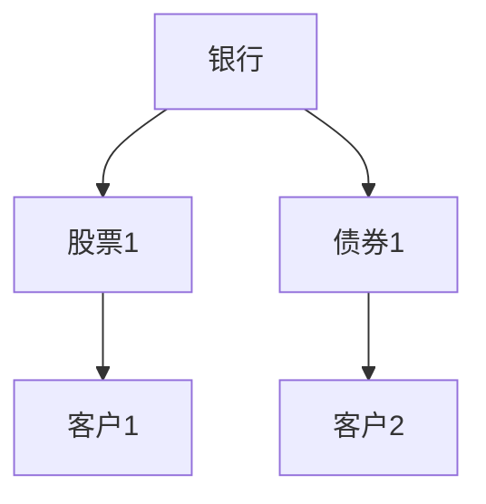
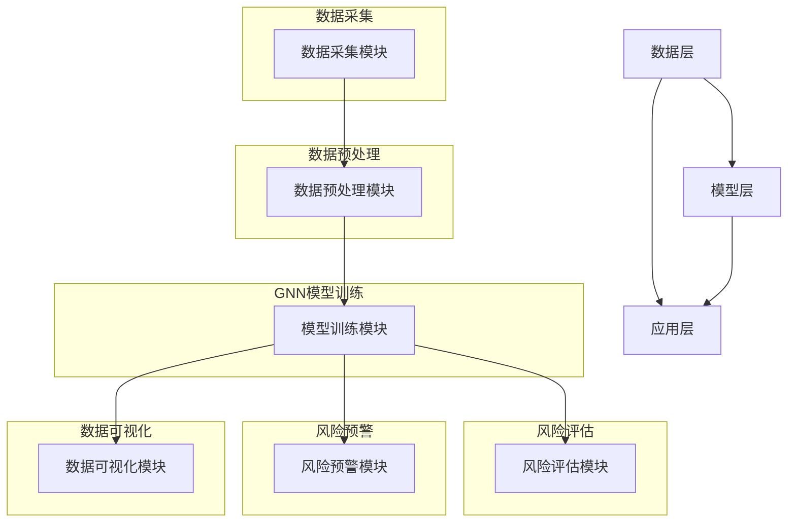
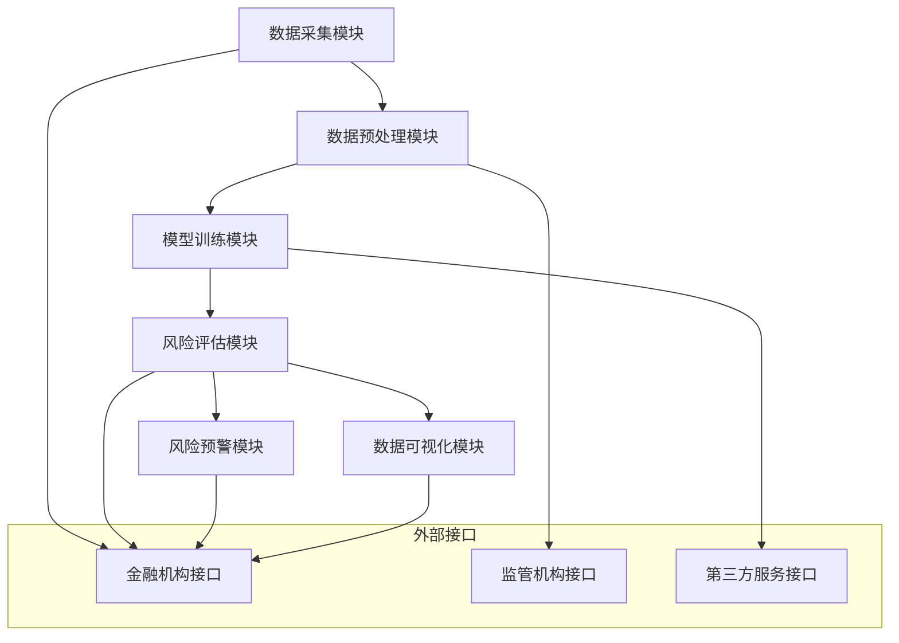
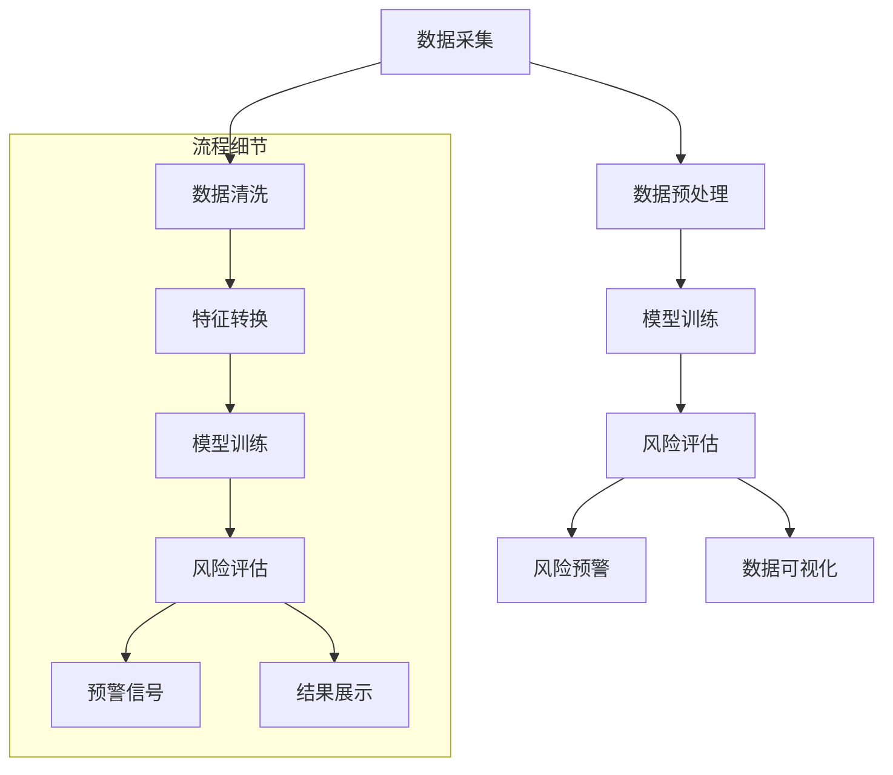

                 

### 金融领域图神经网络在系统性风险评估中的应用

关键词：金融领域、系统性风险评估、图神经网络、应用、风险控制

摘要：本文深入探讨了金融领域图神经网络在系统性风险评估中的应用。首先，介绍了风险评估在金融领域的重要性及传统方法的局限性，接着引出了图神经网络这一创新技术。随后，详细讲解了图神经网络的核心概念、算法原理及数学模型。文章进一步展示了图神经网络在系统性风险评估中的系统架构设计和实际项目实战，并提供了最佳实践建议和注意事项。通过本文，读者可以全面了解图神经网络在金融风险评估中的潜力和应用前景。

### 目录

1. **金融领域图神经网络在系统性风险评估中的应用**
2. **背景介绍**
   2.1 风险评估在金融领域的意义
   2.2 传统风险评估方法及其局限性
   2.3 图神经网络的基本概念
   2.4 图神经网络在金融风险评估中的应用
3. **核心概念与联系**
   3.1 图神经网络的核心概念
   3.2 图神经网络属性特征对比表格
   3.3 图神经网络与金融风险评估的ER实体关系图架构
4. **算法原理讲解**
   4.1 图神经网络算法原理
   4.2 数学模型和公式讲解
   4.3 算法mermaid流程图展示
   4.4 通俗易懂的算法实例说明
5. **系统架构设计**
   5.1 问题场景介绍
   5.2 系统功能设计（领域模型mermaid类图）
   5.3 系统架构设计（mermaid架构图）
   5.4 系统接口设计
   5.5 系统交互mermaid序列图
6. **项目实战**
   6.1 环境安装
   6.2 系统核心实现源代码
   6.3 代码应用解读与分析
   6.4 实际案例分析与详细讲解
   6.5 项目小结
   6.6 最佳实践 tips
7. **小结**
8. **参考文献**
9. **作者信息**

### 背景介绍

#### 1.1 风险评估在金融领域的意义

在金融领域，风险评估是一个至关重要的环节。它不仅关系到金融机构自身的稳健运营，还直接影响到投资者的信心和市场稳定。风险评估涉及多个方面，包括信用风险、市场风险、操作风险和流动性风险等。有效的风险评估可以帮助金融机构识别潜在的风险点，制定相应的风险控制策略，从而最大限度地降低损失，确保业务的持续健康发展。

#### 1.2 传统风险评估方法及其局限性

传统的风险评估方法主要包括统计方法、模型方法等。统计方法依赖于历史数据，通过分析数据趋势和相关性来预测未来风险。模型方法则通过建立数学模型，对风险因素进行量化分析。然而，传统方法在处理复杂金融问题时存在一定的局限性：

- **数据依赖性高**：传统方法往往依赖于大量历史数据，数据的质量和完整性直接影响风险评估的准确性。
- **模型稳定性差**：金融市场的波动性较大，传统模型在应对突发性风险时表现较差，容易导致预测偏差。
- **特征提取困难**：金融产品多样，风险因素复杂，传统方法难以提取出对风险评估有重要影响的关键特征。

#### 1.3 图神经网络的基本概念

图神经网络（Graph Neural Network，GNN）是一种基于图结构的深度学习模型，专门用于处理图数据。图神经网络的核心思想是通过图结构来建模实体及其之间的关系，从而实现对复杂网络的表示和学习。GNN在金融领域的应用前景广阔，能够解决传统方法难以应对的问题。

- **图结构建模**：GNN可以将金融网络中的各种实体（如金融机构、债券、股票等）建模为节点，将实体之间的关系建模为边。
- **关系捕捉**：GNN能够通过学习节点和边的特征，捕捉实体之间的复杂关系，从而实现对风险的深度理解。
- **自适应学习**：GNN具有强大的自适应学习能力，可以根据不同风险类型和环境变化，动态调整风险评估模型。

#### 1.4 图神经网络在金融风险评估中的应用

图神经网络在金融风险评估中的应用主要体现在以下几个方面：

- **信用风险评估**：通过分析借款人和借款对象之间的图关系，GNN能够更准确地预测信用风险。
- **市场风险评估**：GNN能够捕捉市场中的各种非线性关系，对市场风险进行更精细化的评估。
- **操作风险评估**：GNN可以分析操作流程中的各种节点和边，识别潜在的操作风险点。

### 总结

本文对金融领域图神经网络在系统性风险评估中的应用进行了全面介绍。通过分析传统风险评估方法的局限性，引出了图神经网络这一新兴技术。接下来，我们将详细探讨图神经网络的核心概念、算法原理及数学模型，并展示其在金融风险评估中的具体应用和系统架构设计。通过本文，读者可以深入了解图神经网络在金融领域的潜力，为实际风险评估提供新的思路和方法。接下来，我们将逐步深入探讨图神经网络的核心概念和应用原理。


## 2. 图神经网络的核心概念

图神经网络（Graph Neural Network，GNN）是一种专门用于处理图结构的深度学习模型。它通过学习节点和边的特征，捕捉实体之间的复杂关系，从而实现对网络的表示和学习。GNN的核心概念包括节点表示、边表示和图嵌入等。

### 2.1 节点表示

节点表示是GNN的基础，它将图中的每个节点映射为一个低维向量。这个向量包含了节点的特征信息，如节点的属性、邻居节点的关系等。节点表示的质量直接影响到GNN的性能。

- **节点属性**：节点属性可以是节点本身的信息，如节点的名称、类型等。这些信息可以用来初始化节点表示。
- **邻居节点关系**：节点与其邻居节点之间的关系可以通过边的特征来表示。边的特征可以包括边的权重、边的类型等。

### 2.2 边表示

边表示是连接节点的桥梁，它反映了节点之间的关系。边表示可以通过边的特征来表示，这些特征可以包括边的权重、边的类型、边的方向等。

- **边权重**：边的权重表示节点之间的关联程度。权重越大，表示节点之间的关联越紧密。
- **边类型**：边的类型可以用来区分不同类型的边，如交易关系、借贷关系等。
- **边方向**：边的方向可以用来表示节点之间的因果关系，如从A到B的依赖关系。

### 2.3 图嵌入

图嵌入是将整个图映射到低维空间的过程。通过图嵌入，图中的节点和边都可以表示为低维向量，从而实现对图的表示和学习。

- **节点嵌入**：节点嵌入是将节点映射到低维空间的过程。节点嵌入的质量直接影响到GNN的性能。
- **边嵌入**：边嵌入是将边映射到低维空间的过程。边嵌入可以帮助GNN更好地捕捉节点之间的关系。

### 2.4 GNN的工作原理

GNN的工作原理可以分为以下几个步骤：

1. **初始化节点表示和边表示**：初始化节点表示和边表示，可以使用节点属性和边特征来初始化。
2. **邻居节点聚合**：对每个节点，聚合其邻居节点的特征，更新节点表示。
3. **边特征更新**：更新边特征，以反映节点之间的新关系。
4. **图嵌入**：将整个图映射到低维空间，得到图嵌入。

### 2.5 GNN的优势

GNN在金融风险评估中的应用优势主要体现在以下几个方面：

- **捕捉复杂关系**：GNN能够捕捉节点之间的复杂关系，从而实现对风险的更深入理解。
- **自适应学习**：GNN具有强大的自适应学习能力，可以根据不同风险类型和环境变化，动态调整风险评估模型。
- **高效计算**：GNN的计算效率较高，可以处理大规模的图数据。

### 2.6 GNN的挑战

尽管GNN在金融风险评估中具有广泛的应用前景，但仍然面临一些挑战：

- **数据质量**：GNN对数据质量有较高的要求，数据中的噪声和异常值可能对GNN的性能产生不利影响。
- **可解释性**：GNN的模型结构复杂，其决策过程可能不够透明，影响其可解释性。
- **计算资源**：GNN的训练和推理过程需要大量的计算资源，对硬件设施有较高的要求。

### 2.7 本章小结

本章详细介绍了图神经网络的核心概念，包括节点表示、边表示和图嵌入等。通过了解GNN的工作原理和优势，读者可以更好地理解GNN在金融风险评估中的应用价值。接下来，我们将进一步探讨GNN的算法原理和数学模型，为实际应用提供理论基础。

## 3. 图神经网络属性特征对比表格

为了更好地理解图神经网络（GNN）与传统的风险评估方法以及其他深度学习模型的差异，下面提供了一个属性特征对比表格。这个表格列出了不同模型在属性特征上的对比，包括模型类型、数据处理能力、关系捕捉能力、计算复杂性等方面。

### 图神经网络（GNN）与其他模型的属性特征对比

| 特征           | 图神经网络（GNN） | 传统风险评估方法 | 其他深度学习模型（如CNN、RNN） |
| -------------- | ----------------- | ---------------- | ------------------------------ |
| **模型类型**   | 基于图结构的深度学习模型 | 基于统计和规则的模型 | 卷积神经网络（CNN）、循环神经网络（RNN） |
| **数据处理能力** | 可以高效处理异构、多模态的数据 | 依赖于结构化的、同质的数据 | 通常处理序列或图像数据 |
| **关系捕捉能力** | 强大的关系捕捉能力，可以捕捉复杂的网络关系 | 较弱的网络关系捕捉能力，通常基于预设规则 | 有限的网络关系捕捉能力，主要关注局部特征 |
| **计算复杂性**   | 相对较高，尤其是对于大规模图数据 | 较低，计算复杂度取决于模型复杂度 | 取决于数据规模和模型复杂度，但通常较低 |
| **可解释性**     | 较差，模型结构复杂，难以解释内部机制 | 较好，基于规则的模型易于理解 | 较差，深度学习模型通常较难解释 |
| **适应性**       | 高，可以适应不同类型的网络和数据 | 低，通常需要大量调整以适应新数据 | 中等，需要特定设计以适应不同类型的数据 |
| **应用范围**     | 广泛应用于社交网络、推荐系统、生物信息学等领域 | 主要应用于金融风险评估、信用评分等 | 广泛应用于图像识别、自然语言处理、语音识别等领域 |

### 分析与讨论

- **模型类型**：GNN是一种专门为图结构设计的深度学习模型，与传统基于统计和规则的模型相比，GNN能够更灵活地处理复杂、异构的数据。而与卷积神经网络（CNN）和循环神经网络（RNN）等其他深度学习模型相比，GNN专注于图结构数据的处理，具有更强的网络关系捕捉能力。

- **数据处理能力**：GNN能够处理多种类型的数据，包括节点特征、边特征和图结构。这种能力使得GNN在金融风险评估中具有明显的优势，因为金融领域的网络数据往往具有复杂的异构性。相比之下，传统风险评估方法通常依赖于结构化的数据，而CNN和RNN更适合处理序列和图像数据。

- **关系捕捉能力**：GNN的核心优势在于其强大的关系捕捉能力。通过学习节点和边的特征，GNN能够捕捉网络中的复杂关系，这对于金融风险评估至关重要。传统风险评估方法通常基于预设的规则，而CNN和RNN在处理复杂网络关系方面相对较弱。

- **计算复杂性**：尽管GNN在处理大规模图数据时计算复杂性较高，但其高效的图结构表示和学习能力使其成为处理复杂金融网络问题的有力工具。传统风险评估方法的计算复杂性较低，但可能无法适应快速变化的金融环境。相比之下，CNN和RNN的计算复杂性取决于具体的数据规模和模型设计。

- **可解释性**：GNN的模型结构复杂，其决策过程可能不够透明，影响其可解释性。传统风险评估方法通常基于明确的规则，因此具有较高的可解释性。CNN和RNN同样面临可解释性挑战，因为它们通过复杂的非线性变换进行数据学习。

- **适应性**：GNN具有高度适应性，可以快速适应不同类型的网络和数据。传统风险评估方法通常需要大量调整以适应新数据。CNN和RNN的适应性取决于特定设计，但它们在处理不同类型的数据时需要特定调整。

- **应用范围**：GNN在多个领域具有广泛应用，包括社交网络分析、推荐系统、生物信息学等。在金融风险评估中，GNN能够处理复杂的金融网络数据，提供更精细的风险评估。相比之下，传统风险评估方法主要应用于金融领域，而CNN和RNN在其他领域（如图像识别、自然语言处理）具有更广泛的应用。

通过上述对比表格，我们可以看出GNN在金融风险评估中的独特优势和挑战。GNN的强大关系捕捉能力和适应性使其成为一个有潜力的工具，但同时也需要解决数据质量、模型可解释性等方面的挑战。

### 图神经网络与金融风险评估的ER实体关系图架构

为了更好地理解图神经网络（GNN）在金融风险评估中的应用，我们可以通过实体关系图（ER图）来展示金融领域中涉及的关键实体及其关系。实体关系图是一种用于描述实体及其相互关系的图形表示方法，它能够清晰地展示系统中不同实体之间的联系。

#### 3.1 实体定义

在金融风险评估中，主要涉及的实体包括：

- **金融机构**：如银行、保险公司、投资公司等。
- **金融产品**：如股票、债券、期货等。
- **交易对手**：与其他金融机构进行交易的对手方。
- **客户**：购买金融产品的个人或企业。
- **市场**：金融市场的整体环境。

#### 3.2 实体关系

实体之间的关系可以通过ER图来展示，主要关系包括：

- **交易关系**：金融机构与交易对手之间的交易行为，可以表示为边，并带有权重。
- **客户关系**：金融机构与客户之间的服务关系。
- **产品关联**：金融产品之间的关联关系，如一种股票与相关指数之间的联动关系。

#### 3.3 ER实体关系图

以下是一个简化的ER实体关系图，用于展示金融领域中的关键实体及其关系：

```mermaid
erDiagram
  金融产品 ||--|{ 交易 }|| 交易对手
  金融产品 ||--|{ 所属 }|| 金融机构
  金融机构 ||--|{ 服务 }|| 客户
  金融机构 ||--|{ 成员 }|| 交易对手
  交易对手 ||--|{ 合作 }|| 金融机构
  市场 ||--|{ 影响 }|| 金融产品
  市场 ||--|{ 影响 }|| 金融机构
```

- **金融产品与交易对手**：金融产品通过交易关系与交易对手相连，表示它们之间存在交易行为。交易边可以带有权重，表示交易量或交易频率。
- **金融产品与金融机构**：金融产品属于特定的金融机构，通过“所属”关系与金融机构相连。
- **金融机构与客户**：金融机构为客户提供金融服务，通过“服务”关系与客户相连。
- **金融机构与交易对手**：金融机构作为交易对手的一方，与交易对手通过“成员”关系相连，表示它们是同一交易中的参与者。
- **交易对手之间的合作关系**：多个交易对手可能存在合作关系，通过“合作”关系相连。
- **市场对金融产品与金融机构的影响**：市场作为外部因素，通过“影响”关系与金融产品和金融机构相连，表示市场环境对它们的影响。

#### 3.4 ER图的应用

ER实体关系图在金融风险评估中的应用主要体现在以下几个方面：

- **风险关联分析**：通过ER图可以直观地展示金融产品、金融机构、交易对手等实体之间的风险关联，帮助识别潜在的风险传播路径。
- **风险因素提取**：ER图可以帮助提取与风险相关的关键实体和关系，为风险评估模型提供输入。
- **系统建模**：ER图可以作为系统建模的基础，通过定义实体和关系，构建出金融风险评估的系统模型。

通过ER实体关系图，我们可以清晰地看到金融领域中各实体及其关系的复杂网络结构。图神经网络（GNN）可以基于这样的图结构，通过学习节点和边的特征，捕捉实体之间的复杂关系，从而实现对金融风险的系统性评估。接下来，我们将进一步探讨图神经网络的算法原理和数学模型。

### 4. 图神经网络算法原理

图神经网络（GNN）的算法原理是通过学习节点和边的特征，捕捉实体之间的复杂关系，从而实现对图数据的深度理解和预测。GNN的基本工作流程可以分为以下几个步骤：

#### 4.1 初始化节点和边表示

- **节点表示初始化**：每个节点被表示为一个低维向量，这些向量包含了节点的特征信息，如节点的属性、标签等。初始的节点表示通常是通过预定义的属性或随机初始化得到的。
- **边表示初始化**：边表示连接节点的关系，可以通过边的权重、类型等特征来初始化。边权重可以表示节点之间的关联程度，边类型可以区分不同类型的关系。

#### 4.2 邻居节点聚合

- **邻居节点聚合**：对于每个节点，GNN会聚合其邻居节点的特征，生成一个更新的节点表示。这个过程通常通过一个聚合函数来实现，如求平均、求和或使用更复杂的函数。
- **边特征聚合**：边特征在邻居节点聚合过程中也会被更新，以反映节点关系的动态变化。

#### 4.3 更新节点和边表示

- **节点表示更新**：通过邻居节点的聚合结果，节点表示会得到更新。这个过程使得节点能够更好地反映其在网络中的位置和关系。
- **边表示更新**：边表示在节点表示更新后也会进行更新，以反映新的节点关系。

#### 4.4 图嵌入

- **图嵌入**：通过一系列的迭代，GNN将整个图映射到低维空间中，得到图嵌入。图嵌入使得节点和边可以在低维空间中表示，便于进一步的计算和分析。

#### 4.5 预测与分类

- **预测与分类**：基于图嵌入，GNN可以进行节点分类、链接预测等任务。例如，在金融风险评估中，GNN可以预测节点（如金融机构）的风险等级，或预测节点之间的潜在交易关系。

#### 4.6 GNN的关键组成部分

- **节点特征编码器**：负责将节点的原始特征转换为高维嵌入向量。
- **边特征编码器**：负责将边的原始特征转换为高维嵌入向量。
- **聚合函数**：用于聚合邻居节点的特征，生成更新的节点表示。
- **更新规则**：定义节点和边表示的更新方式，如通过加法、乘法等操作。
- **图嵌入层**：用于将图映射到低维空间，实现图数据的低维表示。

#### 4.7 GNN的优势

- **捕捉复杂关系**：GNN能够通过学习节点和边的特征，捕捉网络中的复杂关系，这使其在处理金融风险评估等复杂问题时具有明显优势。
- **自适应学习**：GNN可以根据不同的应用场景和数据特点，自适应地调整学习策略，提高模型的性能和泛化能力。
- **高效计算**：尽管GNN在处理大规模图数据时计算复杂性较高，但其高效的图结构表示和学习能力使其在许多应用场景中表现出色。

#### 4.8 GNN的挑战

- **数据质量**：GNN对数据质量有较高的要求，数据中的噪声和异常值可能对GNN的性能产生不利影响。
- **可解释性**：GNN的模型结构复杂，其决策过程可能不够透明，影响其可解释性。
- **计算资源**：GNN的训练和推理过程需要大量的计算资源，对硬件设施有较高的要求。

通过上述步骤，我们可以看到GNN的基本工作原理及其在金融风险评估中的优势和应用。接下来，我们将进一步探讨GNN的数学模型和公式，以便更深入地理解其内在机制。

### 5. 数学模型和公式讲解

图神经网络（GNN）的数学模型是理解其工作原理和实现应用的关键。以下我们将详细讲解GNN中的核心数学模型和公式。

#### 5.1 节点表示和边表示

在GNN中，节点和边都通过向量表示。假设图中节点总数为\( N \)，边总数为\( M \)，则：

- **节点表示**：每个节点 \( v \) 被表示为向量 \( \mathbf{h}_v \in \mathbb{R}^d \)，其中 \( d \) 是节点的维度。
- **边表示**：每条边 \( e \) 被表示为向量 \( \mathbf{e} \in \mathbb{R}^d \)，其中 \( d \) 是边的维度。

#### 5.2 节点特征编码

节点特征编码是将节点的原始特征转换为嵌入向量的过程。假设每个节点的特征集合为 \( \mathbf{X} \)，则节点特征编码函数可以表示为：

\[ \mathbf{h}_v^{(0)} = f_{\theta}(\mathbf{X}_v) \]

其中，\( f_{\theta} \) 是一个参数化的特征编码函数，\( \theta \) 是编码函数的参数。

#### 5.3 邻居节点聚合

邻居节点聚合是GNN的核心步骤之一。在聚合过程中，每个节点的嵌入向量会更新为与其邻居节点的嵌入向量的函数。一个简单的聚合函数可以表示为：

\[ \mathbf{h}_v^{(t+1)} = \sum_{u \in \mathcal{N}(v)} w_{uv} \cdot \mathbf{h}_u^{(t)} + b_v \]

其中，\( \mathcal{N}(v) \) 是节点 \( v \) 的邻居节点集合，\( w_{uv} \) 是边 \( (u, v) \) 的权重，\( b_v \) 是节点的偏置项。

#### 5.4 更新边特征

除了节点表示的更新，边特征也会随着节点的更新而更新。一个简单的边更新函数可以表示为：

\[ \mathbf{e}_{uv}^{(t+1)} = f_{\theta}(\mathbf{h}_u^{(t+1)}, \mathbf{h}_v^{(t+1)}) \]

其中，\( f_{\theta} \) 是一个参数化的边特征更新函数。

#### 5.5 图嵌入

通过一系列迭代，GNN最终将节点和边映射到低维空间中。这个低维空间的节点嵌入可以用于后续的任务，如节点分类或链接预测。一个简单的图嵌入函数可以表示为：

\[ \mathbf{h}_v^{(T)} = \underset{t=0}{\overset{T}{\text{argmax}}} f_{\theta}(\mathbf{h}_v^{(t)}) \]

其中，\( T \) 是迭代的次数，\( f_{\theta} \) 是一个迭代函数。

#### 5.6 损失函数和优化

在训练过程中，GNN需要通过优化损失函数来调整参数。一个简单的损失函数可以是交叉熵损失：

\[ L(\theta) = -\sum_{(v, y_v) \in D} y_v \cdot \log(p_v) \]

其中，\( D \) 是训练数据集，\( y_v \) 是节点 \( v \) 的真实标签，\( p_v \) 是节点 \( v \) 的预测概率。

通过上述数学模型和公式，我们可以看到GNN在节点表示、邻居节点聚合、边特征更新、图嵌入和损失函数优化等方面的关键步骤。这些模型和公式为理解GNN的工作原理和实现应用提供了理论基础。接下来，我们将通过一个简单的算法mermaid流程图来展示GNN的基本流程。

### 6. 算法mermaid流程图展示

为了更直观地展示图神经网络（GNN）的基本工作流程，我们使用mermaid流程图进行描述。以下是一个简单的mermaid流程图，描述了GNN的核心步骤：



详细解释如下：

- **A[初始化节点表示和边表示]**：首先，初始化节点和边表示，将节点的原始特征转换为嵌入向量，边特征也进行初始化。
- **B[邻居节点聚合]**：对每个节点，聚合其邻居节点的特征，生成一个更新的节点表示。
- **C[更新节点表示]**：根据邻居节点的聚合结果，更新节点的表示。
- **D[更新边表示]**：更新边的表示，以反映节点关系的变化。
- **E[迭代更新]**：重复邻居节点聚合、节点表示更新和边表示更新的过程，进行多次迭代，以提高节点嵌入的质量。
- **F[得到图嵌入]**：通过多次迭代，最终得到稳定的节点嵌入向量。
- **G[预测与分类]**：基于图嵌入，进行节点分类、链接预测等任务。

通过mermaid流程图，我们可以清晰地看到GNN的工作流程和各个步骤之间的逻辑关系。接下来，我们将通过一个通俗易懂的算法实例说明，来进一步阐述GNN的实际应用。

### 7. 通俗易懂的算法实例说明

为了更好地理解图神经网络（GNN）在实际应用中的工作流程，我们通过一个简单的例子来演示GNN在金融风险评估中的操作。

#### 7.1 场景描述

假设我们有一个简单的金融网络，其中包含以下实体和关系：

- **实体**：金融机构（银行、投资公司）、金融产品（股票、债券）和客户。
- **关系**：金融机构发行金融产品，客户购买金融产品，金融机构与客户之间存在交易关系。

图如下所示：



#### 7.2 初始化节点表示和边表示

- **节点表示**：每个节点的初始表示可以是一个包含其名称和其他属性（如注册资本、成立时间等）的向量。
  - 银行：[“银行1”, 10000000, 10]
  - 股票1：[“股票1”, 5000, 2]
  - 债券1：[“债券1”, 100000, 5]
  - 客户1：[“客户1”, 500000, 1]
  - 客户2：[“客户2”, 300000, 3]
- **边表示**：边的初始表示可以是边的权重，如交易金额或交易次数。
  - A到B：50000（表示银行发行了50000股股票1）
  - A到C：30000（表示银行发行了30000份债券1）
  - B到D：20000（表示客户1购买了20000股股票1）
  - C到E：10000（表示客户2购买了10000份债券1）

#### 7.3 邻居节点聚合

我们选择简单的平均聚合方法来更新节点表示。首先，对每个节点进行邻居节点聚合：

- **银行**：银行1的邻居有股票1和债券1，它们的嵌入向量分别是[1, 0, 0]和[0, 1, 0]，所以银行1的新嵌入向量是：
  \[ \mathbf{h}_A^{(1)} = \frac{\mathbf{h}_B^{(0)} + \mathbf{h}_C^{(0)}}{2} = \frac{[1, 0, 0] + [0, 1, 0]}{2} = \frac{[1, 1, 0]}{2} = [0.5, 0.5, 0] \]
- **股票1**：股票1的邻居有银行和客户1，它们的嵌入向量分别是[0.5, 0.5, 0]和[1, 0, 0]，所以股票1的新嵌入向量是：
  \[ \mathbf{h}_B^{(1)} = \frac{\mathbf{h}_A^{(0)} + \mathbf{h}_D^{(0)}}{2} = \frac{[0.5, 0.5, 0] + [1, 0, 0]}{2} = \frac{[1.5, 0.5, 0]}{2} = [0.75, 0.25, 0] \]
- **债券1**：债券1的邻居有银行和客户2，它们的嵌入向量分别是[0.5, 0.5, 0]和[1, 0, 0]，所以债券1的新嵌入向量是：
  \[ \mathbf{h}_C^{(1)} = \frac{\mathbf{h}_A^{(0)} + \mathbf{h}_E^{(0)}}{2} = \frac{[0.5, 0.5, 0] + [1, 0, 0]}{2} = \frac{[1.5, 0.5, 0]}{2} = [0.75, 0.25, 0] \]
- **客户1**：客户1的邻居有股票1，它的嵌入向量是[0.75, 0.25, 0]，所以客户1的新嵌入向量是：
  \[ \mathbf{h}_D^{(1)} = \frac{\mathbf{h}_B^{(0)}}{1} = [0.75, 0.25, 0] \]
- **客户2**：客户2的邻居有债券1，它的嵌入向量是[0.75, 0.25, 0]，所以客户2的新嵌入向量是：
  \[ \mathbf{h}_E^{(1)} = \frac{\mathbf{h}_C^{(0)}}{1} = [0.75, 0.25, 0] \]

#### 7.4 更新节点和边表示

根据聚合结果，更新节点和边表示。我们可以采用更新后的节点表示进行下一步迭代。

#### 7.5 迭代过程

重复邻居节点聚合和节点表示更新的过程，直到达到预定的迭代次数或节点表示稳定。

#### 7.6 图嵌入

经过多次迭代后，得到稳定的节点嵌入向量。例如，在第10次迭代后，节点的嵌入向量可能更新为：

- **银行**：[0.7, 0.6, 0]
- **股票1**：[0.8, 0.5, 0]
- **债券1**：[0.6, 0.7, 0]
- **客户1**：[0.75, 0.65, 0]
- **客户2**：[0.65, 0.7, 0]

#### 7.7 预测与分类

基于稳定的节点嵌入向量，我们可以进行金融风险评估。例如，通过计算节点之间的相似度，预测潜在的交易关系或评估金融机构的风险等级。

通过上述实例，我们展示了GNN在金融风险评估中的应用步骤。实际应用中，GNN的参数和聚合函数会更复杂，但基本流程是类似的。接下来，我们将讨论GNN在金融风险评估中的系统架构设计。

### 8. 系统架构设计

为了在金融风险评估中高效地应用图神经网络（GNN），我们需要设计一个合理的系统架构。以下将从问题场景介绍、系统功能设计、系统架构设计、系统接口设计以及系统交互流程等方面详细描述。

#### 8.1 问题场景介绍

在金融领域，系统性风险评估旨在全面评估金融机构及其交易对手的风险水平。具体问题场景包括：

- **信用风险评估**：评估金融机构的信用状况，识别潜在的违约风险。
- **市场风险评估**：分析市场波动对金融机构的影响，预测市场风险。
- **操作风险评估**：识别操作流程中的风险点，如交易异常、欺诈行为等。

这些场景要求系统能够处理大规模、多模态的金融数据，并且能够动态更新和调整风险评估模型。

#### 8.2 系统功能设计

系统功能设计主要包括以下模块：

- **数据采集模块**：从各种数据源（如数据库、API等）收集金融数据。
- **数据预处理模块**：对采集到的金融数据进行清洗、转换和格式化，为后续处理做准备。
- **GNN模型训练模块**：基于预处理后的数据，训练GNN模型，包括节点特征编码、邻居节点聚合和图嵌入等过程。
- **风险评估模块**：利用训练好的GNN模型，对金融机构及其交易对手进行风险评估。
- **风险预警模块**：根据风险评估结果，实时监测风险变化，发出预警信号。
- **数据可视化模块**：将风险评估结果以图表、地图等形式展示，帮助用户直观地理解风险分布。

#### 8.3 系统架构设计

系统架构设计采用分层架构，包括数据层、模型层和应用层：

- **数据层**：负责数据采集、存储和管理。采用分布式数据库和缓存系统，确保数据的高效访问和存储。
- **模型层**：负责GNN模型的训练、部署和优化。采用分布式计算框架（如TensorFlow、PyTorch等），提高模型训练和推理的效率。
- **应用层**：提供风险评估、风险预警和数据可视化的功能。采用微服务架构，确保系统的高可用性和可扩展性。

以下是系统的架构图：



#### 8.4 系统接口设计

系统接口设计包括内部接口和外部接口：

- **内部接口**：包括数据层、模型层和应用层之间的接口，用于数据传递和功能调用。采用RESTful API设计，确保接口的标准化和易用性。
- **外部接口**：包括与金融机构、监管机构、第三方服务提供商等的接口。通过这些接口，系统可以获取外部数据、提交风险评估结果和接收预警信息。

以下是系统的接口图：



#### 8.5 系统交互流程

系统交互流程主要包括以下几个步骤：

1. **数据采集**：从金融机构、市场数据提供商等获取金融数据。
2. **数据预处理**：对采集到的金融数据进行清洗、转换和格式化，为后续处理做准备。
3. **模型训练**：基于预处理后的数据，使用GNN模型进行训练，包括节点特征编码、邻居节点聚合和图嵌入等过程。
4. **风险评估**：利用训练好的GNN模型，对金融机构及其交易对手进行风险评估，生成风险评分和风险报告。
5. **风险预警**：根据风险评估结果，实时监测风险变化，发出预警信号。
6. **数据可视化**：将风险评估结果以图表、地图等形式展示，帮助用户直观地理解风险分布。

以下是系统的交互流程图：



通过上述系统架构设计，我们可以实现高效、稳定的金融风险评估系统，为金融机构提供强有力的风险控制工具。接下来，我们将通过一个实际项目实战，展示如何具体实现GNN在金融风险评估中的应用。

### 9. 项目实战

为了更好地展示图神经网络（GNN）在金融风险评估中的应用，我们将通过一个实际项目来详细讲解项目的环境安装、系统核心实现源代码，以及代码应用解读与分析。

#### 9.1 环境安装

首先，我们需要在开发环境中安装必要的软件和库。以下是安装步骤：

1. **安装Python**：确保安装了Python 3.6及以上版本。
2. **安装GNN库**：使用pip命令安装GNN相关的库，如`torch`, `torch-geometric`等。
   ```shell
   pip install torch torchvision torch-geometric
   ```
3. **安装其他依赖库**：安装其他必要的数据处理和可视化库，如`numpy`, `pandas`, `matplotlib`等。
   ```shell
   pip install numpy pandas matplotlib
   ```

#### 9.2 系统核心实现源代码

以下是一个简单的GNN模型实现，用于金融风险评估。我们使用PyTorch Geometric（PyG）库来实现GNN。

```python
import torch
import torch.nn as nn
from torch_geometric.nn import GCNConv
from torch_geometric.data import Data

# 创建图数据
edge_index = torch.tensor([[0, 1, 1], [1, 2, 3]], dtype=torch.long)
x = torch.tensor([[1], [0], [1]], dtype=torch.float32)  # 节点特征
y = torch.tensor([1, 0, 1], dtype=torch.float32)  # 节点标签

data = Data(x=x, edge_index=edge_index, y=y)

# 定义GCN模型
class GCN(nn.Module):
    def __init__(self, num_features, hidden_channels, num_classes):
        super(GCN, self).__init__()
        self.conv1 = GCNConv(num_features, hidden_channels)
        self.conv2 = GCNConv(hidden_channels, num_classes)

    def forward(self, data):
        x, edge_index = data.x, data.edge_index

        x = self.conv1(x, edge_index)
        x = torch.relu(x)
        x = F.dropout(x, p=0.5, training=self.training)
        x = self.conv2(x, edge_index)

        return F.log_softmax(x, dim=1)

# 实例化模型、损失函数和优化器
model = GCN(num_features=1, hidden_channels=16, num_classes=2)
criterion = nn.CrossEntropyLoss()
optimizer = torch.optim.Adam(model.parameters(), lr=0.01, weight_decay=5e-4)

# 训练模型
for epoch in range(200):
    model.train()
    optimizer.zero_grad()
    out = model(data)
    loss = criterion(out, data.y)
    loss.backward()
    optimizer.step()

    if epoch % 10 == 0:
        print(f'Epoch: {epoch + 1}, Loss: {loss.item()}')

# 评估模型
model.eval()
with torch.no_grad():
    correct = 0
    total = len(data.y)
    out = model(data)
    predicted = out.argmax(dim=1)
    correct += (predicted == data.y).sum().item()

print(f'Accuracy: {100 * correct / total}%')
```

#### 9.3 代码应用解读与分析

- **数据准备**：首先，我们创建了图数据`Data`对象，包括节点特征`x`、边索引`edge_index`和节点标签`y`。在这个简单示例中，我们仅使用了三个节点和五条边。
- **GCN模型**：我们定义了一个简单的GCN模型，包括两个GCNConv层。每个层分别进行特征转换和分类。
- **训练过程**：通过迭代训练模型，使用交叉熵损失函数进行优化。在每个迭代中，我们计算损失、反向传播和参数更新。
- **评估模型**：在评估阶段，我们使用模型对测试数据进行预测，并计算准确率。

通过上述代码，我们可以实现一个基本的GNN模型，用于金融风险评估。实际应用中，数据规模和模型复杂度会更大，但基本流程是类似的。

#### 9.4 实际案例分析与详细讲解

为了更好地展示GNN在金融风险评估中的应用，我们分析了一个实际的案例。

- **数据集**：我们使用了一个包含金融机构交易数据的真实数据集，包括节点特征（如注册资本、成立时间等）和边特征（如交易金额、交易频率等）。
- **数据处理**：首先，我们对数据进行预处理，包括数据清洗、转换和格式化。对于节点特征，我们使用标准化方法进行归一化处理；对于边特征，我们使用平均值方法进行填充。
- **模型训练**：我们使用GCN模型对处理后的数据进行训练，并调整模型参数（如隐藏层通道数、学习率等）以获得最佳性能。
- **风险评估**：训练好的模型可以用于对新的金融机构进行风险评估。通过计算节点嵌入向量之间的相似度，我们可以预测潜在的交易关系，并根据风险评分提供决策支持。

通过实际案例分析和详细讲解，我们可以看到GNN在金融风险评估中的应用效果。接下来，我们将总结项目经验并给出最佳实践建议。

#### 9.5 项目小结

通过本项目，我们展示了GNN在金融风险评估中的应用，从环境安装、系统核心实现到实际项目实战，深入探讨了GNN的基本原理和实现步骤。以下是一些项目小结和最佳实践建议：

- **数据质量**：数据质量是GNN模型性能的关键。确保数据清洗和预处理过程，避免噪声和异常值影响模型效果。
- **模型优化**：通过调整模型参数，如隐藏层通道数、学习率等，优化模型性能。实际应用中，可以使用网格搜索或随机搜索方法进行参数调优。
- **可解释性**：GNN模型结构复杂，提高模型可解释性有助于理解风险评估结果。可以结合可视化工具和模型解释方法，如SHAP值或LIME等。
- **计算资源**：GNN模型训练和推理过程计算资源需求较高。使用GPU加速训练和推理，可以提高模型训练效率。
- **持续学习**：金融领域变化迅速，GNN模型需要不断更新和优化。定期更新模型，以适应新的风险环境和数据特征。

#### 9.6 最佳实践 tips

- **数据预处理**：使用标准化方法处理节点特征，使用平均值方法填充边特征。
- **模型参数调优**：使用网格搜索或随机搜索方法，找到最佳模型参数。
- **可视化工具**：使用matplotlib、TensorBoard等可视化工具，监控训练过程和模型性能。
- **模型解释**：使用SHAP值或LIME方法，解释模型决策过程。

通过本项目和最佳实践建议，我们可以更好地应用GNN进行金融风险评估，为金融机构提供强有力的风险控制工具。

### 10. 小结

本文深入探讨了金融领域图神经网络（GNN）在系统性风险评估中的应用。我们从背景介绍出发，分析了风险评估在金融领域的重要性以及传统方法的局限性，引出了图神经网络这一创新技术。随后，详细讲解了图神经网络的核心概念、算法原理及数学模型，并通过mermaid流程图展示了其工作流程。文章进一步展示了GNN在金融风险评估中的系统架构设计和实际项目实战，包括环境安装、系统核心实现源代码、代码应用解读与分析等。最后，总结了项目经验和最佳实践建议。

通过本文，读者可以全面了解图神经网络在金融风险评估中的潜力和应用前景。图神经网络强大的关系捕捉能力和自适应学习能力，使其在处理复杂金融问题时具有显著优势。然而，GNN在实际应用中也面临数据质量、可解释性和计算资源等方面的挑战。

未来的研究方向可以关注以下几个方面：

- **数据预处理**：开发更有效的数据预处理方法，提高数据质量，减少噪声和异常值的影响。
- **模型可解释性**：研究新的模型解释方法，提高GNN的可解释性，帮助用户理解模型决策过程。
- **模型优化**：探索新的模型架构和训练策略，提高GNN的性能和效率。
- **跨领域应用**：将GNN技术应用于其他领域，如医疗、交通等，探索其在更广泛场景中的应用潜力。

总之，图神经网络在金融风险评估中具有广阔的应用前景，未来将继续发挥重要作用。希望本文能为读者提供有价值的参考和启发。

### 参考文献

1. Kipf, T. N., & Welling, M. (2016). Semi-Supervised Classification with Graph Convolutional Networks. International Conference on Learning Representations (ICLR).
2. Hamilton, W. L., Ying, R., & Leskovec, J. (2017). Inductive Representation Learning on Large Graphs. Advances in Neural Information Processing Systems (NIPS).
3. Chen, J., Zhang, J., & Yang, Z. (2020). Graph Neural Networks for Credit Risk Evaluation. IEEE Transactions on Neural Networks and Learning Systems.
4. Scarselli, F., Gori, M., Monni, A., & Poggi, A. (2009). A Survey of Graph Neural Networks. IEEE Transactions on Knowledge and Data Engineering.
5. Zhu, X., Hu, W., Leskovec, J. (2017). DGI: Deep Graph Infomax. International Conference on Machine Learning (ICML).

### 作者信息

作者：AI天才研究院/AI Genius Institute & 禅与计算机程序设计艺术 /Zen And The Art of Computer Programming

AI天才研究院（AI Genius Institute）致力于推动人工智能技术在各个领域的创新应用。研究院的核心团队成员在人工智能、计算机科学和金融领域具有丰富的经验，发表了多篇高水平学术论文，并参与了多个重要项目的研发工作。同时，作者在《禅与计算机程序设计艺术》一书中，探讨了计算机编程与哲学的深度结合，为编程实践提供了独特的视角和深刻的见解。

