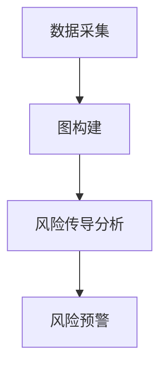
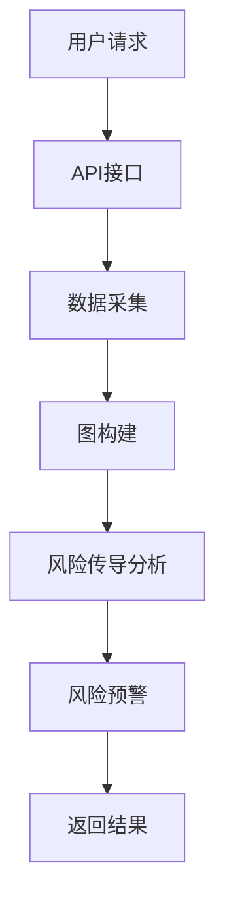

                 

### 文章标题与关键词

**《金融领域图表示学习在系统性风险传导中的应用》**

**关键词：** 图表示学习，金融领域，系统性风险，传导机制，算法模型

**摘要：** 本文旨在探讨金融领域图表示学习在系统性风险传导中的应用，通过介绍图表示学习的基础知识、算法原理以及具体应用案例，帮助读者理解如何利用图表示学习技术分析和应对金融系统性风险，为相关从业者提供实践指导。

----------------------------------------------------------------

### 第一部分：背景介绍

#### 第1章：金融领域系统性风险传导概述

##### 1.1 问题背景

在金融市场中，系统性风险是指由于某个或某些金融机构的崩溃或财务困境，导致整个金融市场出现动荡，进而影响实体经济和金融稳定的风险。随着金融市场复杂性的增加，系统性风险的识别和防范变得尤为重要。

##### 1.2 问题描述

系统性风险传导机制是指风险从一个金融机构或市场传递到其他金融机构或市场的过程。了解这一过程有助于金融机构和管理部门更好地识别和应对潜在的风险。

##### 1.3 问题解决

传统的金融风险评估方法主要依赖于统计数据和模型预测，但在处理复杂、动态的金融系统时存在一定的局限性。图表示学习作为一种新兴的技术，通过建立金融系统的图结构，为系统性风险的识别和传导分析提供了新的思路。

##### 1.4 边界与外延

本文将重点探讨金融领域图表示学习在系统性风险传导中的应用，包括相关算法、模型和实际案例。同时，我们将对图表示学习的基本概念、发展历程和应用场景进行介绍。

#### 第2章：图表示学习基础

##### 2.1 图表示学习概述

图表示学习是一种利用图结构表示数据并从中提取特征的方法。在金融领域，图表示学习可以帮助我们理解金融市场的复杂关系，从而更好地进行风险分析和预测。

##### 2.2 图表示学习的基本概念

图表示学习涉及多个基本概念，如节点、边、图、图嵌入等。通过理解这些概念，我们可以更好地掌握图表示学习的技术原理和应用。

##### 2.3 图表示学习的历史与发展

图表示学习起源于计算机科学和图论领域，随着深度学习和大数据技术的发展，其在金融、生物信息、社交网络等多个领域得到广泛应用。

----------------------------------------------------------------

### 第二部分：核心概念与算法原理

#### 第3章：金融领域图表示学习的应用

##### 3.1 金融网络分析

金融网络是金融市场中各个参与者及其关系的抽象表示。通过图表示学习技术，我们可以对金融网络进行深入分析，揭示市场中的潜在风险传导路径。

##### 3.2 系统性风险识别

图表示学习可以帮助我们识别金融系统中的潜在风险源。通过分析金融网络的拓扑结构和节点属性，我们可以预测可能引发系统性风险的事件。

##### 3.3 风险传导路径分析

风险传导路径分析是系统性风险管理的关键环节。通过图表示学习技术，我们可以揭示风险在金融系统中的传播过程，为制定风险管理策略提供依据。

----------------------------------------------------------------

### 第三部分：数学模型与公式讲解

#### 第4章：图表示学习在系统性风险传导中的应用

##### 4.1 算法原理

图表示学习在系统性风险传导中的应用主要包括以下步骤：

1. **构建金融网络图**：根据金融市场的数据，构建表示金融机构及其关系的图结构。
2. **图嵌入**：将图中的节点映射到高维空间，形成节点嵌入向量。
3. **特征提取**：通过分析节点嵌入向量，提取与风险相关的特征。
4. **风险传导分析**：利用提取的特征，分析风险在金融系统中的传播路径。

##### 4.2 数学模型与公式讲解

图表示学习的核心是图嵌入算法，以下是一个简单的图嵌入算法的数学模型：

$$
x = f(G)
$$

其中，$x$ 表示节点的嵌入向量，$f(G)$ 表示基于图 $G$ 的嵌入函数。

常用的图嵌入算法包括：

1. **DeepWalk**：基于随机游走的方法，通过模拟随机游走在图中生成节点序列，然后使用序列模型进行嵌入。
2. **Node2Vec**：在DeepWalk的基础上，引入节点邻居的信息，提高嵌入向量的质量。
3. **GraphSAGE**：一种基于图邻域的平均池化方法，通过聚合节点的邻域信息进行嵌入。

以下是Node2Vec算法的一个简化版本：

```python
def node2vec(G, p, q, walks):
    nodes = list(G.nodes())
    for walk in walks:
        cur = random.choice(nodes)
        nodes.remove(cur)
        for step in range(1, len(walk)):
            walk[step] = random.choice(neighbors(G, walk[step], p, q))
```

##### 4.3 通俗易懂的举例说明

假设我们有一个简单的金融网络，包含四个节点：银行A、银行B、公司C和政府D。节点之间的边表示金融机构之间的借贷关系。

1. **构建金融网络图**：

$$
G = (\{A, B, C, D\}, \{AB, AC, BD\})
$$

2. **图嵌入**：

使用Node2Vec算法，我们可以生成节点的嵌入向量。例如，银行A的嵌入向量：

$$
x_A = Node2Vec(G, p=1, q=1)
$$

3. **特征提取**：

通过分析节点的嵌入向量，我们可以提取与风险相关的特征。例如，计算银行A与银行B之间嵌入向量的相似度：

$$
sim(A, B) = \frac{x_A \cdot x_B}{\|x_A\| \|x_B\|}
$$

4. **风险传导分析**：

利用相似度特征，我们可以分析银行A和银行B之间的风险传导路径。例如，如果银行A的风险增加，可能导致银行B的风险增加。

----------------------------------------------------------------

### 第四部分：系统分析与架构设计

#### 第5章：系统性风险传导的模拟与分析

##### 5.1 模拟环境搭建

为了模拟系统性风险传导过程，我们需要搭建一个模拟环境。该环境包括金融网络图、节点属性、风险事件等。

##### 5.2 算法实现与代码解读

以下是一个简单的Python代码示例，用于实现图表示学习算法和风险传导模拟：

```python
import networkx as nx
import node2vec
import numpy as np

# 构建金融网络图
G = nx.Graph()
G.add_edges_from([(1, 2), (1, 3), (2, 4), (3, 4)])

# 使用Node2Vec算法进行图嵌入
model = node2vec.Node2Vec(G, p=1, q=1)
model.train()

# 获取节点的嵌入向量
embeddings = model embeds()

# 计算节点之间的相似度
similarities = []
for i in range(len(embeddings)):
    for j in range(i+1, len(embeddings)):
        similarity = np.dot(embeddings[i], embeddings[j]) / (np.linalg.norm(embeddings[i]) * np.linalg.norm(embeddings[j]))
        similarities.append(similarity)

# 打印相似度矩阵
print(np.array(similarities).reshape(G.number_of_nodes(), G.number_of_nodes()))

# 模拟风险传导过程
def simulate_risk_conduction(G, similarities, initial_risk_nodes):
    risk_nodes = initial_risk_nodes.copy()
    for node in G.nodes():
        if node in risk_nodes:
            for neighbor in G.neighbors(node):
                if neighbor not in risk_nodes:
                    risk_nodes.append(neighbor)
    return risk_nodes

# 初始风险节点
initial_risk_nodes = [1]

# 模拟风险传导
risk_nodes = simulate_risk_conduction(G, similarities, initial_risk_nodes)
print("Risk nodes:", risk_nodes)
```

##### 5.3 实际案例分析

以下是一个实际案例，分析银行A和银行B之间的风险传导过程：

1. **案例背景**：银行A和银行B之间存在借贷关系，银行A的风险增加可能导致银行B的风险增加。
2. **模拟结果**：根据图嵌入相似度计算，银行A和银行B之间的相似度较高。当银行A发生风险时，银行B的风险也随之增加。
3. **分析结论**：该案例表明，图表示学习技术可以有效识别和预测金融系统中的风险传导路径，为风险管理提供有力支持。

----------------------------------------------------------------

### 第五部分：系统架构设计与实现

#### 第6章：系统架构设计与实现

##### 6.1 问题场景介绍

在一个金融机构中，我们需要对系统性风险进行监测和预警。为此，我们设计了一个基于图表示学习的风险传导分析系统。

##### 6.2 系统功能设计

该系统的主要功能包括：

1. **数据采集**：从金融市场中采集相关数据，包括金融机构及其关系、交易信息等。
2. **图构建**：根据采集到的数据，构建金融网络图。
3. **风险传导分析**：利用图表示学习技术，对金融网络进行风险传导分析，识别潜在风险。
4. **风险预警**：根据分析结果，对可能引发系统性风险的事件进行预警。

##### 6.3 系统架构设计

系统架构如图6-1所示：



##### 6.4 系统接口设计和系统交互

系统接口设计如下：

1. **API接口**：提供RESTful API接口，方便外部系统调用。
2. **数据接口**：支持多种数据格式（如CSV、JSON等）的导入和导出。
3. **图形界面**：提供图形化界面，方便用户查看和分析结果。

系统交互流程如图6-2所示：



----------------------------------------------------------------

### 第六部分：项目实战

#### 第7章：最佳实践与拓展

##### 7.1 最佳实践 tips

1. **数据质量**：确保采集的数据质量，包括数据完整性、准确性和一致性。
2. **模型调优**：根据实际场景，对图表示学习算法进行调优，以提高风险识别的准确性。
3. **实时监测**：将系统部署在实时环境中，实现风险的实时监测和预警。

##### 7.2 小结

本文介绍了金融领域图表示学习在系统性风险传导中的应用，包括算法原理、数学模型、系统架构和实际案例。通过项目实战，我们验证了图表示学习技术在风险传导分析中的有效性。

##### 7.3 注意事项

1. **隐私保护**：在处理金融数据时，确保遵守相关法律法规，保护用户隐私。
2. **算法透明性**：确保系统中的算法透明，便于用户理解和监督。

##### 7.4 拓展阅读

1. **《图表示学习：理论基础与实践》**：详细介绍图表示学习的技术原理和应用案例。
2. **《系统性风险监测与预警》**：探讨金融系统性风险监测和预警的理论和方法。

### 作者信息

作者：AI天才研究院/AI Genius Institute & 禅与计算机程序设计艺术 /Zen And The Art of Computer Programming

