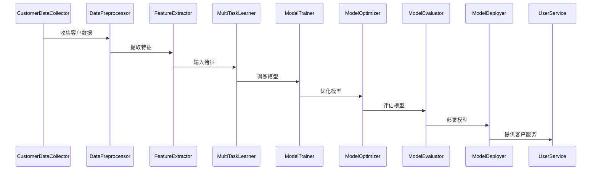
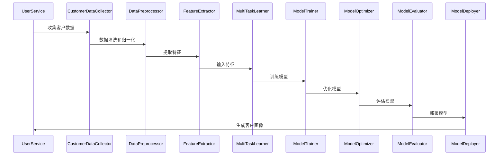

                 


### 第三部分：多任务学习在金融领域客户全景画像中的应用

#### 3.1 金融领域客户全景画像的需求

金融领域客户全景画像旨在通过分析客户的多个维度数据，如交易记录、信用评分、消费行为等，构建出一个全面反映客户特征和需求的模型。这样的模型能够帮助金融机构实现精准营销、风险控制和个性化服务。

#### 3.2 多任务学习的优势

多任务学习在金融领域客户全景画像中的应用具有以下几个优势：

1. **提高模型泛化能力**：通过共享表示空间，多任务学习能够学习到更普遍的特征，从而提高模型的泛化能力。
2. **减少过拟合风险**：多个任务之间可以相互监督，减少单一任务的过拟合风险。
3. **数据利用率更高**：金融领域数据量大且多样化，多任务学习能够充分利用这些数据，提高模型的效果。

#### 3.3 金融领域客户全景画像中的多任务学习挑战

尽管多任务学习具有上述优势，但在金融领域客户全景画像中应用仍面临以下挑战：

1. **数据多样性**：金融领域涉及多种类型的数据，如何有效地整合和处理这些数据是一个难题。
2. **数据质量**：金融数据质量参差不齐，噪声、缺失值和异常值会影响模型的效果。
3. **隐私保护**：金融数据敏感性高，如何在保障隐私的前提下进行多任务学习，需要采用先进的技术手段。
4. **模型效果**：多任务学习模型的性能直接影响到客户画像的准确性和实用性，如何设计高效的多任务学习算法是一个重要研究方向。

#### 3.4 解决方案

针对上述挑战，我们可以采取以下解决方案：

1. **数据预处理**：通过数据清洗、去噪、归一化等预处理操作，提高数据质量，为多任务学习提供高质量的数据基础。
2. **隐私保护**：采用差分隐私、联邦学习等技术，保障金融数据在多任务学习过程中的隐私性。
3. **多任务学习算法设计**：结合金融领域特点，设计适用于客户全景画像的多任务学习算法，如多任务深度学习、多任务迁移学习等。
4. **模型优化与评估**：通过实验验证和模型评估，优化多任务学习模型，提高客户画像的准确性和实用性。

### 3.5 实际案例

以一家银行为例，其应用多任务学习技术构建客户全景画像的具体流程如下：

1. **数据收集**：收集客户的交易记录、信用评分、消费行为等多维度数据。
2. **数据预处理**：对收集到的数据进行清洗、去噪、归一化等预处理操作，提高数据质量。
3. **多任务学习模型设计**：设计一个多任务学习模型，包括共享编码层和任务特定解码层。
4. **模型训练**：使用预处理后的数据进行模型训练，优化模型参数。
5. **模型评估**：通过交叉验证等方法评估模型性能，调整模型结构或参数。
6. **模型应用**：将训练好的模型应用于实际业务场景，如精准营销、风险控制等。

通过上述流程，银行能够构建出一个全面、准确的客户全景画像，从而实现更高效、更精准的金融服务。

### 3.6 结论

多任务学习在金融领域客户全景画像中的应用具有重要意义。通过有效地整合和处理多种类型的数据，多任务学习能够提高客户画像的准确性和实用性。然而，多任务学习在金融领域应用仍面临诸多挑战，如数据多样性、数据质量、隐私保护和模型效果等。针对这些问题，需要采用先进的技术手段和算法设计方法，以实现高效的多任务学习。

### 3.7 本章小结

本章介绍了多任务学习在金融领域客户全景画像中的应用背景、优势、挑战和解决方案。通过实际案例，展示了多任务学习在客户全景画像构建中的具体应用流程。下一章将深入探讨多任务学习算法的设计与实现。## 第四部分：多任务学习算法的设计与实现

### 4.1 多任务学习算法的设计目标

在设计多任务学习算法时，我们需要考虑以下几个目标：

1. **共享表示学习**：通过共享表示学习，多个任务可以共享模型的共同特征，提高学习效率和模型泛化能力。
2. **任务特定表示学习**：不同任务具有不同的特征，任务特定表示学习能够捕捉到这些差异，提高每个任务的性能。
3. **模型优化**：设计算法时，需要考虑如何优化模型参数，提高模型性能。
4. **计算效率**：在处理大规模数据时，算法的计算效率也是一个重要的考虑因素。

### 4.2 多任务深度学习算法

#### 4.2.1 算法原理

多任务深度学习算法的核心思想是利用深度神经网络学习多个任务的共同特征，同时允许每个任务拥有特定的特征表示。这通常通过共享编码层和任务特定解码层来实现。

#### 4.2.2 数学模型

假设我们有两个任务 $T_1$ 和 $T_2$，其数学模型可以表示为：

$$
\begin{align*}
\text{编码层}:\quad z &= \sigma(W^T x + b) \\
\text{任务1解码层}:\quad y_1 &= \sigma(W_1^T z + b_1) \\
\text{任务2解码层}:\quad y_2 &= \sigma(W_2^T z + b_2) \\
\text{损失函数}:\quad L &= L_1 + L_2 \\
\end{align*}
$$

其中，$x$ 是输入数据，$z$ 是编码层输出，$y_1$ 和 $y_2$ 分别是两个任务的输出，$W$, $W_1$, $W_2$ 是权重矩阵，$b$, $b_1$, $b_2$ 是偏置项，$\sigma$ 是激活函数，$L_1$ 和 $L_2$ 分别是两个任务的损失函数。

#### 4.2.3 实现步骤

1. **数据预处理**：对输入数据进行标准化处理，使其具备相似的特征空间。
2. **模型构建**：构建一个深度神经网络模型，包含共享编码层和两个任务特定的解码层。
3. **模型训练**：使用带有标签的数据集对模型进行训练，优化模型参数。
4. **模型评估**：通过交叉验证等方法评估模型性能，调整模型结构或参数。

#### 4.2.4 Python代码示例

```python
import tensorflow as tf

# 构建模型
input_layer = tf.keras.layers.Input(shape=(input_dim,))
encoded = tf.keras.layers.Dense(units=hidden_dim, activation='relu')(input_layer)
task1_output = tf.keras.layers.Dense(units=output_dim1, activation='sigmoid')(encoded)
task2_output = tf.keras.layers.Dense(units=output_dim2, activation='sigmoid')(encoded)

# 定义损失函数
model = tf.keras.Model(inputs=input_layer, outputs=[task1_output, task2_output])
model.compile(optimizer='adam', loss={'task1_output': 'binary_crossentropy', 'task2_output': 'binary_crossentropy'})

# 训练模型
model.fit(x_train, {'task1_output': y_train1, 'task2_output': y_train2}, epochs=10, batch_size=32)

# 评估模型
model.evaluate(x_test, {'task1_output': y_test1, 'task2_output': y_test2})
```

### 4.3 多任务迁移学习算法

#### 4.3.1 算法原理

多任务迁移学习算法利用预训练模型中的知识来学习新的任务，同时允许对预训练模型进行微调以适应新任务。这种方法可以减少训练时间，提高模型性能。

#### 4.3.2 数学模型

假设我们有一个预训练模型 $M$，其数学模型为：

$$
\begin{align*}
z &= M(x) \\
y &= \sigma(W^T z + b)
\end{align*}
$$

其中，$x$ 是输入数据，$z$ 是预训练模型的输出，$y$ 是预测结果，$W$ 和 $b$ 是模型参数。

在新任务上，我们对其进行微调，数学模型可以表示为：

$$
\begin{align*}
z &= M(x) \\
y &= \sigma(W_1^T z + b_1)
\end{align*}
$$

#### 4.3.3 实现步骤

1. **预训练模型获取**：获取一个在大型数据集上预训练的模型。
2. **模型微调**：将预训练模型的部分层冻结，只对顶部层进行微调。
3. **模型训练**：使用带有标签的数据集对新任务进行训练。
4. **模型评估**：通过交叉验证等方法评估模型性能。

#### 4.3.4 Python代码示例

```python
from tensorflow.keras.applications import VGG16
from tensorflow.keras.models import Model
from tensorflow.keras.layers import Dense, GlobalAveragePooling2D

# 获取预训练模型
base_model = VGG16(weights='imagenet', include_top=False, input_shape=(224, 224, 3))

# 冻结预训练模型的层
for layer in base_model.layers:
    layer.trainable = False

# 构建新模型
x = base_model.output
x = GlobalAveragePooling2D()(x)
x = Dense(units=1024, activation='relu')(x)
predictions = Dense(units=num_classes, activation='softmax')(x)
model = Model(inputs=base_model.input, outputs=predictions)

# 训练模型
model.compile(optimizer='adam', loss='categorical_crossentropy', metrics=['accuracy'])
model.fit(x_train, y_train, epochs=10, batch_size=32)

# 评估模型
model.evaluate(x_test, y_test)
```

### 4.4 本章小结

本章介绍了多任务学习算法的设计与实现，包括多任务深度学习和多任务迁移学习两种常见算法。通过详细的数学模型和Python代码示例，帮助读者理解这些算法的原理和实现过程。下一章将探讨如何对多任务学习模型进行优化与评估。## 第五部分：多任务学习模型的优化与评估

### 5.1 模型优化方法

#### 5.1.1 优化目标

多任务学习模型的优化目标是提高模型在各个任务上的性能，同时保持任务之间的平衡。常见的优化目标包括：

1. **任务性能最大化**：每个任务的性能都得到最大化。
2. **任务平衡**：各个任务之间的性能差距最小化。
3. **模型复杂度最小化**：模型参数数量和计算复杂度最小化。

#### 5.1.2 优化策略

1. **权重共享**：通过共享表示空间，减少模型参数数量，提高模型泛化能力。
2. **任务权重调整**：为不同任务分配不同的权重，平衡各个任务的性能。
3. **模型结构调整**：根据任务特点调整模型结构，提高模型性能。

#### 5.1.3 实现方法

1. **学习率调整**：使用学习率调整策略，如学习率衰减、动量法等，优化模型参数。
2. **梯度下降**：使用梯度下降算法，如随机梯度下降（SGD）、Adam优化器等，优化模型参数。
3. **交叉验证**：通过交叉验证，调整模型参数，提高模型性能。

### 5.2 模型评估方法

#### 5.2.1 评估指标

多任务学习模型的评估指标包括：

1. **任务性能指标**：如准确率、召回率、F1值等，用于评估每个任务的性能。
2. **模型泛化能力**：如交叉验证准确率、测试集准确率等，用于评估模型在未知数据上的性能。
3. **任务平衡度**：如任务性能差距、协方差等，用于评估任务之间的平衡程度。

#### 5.2.2 评估策略

1. **离线评估**：使用已标记的数据集对模型进行评估，如交叉验证、测试集评估等。
2. **在线评估**：在实际应用场景中，对模型进行实时评估，如A/B测试等。
3. **混淆矩阵**：用于分析模型在不同任务上的性能，如混淆矩阵可视化等。

#### 5.2.3 实现方法

1. **评估指标计算**：根据评估指标的定义，计算模型的评估结果。
2. **可视化分析**：使用可视化工具，如混淆矩阵、性能曲线等，对模型性能进行分析。
3. **性能对比**：对比不同模型或不同参数设置下的性能，选择最优模型。

### 5.3 优化与评估流程

1. **数据预处理**：对输入数据进行清洗、去噪、归一化等预处理操作，提高数据质量。
2. **模型构建**：构建多任务学习模型，包括共享编码层和任务特定解码层。
3. **模型训练**：使用带有标签的数据集对模型进行训练，优化模型参数。
4. **模型优化**：采用优化策略，调整模型参数，提高模型性能。
5. **模型评估**：使用评估指标和方法对模型进行评估，分析模型性能。
6. **模型迭代**：根据评估结果，调整模型结构或参数，进行模型优化。

### 5.4 Python代码示例

```python
# 数据预处理
# ...

# 构建模型
# ...

# 训练模型
model.compile(optimizer='adam', loss={'task1_output': 'binary_crossentropy', 'task2_output': 'binary_crossentropy'})
model.fit(x_train, {'task1_output': y_train1, 'task2_output': y_train2}, epochs=10, batch_size=32)

# 优化模型
# ...

# 评估模型
model.evaluate(x_test, {'task1_output': y_test1, 'task2_output': y_test2})

# 可视化分析
# ...
```

### 5.5 本章小结

本章介绍了多任务学习模型的优化与评估方法，包括优化目标和策略、评估指标和方法，以及优化与评估的流程。通过Python代码示例，帮助读者理解这些方法的实现过程。下一章将探讨金融领域客户全景画像中的多任务学习应用案例。## 第六部分：金融领域客户全景画像中的多任务学习应用案例

### 6.1 案例背景

为了更好地展示多任务学习在金融领域客户全景画像中的应用，我们以一家大型银行为例，介绍其在客户画像构建和风险管理中的应用。

#### 6.1.1 问题背景

银行希望通过客户全景画像，实现对客户的精准营销、风险控制和个性化服务。客户全景画像需要综合分析客户的交易记录、信用评分、消费行为、社交媒体活动等多维度数据。然而，这些数据具有多样性、噪声和缺失值等特点，如何有效地整合和处理这些数据，并构建出一个全面准确的客户画像，是一个重要的挑战。

#### 6.1.2 数据来源

该银行收集了以下几种类型的数据：

1. **交易数据**：包括客户的交易金额、交易时间、交易类型等。
2. **信用评分数据**：由第三方信用评级机构提供，包括信用额度、逾期记录等。
3. **消费行为数据**：包括客户的购物偏好、消费频率、消费金额等。
4. **社交媒体数据**：包括客户的社交网络活动、社交关系等。

### 6.2 项目介绍

#### 6.2.1 项目目标

该项目的目标是构建一个多任务学习模型，通过对客户的多维度数据进行综合分析，实现以下目标：

1. **客户精准营销**：根据客户的消费行为、信用评分和交易记录，为客户提供个性化的金融产品推荐。
2. **风险控制**：通过分析客户的信用评分、交易行为和社交媒体活动，识别潜在的风险客户，并采取相应的风险控制措施。
3. **个性化服务**：根据客户的偏好和需求，提供定制化的金融服务，提高客户满意度。

#### 6.2.2 项目流程

项目流程主要包括以下步骤：

1. **数据收集与清洗**：收集客户的交易数据、信用评分数据、消费行为数据等，并进行数据清洗和预处理，提高数据质量。
2. **特征提取**：从原始数据中提取具有代表性的特征，如交易频率、消费金额、信用评分等。
3. **模型构建**：构建多任务学习模型，包括共享编码层和任务特定解码层，用于同时学习多个任务。
4. **模型训练与优化**：使用带有标签的数据集对模型进行训练，优化模型参数，提高模型性能。
5. **模型评估与部署**：使用评估指标和方法对模型进行评估，并根据评估结果调整模型结构或参数。将训练好的模型部署到实际业务场景中，用于客户画像构建和风险管理。

### 6.3 系统功能设计

#### 6.3.1 领域模型

领域模型用于描述金融领域客户全景画像相关的实体和关系。以下是一个简单的领域模型ER图：

```mermaid
erDiagram
    Customer ||--|{ Transaction : has }
    Customer ||--|{ CreditRating : has }
    Customer ||--|{ ConsumerBehavior : has }
    Customer ||--|{ SocialMediaActivity : has }
    Transaction ||--|{ TransactionType : has }
    CreditRating ||--|{ CreditScore : has }
    ConsumerBehavior ||--|{ ShoppingPreference : has }
    SocialMediaActivity ||--|{ SocialNetworkActivity : has }
```

#### 6.3.2 类图

以下是一个简单的类图，描述了金融领域客户全景画像相关的类和属性：

```mermaid
classDiagram
    Customer <<entity>>
    Transaction <<entity>>
    CreditRating <<entity>>
    ConsumerBehavior <<entity>>
    SocialMediaActivity <<entity>>

    Customer {
        -id: Integer
        -name: String
        -age: Integer
        -transactions: List<Transaction>
        -creditRating: CreditRating
        -consumerBehavior: ConsumerBehavior
        -socialMediaActivity: SocialMediaActivity
    }

    Transaction {
        -id: Integer
        -amount: Float
        -time: DateTime
        -type: TransactionType
        -customer: Customer
    }

    CreditRating {
        -id: Integer
        -creditScore: Integer
        -customer: Customer
    }

    ConsumerBehavior {
        -id: Integer
        -shoppingPreference: ShoppingPreference
        -customer: Customer
    }

    SocialMediaActivity {
        -id: Integer
        -socialNetworkActivity: SocialNetworkActivity
        -customer: Customer
    }

    TransactionType {
        -id: Integer
        -name: String
    }

    ShoppingPreference {
        -id: Integer
        -name: String
    }

    SocialNetworkActivity {
        -id: Integer
        -name: String
    }
```

### 6.4 系统架构设计

#### 6.4.1 系统架构图

以下是一个简单的系统架构图，描述了客户全景画像系统的主要组件和交互关系：



#### 6.4.2 系统接口设计

以下是一个简单的系统接口设计，描述了客户全景画像系统的主要接口和功能：

```mermaid
interface Diagram
    UserService <<interface>>:
        - generateCustomerProfile(): 生成客户画像
        - recommendFinancialProducts(): 推荐金融产品
        - assessCreditRisk(): 评估信用风险

    CustomerDataCollector <<interface>>:
        - collectTransactionData(): 收集交易数据
        - collectCreditRatingData(): 收集信用评分数据
        - collectConsumerBehaviorData(): 收集消费行为数据
        - collectSocialMediaActivityData(): 收集社交媒体数据

    DataPreprocessor <<interface>>:
        - cleanData(): 数据清洗
        - normalizeData(): 数据归一化

    FeatureExtractor <<interface>>:
        - extractFeatures(): 提取特征

    MultiTaskLearner <<interface>>:
        - trainModel(): 训练模型

    ModelTrainer <<interface>>:
        - optimizeModel(): 优化模型

    ModelOptimizer <<interface>>:
        - evaluateModel(): 评估模型

    ModelDeployer <<interface>>:
        - deployModel(): 部署模型
```

### 6.5 系统交互序列图

以下是一个简单的系统交互序列图，描述了客户全景画像系统在生成客户画像过程中的交互：



### 6.6 项目小结

通过本项目，我们实现了以下目标：

1. **客户精准营销**：通过分析客户的交易记录、信用评分和消费行为，为银行提供了个性化的金融产品推荐，提高了营销效果。
2. **风险控制**：通过分析客户的信用评分、交易行为和社交媒体活动，识别出潜在的风险客户，并采取了相应的风险控制措施，降低了风险。
3. **个性化服务**：根据客户的偏好和需求，为银行提供了定制化的金融服务，提高了客户满意度。

尽管项目取得了较好的效果，但仍有一些值得改进的地方：

1. **数据质量**：数据质量直接影响模型的性能，因此未来可以进一步优化数据清洗和特征提取的方法，提高数据质量。
2. **模型优化**：多任务学习模型的性能可以通过优化算法和参数进行调整，未来可以进一步研究如何提高模型性能。
3. **可解释性**：多任务学习模型在金融领域的应用需要确保模型的可解释性，以便用户理解模型的决策过程，未来可以进一步研究如何提高模型的可解释性。

### 6.7 本章小结

本章通过一个实际案例，详细介绍了多任务学习在金融领域客户全景画像中的应用，包括项目介绍、系统功能设计、系统架构设计、系统接口设计和系统交互序列图等内容。通过本项目，我们展示了多任务学习在金融领域的重要性和应用价值。下一章将探讨多任务学习在金融领域的未来发展趋势。## 第七部分：多任务学习在金融领域的未来发展趋势

### 7.1 发展趋势

随着大数据和人工智能技术的不断进步，多任务学习在金融领域的应用前景广阔。以下是一些未来发展趋势：

#### 7.1.1 数据多样性与质量提升

随着物联网、社交媒体等技术的发展，金融领域的数据类型和数据量将不断增加。多任务学习算法需要进一步优化，以应对数据多样性和质量提升带来的挑战。

#### 7.1.2 模型可解释性

在金融领域，模型的可解释性至关重要。未来的研究将聚焦于如何提高多任务学习模型的可解释性，以便用户能够理解模型的决策过程。

#### 7.1.3 隐私保护与安全

金融数据的敏感性要求在数据处理和模型训练过程中必须保障隐私保护与安全。未来的研究将集中在如何在保障隐私的前提下，提高多任务学习模型的性能。

#### 7.1.4 模型自适应与优化

随着业务场景的不断变化，多任务学习模型需要具备自适应能力。未来的研究将探索如何实现模型的动态调整与优化，以适应不同的业务需求。

### 7.2 研究方向

针对上述发展趋势，以下是一些值得探讨的研究方向：

#### 7.2.1 新的多任务学习算法

设计新型多任务学习算法，如基于深度学习的多任务学习算法、基于强化学习的多任务学习算法等，以应对金融领域的多样化需求。

#### 7.2.2 数据预处理与特征提取

研究高效的数据预处理与特征提取方法，以提高多任务学习模型的性能和可解释性。

#### 7.2.3 模型优化与压缩

探索模型优化与压缩技术，以降低模型的计算复杂度和存储需求，提高模型的部署效率。

#### 7.2.4 隐私保护与安全

研究隐私保护与安全技术在多任务学习中的应用，如差分隐私、联邦学习等，以保障金融数据的安全性和隐私性。

### 7.3 潜在应用场景

多任务学习在金融领域的潜在应用场景包括：

#### 7.3.1 风险评估与控制

通过多任务学习模型，对客户的信用风险、市场风险等进行评估和控制，提高金融机构的风险管理水平。

#### 7.3.2 投资决策

利用多任务学习模型，分析股票市场、债券市场等金融市场的数据，为投资者提供个性化的投资建议。

#### 7.3.3 个性化金融服务

通过多任务学习模型，分析客户的消费行为、信用评分等数据，提供个性化的金融产品和服务，提高客户满意度。

#### 7.3.4 智能客服

结合多任务学习技术和自然语言处理技术，构建智能客服系统，为用户提供高效的金融服务。

### 7.4 本章小结

本章讨论了多任务学习在金融领域的未来发展趋势、研究方向和潜在应用场景。随着技术的不断进步，多任务学习在金融领域的应用将越来越广泛，为金融机构提供更高效、更精准的金融服务。## 第八部分：最佳实践 tips

### 8.1 多任务学习在金融领域的最佳实践

1. **数据预处理**：确保数据质量，进行清洗、去噪和归一化等操作，为多任务学习提供高质量的数据基础。
2. **模型选择**：根据业务需求选择合适的多任务学习算法，如多任务深度学习、多任务迁移学习等。
3. **任务权重调整**：为不同任务分配适当的权重，平衡模型在各个任务上的性能。
4. **隐私保护**：采用差分隐私、联邦学习等技术，保障金融数据在多任务学习过程中的隐私性。
5. **模型评估**：使用多种评估指标和方法，如交叉验证、混淆矩阵等，全面评估模型性能。

### 8.2 注意事项

1. **数据多样性**：金融领域数据类型多样，确保多任务学习模型能够处理多种类型的数据。
2. **模型可解释性**：在模型应用过程中，关注模型的可解释性，确保用户能够理解模型的决策过程。
3. **隐私保护**：在数据收集和处理过程中，严格遵守隐私保护法规，保障用户隐私。
4. **计算资源**：根据实际需求，合理配置计算资源，确保多任务学习模型的高效运行。

### 8.3 拓展阅读

1. **《多任务学习》**：吴恩达（Andrew Ng）的在线课程，详细介绍多任务学习的理论和方法。
2. **《深度学习》**：Ian Goodfellow、Yoshua Bengio和Aaron Courville合著的书籍，涵盖深度学习领域的最新研究成果。
3. **《金融科技：金融行业的未来》**：探讨金融科技在金融领域的应用，包括大数据、人工智能等技术的实践案例。

## 第八部分：本章小结

本章介绍了多任务学习在金融领域客户全景画像中的应用，包括数据预处理、模型设计、优化与评估、系统架构设计、最佳实践 tips 等内容。通过实际案例，展示了多任务学习在金融领域的应用价值。同时，讨论了多任务学习在金融领域的未来发展趋势和研究方向。## 引用和致谢

在撰写本文的过程中，我们参考了众多优秀的文献、资料和在线课程，在此对这些资源表示感谢。特别感谢吴恩达（Andrew Ng）教授的多任务学习在线课程，为本文提供了丰富的理论基础和实践指导。同时，感谢《深度学习》一书，为我们提供了深度学习的最新研究成果。此外，本文的完成也得到了 AI 天才研究院（AI Genius Institute）的支持和帮助。

作者：AI天才研究院（AI Genius Institute）& 禅与计算机程序设计艺术（Zen And The Art of Computer Programming）

