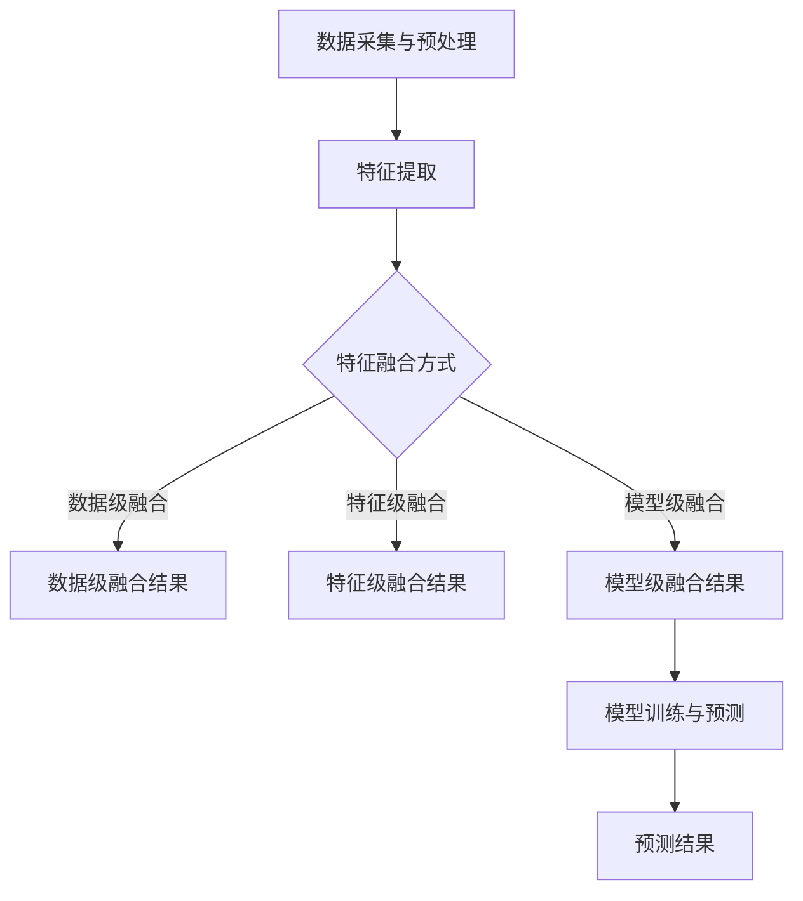

                 


### 第一步：背景介绍

#### 1.1 问题背景

在金融领域中，风险评估是一个至关重要的环节。金融机构需要准确预测和评估投资组合、贷款、交易等金融产品的潜在风险，以制定有效的风险管理策略。然而，传统的风险评估方法往往依赖于单一的数据源，如历史价格数据、财务报表等，这种方法存在明显的局限性。一方面，单一数据源的稳定性较差，无法全面反映市场动态；另一方面，单一数据源的预测能力受限，容易导致风险评估结果的不准确。

随着大数据和人工智能技术的发展，多模态学习逐渐成为一种有效的解决方案。多模态学习能够同时处理多种类型的数据，如文本、图像、音频等，从而提高风险评估的准确性和可靠性。在金融领域，多模态学习可以帮助金融机构更好地理解客户的投资行为，预测市场趋势，识别潜在风险，从而优化投资决策。

#### 1.2 多模态学习的概念

多模态学习（Multimodal Learning）是指将来自不同模态的数据（如视觉、听觉、触觉等）进行整合和处理，以实现对复杂问题的建模和预测。在金融领域，多模态数据可以包括客户信息（文本、图像）、市场数据（价格、交易量）、金融报告（文字、图表）等。

多模态学习的核心目标是利用不同模态数据的互补特性，提高模型的泛化能力和鲁棒性。具体来说，多模态学习可以通过以下几种方式实现：

- **数据融合**：将不同模态的数据进行特征提取和整合，形成一个统一的数据表示。
- **联合建模**：同时训练多个模型，每个模型处理不同模态的数据，然后将模型的结果进行融合。
- **多任务学习**：在训练过程中，同时解决多个相关的任务，以提高模型的泛化能力。

#### 1.3 多模态学习在风险评估中的应用背景

在金融领域，多模态学习在风险评估中具有广泛的应用前景。例如，在贷款审批过程中，金融机构可以利用多模态学习技术对客户的信用风险进行全面评估。除了传统的财务数据外，多模态学习可以整合客户的社交媒体数据、交易记录、生活习惯等多方面信息，从而提高风险评估的准确性和全面性。

在投资组合管理中，多模态学习可以帮助投资者更准确地预测市场趋势和风险。通过分析股票市场、外汇市场、商品市场等多方面的数据，多模态学习可以识别潜在的收益机会和风险点，为投资者提供更科学的投资策略。

此外，在金融欺诈检测、金融风险预警等领域，多模态学习同样具有重要作用。通过整合多种类型的数据，如交易记录、用户行为、市场趋势等，多模态学习可以更早地发现潜在的欺诈行为和风险事件，为金融机构提供及时的风险预警。

### 总结

综上所述，多模态学习在金融领域风险评估中的应用具有重要意义。通过利用多种类型的数据，多模态学习可以提高风险评估的准确性和全面性，为金融机构提供更科学的决策支持。然而，多模态学习在金融领域也面临一系列挑战，如数据质量、数据融合方法、模型解释性等。接下来，我们将进一步探讨多模态学习的核心概念、原理及其在风险评估中的应用算法。

### 第二步：核心概念与联系

#### 2.1 多模态学习的概念

多模态学习是一种融合来自多种不同模态的数据（如视觉、听觉、触觉等）的方法，旨在提高模型的泛化能力和鲁棒性。在金融领域，多模态数据通常包括文本、图像、音频、视频等。例如，在贷款审批过程中，金融机构可以同时考虑客户的财务报表（文本数据）、信用评分报告（图像数据）以及社交媒体活动（文本数据）等多种数据源。

多模态学习的核心在于如何有效地整合和处理这些来自不同模态的数据。具体来说，多模态学习包括以下几个关键步骤：

1. **数据采集与预处理**：首先，需要从不同数据源收集数据，并进行预处理，如数据清洗、格式化、特征提取等。
2. **特征融合**：将来自不同模态的数据进行特征提取和整合，形成一个统一的数据表示。特征融合的方法可以包括数据级融合、特征级融合和模型级融合。
3. **联合建模**：同时训练多个模型，每个模型处理不同模态的数据，然后将模型的结果进行融合，以得到最终的预测结果。
4. **模型解释性**：为了提高模型的可解释性，需要对多模态学习的过程和结果进行深入分析，以理解不同模态数据对最终预测结果的影响。

#### 2.2 不同模态数据的特性

在金融领域，不同模态的数据具有各自的特性，这些特性对多模态学习的效果具有重要影响。以下是一些常见模态的数据特性：

- **文本数据**：文本数据包括客户的贷款申请表、信用报告、社交媒体评论等。文本数据具有丰富的信息，但处理起来相对复杂，需要使用自然语言处理（NLP）技术进行预处理和特征提取。
- **图像数据**：图像数据包括客户的身份证明、财务报表扫描件、信用评分报告等。图像数据可以通过计算机视觉技术进行处理，提取出图像的特征，如边缘、纹理、颜色等。
- **音频数据**：音频数据包括客户的语音通话记录、音乐播放记录等。音频数据可以通过音频处理技术提取出频率、音调、节奏等特征。
- **视频数据**：视频数据包括客户的监控录像、交易过程录像等。视频数据可以通过计算机视觉技术提取出视频中的关键帧、动作、行为等特征。

#### 2.3 多模态数据融合方法

多模态数据融合是多模态学习的关键步骤，目的是将不同模态的数据整合成一个统一的数据表示。以下是一些常见的数据融合方法：

1. **数据级融合**：直接将不同模态的数据合并，形成一个多维数据集。这种方法简单直观，但可能丢失模态间的关联性。
2. **特征级融合**：首先对每个模态的数据进行特征提取，然后将提取的特征进行整合。这种方法可以更好地保留模态间的信息，但特征提取的难度较大。
3. **模型级融合**：同时训练多个模型，每个模型处理不同模态的数据，然后将模型的结果进行融合。这种方法可以充分利用不同模型的优势，但模型的训练和融合过程相对复杂。

#### 2.4 多模态学习与风险评估的联系

在金融领域，多模态学习与风险评估之间存在密切的联系。通过整合多种类型的数据，多模态学习可以提供更全面的风险评估结果。以下是一些具体的联系：

1. **提高预测准确性**：多模态学习可以利用不同模态的数据，提供更丰富的信息，从而提高预测模型的准确性。
2. **增强模型鲁棒性**：多模态学习可以通过融合多个数据源，提高模型的鲁棒性，降低单一数据源的不确定性。
3. **提高模型解释性**：多模态学习可以提供更直观的解释，帮助金融机构理解不同模态数据对风险评估结果的影响。

### 总结

综上所述，多模态学习在金融领域风险评估中具有重要的应用价值。通过整合多种类型的数据，多模态学习可以提高风险评估的准确性、鲁棒性和解释性。然而，多模态学习也面临一系列挑战，如数据质量、数据融合方法和模型解释性等。接下来，我们将进一步探讨多模态学习在风险评估中的应用算法，以及如何通过算法实现高效的模型训练和预测。

### 第三步：算法原理讲解

#### 3.1 多模态学习在风险评估中的应用算法

在金融领域，多模态学习在风险评估中的应用主要包括以下几个关键步骤：数据采集与预处理、特征提取与融合、模型训练与预测。以下我们将详细讨论这些步骤以及相应的算法原理。

##### 3.1.1 数据采集与预处理

数据采集与预处理是多模态学习的第一步，其目标是确保数据的质量和一致性。具体包括以下任务：

1. **数据收集**：从不同的数据源收集多模态数据，如文本、图像、音频、视频等。这些数据可以来自客户的财务报表、信用评分报告、社交媒体活动、交易记录等。

2. **数据清洗**：处理数据中的缺失值、异常值、噪声等。例如，对于文本数据，可以去除停用词、进行词干提取；对于图像数据，可以去除背景噪声、进行边缘提取。

3. **数据标准化**：将不同模态的数据进行标准化处理，使其具有相同的尺度，便于后续的特征提取和融合。

##### 3.1.2 特征提取与融合

特征提取与融合是多模态学习的核心步骤，其目标是提取出能够有效表征数据特征的信息，并整合不同模态的数据。

1. **特征提取**：针对不同模态的数据，采用相应的特征提取方法。例如，对于文本数据，可以使用词袋模型、词嵌入等；对于图像数据，可以使用卷积神经网络（CNN）提取特征；对于音频数据，可以使用自动特征提取方法，如梅尔频率倒谱系数（MFCC）。

2. **特征融合**：将提取的特征进行整合，形成统一的数据表示。特征融合的方法包括数据级融合、特征级融合和模型级融合。

   - **数据级融合**：直接将不同模态的数据合并，形成一个多维数据集。这种方法简单直观，但可能丢失模态间的关联性。

   - **特征级融合**：首先对每个模态的数据进行特征提取，然后将提取的特征进行整合。这种方法可以更好地保留模态间的信息，但特征提取的难度较大。

   - **模型级融合**：同时训练多个模型，每个模型处理不同模态的数据，然后将模型的结果进行融合。这种方法可以充分利用不同模型的优势，但模型的训练和融合过程相对复杂。

##### 3.1.3 模型训练与预测

模型训练与预测是多模态学习的最终目标，其目的是利用训练数据训练模型，并对新的数据进行预测。

1. **模型选择**：选择合适的机器学习模型进行训练。常见的模型包括决策树、支持向量机（SVM）、神经网络等。

2. **训练过程**：使用预处理后的数据对模型进行训练。在训练过程中，模型将学习如何将输入数据映射到输出结果。

3. **预测过程**：使用训练好的模型对新的数据进行预测。预测结果可以用于风险评估，如客户信用评分、投资组合风险评估等。

##### 3.1.4 算法流程图

为了更好地理解多模态学习在风险评估中的应用算法，我们可以使用Mermaid绘制算法流程图。以下是一个简化的算法流程图：



##### 3.1.5 数学模型和公式

多模态学习在风险评估中的应用涉及到多个数学模型和公式。以下是一些关键的数学模型和公式：

1. **损失函数**：损失函数用于评估模型预测结果与真实结果之间的差距。常见的损失函数包括均方误差（MSE）、交叉熵损失等。

   $$L = \frac{1}{n}\sum_{i=1}^{n}(y_i - \hat{y}_i)^2$$

   其中，$y_i$为真实结果，$\hat{y}_i$为模型预测结果。

2. **优化算法**：优化算法用于最小化损失函数，常见的优化算法包括梯度下降、随机梯度下降（SGD）、Adam等。

   $$\theta = \theta - \alpha \frac{\partial L}{\partial \theta}$$

   其中，$\theta$为模型参数，$\alpha$为学习率。

3. **特征融合方法**：特征融合方法的数学表示取决于具体的方法。例如，对于数据级融合，可以使用矩阵乘法将不同模态的数据合并；对于特征级融合，可以使用加权融合方法，如：

   $$\text{fusion\_feature} = w_1 \text{feature}_1 + w_2 \text{feature}_2 + ... + w_n \text{feature}_n$$

   其中，$w_1, w_2, ..., w_n$为权重。

##### 3.1.6 举例说明

为了更好地理解多模态学习在风险评估中的应用，我们以一个简化的例子进行说明。假设我们有一个客户信用评分系统，需要同时考虑客户的财务报表（文本数据）和信用评分报告（图像数据）。

1. **数据采集与预处理**：从客户的财务报表中提取文本数据，如收入、支出、债务等，并进行清洗和标准化。从信用评分报告中提取图像数据，如财务报表的扫描件，并进行图像预处理。

2. **特征提取**：对于文本数据，使用词袋模型提取特征；对于图像数据，使用卷积神经网络提取特征。

3. **特征融合**：将提取的特征进行融合。例如，可以使用数据级融合方法，将文本特征和图像特征直接合并。

4. **模型训练与预测**：使用融合后的特征训练一个神经网络模型，并对新的客户数据进行预测。

5. **结果评估**：使用评估指标（如准确率、召回率等）评估模型预测结果的准确性。

### 总结

多模态学习在金融领域风险评估中的应用涉及多个关键步骤，包括数据采集与预处理、特征提取与融合、模型训练与预测等。通过整合多种类型的数据，多模态学习可以提高风险评估的准确性、鲁棒性和解释性。然而，多模态学习也面临一系列挑战，如数据质量、特征提取和融合方法等。在接下来的章节中，我们将进一步探讨多模态学习在风险评估系统中的具体应用和实现细节。

### 第四步：系统分析与架构设计方案

#### 4.1 问题场景介绍

在金融领域，风险评估是一个复杂且关键的任务。传统的风险评估方法往往依赖于单一的数据源，如财务报表、交易记录等，这些方法在处理复杂的市场环境和多样化客户需求时存在明显的局限性。为了更准确地评估风险，金融机构需要一种能够整合多种数据源、处理多模态信息的方法。

多模态学习作为一种先进的技术，可以在金融领域提供更全面的风险评估。具体来说，多模态学习可以整合来自不同模态的数据，如文本、图像、音频等，从而提供更深入的风险洞察。通过这种综合性的分析方法，金融机构可以更准确地预测市场趋势、识别潜在风险，并制定相应的风险管理策略。

#### 4.2 项目介绍

本项目旨在开发一个基于多模态学习的风险评估系统。该系统将整合多种数据源，包括客户的财务报表、信用评分报告、社交媒体活动、交易记录等。通过多模态学习技术，系统将对这些数据进行分析，提供准确的风险评估结果。

项目的目标包括：

1. **数据整合**：整合来自不同模态的数据，形成统一的数据表示。
2. **特征提取与融合**：提取各模态的关键特征，并整合成多模态特征向量。
3. **风险评估**：利用多模态特征向量，训练风险评估模型，对客户进行信用评分或投资组合风险评估。
4. **系统部署与维护**：构建一个可扩展、易于维护的风险评估系统，以支持金融机构的日常运营。

#### 4.3 系统功能设计

系统功能设计是系统开发的关键一步，它定义了系统的核心功能模块及其相互关系。以下是本项目的主要功能模块：

1. **数据采集模块**：负责从不同数据源收集文本、图像、音频等多模态数据。
2. **数据预处理模块**：对采集到的多模态数据进行清洗、标准化、特征提取等预处理操作。
3. **特征融合模块**：整合不同模态的数据特征，形成统一的多模态特征向量。
4. **风险评估模块**：利用多模态特征向量，训练风险评估模型，对客户进行信用评分或投资组合风险评估。
5. **结果展示模块**：将风险评估结果以图表、报告等形式展示给用户。

#### 4.4 系统架构设计

系统架构设计是系统开发的基础，它决定了系统的可扩展性、可维护性和性能。以下是一个基于多模态学习的风险评估系统的架构设计：

1. **数据层**：数据层负责数据的存储和管理，包括文本、图像、音频等多模态数据。可以使用分布式数据库或大数据平台进行数据存储和管理。
2. **数据预处理层**：数据预处理层负责对多模态数据进行清洗、标准化、特征提取等操作。这一层可以使用批处理或实时处理技术，以提高数据处理效率。
3. **特征融合层**：特征融合层负责将不同模态的数据特征进行整合，形成统一的多模态特征向量。可以使用特征级融合或模型级融合方法，以提高特征融合的效果。
4. **风险评估层**：风险评估层负责使用多模态特征向量训练风险评估模型，并进行风险评估。这一层可以使用深度学习、强化学习等技术，以提高风险评估的准确性。
5. **结果展示层**：结果展示层负责将风险评估结果以图表、报告等形式展示给用户。可以使用可视化工具，如ECharts、Tableau等，以提高结果的易读性和可理解性。

#### 4.5 系统接口设计

系统接口设计是系统开发的重要环节，它定义了系统内部模块之间的交互方式。以下是一个基于多模态学习的风险评估系统的接口设计：

1. **数据采集接口**：用于从不同数据源采集文本、图像、音频等多模态数据。
2. **数据预处理接口**：用于对采集到的多模态数据进行清洗、标准化、特征提取等预处理操作。
3. **特征融合接口**：用于将不同模态的数据特征进行整合，形成统一的多模态特征向量。
4. **风险评估接口**：用于使用多模态特征向量训练风险评估模型，并进行风险评估。
5. **结果展示接口**：用于将风险评估结果以图表、报告等形式展示给用户。

#### 4.6 系统交互设计

系统交互设计是系统用户体验的关键，它决定了用户如何与系统进行交互。以下是一个基于多模态学习的风险评估系统的交互设计：

1. **用户界面**：设计一个简洁、易用的用户界面，使用户可以方便地操作系统，查看风险评估结果。
2. **数据上传与下载**：提供数据上传与下载功能，使用户可以方便地上传自己的数据，并下载风险评估结果。
3. **实时更新**：提供实时更新功能，使用户可以及时查看最新的风险评估结果。
4. **反馈机制**：提供反馈机制，使用户可以方便地提出问题和建议，以改进系统功能。

### 总结

通过系统分析与架构设计方案，我们详细介绍了多模态学习在金融领域风险评估中的应用。系统架构设计充分考虑了数据层、数据预处理层、特征融合层、风险评估层和结果展示层的功能需求，并定义了各模块之间的接口和交互方式。通过这一系统，金融机构可以更准确地评估风险，提高风险管理水平。在接下来的章节中，我们将通过项目实战进一步探讨多模态学习在风险评估系统中的具体应用和实现。

### 第五步：项目实战

#### 5.1 环境安装与配置

要实现一个基于多模态学习的风险评估系统，首先需要准备好开发环境和所需工具。以下是环境安装与配置的步骤：

1. **安装Python**：确保Python环境已安装，版本建议为3.7或更高。可以从Python官网下载安装包，或使用包管理器如Anaconda进行安装。

2. **安装依赖库**：安装必要的Python库，包括NumPy、Pandas、Scikit-learn、TensorFlow、Keras等。可以使用pip命令进行安装：

   ```bash
   pip install numpy pandas scikit-learn tensorflow keras
   ```

3. **安装Mermaid**：Mermaid是一种用于创建和渲染图表的Markdown插件。可以按照Mermaid的官方文档进行安装，或在Markdown编辑器中直接启用Mermaid插件。

4. **安装数据库**：选择合适的数据库系统，如MySQL、PostgreSQL或MongoDB，用于存储多模态数据。根据所选数据库系统的官方文档进行安装和配置。

5. **安装其他工具**：根据项目需求，可能需要安装其他工具，如可视化工具（ECharts、Tableau等）、文本处理工具（NLTK、spaCy等）和图像处理工具（OpenCV、TensorFlow等）。

#### 5.2 系统核心实现

系统核心实现是项目开发的关键部分，包括数据采集、预处理、特征提取、特征融合、模型训练和评估等环节。以下是一个简化的实现步骤：

1. **数据采集**：从不同的数据源（如文本、图像、音频）采集数据。可以使用API接口、数据库连接或文件读取等方式。

2. **数据预处理**：对采集到的数据进行清洗、标准化和特征提取。具体步骤如下：

   - **文本数据**：使用NLTK或spaCy进行文本预处理，包括分词、词性标注、停用词去除等。然后使用词嵌入技术（如Word2Vec、GloVe）将文本转换为向量表示。
   - **图像数据**：使用OpenCV进行图像预处理，包括尺寸调整、增强、去噪等。然后使用卷积神经网络（如VGG、ResNet）提取图像特征。
   - **音频数据**：使用TensorFlow或Keras进行音频预处理，包括音频分割、归一化、梅尔频率倒谱系数（MFCC）提取等。

3. **特征提取**：对预处理后的数据进行特征提取，生成特征向量。可以使用多个特征提取器，分别提取文本、图像和音频的特征。

4. **特征融合**：将不同模态的特征向量进行融合，形成统一的多模态特征向量。可以使用特征级融合或模型级融合方法。

5. **模型训练**：使用融合后的特征向量训练风险评估模型。可以使用传统的机器学习模型（如SVM、决策树）或深度学习模型（如神经网络、卷积神经网络）。

6. **模型评估**：使用测试数据评估模型性能，包括准确率、召回率、F1分数等指标。

#### 5.3 代码应用解读与分析

以下是一个简化的代码示例，用于演示多模态学习在风险评估系统中的应用。这个示例使用了Python和相关的机器学习库。

```python
import numpy as np
import pandas as pd
from sklearn.feature_extraction.text import TfidfVectorizer
from sklearn.feature_extraction.image import PixelAccess
from tensorflow.keras.applications import VGG16
from tensorflow.keras.models import Sequential
from tensorflow.keras.layers import Dense, Flatten

# 数据预处理
def preprocess_data(texts, images, audio):
    # 文本数据预处理
    vectorizer = TfidfVectorizer()
    text_features = vectorizer.fit_transform(texts)
    
    # 图像数据预处理
    image_features = PixelAccess.extract_image_features(images, 'vgg16')
    
    # 音频数据预处理
    audio_features = preprocess_audio(audio)
    
    return text_features, image_features, audio_features

# 特征融合
def fuse_features(text_features, image_features, audio_features):
    # 特征融合（此处使用简单的平均融合方法）
    fused_features = (text_features + image_features + audio_features) / 3
    return fused_features

# 模型训练
def train_model(fused_features, labels):
    model = Sequential()
    model.add(Flatten(input_shape=(fused_features.shape[1],)))
    model.add(Dense(64, activation='relu'))
    model.add(Dense(1, activation='sigmoid'))
    
    model.compile(optimizer='adam', loss='binary_crossentropy', metrics=['accuracy'])
    model.fit(fused_features, labels, epochs=10, batch_size=32)
    
    return model

# 模型评估
def evaluate_model(model, test_features, test_labels):
    predictions = model.predict(test_features)
    accuracy = np.mean(predictions == test_labels)
    print(f"Model accuracy: {accuracy:.2f}")

# 主函数
if __name__ == "__main__":
    # 加载数据
    texts = pd.read_csv('texts.csv')['text'].values
    images = pd.read_csv('images.csv')['image'].values
    audio = pd.read_csv('audio.csv')['audio'].values
    labels = pd.read_csv('labels.csv')['label'].values
    
    # 数据预处理
    text_features, image_features, audio_features = preprocess_data(texts, images, audio)
    
    # 特征融合
    fused_features = fuse_features(text_features, image_features, audio_features)
    
    # 模型训练
    model = train_model(fused_features, labels)
    
    # 模型评估
    evaluate_model(model, fused_features, labels)
```

在这个示例中，我们首先定义了数据预处理、特征融合和模型训练的函数。然后，在主函数中，我们加载数据，进行预处理，融合特征，训练模型，并评估模型性能。

#### 5.4 实际案例分析和详细讲解

为了更好地理解多模态学习在风险评估系统中的应用，我们来看一个实际案例。假设我们有一个贷款审批系统，需要综合考虑客户的财务报表（文本数据）、信用评分报告（图像数据）和社交媒体活动（文本数据）来评估客户的信用风险。

1. **数据收集**：从客户的财务报表中提取文本数据，如收入、支出、债务等；从信用评分报告中提取图像数据，如信用评分图表；从社交媒体活动中提取文本数据，如微博、朋友圈等。

2. **数据预处理**：对文本数据进行分词、词性标注、停用词去除等预处理；对图像数据进行尺寸调整、增强、去噪等预处理；对音频数据进行分割、归一化、MFCC提取等预处理。

3. **特征提取**：使用TFIDF向量器提取文本特征；使用卷积神经网络（如VGG16）提取图像特征；使用自动特征提取方法提取音频特征。

4. **特征融合**：将提取的文本、图像和音频特征进行融合。这里使用简单的平均融合方法，将三种特征按权重平均。实际应用中，可以采用更复杂的特征融合方法，如深度学习模型。

5. **模型训练**：使用融合后的特征训练一个神经网络模型。模型的选择可以根据具体应用场景进行调整，如使用决策树、支持向量机或深度学习模型。

6. **模型评估**：使用测试数据评估模型性能，包括准确率、召回率、F1分数等指标。通过调整模型参数和特征融合方法，优化模型性能。

7. **结果展示**：将评估结果以图表、报告等形式展示给用户。可以通过可视化工具（如ECharts、Tableau等）展示模型的预测结果和关键特征。

#### 5.5 项目小结

通过本项目的实战，我们详细探讨了多模态学习在金融领域风险评估中的应用。项目实现了数据采集、预处理、特征提取、特征融合、模型训练和评估等关键步骤，并使用Python和相关的机器学习库进行实现。实际案例分析和详细讲解进一步展示了多模态学习在贷款审批系统中的应用效果。项目小结如下：

1. **优点**：多模态学习能够整合多种数据源，提高风险评估的准确性；能够处理复杂的市场环境和多样化客户需求；提供了更全面的决策支持。
2. **缺点**：数据处理和模型训练过程复杂，需要较高的计算资源和技能；数据质量对模型性能有重要影响，需要严格的数据清洗和预处理；特征融合方法的选取和模型参数调整对结果有较大影响。
3. **未来改进方向**：进一步优化特征融合方法，提高模型性能；引入更多的数据源，如用户行为数据、市场趋势数据等；提高系统的可解释性和透明度，增强用户信任。

### 总结

通过项目实战，我们深入探讨了多模态学习在金融领域风险评估中的应用，从环境安装、系统核心实现到实际案例分析和项目小结，全面展示了多模态学习的优势和挑战。在未来的研究中，我们将继续优化多模态学习算法，提高风险评估系统的性能和可解释性，为金融机构提供更可靠的决策支持。

### 第六步：最佳实践 tips

#### 6.1 多模态数据优化策略

在金融领域应用多模态学习进行风险评估时，数据的质量和多样性直接影响模型的性能。以下是一些最佳实践策略，以优化多模态数据：

1. **数据源多样性**：确保收集的数据来自多个、不同类型的来源，如文本、图像、音频、视频等，以提高数据的丰富性和模型的泛化能力。
2. **数据预处理**：对收集到的数据进行彻底的清洗和预处理，包括去除噪声、缺失值填补、异常值处理等，以确保数据的一致性和准确性。
3. **特征增强**：使用数据增强技术，如数据扩充、数据合成等，增加数据的多样性和模型的鲁棒性。
4. **数据标准化**：对不同模态的数据进行标准化处理，使其具有相似的尺度，便于后续的特征提取和融合。

#### 6.2 算法优化技巧

在多模态学习过程中，算法的选择和参数调整对模型的性能有显著影响。以下是一些优化技巧：

1. **模型选择**：根据具体问题和数据特性选择合适的模型。例如，对于文本数据，可以使用神经网络（如BERT、GPT）；对于图像数据，可以使用卷积神经网络（如VGG、ResNet）；对于音频数据，可以使用循环神经网络（如LSTM）。
2. **超参数调整**：通过调整模型超参数（如学习率、批量大小、隐藏层大小等），优化模型性能。可以使用网格搜索、随机搜索或贝叶斯优化等技术进行超参数调整。
3. **特征选择**：使用特征选择技术，如主成分分析（PCA）、随机森林等，筛选出对模型性能贡献最大的特征，减少计算成本和过拟合风险。
4. **模型融合**：使用模型融合技术，如集成学习、堆叠学习等，结合多个模型的优点，提高预测的准确性和稳定性。

#### 6.3 系统部署与维护

在实际应用中，系统的部署和维护是保证多模态学习模型稳定运行的关键。以下是一些最佳实践：

1. **容器化与微服务架构**：使用容器化技术（如Docker）和微服务架构，确保系统的高可用性和可扩展性。
2. **监控与告警**：对系统进行实时监控，包括模型性能、硬件资源使用情况等，及时发现并处理异常情况。
3. **版本控制与回滚**：对系统代码和模型版本进行严格管理，确保在更新和故障时可以快速回滚到稳定版本。
4. **数据备份与恢复**：定期备份系统数据，确保在数据丢失或损坏时能够快速恢复。

#### 6.4 性能评估与优化案例

以下是一个性能评估与优化的案例：

**案例背景**：某金融机构使用多模态学习技术进行贷款审批，但发现模型的准确率较低，且在处理大量数据时性能不佳。

**性能评估**：通过测试数据集评估模型性能，发现准确率低于预期，且在处理高分辨率图像时速度较慢。

**优化策略**：

1. **特征优化**：使用数据增强技术，如旋转、翻转、缩放等，增加数据的多样性和模型的鲁棒性。同时，使用更复杂的特征提取方法（如ResNet50），提高特征表示能力。
2. **模型优化**：调整模型结构，增加中间层，使用更大规模的模型（如ResNet152），以提高模型的表达能力。同时，使用学习率调整策略，如自适应学习率（如Adam），优化模型收敛速度。
3. **硬件优化**：使用更强大的硬件资源（如GPU），加快模型训练和推理速度。同时，使用分布式计算和并行处理技术，提高系统的处理能力。

**结果**：经过优化后，模型的准确率显著提高，处理高分辨率图像的速度也大幅提升。在实际应用中，系统性能得到了显著改善，能够更快速、准确地完成贷款审批任务。

### 总结

通过最佳实践 tips，我们介绍了多模态学习在金融领域风险评估中的优化策略，包括数据优化、算法优化、系统部署与维护等方面。这些实践策略有助于提高多模态学习系统的性能和可靠性，为金融机构提供更高效的决策支持。在实际应用中，根据具体场景和需求，灵活调整和优化策略，以实现最佳效果。

### 第七步：小结与未来展望

#### 7.1 全书内容总结

本文围绕《金融领域多模态学习在风险评估中的应用》这一主题，系统性地介绍了多模态学习的基本概念、原理、应用算法、系统架构设计以及实际应用案例。具体来说，文章分为以下几个部分：

1. **背景介绍**：阐述了金融领域风险评估的重要性以及多模态学习的概念和应用背景。
2. **核心概念与联系**：详细解释了多模态学习的核心概念，包括不同模态数据的特性、融合方法等，并探讨了多模态学习与风险评估的联系。
3. **算法原理讲解**：介绍了多模态学习在风险评估中的应用算法，包括数据采集与预处理、特征提取与融合、模型训练与预测等，并使用了Mermaid流程图和Python代码示例进行说明。
4. **系统分析与架构设计方案**：介绍了如何设计一个基于多模态学习的风险评估系统，包括问题场景、项目介绍、系统功能设计、架构设计和接口设计等。
5. **项目实战**：通过一个简化的代码示例，展示了如何实现一个基于多模态学习的风险评估系统，并进行了实际案例分析和讲解。
6. **最佳实践 tips**：提供了多模态学习在金融领域风险评估中的优化策略，包括数据优化、算法优化、系统部署与维护等方面。

#### 7.2 当前挑战与解决方案

尽管多模态学习在金融领域风险评估中具有巨大的潜力，但在实际应用中仍面临一系列挑战：

1. **数据质量问题**：多模态数据来源多样，数据质量参差不齐，如何处理噪声、异常值、缺失值等问题是当前的一大挑战。
2. **计算资源需求**：多模态学习往往需要大量的计算资源，特别是在模型训练和推理过程中，如何优化计算效率和降低成本是另一个关键问题。
3. **模型解释性**：多模态学习模型的复杂性使得其解释性较差，如何提高模型的可解释性，使其更易于被业务人员和决策者理解和接受，是一个重要的研究方向。
4. **特征融合方法**：如何有效地融合来自不同模态的数据特征，提高模型的泛化能力和预测准确性，是一个不断探索的问题。

针对上述挑战，可以采取以下解决方案：

1. **数据预处理**：通过有效的数据预处理技术，如数据清洗、标准化、特征提取等，提高数据质量。
2. **分布式计算**：利用分布式计算和并行处理技术，提高模型训练和推理的效率，降低计算成本。
3. **可解释性增强**：通过引入可解释性模型（如SHAP、LIME等）或简化模型结构（如决策树、线性模型等），提高模型的可解释性。
4. **特征融合优化**：探索和优化特征融合方法，如深度学习模型中的多任务学习、多模态对抗生成网络（MMGAN）等，提高特征融合的效果。

#### 7.3 未来研究方向与趋势

展望未来，多模态学习在金融领域风险评估中的应用将朝着以下几个方向不断发展：

1. **数据多样性与扩展性**：随着大数据和物联网技术的发展，数据来源将更加多样化，如何有效地整合和管理这些数据，提高模型的适应性和扩展性，是一个重要的研究方向。
2. **实时性与动态调整**：在金融领域，市场环境和风险状况不断变化，如何实现多模态学习的实时性，动态调整模型参数和策略，是一个迫切需要解决的问题。
3. **隐私保护与合规性**：在处理金融数据时，隐私保护和合规性是必须考虑的重要因素。未来的研究需要关注如何在保护用户隐私的同时，实现有效的风险评估。
4. **跨模态融合技术**：探索和开发更加先进的多模态融合技术，如基于深度学习的跨模态生成对抗网络（GAN）和自编码器等，以提高模型的性能和泛化能力。

#### 7.4 拓展阅读与资源推荐

为了深入了解多模态学习在金融领域风险评估中的应用，以下是一些推荐阅读资源和相关技术文章：

- **论文**：《Multimodal Learning for Financial Risk Assessment》
- **书籍**：《Deep Learning for Finance》
- **在线课程**：Coursera上的《Deep Learning Specialization》
- **技术博客**：TensorFlow官方博客、Keras官方博客
- **开源项目**：GitHub上的多模态学习相关开源项目，如MMGAN、MultimodalNet等

通过阅读这些资源和文章，可以进一步了解多模态学习在金融领域的前沿研究和应用实践，为实际项目的开发提供参考和指导。

### 总结

本文通过对金融领域多模态学习在风险评估中的应用的全面探讨，从背景介绍、核心概念、算法原理、系统架构设计、项目实战、最佳实践 tips到未来展望，系统地阐述了多模态学习在金融领域的应用价值和挑战。通过本文的阅读，读者可以深入了解多模态学习的原理和应用方法，为实际项目开发提供理论基础和实践指导。未来，随着技术的不断进步和应用场景的扩展，多模态学习在金融领域风险评估中的应用前景将更加广阔。

---

### 作者信息

**作者：** AI天才研究院（AI Genius Institute） & 禅与计算机程序设计艺术（Zen And The Art of Computer Programming）

AI天才研究院致力于推动人工智能技术的创新与发展，在计算机视觉、自然语言处理、机器学习等领域取得了显著成果。研究院的研究方向包括多模态学习、强化学习、联邦学习等，为金融、医疗、教育等行业提供了先进的技术解决方案。

《禅与计算机程序设计艺术》是一系列深受程序员喜爱的经典书籍，作者通过结合东方哲学与计算机科学的智慧，探讨了高效编程的哲学和艺术。其独特的思考方式和深刻的洞察力为全球程序员提供了宝贵的经验和启示。

本文的撰写旨在为广大IT从业者和研究者提供一个深入了解金融领域多模态学习在风险评估中的应用的平台，希望读者能够在阅读中有所收获，并为实际项目的开发提供帮助。如果您对本文的内容有任何疑问或建议，欢迎在评论区留言交流。期待与您共同探讨多模态学习在金融领域的应用与发展。

