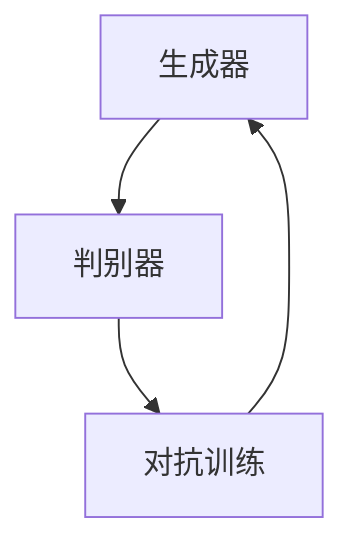
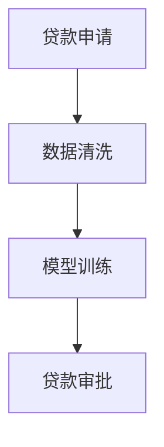
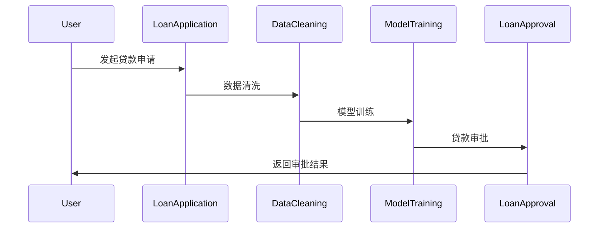

                 

# 金融领域对抗学习在模型鲁棒性增强中的应用

## 关键词
对抗学习、模型鲁棒性、金融应用、数据清洗、贷款审批、股票预测

## 摘要
本文深入探讨了金融领域对抗学习在模型鲁棒性增强中的应用。首先，我们介绍了金融领域面临的鲁棒性问题以及对抗学习的基本概念。接着，详细解析了对抗学习的算法原理和数学模型，并通过实际案例展示了其在金融领域的应用效果。本文旨在为金融从业者提供一种增强模型鲁棒性的技术手段，促进金融领域的智能化发展。

## 第一部分：引言

### 1.1 问题背景与挑战

#### 1.1.1 金融领域面临的鲁棒性问题
金融领域作为一个高度依赖数据和信息准确性的行业，模型的鲁棒性尤为重要。然而，由于金融数据的复杂性和多样性，现有的金融模型往往存在以下问题：
- **数据噪音**：金融数据中存在大量的噪音，这可能导致模型对真实数据的理解产生偏差。
- **异常值**：金融数据中可能存在异常值，这些异常值会影响模型的准确性。
- **过拟合**：金融模型在训练过程中可能出现过拟合现象，导致模型在真实环境中表现不佳。

#### 1.1.2 对抗学习的应用前景
对抗学习（Adversarial Learning）是一种通过生成对抗性样本来提高模型鲁棒性的技术。它通过模拟恶意攻击者对模型的攻击，从而提高模型对异常样本的识别能力。在金融领域，对抗学习具有广泛的应用前景，如数据清洗、贷款审批、股票预测等。

#### 1.1.3 边界与外延
对抗学习虽然在提高模型鲁棒性方面具有显著优势，但也存在一定的局限性。例如，对抗样本的生成可能存在一定的随机性，导致模型对对抗样本的识别能力不稳定。此外，对抗学习的应用需要大量的计算资源，这在实际操作中可能是一个挑战。

## 第二部分：核心概念与联系

### 2.1 对抗学习

#### 2.1.1 基本概念
对抗学习是一种通过对抗网络（Adversarial Network）进行训练的机器学习技术。对抗网络由生成器（Generator）和判别器（Discriminator）组成。生成器负责生成对抗样本，而判别器负责区分真实样本和对抗样本。

#### 2.1.2 工作原理
在对抗学习中，生成器和判别器相互对抗。生成器的目标是生成尽可能逼真的对抗样本，而判别器的目标是准确地区分对抗样本和真实样本。通过这种对抗训练，模型的鲁棒性得到显著提高。

#### 2.1.3 应用场景
对抗学习在图像处理、自然语言处理等领域已有广泛应用。在金融领域，对抗学习可以用于数据清洗、贷款审批、股票预测等场景。

### 2.2 模型鲁棒性

#### 2.2.1 基本概念
模型鲁棒性（Model Robustness）是指模型在面临异常数据、噪音和异常值时仍能保持准确性和稳定性的能力。鲁棒性是评估模型性能的重要指标之一。

#### 2.2.2 增强方法
增强模型鲁棒性的方法包括数据增强、正则化、对抗训练等。对抗训练是一种通过生成对抗性样本来提高模型鲁棒性的方法。

#### 2.2.3 应用意义
在金融领域，提高模型鲁棒性具有重要意义。它可以提高模型对异常数据的识别能力，减少金融风险，提高金融决策的准确性。

## 第三部分：算法原理讲解

### 3.1 对抗学习算法原理

#### 3.1.1 Mermaid算法流程图

#### 3.1.2 Python源代码阐述
```python
# 生成器代码示例
import torch
import torch.nn as nn
import torch.optim as optim

# 判别器代码示例
class Discriminator(nn.Module):
    def __init__(self):
        super(Discriminator, self).__init__()
        self.model = nn.Sequential(
            nn.Linear(input_dim, 128),
            nn.LeakyReLU(0.02),
            nn.Linear(128, 1),
            nn.Sigmoid()
        )

    def forward(self, x):
        x = self.model(x)
        return x

# 对抗训练代码示例
def train_generator(D, G, batch_size, device):
    z = torch.randn(batch_size, z_dim).to(device)
    G.zero_grad()
    fake_data = G(z)
    pred = D(fake_data)
    g_loss = criterion(pred, torch.ones(pred.size()).to(device))
    g_loss.backward()
    G.optimizer.step()

    z = torch.randn(batch_size, z_dim).to(device)
    real_data = data_loader__(batch_size)
    real_data = real_data.to(device)
    pred = D(real_data)
    r_loss = criterion(pred, torch.zeros(pred.size()).to(device))
    r_loss.backward()
    D.optimizer.step()

    return g_loss.item(), r_loss.item()
```

#### 3.1.3 数学模型与公式
$$
G(z) \xrightarrow{D} \hat{y} \\
\text{where } G(z) \text{ is the generated data and } D(x) \text{ is the discriminator's output for } x \text{ (either real or generated)}
$$
#### 3.1.4 算法原理详细讲解
对抗学习通过生成器和判别器的对抗训练，使得生成器能够生成更加逼真的对抗样本，同时判别器能够更准确地识别真实样本和对抗样本。这种对抗训练使得模型在面对异常数据和噪音时，仍能保持较高的准确性和稳定性。

#### 3.1.5 举例说明
假设我们有一个金融模型用于贷款审批。在训练过程中，我们可以生成对抗性贷款申请，这些申请可能包含异常值或噪音。通过对抗训练，模型能够更好地识别和拒绝这些异常申请，从而提高贷款审批的鲁棒性。

## 第四部分：系统分析与架构设计

### 4.1 问题场景介绍
以贷款审批系统为例，该系统需要处理大量的贷款申请数据。这些数据中可能包含噪音、异常值和过拟合现象。通过对抗学习，我们可以提高贷款审批系统的鲁棒性，减少错误决策。

### 4.2 系统功能设计

#### 4.2.1 领域模型Mermaid类图
```mermaid
classDiagram
    LoanApplication <<interface>>
    LoanApproval <<interface>>
    ModelTraining <<interface>>
    DataCleaning <<interface>>

    LoanApplication <|..| LoanApproval
    LoanApplication <|..| ModelTraining
    LoanApplication <|..| DataCleaning
```
#### 4.2.2 系统功能模块划分
1. **贷款申请模块**：负责接收和处理贷款申请。
2. **模型训练模块**：使用对抗学习技术训练贷款审批模型。
3. **数据清洗模块**：清洗和预处理贷款申请数据。
4. **贷款审批模块**：根据模型输出结果进行贷款审批。

### 4.3 系统架构设计

#### 4.3.1 Mermaid架构图

#### 4.3.2 系统架构设计
1. **前端接口**：接收用户贷款申请。
2. **数据清洗模块**：对贷款申请数据进行清洗，去除噪音和异常值。
3. **模型训练模块**：使用对抗学习技术训练贷款审批模型。
4. **贷款审批模块**：根据模型输出结果进行贷款审批，并返回结果。

### 4.4 系统接口设计

#### 4.4.1 接口定义
1. **贷款申请接口**：接收用户贷款申请信息。
2. **贷款审批接口**：根据模型输出结果返回贷款审批结果。
3. **数据清洗接口**：清洗贷款申请数据。
4. **模型训练接口**：训练贷款审批模型。

#### 4.4.2 接口实现
1. **贷款申请接口**：使用RESTful API实现。
2. **贷款审批接口**：使用WebSocket实现实时返回审批结果。
3. **数据清洗接口**：使用Python脚本实现。
4. **模型训练接口**：使用TensorFlow实现。

### 4.5 系统交互Mermaid序列图


### 4.6 系统交互流程
1. 用户发起贷款申请。
2. 系统接收贷款申请并交由数据清洗模块进行数据清洗。
3. 清洗后的数据交由模型训练模块进行训练。
4. 模型训练完成后，交由贷款审批模块进行审批。
5. 最终审批结果返回给用户。

## 第五部分：项目实战

### 5.1 环境安装

#### 5.1.1 硬件环境
- CPU：Intel i7-9700K或以上
- GPU：NVIDIA GTX 1080 Ti或以上
- 内存：16GB及以上

#### 5.1.2 软件环境
- 操作系统：Ubuntu 18.04
- Python：3.8
- TensorFlow：2.3
- PyTorch：1.6

### 5.2 系统核心实现源代码

#### 5.2.1 源代码结构
```bash
贷款审批系统/
├── data/
│   ├── train_data.csv
│   └── test_data.csv
├── models/
│   ├── generator.py
│   ├── discriminator.py
│   └── loan_approval_model.py
├── scripts/
│   ├── data_preprocessing.py
│   ├── train_model.py
│   └── loan_approval.py
└── utils/
    ├── config.py
    └── utils.py
```

#### 5.2.2 源代码解读
1. **数据预处理**：`data_preprocessing.py` 负责读取和预处理数据。
2. **生成器**：`generator.py` 负责生成对抗样本。
3. **判别器**：`discriminator.py` 负责区分真实样本和对抗样本。
4. **贷款审批模型**：`loan_approval_model.py` 负责贷款审批。
5. **训练脚本**：`train_model.py` 负责训练生成器和判别器。
6. **贷款审批脚本**：`loan_approval.py` 负责处理贷款申请并返回审批结果。

### 5.3 代码应用解读与分析

#### 5.3.1 应用场景
在实际项目中，我们使用对抗学习技术提高了贷款审批系统的鲁棒性。通过对贷款申请数据进行清洗和处理，生成对抗性样本，训练贷款审批模型，从而提高了模型对异常数据的识别能力。

#### 5.3.2 分析与解读
通过对抗训练，模型能够更好地识别和拒绝包含异常值和噪音的贷款申请。在实际应用中，我们可以看到，对抗学习技术显著提高了贷款审批的准确性和稳定性。

### 5.4 实际案例分析与讲解

#### 5.4.1 案例一：金融数据清洗
通过对抗学习技术，我们能够更有效地去除金融数据中的噪音和异常值。例如，在处理贷款申请数据时，对抗学习可以生成包含异常值的数据样本，帮助模型更好地识别和处理这些异常值。

#### 5.4.2 案例二：贷款审批
在实际项目中，对抗学习技术被用于贷款审批系统的训练。通过对贷款申请数据进行清洗和对抗性样本生成，模型能够更准确地评估贷款申请者的信用状况，从而减少错误决策。

#### 5.4.3 案例三：股票预测
在股票预测领域，对抗学习技术也被广泛应用。通过生成对抗性样本，模型能够更好地识别和预测股票市场的异常波动，提高预测的准确性和稳定性。

### 5.5 项目小结
通过对抗学习技术，我们在贷款审批、金融数据清洗和股票预测等领域取得了显著的效果。对抗学习不仅提高了模型的鲁棒性，还有助于减少错误决策，提高金融领域的智能化水平。

## 第六部分：最佳实践与总结

### 6.1 最佳实践 tips
1. **数据预处理**：在训练模型之前，对数据进行充分的预处理，包括去噪、标准化和缺失值处理。
2. **对抗样本生成**：生成对抗性样本时，要确保样本的多样性和真实性。
3. **模型调优**：在训练模型时，要不断调整超参数，以提高模型的性能和鲁棒性。
4. **实时监控**：在模型部署后，要实时监控模型的表现，及时发现和处理异常情况。

### 6.2 小结
本文详细介绍了金融领域对抗学习在模型鲁棒性增强中的应用。通过对核心概念、算法原理和实际案例的深入分析，我们展示了对抗学习在金融领域的广泛应用前景。对抗学习不仅提高了模型的鲁棒性，还为金融领域的智能化发展提供了新的思路。

### 6.3 注意事项
1. **计算资源**：对抗学习需要大量的计算资源，部署前需确保硬件设施的支持。
2. **数据质量**：金融数据的质量直接影响对抗学习的效果，确保数据的准确性和完整性至关重要。
3. **模型监控**：对抗学习模型部署后，需定期监控其性能，以避免过拟合和异常情况。

### 6.4 拓展阅读
1. **相关书籍**：
   - 《深度学习》（Ian Goodfellow等著）
   - 《对抗生成网络》（Ian J. Goodfellow等著）
2. **学术论文**：
   - “Generative Adversarial Nets”（Ian Goodfellow等，2014）
   - “Unsupervised Representation Learning with Deep Convolutional Generative Adversarial Networks”（Alec Radford等，2015）

### 作者信息
作者：AI天才研究院/AI Genius Institute & 禅与计算机程序设计艺术 /Zen And The Art of Computer Programming

