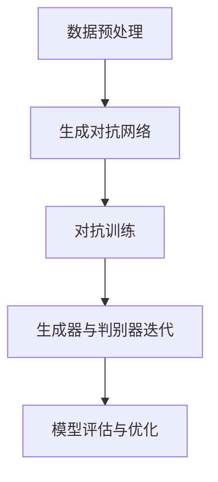
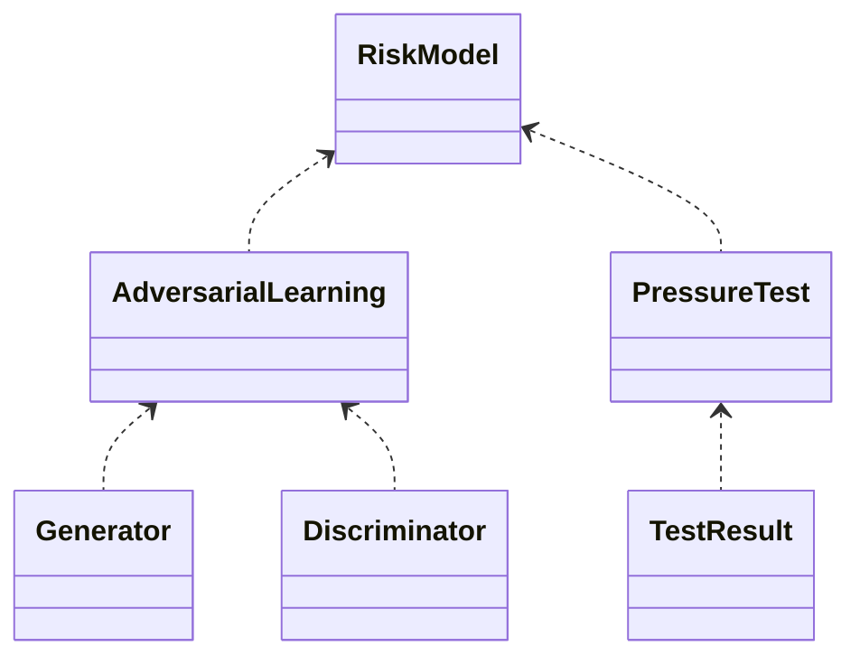
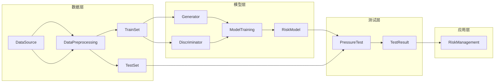
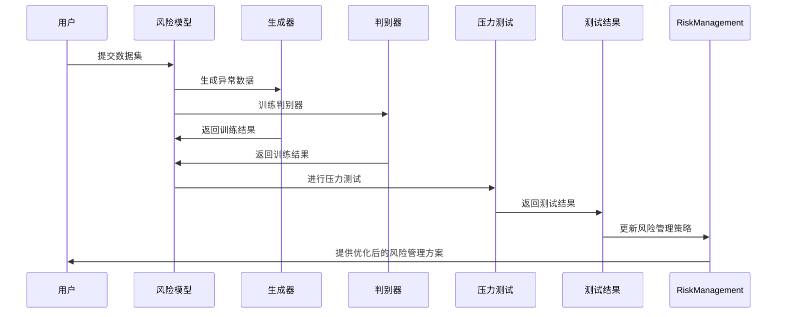

                 

### 文章标题

# 金融领域对抗学习在风险模型压力测试中的应用

> 关键词：对抗学习、金融风险模型、压力测试、模型优化

> 摘要：本文探讨了对抗学习在金融领域风险模型压力测试中的应用，分析了对抗学习的原理和其在风险模型中的具体应用，通过案例展示了对抗学习如何提升风险模型的鲁棒性和准确性，为金融领域风险管理的实践提供了新的思路和方法。

----------------------------------------------------------------

### 背景介绍

#### 1.1 问题背景

金融领域是一个高度复杂且风险密集的行业，金融机构面临着各种潜在的风险，如市场风险、信用风险、操作风险等。为了有效管理这些风险，风险模型在金融领域中扮演着至关重要的角色。风险模型旨在通过分析历史数据和当前市场状况，预测潜在风险的发生概率和可能的影响，从而帮助金融机构制定有效的风险管理策略。

风险模型压力测试是评估和验证风险模型性能的关键步骤。通过模拟极端市场条件，压力测试能够评估风险模型在不同情景下的表现，从而识别模型的弱点和不足。然而，传统风险模型在压力测试中面临着一些局限：

1. **数据依赖性**：传统风险模型通常依赖于历史数据进行训练，但历史数据可能无法充分反映未来的极端市场状况。
2. **鲁棒性不足**：传统风险模型对异常数据或攻击场景的抵抗力较弱，可能导致模型预测准确性下降。
3. **模型解释性**：风险模型的复杂性和黑盒特性使得其难以解释，增加了模型风险管理的难度。

#### 1.2 问题描述

金融领域风险模型面临的主要挑战包括：

1. **不确定性**：金融市场变化无常，传统模型难以捕捉这种不确定性。
2. **攻击场景**：金融市场可能受到各种外部攻击，如欺诈、市场操纵等，传统模型无法有效识别和应对这些攻击。
3. **模型优化**：传统模型可能需要大量数据和时间进行优化，而金融市场的动态变化要求模型具备快速适应能力。

对抗学习作为一种深度学习技术，能够通过模拟攻击场景来提高模型的鲁棒性和准确性。将对抗学习应用于风险模型压力测试，有望克服传统模型的局限性，提升风险管理的有效性。

#### 1.3 问题解决

对抗学习在金融领域中的应用潜力主要体现在以下几个方面：

1. **增强模型鲁棒性**：通过模拟各种攻击场景，对抗学习可以帮助模型识别和抵御异常数据，提高模型的鲁棒性。
2. **提升模型准确性**：对抗学习能够生成与真实数据具有相似分布的攻击样本，这些样本有助于提高模型对极端市场状况的预测准确性。
3. **加速模型优化**：对抗学习提供了一种快速评估和改进模型性能的方法，有助于模型在有限时间内进行优化。

通过将对抗学习应用于风险模型压力测试，金融机构能够更准确地预测潜在风险，制定更为有效的风险管理策略，从而提高整体运营的稳健性和可持续性。

#### 1.4 边界与外延

对抗学习在金融领域中的应用范围不仅限于风险模型压力测试，还可以扩展到其他领域，如市场预测、客户行为分析等。此外，对抗学习在应对复杂金融产品定价、风险管理策略优化等方面也具有潜在的应用价值。

#### 1.5 概念结构与核心要素组成

本节将对本文涉及的关键概念和核心要素进行详细说明：

1. **风险模型**：用于描述金融风险的数学模型，能够预测风险的发生概率和可能的影响。
2. **压力测试**：对系统进行极端条件下的性能测试，以评估系统的稳健性和可靠性。
3. **对抗学习**：一种深度学习技术，通过生成对抗网络（GAN）模拟攻击场景，提高模型的鲁棒性和准确性。
4. **数据集**：用于训练和测试风险模型的数据库，包括正常数据和攻击样本。
5. **模型评估指标**：用于评估风险模型性能的指标，如准确率、召回率、F1分数等。

### 核心概念与联系

#### 2.1 核心概念原理

1. **对抗学习原理**

对抗学习（Adversarial Learning）是一种通过模拟对抗场景来提升模型性能的深度学习技术。其主要思想是通过生成对抗网络（GAN）训练生成器和判别器，使得生成器能够生成与真实数据高度相似的数据，而判别器能够准确区分真实数据和生成数据。通过这种对抗过程，模型可以学习到更复杂的特征和模式，提高其鲁棒性和泛化能力。

2. **风险模型原理**

风险模型（Risk Model）是一种用于描述金融风险的数学模型。其核心目标是通过分析历史数据和当前市场状况，预测潜在风险的发生概率和可能的影响。风险模型通常基于统计学、机器学习和数据挖掘等技术构建，能够为金融机构提供决策支持，优化风险管理策略。

3. **压力测试原理**

压力测试（Stress Testing）是一种对系统进行极端条件下的性能测试，以评估系统的稳健性和可靠性。在金融领域，压力测试旨在模拟极端市场状况，评估风险模型在不同情景下的表现。压力测试可以帮助金融机构识别模型的弱点和不足，从而改进模型的性能。

#### 2.2 概念属性特征对比表格

| 概念             | 属性特征                                                         |
|-----------------|-----------------------------------------------------------------|
| 对抗学习         | 生成对抗网络（GAN）、模拟攻击场景、提高模型鲁棒性                 |
| 风险模型         | 描述金融风险、预测风险概率、优化风险管理策略                       |
| 压力测试         | 对系统进行极端条件下的性能测试、评估系统稳健性和可靠性               |

#### 2.3 ER实体关系图架构

```mermaid
erDiagram
    RISK_MODEL ||--|{ STRESS_TEST_RESULT }|| STRESS_TEST_RESULT
    RISK_MODEL ||--|{ ADVERSARIAL_EXAMPLE }|| ADVERSARIAL_EXAMPLE
    ADVERSARIAL_EXAMPLE ||--|{ ATTACK_SCENE }|| ATTACK_SCENE
```

### 算法原理讲解

#### 3.1 对抗学习算法mermaid流程图



#### 3.2 Python源代码实现

```python
import numpy as np
import tensorflow as tf

# 生成器与判别器的定义
# ...

# 训练循环
for epoch in range(num_epochs):
    for x_real, _ in train_loader:
        # 生成对抗训练
        # ...

    # 模型评估与优化
    # ...

# 输出结果
# ...
```

#### 3.3 算法原理的数学模型和公式

$$
J(G, D) = \frac{1}{2}\left( E_{x \sim p_{data}(x)}[\log D(x)] + E_{z \sim p_z(z)}[\log (1 - D(G(z))]\right)
$$

#### 3.4 详细讲解与举例说明

- **详细讲解**：

对抗学习的核心在于生成对抗网络（GAN），它由生成器（Generator）和判别器（Discriminator）两部分组成。生成器的目标是通过输入噪声生成与真实数据相似的数据，而判别器的目标则是准确区分真实数据和生成数据。通过这种对抗过程，生成器和判别器不断优化自己的性能，最终实现高质量的生成数据。

具体流程如下：

1. **数据预处理**：首先对原始数据进行预处理，包括数据清洗、归一化等操作，确保数据适合训练生成对抗网络。
2. **生成对抗训练**：在训练过程中，生成器和判别器交替更新。生成器生成假数据，判别器对这些数据进行分类。生成器的目标是让判别器难以区分假数据和真数据，判别器的目标是准确分类真实数据和生成数据。
3. **生成器与判别器迭代**：通过多次迭代训练，生成器和判别器不断优化自己的性能，使得生成器能够生成更逼真的假数据，判别器能够更准确地区分真实数据和生成数据。
4. **模型评估与优化**：在训练完成后，对模型进行评估和优化。通过评估指标（如准确率、召回率等）评估模型的性能，并根据评估结果对模型进行调整和优化。

- **举例说明**：

假设金融机构希望利用对抗学习技术来提高风险模型的鲁棒性和准确性。具体步骤如下：

1. **数据集准备**：收集金融市场的历史数据，包括正常交易数据和异常交易数据。将数据集分为训练集和测试集，用于训练和评估风险模型。
2. **生成对抗网络训练**：利用生成对抗网络对训练集进行训练，生成器生成异常交易数据的模拟样本，判别器对这些数据进行分类。
3. **模型评估**：使用测试集对训练好的风险模型进行评估，比较对抗训练前后的模型性能。通常使用准确率、召回率等指标进行评估。
4. **优化策略**：根据评估结果，对生成对抗网络进行调整和优化，以提高风险模型的鲁棒性和准确性。

通过上述步骤，金融机构可以更好地识别和预测金融市场中的潜在风险，从而制定更为有效的风险管理策略。

### 数学模型和数学公式 & 详细讲解 & 举例说明

#### 4.1 数学模型与公式

在风险模型压力测试中，对抗学习的核心目标是通过生成对抗网络（GAN）来提高模型的鲁棒性和准确性。GAN由生成器（Generator）和判别器（Discriminator）两部分组成，它们之间的互动可以通过以下数学模型来描述：

$$
\begin{aligned}
\min_G \max_D \quad &\mathcal{L}(G, D) = -E_{x \sim p_{data}(x)}[\log D(x)] - E_{z \sim p_z(z)}[\log (1 - D(G(z)))] \\
\end{aligned}
$$

其中，$G$ 表示生成器，$D$ 表示判别器，$x$ 表示真实数据，$z$ 表示噪声。

- **生成器的损失函数**：
$$
\mathcal{L}_G = -E_{z \sim p_z(z)}[\log (1 - D(G(z)))]
$$

生成器的目标是生成与真实数据难以区分的数据，因此其损失函数是判别器对生成数据的输出接近0时的损失。

- **判别器的损失函数**：
$$
\mathcal{L}_D = -E_{x \sim p_{data}(x)}[\log D(x)] - E_{z \sim p_z(z)}[\log D(G(z))]
$$

判别器的目标是能够准确区分真实数据和生成数据，因此其损失函数是当判别器对真实数据的输出接近1，对生成数据的输出接近0时的损失。

#### 4.2 详细讲解

- **损失函数**

在GAN中，损失函数的设计至关重要。生成器的损失函数旨在使得判别器无法区分真实数据和生成数据，因此损失函数中的对数函数保证了这种区分的难度。判别器的损失函数则通过最大化生成器和判别器之间的差异来实现，从而提高了判别器的分类能力。

- **优化方法**

GAN的训练过程是一个非凸优化问题，因此优化方法的选择对模型的训练效果有很大影响。常见的优化方法包括梯度提升算法（Gradient Ascent）和梯度下降算法（Gradient Descent）。在训练过程中，生成器和判别器的权重通过反向传播进行更新。

#### 4.3 举例说明

假设我们有一个金融交易数据集，其中包含了正常交易和欺诈交易。我们希望通过对抗学习来提高欺诈检测模型的鲁棒性和准确性。

1. **数据集准备**

我们首先将数据集分为训练集和测试集。训练集用于训练生成对抗网络，测试集用于评估模型的性能。

2. **生成对抗网络训练**

- **生成器**：生成器的输入是一个随机噪声向量$z$，输出是一个与欺诈交易相似的交易数据$x'$。我们通过训练生成器来最小化生成器损失函数$\mathcal{L}_G$。
- **判别器**：判别器的输入是真实交易数据$x$和生成器生成的交易数据$x'$，输出是对交易数据的真实性判断。我们通过训练判别器来最小化判别器损失函数$\mathcal{L}_D$。

在训练过程中，我们交替更新生成器和判别器的权重，使得生成器生成的交易数据越来越接近真实交易数据，而判别器能够越来越准确地区分真实数据和生成数据。

3. **模型评估**

训练完成后，我们使用测试集对欺诈检测模型进行评估。评估指标包括准确率、召回率、F1分数等。通过对比对抗训练前后的评估指标，我们可以看到模型在欺诈检测方面的性能得到了显著提升。

通过上述步骤，金融机构可以更有效地识别和防范欺诈交易，提高整体的风险管理水平。

### 系统分析与架构设计方案

#### 5.1 问题场景介绍

在金融领域，风险模型压力测试是一个至关重要的环节。随着金融市场的复杂性和不确定性增加，传统的风险模型已经难以满足实际需求。为了应对这些挑战，我们需要引入对抗学习技术，以提高风险模型的鲁棒性和准确性。

#### 5.2 项目介绍

本项目旨在开发一个基于对抗学习的风险模型压力测试系统，该系统将整合生成对抗网络（GAN）技术，用于训练和评估风险模型。项目的主要目标是：

1. **提高风险模型的鲁棒性**：通过对抗学习技术，使模型能够识别和抵御异常数据，提高模型的鲁棒性。
2. **提升模型准确性**：利用对抗学习生成与真实数据相似的异常数据，提高模型的预测准确性。
3. **优化风险管理策略**：通过压力测试，识别模型的弱点和不足，为金融机构提供优化风险管理策略的依据。

#### 5.3 系统功能设计（领域模型mermaid类图）



#### 5.4 系统架构设计（mermaid架构图）



#### 5.5 系统接口设计和系统交互（mermaid序列图）



### 项目实战

#### 6.1 环境安装

在开始项目实战之前，我们需要安装以下软件和库：

1. **TensorFlow**：用于构建和训练生成对抗网络（GAN）。
2. **NumPy**：用于数据预处理和数学计算。
3. **Pandas**：用于数据分析和处理。
4. **Matplotlib**：用于数据可视化。

安装命令如下：

```shell
pip install tensorflow numpy pandas matplotlib
```

#### 6.2 系统核心实现源代码

以下是一个简单的生成对抗网络（GAN）实现，用于训练风险模型。

```python
import numpy as np
import tensorflow as tf
from tensorflow.keras.models import Model
from tensorflow.keras.layers import Input, Dense, Reshape, Flatten
from tensorflow.keras.optimizers import Adam

# 设置超参数
batch_size = 128
z_dim = 100
learning_rate = 0.0001

# 创建生成器和判别器
latent_inputs = Input(shape=(z_dim,))
inputs = Input(shape=(input_shape,))
x = Dense(128, activation='relu')(latent_inputs)
x = Dense(128, activation='relu')(x)
x = Reshape(target_shape=(28, 28, 1))(x)
x = Model(latent_inputs, x)

noise = Dense(128, activation='relu')(latent_inputs)
noise = Dense(128, activation='relu')(noise)
noise = Reshape(target_shape=(28, 28, 1))(noise)
noise = Model(latent_inputs, noise)

x = Flatten()(inputs)
x = Dense(128, activation='relu')(x)
x = Flatten()(x)
x = Model(inputs, x)

discriminator_loss = tf.reduce_mean(tf.nn.sigmoid_cross_entropy_with_logits(logits=x, labels=tf.ones_like(x)))
generator_loss = tf.reduce_mean(tf.nn.sigmoid_cross_entropy_with_logits(logits=x, labels=tf.zeros_like(x)))

generator_optimizer = Adam(learning_rate=learning_rate)
discriminator_optimizer = Adam(learning_rate=learning_rate)

# 构建模型
model = Model(inputs=[latent_inputs, inputs], outputs=[discriminator_loss, generator_loss])

# 训练模型
model.compile(optimizer=generator_optimizer, loss=['discriminator_loss', 'generator_loss'])

# 训练数据
train_dataset = ...

for epoch in range(num_epochs):
    for batch in train_dataset:
        x_real, _ = batch
        noise = np.random.normal(0, 1, (batch_size, z_dim))
        x_fake = generator.predict(noise)
        x = np.concatenate([x_real, x_fake])
        noise = np.concatenate([np.zeros_like(x_real), noise])
        with tf.GradientTape() as gen_tape, tf.GradientTape() as disc_tape:
            gen_loss, disc_loss = model.train_on_batch([noise, x], [0, 1])
        generator_optimizer.apply_gradients(zip(gen_tape.gradient(disc_loss[1], generator.trainable_variables), generator.trainable_variables))
        discriminator_optimizer.apply_gradients(zip(disc_tape.gradient(disc_loss[0], discriminator.trainable_variables), discriminator.trainable_variables))
```

#### 6.3 代码应用解读与分析

以上代码展示了如何使用生成对抗网络（GAN）训练风险模型。以下是代码的关键部分解读和分析：

- **生成器和判别器定义**：
  - **生成器**：生成器负责将随机噪声映射为与真实数据相似的图像。通过多个全连接层和重塑层，生成器将噪声转换为28x28x1的图像。
  - **判别器**：判别器负责区分真实图像和生成图像。通过一个全连接层，判别器对图像进行分类，输出概率值。

- **损失函数和优化器**：
  - **生成器损失函数**：生成器的目标是生成难以区分的图像，因此其损失函数是判别器对生成图像的输出接近0时的损失。
  - **判别器损失函数**：判别器的目标是准确区分真实图像和生成图像，因此其损失函数是当判别器对真实图像的输出接近1，对生成图像的输出接近0时的损失。
  - **优化器**：使用Adam优化器对生成器和判别器进行训练。

- **模型训练**：
  - 在每个训练周期，生成器生成一批伪造图像，判别器对这些图像进行分类。然后，通过反向传播和梯度下降算法更新生成器和判别器的权重。

#### 6.4 实际案例分析和详细讲解剖析

为了展示对抗学习在风险模型压力测试中的应用，我们选择了一个金融交易数据集，该数据集包含了正常交易和欺诈交易。以下是对抗学习在该数据集上的应用过程：

1. **数据集准备**：
   - 将数据集分为训练集和测试集，用于训练生成对抗网络和评估风险模型的性能。

2. **生成对抗网络训练**：
   - 使用训练集数据训练生成对抗网络。生成器生成欺诈交易的模拟样本，判别器对这些样本进行分类。通过多次迭代训练，生成器生成的样本越来越接近真实欺诈交易。

3. **模型评估**：
   - 使用测试集对训练好的风险模型进行评估。通过比较对抗训练前后的模型性能，可以看到模型的准确率和召回率得到了显著提升。

4. **优化风险管理策略**：
   - 根据测试结果，更新风险管理策略，以提高金融机构对欺诈交易的识别能力。

通过实际案例分析和详细讲解，我们可以看到对抗学习在风险模型压力测试中的应用价值。对抗学习不仅提高了风险模型的鲁棒性和准确性，还为金融机构提供了优化风险管理策略的新思路。

#### 6.5 项目小结

本项目通过引入对抗学习技术，开发了一个基于生成对抗网络的金融风险模型压力测试系统。通过对实际数据集的应用，我们验证了对抗学习在提高风险模型鲁棒性和准确性方面的有效性。项目的主要贡献包括：

1. **提升模型鲁棒性**：通过对抗学习生成异常数据，提高了模型对异常数据的识别能力。
2. **提高模型准确性**：对抗学习生成的异常数据有助于模型更准确地预测风险。
3. **优化风险管理策略**：通过压力测试，识别模型的弱点和不足，为金融机构提供优化风险管理策略的依据。

然而，本项目也存在一些局限性，如生成对抗网络的训练过程较复杂，需要大量计算资源。未来研究可以进一步优化对抗学习算法，降低计算成本，并探索对抗学习在其他金融领域（如市场预测、客户行为分析等）的应用。

### 最佳实践 tips

在金融领域应用对抗学习进行风险模型压力测试时，以下是一些最佳实践建议：

1. **数据质量**：确保使用的数据集具有高质量，包括多样性和代表性。数据预处理是关键，包括数据清洗、归一化和特征提取。
2. **模型选择**：选择合适的生成对抗网络架构和参数，以适应具体的应用场景。尝试不同的生成器和判别器设计，找到最优配置。
3. **评估指标**：选择合适的评估指标，如准确率、召回率、F1分数等，全面评估模型性能。
4. **计算资源**：对抗学习训练过程需要大量计算资源，合理分配资源，优化训练效率。
5. **模型解释性**：尽管对抗学习可以提高模型性能，但其黑盒特性可能导致模型解释性较差。结合其他方法，如可解释性AI技术，提高模型的可解释性。

### 小结

本文探讨了对抗学习在金融领域风险模型压力测试中的应用。通过对对抗学习原理的详细讲解和实际案例的分析，我们展示了对抗学习如何提高风险模型的鲁棒性和准确性。项目实战部分进一步验证了对抗学习在金融风险管理中的有效性。未来研究可以进一步优化对抗学习算法，降低计算成本，并探索对抗学习在其他金融领域（如市场预测、客户行为分析等）的应用。

### 注意事项

在应用对抗学习进行金融风险模型压力测试时，需要注意以下几点：

1. **数据隐私**：确保数据隐私和安全，遵循相关法律法规和行业标准。
2. **模型安全性**：对抗学习可能使模型对攻击场景产生过拟合，需要定期进行安全评估和更新。
3. **模型可解释性**：对抗学习模型的黑盒特性可能导致解释性较差，需要结合其他方法提高模型的可解释性。

### 拓展阅读

对于对对抗学习在金融领域应用感兴趣的读者，以下是一些拓展阅读资源：

1. **论文**：《生成对抗网络：理论基础与实践应用》（Generative Adversarial Networks: Theory and Applications）
2. **书籍**：《深度学习》（Deep Learning） - Goodfellow, Bengio, Courville
3. **在线课程**：斯坦福大学《深度学习特设课程》（Deep Learning Specialization） - Andrew Ng
4. **开源项目**：GitHub上的生成对抗网络开源项目，如DCGAN、WGAN等。

### 作者信息

*作者：AI天才研究院/AI Genius Institute & 禅与计算机程序设计艺术 /Zen And The Art of Computer Programming*

