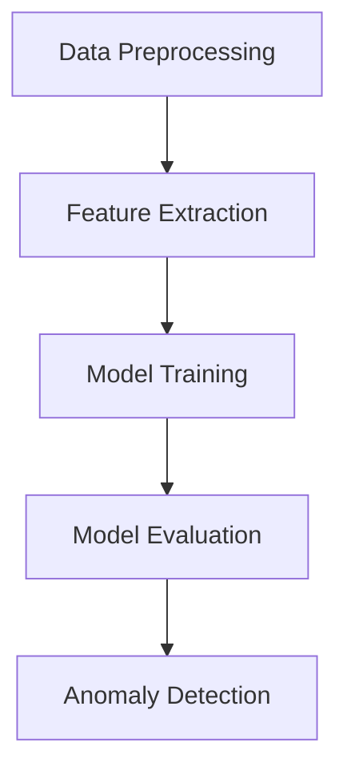

                 

### 金融领域对比学习在异常检测中的应用

#### 关键词
- 对比学习
- 异常检测
- 金融领域
- 算法优化
- 模型评估

#### 摘要
本文旨在探讨对比学习在金融领域异常检测中的应用。通过对对比学习与异常检测的基本概念、原理及其联系进行深入剖析，本文将详细解释对比学习在金融异常检测中的优势与挑战。随后，本文将介绍对比学习算法的优化策略和异常检测的具体实现，并通过实际案例分析，展示对比学习在金融领域的应用效果。最后，本文将总结最佳实践，并提出未来发展方向。

---

#### 引言

金融领域的异常检测是一项至关重要的任务，旨在识别和预测潜在的风险和欺诈行为，从而保护金融机构和投资者的利益。随着金融交易数据的爆炸式增长，传统的异常检测方法已经难以满足实时性和精确性的需求。因此，研究人员开始探索新的方法，其中对比学习（Comparative Learning）因其强大的特征提取能力和适应能力而受到广泛关注。

对比学习是一种通过比较不同数据样本来学习数据分布差异的方法。它利用了正负样本之间的分布差异来训练模型，从而提高模型在异常检测中的性能。在金融领域，对比学习可以用于检测异常交易、异常行为等，帮助金融机构及时识别和应对潜在的风险。

本文将分为五个部分。首先，我们将介绍对比学习和异常检测的基本概念和原理。接着，我们将详细解释对比学习算法的原理和优化策略，以及异常检测算法的优化方法。然后，我们将探讨对比学习在金融领域的应用案例，并通过具体案例进行分析和讨论。最后，我们将总结最佳实践，提出未来发展方向，并给出拓展阅读建议。

---

### 第一部分：背景介绍

#### 第1章：问题背景

#### 1.1 问题描述

在金融领域，异常检测主要涉及识别和预测以下几种异常情况：

1. **欺诈行为**：如信用卡欺诈、身份盗用等。
2. **市场操纵**：如操纵市场价格、内幕交易等。
3. **交易异常**：如异常的交易量、异常的交易时间等。
4. **操作风险**：如系统故障、人为错误等。

这些异常行为不仅可能对金融机构造成巨大的经济损失，还可能损害投资者的信心和市场稳定性。因此，实时、准确地检测这些异常行为对于金融领域的安全与稳定至关重要。

#### 1.2 问题解决

传统的异常检测方法主要包括以下几种：

1. **基于统计的方法**：如标准差法、孤立森林法等。
2. **基于规则的方法**：如逻辑回归、决策树等。
3. **基于机器学习的方法**：如支持向量机、随机森林等。

这些方法在一定程度上能够检测异常行为，但存在以下局限性：

1. **对异常行为特征依赖性强**：往往需要事先定义和收集特定的异常行为特征。
2. **对正常行为学习不足**：难以区分正常行为与异常行为的细微差异。
3. **对数据量要求高**：需要大量的正常和异常数据来训练模型。

#### 1.3 边界与外延

异常检测的边界在于如何在复杂、动态的金融环境中准确识别异常行为。这要求检测方法不仅能够应对大量的金融数据，还能够适应金融市场的新变化和新的异常模式。因此，异常检测不仅是一个技术问题，也是一个不断演进和发展的领域。

#### 1.4 概念结构与核心要素组成

异常检测的概念结构主要包括以下几个方面：

1. **数据采集**：收集金融交易数据、市场数据等。
2. **特征提取**：从数据中提取有助于异常检测的特征。
3. **模型训练**：使用正常和异常数据训练异常检测模型。
4. **模型评估**：评估模型的检测性能。
5. **实时检测**：在实时环境中对新的交易行为进行异常检测。

核心要素包括：

- **数据集**：用于训练和评估模型的数据集。
- **特征选择**：影响模型性能的关键特征。
- **模型选择**：用于异常检测的算法和模型。
- **评估指标**：用于评估模型性能的指标，如准确率、召回率、F1分数等。

### 第二部分：核心概念与联系

#### 第2章：核心概念与联系

#### 2.1 对比学习的定义

对比学习（Comparative Learning）是一种通过比较不同数据样本来学习数据分布差异的方法。其基本思想是通过学习正常数据和异常数据之间的分布差异来提高异常检测的性能。

#### 2.1.1 对比学习的概念

对比学习可以分为以下几种类型：

1. **基于样本的对比学习**：直接比较样本之间的相似性和差异性。
2. **基于分布的对比学习**：学习数据分布的差异。
3. **基于结构的对比学习**：通过比较数据结构来学习差异。

#### 2.1.2 对比学习的核心要素

对比学习的核心要素包括：

1. **正样本**：来自正常数据分布的样本。
2. **负样本**：来自异常数据分布的样本。
3. **损失函数**：用于衡量正负样本之间的差异。
4. **优化算法**：用于最小化损失函数，训练模型。

#### 2.2 异常检测的定义

异常检测（Anomaly Detection）是一种用于识别数据集中异常数据的方法。异常数据可以是错误数据、欺诈行为、恶意操作等。

#### 2.2.1 异常检测的概念

异常检测可以分为以下几种类型：

1. **基于统计的异常检测**：使用统计学方法来检测异常。
2. **基于模型的异常检测**：使用机器学习方法来检测异常。
3. **基于规则的异常检测**：使用预定义的规则来检测异常。

#### 2.2.2 异常检测的类型

异常检测的主要类型包括：

1. **孤立点检测**：检测数据集中的孤立点或异常值。
2. **基于阈值的异常检测**：使用阈值来检测异常。
3. **基于概率的异常检测**：使用概率模型来检测异常。

#### 2.3 对比学习与异常检测的联系

对比学习在异常检测中的应用主要体现在以下几个方面：

1. **特征提取**：对比学习可以通过比较正常和异常数据来提取有助于异常检测的特征。
2. **模型训练**：对比学习可以通过学习正常和异常数据的分布差异来训练异常检测模型。
3. **模型评估**：对比学习可以帮助评估异常检测模型的性能，通过比较正常和异常数据的检测效果来评估模型的准确性。

#### 2.3.1 对比学习在异常检测中的应用

对比学习在异常检测中的应用主要包括以下几种：

1. **欺诈检测**：通过比较正常交易和欺诈交易之间的特征差异来检测欺诈行为。
2. **市场操纵检测**：通过比较正常市场行为和操纵行为之间的特征差异来检测市场操纵。
3. **系统安全检测**：通过比较正常操作和异常操作之间的特征差异来检测系统故障或恶意攻击。

#### 2.3.2 异常检测在对比学习中的挑战

异常检测在对比学习中的挑战主要包括：

1. **数据不平衡**：异常数据通常比正常数据少，如何处理数据不平衡是一个挑战。
2. **特征选择**：如何选择有助于异常检测的关键特征是一个挑战。
3. **模型泛化**：如何确保模型在新的、未知的数据上能够有效检测异常是一个挑战。

### 第三部分：对比学习算法原理

#### 第3章：对比学习基本原理

#### 3.1 对比学习的数学模型

对比学习可以通过以下数学模型来描述：

$$
L = - \sum_{i} \left( w_1 \cdot \phi(x_i) - w_2 \cdot \phi(x_i') \right)
$$

其中，$x_i$ 和 $x_i'$ 分别是正常和异常样本，$\phi$ 是特征提取函数，$w_1$ 和 $w_2$ 是权重。

#### 3.1.1 基于对称性的损失函数

对比学习的损失函数通常基于对称性原则，即正负样本的权重相等。这可以通过以下损失函数来实现：

$$
L = - \sum_{i} \left( \log(\sigma(w_1 \cdot \phi(x_i))) + \log(\sigma(w_2 \cdot \phi(x_i')) \right)
$$

其中，$\sigma$ 是激活函数，通常使用 sigmoid 函数。

#### 3.1.2 基于信息论的目标函数

对比学习还可以使用基于信息论的目标函数，如 Jenson-Shannon 散度（JSD）或 Kullback-Leibler 散度（KL 散度）。这些目标函数可以衡量两个概率分布之间的差异。

$$
D_{JS}(P||Q) = \frac{1}{2} \left( D_{KL}(P||M) + D_{KL}(Q||M) \right)
$$

其中，$P$ 和 $Q$ 分别是正常和异常数据的概率分布，$M$ 是混合分布。

#### 3.2 对比学习流程图

对比学习的流程图如下所示：

#### 3.2.1 数据预处理

数据预处理是对比学习的第一步，主要包括以下任务：

- **数据清洗**：去除噪声和缺失值。
- **数据标准化**：将数据缩放到相同的范围。
- **数据分割**：将数据分为训练集、验证集和测试集。

#### 3.2.2 模型训练

模型训练是对比学习的核心步骤，主要包括以下任务：

- **定义损失函数**：选择合适的损失函数，如上述提到的基于对称性和信息论的目标函数。
- **选择优化算法**：选择合适的优化算法，如梯度下降、随机梯度下降等。
- **训练模型**：使用训练数据集来训练模型。

#### 3.2.3 模型评估

模型评估是对比学习的重要步骤，主要包括以下任务：

- **定义评估指标**：选择合适的评估指标，如准确率、召回率、F1分数等。
- **评估模型性能**：使用验证集和测试集来评估模型的性能。
- **调整模型参数**：根据评估结果调整模型参数，以提高模型性能。

#### 3.2.4 异常检测

异常检测是对比学习的最终目标，主要包括以下任务：

- **预测异常得分**：使用训练好的模型对新的数据样本进行预测，得到异常得分。
- **设定阈值**：根据评估结果设定合适的阈值，以区分正常和异常样本。
- **检测异常**：根据设定的阈值，对新的数据样本进行异常检测。

### 第四部分：异常检测算法原理

#### 第4章：异常检测基本原理

#### 4.1 异常检测的数学模型

异常检测的数学模型可以分为以下几种：

1. **基于聚类的方法**：如 K-means、DBSCAN 等。
2. **基于分布的方法**：如 GMM（高斯混合模型）、 kernel density estimation 等。
3. **基于规则的方法**：如逻辑回归、决策树等。

这些方法都可以通过以下数学模型来描述：

$$
P(X|C_k) \propto p(x|\mu_k, \sigma_k) \quad \text{或} \quad P(C_k|X) = \frac{P(X|C_k)P(C_k)}{P(X)}
$$

其中，$X$ 是数据样本，$C_k$ 是聚类或分类标签，$\mu_k$ 和 $\sigma_k$ 是聚类或分类的参数。

#### 4.2 异常检测流程图

异常检测的流程图如下所示：

#### 4.2.1 数据预处理

数据预处理是异常检测的第一步，主要包括以下任务：

- **数据清洗**：去除噪声和缺失值。
- **数据标准化**：将数据缩放到相同的范围。
- **数据分割**：将数据分为训练集、验证集和测试集。

#### 4.2.2 模型训练

模型训练是异常检测的核心步骤，主要包括以下任务：

- **定义损失函数**：选择合适的损失函数，如上述提到的基于聚类和分布的方法。
- **选择优化算法**：选择合适的优化算法，如梯度下降、随机梯度下降等。
- **训练模型**：使用训练数据集来训练模型。

#### 4.2.3 模型评估

模型评估是异常检测的重要步骤，主要包括以下任务：

- **定义评估指标**：选择合适的评估指标，如准确率、召回率、F1分数等。
- **评估模型性能**：使用验证集和测试集来评估模型的性能。
- **调整模型参数**：根据评估结果调整模型参数，以提高模型性能。

#### 4.2.4 异常检测

异常检测是异常检测的最终目标，主要包括以下任务：

- **预测异常得分**：使用训练好的模型对新的数据样本进行预测，得到异常得分。
- **设定阈值**：根据评估结果设定合适的阈值，以区分正常和异常样本。
- **检测异常**：根据设定的阈值，对新的数据样本进行异常检测。

### 第五部分：对比学习在异常检测中的应用

#### 第5章：金融领域对比学习应用

#### 5.1 金融领域概述

金融领域是一个高度复杂和动态变化的领域，涉及大量的交易数据、市场数据、用户行为数据等。这些数据不仅包含丰富的信息，还可能包含潜在的风险和欺诈行为。因此，对金融领域的数据进行有效的异常检测对于保护金融机构和投资者的利益至关重要。

#### 5.1.1 金融领域概述

金融领域主要包括以下几个方面：

1. **银行和金融机构**：如银行、保险公司、投资公司等。
2. **金融市场**：如股票市场、债券市场、外汇市场等。
3. **金融产品**：如股票、债券、期货、期权等。
4. **金融科技**：如区块链、人工智能、大数据等。

#### 5.1.2 金融领域异常检测的重要性

金融领域异常检测的重要性主要体现在以下几个方面：

1. **风险管理**：通过检测和预防潜在的风险，降低金融机构的风险敞口。
2. **合规性**：遵守相关法律法规，避免违规操作和处罚。
3. **客户体验**：快速识别和响应欺诈行为，保护客户的资金安全。
4. **市场稳定性**：通过实时监测市场异常行为，维护市场稳定。

#### 5.2 金融领域对比学习应用

对比学习在金融领域有着广泛的应用，主要包括以下几个方面：

1. **欺诈检测**：通过比较正常交易和欺诈交易之间的特征差异，检测信用卡欺诈、身份盗用等欺诈行为。
2. **市场操纵检测**：通过比较正常市场行为和操纵行为之间的特征差异，检测市场操纵、内幕交易等违法行为。
3. **用户行为分析**：通过比较正常用户行为和异常用户行为之间的特征差异，识别恶意用户、网络攻击等。
4. **风险预测**：通过比较历史数据和当前数据之间的特征差异，预测潜在的市场风险和金融风险。

#### 5.2.1 对比学习在金融交易中的应用

对比学习在金融交易中的应用主要包括以下几个方面：

1. **交易监测**：实时监测交易数据，检测异常交易行为。
2. **交易识别**：通过比较不同交易之间的特征差异，识别欺诈交易。
3. **风险评分**：对交易进行风险评估，预测潜在的风险。

#### 5.2.2 对比学习在风险管理中的应用

对比学习在风险管理中的应用主要包括以下几个方面：

1. **风险识别**：通过比较历史数据和当前数据之间的特征差异，识别潜在的市场风险。
2. **风险预警**：通过实时监测市场数据，预测潜在的市场风险。
3. **风险调整**：根据市场风险的变化，调整投资策略和风险敞口。

### 第六部分：案例分析与实战

#### 第6章：案例分析与实战

#### 6.1 案例一：基于对比学习的金融交易异常检测

#### 6.1.1 案例背景

本案例以某银行信用卡交易数据为例，使用对比学习算法进行异常检测。该银行希望识别和预防信用卡欺诈行为，保护客户的资金安全。

#### 6.1.2 数据预处理

数据预处理包括以下步骤：

1. **数据收集**：收集过去一年的信用卡交易数据。
2. **数据清洗**：去除缺失值和异常值。
3. **特征提取**：提取有助于异常检测的特征，如交易金额、交易时间、交易地点等。
4. **数据分割**：将数据分为训练集、验证集和测试集。

#### 6.1.3 模型设计与训练

模型设计包括以下步骤：

1. **选择对比学习算法**：选择合适的对比学习算法，如 Siamese Network。
2. **定义损失函数**：定义基于对称性的损失函数。
3. **训练模型**：使用训练集数据训练模型，并调整模型参数。
4. **验证模型**：使用验证集数据验证模型性能，并调整模型参数。

#### 6.1.4 模型评估与优化

模型评估包括以下步骤：

1. **定义评估指标**：选择合适的评估指标，如准确率、召回率、F1分数等。
2. **评估模型性能**：使用测试集数据评估模型性能。
3. **优化模型**：根据评估结果，优化模型参数和结构。

#### 6.1.5 模型应用与检测

模型应用包括以下步骤：

1. **实时监测**：使用训练好的模型对新的交易数据进行实时监测。
2. **异常检测**：根据设定的阈值，对新的交易数据进行异常检测，识别潜在的欺诈交易。

#### 6.2 案例二：基于对比学习的金融风险管理

#### 6.2.1 案例背景

本案例以某投资公司为例，使用对比学习算法进行金融风险管理。该投资公司希望识别和预测潜在的市场风险，调整投资策略，降低风险敞口。

#### 6.2.2 数据预处理

数据预处理包括以下步骤：

1. **数据收集**：收集过去一年的市场数据、交易数据等。
2. **数据清洗**：去除缺失值和异常值。
3. **特征提取**：提取有助于风险预测的特征，如市场指数、交易量、波动率等。
4. **数据分割**：将数据分为训练集、验证集和测试集。

#### 6.2.3 模型设计与训练

模型设计包括以下步骤：

1. **选择对比学习算法**：选择合适的对比学习算法，如 Siamese Network。
2. **定义损失函数**：定义基于对称性的损失函数。
3. **训练模型**：使用训练集数据训练模型，并调整模型参数。
4. **验证模型**：使用验证集数据验证模型性能，并调整模型参数。

#### 6.2.4 模型评估与优化

模型评估包括以下步骤：

1. **定义评估指标**：选择合适的评估指标，如准确率、召回率、F1分数等。
2. **评估模型性能**：使用测试集数据评估模型性能。
3. **优化模型**：根据评估结果，优化模型参数和结构。

#### 6.2.5 模型应用与风险预测

模型应用包括以下步骤：

1. **实时监测**：使用训练好的模型对新的市场数据、交易数据进行实时监测。
2. **风险预测**：根据模型预测结果，调整投资策略，降低风险敞口。

### 第七部分：最佳实践与总结

#### 第7章：最佳实践

#### 7.1 对比学习在异常检测中的应用技巧

1. **数据预处理**：确保数据的干净和一致性，对数据进行标准化和归一化处理。
2. **特征选择**：选择与异常检测相关的特征，避免冗余和无关特征。
3. **模型选择**：根据具体应用场景选择合适的对比学习算法。
4. **参数调整**：根据评估结果调整模型参数，以提高模型性能。

#### 7.2 异常检测系统设计最佳实践

1. **系统架构设计**：设计合理的系统架构，确保系统的稳定性和扩展性。
2. **模块化设计**：将系统功能划分为模块，便于开发和维护。
3. **实时监测**：实现实时数据流处理和异常检测，提高系统的响应速度。
4. **日志记录**：记录系统运行日志，便于问题追踪和故障排除。

#### 7.3 金融领域对比学习应用注意事项

1. **数据安全**：确保数据安全和隐私保护，遵守相关法律法规。
2. **模型解释性**：提高模型的可解释性，便于理解和信任。
3. **动态调整**：根据市场变化和新的异常模式，动态调整检测策略和模型参数。

### 第8章：小结与展望

#### 8.1 小结

本文详细探讨了对比学习在金融领域异常检测中的应用。通过对比学习和异常检测的基本概念、原理及其联系，分析了对比学习在金融异常检测中的优势与挑战。随后，本文介绍了对比学习算法的优化策略和异常检测的具体实现，并通过实际案例分析展示了对比学习在金融领域的应用效果。最后，本文总结了最佳实践，提出了未来发展方向。

#### 8.2 未来发展方向

1. **算法优化**：进一步优化对比学习算法，提高异常检测性能。
2. **多模态数据融合**：结合多种数据源，如文本、图像、声音等，实现更全面的异常检测。
3. **自动化特征提取**：开发自动化的特征提取方法，减少人工干预。
4. **模型解释性**：提高模型的可解释性，增强用户信任。

#### 8.3 拓展阅读

1. **《对比学习：原理与应用》**：深入了解对比学习的原理和应用。
2. **《金融科技：从技术到商业》**：探讨金融科技的发展趋势和应用场景。
3. **《大数据：技术、应用与挑战》**：了解大数据技术在金融领域的应用。

---

作者：AI天才研究院/AI Genius Institute & 禅与计算机程序设计艺术 /Zen And The Art of Computer Programming

---

### 摘要

本文探讨了对比学习在金融领域异常检测中的应用。首先介绍了对比学习和异常检测的基本概念和原理，分析了对比学习在异常检测中的优势与挑战。随后，详细阐述了对比学习算法的基本原理和优化策略，以及异常检测算法的优化方法。通过实际案例分析，展示了对比学习在金融领域的应用效果。最后，总结了最佳实践，并提出了未来发展方向。

---

### 结论

通过对对比学习和异常检测在金融领域的深入探讨，本文揭示了对比学习在金融异常检测中的巨大潜力。对比学习以其强大的特征提取能力和适应能力，能够有效识别和预测潜在的风险和欺诈行为。然而，要充分发挥对比学习在金融领域的应用价值，还需要进一步优化算法、提高模型解释性，并加强数据安全和隐私保护。未来，随着金融科技和大数据技术的发展，对比学习在金融领域的应用前景将更加广阔，有望为金融领域的安全和稳定贡献更多力量。

