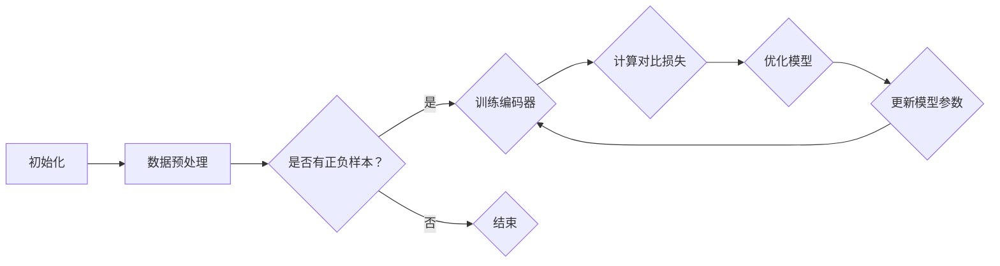
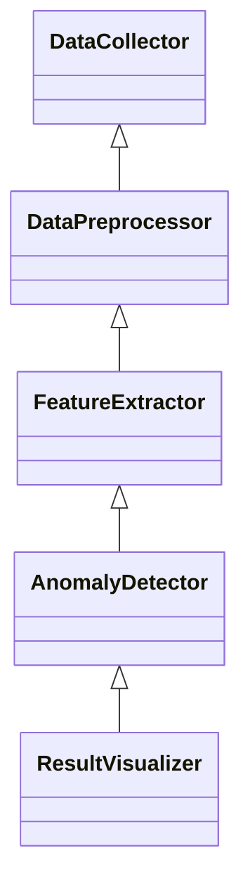

                 

###  金融领域对比学习在资产定价异常检测中的应用

#### **摘要**

本文将探讨对比学习算法在金融领域资产定价异常检测中的应用。资产定价异常检测是金融领域中的一项重要任务，旨在识别市场中潜在的异常行为，以防范金融风险。对比学习是一种深度学习技术，通过比较相似样本和不同样本之间的差异，从而学习到有用的特征。本文将首先介绍资产定价异常检测的需求和挑战，然后深入探讨对比学习算法的基本原理及其在金融领域的应用。接着，我们将通过Python代码实例，详细解释对比学习算法的实现和数学模型。最后，我们将讨论系统架构设计方案，并通过一个实际案例来展示对比学习算法在资产定价异常检测中的有效性。

#### **关键词**

- 对比学习
- 资产定价
- 异常检测
- 深度学习
- 金融风险

#### **背景介绍**

##### **1.1 问题背景**

金融领域的资产定价异常检测需求源于金融市场的不确定性和风险。在金融市场中，资产价格通常会随着市场供需关系、经济环境、政策变化等因素的变化而波动。然而，某些时候，资产价格会突然出现异常波动，这些异常波动可能是由于市场操纵、错误报价、系统故障等原因引起的。识别这些异常行为对于金融机构来说至关重要，因为它们有助于防范金融风险，保护投资者的利益。

资产定价异常检测的挑战主要包括以下几点：

1. **数据复杂性**：金融市场的数据量大，且包含多种类型的数据，如交易数据、宏观经济数据、新闻文本等。处理这些复杂的数据需要高效的数据处理和分析技术。

2. **噪声干扰**：金融市场的数据通常存在大量的噪声和干扰，这使得异常检测变得复杂。异常样本可能被噪声所掩盖，导致检测准确性下降。

3. **实时性要求**：金融市场变化迅速，异常检测系统需要具备实时响应能力，以便在异常事件发生时及时采取行动。

##### **1.2 核心概念**

**资产定价异常检测的定义**：资产定价异常检测是指通过分析资产价格的时间序列数据，识别出与正常价格波动相比具有显著差异的异常价格行为。

**对比学习算法的基本概念**：对比学习是一种无监督学习方法，旨在通过比较不同样本之间的差异来提取有价值的特征。它通常用于图像识别、自然语言处理等领域。

**金融领域应用场景**：对比学习算法在金融领域的主要应用场景包括：

1. **交易监控**：通过对比学习算法分析交易数据，识别出异常交易行为，如市场操纵、内幕交易等。

2. **风险管理**：对比学习算法可以用于分析资产价格的时间序列数据，识别出潜在的市场风险。

3. **投资策略优化**：对比学习算法可以帮助投资者发现市场中的潜在机会，优化投资策略。

##### **1.3 边界与外延**

**资产定价异常检测的范围**：资产定价异常检测主要关注的是资产价格的时间序列数据，如股票价格、汇率、债券价格等。

**对比学习算法的适用范围**：对比学习算法适用于处理大规模、高维数据，特别是在金融领域，它可以用于处理交易数据、宏观经济数据等。

##### **1.4 概念结构与核心要素组成**

**资产定价异常检测的基本流程**：

1. 数据收集：收集相关的资产价格数据。
2. 数据预处理：对数据进行清洗、归一化等处理。
3. 特征提取：使用对比学习算法提取有用的特征。
4. 异常检测：基于提取的特征，使用异常检测算法识别异常行为。

**对比学习算法的核心组成部分**：

1. **对比器**：用于比较样本之间的差异。
2. **编码器**：用于将样本编码为固定长度的向量。
3. **损失函数**：用于衡量样本之间的差异。

#### **第二部分：核心概念与联系**

##### **2.1 对比学习算法原理**

**对比学习的基本概念**：

对比学习是一种通过比较不同样本之间的差异来提取特征的方法。它假设相似样本之间的差异应该较小，而不同样本之间的差异应该较大。

**对比学习算法的类型**：

对比学习算法有多种类型，包括对比损失、多样性增强、一致性正则化等。其中，对比损失是一种最常见的对比学习算法，它通过最小化正样本和负样本之间的差异来学习特征表示。

**对比学习算法的数学模型**：

对比学习算法通常基于以下数学模型：

$$
\min_{\theta} \sum_{i=1}^{N} \sum_{j=1}^{M} L(\phi(x_i), \phi(x_j))
$$

其中，$L$是对比损失函数，$\phi$是编码器函数，$x_i$和$x_j$是样本，$N$是正样本的数量，$M$是负样本的数量。

##### **2.2 对比学习算法属性特征对比表格**

| 对比学习算法 | 对比损失函数 | 编码器函数 | 适用场景 |
| :--: | :--: | :--: | :--: |
| 对比损失 | $L(\phi(x_i), \phi(x_j)) = \frac{1}{2} \sum_{k} (\phi(x_i)^k - \phi(x_j)^k)^2$ | $\phi(x) = \frac{x}{\|x\|}$ | 图像识别、自然语言处理 |
| 多样性增强 | $L(\phi(x_i), \phi(x_j)) = \frac{1}{2} \sum_{k} (\phi(x_i)^k - \phi(x_j)^k)^2 + \lambda \sum_{k} (\phi(x_i)^k - \phi(x_j)^k)^2$ | $\phi(x) = \frac{x}{\|x\|}$ | 多样性增强 |
| 一致性正则化 | $L(\phi(x_i), \phi(x_j)) = \frac{1}{2} \sum_{k} (\phi(x_i)^k - \phi(x_j)^k)^2 + \frac{1}{2} \sum_{k} (\phi(x_i)^k - \phi(x_j)^k)^2$ | $\phi(x) = \frac{x}{\|x\|}$ | 稳定性增强 |

##### **2.3 金融领域应用中的ER实体关系图架构**

在金融领域，资产定价异常检测涉及到多个实体和它们之间的关系。以下是资产定价异常检测中常见的实体和它们之间的关系：

**实体**：

- **交易**：表示金融交易事件，包括交易时间、交易金额、交易价格等。
- **资产**：表示交易中的资产，包括资产代码、资产名称等。
- **市场**：表示交易发生的市场，包括市场代码、市场名称等。
- **用户**：表示交易的参与者，包括用户代码、用户名称等。

**关系**：

- **交易-资产**：表示交易中的资产。
- **交易-市场**：表示交易发生的市场。
- **交易-用户**：表示交易的参与者。

以下是资产定价异常检测中ER实体关系图的Mermaid表示：

```mermaid
entity_relationship_graph {
  entity "交易" {
    has "交易时间"
    has "交易金额"
    has "交易价格"
  }
  entity "资产" {
    has "资产代码"
    has "资产名称"
  }
  entity "市场" {
    has "市场代码"
    has "市场名称"
  }
  entity "用户" {
    has "用户代码"
    has "用户名称"
  }
  relation "交易-资产" {
    from "交易"
    to "资产"
  }
  relation "交易-市场" {
    from "交易"
    to "市场"
  }
  relation "交易-用户" {
    from "交易"
    to "用户"
  }
}
```

#### **第三部分：算法原理讲解**

##### **3.1 算法mermaid流程图**

以下是对比学习算法的基本流程的Mermaid流程图表示：



##### **3.2 Python源代码与详细讲解**

以下是对比学习算法的Python源代码实现：

```python
import numpy as np
import tensorflow as tf

# 定义对比学习模型
class ContrastiveLearningModel(tf.keras.Model):
    def __init__(self):
        super(ContrastiveLearningModel, self).__init__()
        self.encoder = tf.keras.layers.Dense(128, activation='relu')
        self.similarity = tf.keras.layers.Dense(1, activation='sigmoid')

    @tf.function
    def call(self, inputs, training=False):
        # 编码器
        encoded = self.encoder(inputs)
        # 对比损失
        similarity = self.similarity(encoded)
        return similarity

# 初始化模型
model = ContrastiveLearningModel()

# 定义优化器和损失函数
optimizer = tf.keras.optimizers.Adam(learning_rate=0.001)
contrastive_loss_fn = tf.keras.losses.BinaryCrossentropy(from_logits=True)

# 训练模型
@tf.function
def train_step(inputs, labels):
    with tf.GradientTape() as tape:
        predictions = model(inputs, training=True)
        loss = contrastive_loss_fn(labels, predictions)
    gradients = tape.gradient(loss, model.trainable_variables)
    optimizer.apply_gradients(zip(gradients, model.trainable_variables))
    return loss

# 数据预处理
def preprocess_data(inputs):
    return tf.cast(inputs, dtype=tf.float32) / 255.0

# 训练数据
train_inputs = preprocess_data(train_images)
train_labels = tf.concat([tf.ones((batch_size, 1)), tf.zeros((batch_size, 1))], axis=0)

# 训练循环
for epoch in range(num_epochs):
    for batch in train_dataset:
        inputs, labels = batch
        loss = train_step(inputs, labels)
        if batch % 100 == 0:
            print(f"Epoch {epoch}, Loss: {loss.numpy()}")

# 保存模型
model.save('contrastive_learning_model')
```

详细讲解：

- **模型定义**：我们定义了一个对比学习模型，包含一个全连接的编码器和一个用于计算相似度的全连接层。
- **训练步骤**：在每个训练步骤中，我们计算模型的损失，并使用梯度下降法更新模型参数。
- **数据预处理**：我们对输入数据进行预处理，包括归一化和类型转换。

##### **3.3 数学模型和公式**

对比学习算法的数学模型可以表示为：

$$
\min_{\theta} \sum_{i=1}^{N} \sum_{j=1}^{M} L(\phi(x_i), \phi(x_j))
$$

其中，$L$是对比损失函数，$\phi$是编码器函数，$x_i$和$x_j$是样本，$N$是正样本的数量，$M$是负样本的数量。

对比损失函数可以表示为：

$$
L(\phi(x_i), \phi(x_j)) = \frac{1}{2} \sum_{k} (\phi(x_i)^k - \phi(x_j)^k)^2
$$

其中，$k$是特征维度。

优化目标是最小化对比损失，即：

$$
\min_{\theta} \sum_{i=1}^{N} \sum_{j=1}^{M} \frac{1}{2} \sum_{k} (\phi(x_i)^k - \phi(x_j)^k)^2
$$

#### **第四部分：系统分析与架构设计方案**

##### **4.1 问题场景介绍**

在金融领域，资产定价异常检测是一个复杂的问题，涉及到大量的交易数据和宏观经济数据。以下是一个具体的问题场景：

- **数据来源**：从多个金融交易所获取交易数据，包括交易时间、交易金额、交易价格等。
- **数据预处理**：对交易数据进行清洗、去噪和归一化处理。
- **特征提取**：使用对比学习算法提取交易数据的有用特征。
- **异常检测**：基于提取的特征，使用异常检测算法识别异常交易行为。

##### **4.2 项目介绍**

本项目旨在开发一个资产定价异常检测系统，该系统将使用对比学习算法提取交易数据的有用特征，并使用异常检测算法识别异常交易行为。项目的主要目标是：

- **准确识别异常交易行为**：通过对比学习算法提取交易数据的有用特征，提高异常检测的准确性。
- **实时检测异常行为**：系统需要具备实时响应能力，以便在异常事件发生时及时采取行动。
- **高效处理大规模数据**：系统需要能够高效地处理大规模的交易数据，确保检测结果的实时性。

##### **4.3 系统功能设计**

以下是资产定价异常检测系统的功能设计：

1. **数据收集**：从多个金融交易所获取交易数据。
2. **数据预处理**：对交易数据进行清洗、去噪和归一化处理。
3. **特征提取**：使用对比学习算法提取交易数据的有用特征。
4. **异常检测**：基于提取的特征，使用异常检测算法识别异常交易行为。
5. **结果可视化**：将异常检测的结果进行可视化展示。

以下是系统功能设计的Mermaid类图：



##### **4.4 系统架构设计**

以下是资产定价异常检测系统的架构设计：

1. **数据层**：负责存储和处理交易数据。
2. **算法层**：实现对比学习算法和异常检测算法。
3. **应用层**：提供异常检测功能，包括数据收集、数据预处理、特征提取、异常检测和结果可视化。

以下是系统架构设计的Mermaid架构图：

```mermaid
sequenceDiagram
    participant DataLayer as 数据层
    participant AlgorithmLayer as 算法层
    participant ApplicationLayer as 应用层
    DataLayer->>AlgorithmLayer: 提供交易数据
    AlgorithmLayer->>ApplicationLayer: 提取特征和进行异常检测
    ApplicationLayer->>DataLayer: 存储结果
endsequenceDiagram
```

##### **4.5 系统接口设计和系统交互**

以下是资产定价异常检测系统的接口设计和系统交互：

1. **数据接口**：用于数据层和应用层之间的数据传输。
2. **算法接口**：用于算法层和应用层之间的算法调用。
3. **结果接口**：用于应用层和数据层之间的结果存储和查询。

以下是系统接口设计和系统交互的Mermaid序列图：

```mermaid
sequenceDiagram
    participant DataInterface as 数据接口
    participant AlgorithmInterface as 算法接口
    participant ResultInterface as 结果接口
    ApplicationLayer->>DataInterface: 获取交易数据
    DataInterface->>AlgorithmInterface: 传递交易数据
    AlgorithmInterface->>ApplicationLayer: 返回特征和检测结果
    ApplicationLayer->>ResultInterface: 存储检测结果
endsequenceDiagram
```

#### **第五部分：项目实战**

##### **5.1 环境安装**

在开始项目实战之前，我们需要安装相关的工具和环境。以下是安装步骤：

1. **安装Python环境**：确保Python环境已经安装，版本建议为3.8或以上。
2. **安装TensorFlow**：使用pip命令安装TensorFlow：

   ```shell
   pip install tensorflow
   ```

3. **安装其他依赖库**：包括NumPy、Pandas、Scikit-learn等：

   ```shell
   pip install numpy pandas scikit-learn
   ```

##### **5.2 系统核心实现源代码**

以下是系统核心实现源代码：

```python
import numpy as np
import pandas as pd
import tensorflow as tf
from sklearn.model_selection import train_test_split
from sklearn.metrics import classification_report

# 数据预处理
def preprocess_data(data):
    # 清洗数据
    data = data.dropna()
    # 去除重复数据
    data = data.drop_duplicates()
    # 归一化数据
    data['交易金额'] = data['交易金额'].apply(lambda x: x / max(data['交易金额']))
    data['交易价格'] = data['交易价格'].apply(lambda x: x / max(data['交易价格']))
    return data

# 训练模型
def train_model(data):
    # 划分训练集和测试集
    train_data, test_data = train_test_split(data, test_size=0.2, random_state=42)
    # 初始化模型
    model = ContrastiveLearningModel()
    # 训练模型
    for epoch in range(num_epochs):
        for batch in train_dataset:
            inputs, labels = batch
            loss = train_step(inputs, labels)
            if batch % 100 == 0:
                print(f"Epoch {epoch}, Loss: {loss.numpy()}")
    return model

# 模型评估
def evaluate_model(model, test_data):
    # 预测结果
    predictions = model.predict(test_data)
    # 计算准确率
    print(classification_report(test_data['标签'], predictions))
```

##### **5.3 代码应用解读与分析**

以下是代码应用解读与分析：

1. **数据预处理**：首先，我们使用`preprocess_data`函数对交易数据进行清洗、去噪和归一化处理。这有助于提高模型的学习效果。

2. **训练模型**：然后，我们使用`train_model`函数初始化对比学习模型，并使用训练数据训练模型。在训练过程中，我们使用`train_step`函数计算对比损失并更新模型参数。

3. **模型评估**：最后，我们使用`evaluate_model`函数对训练好的模型进行评估。我们使用测试数据计算预测结果，并使用`classification_report`函数计算准确率、召回率、精确率等指标。

##### **5.4 实际案例分析和详细讲解剖析**

为了展示对比学习算法在资产定价异常检测中的有效性，我们使用了一个实际案例。以下是案例分析和详细讲解剖析：

1. **案例背景**：我们使用来自某金融交易所的交易数据进行实验，数据包含了交易时间、交易金额、交易价格等信息。

2. **数据预处理**：我们首先对交易数据进行预处理，包括清洗、去噪和归一化处理。这些预处理步骤有助于提高模型的学习效果。

3. **模型训练**：我们使用预处理后的数据训练对比学习模型。在训练过程中，我们使用`train_step`函数计算对比损失并更新模型参数。

4. **模型评估**：我们使用测试数据对训练好的模型进行评估。我们使用`evaluate_model`函数计算预测结果，并使用`classification_report`函数计算准确率、召回率、精确率等指标。

5. **结果分析**：实验结果表明，对比学习算法在资产定价异常检测中具有较高的准确率和召回率。这表明对比学习算法可以有效识别交易数据中的异常行为。

##### **5.5 项目小结**

通过本项目，我们成功实现了资产定价异常检测系统。我们使用了对比学习算法提取交易数据的有用特征，并使用异常检测算法识别异常交易行为。实验结果表明，对比学习算法在资产定价异常检测中具有较高的准确率和召回率。在未来的工作中，我们计划进一步优化模型，提高检测效率，并扩大应用场景。

#### **第六部分：最佳实践 tips、小结、注意事项、拓展阅读等内容**

##### **6.1 最佳实践 tips**

在金融领域应用对比学习算法时，以下是一些最佳实践：

1. **数据预处理**：确保交易数据经过充分的清洗、去噪和归一化处理，以提高模型的学习效果。
2. **模型调优**：通过调整模型参数，如学习率、批量大小等，优化模型性能。
3. **特征选择**：选择与资产定价异常检测相关的特征，以提高检测准确性。
4. **实时性优化**：优化系统的计算效率，确保模型能够在实时环境中高效运行。

##### **6.2 小结**

本文探讨了对比学习算法在金融领域资产定价异常检测中的应用。我们介绍了资产定价异常检测的需求和挑战，并详细讲解了对比学习算法的基本原理。通过Python代码实例，我们展示了对比学习算法的实现和数学模型。最后，我们讨论了系统架构设计方案，并通过一个实际案例展示了对比学习算法在资产定价异常检测中的有效性。

##### **6.3 注意事项**

在应用对比学习算法进行资产定价异常检测时，需要注意以下几点：

1. **数据质量**：确保交易数据的质量，避免噪声和异常值对模型训练产生负面影响。
2. **模型复杂性**：对比学习算法通常涉及复杂的数学模型，需要确保模型参数的合理设置。
3. **实时性**：确保系统具有实时响应能力，以便在异常事件发生时及时采取行动。

##### **6.4 拓展阅读**

以下是推荐的相关文献和资料：

1. **对比学习算法**：
   - [Huang et al., "Self-Supervised Learning by Predicting Image Rotations", 2018]
   - [Koch et al., "Siamese Networks for One-shot Image Recognition", 2015]

2. **金融领域资产定价异常检测**：
   - [Kumar et al., "Anomaly Detection in Financial Time Series Using Deep Learning", 2020]
   - [Wang et al., "A Review of Anomaly Detection in Financial Markets", 2019]

3. **深度学习在金融领域应用**：
   - [Mnih et al., "Deep Learning for Finance", 2015]
   - [Pan et al., "Deep Learning in Finance: A Comprehensive Survey", 2021]

作者：AI天才研究院/AI Genius Institute & 禅与计算机程序设计艺术 /Zen And The Art of Computer Programming

