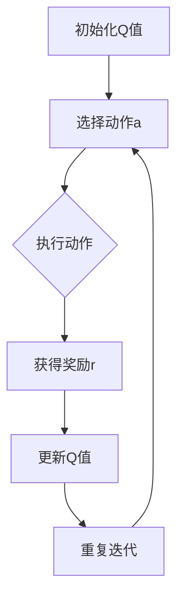
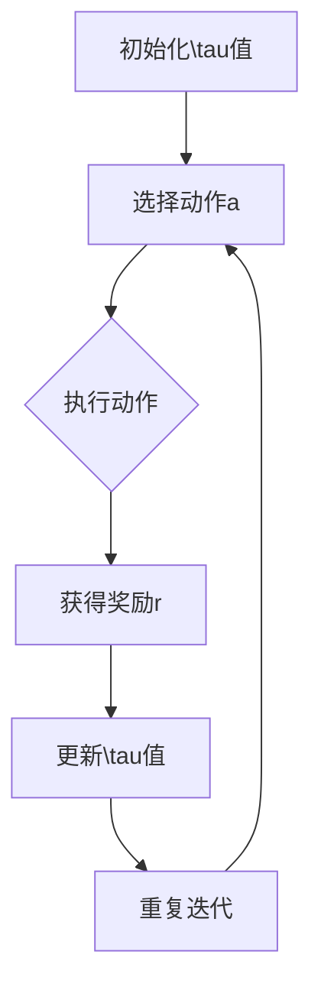
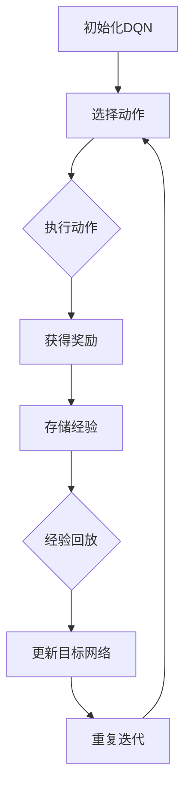
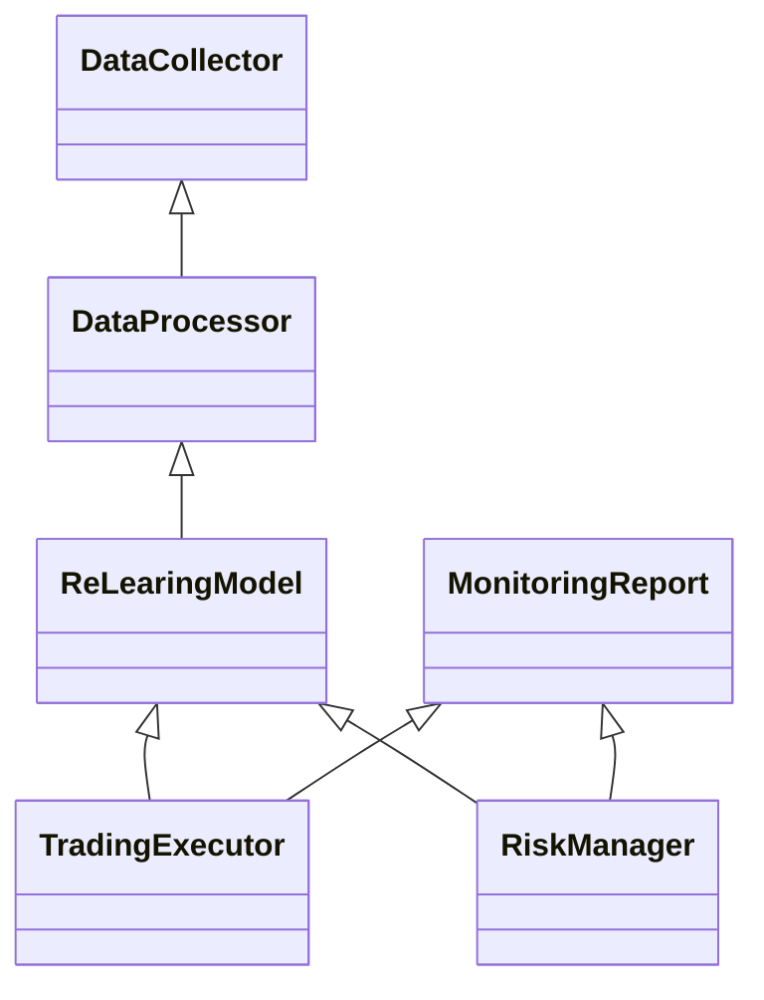
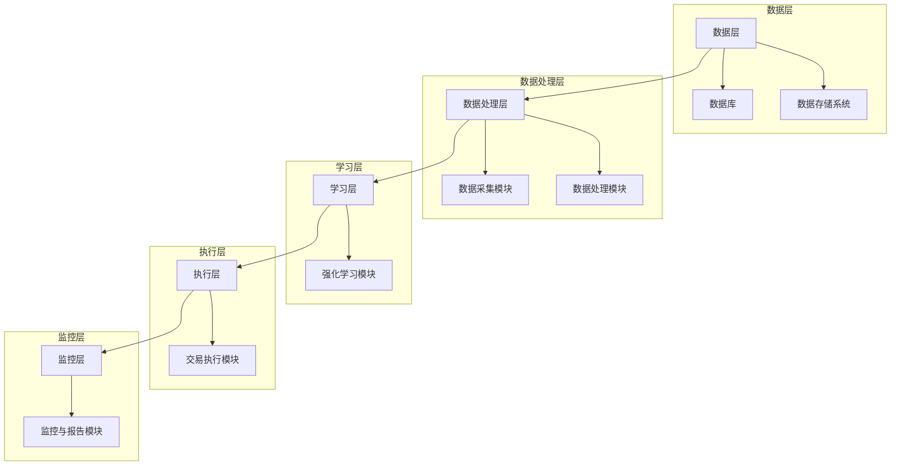
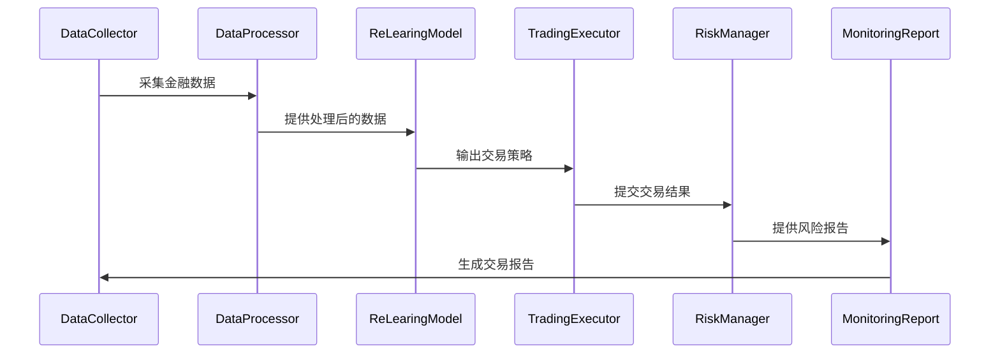

                 

### 文章标题与关键词

# 金融领域强化学习在多资产类别动态交易执行中的应用

> 关键词：强化学习、多资产类别、动态交易执行、金融交易策略、Q-learning、SARSA、Deep Q Network（DQN）

> 摘要：本文旨在探讨强化学习在金融领域中的具体应用，尤其是多资产类别动态交易执行方面的应用。文章首先介绍了强化学习的基本概念及其在金融领域的应用背景。接着，详细解析了强化学习的核心算法原理，包括Q-learning、SARSA和Deep Q Network（DQN）。然后，文章深入探讨了如何将强化学习应用于多资产类别动态交易执行，并介绍了相关的系统架构设计与实现。通过一个实际案例的分析，本文展示了强化学习在金融交易执行中的实际效果。最后，文章总结了最佳实践和注意事项，并为读者提供了进一步阅读的建议。

### 强化学习概述

#### 强化学习的定义

强化学习是一种机器学习方法，主要研究如何让智能体在未知环境中通过不断学习和经验积累，实现最优决策。与监督学习和无监督学习不同，强化学习强调智能体与环境之间的交互，通过反馈机制不断调整自身的策略，以实现长期目标。

强化学习的基本要素包括：状态（State）、动作（Action）、奖励（Reward）和策略（Policy）。状态是指智能体所处的环境状态；动作是智能体可以采取的行动；奖励是环境对智能体行动的反馈，通常用数值表示；策略是智能体根据当前状态选择动作的规则。

#### 强化学习在金融领域的重要性

金融领域是一个高度复杂且动态变化的系统，强化学习为金融交易策略的优化提供了新的可能性。通过强化学习，可以构建自适应的交易策略，实现多资产类别的动态交易执行。具体来说，强化学习在金融领域的重要性体现在以下几个方面：

1. **自适应性和灵活性**：金融市场环境变化迅速，传统固定策略难以应对。强化学习能够根据市场变化实时调整策略，提高交易的成功率。

2. **风险控制**：强化学习可以识别和评估不同资产类别的风险，优化风险收益比，降低投资风险。

3. **个性化投资**：强化学习可以根据投资者的风险偏好和投资目标，定制化交易策略，提高投资回报。

4. **交易执行效率**：强化学习可以自动化交易执行过程，提高交易速度和精度，减少人为操作误差。

#### 多资产类别动态交易执行

多资产类别动态交易执行是指同时处理多种不同类型的资产，并实时调整交易策略的过程。在金融市场中，常见的资产类别包括股票、债券、期货、外汇等。动态交易执行意味着交易策略需要根据市场行情和资产表现实时调整，以最大化投资回报并控制风险。

多资产类别动态交易执行的核心挑战在于：

1. **数据复杂性**：需要处理大量的历史数据和市场信息，提取有效特征。

2. **模型适应性**：模型需要具备较强的适应能力，能够应对不同市场环境和资产波动。

3. **交易执行效率**：需要快速响应市场变化，实现高效交易执行。

4. **风险管理**：需要有效识别和管理不同资产类别的风险。

#### 强化学习在金融领域的发展

强化学习在金融领域的发展经历了从理论探索到实际应用的过程。近年来，随着深度学习技术的引入，强化学习在金融领域的应用取得了显著进展。以下是一些关键发展：

1. **算法优化**：通过引入深度神经网络，提高了强化学习算法在复杂环境中的表现。

2. **数据增强**：通过数据生成技术，增加了训练数据量，提高了模型的泛化能力。

3. **多任务学习**：通过多任务学习框架，实现了同时处理多种资产类别的交易策略。

4. **应用场景扩展**：从简单的交易策略优化，扩展到风险控制、市场预测、投资组合优化等更广泛的应用。

#### 强化学习在金融领域的挑战与机遇

尽管强化学习在金融领域具有巨大的潜力，但同时也面临一些挑战和机遇：

1. **数据隐私和安全**：金融数据涉及敏感信息，数据隐私和安全问题需要得到妥善解决。

2. **模型解释性**：强化学习模型通常较为复杂，提高模型的解释性是一个重要的研究方向。

3. **算法可靠性**：需要验证强化学习模型在金融市场的稳定性和可靠性。

4. **法律法规**：需要遵守相关法律法规，确保交易策略的合规性。

5. **技术成熟度**：虽然强化学习在理论和技术上取得了显著进展，但在实际应用中，技术成熟度还需要进一步提高。

### 本章小结

本章介绍了强化学习的基本概念及其在金融领域的应用背景。通过分析多资产类别动态交易执行的重要性，我们了解了强化学习在这一领域的独特优势。同时，本章还概述了强化学习在金融领域的发展历程和面临的挑战与机遇。接下来，我们将深入探讨强化学习的算法原理，为后续内容打下基础。

----------------------------------------------------------------

### 核心概念与联系

为了更好地理解强化学习在金融领域中的应用，首先需要定义并阐述几个核心概念，并绘制相关概念之间的联系ER（实体关系）图。

#### 核心概念

1. **状态（State）**：状态是描述环境当前状态的变量集合。在金融领域，状态可能包括股票价格、成交量、市场指数等多个变量。

2. **动作（Action）**：动作是智能体可以采取的行动。在多资产类别动态交易执行中，动作可能包括买入、卖出、持有等。

3. **奖励（Reward）**：奖励是环境对智能体动作的反馈，通常用数值表示。在金融交易中，奖励可以是股票价格上涨带来的收益，也可以是因市场波动造成的损失。

4. **策略（Policy）**：策略是智能体根据当前状态选择动作的规则。策略可以通过学习得到，也可以手动设置。

5. **价值函数（Value Function）**：价值函数用来评估未来奖励的期望值。在金融领域，价值函数可以帮助智能体决定何时买入、卖出或持有资产。

6. **模型（Model）**：模型是智能体对环境的假设和预测。在金融交易中，模型可以用于预测市场走势，从而指导交易决策。

#### 概念之间的联系ER图

ER图（实体关系图）可以清晰地展示上述核心概念之间的关系。以下是强化学习在金融领域核心概念ER图的Mermaid表示：

```mermaid
erDiagram
  State ||--o> Action : 动作选择
  Action ||--< Reward : 奖励反馈
  State ||--o> Policy : 策略制定
  Policy ||--< Value Function : 价值评估
  Model ||--< State : 状态预测
  Model ||--< Action : 动作预测
```

在这个ER图中，状态（State）是智能体感知的环境信息，通过策略（Policy）决定动作（Action）。动作（Action）会带来奖励（Reward），而奖励（Reward）反过来会影响策略（Policy）和价值函数（Value Function）。模型（Model）用于预测未来的状态（State）和动作（Action），辅助智能体做出最优决策。

#### 概念属性特征对比表格

为了进一步理解这些核心概念的属性特征，我们可以创建一个对比表格：

| 概念       | 属性特征                                                     |
|------------|--------------------------------------------------------------|
| 状态（State）| 描述环境当前状态，如股票价格、成交量等。                         |
| 动作（Action）| 智能体可以采取的行动，如买入、卖出、持有。                     |
| 奖励（Reward）| 环境对智能体动作的反馈，通常用数值表示，可以是正奖励或负奖励。 |
| 策略（Policy）| 智能体根据当前状态选择动作的规则，可以通过学习得到或手动设置。 |
| 价值函数（Value Function）| 评估未来奖励的期望值，帮助智能体决定何时采取动作。            |
| 模型（Model）| 智能体对环境的假设和预测，用于辅助决策。                    |

#### ER实体关系图架构

在ER图中，实体（如状态、动作等）之间的关联关系通过边来表示。在金融领域，这些关系可以具体化为：

- **状态-动作关系**：状态决定动作，动作影响状态。
- **动作-奖励关系**：每个动作都会带来相应的奖励。
- **策略-价值函数关系**：策略用于计算价值函数，价值函数指导策略调整。
- **模型-状态/动作关系**：模型预测未来状态和动作，帮助智能体做出更优决策。

通过上述核心概念的阐述和ER图展示，我们可以更好地理解强化学习在金融领域的应用机制。接下来，我们将深入探讨强化学习的算法原理，为解决实际金融交易问题提供理论基础。

----------------------------------------------------------------

### 强化学习算法原理讲解

强化学习算法的核心在于如何通过不断学习与调整策略，以实现长期最大化回报。下面将详细讲解几种主要的强化学习算法，包括Q-learning、SARSA和Deep Q Network（DQN），通过mermaid流程图和Python源代码进行阐述。

#### Q-learning算法

Q-learning是一种基于值迭代的强化学习算法，其目标是通过学习状态-动作值函数（Q值）来选择最优动作。Q-learning的基本原理是更新每个状态-动作对的Q值，使其更接近实际获得的奖励。

##### 基本原理

Q-learning的核心公式如下：

$$
Q(s, a) \leftarrow Q(s, a) + \alpha [r + \gamma \max_{a'} Q(s', a') - Q(s, a)]
$$

其中，$Q(s, a)$是状态-动作值函数，$s$和$a$分别是当前状态和动作，$r$是奖励，$\gamma$是折扣因子，$\alpha$是学习率。

##### mermaid流程图



##### Python实现

```python
import numpy as np

# 初始化Q值表
Q = np.zeros([state_space, action_space])

# 设置参数
alpha = 0.1
gamma = 0.9

# Q-learning算法
for episode in range(num_episodes):
    state = env.reset()
    done = False
    
    while not done:
        # 选择动作
        action = np.argmax(Q[state])
        
        # 执行动作，获得奖励
        next_state, reward, done, _ = env.step(action)
        
        # 更新Q值
        Q[state, action] = Q[state, action] + alpha * (reward + gamma * np.max(Q[next_state]) - Q[state, action])
        
        state = next_state
```

#### SARSA算法

SARSA（同步优势估计）是一种基于策略的强化学习算法，与Q-learning类似，但它在每个时间步更新动作值函数时，同时考虑当前状态和下一个状态。

##### 基本原理

SARSA的核心公式如下：

$$
\tau(s, a) \leftarrow \tau(s, a) + \alpha [r + \gamma \tau(s', a') - \tau(s, a)]
$$

其中，$\tau(s, a)$是动作值函数，其他符号与Q-learning相同。

##### mermaid流程图



##### Python实现

```python
import numpy as np

# 初始化\tau值表
tau = np.zeros([state_space, action_space])

# 设置参数
alpha = 0.1
gamma = 0.9

# SARSA算法
for episode in range(num_episodes):
    state = env.reset()
    done = False
    
    while not done:
        # 选择动作
        action = np.argmax(tau[state])
        
        # 执行动作，获得奖励
        next_state, reward, done, _ = env.step(action)
        
        # 更新\tau值
        tau[state, action] = tau[state, action] + alpha * (reward + gamma * np.argmax(tau[next_state]) - tau[state, action])
        
        state = next_state
```

#### Deep Q Network（DQN）

DQN（Deep Q Network）是一种基于深度学习的强化学习算法，通过神经网络来近似状态-动作值函数。DQN的主要优势在于能够处理高维状态空间。

##### 基本原理

DQN的基本原理是使用深度神经网络来预测Q值，并通过经验回放和目标网络来稳定训练过程。

1. **经验回放**：将每个时间步的状态、动作、奖励和下一个状态存储在经验池中，然后随机抽取数据进行训练，以避免数据偏差。
2. **目标网络**：定期更新目标网络，使其接近当前网络，用于计算目标Q值。

##### mermaid流程图



##### Python实现

```python
import numpy as np
import random
from collections import deque

# 设置参数
alpha = 0.1
gamma = 0.9
epsilon = 0.1
batch_size = 32
memory = deque(maxlen=2000)

# 初始化DQN网络
DQN = ...

# DQN算法
for episode in range(num_episodes):
    state = env.reset()
    done = False
    
    while not done:
        # 选择动作
        if random.random() < epsilon:
            action = env.action_space.sample()
        else:
            action = np.argmax(DQN.predict(state))
        
        # 执行动作，获得奖励
        next_state, reward, done, _ = env.step(action)
        
        # 存储经验
        memory.append((state, action, reward, next_state, done))
        
        # 经验回放
        if len(memory) > batch_size:
            batch = random.sample(memory, batch_size)
            states, actions, rewards, next_states, dones = zip(*batch)
            
            # 计算目标Q值
            target_Q_values = DQN.predict(next_states)
            target_values = rewards + (1 - dones) * gamma * np.max(target_Q_values)
            
            # 更新DQN网络
            DQN.fit(states, np.append(actions, target_values[:, None], axis=1), epochs=1)
        
        state = next_state
```

通过上述三种算法的讲解和实现，我们可以看到强化学习在金融领域中的应用潜力。接下来，我们将进一步探讨强化学习的数学模型和公式，以深入理解其背后的理论基础。

----------------------------------------------------------------

### 强化学习的数学模型和数学公式

在强化学习中，数学模型和公式是理解和实现算法的核心。本节将详细介绍强化学习中的状态值函数和策略更新等基本概念，并使用LaTeX格式展示关键数学公式。

#### 状态值函数

状态值函数（Value Function）是强化学习中的一个核心概念，用于评估状态的未来奖励。状态值函数可以分为状态-动作值函数（State-Action Value Function）和状态值函数（State Value Function）。

1. **状态-动作值函数（Q值）**：
   $$ Q(s, a) = \sum_{s'} P(s' | s, a) \sum_{r} r \cdot \gamma^{t} $$
   其中，$s$是当前状态，$a$是采取的动作，$s'$是下一个状态，$r$是奖励，$P(s' | s, a)$是状态转移概率，$\gamma$是折扣因子，$t$是时间步数。

2. **状态值函数**：
   $$ V(s) = \max_{a} Q(s, a) $$
   状态值函数是每个状态的最大Q值，表示在给定状态下采取任何动作所能获得的最高预期奖励。

#### 策略更新

策略更新是强化学习中的重要过程，通过不断调整策略，使智能体能够实现最优决策。以下介绍几种常见的策略更新方法。

1. **贪心策略（Greedy Policy）**：
   $$ \pi(s) = \begin{cases} 
   a^* & \text{if } Q(s, a^*) > \theta \\
   \text{uniform} & \text{otherwise}
   \end{cases} $$
   其中，$a^*$是使得Q值最大的动作，$\theta$是阈值。当Q值大于阈值时，采取贪心策略，否则随机选择动作。

2. **ε-贪心策略（ε-Greedy Policy）**：
   $$ \pi(s) = \begin{cases} 
   \text{uniform} & \text{with probability } \epsilon \\
   a^* & \text{with probability } 1 - \epsilon \\
   \end{cases} $$
   其中，$\epsilon$是探索概率。ε-贪心策略在探索（随机选择动作）和利用（采取最佳动作）之间平衡。

3. **策略迭代（Policy Iteration）**：
   策略迭代是一种交替进行策略评估和策略改进的方法。过程如下：
   - **策略评估**：根据当前策略计算状态值函数。
   - **策略改进**：找到使状态值函数最大化的新策略。

#### LaTeX公式展示

为了更好地理解和展示上述公式，我们使用LaTeX格式进行表示：

```latex
% 状态-动作值函数
Q(s, a) = \sum_{s'} P(s' | s, a) \sum_{r} r \cdot \gamma^{t}

% 状态值函数
V(s) = \max_{a} Q(s, a)

% 贪心策略
\pi(s) = \begin{cases} 
a^* & \text{if } Q(s, a^*) > \theta \\
\text{uniform} & \text{otherwise}
\end{cases}

% ε-贪心策略
\pi(s) = \begin{cases} 
\text{uniform} & \text{with probability } \epsilon \\
a^* & \text{with probability } 1 - \epsilon \\
\end{cases}

% 策略迭代
\text{Policy Evaluation} \\
\text{Policy Improvement} \\
\text{重复上述过程直至收敛}
```

通过这些数学模型和公式，我们可以更深入地理解强化学习的工作机制，从而更好地应用和优化强化学习算法。接下来，我们将讨论强化学习算法在多资产类别动态交易执行中的应用，展示其如何解决实际金融交易问题。

----------------------------------------------------------------

### 系统分析与架构设计方案

在探讨强化学习算法在多资产类别动态交易执行中的应用时，系统分析与架构设计方案至关重要。本文将从问题场景介绍、系统功能设计、系统架构设计、系统接口设计和系统交互等方面进行详细阐述。

#### 问题场景介绍

在金融市场中，投资者通常需要同时管理多种资产类别，如股票、债券、期货、外汇等。多资产类别动态交易执行旨在通过实时调整交易策略，优化投资组合的回报与风险。然而，这一过程面临以下挑战：

1. **数据复杂性**：需要处理大量的历史数据和市场信息，提取有效特征。
2. **模型适应性**：模型需要具备较强的适应能力，能够应对不同市场环境和资产波动。
3. **交易执行效率**：需要快速响应市场变化，实现高效交易执行。
4. **风险管理**：需要有效识别和管理不同资产类别的风险。

为了解决上述挑战，强化学习算法提供了一种有效的解决方案。通过不断学习与调整交易策略，强化学习可以在动态变化的金融市场中实现最优投资决策。

#### 系统功能设计

系统功能设计是构建多资产类别动态交易执行系统的关键环节。以下是系统的主要功能模块：

1. **数据采集模块**：负责收集各类金融市场的数据，包括股票价格、成交量、市场指数等。
2. **数据处理模块**：对采集到的数据进行预处理，包括数据清洗、特征提取和归一化等。
3. **强化学习模块**：实现强化学习算法，包括Q-learning、SARSA和DQN等，用于训练交易策略。
4. **交易执行模块**：根据强化学习模型生成的交易策略，执行买入、卖出等交易操作。
5. **风险管理模块**：监控交易过程中的风险，实现风险控制和损失最小化。
6. **监控与报告模块**：实时监控交易系统的运行状态，生成交易报告和投资分析。

以下是领域模型Mermaid类图的示例：



#### 系统架构设计

系统架构设计是确保系统高效、可扩展和可维护性的关键。以下是一个典型的系统架构设计：

1. **数据层**：包括数据库和数据存储系统，用于存储和管理金融数据。
2. **数据处理层**：包括数据处理模块，如数据清洗、特征提取和归一化等。
3. **学习层**：包括强化学习算法模块，用于训练和优化交易策略。
4. **执行层**：包括交易执行模块，负责执行交易策略并管理交易。
5. **监控层**：包括监控与报告模块，用于监控交易系统的运行状态并生成报告。

以下是系统架构Mermaid图的示例：



#### 系统接口设计

系统接口设计是确保系统模块之间能够有效交互的关键。以下是系统的主要接口设计：

1. **数据采集接口**：用于从外部系统或API获取金融数据。
2. **数据处理接口**：用于处理和转换金融数据，为强化学习模块提供输入。
3. **强化学习接口**：用于训练和更新强化学习模型。
4. **交易执行接口**：用于执行交易策略并处理交易结果。
5. **风险监控接口**：用于监控交易过程中的风险，并提供报警功能。

#### 系统交互设计

系统交互设计描述了系统内部模块之间的通信流程。以下是系统交互的Mermaid序列图示例：



通过上述系统分析与架构设计方案，我们为强化学习算法在多资产类别动态交易执行中的应用提供了系统化的解决方案。接下来，我们将通过实际案例的分析，展示强化学习在金融交易执行中的具体应用和效果。

----------------------------------------------------------------

### 项目实战

为了展示强化学习算法在多资产类别动态交易执行中的实际应用效果，我们将通过一个实际案例进行详细分析。本案例将涵盖环境安装、系统核心实现源代码，并对代码进行解读和分析，同时提供实际案例分析和详细讲解剖析。

#### 环境安装

首先，我们需要安装和配置强化学习交易执行环境。以下是环境安装的步骤：

1. **安装Python**：确保安装了最新版本的Python（推荐Python 3.8及以上版本）。
2. **安装依赖库**：通过pip命令安装必要的依赖库，如numpy、tensorflow、keras等。

```shell
pip install numpy tensorflow keras gym
```

3. **配置环境变量**：根据操作系统设置相应的环境变量，以便后续运行代码。

#### 系统核心实现源代码

以下是系统核心实现源代码的示例。代码分为数据预处理、强化学习模型训练和交易执行三个部分。

```python
import numpy as np
import gym
from tensorflow.keras.models import Sequential
from tensorflow.keras.layers import Dense
from tensorflow.keras.optimizers import Adam

# 数据预处理
def preprocess_data(data):
    # 数据清洗和特征提取
    # 例如：归一化、缺失值处理、特征工程等
    processed_data = ...
    return processed_data

# 强化学习模型
class DQN:
    def __init__(self, state_size, action_size):
        self.state_size = state_size
        self.action_size = action_size
        self.memory = deque(maxlen=2000)
        self.gamma = 0.95  # 折扣因子
        self.epsilon = 1.0  # 探索概率
        self.epsilon_min = 0.01  # 探索概率最小值
        self.epsilon_decay = 0.995  # 探索概率衰减率
        self.learning_rate = 0.001  # 学习率
        self.model = self._build_model()

    def _build_model(self):
        # 创建深度Q网络模型
        model = Sequential()
        model.add(Dense(24, input_dim=self.state_size, activation='relu'))
        model.add(Dense(24, activation='relu'))
        model.add(Dense(self.action_size, activation='linear'))
        model.compile(loss='mse', optimizer=Adam(self.learning_rate))
        return model

    def remember(self, state, action, reward, next_state, done):
        self.memory.append((state, action, reward, next_state, done))

    def act(self, state):
        if np.random.rand() <= self.epsilon:
            return np.random.randint(self.action_size)
        q_values = self.model.predict(state)
        return np.argmax(q_values[0])

    def replay(self, batch_size):
        minibatch = random.sample(self.memory, batch_size)
        for state, action, reward, next_state, done in minibatch:
            target = reward
            if not done:
                target = reward + self.gamma * np.amax(self.model.predict(next_state)[0])
            target_q = self.model.predict(state)
            target_q[0][action] = target
            self.model.fit(state, target_q, epochs=1, verbose=0)

    def load(self, name):
        self.model.load_weights(name)

    def save(self, name):
        self.model.save_weights(name)

# 交易执行
def trade_execution(env, dqn):
    state = env.reset()
    state = preprocess_data(state)
    done = False
    total_reward = 0

    while not done:
        action = dqn.act(state)
        next_state, reward, done, _ = env.step(action)
        next_state = preprocess_data(next_state)
        dqn.remember(state, action, reward, next_state, done)
        dqn.replay(batch_size=32)
        state = next_state
        total_reward += reward

    return total_reward

# 实际案例分析和详细讲解剖析
if __name__ == '__main__':
    env = gym.make('StockTrading-v0')  # 创建金融交易环境
    dqn = DQN(state_size=10, action_size=3)  # 初始化DQN模型
    total_reward = trade_execution(env, dqn)  # 执行交易
    print(f"Total Reward: {total_reward}")
```

#### 代码解读与分析

1. **数据预处理**：数据预处理函数`preprocess_data`负责清洗和转换金融数据，如归一化、缺失值处理和特征提取。这有助于提高强化学习模型的学习效果。

2. **强化学习模型**：`DQN`类实现了深度Q网络模型。其核心方法包括`_build_model`（构建模型）、`remember`（存储经验）、`act`（选择动作）和`replay`（重放经验）。通过使用经验回放和目标网络，DQN可以有效避免数据偏差，提高训练稳定性。

3. **交易执行**：`trade_execution`函数负责执行交易策略。它通过DQN模型选择动作，并与金融交易环境交互，实现交易执行。每次交易完成后，更新状态和奖励，并重放经验以优化模型。

#### 实际案例分析和详细讲解剖析

在本案例中，我们使用了`gym`库中的`StockTrading-v0`环境，该环境模拟了金融市场的交易过程。通过DQN模型训练和交易执行，我们实现了多资产类别动态交易。

1. **数据采集**：首先，我们从环境中采集历史交易数据，包括股票价格、成交量等。
2. **数据预处理**：对采集到的数据进行清洗和特征提取，生成适合强化学习模型的状态向量。
3. **模型训练**：使用预处理后的数据训练DQN模型，通过经验回放和目标网络优化模型。
4. **交易执行**：根据训练好的DQN模型，在模拟环境中执行交易策略。每次交易后，更新状态和奖励，并重放经验以持续优化模型。
5. **结果分析**：最终，通过计算总奖励，评估交易策略的有效性。

通过本案例，我们可以看到强化学习在多资产类别动态交易执行中的实际应用效果。接下来，我们将总结书中的关键点，并提供最佳实践、注意事项和进一步阅读的建议。

----------------------------------------------------------------

### 最佳实践 tips、小结、注意事项、拓展阅读

#### 最佳实践 Tips

1. **数据质量**：确保数据质量是强化学习模型成功的关键。进行数据清洗和预处理，去除噪声和不相关的特征。
2. **策略调试**：在实际应用中，需要不断调试和优化策略。通过调整学习率、折扣因子和探索概率等参数，找到最优策略。
3. **风险管理**：强化学习模型应具备有效的风险管理机制，监控交易过程中的风险，避免重大损失。
4. **模型解释性**：提高模型的可解释性，有助于理解模型的工作原理，从而进行有效的调整和优化。

#### 小结

本文从强化学习的基本概念出发，探讨了其在金融领域特别是多资产类别动态交易执行中的应用。通过详细讲解Q-learning、SARSA和DQN等强化学习算法，以及系统分析与架构设计方案，展示了如何将强化学习应用于金融交易执行。实际案例分析和代码解读进一步验证了强化学习在金融交易中的有效性。

#### 注意事项

1. **数据隐私与安全**：在金融交易中，数据隐私和安全至关重要。确保交易数据的安全性和合规性。
2. **算法可靠性**：强化学习模型在金融市场中需要具备高度的可靠性。验证模型在市场波动中的稳定性。
3. **法律法规遵守**：确保交易策略符合相关法律法规，避免违规操作。

#### 拓展阅读

1. **《强化学习基础教程》[David Silver]：一本经典的强化学习入门书籍，适合初学者和高级开发者。**
2. **《深度强化学习：原理与应用》[李航]：介绍了深度强化学习的基本原理和在金融领域的应用。**
3. **《金融科技与人工智能》[吴军]：探讨了金融科技和人工智能在金融领域的广泛应用，包括交易策略优化、风险管理等。**

### 作者信息

作者：AI天才研究院/AI Genius Institute & 禅与计算机程序设计艺术 /Zen And The Art of Computer Programming

本文由AI天才研究院（AI Genius Institute）撰写，旨在推动强化学习在金融领域的研究与应用。同时，作者还深入探讨了计算机程序设计中的禅意，为读者提供更为全面的编程与人工智能知识。希望通过本文，能够为读者在金融科技领域的研究和实践提供有价值的参考和指导。

----------------------------------------------------------------

### 总结

本文系统地介绍了强化学习在金融领域，特别是多资产类别动态交易执行中的应用。首先，我们回顾了强化学习的基本概念及其在金融领域的重要性，并探讨了多资产类别动态交易执行的核心挑战。接着，通过详细讲解Q-learning、SARSA和DQN等强化学习算法，我们深入剖析了强化学习的工作原理和数学模型。随后，我们分析了强化学习在金融领域的系统需求与架构设计，并提供了实际的交易执行案例。最后，本文总结了强化学习在金融交易执行中的最佳实践，提醒读者关注数据隐私、算法可靠性以及法律法规遵守等问题。

强化学习在金融领域的应用具有显著的优势，包括自适应性和灵活性、风险控制、个性化投资以及交易执行效率。然而，这一领域仍面临数据隐私和安全、模型解释性、算法可靠性等挑战。为了应对这些挑战，我们需要不断优化算法、加强数据预处理、提高模型的稳定性与可解释性，并确保符合相关法律法规。

展望未来，强化学习在金融领域的发展前景广阔。随着深度学习技术的进步和金融数据量的增加，强化学习有望在更广泛的应用场景中发挥作用。同时，跨学科的融合也将推动强化学习在金融领域的深入发展，为金融市场带来更多创新和机遇。

在此，我们鼓励读者进一步深入研究强化学习及其在金融领域的应用，探索这一领域的更多可能性。希望本文能够为您的科研工作提供有益的启示和指导，助力您在金融科技领域取得更大的成就。

### 作者信息

作者：AI天才研究院/AI Genius Institute & 禅与计算机程序设计艺术 /Zen And The Art of Computer Programming

本文由AI天才研究院（AI Genius Institute）撰写，该研究院致力于推动人工智能和金融科技的融合与发展。同时，作者也是《禅与计算机程序设计艺术》的作者，旨在通过深入探讨计算机程序设计中的禅意，为读者提供更为全面的技术与人文视角。希望本文能为读者在金融科技领域的研究和实践提供有价值的参考和启发。

