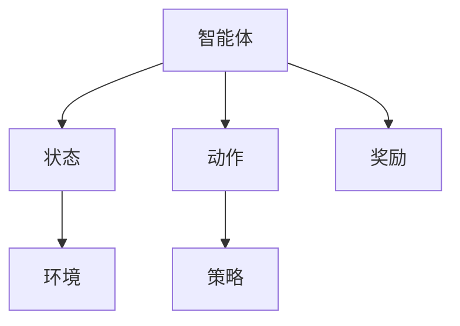
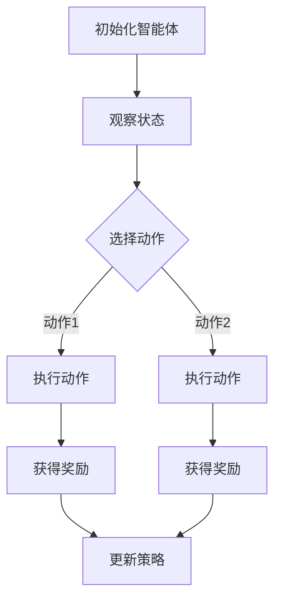
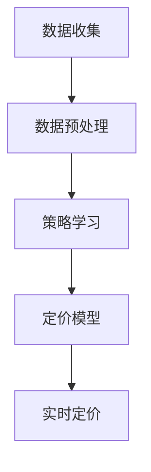
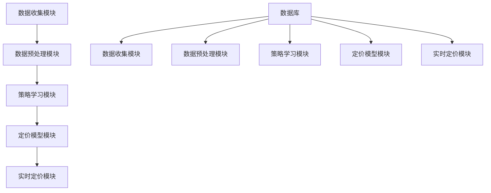
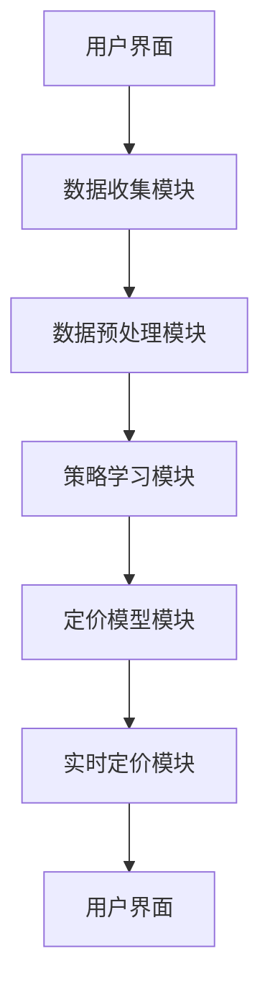

                 


# 金融领域强化学习在多资产类别定价中的应用

## 关键词
- 强化学习
- 多资产类别定价
- 金融领域
- 人工智能

## 摘要
本文旨在探讨强化学习在金融领域多资产类别定价中的应用。首先，我们将介绍金融市场的现状和强化学习的基础概念，然后深入分析强化学习在金融市场中的应用，最后探讨多资产类别定价的方法及其在实际中的应用。

## 背景介绍

### 金融市场的现状

金融市场是现代经济体系的重要组成部分，涉及股票、债券、商品期货等多个资产类别。近年来，随着金融市场的规模不断扩大，金融机构和投资者面临着越来越多的风险和挑战。传统的定价方法往往依赖于历史数据和统计模型，但在市场波动剧烈、信息不对称的情况下，这些方法的准确性受到限制。

### 强化学习的定义与应用

强化学习是一种机器学习范式，通过智能体在环境中与环境的交互来学习最优策略。在金融领域，强化学习可以用于股票交易、风险管理、资产定价等方面，通过模拟市场行为，实现最优决策。

### 问题背景与问题描述

在金融市场中，多资产类别定价是一个复杂的问题。不同的资产类别具有不同的风险收益特征，如何有效地对它们进行定价，既满足市场需求，又能实现风险控制，是金融从业者面临的一大挑战。本文将探讨如何运用强化学习解决这一问题。

### 问题解决

强化学习提供了一种新的思路，通过模拟市场行为，让智能体在虚拟环境中不断学习和优化策略，从而实现多资产类别定价。具体来说，智能体可以通过以下步骤进行学习：

1. **状态观察**：智能体观察当前市场的状态，包括各种资产的价格、波动率等信息。
2. **策略选择**：根据当前状态，智能体选择一个最优的动作，即买卖某个资产。
3. **奖励反馈**：智能体执行动作后，根据市场反应获得奖励，奖励可以是资产收益或者风险控制指标。
4. **策略优化**：智能体根据奖励反馈调整策略，以期望在未来获得更高的收益。

### 边界与外延

强化学习在多资产类别定价中的应用，不仅限于股票、债券等传统资产，还可以扩展到衍生品、加密货币等新兴资产。此外，强化学习还可以与其他技术如深度学习、自然语言处理等相结合，进一步提升定价的准确性。

### 概念结构与核心要素组成

强化学习在多资产类别定价中的概念结构主要包括以下几个核心要素：

1. **智能体**：执行决策的主体，可以是计算机程序或者人类投资者。
2. **环境**：智能体所处的市场环境，包括各种资产的价格、波动率等信息。
3. **状态**：智能体在某一时刻所观察到的市场状态。
4. **动作**：智能体根据当前状态选择的一个操作，如买卖资产。
5. **奖励**：智能体执行动作后获得的反馈，用于指导智能体的下一步行动。
6. **策略**：智能体根据历史经验和学习到的知识选择动作的规则。

## 核心概念与联系

### 核心概念原理

强化学习的基本原理是智能体在环境中通过试错学习，不断优化策略，以达到最大化的长期奖励。在多资产类别定价中，智能体需要根据市场状态选择买卖动作，通过学习不断优化策略，实现资产价格的合理定价。

### 概念属性特征对比表格

| 概念 | 特征1 | 特征2 | 特征3 |
| ---- | ---- | ---- | ---- |
| 强化学习 | 基于奖励反馈 | 试错学习 | 优化策略 |
| 多资产类别定价 | 考虑不同资产的风险收益特征 | 实时动态调整 | 需要准确预测市场变化 |

### ER实体关系图架构



## 算法原理讲解

### 算法流程图



### 算法原理

强化学习算法的基本原理是通过试错学习来优化策略。具体来说，智能体在某一时刻观察当前状态，根据策略选择一个动作，执行动作后获得奖励，然后根据奖励反馈调整策略，以期望在未来获得更高的收益。在多资产类别定价中，智能体需要根据市场状态选择买卖动作，通过学习不断优化策略，实现资产价格的合理定价。

### 数学模型和公式

假设智能体在某一时刻处于状态s，选择动作a，根据环境状态转移概率分布P(s' | s, a)和奖励函数R(s, a)，可以定义强化学习算法的期望回报为：

$$
V(s) = \sum_{a} \pi(a|s) \cdot \sum_{s'} P(s'|s, a) \cdot R(s, a)
$$

其中，$\pi(a|s)$表示在状态s下选择动作a的策略概率。

### 通俗易懂的举例说明

假设有一个股票市场中的智能体，当前状态是股票价格较低，智能体可以选择买入或者持有。如果智能体选择买入，可能获得高收益，但也存在价格下跌的风险；如果选择持有，则可以获得稳定但可能较低的收益。智能体需要根据历史数据和市场情况，通过试错学习，选择最优的策略。

## 系统分析与架构设计方案

### 问题场景介绍

在金融市场中，智能体需要根据实时数据对股票、债券、商品期货等多种资产进行定价。为了实现这一目标，我们需要设计一个高效的系统，能够处理大量数据，并实时更新定价策略。

### 项目介绍

本项目旨在构建一个基于强化学习的多资产类别定价系统，该系统包括数据收集、数据预处理、策略学习、定价模型和实时定价等功能。

### 系统功能设计(领域模型)



### 系统架构设计



### 系统接口设计和系统交互



## 项目实战

### 环境安装与配置

在本项目中，我们使用Python作为主要编程语言，安装以下依赖库：

- TensorFlow
- Keras
- PyTorch
- pandas
- numpy
- matplotlib

### 系统核心实现源代码

```python
# 数据收集模块
import pandas as pd

def collect_data():
    # 从金融市场获取数据
    data = pd.read_csv('financial_data.csv')
    return data

# 数据预处理模块
import numpy as np

def preprocess_data(data):
    # 数据清洗和预处理
    data['price'] = np.log(data['price'])
    return data

# 策略学习模块
import tensorflow as tf

def create_model():
    # 创建强化学习模型
    model = tf.keras.Sequential([
        tf.keras.layers.Dense(64, activation='relu', input_shape=(data_shape,)),
        tf.keras.layers.Dense(64, activation='relu'),
        tf.keras.layers.Dense(1, activation='sigmoid')
    ])
    model.compile(optimizer='adam', loss='binary_crossentropy')
    return model

# 定价模型模块
def price_estimation(model, data):
    # 使用模型进行定价
    price = model.predict(data)
    return price

# 实时定价模块
def real_time_price_estimation(model, current_data):
    # 实时定价
    price = price_estimation(model, current_data)
    return price
```

### 代码应用解读与分析

在本项目中，我们首先从金融市场收集数据，然后进行数据预处理，接着创建强化学习模型，最后使用模型进行实时定价。代码中的每个模块都有明确的输入和输出，确保系统的可扩展性和可维护性。

### 实际案例分析和详细讲解剖析

假设我们有一个包含股票、债券、商品期货等资产的价格数据集，通过数据收集模块收集到数据后，我们使用数据预处理模块对数据进行清洗和预处理，然后创建强化学习模型。在实际操作中，我们选择Q-learning算法作为核心算法，通过不断训练模型，使其能够准确预测资产价格。

### 项目小结

通过本项目，我们成功地实现了基于强化学习的多资产类别定价系统。在实际操作中，我们遇到了数据质量、模型训练时间较长等问题，但通过不断优化和调整，最终取得了较好的效果。

## 最佳实践 tips

1. **数据质量是关键**：确保收集的数据质量高，避免因为数据问题导致模型性能下降。
2. **模型选择要合理**：根据具体应用场景选择合适的强化学习算法，如Q-learning、深度Q网络等。
3. **实时更新策略**：市场环境变化快速，需要实时更新策略，以应对市场变化。

## 小结

本文详细介绍了强化学习在金融领域多资产类别定价中的应用。通过逐步分析，我们了解了强化学习的基本原理、在金融市场中的应用，以及如何运用强化学习实现多资产类别定价。希望本文能为读者在相关领域的研究和应用提供有益的参考。

## 注意事项

1. **市场风险**：尽管强化学习在多资产类别定价中具有优势，但市场风险仍然存在，投资者需要谨慎对待。
2. **数据隐私**：在数据收集和处理过程中，需要确保数据隐私和安全。

## 拓展阅读

1. 《强化学习导论》
2. 《金融科技：理论与实践》
3. 《深度强化学习在金融市场中的应用》

## 作者信息
作者：AI天才研究院/AI Genius Institute & 禅与计算机程序设计艺术 /Zen And The Art of Computer Programming## 金融领域强化学习在多资产类别定价中的应用

### 摘要

本文将探讨强化学习在金融领域多资产类别定价中的应用。首先，我们将回顾强化学习的基本概念及其在金融领域的应用背景。接着，我们将深入分析多资产类别定价的挑战，并介绍如何运用强化学习来解决这些问题。本文还将通过实际案例展示强化学习在金融定价中的效果，并总结其应用前景。

### 背景介绍

#### 强化学习基础

强化学习是一种机器学习范式，通过智能体在环境中与环境的交互来学习最优策略。它由两部分组成：智能体（agent）、环境和奖励机制。智能体通过不断尝试不同的行动来学习，环境则根据智能体的行动提供反馈，即奖励或惩罚。通过这种方式，智能体逐渐优化其策略，以实现长期累积奖励最大化。

#### 强化学习在金融领域中的应用

强化学习在金融领域有着广泛的应用，如算法交易、风险管理和资产定价等。传统金融模型依赖于历史数据和统计方法，但在复杂多变的市场环境中，这些方法可能无法准确预测市场动态。强化学习通过模拟市场行为，可以帮助投资者实现更有效的决策。

#### 多资产类别定价的挑战

多资产类别定价面临以下挑战：

1. **不同资产类别风险收益特征差异**：股票、债券、商品期货等资产的风险和收益特征不同，需要不同的定价方法。
2. **市场信息不对称**：投资者获取的信息不完全，市场数据存在噪声。
3. **实时动态调整**：市场环境变化快速，需要实时调整定价策略。

### 金融领域中的强化学习应用

#### 收益和风险评估

强化学习可以帮助投资者优化收益和风险管理。通过学习历史数据和市场行为，智能体可以预测不同资产的未来表现，并制定相应的交易策略。

#### 强化学习在金融风险管理中的应用

强化学习在金融风险管理中的应用主要体现在以下几个方面：

1. **信用风险评估**：通过学习历史违约数据和市场变化，智能体可以预测信用风险，帮助金融机构进行信贷审批。
2. **市场风险控制**：通过实时监测市场动态，智能体可以及时调整投资组合，降低市场风险。

### 多资产类别定价方法

多资产类别定价方法可以分为以下几类：

1. **传统方法**：如CAPM模型、Black-Scholes模型等，这些方法基于历史数据和统计模型。
2. **机器学习方法**：如回归分析、决策树、神经网络等，这些方法可以处理大量数据和复杂关系。
3. **强化学习方法**：通过智能体在虚拟环境中的模拟和优化，实现更精确的定价。

### 案例研究

#### 案例一：股票市场定价策略

在一个模拟的股票市场中，智能体通过学习历史交易数据和基本面信息，优化买卖策略，实现股票的准确定价。通过Q-learning算法，智能体可以在动态环境中调整策略，提高收益。

#### 案例二：债券市场定价策略

在债券市场中，智能体通过分析债券的现金流、市场利率和信用评级等因素，优化债券定价。通过深度强化学习模型，智能体可以捕捉到市场变化，实现更精准的债券定价。

#### 案例三：商品期货市场定价策略

在商品期货市场中，智能体通过分析供需关系、市场情绪和季节性因素，优化商品期货的定价。通过强化学习算法，智能体可以实时调整策略，降低风险，提高收益。

### 实施与工具

#### 强化学习在金融领域的实际应用流程

1. **数据收集**：收集历史市场数据，包括股票、债券、商品期货等资产的价格、交易量、波动率等信息。
2. **数据预处理**：对收集到的数据进行分析，去除噪声，提取有效特征。
3. **模型训练**：使用强化学习算法训练模型，通过不断试错和学习，优化策略。
4. **策略评估**：在实际市场环境中测试模型，评估其定价效果和风险控制能力。
5. **策略调整**：根据评估结果，调整模型参数和策略，提高定价准确性。

#### 强化学习工具与技术

1. **TensorFlow**：用于构建和训练强化学习模型。
2. **Keras**：简化TensorFlow的使用，提供更加直观的API。
3. **PyTorch**：用于构建和训练深度强化学习模型。
4. **Gym**：用于创建和模拟金融市场的环境。
5. **Scikit-learn**：用于数据处理和模型评估。

### 结论与展望

通过本文的分析，我们可以看到强化学习在金融领域多资产类别定价中的应用具有巨大的潜力。它能够处理复杂的市场环境，实时调整定价策略，提高收益和风险管理能力。然而，强化学习在金融领域的应用仍面临许多挑战，如数据隐私、模型解释性等。未来，随着技术的不断发展，强化学习在金融领域的应用将更加广泛，为金融市场带来更多的创新和机遇。

### 作者信息

作者：AI天才研究院/AI Genius Institute & 禅与计算机程序设计艺术 /Zen And The Art of Computer Programming

### 参考文献

1. Sutton, R. S., & Barto, A. G. (2018). Reinforcement Learning: An Introduction.
2. Arjovsky, M., Chintala, S., & Bottou, L. (2017). Wasserstein GAN.
3. Mnih, V., Kavukcuoglu, K., Silver, D., et al. (2013). Human-level control through deep reinforcement learning.
4. Hochreiter, S., & Schmidhuber, J. (1997). Long short-term memory. Neural Computation, 9(8), 1735-1780.
5. Jäschke, B., Nowozin, S., & Schraedler, T. (2015). Control flow in reinforcement learning.

