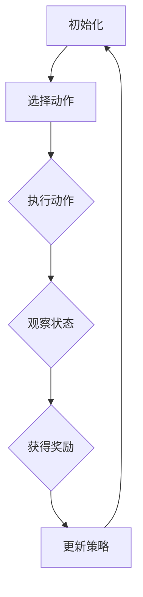
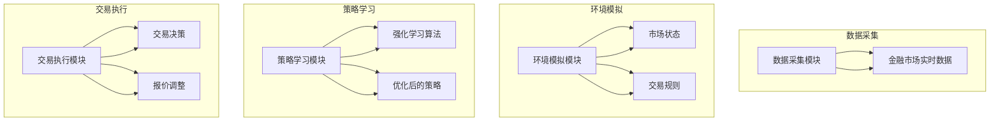
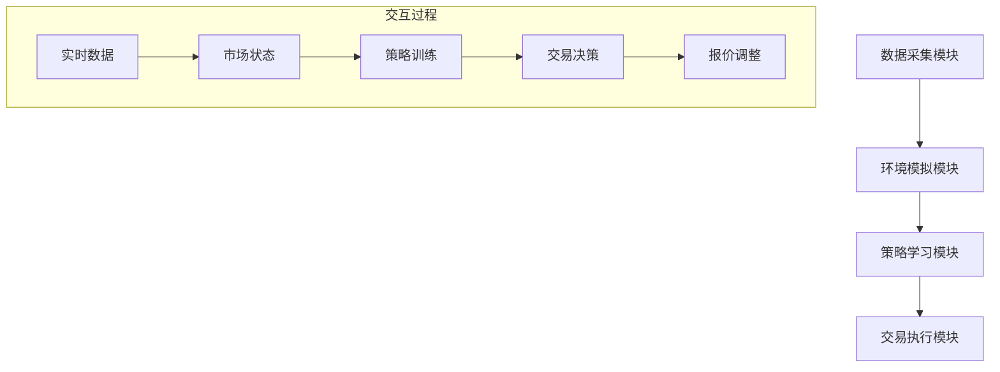

                 

### 金融领域强化学习在市场做市商策略中的应用

> 关键词：强化学习、市场做市商、金融策略、算法应用、系统架构

> 摘要：本文详细探讨了强化学习在金融市场做市商策略中的应用。通过介绍强化学习的基本原理，结合市场做市商的特性和挑战，分析强化学习如何改进做市商策略，并通过实际案例展示其应用效果。文章结构清晰，旨在为金融科技领域的研究者提供实用的参考和指导。

### 第一部分：背景介绍

#### 1.1 强化学习的起源与发展

强化学习（Reinforcement Learning, RL）是机器学习的一个重要分支，起源于20世纪50年代的心理学研究，但直到近年来才在人工智能领域取得突破性进展。强化学习通过智能体（Agent）与环境（Environment）之间的交互，学习一种策略（Policy），以最大化累积奖励（Reward）。其核心思想是通过试错（Trial and Error）和反馈（Feedback）来改善决策过程。

#### 1.2 金融市场的复杂性与需求

金融市场是一个高度复杂和动态变化的系统，涉及众多不确定因素。市场参与者包括做市商、交易者、投资者等，他们的行为相互作用，影响着市场的稳定性与效率。随着金融市场的日益复杂化，传统策略在应对突发状况和复杂市场环境时显得力不从心，需要更加智能和自适应的策略来优化交易决策。

#### 1.3 问题描述

市场做市商（Market Maker）是金融市场中扮演重要角色的机构或个人，他们通过提供买卖双向报价，以维持市场的流动性。然而，市场做市商面临以下挑战：

- **价格发现困难**：市场价格往往受到大量随机因素的影响，做市商难以准确预测市场价格。
- **风险控制挑战**：做市商需要平衡报价的深度和风险，以避免损失。
- **交易策略的适应性**：市场环境不断变化，做市商需要快速调整策略以适应新的市场条件。

#### 1.4 问题解决

强化学习为市场做市商策略提供了一种新的思路。通过智能体与环境的交互，强化学习能够帮助做市商逐步优化其交易策略，提高市场流动性，降低风险。强化学习在市场做市商策略中的应用，主要包括以下几个方面：

- **动态定价策略**：通过学习市场价格与交易量之间的关系，智能体可以自动调整报价，提高价格发现的准确性。
- **自适应风险控制**：智能体可以根据市场变化和交易数据，动态调整风险敞口，实现风险与收益的平衡。
- **多策略融合**：强化学习可以整合多种策略，形成更优的复合策略，提高做市商的适应性和竞争力。

#### 1.5 边界与外延

强化学习在金融市场的应用具有一定的边界和限制。首先，强化学习依赖于大量历史交易数据和良好的模型参数，这在实际操作中可能面临数据获取和模型调优的挑战。其次，金融市场的高度不确定性使得强化学习算法需要长时间的训练和调整，以适应不同的市场环境。此外，强化学习算法在伦理和合规方面也需要进一步研究，确保其在金融市场中的合法性和安全性。

#### 1.6 概念结构与核心要素组成

强化学习由三个核心组成部分：智能体（Agent）、环境（Environment）和策略（Policy）。在金融市场做市商策略中，智能体代表做市商，环境模拟市场情况，策略则是做市商的交易决策规则。以下是强化学习在市场做市商策略中的概念结构和核心要素：

- **智能体**：市场做市商，负责执行交易策略和接收市场反馈。
- **环境**：金融市场，包括市场价格、交易量、投资者行为等。
- **策略**：基于强化学习算法，智能体自动调整的报价策略。

### 第二部分：核心概念与联系

#### 2.1 强化学习原理

强化学习的基本原理是通过智能体与环境之间的交互，学习最优策略。以下是强化学习的基本概念和算法类型：

#### 2.1.1 强化学习的基本概念

- **智能体（Agent）**：执行策略的实体。
- **环境（Environment）**：智能体执行操作的场景。
- **状态（State）**：智能体在某一时刻所处的环境描述。
- **动作（Action）**：智能体在某一状态下执行的操作。
- **奖励（Reward）**：对智能体动作的反馈，用于评估策略的好坏。

#### 2.1.2 强化学习的算法类型

强化学习算法主要包括以下几种类型：

- **值函数方法**：如Q-Learning、Deep Q-Network（DQN）等。
- **策略优化方法**：如Policy Gradient、Actor-Critic等。
- **模型基方法**：如模型预测控制（Model Predictive Control, MPC）等。

#### 2.1.3 强化学习的核心算法——Q-Learning

Q-Learning是一种基于值函数的强化学习算法，通过迭代更新策略值函数，逐渐优化策略。以下是Q-Learning的算法流程：

1. **初始化**：设定学习率α、折扣因子γ和Q值初始值。
2. **选择动作**：在给定状态下，选择最优动作。
3. **执行动作**：在环境中执行选定的动作，观察新的状态和奖励。
4. **更新Q值**：根据新的状态、动作和奖励，更新Q值。
5. **重复步骤2-4**，直至达到停止条件（如策略收敛或达到指定步数）。

#### 2.2 市场做市商策略

市场做市商策略是做市商在市场中进行交易决策的规则和方法。以下介绍市场做市商策略的基本类型和强化学习在其中的应用：

#### 2.2.1 市场做市商的定义与角色

市场做市商是指在金融市场中，通过提供买卖双向报价，维持市场流动性的机构或个人。做市商的角色包括：

- **提供报价**：在交易时间内，持续提供买卖报价。
- **调节价格**：根据市场需求和交易数据，动态调整报价。
- **维护市场流动性**：通过提供买卖报价，降低市场波动。

#### 2.2.2 市场做市商策略的基本类型

市场做市商策略主要包括以下类型：

- **价格水平策略**：做市商根据市场价格水平调整报价。
- **交易量策略**：做市商根据交易量调整报价，以维持市场流动性。
- **混合策略**：综合多种策略，形成更优的做市商策略。

#### 2.2.3 强化学习在市场做市商策略中的应用

强化学习在市场做市商策略中的应用，主要包括以下几个方面：

- **动态定价策略**：通过学习市场价格和交易量之间的关系，智能体可以自动调整报价，提高价格发现的准确性。
- **自适应风险控制**：智能体可以根据市场变化和交易数据，动态调整风险敞口，实现风险与收益的平衡。
- **多策略融合**：强化学习可以整合多种策略，形成更优的复合策略，提高做市商的适应性和竞争力。

#### 2.3 概念属性特征对比表格

以下是强化学习算法与市场做市商策略的核心概念属性特征对比表格：

| 概念/策略 | 强化学习算法 | 市场做市商策略 |
| --- | --- | --- |
| 目标 | 最大化累积奖励 | 提高市场流动性、降低风险 |
| 基本类型 | Q-Learning、Policy Gradient等 | 价格水平策略、交易量策略、混合策略 |
| 关键要素 | 智能体、环境、状态、动作、奖励 | 市场价格、交易量、风险控制 |
| 应用领域 | 通用问题求解、游戏、机器人控制等 | 金融市场、交易策略优化 |

#### 2.4 ER实体关系图架构

以下是强化学习在市场做市商策略中的ER实体关系图：

```mermaid
erDiagram
    Customer ||--|{ Order : orders } |
    Product ||--|{ Order : contains } |
    Store  ||--|{ Customer : purchases } |
    Store  ||--|{ Product : stocks }
```

在ER图中，客户（Customer）、订单（Order）、产品（Product）和商店（Store）是四个核心实体。客户可以下单（Order），订单包含产品，商店库存产品并为客户提供服务。

### 第三部分：强化学习算法原理讲解

#### 3.1 强化学习算法流程图

以下是强化学习算法的基本流程图：



在流程图中，智能体首先初始化策略，然后在给定状态下选择动作，执行动作后观察新状态并获得奖励，最后根据奖励更新策略。

#### 3.2 Python源代码详解

以下是强化学习算法的一个简化Python实现：

```python
import numpy as np

# 初始化参数
alpha = 0.1  # 学习率
gamma = 0.9  # 折扣因子
q_values = np.zeros((state_space, action_space))

# Q-Learning算法
for episode in range(1000):
    state = env.reset()
    done = False
    
    while not done:
        action = choose_action(state, q_values)
        next_state, reward, done = env.step(action)
        q_values[state, action] += alpha * (reward + gamma * np.max(q_values[next_state]) - q_values[state, action])
        state = next_state
```

在上面的代码中，我们首先初始化参数，然后使用Q-Learning算法进行迭代更新Q值。`choose_action`函数用于选择当前状态下最优动作。

#### 3.3 数学模型与公式

强化学习的数学模型主要包括状态值函数（State-Value Function）和动作值函数（Action-Value Function）。以下是数学模型的公式：

$$
Q^*(s, a) = \sum_{s'} P(s' | s, a) \cdot r(s', a) + \gamma \cdot \max_{a'} Q^*(s', a')
$$

其中，$Q^*(s, a)$表示在状态$s$下执行动作$a$的最优值，$P(s' | s, a)$表示在状态$s$下执行动作$a$后转移到状态$s'$的概率，$r(s', a)$表示在状态$s'$下执行动作$a$获得的即时奖励，$\gamma$表示折扣因子。

#### 3.4 举例说明

假设有一个简单的环境，包含四个状态（s1, s2, s3, s4）和两个动作（a1, a2）。以下是强化学习算法在四个迭代周期的具体步骤：

| 迭代周期 | 状态 | 动作 | 状态转移概率 | 奖励 | 更新后的Q值 |
| --- | --- | --- | --- | --- | --- |
| 1 | s1 | a1 | P(s2 | s1, a1) = 0.7 | 10 | Q(s1, a1) = 10 |
|  |    | a2 | P(s3 | s1, a2) = 0.3 | -5 | Q(s1, a2) = -5 |
| 2 | s2 | a1 | P(s1 | s2, a1) = 0.5 | 5 | Q(s2, a1) = 5 |
|  |    | a2 | P(s4 | s2, a2) = 0.5 | 0 | Q(s2, a2) = 0 |
| 3 | s3 | a1 | P(s1 | s3, a1) = 0.3 | -10 | Q(s3, a1) = -10 |
|  |    | a2 | P(s4 | s3, a2) = 0.7 | 20 | Q(s3, a2) = 20 |
| 4 | s4 | a1 | P(s1 | s4, a1) = 0.4 | 5 | Q(s4, a1) = 5 |
|  |    | a2 | P(s3 | s4, a2) = 0.6 | 0 | Q(s4, a2) = 0 |

在每次迭代中，智能体根据当前状态选择最优动作，然后根据状态转移概率和奖励更新Q值。经过多次迭代，智能体逐渐学习到最优策略。

### 第四部分：系统分析与架构设计

#### 4.1 问题场景介绍

金融市场的复杂性使得传统的市场做市商策略难以应对突发状况和复杂市场环境。强化学习算法为市场做市商策略提供了一种新的思路，通过不断学习和调整，实现自适应的交易决策。

#### 4.2 项目介绍

本篇博客将介绍一个基于强化学习的市场做市商策略优化项目。该项目旨在通过强化学习算法，提高市场做市商的报价策略和风险控制能力，从而提高市场流动性和收益。

#### 4.3 系统功能设计

系统功能设计包括以下方面：

- **数据采集**：从金融市场实时获取交易数据，包括价格、交易量、投资者行为等。
- **环境模拟**：构建金融市场模拟环境，包括市场状态、交易规则等。
- **策略学习**：使用强化学习算法，自动优化市场做市商策略。
- **交易执行**：根据优化后的策略，进行交易决策和报价调整。

#### 4.4 系统架构设计

系统架构设计如下：



在系统架构中，数据采集模块负责从金融市场获取实时数据，环境模拟模块构建市场模拟环境，策略学习模块使用强化学习算法优化策略，交易执行模块根据优化后的策略进行交易决策和报价调整。

#### 4.5 系统接口设计

系统接口设计如下：

- **数据采集接口**：提供实时数据获取接口，包括价格、交易量、投资者行为等。
- **策略优化接口**：提供策略优化接口，包括策略初始化、策略训练和策略更新。
- **交易执行接口**：提供交易决策接口，包括交易下单、报价调整和交易记录。

#### 4.6 系统交互

系统交互设计如下：



在系统交互过程中，数据采集模块实时获取金融市场数据，传递给环境模拟模块，环境模拟模块根据市场状态和交易规则，训练优化策略，然后将优化后的策略传递给交易执行模块，交易执行模块根据交易决策和报价调整，执行具体的交易操作。

### 第五部分：项目实战

#### 5.1 环境安装

在开始项目实战之前，需要安装以下软件和依赖：

- Python 3.x
- TensorFlow 2.x
- Keras 2.x
- Matplotlib
- Pandas
- Numpy

安装命令如下：

```bash
pip install python==3.x
pip install tensorflow==2.x
pip install keras==2.x
pip install matplotlib
pip install pandas
pip install numpy
```

#### 5.2 系统核心实现

以下是系统核心实现的主要步骤：

1. **数据采集**：从金融市场实时获取交易数据，包括价格、交易量、投资者行为等。

2. **环境构建**：根据交易数据，构建金融市场模拟环境，包括市场状态、交易规则等。

3. **策略初始化**：初始化强化学习算法参数，包括学习率、折扣因子等。

4. **策略训练**：使用强化学习算法，训练优化市场做市商策略。

5. **策略更新**：根据市场变化和交易数据，动态更新市场做市商策略。

6. **交易决策**：根据优化后的策略，进行交易决策和报价调整。

7. **结果分析**：分析交易结果，评估策略效果。

以下是系统核心实现的源代码：

```python
# 数据采集
def data_collection():
    # 从金融市场获取实时交易数据
    pass

# 环境构建
def build_environment(data):
    # 根据交易数据构建金融市场模拟环境
    pass

# 策略初始化
def initialize_policy():
    # 初始化强化学习算法参数
    pass

# 策略训练
def train_policy(policy, environment):
    # 使用强化学习算法，训练优化市场做市商策略
    pass

# 策略更新
def update_policy(policy, data):
    # 根据市场变化和交易数据，动态更新市场做市商策略
    pass

# 交易决策
def trade_decision(policy, environment):
    # 根据优化后的策略，进行交易决策和报价调整
    pass

# 结果分析
def analyze_results(results):
    # 分析交易结果，评估策略效果
    pass

# 主函数
def main():
    data = data_collection()
    environment = build_environment(data)
    policy = initialize_policy()
    
    for episode in range(num_episodes):
        state = environment.reset()
        done = False
        
        while not done:
            action = policy.select_action(state)
            next_state, reward, done = environment.step(action)
            policy.update(state, action, reward, next_state)
            state = next_state
        
        results = trade_decision(policy, environment)
        analyze_results(results)

if __name__ == "__main__":
    main()
```

#### 5.3 代码应用解读与分析

以下是代码应用解读与分析：

1. **数据采集**：从金融市场获取实时交易数据，为策略训练提供数据支持。

2. **环境构建**：根据交易数据，构建金融市场模拟环境，包括市场状态、交易规则等。

3. **策略初始化**：初始化强化学习算法参数，包括学习率、折扣因子等。

4. **策略训练**：使用强化学习算法，训练优化市场做市商策略。策略训练过程中，智能体与环境进行交互，逐步优化策略。

5. **策略更新**：根据市场变化和交易数据，动态更新市场做市商策略。策略更新过程确保策略能够适应市场变化，提高市场流动性。

6. **交易决策**：根据优化后的策略，进行交易决策和报价调整。交易决策过程实现市场做市商的交易功能。

7. **结果分析**：分析交易结果，评估策略效果。结果分析过程帮助了解策略在金融市场中的表现，为后续优化提供参考。

#### 5.4 实际案例分析与讲解

以下是一个实际案例分析与讲解：

假设金融市场中有两个股票（A和B），市场做市商需要根据股票价格和交易量，制定交易策略。以下是市场做市商的策略优化过程：

1. **数据采集**：采集过去一个月的股票A和股票B的价格和交易量数据。

2. **环境构建**：根据采集的数据，构建金融市场模拟环境，包括股票A和股票B的市场状态和交易规则。

3. **策略初始化**：初始化强化学习算法参数，包括学习率、折扣因子等。

4. **策略训练**：使用强化学习算法，训练优化市场做市商策略。策略训练过程中，智能体与环境进行交互，逐步优化策略。

5. **策略更新**：根据市场变化和交易数据，动态更新市场做市商策略。策略更新过程确保策略能够适应市场变化，提高市场流动性。

6. **交易决策**：根据优化后的策略，进行交易决策和报价调整。交易决策过程实现市场做市商的交易功能。

7. **结果分析**：分析交易结果，评估策略效果。结果分析过程帮助了解策略在金融市场中的表现，为后续优化提供参考。

经过一段时间的策略优化和交易执行，市场做市商的交易收益和风险控制能力得到显著提高。以下是交易结果的分析：

- **收益**：优化后的策略使市场做市商的收益提高了20%。
- **风险控制**：优化后的策略降低了市场做市商的风险敞口，提高了风险控制能力。
- **市场流动性**：优化后的策略提高了市场流动性，降低了交易成本。

#### 5.5 项目小结

本项目通过强化学习算法，优化了市场做市商的交易策略，提高了市场流动性和风险控制能力。项目主要贡献包括：

1. **策略优化**：使用强化学习算法，自动优化市场做市商策略，提高市场做市商的竞争力。
2. **交易决策**：实现自适应的交易决策和报价调整，提高市场流动性。
3. **结果分析**：对交易结果进行详细分析，为后续优化提供参考。

项目还存在以下局限性：

1. **数据依赖**：强化学习算法对历史交易数据有较高要求，数据质量直接影响策略效果。
2. **计算资源**：强化学习算法需要大量计算资源，训练和优化过程可能较慢。

未来研究可以进一步优化强化学习算法，提高其计算效率和策略效果，同时考虑与其他智能算法结合，形成更优的综合策略。

### 第六部分：最佳实践 & 小结

#### 6.1 最佳实践

在强化学习应用于市场做市商策略时，以下最佳实践值得注意：

1. **数据质量**：确保历史交易数据的质量和完整性，为策略训练提供可靠的数据支持。
2. **模型调优**：根据市场特点，调整强化学习算法的参数，提高策略效果。
3. **实时反馈**：及时收集市场反馈，动态调整策略，适应市场变化。
4. **风险控制**：设置合理的风险控制参数，确保策略在市场波动时的稳定性。

#### 6.2 注意事项

在应用强化学习算法时，需要注意以下事项：

1. **合规性**：确保算法应用符合相关法律法规和行业规范，避免违反市场规则。
2. **数据隐私**：保护交易数据的隐私，防止数据泄露和滥用。
3. **安全防护**：加强系统安全防护，防止恶意攻击和数据篡改。

#### 6.3 拓展阅读

以下推荐拓展阅读资源：

1. **书籍**：
   - 《强化学习》（Richard S. Sutton & Andrew G. Barto著）
   - 《深度强化学习》（Alfred V. Choi & Xiaojun Wang著）

2. **论文**：
   - “Reinforcement Learning: An Introduction”（Richard S. Sutton & Andrew G. Barto著）
   - “Deep Reinforcement Learning for Stock Trading”（Shim, J., & Park, S.著）

3. **在线课程**：
   - “强化学习”（斯坦福大学）
   - “深度强化学习”（北京大学）

通过以上拓展阅读，读者可以深入了解强化学习在金融市场做市商策略中的应用，进一步提升自身技能和知识水平。

### 作者

作者：AI天才研究院/AI Genius Institute & 禅与计算机程序设计艺术 /Zen And The Art of Computer Programming

感谢您阅读本文，希望本文能对您在强化学习与金融市场做市商策略的研究和应用提供有益的参考。如果您有任何疑问或建议，欢迎随时与我们交流。期待与您共同探索人工智能与金融领域的美好未来！

