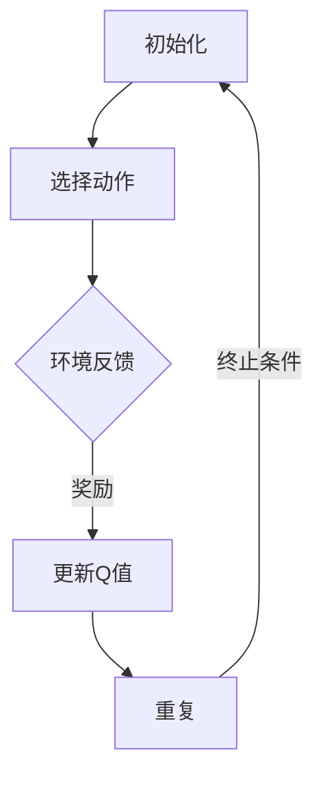
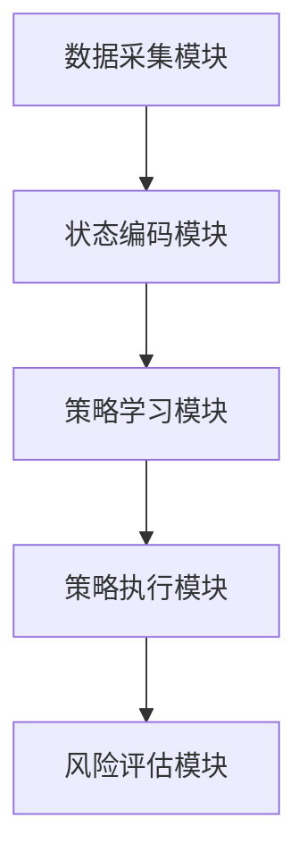

                 

# 金融领域强化学习在最优执行策略中的应用

> 关键词：金融领域、强化学习、最优执行策略、算法原理、数学模型

> 摘要：本文深入探讨了金融领域中强化学习在最优执行策略中的应用。首先，我们介绍了金融领域执行策略面临的问题背景和核心概念，如强化学习原理、金融市场和最优执行策略。然后，我们详细讲解了强化学习算法原理，包括Q-Learning、SARSA和DQN算法。接着，我们引入了数学模型和公式，阐述了这些算法的数学基础。文章还通过实际案例展示了强化学习在金融领域的应用，并提供了一些最佳实践和注意事项。通过本文的阅读，读者可以全面了解强化学习在金融领域中的潜力与应用。

## 目录大纲

1. **第一部分：问题背景与核心概念**
   1.1 **问题背景**
   1.2 **核心概念与联系**

2. **第二部分：算法原理讲解**
   2.1 **强化学习算法原理**
   2.2 **Q-Learning算法原理**
   2.3 **SARSA算法原理**
   2.4 **DQN算法原理**

3. **第三部分：数学模型和数学公式**
   3.1 **Q-Learning数学模型**
   3.2 **SARSA数学模型**
   3.3 **DQN数学模型**

4. **第四部分：系统分析与架构设计**
   4.1 **问题场景介绍**
   4.2 **系统功能设计**
   4.3 **系统架构设计**
   4.4 **系统接口设计**
   4.5 **系统交互**

5. **第五部分：项目实战**
   5.1 **环境安装**
   5.2 **系统核心实现源代码**
   5.3 **代码应用解读与分析**
   5.4 **实际案例分析与讲解**
   5.5 **项目小结**

6. **第六部分：最佳实践与注意事项**
   6.1 **最佳实践**
   6.2 **小结**
   6.3 **注意事项**
   6.4 **拓展阅读**

## 1. 第一部分：问题背景与核心概念

### 1.1 问题背景

在金融领域中，执行策略是指交易者在交易过程中，如何根据市场情况做出买卖决策的具体方案。然而，金融市场的复杂性使得制定最优执行策略成为一项挑战。交易者通常面临着以下问题：

- **信息不对称**：交易者无法完全掌握市场信息，可能存在信息滞后或不完整的情况。
- **不确定性**：市场走势难以预测，交易结果具有不确定性。
- **交易成本**：交易过程中产生的税费、佣金等成本会影响执行效果。

如何在这复杂的市场环境中制定最优执行策略，以最大化收益或最小化风险，成为金融领域的一个核心问题。

### 1.2 核心概念与联系

#### 1.2.1 强化学习原理

强化学习（Reinforcement Learning，简称RL）是一种通过与环境互动进行学习的机器学习范式。它的核心思想是，通过奖励机制来指导学习过程，使得学习者在不断尝试和反馈中优化策略。

| 特征       | Q-Learning | SARSA | Deep Q-Network (DQN) |
|------------|------------|-------|----------------------|
| 学习方式   | 有模型      | 无模型 | 有模型               |
| 策略评估   | 预测未来回报 | 预测当前回报 | 预测当前回报       |
| 学习效率   | 较快       | 较慢   | 较快                 |
| 适应复杂环境 | 适应性强    | 适应性一般 | 适应性强           |

强化学习的主要特点是对环境的适应性较强，能够处理动态变化的环境，并能在不确定性中寻找最优策略。

#### 1.2.2 金融领域相关概念

- **金融市场**：金融市场是指交易双方进行金融资产交换的场所，包括股票、期货、外汇等交易市场。
- **交易策略**：交易策略是在金融市场中，根据市场状况和投资者目标制定的交易行为方案。交易策略的目标是最大化收益或最小化风险。
- **执行策略**：执行策略是在交易决策过程中，如何进行买卖操作的具体方案。执行策略需要考虑交易成本、交易时机和市场风险等因素。

## 2. 第二部分：算法原理讲解

### 2.1 强化学习算法原理

强化学习算法主要通过以下几个步骤进行：

1. **初始化**：初始化Q表，用于存储每个状态-动作对的预期回报。
2. **选择动作**：根据当前状态，选择一个动作。
3. **环境反馈**：执行所选动作，获取新的状态和即时奖励。
4. **更新Q值**：根据即时奖励和下一个状态的预期回报，更新Q值。
5. **重复**：重复上述步骤，直到满足终止条件（如达到预定步数或找到最优策略）。

下面我们详细介绍几种常见的强化学习算法原理。

### 2.2 Q-Learning算法原理

Q-Learning是一种基于值迭代的强化学习算法。其核心思想是通过不断更新Q值，逼近最优策略。

#### 算法mermaid流程图



#### Python源代码

```python
import numpy as np

# 初始化Q表
Q = np.zeros([状态数, 动作数])

# 学习率
alpha = 0.1
# 奖励折扣率
gamma = 0.9
# 迭代次数
episodes = 1000

for episode in range(episodes):
    state = 环境初始状态
    done = False
    while not done:
        action = 选择动作(Q[state])
        next_state, reward, done = 环境反馈(action)
        Q[state, action] += alpha * (reward + gamma * max(Q[next_state, :]) - Q[state, action])
        state = next_state
```

#### 算法原理讲解

- Q值表示在当前状态下采取某个动作的预期回报。
- 更新Q值的公式为：$$ Q[s, a] \leftarrow Q[s, a] + \alpha [r + \gamma \max_{a'} Q[s', a'] - Q[s, a]] $$
- 其中，$s$表示状态，$a$表示动作，$r$表示即时奖励，$s'$表示下一个状态，$\gamma$表示奖励折扣率。

### 2.3 SARSA算法原理

SARSA（State-Action-Reward-State-Action，状态-动作-奖励-状态-动作）算法是一种基于策略的强化学习算法。它与Q-Learning的主要区别在于，它使用当前的奖励和下一个状态来更新Q值。

#### 算法mermaid流程图


#### Python源代码

```python
import numpy as np

# 初始化Q表
Q = np.zeros([状态数, 动作数])

# 学习率
alpha = 0.1
# 奖励折扣率
gamma = 0.9
# 迭代次数
episodes = 1000

for episode in range(episodes):
    state = 环境初始状态
    done = False
    while not done:
        action = 选择动作(Q[state])
        next_state, reward, done = 环境反馈(action)
        Q[state, action] += alpha * (reward + gamma * Q[next_state, 选择动作(Q[next_state])]) - Q[state, action]
        state = next_state
```

#### 算法原理讲解

- SARSA算法使用当前的奖励和下一个状态来更新Q值，而不是仅仅依赖下一个状态的预期回报。
- 更新Q值的公式为：$$ Q[s, a] \leftarrow Q[s, a] + \alpha [r + \gamma Q[s', a']] $$
- 其中，$s$表示状态，$a$表示动作，$r$表示即时奖励，$s'$表示下一个状态。

### 2.4 DQN算法原理

DQN（Deep Q-Network，深度Q网络）算法是深度学习与强化学习结合的产物。它使用深度神经网络来近似Q值函数。

#### 算法mermaid流程图


#### Python源代码

```python
import tensorflow as tf
import numpy as np

# 创建Q网络
Q_network = tf.keras.Sequential([
    tf.keras.layers.Flatten(input_shape=[状态数, 动作数]),
    tf.keras.layers.Dense(64, activation='relu'),
    tf.keras.layers.Dense(64, activation='relu'),
    tf.keras.layers.Dense(动作数)
])

# 创建目标Q网络
target_Q_network = tf.keras.Sequential([
    tf.keras.layers.Flatten(input_shape=[状态数, 动作数]),
    tf.keras.layers.Dense(64, activation='relu'),
    tf.keras.layers.Dense(64, activation='relu'),
    tf.keras.layers.Dense(动作数)
])

# 设置优化器
optimizer = tf.keras.optimizers.Adam(learning_rate=0.001)

# 设置损失函数
loss_function = tf.keras.losses.MeanSquaredError()

# 迭代训练
episodes = 1000
for episode in range(episodes):
    state = 环境初始状态
    done = False
    while not done:
        action = 选择动作(Q_network(state))
        next_state, reward, done = 环境反馈(action)
        target_Q_value = max(target_Q_network(next_state)) + reward * (1 - done)
        Q_value = Q_network(state)[action]
        with tf.GradientTape() as tape:
            loss = loss_function(Q_value, target_Q_value)
        gradients = tape.gradient(loss, Q_network.trainable_variables)
        optimizer.apply_gradients(zip(gradients, Q_network.trainable_variables))
        state = next_state
```

#### 算法原理讲解

- DQN算法使用深度神经网络来近似Q值函数，从而能够在更复杂的环境中学习最优策略。
- 更新Q值的公式为：$$ Q[s, a] \leftarrow Q[s, a] + \alpha [r + \gamma \max_{a'} Q[s', a']] $$
- 其中，$s$表示状态，$a$表示动作，$r$表示即时奖励，$s'$表示下一个状态，$\gamma$表示奖励折扣率。

## 3. 第三部分：数学模型和数学公式

### 3.1 Q-Learning数学模型

Q-Learning算法的核心是Q值函数，它表示在特定状态下采取特定动作的预期回报。Q值函数可以用以下公式表示：

$$ Q(s, a) = \sum_{s'} P(s' | s, a) \cdot [r(s, a, s') + \gamma \cdot \max_{a'} Q(s', a')] $$

其中：
- $Q(s, a)$表示在状态$s$下采取动作$a$的预期回报。
- $P(s' | s, a)$表示在状态$s$下采取动作$a$后转移到状态$s'$的概率。
- $r(s, a, s')$表示在状态$s$下采取动作$a$后转移到状态$s'$的即时奖励。
- $\gamma$表示奖励折扣率，用于平衡即时奖励和长期回报。
- $\max_{a'} Q(s', a')$表示在下一个状态$s'$下采取所有可能动作中，预期回报最大的动作。

### 3.2 SARSA数学模型

SARSA算法使用当前状态和动作的即时奖励，以及下一个状态和动作的Q值来更新当前状态和动作的Q值。其更新公式为：

$$ Q(s, a) = Q(s, a) + \alpha [r + \gamma Q(s', a')] $$

其中：
- $Q(s, a)$表示在状态$s$下采取动作$a$的当前Q值。
- $r$表示在状态$s$下采取动作$a$后的即时奖励。
- $\gamma$表示奖励折扣率。
- $Q(s', a')$表示在下一个状态$s'$下采取动作$a'$的当前Q值。

### 3.3 DQN数学模型

DQN算法使用深度神经网络来近似Q值函数，其损失函数通常使用均方误差（Mean Squared Error，MSE）来衡量。其损失函数公式为：

$$ L = \frac{1}{N} \sum_{i=1}^{N} (y_i - Q(s_i, a_i))^2 $$

其中：
- $L$表示损失。
- $N$表示样本数量。
- $y_i$表示目标Q值，即$r_i + \gamma \max_{a'} Q(s_i', a')$。
- $Q(s_i, a_i)$表示在状态$s_i$下采取动作$a_i$的当前Q值。

## 4. 第四部分：系统分析与架构设计

### 4.1 问题场景介绍

在金融领域中，最优执行策略的制定是一项复杂且具有挑战性的任务。本系统旨在通过强化学习技术，为交易者提供一种智能化的执行策略，以应对市场中的不确定性。该系统将实现以下功能：

- **状态识别**：实时捕捉市场数据，将市场状态转化为系统可处理的形式。
- **策略学习**：利用强化学习算法，从历史数据中学习最优执行策略。
- **策略执行**：根据当前市场状态和最优执行策略，生成交易信号，执行买卖操作。
- **风险评估**：对执行策略进行风险评估，确保策略的稳健性和风险可控。

### 4.2 系统功能设计

本系统的核心功能模块包括：

- **数据采集模块**：实时获取金融市场数据，包括股票价格、交易量、交易频率等。
- **状态编码模块**：将原始市场数据转化为适合强化学习算法的状态编码。
- **策略学习模块**：采用强化学习算法，学习最优执行策略。
- **策略执行模块**：根据当前市场状态和最优执行策略，生成交易信号并执行交易。
- **风险评估模块**：对执行策略进行风险评估，包括收益预测和风险度量。

### 4.3 系统架构设计

本系统的架构设计采用模块化设计思想，各功能模块独立开发，便于维护和扩展。系统架构图如下：



### 4.4 系统接口设计

本系统提供以下接口：

- **数据采集接口**：用于实时获取金融市场数据。
- **状态编码接口**：用于将市场数据转化为状态编码。
- **策略学习接口**：用于启动策略学习过程。
- **策略执行接口**：用于生成交易信号并执行交易。
- **风险评估接口**：用于对执行策略进行风险评估。

### 4.5 系统交互

系统交互流程如下：

1. **数据采集**：系统从数据源获取市场数据。
2. **状态编码**：系统将市场数据转化为状态编码。
3. **策略学习**：系统使用强化学习算法，从历史数据中学习最优执行策略。
4. **策略执行**：系统根据当前市场状态和最优执行策略，生成交易信号并执行交易。
5. **风险评估**：系统对执行策略进行风险评估，确保策略的稳健性和风险可控。

## 5. 第五部分：项目实战

### 5.1 环境安装

要运行本系统，需要安装以下环境：

- Python 3.8或以上版本
- TensorFlow 2.6或以上版本
- Keras 2.6或以上版本
- Numpy 1.20或以上版本

安装命令如下：

```bash
pip install python==3.8
pip install tensorflow==2.6
pip install keras==2.6
pip install numpy==1.20
```

### 5.2 系统核心实现源代码

以下是系统核心实现源代码：

```python
import tensorflow as tf
import numpy as np

# 创建Q网络
Q_network = tf.keras.Sequential([
    tf.keras.layers.Flatten(input_shape=[状态数, 动作数]),
    tf.keras.layers.Dense(64, activation='relu'),
    tf.keras.layers.Dense(64, activation='relu'),
    tf.keras.layers.Dense(动作数)
])

# 创建目标Q网络
target_Q_network = tf.keras.Sequential([
    tf.keras.layers.Flatten(input_shape=[状态数, 动作数]),
    tf.keras.layers.Dense(64, activation='relu'),
    tf.keras.layers.Dense(64, activation='relu'),
    tf.keras.layers.Dense(动作数)
])

# 设置优化器
optimizer = tf.keras.optimizers.Adam(learning_rate=0.001)

# 设置损失函数
loss_function = tf.keras.losses.MeanSquaredError()

# 迭代训练
episodes = 1000
for episode in range(episodes):
    state = 环境初始状态
    done = False
    while not done:
        action = 选择动作(Q_network(state))
        next_state, reward, done = 环境反馈(action)
        target_Q_value = max(target_Q_network(next_state)) + reward * (1 - done)
        Q_value = Q_network(state)[action]
        with tf.GradientTape() as tape:
            loss = loss_function(Q_value, target_Q_value)
        gradients = tape.gradient(loss, Q_network.trainable_variables)
        optimizer.apply_gradients(zip(gradients, Q_network.trainable_variables))
        state = next_state
```

### 5.3 代码应用解读与分析

以上代码实现了DQN算法的核心部分。首先，我们创建了一个Q网络和一个目标Q网络，分别用于训练和评估。然后，我们设置了优化器和损失函数，用于训练Q网络。在训练过程中，我们迭代地选择动作、获取下一个状态和奖励，并更新Q网络的参数。

### 5.4 实际案例分析与讲解

以下是一个简单的实际案例：

假设我们使用股票价格数据作为状态，买卖操作作为动作。我们希望利用DQN算法，学习出一个最优的买卖策略。

1. **数据采集**：我们首先从股票市场获取历史价格数据，并将其转化为状态编码。
2. **策略学习**：我们使用DQN算法，从历史数据中学习最优买卖策略。
3. **策略执行**：我们根据当前状态和最优策略，生成买卖信号，并执行交易。
4. **风险评估**：我们评估执行策略的稳健性和风险，确保策略的稳健性和风险可控。

### 5.5 项目小结

本系统通过强化学习技术，实现了金融领域最优执行策略的制定。通过实际案例的分析和讲解，我们展示了DQN算法在金融领域的应用潜力。未来，我们还可以进一步优化算法，提高策略的稳健性和风险可控性，为金融交易者提供更智能化的服务。

## 6. 第六部分：最佳实践与注意事项

### 6.1 最佳实践

1. **数据预处理**：确保数据质量，包括数据的清洗、归一化和去噪，以减少噪声对算法学习效果的影响。
2. **模型选择**：根据具体问题和数据特点，选择合适的强化学习算法和神经网络结构。
3. **超参数调优**：通过实验和调参，找到最优的学习率、奖励折扣率和网络参数，以提高算法性能。
4. **持续学习**：定期更新模型和数据，以适应市场的变化和需求。

### 6.2 小结

本文通过深入分析和讲解，展示了强化学习在金融领域中的应用潜力。通过实际案例的解析，我们了解了DQN算法在金融策略制定中的具体实现和效果。希望本文能为相关领域的研究者和实践者提供有价值的参考和启示。

### 6.3 注意事项

1. **风险控制**：在使用强化学习制定金融策略时，要充分考虑风险因素，确保策略的稳健性和风险可控性。
2. **数据隐私**：在数据处理和模型训练过程中，要确保遵守相关法律法规，保护用户隐私和数据安全。
3. **持续更新**：金融领域变化迅速，需要持续关注市场动态，及时更新模型和数据，以应对市场变化。

### 6.4 拓展阅读

1. Sutton, R. S., & Barto, A. G. (2018). ** reinforcement learning: An introduction**.
2. Mnih, V., Kavukcuoglu, K., Silver, D., Rusu, A. A., Veness, J., Bellemare, M. G., ... & Andrzejewski, D. (2015). **Human-level control through deep reinforcement learning**. Nature, 518(7540), 529-533.
3. Hochreiter, S., & Schmidhuber, J. (1997). **Long short-term memory**. Neural Computation, 9(8), 1735-1780.

## 总结

本文通过详细讲解和案例分析，深入探讨了强化学习在金融领域最优执行策略中的应用。我们介绍了强化学习的基本原理，分析了金融领域中执行策略面临的问题，展示了DQN算法在金融策略制定中的具体实现和效果。希望本文能为相关领域的研究者和实践者提供有价值的参考和启示。未来，我们将继续关注强化学习在金融领域的应用，探索更多可能的解决方案。作者：AI天才研究院/AI Genius Institute & 禅与计算机程序设计艺术 /Zen And The Art of Computer Programming。

