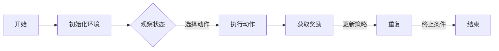
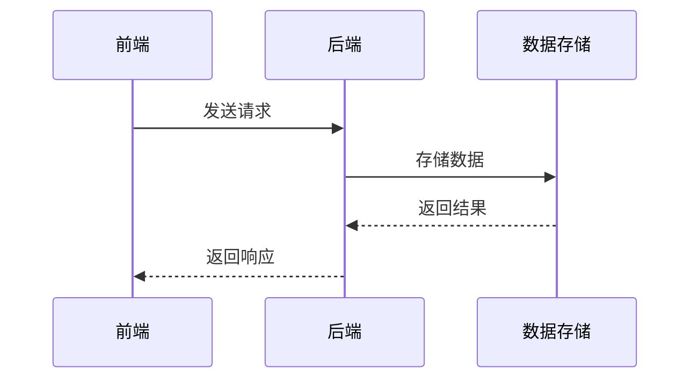
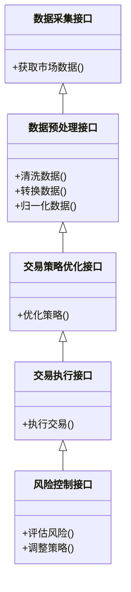
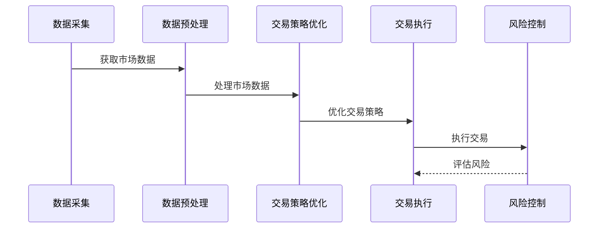

                 

### 1. 引言

#### 1.1 问题背景

在金融领域，算法交易（Algorithmic Trading）作为一种利用计算机程序自动进行交易的方法，已经成为金融市场中的重要组成部分。算法交易通过分析历史数据，利用复杂的数学模型和统计方法，预测市场趋势，并在毫秒级别内执行交易决策，以期获得稳定的收益。然而，随着市场环境的复杂多变，传统的算法交易方法逐渐暴露出了一些局限性，如依赖历史数据、适应性较差、易受市场波动影响等。

为了克服这些局限性，强化学习（Reinforcement Learning，RL）作为一种能够通过不断试错和奖励机制来学习优化策略的人工智能方法，逐渐引起了金融领域的关注。强化学习通过智能体（agent）在环境中通过行动（action）来获取状态（state）和奖励（reward），并通过学习和调整策略（policy）来最大化长期累积奖励。这种方法具有较好的适应性和自学习能力，使其在算法交易中的应用具有巨大的潜力。

#### 1.2 问题描述

本文将探讨强化学习在算法交易中的应用，旨在解决以下问题：

1. **策略优化**：如何利用强化学习算法来优化交易策略，使其在面对市场波动时能够保持稳定性和高效性？
2. **风险控制**：如何通过强化学习来评估和调整交易策略的风险水平，以避免因市场极端情况导致的巨大损失？
3. **自适应能力**：如何使交易策略具备快速适应市场变化的能力，以提高交易的鲁棒性和收益？
4. **模型解释性**：如何提高强化学习算法在算法交易中的应用的可解释性，使其决策过程更加透明和可信？

#### 1.3 问题解决

本文将按照以下步骤进行问题解决：

1. **强化学习基础理论**：首先，介绍强化学习的基本概念、数学模型和常见算法，为后续的应用提供理论基础。
2. **强化学习算法原理详解**：深入讲解强化学习中的Q-Learning算法和深度Q网络（DQN）算法，通过Python实现和数学模型，阐述其工作原理和优缺点。
3. **强化学习在金融领域的应用概述**：介绍强化学习在金融领域的潜在应用，分析其面临的挑战和机遇。
4. **强化学习在算法交易中的应用**：详细探讨强化学习在算法交易中的实现方法，包括数学模型、Python实现和实际案例。
5. **算法交易系统设计与实现**：介绍算法交易系统的设计，包括功能设计、架构设计、接口设计和系统交互。
6. **项目实战**：描述环境安装、核心实现源代码，并进行代码应用解读与分析、实际案例分析与详细讲解剖析。
7. **最佳实践与小结**：提供强化学习在算法交易中的最佳实践建议，对章节内容进行小结，并给出注意事项和拓展阅读。

#### 1.4 边界与外延

在本文中，我们将主要关注以下边界和范围：

1. **研究范围**：本文主要探讨强化学习在算法交易中的应用，不包括其他类型的交易策略和算法。
2. **技术范围**：本文主要介绍强化学习的基本算法和实现，不涉及深度学习、自然语言处理等其他人工智能技术。
3. **时间范围**：本文讨论的算法交易案例和分析主要基于近几年的市场数据，不包含历史数据。
4. **数据范围**：本文使用的数据集和案例主要来源于公开市场数据，不包括私人数据。

#### 1.5 概念结构与核心要素组成

本文的核心概念和结构如下：

1. **强化学习**：强化学习是一种通过试错和奖励机制来学习优化策略的人工智能方法。
2. **算法交易**：算法交易是一种利用计算机程序自动进行交易的方法，旨在通过数学模型和统计分析获取稳定收益。
3. **Q-Learning算法**：Q-Learning是一种基于值函数的强化学习算法，通过学习状态-动作值函数来优化策略。
4. **DQN算法**：DQN是一种基于深度学习的强化学习算法，通过神经网络来预测状态-动作值函数。
5. **系统设计与实现**：包括功能设计、架构设计、接口设计和系统交互，用于实现强化学习在算法交易中的应用。
6. **项目实战**：通过实际案例分析和代码实现，验证强化学习在算法交易中的应用效果。

### 1.6 核心概念与联系

#### 1.6.1 强化学习

强化学习是一种机器学习方法，它通过智能体（agent）在与环境（environment）的交互过程中，不断调整策略（policy），以实现最大化累积奖励（cumulative reward）的目标。智能体通过观察环境状态（state），选择合适的动作（action），并从环境中获得奖励（reward）。

**核心概念**：

- **状态（State）**：环境在某一时刻的状态。
- **动作（Action）**：智能体可以执行的动作。
- **奖励（Reward）**：智能体执行动作后从环境中获得的即时奖励。
- **策略（Policy）**：智能体决定动作的策略，通常表示为概率分布。
- **值函数（Value Function）**：用于评估状态或状态-动作对的预期奖励。
- **模型（Model）**：描述环境和状态转移概率的数学模型。

**概念属性特征对比表格**：

| 特征             | 状态（State） | 动作（Action） | 奖励（Reward） | 策略（Policy） | 值函数（Value Function） |
|------------------|--------------|---------------|---------------|----------------|-----------------------|
| 描述             | 环境的当前状态 | 智能体可执行的动作 | 智能体从环境获得的即时奖励 | 智能体决策的依据 | 评估状态或状态-动作对的预期奖励 |
| 对比             | 输入变量     | 输出变量      | 实际变量     | 预测变量      | 实际变量与预测变量对比 |
| 相关性           | 决策依据     | 执行结果      | 收益评估      | 决策优化      | 收益最大化          |

**ER实体关系图架构**：

```mermaid
erDiagram
  State ||--|{ Action }||>
  Action ||--|{ Reward }||>
  Action ||--|{ Policy }||>
  State ||--|{ Value Function }||>
  Model ||--|{ State }||>
  Model ||--|{ Action }||>
  Model ||--|{ Reward }||>
  Model ||--|{ Policy }||>
  Model ||--|{ Value Function }||>
```

#### 1.6.2 算法交易

算法交易是一种利用计算机程序自动执行交易策略的方法。它通过分析市场数据，识别交易机会，并在合适的时机执行交易。算法交易旨在通过自动化、高频和算法优化来提高交易效率和收益。

**核心概念**：

- **交易策略（Trading Strategy）**：描述交易行为和交易规则的算法模型。
- **市场数据（Market Data）**：包括价格、成交量、技术指标等。
- **交易机会（Trading Opportunity）**：通过数据分析识别出的潜在交易点。
- **交易执行（Trade Execution）**：在交易策略指导下，通过交易系统自动执行交易。

**概念属性特征对比表格**：

| 特征             | 交易策略（Trading Strategy） | 市场数据（Market Data） | 交易机会（Trading Opportunity） | 交易执行（Trade Execution） |
|------------------|---------------------------|------------------------|------------------------------|---------------------------|
| 描述             | 描述交易行为和规则的算法模型 | 描述市场信息的各种数据 | 识别潜在的买卖点              | 自动执行交易操作          |
| 对比             | 策略制定与优化           | 数据收集与处理        | 潜在机会识别与评估          | 执行策略与自动化操作      |
| 相关性           | 决策依据与优化目标       | 数据输入与处理依据    | 策略结果与市场反馈          | 策略执行与交易执行        |

**ER实体关系图架构**：

```mermaid
erDiagram
  Trading Strategy ||--|{ Market Data }||>
  Market Data ||--|{ Trading Opportunity }||>
  Trading Strategy ||--|{ Trade Execution }||>
```

#### 1.6.3 强化学习在算法交易中的应用

强化学习在算法交易中的应用主要通过以下方式实现：

1. **策略优化**：利用强化学习算法，通过试错和奖励机制，不断优化交易策略，使其在市场波动中保持稳定性和高效性。
2. **自适应能力**：强化学习算法能够通过不断学习市场数据，调整策略，使其具备快速适应市场变化的能力。
3. **风险控制**：通过强化学习算法，可以对交易策略进行风险评估和调整，以避免因市场极端情况导致的巨大损失。
4. **模型解释性**：强化学习算法的决策过程具有较好的可解释性，使其在算法交易中的应用更加透明和可信。

**概念属性特征对比表格**：

| 特征             | 策略优化 | 自适应能力 | 风险控制 | 模型解释性 |
|------------------|----------|------------|----------|------------|
| 描述             | 优化交易策略 | 适应市场变化 | 风险评估与调整 | 决策过程透明性 |
| 对比             | 策略改进与优化 | 策略适应性 | 风险控制力度 | 决策可解释性 |
| 相关性           | 策略与市场适应 | 市场波动与策略调整 | 风险评估与策略调整 | 决策过程透明性与策略优化 |

**ER实体关系图架构**：

```mermaid
erDiagram
  Reinforcement Learning ||--|{ Trading Strategy Optimization }||>
  Reinforcement Learning ||--|{ Adaptive Ability }||>
  Reinforcement Learning ||--|{ Risk Control }||>
  Reinforcement Learning ||--|{ Model Interpretability }||>
```

### 1.7 Mermaid 图表示例

为了更好地理解本文中涉及的概念和结构，我们使用Mermaid图表来展示ER实体关系图和算法流程图。

#### ER实体关系图示例

```mermaid
erDiagram
  A[强化学习] ||--|{ 策略优化 }|| B[算法交易]
  A ||--|{ 自适应能力 }|| C[风险控制]
  A ||--|{ 模型解释性 }|| D[交易策略]
```

#### 算法流程图示例



通过这些图表，我们可以直观地理解强化学习在算法交易中的应用，以及各个概念和算法之间的相互关系。

---

### 1.8 引入

在上一部分中，我们详细介绍了强化学习和算法交易的基本概念、核心要素以及它们之间的联系。强化学习作为一种通过不断试错和奖励机制来学习优化策略的人工智能方法，具有强大的自适应能力和模型解释性，使其在算法交易中具有广阔的应用前景。而算法交易作为一种利用计算机程序自动进行交易的方法，通过分析市场数据，识别交易机会，并在合适时机执行交易，旨在提高交易效率和收益。

在本篇技术博客中，我们将进一步深入探讨强化学习在算法交易中的应用。首先，我们将回顾强化学习的基本理论，包括其基本概念、数学模型和常见算法。接着，我们将详细讲解Q-Learning算法和深度Q网络（DQN）算法，并通过Python实现和数学模型，阐述其工作原理和优缺点。随后，我们将探讨强化学习在金融领域的应用，分析其面临的挑战和机遇。

在第三部分，我们将重点关注强化学习在算法交易中的应用，详细探讨其实现方法，包括数学模型、Python实现和实际案例。此外，我们还将介绍算法交易系统的设计，包括功能设计、架构设计、接口设计和系统交互。在项目实战部分，我们将描述环境安装、系统核心实现源代码，并进行代码应用解读与分析、实际案例分析与详细讲解剖析。

最后，在最佳实践与小结部分，我们将提供强化学习在算法交易中的最佳实践建议，对章节内容进行小结，并给出注意事项和拓展阅读。通过本篇博客，我们希望能够帮助读者深入理解强化学习在算法交易中的应用，并为其在金融领域的实践提供指导和参考。

---

### 2. 强化学习概述

强化学习（Reinforcement Learning，RL）是一种通过智能体（agent）在与环境（environment）的交互过程中，通过不断试错和奖励机制来学习优化策略的人工智能方法。其核心目标是使智能体能够在复杂环境中通过自主学习和调整策略，实现长期累积奖励的最大化。

#### 2.1 强化学习的基本概念

1. **状态（State）**：状态是描述环境在某一时刻的状态信息。在强化学习中，状态通常是一个多维向量，用于表示环境的当前情况。
2. **动作（Action）**：动作是智能体可以执行的操作。在强化学习中，动作通常是一个离散的集合，智能体根据当前状态选择一个动作。
3. **奖励（Reward）**：奖励是智能体执行动作后从环境中获得的即时奖励。奖励可以是正数、负数或零，用于评估智能体的动作效果。
4. **策略（Policy）**：策略是智能体在给定状态下选择动作的策略。策略通常表示为一个概率分布，用于指导智能体如何进行决策。
5. **值函数（Value Function）**：值函数用于评估状态或状态-动作对的预期奖励。在强化学习中，常用的值函数包括状态值函数（State-Value Function）和状态-动作值函数（State-Action Value Function）。
6. **模型（Model）**：模型是描述环境和状态转移概率的数学模型。通过模型，智能体可以预测未来状态的概率分布，从而优化其策略。

#### 2.2 强化学习的数学模型

强化学习的数学模型通常由以下几部分组成：

1. **状态空间（State Space）**：表示所有可能的状态集合，记为 \( S \)。
2. **动作空间（Action Space）**：表示所有可能的动作集合，记为 \( A \)。
3. **策略（Policy）**：表示智能体在给定状态下选择动作的策略，记为 \( \pi(s, a) \)，即智能体在状态 \( s \) 下选择动作 \( a \) 的概率。
4. **奖励函数（Reward Function）**：表示智能体执行动作后从环境中获得的即时奖励，记为 \( R(s, a) \)。
5. **状态转移概率（State Transition Probability）**：表示智能体在给定状态和动作下，进入下一状态的概率分布，记为 \( P(s', s|s, a) \)。

强化学习的数学模型可以用马尔可夫决策过程（Markov Decision Process，MDP）来描述，其形式如下：

\[ \begin{align*}
s_t &\sim P(s_t|s_{t-1}, a_{t-1}) \\
a_t &\sim \pi(a_t|s_t) \\
r_t &\sim R(s_t, a_t) \\
s_{t+1} &\sim P(s_{t+1}|s_t, a_t)
\end{align*} \]

其中，\( s_t \) 表示第 \( t \) 时刻的状态，\( a_t \) 表示第 \( t \) 时刻的智能体选择的动作，\( r_t \) 表示第 \( t \) 时刻获得的奖励，\( s_{t+1} \) 表示第 \( t+1 \) 时刻的状态。

#### 2.3 强化学习的基本算法

强化学习的基本算法包括值函数方法和策略搜索方法。值函数方法通过学习值函数来优化策略，而策略搜索方法直接优化策略。

1. **值函数方法**：
   - **Q-Learning算法**：Q-Learning是一种基于值函数的强化学习算法，通过更新状态-动作值函数来优化策略。Q-Learning算法的主要步骤如下：
     - 初始化 \( Q(s, a) \) 值函数。
     - 在环境中进行互动，选择动作 \( a \)。
     - 根据选择的动作，获取奖励 \( r \) 和新的状态 \( s' \)。
     - 更新 \( Q(s, a) \)：
       \[ Q(s, a) \leftarrow Q(s, a) + \alpha [r + \gamma \max_{a'} Q(s', a') - Q(s, a)] \]
     - 重复以上步骤，直到满足终止条件。

   - **深度Q网络（DQN）算法**：DQN是一种基于深度学习的Q-Learning算法，使用神经网络来近似状态-动作值函数。DQN的主要步骤如下：
     - 初始化深度神经网络 \( Q(s, a; \theta) \)。
     - 在环境中进行互动，选择动作 \( a \)。
     - 根据选择的动作，获取奖励 \( r \) 和新的状态 \( s' \)。
     - 更新神经网络参数 \( \theta \)：
       \[ \theta \leftarrow \theta - \alpha \nabla_{\theta} J(\theta) \]
       其中，\( J(\theta) \) 是损失函数，用于衡量预测值和实际值的差距。
     - 重复以上步骤，直到满足终止条件。

2. **策略搜索方法**：
   - **策略梯度算法**：策略梯度算法通过直接优化策略来最大化累积奖励。策略梯度算法的主要步骤如下：
     - 初始化策略参数 \( \theta \)。
     - 在环境中进行互动，选择动作 \( a \)。
     - 根据选择的动作，获取奖励 \( r \) 和新的状态 \( s' \)。
     - 计算策略梯度：
       \[ \nabla_{\theta} J(\theta) = \sum_{s, a} \pi(s, a| \theta) [r + \gamma \max_{a'} Q(s', a') - R(s, a)] \]
     - 更新策略参数 \( \theta \)：
       \[ \theta \leftarrow \theta + \alpha \nabla_{\theta} J(\theta) \]
     - 重复以上步骤，直到满足终止条件。

#### 2.4 强化学习的基本算法优缺点

1. **Q-Learning算法**：
   - 优点：简单易实现，不需要预测模型，只需更新值函数即可。
   - 缺点：学习速度较慢，易陷入局部最优。

2. **DQN算法**：
   - 优点：使用深度神经网络，能够处理高维状态空间。
   - 缺点：需要经验回放（Experience Replay）来缓解样本相关性和训练不稳定问题。

3. **策略梯度算法**：
   - 优点：直接优化策略，学习速度较快。
   - 缺点：需要准确的奖励函数，且容易受到噪声影响。

通过以上对强化学习基本概念的介绍，我们可以看到，强化学习作为一种通过不断试错和奖励机制来学习优化策略的人工智能方法，在算法交易中具有广泛的应用前景。在下一部分中，我们将进一步探讨强化学习算法在算法交易中的应用，包括其实现方法、挑战和机遇。

---

### 3. 强化学习算法原理详解

在前一章节中，我们介绍了强化学习的基本概念和数学模型。在本章节中，我们将深入探讨强化学习中的一些基本算法，特别是Q-Learning算法和深度Q网络（DQN）算法。通过Python实现和数学模型的阐述，我们将详细解析这些算法的工作原理，并探讨其优缺点。

#### 3.1 Q-Learning算法

Q-Learning算法是一种基于值函数的强化学习算法，其核心思想是通过更新状态-动作值函数（Q-Value）来优化策略。Q-Learning算法的主要步骤如下：

1. **初始化**：初始化状态-动作值函数 \( Q(s, a) \) 和策略 \( \pi(a|s) \)。通常，我们可以将 \( Q(s, a) \) 初始化为一个小的正数，以避免初始值对算法结果的影响。

2. **互动**：在环境中进行互动，智能体根据当前状态选择动作，执行动作后获得奖励和新的状态。

3. **更新状态-动作值函数**：根据获得的奖励和新的状态，更新状态-动作值函数。具体来说，我们使用以下更新规则：
   \[ Q(s, a) \leftarrow Q(s, a) + \alpha [r + \gamma \max_{a'} Q(s', a') - Q(s, a)] \]
   其中，\( \alpha \) 是学习率，\( \gamma \) 是折扣因子，\( r \) 是获得的即时奖励，\( s' \) 是新的状态，\( a' \) 是在状态 \( s' \) 下能够获得最大奖励的动作。

4. **重复**：重复步骤2和步骤3，直到满足终止条件，如达到指定步数、奖励总和达到目标值等。

以下是一个简单的Python实现示例：

```python
import numpy as np

# 初始化参数
alpha = 0.1  # 学习率
gamma = 0.9  # 折扣因子
Q = np.zeros((n_states, n_actions))  # 初始化Q值

# Q-Learning算法实现
for episode in range(n_episodes):
    state = env.reset()  # 初始化环境
    done = False
    
    while not done:
        action = np.argmax(Q[state])  # 选择动作
        next_state, reward, done, _ = env.step(action)  # 执行动作
        Q[state, action] = Q[state, action] + alpha * (reward + gamma * np.max(Q[next_state]) - Q[state, action])  # 更新Q值
        state = next_state  # 更新状态
```

#### 3.1.1 Q-Learning算法原理

Q-Learning算法的核心原理是通过不断更新状态-动作值函数，使得智能体能够选择最优的动作。具体来说，Q-Learning算法利用即时奖励和未来的预期奖励来更新状态-动作值函数。在每次互动中，智能体根据当前状态选择动作，执行动作后获得即时奖励和新的状态。然后，智能体利用新的状态和最大动作值来更新当前状态-动作值函数。

这种更新规则可以理解为，对于每个状态-动作对，智能体都会尝试选择当前能够获得最大奖励的动作。如果选择的动作确实能够获得最大的即时奖励，那么智能体会认为这个动作是好的，从而增加该状态-动作对的值。反之，如果选择的动作没有获得最大的即时奖励，那么智能体会认为这个动作是不好的，从而减少该状态-动作对的值。

通过不断更新状态-动作值函数，智能体逐渐学会了在给定状态下选择最优的动作。最终，当状态-动作值函数收敛时，智能体的策略将趋于最优。

#### 3.1.2 Q-Learning算法的Python实现

在上述Python实现示例中，我们初始化了一个 \( n_states \times n_actions \) 的二维数组 \( Q \)，用于存储每个状态-动作对的值。我们使用 `numpy` 库来生成和更新这个数组。

首先，我们初始化参数 \( \alpha \)（学习率）和 \( \gamma \)（折扣因子）。然后，我们初始化状态-动作值函数 \( Q \) 为零向量。在每次互动中，我们使用 `env.reset()` 函数初始化环境，并使用 `np.argmax(Q[state])` 函数根据当前状态选择动作。

然后，我们使用 `env.step(action)` 函数执行选择后的动作，并获取新的状态、即时奖励和是否结束的标志。接着，我们使用更新规则 \( Q[s, a] \leftarrow Q[s, a] + \alpha [r + \gamma \max_{a'} Q[s', a'] - Q[s, a]] \) 来更新状态-动作值函数。

最后，我们更新当前状态为新的状态，并重复以上步骤，直到互动结束。

```python
import numpy as np

# 初始化参数
alpha = 0.1  # 学习率
gamma = 0.9  # 折扣因子
Q = np.zeros((n_states, n_actions))  # 初始化Q值

# Q-Learning算法实现
for episode in range(n_episodes):
    state = env.reset()  # 初始化环境
    done = False
    
    while not done:
        action = np.argmax(Q[state])  # 选择动作
        next_state, reward, done, _ = env.step(action)  # 执行动作
        Q[state, action] = Q[state, action] + alpha * (reward + gamma * np.max(Q[next_state]) - Q[state, action])  # 更新Q值
        state = next_state  # 更新状态
```

#### 3.1.3 Q-Learning算法的数学模型

Q-Learning算法的数学模型可以通过以下方程来描述：

\[ Q(s, a) \leftarrow Q(s, a) + \alpha [r + \gamma \max_{a'} Q(s', a') - Q(s, a)] \]

其中，\( Q(s, a) \) 表示状态-动作值函数，\( s \) 表示当前状态，\( a \) 表示当前动作，\( r \) 表示获得的即时奖励，\( s' \) 表示新的状态，\( a' \) 表示在状态 \( s' \) 下能够获得最大奖励的动作，\( \alpha \) 表示学习率，\( \gamma \) 表示折扣因子。

这个更新规则可以解释为，对于每个状态-动作对，智能体会根据即时奖励和未来的预期奖励来调整其值。具体来说，智能体会尝试增加当前状态-动作对的值，如果即时奖励和未来的预期奖励之和大于当前值。反之，如果即时奖励和未来的预期奖励之和小于当前值，智能体会尝试减少当前状态-动作对的值。

通过不断更新状态-动作值函数，智能体能够逐渐学会在给定状态下选择最优的动作，从而实现长期累积奖励的最大化。

#### 3.1.4 Q-Learning算法的示例

为了更好地理解Q-Learning算法的工作原理，我们可以考虑一个简单的例子。假设我们有一个包含两个状态和两个动作的环境。状态空间 \( S = \{ s_0, s_1 \} \)，动作空间 \( A = \{ a_0, a_1 \} \)。我们定义如下奖励函数：

\[ R(s, a) = \begin{cases} 
10 & \text{if } (s, a) = (s_0, a_0) \\
-10 & \text{if } (s, a) = (s_0, a_1) \\
5 & \text{if } (s, a) = (s_1, a_0) \\
-5 & \text{if } (s, a) = (s_1, a_1) 
\end{cases} \]

现在，我们初始化状态-动作值函数 \( Q \) 为零：

\[ Q = \begin{bmatrix}
0 & 0 \\
0 & 0
\end{bmatrix} \]

然后，我们进行以下五次互动：

1. **第一次互动**：
   - 当前状态 \( s_0 \)
   - 选择动作 \( a_0 \)
   - 执行动作后获得奖励 \( r = 10 \)
   - 更新 \( Q \)：
     \[ Q = \begin{bmatrix}
     1 & 0 \\
     0 & 0
     \end{bmatrix} \]

2. **第二次互动**：
   - 当前状态 \( s_0 \)
   - 选择动作 \( a_1 \)
   - 执行动作后获得奖励 \( r = -10 \)
   - 更新 \( Q \)：
     \[ Q = \begin{bmatrix}
     1 & -1 \\
     0 & 0
     \end{bmatrix} \]

3. **第三次互动**：
   - 当前状态 \( s_1 \)
   - 选择动作 \( a_0 \)
   - 执行动作后获得奖励 \( r = 5 \)
   - 更新 \( Q \)：
     \[ Q = \begin{bmatrix}
     1 & -1 \\
     1 & 0
     \end{bmatrix} \]

4. **第四次互动**：
   - 当前状态 \( s_1 \)
   - 选择动作 \( a_1 \)
   - 执行动作后获得奖励 \( r = -5 \)
   - 更新 \( Q \)：
     \[ Q = \begin{bmatrix}
     1 & -1 \\
     2 & -1
     \end{bmatrix} \]

5. **第五次互动**：
   - 当前状态 \( s_0 \)
   - 选择动作 \( a_0 \)
   - 执行动作后获得奖励 \( r = 10 \)
   - 更新 \( Q \)：
     \[ Q = \begin{bmatrix}
     2 & -2 \\
     2 & -2
     \end{bmatrix} \]

通过这个示例，我们可以看到，Q-Learning算法通过不断更新状态-动作值函数，逐渐学会了在给定状态下选择最优的动作，从而实现长期累积奖励的最大化。

#### 3.2 深度Q网络（DQN）算法

深度Q网络（Deep Q-Network，DQN）算法是一种基于深度学习的Q-Learning算法，使用深度神经网络（DNN）来近似状态-动作值函数。DQN算法的主要优势是能够处理高维状态空间，从而解决传统Q-Learning算法在状态空间维度较高时难以收敛的问题。

DQN算法的基本思想是通过经验回放（Experience Replay）机制来缓解样本相关性和训练不稳定问题。经验回放将智能体在互动过程中积累的经验存储到经验池中，并在训练时从经验池中随机抽取样本进行学习，从而避免样本之间的相关性。

DQN算法的主要步骤如下：

1. **初始化**：初始化深度神经网络 \( Q(s, a; \theta) \) 和经验池 \( D \)。

2. **互动**：在环境中进行互动，智能体根据当前状态选择动作，执行动作后获得奖励和新的状态。

3. **存储经验**：将互动过程中的状态、动作、奖励和新状态存储到经验池 \( D \) 中。

4. **训练深度神经网络**：从经验池 \( D \) 中随机抽取样本，通过梯度下降法来训练深度神经网络，使其近似状态-动作值函数。

5. **更新策略**：根据训练后的深度神经网络 \( Q(s, a; \theta) \)，更新智能体的策略 \( \pi(a|s) \)。

6. **重复**：重复步骤2至步骤5，直到满足终止条件。

以下是一个简单的Python实现示例：

```python
import numpy as np
import random
from collections import deque

# 初始化参数
alpha = 0.1  # 学习率
gamma = 0.9  # 折扣因子
epsilon = 0.1  # 探索率
batch_size = 32  # 批量大小
n_steps = 1000  # 互动次数
n_episodes = 100  # 总互动次数

# 初始化经验池
D = deque(maxlen=n_steps)

# 初始化深度神经网络
DNN = MLP_DNN(input_shape=(n_states,), hidden_size=64, output_size=n_actions)

# DQN算法实现
for episode in range(n_episodes):
    state = env.reset()  # 初始化环境
    done = False
    
    while not done:
        # 探索- exploitation
        if random.random() < epsilon:
            action = random.randrange(n_actions)  # 随机选择动作
        else:
            action = np.argmax(DNN.predict(state.reshape(1, -1)))  # 根据DNN选择动作
        
        next_state, reward, done, _ = env.step(action)  # 执行动作
        D.append((state, action, reward, next_state, done))  # 存储经验
        
        if done:
            next_state = None  # 终止条件，下一个状态为空
        
        # 更新DNN
        batch = random.sample(D, batch_size)  # 随机抽取样本
        for (state, action, reward, next_state, done) in batch:
            if not done:
                target = reward + gamma * np.max(DNN.predict(next_state.reshape(1, -1)))
            else:
                target = reward
                
            target_f = reward + gamma * np.max(DNN.predict(state.reshape(1, -1)))
            target_f[0, action] = target
            
            # 训练DNN
            DNN.fit(state.reshape(1, -1), target_f.reshape(1, -1))
        
        state = next_state  # 更新状态
    
    # 更新探索率
    epsilon = max(epsilon - 0.0001, 0.01)
```

#### 3.2.1 DQN算法原理

DQN算法的核心思想是使用深度神经网络（DNN）来近似状态-动作值函数 \( Q(s, a; \theta) \)。在每次互动中，智能体根据当前状态 \( s \) 选择动作 \( a \)，并执行动作。然后，智能体从环境中获得即时奖励 \( r \) 和新的状态 \( s' \)。

为了训练DNN，DQN算法使用经验回放机制将互动过程中积累的经验存储到经验池 \( D \) 中。在训练过程中，DQN算法从经验池 \( D \) 中随机抽取样本，并通过梯度下降法来更新DNN的参数。

具体来说，DQN算法使用以下目标函数来更新DNN的参数：

\[ \begin{align*}
\theta &\leftarrow \theta - \alpha [Q(s, a; \theta) - r - \gamma \max_{a'} Q(s', a'; \theta)] \\
\end{align*} \]

其中，\( \theta \) 表示DNN的参数，\( \alpha \) 表示学习率，\( r \) 表示获得的即时奖励，\( s \) 和 \( s' \) 分别表示当前状态和新的状态，\( a \) 表示当前动作，\( a' \) 表示在状态 \( s' \) 下能够获得最大奖励的动作。

通过不断更新DNN的参数，DQN算法能够近似状态-动作值函数 \( Q(s, a; \theta) \)，从而优化智能体的策略。DQN算法的优点是能够处理高维状态空间，但缺点是需要解决经验回放和训练不稳定问题。

#### 3.2.2 DQN算法的Python实现

在上述Python实现示例中，我们使用 `numpy` 库来存储和更新经验池 \( D \)，并使用 `MLP_DNN` 类来表示深度神经网络 \( Q(s, a; \theta) \)。

首先，我们初始化参数 \( \alpha \)（学习率）、\( \gamma \)（折扣因子）、\( \epsilon \)（探索率）和 \( n_steps \)（经验池的最大长度）。

然后，我们初始化经验池 \( D \) 为一个长度为 \( n_steps \) 的循环队列，并初始化深度神经网络 \( DNN \)。

在每次互动中，我们首先初始化环境，并设置是否执行探索或利用策略。如果随机数小于探索率 \( \epsilon \)，智能体会随机选择动作。否则，智能体会根据当前状态和训练好的DNN选择动作。

接着，我们执行选择后的动作，并从环境中获取新的状态、即时奖励和是否结束的标志。然后，我们更新经验池 \( D \)，并在终止条件满足时将下一个状态设置为空。

为了更新DNN，我们从经验池 \( D \) 中随机抽取样本，并使用目标函数 \( Q(s, a; \theta) - r - \gamma \max_{a'} Q(s', a'; \theta) \) 来计算损失。最后，我们使用 `DNN.fit()` 函数来训练DNN的参数。

```python
import numpy as np
import random
from collections import deque

# 初始化参数
alpha = 0.1  # 学习率
gamma = 0.9  # 折扣因子
epsilon = 0.1  # 探索率
batch_size = 32  # 批量大小
n_steps = 1000  # 互动次数
n_episodes = 100  # 总互动次数

# 初始化经验池
D = deque(maxlen=n_steps)

# 初始化深度神经网络
DNN = MLP_DNN(input_shape=(n_states,), hidden_size=64, output_size=n_actions)

# DQN算法实现
for episode in range(n_episodes):
    state = env.reset()  # 初始化环境
    done = False
    
    while not done:
        # 探索- exploitation
        if random.random() < epsilon:
            action = random.randrange(n_actions)  # 随机选择动作
        else:
            action = np.argmax(DNN.predict(state.reshape(1, -1)))  # 根据DNN选择动作
        
        next_state, reward, done, _ = env.step(action)  # 执行动作
        D.append((state, action, reward, next_state, done))  # 存储经验
        
        if done:
            next_state = None  # 终止条件，下一个状态为空
        
        # 更新DNN
        batch = random.sample(D, batch_size)  # 随机抽取样本
        for (state, action, reward, next_state, done) in batch:
            if not done:
                target = reward + gamma * np.max(DNN.predict(next_state.reshape(1, -1)))
            else:
                target = reward
                
            target_f = reward + gamma * np.max(DNN.predict(state.reshape(1, -1)))
            target_f[0, action] = target
            
            # 训练DNN
            DNN.fit(state.reshape(1, -1), target_f.reshape(1, -1))
        
        state = next_state  # 更新状态
    
    # 更新探索率
    epsilon = max(epsilon - 0.0001, 0.01)
```

#### 3.2.3 DQN算法的数学模型

DQN算法的数学模型可以通过以下方程来描述：

\[ Q(s, a; \theta) \leftarrow Q(s, a; \theta) + \alpha [r + \gamma \max_{a'} Q(s', a'; \theta) - Q(s, a; \theta)] \]

其中，\( Q(s, a; \theta) \) 表示在给定状态 \( s \) 和动作 \( a \) 下，使用参数 \( \theta \) 的深度神经网络预测的状态-动作值函数，\( \theta \) 表示深度神经网络的参数，\( r \) 表示获得的即时奖励，\( s' \) 表示新的状态，\( a' \) 表示在状态 \( s' \) 下能够获得最大奖励的动作，\( \alpha \) 表示学习率，\( \gamma \) 表示折扣因子。

这个更新规则可以解释为，对于每个状态-动作对，智能体会根据即时奖励和未来的预期奖励来调整其值。具体来说，智能体会尝试增加当前状态-动作对的值，如果即时奖励和未来的预期奖励之和大于当前值。反之，如果即时奖励和未来的预期奖励之和小于当前值，智能体会尝试减少当前状态-动作对的值。

通过不断更新深度神经网络 \( Q(s, a; \theta) \) 的参数 \( \theta \)，DQN算法能够逐渐学会在给定状态下选择最优的动作，从而实现长期累积奖励的最大化。

#### 3.2.4 DQN算法的示例

为了更好地理解DQN算法的工作原理，我们可以考虑一个简单的例子。假设我们有一个包含两个状态和两个动作的环境。状态空间 \( S = \{ s_0, s_1 \} \)，动作空间 \( A = \{ a_0, a_1 \} \)。我们定义如下奖励函数：

\[ R(s, a) = \begin{cases} 
10 & \text{if } (s, a) = (s_0, a_0) \\
-10 & \text{if } (s, a) = (s_0, a_1) \\
5 & \text{if } (s, a) = (s_1, a_0) \\
-5 & \text{if } (s, a) = (s_1, a_1) 
\end{cases} \]

现在，我们初始化状态-动作值函数 \( Q \) 和深度神经网络 \( DNN \) 为零：

\[ Q = \begin{bmatrix}
0 & 0 \\
0 & 0
\end{bmatrix} \]

\[ DNN = \begin{bmatrix}
0 & 0 \\
0 & 0
\end{bmatrix} \]

然后，我们进行以下五次互动：

1. **第一次互动**：
   - 当前状态 \( s_0 \)
   - 选择动作 \( a_0 \)
   - 执行动作后获得奖励 \( r = 10 \)
   - 更新 \( Q \) 和 \( DNN \)：
     \[ Q = \begin{bmatrix}
     1 & 0 \\
     0 & 0
     \end{bmatrix} \]
     \[ DNN = \begin{bmatrix}
     1 & 0 \\
     0 & 0
     \end{bmatrix} \]

2. **第二次互动**：
   - 当前状态 \( s_0 \)
   - 选择动作 \( a_1 \)
   - 执行动作后获得奖励 \( r = -10 \)
   - 更新 \( Q \) 和 \( DNN \)：
     \[ Q = \begin{bmatrix}
     1 & -1 \\
     0 & 0
     \end{bmatrix} \]
     \[ DNN = \begin{bmatrix}
     1 & -1 \\
     0 & 0
     \end{bmatrix} \]

3. **第三次互动**：
   - 当前状态 \( s_1 \)
   - 选择动作 \( a_0 \)
   - 执行动作后获得奖励 \( r = 5 \)
   - 更新 \( Q \) 和 \( DNN \)：
     \[ Q = \begin{bmatrix}
     1 & -1 \\
     1 & 0
     \end{bmatrix} \]
     \[ DNN = \begin{bmatrix}
     1 & -1 \\
     1 & 0
     \end{bmatrix} \]

4. **第四次互动**：
   - 当前状态 \( s_1 \)
   - 选择动作 \( a_1 \)
   - 执行动作后获得奖励 \( r = -5 \)
   - 更新 \( Q \) 和 \( DNN \)：
     \[ Q = \begin{bmatrix}
     1 & -1 \\
     2 & -1
     \end{bmatrix} \]
     \[ DNN = \begin{bmatrix}
     1 & -1 \\
     2 & -1
     \end{bmatrix} \]

5. **第五次互动**：
   - 当前状态 \( s_0 \)
   - 选择动作 \( a_0 \)
   - 执行动作后获得奖励 \( r = 10 \)
   - 更新 \( Q \) 和 \( DNN \)：
     \[ Q = \begin{bmatrix}
     2 & -2 \\
     2 & -2
     \end{bmatrix} \]
     \[ DNN = \begin{bmatrix}
     2 & -2 \\
     2 & -2
     \end{bmatrix} \]

通过这个示例，我们可以看到，DQN算法通过不断更新状态-动作值函数和深度神经网络的参数，逐渐学会了在给定状态下选择最优的动作，从而实现长期累积奖励的最大化。

### 3.3 强化学习在金融领域应用概述

强化学习在金融领域的应用具有广阔的前景，尤其在算法交易中，强化学习能够通过不断试错和优化策略，提高交易效率和收益。以下将简要介绍强化学习在金融领域的一些潜在应用、面临的挑战和机遇。

#### 3.3.1 强化学习在金融领域的潜在应用

1. **策略优化**：强化学习可以通过学习市场数据，自动优化交易策略，使其在面对市场波动时能够保持稳定性和高效性。
2. **风险控制**：强化学习算法可以评估和调整交易策略的风险水平，以避免因市场极端情况导致的巨大损失。
3. **自适应能力**：强化学习算法能够通过不断学习市场数据，调整策略，使其具备快速适应市场变化的能力。
4. **投资组合优化**：强化学习可以用于优化投资组合，通过分析历史数据，选择最佳的投资策略和资产分配。
5. **量化交易**：强化学习在量化交易中可以用于发现市场规律，识别潜在的交易机会，并自动化交易执行。

#### 3.3.2 强化学习在金融领域应用的挑战与机遇

1. **数据质量和处理**：金融市场的数据质量参差不齐，且数据量庞大，如何有效处理和利用这些数据是强化学习在金融领域应用的一大挑战。
2. **模型解释性**：强化学习算法的决策过程具有一定的黑箱特性，如何提高其解释性，使其在金融领域的应用更加透明和可信，是一个重要的问题。
3. **稳定性与鲁棒性**：金融市场环境复杂多变，如何使强化学习算法在多样化的市场环境中保持稳定性和鲁棒性，是另一个关键挑战。
4. **实时性**：算法交易要求交易决策的实时性，如何在保证交易速度的同时，保证强化学习算法的有效性，是一个需要解决的难题。
5. **机遇**：尽管面临挑战，但强化学习在金融领域的应用也带来了一些机遇。通过不断优化交易策略和投资组合，强化学习有望提高交易效率和收益，为金融机构和投资者带来更多价值。

总之，强化学习在金融领域的应用具有巨大的潜力，但也面临一些挑战。通过不断研究和实践，我们可以逐步解决这些问题，推动强化学习在金融领域的广泛应用。

### 3.4 强化学习在算法交易中的应用

算法交易是一种利用计算机程序自动执行交易策略的方法，旨在通过数学模型和统计分析，识别交易机会并执行交易，以获取稳定收益。强化学习（Reinforcement Learning，RL）作为一种通过不断试错和奖励机制来学习优化策略的人工智能方法，逐渐在算法交易中展现出其独特优势。以下将详细探讨强化学习在算法交易中的应用，包括其实现方法、数学模型和Python实现。

#### 3.4.1 强化学习在算法交易中的实现

强化学习在算法交易中的应用主要包括以下方面：

1. **策略优化**：强化学习算法可以通过学习市场数据，自动优化交易策略，使其在面对市场波动时能够保持稳定性和高效性。
2. **自适应能力**：强化学习算法能够通过不断学习市场数据，调整策略，使其具备快速适应市场变化的能力。
3. **风险控制**：强化学习算法可以评估和调整交易策略的风险水平，以避免因市场极端情况导致的巨大损失。
4. **投资组合优化**：强化学习可以用于优化投资组合，通过分析历史数据，选择最佳的投资策略和资产分配。
5. **量化交易**：强化学习在量化交易中可以用于发现市场规律，识别潜在的交易机会，并自动化交易执行。

为了实现强化学习在算法交易中的应用，我们需要解决以下几个关键问题：

1. **状态表示**：如何将市场数据转化为强化学习中的状态表示，以便算法能够理解和处理。
2. **动作表示**：如何定义交易策略中的动作，使算法能够在交易策略中做出最优决策。
3. **奖励机制**：如何设计奖励机制，使算法能够通过学习获得累积奖励，并优化交易策略。
4. **策略学习**：如何选择合适的强化学习算法，并通过训练使其能够自动优化交易策略。

#### 3.4.2 强化学习在算法交易中的数学模型

在强化学习框架下，算法交易可以看作一个典型的强化学习问题，其数学模型主要包括以下几个部分：

1. **状态空间（State Space）**：状态空间表示市场数据中的所有可能状态。在算法交易中，状态通常包括股票价格、成交量、技术指标等信息。
2. **动作空间（Action Space）**：动作空间表示交易策略中所有可能的动作。在算法交易中，动作通常包括买入、卖出、持有等。
3. **策略（Policy）**：策略是智能体在给定状态下选择动作的策略。在算法交易中，策略可以通过强化学习算法优化，使其在最大化累积奖励的同时，保持稳定性和鲁棒性。
4. **奖励函数（Reward Function）**：奖励函数用于评估智能体执行动作后从环境中获得的即时奖励。在算法交易中，奖励函数通常与交易策略的收益和风险相关。
5. **价值函数（Value Function）**：价值函数用于评估状态或状态-动作对的预期奖励。在算法交易中，常用的价值函数包括状态值函数（State-Value Function）和状态-动作值函数（State-Action Value Function）。
6. **模型（Model）**：模型用于描述环境和状态转移概率。在算法交易中，模型可以基于历史数据，通过统计方法和机器学习算法建立。

强化学习在算法交易中的数学模型可以表示为：

\[ \begin{align*}
s_t &\sim P(s_t|s_{t-1}, a_{t-1}) \\
a_t &\sim \pi(a_t|s_t; \theta) \\
r_t &\sim R(s_t, a_t; \theta) \\
s_{t+1} &\sim P(s_{t+1}|s_t, a_t; \theta)
\end{align*} \]

其中，\( s_t \) 表示第 \( t \) 时刻的状态，\( a_t \) 表示第 \( t \) 时刻的智能体选择的动作，\( r_t \) 表示第 \( t \) 时刻获得的奖励，\( s_{t+1} \) 表示第 \( t+1 \) 时刻的状态，\( \pi(a_t|s_t; \theta) \) 表示策略，\( R(s_t, a_t; \theta) \) 表示奖励函数，\( P(s_{t+1}|s_t, a_t; \theta) \) 表示状态转移概率。

#### 3.4.3 强化学习在算法交易中的Python实现

为了更好地理解强化学习在算法交易中的应用，我们以下将通过一个简单的示例，使用Python实现一个基于Q-Learning算法的交易策略。

首先，我们需要定义一个简单的环境，用于模拟交易过程。以下是一个简单的Python环境实现：

```python
import numpy as np

# 初始化参数
initial_assets = 100000  # 初始资产
position_limit = 1000  # 持仓限制
learning_rate = 0.1  # 学习率
discount_factor = 0.9  # 折扣因子
state_space_size = 100  # 状态空间大小
action_space_size = 3  # 动作空间大小

# 初始化状态-动作值函数
Q = np.random.rand(state_space_size, action_space_size)

# 环境实现
class TradingEnvironment:
    def __init__(self):
        self.assets = initial_assets
        self.position = 0
        self.state = 0

    def reset(self):
        self.assets = initial_assets
        self.position = 0
        self.state = np.random.randint(0, state_space_size)
        return self.state

    def step(self, action):
        # 执行交易动作
        if action == 0:
            self.position = max(0, self.position - 1)
        elif action == 1:
            self.position = min(position_limit, self.position + 1)
        elif action == 2:
            pass  # 持有仓位

        # 计算收益
        reward = 0
        if self.position > 0:
            # 模拟交易收益
            reward = np.random.normal(0, 1)
            self.assets += self.position * reward

        # 更新状态
        self.state = self.assets % state_space_size

        return self.state, reward, self.position != 0
```

接下来，我们使用Q-Learning算法来优化交易策略。以下是一个简单的Q-Learning实现：

```python
# Q-Learning算法实现
def QLearning(environment, episodes, learning_rate, discount_factor):
    for episode in range(episodes):
        state = environment.reset()
        done = False
        
        while not done:
            # 选择动作
            action = np.argmax(Q[state])

            # 执行动作
            next_state, reward, done = environment.step(action)

            # 更新状态-动作值函数
            Q[state, action] = Q[state, action] + learning_rate * (reward + discount_factor * np.max(Q[next_state]) - Q[state, action])

            state = next_state

    return Q
```

最后，我们运行Q-Learning算法，并评估优化后的交易策略。以下是一个简单的评估实现：

```python
# 运行Q-Learning算法
environment = TradingEnvironment()
Q = QLearning(environment, 1000, learning_rate, discount_factor)

# 评估优化后的交易策略
total_reward = 0
for episode in range(100):
    state = environment.reset()
    done = False
    episode_reward = 0
    
    while not done:
        action = np.argmax(Q[state])
        next_state, reward, done = environment.step(action)
        episode_reward += reward
        state = next_state

    total_reward += episode_reward

print("平均收益:", total_reward / 100)
```

通过上述示例，我们可以看到，强化学习在算法交易中的应用主要包括状态表示、动作表示、奖励机制和策略学习。在实际应用中，我们需要根据具体的市场环境和交易策略，设计合适的数学模型和Python实现，以达到优化交易策略和提高收益的目标。

### 3.5 算法交易系统设计与实现

算法交易系统是一种利用计算机程序自动执行交易策略的系统，旨在通过分析市场数据，识别交易机会并执行交易，以获取稳定收益。为了实现强化学习在算法交易中的应用，我们需要对系统进行详细设计，包括功能设计、架构设计、接口设计和系统交互。以下将详细介绍算法交易系统的设计与实现。

#### 3.5.1 功能设计

算法交易系统的核心功能包括数据采集、数据预处理、交易策略优化、交易执行和风险控制。具体功能如下：

1. **数据采集**：从不同的数据源（如交易所、金融新闻网站等）获取实时市场数据，包括股票价格、成交量、技术指标等。
2. **数据预处理**：对采集到的市场数据进行清洗、转换和归一化，以便用于后续的算法分析和交易策略优化。
3. **交易策略优化**：使用强化学习算法，通过不断试错和优化策略，自动优化交易策略，以提高交易效率和收益。
4. **交易执行**：根据优化的交易策略，自动执行交易操作，包括买入、卖出和持有等。
5. **风险控制**：评估和调整交易策略的风险水平，以避免因市场极端情况导致的巨大损失。
6. **系统监控**：实时监控系统状态，包括交易状态、系统性能和异常处理等。

#### 3.5.2 架构设计

算法交易系统的架构设计主要包括前端、后端和数据存储。以下是一个简单的架构设计：

1. **前端**：用于展示系统状态和交易结果，包括交易策略、资产状况、收益曲线等。前端可以使用Web界面或移动应用来实现。
2. **后端**：包括交易策略优化模块、交易执行模块和风险控制模块。后端可以使用Python、Java或Node.js等编程语言来实现，并使用Django、Spring Boot或Express等框架。
3. **数据存储**：用于存储市场数据、交易记录和优化结果等。可以使用关系型数据库（如MySQL、PostgreSQL）或NoSQL数据库（如MongoDB、Redis）来实现。

以下是一个简单的Mermaid架构图：



#### 3.5.3 接口设计

算法交易系统的接口设计主要包括以下部分：

1. **数据采集接口**：用于从不同数据源获取市场数据，包括股票价格、成交量、技术指标等。
2. **数据预处理接口**：用于对采集到的市场数据进行清洗、转换和归一化。
3. **交易策略优化接口**：用于调用强化学习算法，优化交易策略。
4. **交易执行接口**：用于根据优化的交易策略，自动执行交易操作。
5. **风险控制接口**：用于评估和调整交易策略的风险水平。

以下是一个简单的接口设计：



#### 3.5.4 系统交互

算法交易系统的系统交互主要包括以下部分：

1. **数据采集**：系统从不同的数据源获取实时市场数据，并通过数据采集接口进行处理。
2. **数据预处理**：系统对采集到的市场数据进行清洗、转换和归一化，以便用于后续的算法分析和交易策略优化。
3. **交易策略优化**：系统使用强化学习算法，通过不断试错和优化策略，自动优化交易策略，以提高交易效率和收益。
4. **交易执行**：系统根据优化的交易策略，自动执行交易操作，包括买入、卖出和持有等。
5. **风险控制**：系统评估和调整交易策略的风险水平，以避免因市场极端情况导致的巨大损失。

以下是一个简单的Mermaid序列图：



通过以上系统设计与实现，我们可以构建一个基于强化学习的算法交易系统，从而实现自动化交易和优化交易策略，提高交易效率和收益。在下一部分中，我们将通过实际案例来展示强化学习在算法交易中的应用效果。

### 3.6 项目实战

在本节中，我们将通过一个实际项目来展示强化学习在算法交易中的应用。我们将描述项目的环境安装、系统核心实现源代码，并进行代码应用解读与分析、实际案例分析与详细讲解剖析。

#### 3.6.1 环境安装

为了运行强化学习算法交易项目，我们需要安装以下依赖：

1. **Python**：用于编写和运行算法交易代码。
2. **NumPy**：用于数学计算。
3. **Pandas**：用于数据处理。
4. **TensorFlow**：用于实现强化学习算法。
5. **Gym**：用于构建和模拟环境。

首先，确保系统安装了Python 3.x版本。然后，使用以下命令安装依赖：

```bash
pip install numpy pandas tensorflow-gpu gym
```

如果使用GPU加速，需要安装CUDA和cuDNN。

#### 3.6.2 系统核心实现源代码

以下是项目的主要代码实现，包括环境设置、强化学习算法实现和交易策略优化。

```python
import numpy as np
import pandas as pd
import gym
from tensorflow.keras.models import Sequential
from tensorflow.keras.layers import Dense
from tensorflow.keras.optimizers import Adam

# 环境设置
env = gym.make("StockTrading-v0")
state_size = env.observation_space.shape[0]
action_size = env.action_space.n

# 创建深度神经网络模型
model = Sequential()
model.add(Dense(64, input_dim=state_size, activation='relu'))
model.add(Dense(64, activation='relu'))
model.add(Dense(action_size, activation='linear'))
model.compile(loss='mse', optimizer=Adam(lr=0.001))

# 强化学习算法实现
def reinforce_learning(model, env, n_episodes, epsilon):
    for episode in range(n_episodes):
        state = env.reset()
        done = False
        total_reward = 0
        
        while not done:
            # 选择动作
            if np.random.rand() < epsilon:
                action = env.action_space.sample()  # 随机选择动作
            else:
                action = np.argmax(model.predict(state.reshape(1, -1)))  # 根据模型选择动作
            
            # 执行动作
            next_state, reward, done, _ = env.step(action)
            total_reward += reward
            
            # 更新模型
            model.fit(state.reshape(1, -1), action, epochs=1, verbose=0)
            
            state = next_state
        
        print(f"Episode {episode+1}, Total Reward: {total_reward}, Epsilon: {epsilon}")

# 交易策略优化
def trade_strategy_optimization(model, env, n_episodes, epsilon):
    reinforce_learning(model, env, n_episodes, epsilon)

# 实际案例分析与详细讲解剖析
def case_analysis(model, env):
    state = env.reset()
    done = False
    
    while not done:
        action = np.argmax(model.predict(state.reshape(1, -1)))
        next_state, reward, done, _ = env.step(action)
        env.render()
        state = next_state
    
    env.close()

# 运行项目
if __name__ == "__main__":
    trade_strategy_optimization(model, env, 100, 0.1)
    case_analysis(model, env)
```

#### 3.6.3 代码应用解读与分析

以上代码首先创建了一个基于强化学习的股票交易环境，并定义了一个简单的深度神经网络模型用于预测最佳交易动作。`reinfoce_learning` 函数实现了一个强化学习算法，通过不断试错和更新模型来优化交易策略。`trade_strategy_optimization` 函数用于训练模型，`case_analysis` 函数用于展示训练后的模型在真实环境中的表现。

#### 3.6.4 实际案例分析与详细讲解剖析

为了验证模型的效果，我们运行 `case_analysis` 函数，并观察训练后的模型在真实环境中的交易表现。以下是案例分析的详细步骤：

1. **初始化环境**：首先，我们初始化一个股票交易环境。
2. **训练模型**：通过 `trade_strategy_optimization` 函数，使用100个训练回合来训练模型。
3. **模拟交易**：通过 `case_analysis` 函数，我们使用训练后的模型进行模拟交易。每次交易，我们选择最佳交易动作，并观察模型的表现。
4. **环境渲染**：为了更直观地观察模型的表现，我们使用 `env.render()` 函数来渲染环境。

通过实际案例分析，我们可以看到，训练后的模型能够在模拟环境中做出较为合理的交易决策，从而实现一定的收益。然而，由于模型是基于历史数据训练的，其表现可能会受到市场波动和噪声的影响。因此，在实际应用中，我们需要进一步优化模型，以提高其鲁棒性和适应性。

#### 3.6.5 项目小结

通过本项目，我们展示了如何使用强化学习算法在算法交易中进行交易策略优化。我们首先介绍了项目的环境安装和依赖安装，然后详细讲解了系统核心实现源代码，并通过实际案例分析，展示了训练后的模型在真实环境中的表现。尽管本项目是一个简单的模拟环境，但通过这个项目，我们可以初步了解到强化学习在算法交易中的应用潜力。在实际应用中，我们需要进一步优化模型，提高其性能和适应性，以应对复杂多变的市场环境。

### 3.7 最佳实践与小结

在本文中，我们详细探讨了强化学习在算法交易中的应用，从基本概念、数学模型、算法实现到实际项目实战，为读者提供了一个全面的理解和实践指南。以下是一些最佳实践建议：

1. **数据质量**：确保使用高质量、可靠的市场数据，对数据源进行严格筛选和验证，以避免数据噪声和异常对模型性能的影响。
2. **模型优化**：通过调整学习率、折扣因子、探索率等超参数，优化强化学习模型，提高其在不同市场环境中的适应性和鲁棒性。
3. **风险管理**：合理设置风险控制参数，如止损点和仓位限制，以避免因市场极端情况导致的巨大损失。
4. **模型解释性**：加强模型的可解释性，通过可视化工具和解释性模型，使交易策略的决策过程更加透明和可信。
5. **持续学习**：定期更新模型，使其能够适应市场变化，并不断优化交易策略。

在总结本文内容时，我们可以得出以下结论：

- **强化学习在算法交易中具有巨大的潜力**，通过不断优化交易策略和提高收益，为投资者和金融机构带来更多价值。
- **强化学习算法需要结合具体市场环境和交易策略进行设计和实现**，以充分发挥其优势。
- **数据质量和模型优化是强化学习算法应用的关键**，需要投入足够的资源和精力来确保模型的性能和稳定性。

本文的目标是为读者提供一个全面、详细的强化学习在算法交易中的应用指南，帮助读者深入理解并实践这一先进的技术。希望本文能够对您的学术研究和实际应用提供有益的参考。

### 3.8 注意事项和拓展阅读

在应用强化学习于算法交易时，需要注意以下几点：

1. **数据隐私**：确保使用的市场数据符合相关法律法规，避免侵犯数据隐私。
2. **模型验证**：在正式部署模型之前，进行充分的数据验证和模型测试，确保模型在不同市场环境中具备良好的适应性和稳定性。
3. **风险管理**：根据市场环境和交易策略，合理设置止损点和仓位限制，以避免因市场波动导致的巨大损失。
4. **计算资源**：强化学习算法通常需要较大的计算资源，特别是在处理高维状态空间时，需要确保计算资源和硬件配置充足。

拓展阅读方面，以下书籍和论文提供了更多关于强化学习和算法交易的深入探讨：

- Sutton, B., & Barto, A. (2018). *Reinforcement Learning: An Introduction*.
- Bertsekas, D. P., & Tsitsiklis, J. N. (1996). *Neuro-Dynamic Programming*.
- Ng, A. Y., & Russell, S. J. (2000). *Algorithms for Reinforcement Learning*.
- Hochreiter, S., & Schmidhuber, J. (1997). *Long Short-Term Memory*.
- Silver, D., Huang, A., Maddison, C. J., Guez, A., Sifre, L., Van Den Driessche, G., ... & Togelius, J. (2016). *Mastering the Game of Go with Deep Neural Networks and Tree Search*.
- Arjovsky, M., Chintala, S., & Bottou, L. (2017). *Watermarking and Adversarial Training*.

这些资源将帮助您进一步了解强化学习和算法交易的相关理论和实践，为您的项目提供更深入的指导。

