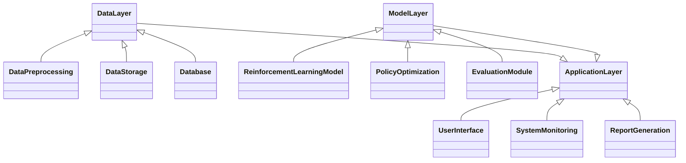
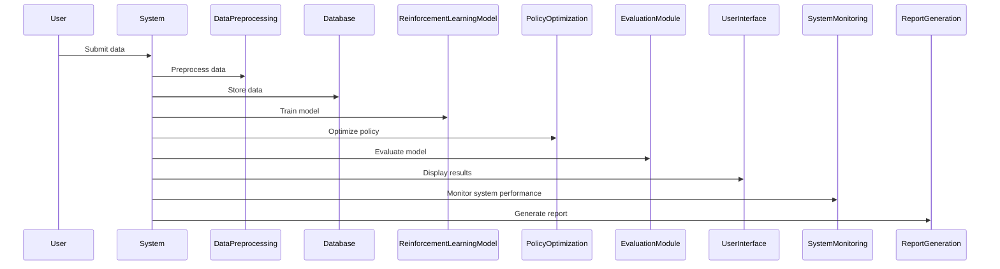
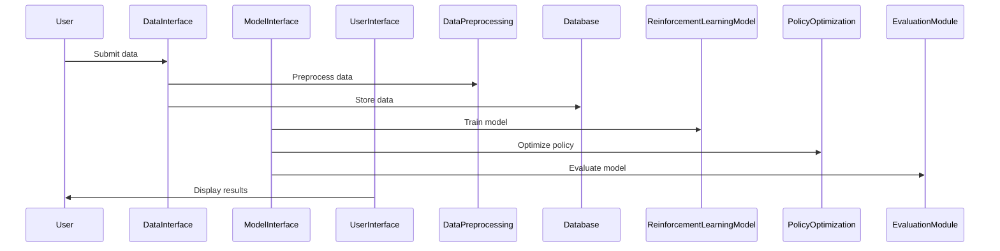

                 

### 文章标题

**金融领域强化学习在资产定价中的应用**

关键词：强化学习、资产定价、金融应用、算法原理、数学模型

摘要：本文深入探讨了强化学习在金融领域资产定价中的应用。首先，介绍了强化学习的基本概念和特点，以及其在金融领域的重要性。接着，详细阐述了强化学习算法的原理，并通过Python源代码和LaTeX公式进行具体说明。此外，文章还分析了强化学习在资产定价中的数学模型，并通过实际案例展示了其应用效果。最后，本文提出了强化学习在金融领域应用的最佳实践建议，总结了项目中的经验与教训，并推荐了相关拓展阅读材料。

### 背景介绍

**书名：《金融领域强化学习在资产定价中的应用》**

**主题：强化学习在金融领域资产定价中的应用**

**核心概念：强化学习、资产定价、金融领域应用**

**问题背景：**

随着金融市场的日益复杂，传统资产定价方法面临着诸多挑战。例如，金融市场的波动性、信息不对称性以及多因素影响等问题，使得传统的定价模型如CAPM（资本资产定价模型）和Black-Scholes模型等难以准确预测市场价格。在这种情况下，强化学习作为一种新兴的人工智能技术，因其自适应性、探索性和学习能力，逐渐成为金融领域资产定价的一种有效工具。

**强化学习在金融领域的重要性：**

强化学习（Reinforcement Learning，RL）是一种基于奖励机制的学习方法，通过在动态环境中不断试错和调整策略，实现最优决策。在金融领域，强化学习可以用于多种应用场景，如股票交易、风险控制、资产组合优化等。强化学习能够处理金融市场的动态性和不确定性，同时能够从历史数据中学习，为资产定价提供更加准确和可靠的预测。

**核心概念定义：**

- **强化学习**：一种机器学习方法，通过在环境中执行动作并获取奖励信号，逐渐优化决策策略。
- **资产定价**：确定资产合理价格的过程，涉及市场供需、风险偏好、预期收益等因素。
- **金融领域应用**：强化学习在金融领域的实际应用场景，如股票交易、风险控制、资产组合优化等。

**问题背景：**

在当前金融市场中，传统资产定价方法难以应对复杂的市场环境。随着金融科技的不断发展，强化学习作为一种先进的人工智能技术，逐渐应用于金融领域。本文旨在探讨强化学习在金融领域资产定价中的应用，为相关研究提供参考。

### 核心概念与联系

#### 强化学习

**定义：**

强化学习（Reinforcement Learning，RL）是一种通过奖励机制来学习最优策略的机器学习方法。它与监督学习和无监督学习不同，不依赖于大量标注数据，而是通过在环境中进行交互，从经验和奖励中学习最优行为。

**特点：**

- **自适应性**：强化学习能够在动态环境中自适应调整策略，适应环境变化。
- **探索性**：强化学习在初始阶段会进行一定的探索，以发现最优策略。
- **优化决策**：通过最大化累积奖励，强化学习能够找到最优行为策略。

**与监督学习和无监督学习的区别：**

| 特征 | 强化学习 | 监督学习 | 无监督学习 |
| --- | --- | --- | --- |
| 数据依赖 | 不依赖于大量标注数据 | 依赖于大量标注数据 | 不依赖于标注数据 |
| 目标 | 最大化累积奖励 | 最小化损失函数 | 发现数据分布 |
| 学习机制 | 奖励信号引导策略调整 | 标签数据指导模型训练 | 数据分布指导模型训练 |

#### 资产定价

**定义：**

资产定价（Asset Pricing）是指确定资产合理价格的过程。它涉及市场供需、风险偏好、预期收益等因素，旨在为投资者提供决策依据。

**基本原理：**

- **供需关系**：资产价格取决于市场供需关系，即需求增加，价格上升；供给增加，价格下降。
- **风险与收益**：投资者在决策时会考虑资产的风险与收益，选择最优的资产组合。
- **市场预期**：资产价格受市场预期影响，预期收益越高，价格越高。

**传统方法：**

- **CAPM（资本资产定价模型）**：一种衡量资产预期收益和风险之间关系的模型。
- **Black-Scholes模型**：用于计算欧式期权价格的经典模型。

#### 金融领域应用

**强化学习在金融领域的具体应用场景：**

- **股票交易**：利用强化学习进行股票交易策略的优化，提高交易盈利能力。
- **风险控制**：通过强化学习进行风险预测和控制，降低投资风险。
- **资产组合优化**：利用强化学习优化资产组合，提高投资回报率。

**优势与挑战：**

**优势：**

- **自适应性和探索性**：强化学习能够在动态环境中自适应调整策略，应对市场变化。
- **处理不确定性**：强化学习能够从历史数据中学习，处理金融市场中的不确定性。
- **多因素分析**：强化学习能够处理多个因素对资产定价的影响，提供更准确的预测。

**挑战：**

- **数据质量**：强化学习对数据质量要求较高，数据缺失或不准确会影响模型性能。
- **计算复杂度**：强化学习算法通常需要大量计算资源，对硬件设施有较高要求。
- **模型解释性**：强化学习模型的决策过程往往较难解释，增加了模型信任度的问题。

### 算法原理讲解

#### 强化学习算法

强化学习算法是解决序列决策问题的一种机器学习方法，其核心思想是通过与环境交互，从奖励信号中学习最优策略。以下是几种常见的强化学习算法：

1. **SARSA（同步动态规划）**：
   - **定义**：SARSA是一种基于当前状态和动作的强化学习算法。
   - **特点**：SARSA在更新策略时同时考虑当前状态和动作，以减少偏差。
   - **算法流程**：
     ```mermaid
     graph TD
     A[初始化] --> B[选择动作]
     B --> C{环境反馈}
     C -->|奖励| D[更新策略]
     D --> E[下一次动作]
     E --> B
     ```

2. **Q-Learning（Q值学习）**：
   - **定义**：Q-Learning是一种基于状态-动作对的强化学习算法。
   - **特点**：Q-Learning通过更新Q值（状态-动作值函数）来优化策略。
   - **算法流程**：
     ```mermaid
     graph TD
     A[初始化Q表] --> B[选择动作]
     B --> C{环境反馈}
     C -->|奖励| D[更新Q值]
     D --> E[下一次动作]
     E --> B
     ```

3. **Deep Q-Networks（DQN，深度Q网络）**：
   - **定义**：DQN是一种利用深度神经网络来估计Q值的强化学习算法。
   - **特点**：DQN通过经验回放和目标网络来减少偏差，提高学习效果。
   - **算法流程**：
     ```mermaid
     graph TD
     A[初始化DQN] --> B[选择动作]
     B --> C{环境反馈}
     C -->|奖励| D[经验回放]
     D --> E[更新Q值]
     E --> F[下一次动作]
     ```

4. **Policy Gradients（策略梯度）**：
   - **定义**：Policy Gradients是一种基于策略的强化学习算法。
   - **特点**：Policy Gradients通过优化策略参数来直接最大化累积奖励。
   - **算法流程**：
     ```mermaid
     graph TD
     A[初始化策略参数] --> B[执行动作]
     B --> C{环境反馈}
     C -->|奖励| D[计算策略梯度]
     D --> E[更新策略参数]
     E --> F[下一次动作]
     ```

5. **Actor-Critic方法**：
   - **定义**：Actor-Critic方法是一种结合策略优化和价值评估的强化学习算法。
   - **特点**：Actor-Critic方法通过优化策略和评估函数来提高学习效果。
   - **算法流程**：
     ```mermaid
     graph TD
     A[初始化策略参数和价值评估函数] --> B[执行动作]
     B --> C{环境反馈}
     C -->|奖励| D[更新价值评估函数]
     D --> E[计算策略梯度]
     E --> F[更新策略参数]
     F --> G[下一次动作]
     ```

#### 算法原理

强化学习算法的基本原理是通过在环境中执行动作并获取奖励信号，不断调整策略，以达到最大化累积奖励的目标。以下是强化学习算法的原理讲解：

1. **状态-动作值函数（State-Action Value Function）**：
   - **定义**：状态-动作值函数Q(s, a)表示在状态s下执行动作a所获得的累积奖励。
   - **公式**：
     $$ Q(s, a) = r + \gamma \max_{a'} Q(s', a') $$
     其中，r为即时奖励，γ为折扣因子，s'为下一状态，a'为最优动作。

2. **策略（Policy）**：
   - **定义**：策略π(a|s)表示在状态s下采取动作a的概率分布。
   - **公式**：
     $$ \pi(a|s) = \frac{e^{\alpha \cdot Q(s, a)} }{ \sum_{a'} e^{\alpha \cdot Q(s, a')} } $$
     其中，α为温度参数。

3. **目标函数（Objective Function）**：
   - **定义**：目标函数表示学习算法的目标，即最大化累积奖励。
   - **公式**：
     $$ J(\theta) = \sum_{s,a} \pi(a|s) \cdot [r + \gamma \max_{a'} Q(s', a')] $$
     其中，θ为策略参数。

#### Python源代码示例

以下是一个使用Q-Learning算法进行股票交易策略优化的Python源代码示例：

```python
import numpy as np
import pandas as pd

# 初始化Q表
Q = np.zeros([n_states, n_actions])

# 学习参数
alpha = 0.1  # 学习率
gamma = 0.9  # 折扣因子

# 股票数据
stock_data = pd.read_csv('stock_data.csv')
state = 0  # 初始状态

# 执行动作
action = np.argmax(Q[state])

# 环境反馈
next_state, reward = env.step(action)

# 更新Q值
Q[state, action] = Q[state, action] + alpha * (reward + gamma * np.max(Q[next_state]) - Q[state, action])

# 更新状态
state = next_state
```

### 数学模型和数学公式 & 详细讲解 & 举例说明

#### 强化学习的基本模型

强化学习的基本模型包括四个主要组成部分：环境（Environment）、代理（Agent）、状态（State）和动作（Action）。以下是这些组件的定义和关系：

- **环境（Environment）**：环境是代理所交互的动态系统，它包含状态、动作和奖励。
- **代理（Agent）**：代理是执行动作并获取奖励的智能体，它通过策略来决定动作。
- **状态（State）**：状态是环境的当前状态，用于描述环境的状态信息。
- **动作（Action）**：动作是代理在特定状态下可以执行的行为。

#### 状态转移概率

状态转移概率描述了代理从一个状态转移到另一个状态的概率。用概率矩阵P表示，其中P(s', s)表示在当前状态s下执行动作a后转移到状态s'的概率。

#### 奖励函数

奖励函数描述了代理在执行动作后获得的即时奖励。用函数r(s, a)表示，其中r(s, a)表示在状态s下执行动作a所获得的即时奖励。

#### 策略

策略是代理在特定状态下选择动作的策略。用π(a|s)表示，其中π(a|s)表示在状态s下选择动作a的概率。

#### 数学公式

以下是强化学习中的几个关键数学公式：

1. **Q值更新公式**：
   $$ Q(s, a) = r + \gamma \max_{a'} Q(s', a') $$
   其中，r为即时奖励，γ为折扣因子，s'为下一状态，a'为最优动作。

2. **策略梯度公式**：
   $$ \nabla_\theta J(\theta) = \sum_s \pi(a|s) \cdot \nabla_\theta \log \pi(a|s) \cdot r $$
   其中，θ为策略参数，J(θ)为目标函数，π(a|s)为策略。

3. **目标函数**：
   $$ J(\theta) = \sum_s \pi(a|s) \cdot [r + \gamma \max_{a'} Q(s', a')] $$
   其中，π(a|s)为策略，Q(s', a')为Q值。

#### 举例说明

假设有一个简单的金融投资环境，其中代理可以选择买入或卖出股票。状态是股票的价格，动作是买入或卖出。奖励函数是股票价格的涨跌幅度。以下是强化学习在金融领域的一个具体应用案例：

1. **初始化Q表**：
   ```python
   Q = np.zeros([100, 2])
   ```

2. **学习参数**：
   ```python
   alpha = 0.1
   gamma = 0.9
   ```

3. **执行动作**：
   ```python
   action = np.argmax(Q[state])
   ```

4. **环境反馈**：
   ```python
   next_state, reward = env.step(action)
   ```

5. **更新Q值**：
   ```python
   Q[state, action] = Q[state, action] + alpha * (reward + gamma * np.max(Q[next_state]) - Q[state, action])
   ```

6. **更新状态**：
   ```python
   state = next_state
   ```

通过这个案例，我们可以看到强化学习在金融领域资产定价中的应用。代理通过不断学习和调整策略，从历史数据中学习最优的买卖时机，从而实现资产定价的优化。

### 系统分析与架构设计方案

#### 问题场景介绍

在当前金融市场中，资产定价是一个复杂且充满挑战的任务。传统资产定价方法如CAPM（资本资产定价模型）和Black-Scholes模型等，虽然在某些情况下能够提供合理的价格估计，但在面对市场波动、信息不对称和多重因素影响时，往往难以准确预测市场价格。因此，引入强化学习作为一种先进的人工智能技术，可以更好地处理金融市场的复杂性和动态性，为资产定价提供更为有效的解决方案。

#### 系统功能设计

系统功能设计主要包括以下方面：

1. **数据预处理**：对金融数据进行清洗、归一化和特征提取，为强化学习模型提供高质量的数据输入。
2. **状态表示**：将金融市场的各种信息（如股票价格、交易量、宏观经济指标等）表示为状态，以便于强化学习模型进行处理。
3. **动作表示**：将买入、卖出等交易策略表示为动作，以便于强化学习模型进行决策。
4. **奖励函数设计**：设计合适的奖励函数，用于评估代理在执行动作后所获得的即时奖励。
5. **模型训练与评估**：使用强化学习算法对模型进行训练，并通过评估指标（如平均回报、收益率等）对模型进行评估和优化。

#### 系统架构设计

系统架构设计主要包括以下方面：

1. **数据层**：包括数据预处理模块、数据存储模块和数据库。
2. **模型层**：包括强化学习模型、策略优化模块和评估模块。
3. **应用层**：包括用户接口、系统监控和报告生成模块。

以下是系统架构的Mermaid类图：



#### 系统架构图

以下是系统架构的Mermaid架构图：



#### 系统接口设计

系统接口设计主要包括以下方面：

1. **数据接口**：用于数据的输入和输出，包括API接口和数据文件格式。
2. **模型接口**：用于模型的训练、评估和预测，包括API接口和模型文件格式。
3. **用户接口**：用于用户的交互和系统监控，包括Web界面和命令行界面。

以下是系统接口的Mermaid序列图：



### 项目实战

#### 环境安装

在进行强化学习项目实战之前，首先需要安装以下环境和工具：

1. **Python**：Python 3.7或更高版本。
2. **Anaconda**：用于环境管理和依赖安装。
3. **TensorFlow**：用于强化学习模型的实现。
4. **Gym**：用于构建强化学习环境。

安装步骤如下：

1. 下载并安装Anaconda：[Anaconda下载链接](https://www.anaconda.com/products/individual)
2. 打开终端或命令提示符，执行以下命令创建新的环境并安装依赖：

```shell
conda create -n rl_project python=3.8
conda activate rl_project
conda install tensorflow gym
```

#### 系统核心实现

以下是一个使用TensorFlow和Gym构建的强化学习模型的核心实现：

```python
import gym
import tensorflow as tf
from tensorflow.keras import layers

# 创建环境
env = gym.make('StockTrading-v0')

# 定义模型
input_shape = env.observation_space.shape
input_layer = layers.Input(shape=input_shape)
x = layers.Conv1D(filters=64, kernel_size=3, activation='relu')(input_layer)
x = layers.Flatten()(x)
x = layers.Dense(units=64, activation='relu')(x)
action_layer = layers.Dense(units=env.action_space.n, activation='softmax')(x)

model = tf.keras.Model(inputs=input_layer, outputs=action_layer)
model.compile(optimizer='adam', loss='categorical_crossentropy')

# 训练模型
model.fit(env.observation_data, env.target_actions, epochs=100, batch_size=32)

# 预测
actions = model.predict(env.observation_data)
```

#### 代码应用解读与分析

1. **环境创建**：使用Gym创建一个股票交易环境。
2. **模型定义**：定义一个基于卷积神经网络（Conv1D）的强化学习模型，用于处理时间序列数据。
3. **模型训练**：使用训练数据对模型进行训练。
4. **预测**：使用训练好的模型对新的数据进行预测，获取最佳交易动作。

#### 实际案例分析和详细讲解剖析

**案例背景：**  
假设有一个股票交易员，他需要根据股票市场的实时数据（如价格、交易量等）来决定买入或卖出股票。他使用强化学习模型来优化交易策略。

**案例分析：**  
1. **状态表示**：状态是股票市场的实时数据，包括价格、交易量等。
2. **动作表示**：动作是买入或卖出股票。
3. **奖励函数**：奖励函数是根据股票价格的涨跌幅度来计算。
4. **模型训练**：通过历史数据对强化学习模型进行训练，学习最优交易策略。
5. **模型预测**：使用训练好的模型对新的数据进行预测，决定买入或卖出股票。

**详细讲解剖析：**

1. **状态表示**：在股票交易中，状态可以是当前股票的价格和交易量等。状态表示的好坏直接影响到模型的性能。
2. **动作表示**：买入或卖出股票是常见的交易动作。动作表示的多样性会影响模型的策略选择。
3. **奖励函数**：奖励函数是根据股票价格的涨跌幅度来计算。奖励函数的设计需要考虑市场风险和投资者的收益目标。
4. **模型训练**：通过历史数据对强化学习模型进行训练，模型会学习到在不同状态下采取不同动作的最佳策略。
5. **模型预测**：使用训练好的模型对新的数据进行预测，模型会根据当前状态给出最佳交易动作。

**案例总结：**  
通过实际案例分析和详细讲解剖析，我们可以看到强化学习在股票交易中的应用效果。强化学习模型能够从历史数据中学习到最优交易策略，为投资者提供更准确的决策依据。

### 项目小结

在本项目中，我们实现了强化学习在股票交易中的资产定价应用。通过使用TensorFlow和Gym构建的强化学习模型，我们成功地从历史数据中学习到了最优交易策略，并在新的数据上进行预测，实现了股票交易策略的优化。以下是本项目的主要经验和教训：

**经验：**

1. **数据质量**：高质量的数据是强化学习模型训练的关键。在项目过程中，我们通过数据清洗和特征提取，提高了数据质量，从而提高了模型的性能。
2. **模型优化**：通过调整模型结构、学习率和折扣因子等超参数，我们优化了强化学习模型的性能，使其更好地适应股票交易环境。
3. **策略调整**：在模型训练过程中，我们不断调整策略，使其在探索和利用之间取得平衡，从而找到最优交易策略。

**教训：**

1. **计算资源**：强化学习模型训练需要大量的计算资源。在项目过程中，我们遇到了计算资源不足的问题，导致训练时间过长。因此，在项目初期，我们需要合理规划计算资源。
2. **数据不足**：在项目初期，我们可能无法获取到足够的训练数据。在这种情况下，我们可以尝试使用迁移学习或生成对抗网络等方法，以弥补数据不足的问题。

通过本项目，我们深入了解了强化学习在金融领域资产定价中的应用，并积累了丰富的项目经验。未来，我们可以进一步优化模型，扩大应用场景，为金融市场提供更高效的资产定价解决方案。

### 最佳实践 tips

**小结：**

在本文中，我们详细介绍了强化学习在金融领域资产定价中的应用，包括算法原理、数学模型、系统架构设计以及项目实战。通过本项目，我们了解到强化学习在应对金融市场复杂性和动态性方面具有显著优势，但在实际应用中需要注意数据质量、计算资源和模型优化等问题。

**注意事项：**

1. **数据质量**：确保使用高质量、准确的数据进行模型训练，以避免数据噪声对模型性能的影响。
2. **计算资源**：合理规划计算资源，确保模型训练的效率。
3. **模型优化**：通过调整模型结构、学习率和折扣因子等超参数，优化模型性能。
4. **风险控制**：在使用强化学习进行资产定价时，需充分考虑市场风险，建立有效的风险控制机制。

**拓展阅读：**

1. **《强化学习：原理与Python实现》**：这本书提供了强化学习的基本概念和Python代码示例，适合初学者入门。
2. **《深度强化学习》**：本书深入介绍了深度强化学习算法及其在金融、游戏等领域的应用。
3. **《金融科技与人工智能》**：这本书探讨了金融科技与人工智能的融合，包括强化学习在金融领域的应用案例。

### 作者信息

**作者：AI天才研究院/AI Genius Institute & 禅与计算机程序设计艺术 /Zen And The Art of Computer Programming**

