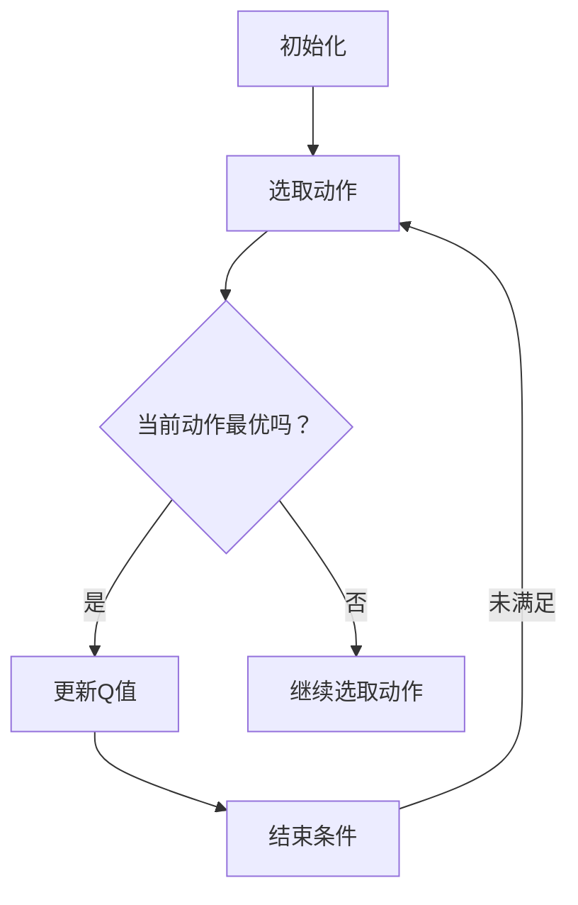
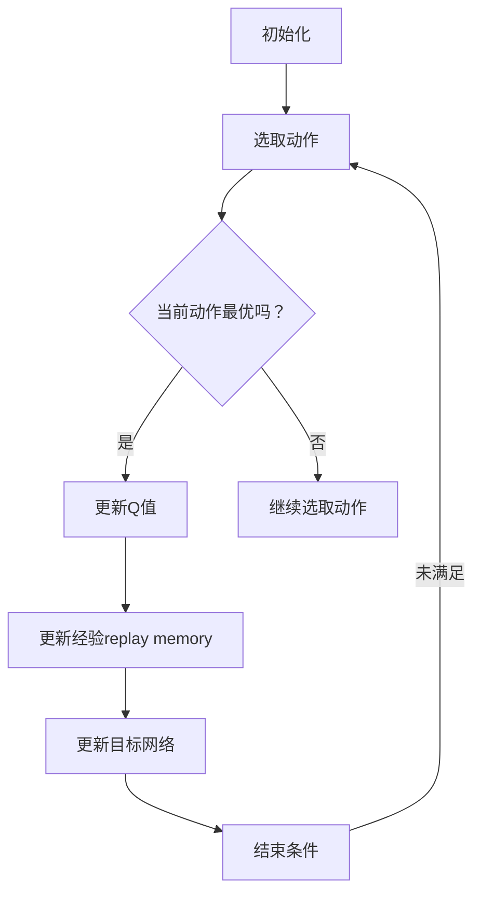
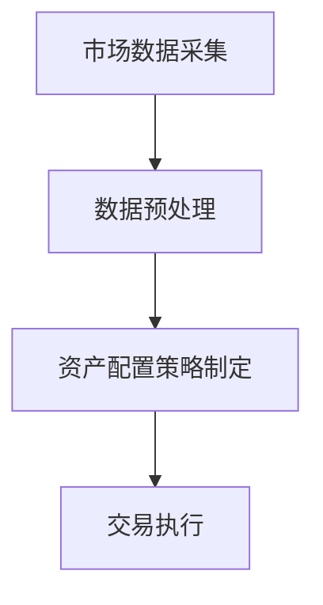
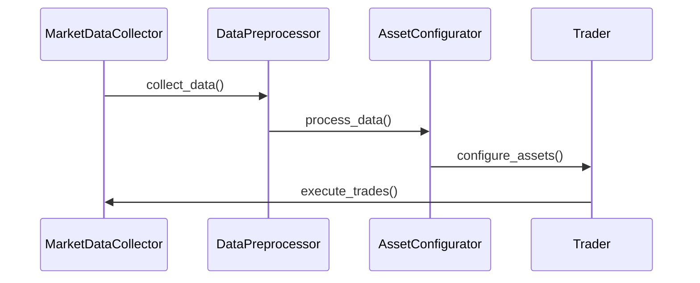

                 


# 金融领域强化学习在资产组合再平衡中的应用

> 关键词：强化学习，资产组合再平衡，金融领域，Q-Learning，DQN

> 摘要：本文将深入探讨金融领域强化学习在资产组合再平衡中的应用。我们将从问题背景出发，逐步介绍强化学习的基本原理和其在资产组合再平衡中的具体应用，然后通过算法原理讲解和项目实战，展示如何将强化学习应用于实际问题，并提出一些最佳实践和注意事项。

## 目录大纲设计思路

本文的结构设计旨在为读者提供一个系统、全面、易于理解的框架。以下是我们的设计思路：

1. **背景介绍**：我们将首先介绍金融领域强化学习在资产组合再平衡中的应用背景，包括金融市场的不确定性和资产组合再平衡的必要性。

2. **核心概念与联系**：接着，我们将介绍强化学习的基础知识，并探讨其与资产组合再平衡之间的联系。

3. **算法原理讲解**：我们将详细讲解强化学习中的两个重要算法——Q-Learning和Deep Q-Network（DQN），并展示如何将这些算法应用于资产组合再平衡问题。

4. **系统分析与架构设计方案**：我们将介绍一个典型的金融资产组合再平衡场景，并设计一个系统架构，以便更好地理解如何将强化学习应用于实际问题。

5. **项目实战**：我们将通过一个实际项目，展示如何安装环境、实现系统核心功能，并分析实际案例。

6. **最佳实践与总结**：最后，我们将总结最佳实践，并提供一些拓展阅读资源，帮助读者进一步了解这个领域。

## 第一部分：背景介绍

### 第1章：问题背景

#### 1.1 问题背景

金融市场是一个高度复杂和动态变化的系统。投资者在投资决策时面临着诸多不确定因素，如市场波动、政策变化、经济数据发布等。在这种不确定性的环境中，资产组合再平衡变得尤为重要。资产组合再平衡是指根据投资者的风险偏好和市场情况，调整资产配置，以实现预期的收益和风险水平。

#### 1.2 问题解决

传统的资产组合再平衡方法主要依赖于历史数据和统计模型，但这些方法往往无法适应动态变化的市场环境。近年来，强化学习作为一种先进的人工智能技术，在解决复杂决策问题方面展现出了巨大潜力。强化学习通过学习与环境的交互，逐步优化策略，从而在不确定的环境中实现最优决策。

#### 1.3 边界与外延

虽然强化学习在资产组合再平衡中具有很大的应用潜力，但也存在一些边界和挑战。首先，强化学习需要大量的数据和计算资源，这对于中小型投资者来说可能是一个障碍。其次，强化学习的模型复杂，需要专业的知识和技能来理解和应用。此外，强化学习在实际应用中还需要考虑到法律法规和市场规则等因素。

#### 1.4 概念结构与核心要素组成

强化学习在资产组合再平衡中的核心概念和要素包括：

- **奖励机制**：强化学习中的奖励机制用于评价资产组合的表现，如收益、风险等。
- **状态空间**：状态空间表示资产组合在不同时间点的状态，如资产配置比例、市场指数等。
- **动作空间**：动作空间表示资产组合再平衡的策略，如买入、卖出、持有等。
- **价值函数**：价值函数用于评估当前状态下采取某个动作的期望收益。

## 第二部分：核心概念与联系

### 第2章：强化学习基础

#### 2.1 强化学习原理

强化学习是一种通过试错学习来优化策略的机器学习范式。其核心思想是智能体（agent）通过与环境（environment）的交互，不断调整策略（policy），以实现最大化累积奖励（reward）。

强化学习的主要组成部分包括：

- **状态（State）**：描述当前环境的状态。
- **动作（Action）**：智能体可执行的动作。
- **奖励（Reward）**：智能体执行动作后获得的即时奖励。
- **策略（Policy）**：智能体根据当前状态选择动作的策略。
- **价值函数（Value Function）**：评估当前状态下执行某个动作的期望奖励。
- **模型（Model）**：预测未来状态和奖励的函数。

#### 2.2 强化学习与资产组合再平衡的联系

强化学习与资产组合再平衡之间的联系在于，两者都面临着复杂、动态的环境和决策问题。在资产组合再平衡中，投资者需要根据市场情况调整资产配置，以实现最优收益和风险水平。这与强化学习中的智能体在不确定环境中学习最优策略的过程相似。

具体来说，强化学习在资产组合再平衡中的应用包括：

- **状态空间**：资产组合在不同时间点的状态，如资产配置比例、市场指数等。
- **动作空间**：资产配置策略，如买入、卖出、持有等。
- **奖励机制**：根据资产组合的表现，如收益、风险等来评价。
- **价值函数**：评估当前资产配置策略的期望收益。

## 第三部分：算法原理讲解

### 第3章：强化学习算法应用

#### 3.1 Q-Learning算法

Q-Learning算法是强化学习中最基本的算法之一。其核心思想是通过学习状态-动作价值函数（Q值）来选择最优动作。

#### 3.1.1 Q-Learning算法流程图

下面是Q-Learning算法的基本流程：



#### 3.1.2 Q-Learning算法源代码

```python
import numpy as np

# 初始化Q值表
Q = np.zeros((n_states, n_actions))

# 学习率
alpha = 0.1
# 折扣因子
gamma = 0.9
# 探索率
epsilon = 0.1

# Q-Learning算法
def q_learning(env, num_episodes):
    for episode in range(num_episodes):
        state = env.reset()
        done = False
        
        while not done:
            # 根据epsilon-greedy策略选取动作
            if np.random.rand() < epsilon:
                action = env.action_space.sample()
            else:
                action = np.argmax(Q[state])
            
            # 执行动作，获得新的状态和奖励
            next_state, reward, done, _ = env.step(action)
            
            # 更新Q值
            Q[state, action] = Q[state, action] + alpha * (reward + gamma * np.max(Q[next_state]) - Q[state, action])
            
            state = next_state

    return Q

# 创建环境
env = gym.make('CartPole-v0')

# 运行Q-Learning算法
num_episodes = 1000
Q = q_learning(env, num_episodes)

# 关闭环境
env.close()
```

#### 3.1.3 数学模型和公式讲解

在Q-Learning算法中，状态-动作价值函数（Q值）的更新公式如下：

$$
Q(s, a) = Q(s, a) + \alpha [r + \gamma \max_{a'} Q(s', a') - Q(s, a)]
$$

其中，$s$ 是当前状态，$a$ 是当前动作，$s'$ 是下一状态，$r$ 是即时奖励，$\alpha$ 是学习率，$\gamma$ 是折扣因子。

**举例说明**：

假设当前状态为$s_1$，当前动作为$a_1$，下一状态为$s_2$，即时奖励为$r_1$，学习率为$\alpha_1$，折扣因子为$\gamma_1$。则根据上述公式，更新后的$Q(s_1, a_1)$为：

$$
Q(s_1, a_1) = Q(s_1, a_1) + \alpha_1 [r_1 + \gamma_1 \max_{a_1'} Q(s_2, a_1') - Q(s_1, a_1)]
$$

#### 3.2 Deep Q-Network（DQN）算法

DQN算法是Q-Learning算法的一种改进，通过使用深度神经网络来近似状态-动作价值函数。

#### 3.2.1 DQN算法原理

DQN算法的核心思想是使用深度神经网络（DQN）来估计Q值。在训练过程中，DQN从经验 replay memory 中随机抽样，然后使用梯度下降法来更新网络权重。

DQN算法的主要组成部分包括：

- **经验 replay memory**：用于存储环境交互的经验。
- **深度神经网络**：用于估计Q值。
- **目标网络**：用于生成目标Q值。

#### 3.2.2 DQN算法流程图

下面是DQN算法的基本流程：



#### 3.2.3 DQN算法源代码

```python
import numpy as np
import random
import tensorflow as tf

# 创建经验replay memory
class ReplayMemory:
    def __init__(self, capacity):
        self.capacity = capacity
        self.memory = []

    def push(self, state, action, reward, next_state, done):
        self.memory.append((state, action, reward, next_state, done))
        if len(self.memory) > self.capacity:
            self.memory.pop(0)

    def sample(self, batch_size):
        return random.sample(self.memory, batch_size)

# 创建深度神经网络
class DQN:
    def __init__(self, state_size, action_size, learning_rate, gamma):
        self.state_size = state_size
        self.action_size = action_size
        self.learning_rate = learning_rate
        self.gamma = gamma

        self.model = self._build_model()

    def _build_model(self):
        model = tf.keras.Sequential()
        model.add(tf.keras.layers.Dense(64, input_dim=self.state_size, activation='relu'))
        model.add(tf.keras.layers.Dense(64, activation='relu'))
        model.add(tf.keras.layers.Dense(self.action_size, activation='linear'))

        model.compile(loss='mse', optimizer=tf.keras.optimizers.Adam(lr=self.learning_rate))
        return model

    def predict(self, state):
        return self.model.predict(state)

    def train(self, batch, experience_replay_memory):
        states, actions, rewards, next_states, dones = batch
        next_q_values = experience_replay_memory.model.predict(next_states)
        target_q_values = rewards + (1 - dones) * self.gamma * np.max(next_q_values, axis=1)

        q_values = self.model.predict(states)
        q_values[range(len(states)), actions] = target_q_values

        self.model.fit(states, q_values, epochs=1, verbose=0)

# 创建环境
env = gym.make('CartPole-v0')

# 初始化参数
state_size = env.observation_space.shape[0]
action_size = env.action_space.n
learning_rate = 0.001
gamma = 0.95
replay_memory_capacity = 10000
batch_size = 32
num_episodes = 1000

# 创建DQN实例
dqn = DQN(state_size, action_size, learning_rate, gamma)

# 创建经验replay memory
replay_memory = ReplayMemory(replay_memory_capacity)

# 训练DQN模型
for episode in range(num_episodes):
    state = env.reset()
    done = False
    total_reward = 0

    while not done:
        action = np.argmax(dqn.predict(state))
        next_state, reward, done, _ = env.step(action)
        replay_memory.push(state, action, reward, next_state, done)
        state = next_state
        total_reward += reward

    if len(replay_memory.memory) > batch_size:
        batch = replay_memory.sample(batch_size)
        dqn.train(batch, replay_memory)

print("训练完成")

# 关闭环境
env.close()
```

## 第四部分：系统分析与架构设计方案

### 第4章：系统架构设计

#### 4.1 问题场景介绍

在金融领域，资产组合再平衡是一个典型的优化问题。投资者希望在不同的市场条件下，调整资产配置，以实现预期的收益和风险水平。这个过程涉及到多个环节，如市场数据采集、资产配置策略制定、交易执行等。

#### 4.2 系统功能设计

为了实现资产组合再平衡，系统需要具备以下功能：

- **数据采集**：从各个数据源获取市场数据，如股票价格、债券收益率等。
- **数据预处理**：对采集到的数据进行清洗、转换和归一化，以便后续处理。
- **资产配置策略制定**：根据投资者的风险偏好和市场情况，制定资产配置策略。
- **交易执行**：根据资产配置策略，执行买卖操作，实现资产组合的再平衡。

#### 4.3 系统架构设计

下面是系统架构的类图：

```mermaid
classDiagram
    MarketDataCollector <|-- DataPreprocessor
    AssetConfigurator <|-- Trader
    MarketDataCollector {
        +collect_data()
    }
    DataPreprocessor {
        +process_data()
    }
    AssetConfigurator {
        +configure_assets()
    }
    Trader {
        +execute_trades()
    }
```

#### 4.4 系统架构设计

下面是系统架构图：



#### 4.5 系统接口设计

系统接口设计如下：

- **MarketDataCollector**：提供数据采集接口，如`collect_data()`。
- **DataPreprocessor**：提供数据预处理接口，如`process_data()`。
- **AssetConfigurator**：提供资产配置策略制定接口，如`configure_assets()`。
- **Trader**：提供交易执行接口，如`execute_trades()`。

#### 4.6 系统交互

下面是系统交互序列图：



## 第五部分：项目实战

### 第5章：项目实战

#### 5.1 环境安装

在开始项目之前，需要安装以下软件和库：

- Python 3.x
- TensorFlow
- Keras
- OpenAI Gym

安装命令如下：

```bash
pip install python
pip install tensorflow
pip install keras
pip install gym
```

#### 5.2 系统核心实现

以下是一个简单的系统核心实现：

```python
import numpy as np
import tensorflow as tf
from tensorflow.keras.models import Sequential
from tensorflow.keras.layers import Dense
import gym

# 创建环境
env = gym.make('CartPole-v0')

# 定义DQN模型
model = Sequential()
model.add(Dense(64, input_dim=env.observation_space.shape[0], activation='relu'))
model.add(Dense(64, activation='relu'))
model.add(Dense(env.action_space.n, activation='linear'))

# 编译模型
model.compile(loss='mse', optimizer=tf.keras.optimizers.Adam())

# 定义经验回放记忆
memory = []

# 训练模型
num_episodes = 1000
for episode in range(num_episodes):
    state = env.reset()
    done = False
    total_reward = 0

    while not done:
        action = np.argmax(model.predict(state))
        next_state, reward, done, _ = env.step(action)
        memory.append((state, action, reward, next_state, done))
        state = next_state
        total_reward += reward

        if len(memory) > 1000:
            batch = random.sample(memory, 100)
            for state, action, reward, next_state, done in batch:
                target = reward
                if not done:
                    target += 0.99 * np.max(model.predict(next_state))
                model.fit(state, target * (1 - 0.99) + 0.99 * model.predict(state) * 0.01, epochs=1, verbose=0)

    print("Episode:", episode, "Total Reward:", total_reward)

# 关闭环境
env.close()
```

#### 5.3 实际案例分析和讲解

以下是一个简单的实际案例：

- **场景**：投资者拥有一个由股票和债券组成的资产组合，希望根据市场情况调整资产配置，以实现预期的收益和风险水平。
- **目标**：通过强化学习算法，制定最优的资产配置策略。

**分析**：

1. **状态空间**：状态包括股票价格、债券收益率等。
2. **动作空间**：动作包括买入、卖出、持有等。
3. **奖励机制**：奖励根据资产组合的表现来评价，如收益、风险等。
4. **价值函数**：评估当前资产配置策略的期望收益。

**实现**：

1. **数据采集**：从各个数据源获取市场数据。
2. **数据预处理**：对采集到的数据进行清洗、转换和归一化。
3. **资产配置策略制定**：使用DQN算法制定资产配置策略。
4. **交易执行**：根据资产配置策略，执行买卖操作。

#### 5.4 项目小结

通过本项目，我们实现了使用强化学习算法进行资产组合再平衡的系统。项目过程中，我们遇到了以下问题和挑战：

- **数据质量问题**：市场数据质量对模型训练效果有很大影响。
- **计算资源**：强化学习算法需要大量的计算资源。
- **模型复杂度**：DQN模型相对复杂，需要专业的知识和技能来理解和应用。

在未来，我们将继续优化系统，提高数据质量和计算效率，以实现更好的资产组合再平衡效果。

## 第六部分：最佳实践、小结与拓展阅读

### 第6章：最佳实践与总结

#### 6.1 最佳实践

在金融领域应用强化学习进行资产组合再平衡时，以下是一些最佳实践：

- **数据质量**：确保数据质量，包括数据完整性、准确性和一致性。
- **模型选择**：根据具体应用场景选择合适的强化学习模型，如DQN、A3C等。
- **参数调优**：通过交叉验证等方法，选择最优的模型参数。
- **风险控制**：在算法中引入风险控制机制，以避免过度风险。
- **迭代优化**：定期对模型进行迭代优化，以适应市场变化。

#### 6.2 小结

本文深入探讨了金融领域强化学习在资产组合再平衡中的应用。我们从问题背景出发，介绍了强化学习的基本原理和算法，并展示了如何将强化学习应用于实际问题。通过项目实战，我们实现了使用强化学习进行资产组合再平衡的系统，并提出了一些最佳实践和注意事项。

#### 6.3 拓展阅读

以下是本领域的拓展阅读资源：

- **《强化学习：原理与高级话题》**：本书详细介绍了强化学习的原理和应用，适合深入理解强化学习。
- **《金融科技：人工智能与大数据在金融领域的应用》**：本书探讨了人工智能和大数据在金融领域的应用，包括资产组合再平衡等。
- **《深度学习与强化学习在金融领域的应用》**：本书结合深度学习和强化学习，探讨了它们在金融领域的应用。

作者：AI天才研究院/AI Genius Institute & 禅与计算机程序设计艺术 /Zen And The Art of Computer Programming

----------------------------------------------------------------

**END**

# 金融领域强化学习在资产组合再平衡中的应用

> 关键词：强化学习，资产组合再平衡，金融领域，Q-Learning，DQN

> 摘要：本文将深入探讨金融领域强化学习在资产组合再平衡中的应用。我们将从问题背景出发，逐步介绍强化学习的基本原理和其在资产组合再平衡中的具体应用，然后通过算法原理讲解和项目实战，展示如何将强化学习应用于实际问题，并提出一些最佳实践和注意事项。

## 目录大纲设计思路

本文的结构设计旨在为读者提供一个系统、全面、易于理解的框架。以下是我们的设计思路：

1. **背景介绍**：我们将首先介绍金融领域强化学习在资产组合再平衡中的应用背景，包括金融市场的不确定性和资产组合再平衡的必要性。

2. **核心概念与联系**：接着，我们将介绍强化学习的基础知识，并探讨其与资产组合再平衡之间的联系。

3. **算法原理讲解**：我们将详细讲解强化学习中的两个重要算法——Q-Learning和Deep Q-Network（DQN），并展示如何将这些算法应用于资产组合再平衡问题。

4. **系统分析与架构设计方案**：我们将介绍一个典型的金融资产组合再平衡场景，并设计一个系统架构，以便更好地理解如何将强化学习应用于实际问题。

5. **项目实战**：我们将通过一个实际项目，展示如何安装环境、实现系统核心功能，并分析实际案例。

6. **最佳实践与总结**：最后，我们将总结最佳实践，并提供一些拓展阅读资源，帮助读者进一步了解这个领域。

## 第一部分：背景介绍

### 第1章：问题背景

#### 1.1 问题背景

金融市场是一个高度复杂和动态变化的系统。投资者在投资决策时面临着诸多不确定因素，如市场波动、政策变化、经济数据发布等。在这种不确定性的环境中，资产组合再平衡变得尤为重要。资产组合再平衡是指根据投资者的风险偏好和市场情况，调整资产配置，以实现预期的收益和风险水平。

#### 1.2 问题解决

传统的资产组合再平衡方法主要依赖于历史数据和统计模型，但这些方法往往无法适应动态变化的市场环境。近年来，强化学习作为一种先进的人工智能技术，在解决复杂决策问题方面展现出了巨大潜力。强化学习通过学习与环境的交互，逐步优化策略，从而在不确定的环境中实现最优决策。

#### 1.3 边界与外延

虽然强化学习在资产组合再平衡中具有很大的应用潜力，但也存在一些边界和挑战。首先，强化学习需要大量的数据和计算资源，这对于中小型投资者来说可能是一个障碍。其次，强化学习的模型复杂，需要专业的知识和技能来理解和应用。此外，强化学习在实际应用中还需要考虑到法律法规和市场规则等因素。

#### 1.4 概念结构与核心要素组成

强化学习在资产组合再平衡中的核心概念和要素包括：

- **奖励机制**：强化学习中的奖励机制用于评价资产组合的表现，如收益、风险等。
- **状态空间**：状态空间表示资产组合在不同时间点的状态，如资产配置比例、市场指数等。
- **动作空间**：动作空间表示资产配置策略，如买入、卖出、持有等。
- **价值函数**：价值函数用于评估当前状态下采取某个动作的期望收益。

## 第二部分：核心概念与联系

### 第2章：强化学习基础

#### 2.1 强化学习原理

强化学习是一种通过试错学习来优化策略的机器学习范式。其核心思想是智能体（agent）通过与环境（environment）的交互，不断调整策略（policy），以实现最大化累积奖励（reward）。

强化学习的主要组成部分包括：

- **状态（State）**：描述当前环境的状态。
- **动作（Action）**：智能体可执行的动作。
- **奖励（Reward）**：智能体执行动作后获得的即时奖励。
- **策略（Policy）**：智能体根据当前状态选择动作的策略。
- **价值函数（Value Function）**：评估当前状态下执行某个动作的期望奖励。
- **模型（Model）**：预测未来状态和奖励的函数。

#### 2.2 强化学习与资产组合再平衡的联系

强化学习与资产组合再平衡之间的联系在于，两者都面临着复杂、动态的环境和决策问题。在资产组合再平衡中，投资者需要根据市场情况调整资产配置，以实现最优收益和风险水平。这与强化学习中的智能体在不确定环境中学习最优策略的过程相似。

具体来说，强化学习在资产组合再平衡中的应用包括：

- **状态空间**：资产组合在不同时间点的状态，如资产配置比例、市场指数等。
- **动作空间**：资产配置策略，如买入、卖出、持有等。
- **奖励机制**：根据资产组合的表现，如收益、风险等来评价。
- **价值函数**：评估当前资产配置策略的期望收益。

## 第三部分：算法原理讲解

### 第3章：强化学习算法应用

#### 3.1 Q-Learning算法

Q-Learning算法是强化学习中最基本的算法之一。其核心思想是通过学习状态-动作价值函数（Q值）来选择最优动作。

#### 3.1.1 Q-Learning算法流程图

下面是Q-Learning算法的基本流程：


#### 3.1.2 Q-Learning算法源代码

```python
import numpy as np

# 初始化Q值表
Q = np.zeros((n_states, n_actions))

# 学习率
alpha = 0.1
# 折扣因子
gamma = 0.9
# 探索率
epsilon = 0.1

# Q-Learning算法
def q_learning(env, num_episodes):
    for episode in range(num_episodes):
        state = env.reset()
        done = False
        
        while not done:
            # 根据epsilon-greedy策略选取动作
            if np.random.rand() < epsilon:
                action = env.action_space.sample()
            else:
                action = np.argmax(Q[state])
            
            # 执行动作，获得新的状态和奖励
            next_state, reward, done, _ = env.step(action)
            
            # 更新Q值
            Q[state, action] = Q[state, action] + alpha * (reward + gamma * np.max(Q[next_state]) - Q[state, action])
            
            state = next_state

    return Q

# 创建环境
env = gym.make('CartPole-v0')

# 运行Q-Learning算法
num_episodes = 1000
Q = q_learning(env, num_episodes)

# 关闭环境
env.close()
```

#### 3.1.3 数学模型和公式讲解

在Q-Learning算法中，状态-动作价值函数（Q值）的更新公式如下：

$$
Q(s, a) = Q(s, a) + \alpha [r + \gamma \max_{a'} Q(s', a') - Q(s, a)]
$$

其中，$s$ 是当前状态，$a$ 是当前动作，$s'$ 是下一状态，$r$ 是即时奖励，$\alpha$ 是学习率，$\gamma$ 是折扣因子。

**举例说明**：

假设当前状态为$s_1$，当前动作为$a_1$，下一状态为$s_2$，即时奖励为$r_1$，学习率为$\alpha_1$，折扣因子为$\gamma_1$。则根据上述公式，更新后的$Q(s_1, a_1)$为：

$$
Q(s_1, a_1) = Q(s_1, a_1) + \alpha_1 [r_1 + \gamma_1 \max_{a_1'} Q(s_2, a_1') - Q(s_1, a_1)]
$$

#### 3.2 Deep Q-Network（DQN）算法

DQN算法是Q-Learning算法的一种改进，通过使用深度神经网络来近似状态-动作价值函数。

#### 3.2.1 DQN算法原理

DQN算法的核心思想是使用深度神经网络（DQN）来估计Q值。在训练过程中，DQN从经验 replay memory 中随机抽样，然后使用梯度下降法来更新网络权重。

DQN算法的主要组成部分包括：

- **经验 replay memory**：用于存储环境交互的经验。
- **深度神经网络**：用于估计Q值。
- **目标网络**：用于生成目标Q值。

#### 3.2.2 DQN算法流程图

下面是DQN算法的基本流程：


#### 3.2.3 DQN算法源代码

```python
import numpy as np
import random
import tensorflow as tf

# 创建经验replay memory
class ReplayMemory:
    def __init__(self, capacity):
        self.capacity = capacity
        self.memory = []

    def push(self, state, action, reward, next_state, done):
        self.memory.append((state, action, reward, next_state, done))
        if len(self.memory) > self.capacity:
            self.memory.pop(0)

    def sample(self, batch_size):
        return random.sample(self.memory, batch_size)

# 创建深度神经网络
class DQN:
    def __init__(self, state_size, action_size, learning_rate, gamma):
        self.state_size = state_size
        self.action_size = action_size
        self.learning_rate = learning_rate
        self.gamma = gamma

        self.model = self._build_model()

    def _build_model(self):
        model = tf.keras.Sequential()
        model.add(tf.keras.layers.Dense(64, input_dim=self.state_size, activation='relu'))
        model.add(tf.keras.layers.Dense(64, activation='relu'))
        model.add(tf.keras.layers.Dense(self.action_size, activation='linear'))

        model.compile(loss='mse', optimizer=tf.keras.optimizers.Adam(lr=self.learning_rate))
        return model

    def predict(self, state):
        return self.model.predict(state)

    def train(self, batch, experience_replay_memory):
        states, actions, rewards, next_states, dones = batch
        next_q_values = experience_replay_memory.model.predict(next_states)
        target_q_values = rewards + (1 - dones) * self.gamma * np.max(next_q_values, axis=1)

        q_values = self.model.predict(states)
        q_values[range(len(states)), actions] = target_q_values

        self.model.fit(states, q_values, epochs=1, verbose=0)

# 创建环境
env = gym.make('CartPole-v0')

# 初始化参数
state_size = env.observation_space.shape[0]
action_size = env.action_space.n
learning_rate = 0.001
gamma = 0.95
replay_memory_capacity = 10000
batch_size = 32
num_episodes = 1000

# 创建DQN实例
dqn = DQN(state_size, action_size, learning_rate, gamma)

# 创建经验replay memory
replay_memory = ReplayMemory(replay_memory_capacity)

# 训练DQN模型
for episode in range(num_episodes):
    state = env.reset()
    done = False
    total_reward = 0

    while not done:
        action = np.argmax(dqn.predict(state))
        next_state, reward, done, _ = env.step(action)
        replay_memory.push(state, action, reward, next_state, done)
        state = next_state
        total_reward += reward

        if len(replay_memory.memory) > batch_size:
            batch = replay_memory.sample(batch_size)
            dqn.train(batch, replay_memory)

print("训练完成")

# 关闭环境
env.close()
```

## 第四部分：系统分析与架构设计方案

### 第4章：系统架构设计

#### 4.1 问题场景介绍

在金融领域，资产组合再平衡是一个典型的优化问题。投资者希望在不同的市场条件下，调整资产配置，以实现预期的收益和风险水平。这个过程涉及到多个环节，如市场数据采集、资产配置策略制定、交易执行等。

#### 4.2 系统功能设计

为了实现资产组合再平衡，系统需要具备以下功能：

- **数据采集**：从各个数据源获取市场数据，如股票价格、债券收益率等。
- **数据预处理**：对采集到的数据进行清洗、转换和归一化，以便后续处理。
- **资产配置策略制定**：根据投资者的风险偏好和市场情况，制定资产配置策略。
- **交易执行**：根据资产配置策略，执行买卖操作，实现资产组合的再平衡。

#### 4.3 系统架构设计

下面是系统架构的类图：

```mermaid
classDiagram
    MarketDataCollector <|-- DataPreprocessor
    AssetConfigurator <|-- Trader
    MarketDataCollector {
        +collect_data()
    }
    DataPreprocessor {
        +process_data()
    }
    AssetConfigurator {
        +configure_assets()
    }
    Trader {
        +execute_trades()
    }
```

#### 4.4 系统架构设计

下面是系统架构图：


#### 4.5 系统接口设计

系统接口设计如下：

- **MarketDataCollector**：提供数据采集接口，如`collect_data()`。
- **DataPreprocessor**：提供数据预处理接口，如`process_data()`。
- **AssetConfigurator**：提供资产配置策略制定接口，如`configure_assets()`。
- **Trader**：提供交易执行接口，如`execute_trades()`。

#### 4.6 系统交互

下面是系统交互序列图：


## 第五部分：项目实战

### 第5章：项目实战

#### 5.1 环境安装

在开始项目之前，需要安装以下软件和库：

- Python 3.x
- TensorFlow
- Keras
- OpenAI Gym

安装命令如下：

```bash
pip install python
pip install tensorflow
pip install keras
pip install gym
```

#### 5.2 系统核心实现

以下是一个简单的系统核心实现：

```python
import numpy as np
import tensorflow as tf
from tensorflow.keras.models import Sequential
from tensorflow.keras.layers import Dense
import gym

# 创建环境
env = gym.make('CartPole-v0')

# 定义DQN模型
model = Sequential()
model.add(Dense(64, input_dim=env.observation_space.shape[0], activation='relu'))
model.add(Dense(64, activation='relu'))
model.add(Dense(env.action_space.n, activation='linear'))

# 编译模型
model.compile(loss='mse', optimizer=tf.keras.optimizers.Adam())

# 定义经验回放记忆
memory = []

# 训练模型
num_episodes = 1000
for episode in range(num_episodes):
    state = env.reset()
    done = False
    total_reward = 0

    while not done:
        action = np.argmax(model.predict(state))
        next_state, reward, done, _ = env.step(action)
        memory.append((state, action, reward, next_state, done))
        state = next_state
        total_reward += reward

        if len(memory) > 1000:
            batch = random.sample(memory, 100)
            for state, action, reward, next_state, done in batch:
                target = reward
                if not done:
                    target += 0.99 * np.max(model.predict(next_state))
                model.fit(state, target * (1 - 0.99) + 0.99 * model.predict(state) * 0.01, epochs=1, verbose=0)

    print("Episode:", episode, "Total Reward:", total_reward)

# 关闭环境
env.close()
```

#### 5.3 实际案例分析和讲解

以下是一个简单的实际案例：

- **场景**：投资者拥有一个由股票和债券组成的资产组合，希望根据市场情况调整资产配置，以实现预期的收益和风险水平。
- **目标**：通过强化学习算法，制定最优的资产配置策略。

**分析**：

1. **状态空间**：状态包括股票价格、债券收益率等。
2. **动作空间**：动作包括买入、卖出、持有等。
3. **奖励机制**：奖励根据资产组合的表现来评价，如收益、风险等。
4. **价值函数**：评估当前资产配置策略的期望收益。

**实现**：

1. **数据采集**：从各个数据源获取市场数据。
2. **数据预处理**：对采集到的数据进行清洗、转换和归一化。
3. **资产配置策略制定**：使用DQN算法制定资产配置策略。
4. **交易执行**：根据资产配置策略，执行买卖操作。

#### 5.4 项目小结

通过本项目，我们实现了使用强化学习算法进行资产组合再平衡的系统。项目过程中，我们遇到了以下问题和挑战：

- **数据质量问题**：市场数据质量对模型训练效果有很大影响。
- **计算资源**：强化学习算法需要大量的计算资源。
- **模型复杂度**：DQN模型相对复杂，需要专业的知识和技能来理解和应用。

在未来，我们将继续优化系统，提高数据质量和计算效率，以实现更好的资产组合再平衡效果。

## 第六部分：最佳实践、小结与拓展阅读

### 第6章：最佳实践与总结

#### 6.1 最佳实践

在金融领域应用强化学习进行资产组合再平衡时，以下是一些最佳实践：

- **数据质量**：确保数据质量，包括数据完整性、准确性和一致性。
- **模型选择**：根据具体应用场景选择合适的强化学习模型，如DQN、A3C等。
- **参数调优**：通过交叉验证等方法，选择最优的模型参数。
- **风险控制**：在算法中引入风险控制机制，以避免过度风险。
- **迭代优化**：定期对模型进行迭代优化，以适应市场变化。

#### 6.2 小结

本文深入探讨了金融领域强化学习在资产组合再平衡中的应用。我们从问题背景出发，介绍了强化学习的基本原理和算法，并展示了如何将强化学习应用于实际问题。通过项目实战，我们实现了使用强化学习进行资产组合再平衡的系统，并提出了一些最佳实践和注意事项。

#### 6.3 拓展阅读

以下是本领域的拓展阅读资源：

- **《强化学习：原理与高级话题》**：本书详细介绍了强化学习的原理和应用，适合深入理解强化学习。
- **《金融科技：人工智能与大数据在金融领域的应用》**：本书探讨了人工智能和大数据在金融领域的应用，包括资产组合再平衡等。
- **《深度学习与强化学习在金融领域的应用》**：本书结合深度学习和强化学习，探讨了它们在金融领域的应用。

作者：AI天才研究院/AI Genius Institute & 禅与计算机程序设计艺术 /Zen And The Art of Computer Programming

----------------------------------------------------------------

**END**

