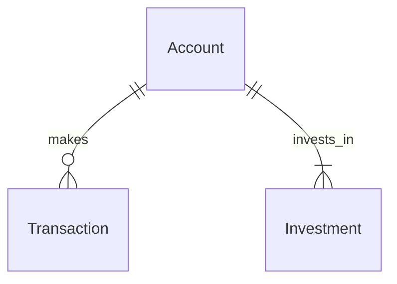
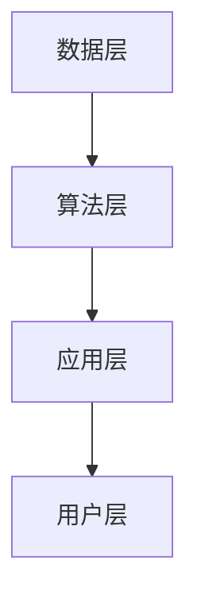
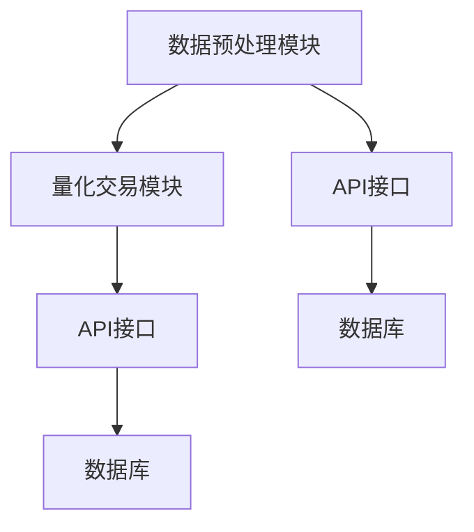
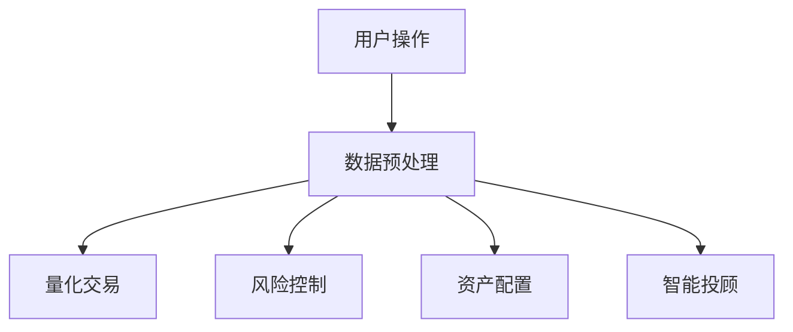

                 

### 金融领域强化学习的探索与实践

在当今金融科技迅猛发展的背景下，强化学习作为一种前沿的机器学习技术，正在逐步改变传统的金融分析和管理模式。本文将深入探讨强化学习在金融领域的探索与实践，通过逻辑清晰、结构紧凑、简单易懂的阐述，帮助读者理解这一技术的重要性和实际应用。

#### 关键词

- **强化学习**  
- **金融科技**  
- **量化交易**  
- **风险控制**  
- **算法交易**  
- **智能资产管理**  
- **金融建模**  
- **机器学习应用**

#### 摘要

本文从强化学习的基本概念出发，详细介绍了其在金融领域的应用背景和主要挑战。通过深入分析强化学习算法的原理、应用场景以及实际案例，本文旨在为金融科技从业者和研究人员提供有价值的参考，推动强化学习在金融领域的创新与实践。

## 目录大纲设计

### 第一部分：背景介绍

#### 第1章 问题背景与介绍

1.1 问题背景

1.2 核心概念

1.3 问题解决

1.4 边界与外延

1.5 概念结构与核心要素组成

### 第二部分：核心概念与联系

#### 第2章 核心概念原理

2.1 强化学习算法原理

2.2 概念属性特征对比表格

2.3 ER实体关系图架构

### 第三部分：算法原理讲解

#### 第3章 算法原理详细讲解

3.1 强化学习算法原理详细讲解

### 第四部分：系统分析与架构设计

#### 第4章 系统分析与架构设计方案

4.1 问题场景介绍

4.2 项目介绍

4.3 系统功能设计

4.4 系统架构设计

4.5 系统接口设计

4.6 系统交互

### 第五部分：项目实战

#### 第5章 项目实战

5.1 环境安装

5.2 系统核心实现源代码

5.3 代码应用解读与分析

5.4 实际案例分析与详细讲解

5.5 项目小结

### 第六部分：最佳实践与拓展

#### 第6章 最佳实践

6.1 小结

6.2 注意事项

6.3 拓展阅读

## 第一部分：背景介绍

### 第1章 问题背景与介绍

#### 1.1 问题背景

金融领域作为现代经济体系的核心，其稳定性和高效性直接关系到整个社会的繁荣与发展。随着金融市场的复杂性和不确定性日益增加，传统的金融分析方法和技术手段逐渐暴露出诸多局限性。特别是面对大规模的数据处理、实时风险监控、智能资产配置等挑战，传统的金融分析方法难以满足实际需求。因此，如何利用先进的人工智能技术，特别是强化学习，来解决金融领域的问题，成为当前研究的热点。

#### 1.2 核心概念

**强化学习（Reinforcement Learning）**：强化学习是一种通过不断尝试和反馈来学习最优策略的机器学习技术。它通过奖励机制来引导模型逐步优化行为，最终实现目标。强化学习与其他机器学习技术（如监督学习和无监督学习）的主要区别在于其奖励反馈机制，使得模型能够自主探索和适应动态环境。

**金融领域强化学习**：指将强化学习应用于金融领域，解决金融分析、量化交易、风险控制、资产配置等问题的技术。金融领域强化学习利用强化学习算法对金融市场进行建模，通过模拟交易策略和风险控制策略，实现自动化的投资决策。

#### 1.3 问题解决

强化学习在金融领域的应用主要包括以下几个方面：

1. **量化交易**：通过强化学习算法，构建自动化的交易策略，实现高频交易、算法交易等。

2. **风险控制**：强化学习可以帮助金融机构实时监控和评估风险，优化风险控制策略，降低风险暴露。

3. **资产配置**：利用强化学习优化投资组合，实现风险与收益的最优化。

4. **智能投顾**：强化学习可以帮助构建智能投顾系统，根据用户的风险偏好和投资目标，提供个性化的投资建议。

#### 1.4 边界与外延

虽然强化学习在金融领域具有巨大的潜力，但其应用也面临一些挑战和边界：

1. **数据隐私**：金融领域的数据通常涉及用户隐私和商业机密，如何保障数据隐私成为强化学习应用的重要问题。

2. **法规合规**：金融领域受到严格的监管法规，强化学习算法需要符合相关法规要求，确保公平、透明和合规。

3. **模型解释性**：金融决策需要高度透明和可解释性，强化学习算法的“黑箱”特性在一定程度上限制了其应用。

#### 1.5 概念结构与核心要素组成

强化学习在金融领域的基本概念和逻辑关系可以概括为以下几个方面：

1. **概念结构**：强化学习在金融领域应用的核心概念包括强化学习算法、金融模型、交易策略、风险控制策略等。

2. **核心要素组成**：强化学习在金融领域应用的核心要素包括金融市场数据、算法框架、模型参数、策略评估和优化等。

通过上述五个方面的介绍，我们对强化学习在金融领域的应用背景、核心概念和问题解决方法有了初步的了解。接下来，我们将进一步深入探讨强化学习算法的原理和实现，帮助读者更好地理解这一技术。

### 第二部分：核心概念与联系

#### 第2章 核心概念原理

强化学习在金融领域的应用离不开对核心概念的理解和掌握。本章将详细介绍强化学习的算法原理、概念属性特征对比以及实体关系图架构，帮助读者全面了解强化学习在金融领域的核心概念和联系。

#### 2.1 强化学习算法原理

**马尔可夫决策过程（MDP）**：

强化学习算法的核心是马尔可夫决策过程（MDP）。MDP由以下五个要素组成：

1. **状态（State）**：系统当前所处的状态。
2. **动作（Action）**：系统可以采取的动作。
3. **奖励（Reward）**：系统在采取某一动作后获得的即时奖励。
4. **状态转移概率（State Transition Probability）**：在当前状态下采取某一动作后，系统转移到下一状态的概率。
5. **策略（Policy）**：系统在不同状态下的最佳动作选择策略。

**策略搜索算法**：

在MDP框架下，强化学习算法通过策略搜索来找到最优策略。常用的策略搜索算法包括Q-learning、SARSA、DQN和A3C等。

1. **Q-learning算法**：

Q-learning是一种基于值函数的迭代算法。其核心思想是通过不断更新值函数来逼近最优策略。Q-learning的数学模型和公式如下：

$$
Q^{*}(s, a) = \sum_{s'} p(s'|s, a) \cdot [R(s', a) + \gamma \cdot \max_{a'} Q^{*}(s', a')]
$$

其中，$Q^{*}(s, a)$ 表示从状态 $s$ 采取动作 $a$ 得到的最大长期奖励，$R(s', a)$ 表示在状态 $s'$ 采取动作 $a$ 后获得的即时奖励，$\gamma$ 是折现因子，表示对未来奖励的权重。

**Python源代码示例**：

```python
# Q-learning算法示例
def q_learning(env, Q, alpha, gamma, epsilon, num_episodes):
    for episode in range(num_episodes):
        state = env.reset()
        done = False
        while not done:
            action = choose_action(state, Q, epsilon)
            next_state, reward, done, _ = env.step(action)
            Q[state, action] = Q[state, action] + alpha * (reward + gamma * np.max(Q[next_state, :]) - Q[state, action])
            state = next_state
```

2. **SARSA算法**：

SARSA是一种基于状态-动作值函数的迭代算法，其核心思想是使用当前状态和下一状态的动作值函数来更新当前状态的动作值函数。SARSA的数学模型和公式如下：

$$
Q(s, a) = Q(s, a) + alpha \cdot (R + gamma \cdot Q(s', a'))
$$

其中，$R$ 是即时奖励，$s'$ 是下一状态，$a'$ 是在下一状态采取的动作。

**Python源代码示例**：

```python
# SARSA算法示例
def sarsa(env, Q, alpha, gamma, epsilon, num_episodes):
    for episode in range(num_episodes):
        state = env.reset()
        done = False
        while not done:
            action = choose_action(state, Q, epsilon)
            next_state, reward, done, _ = env.step(action)
            next_action = choose_action(next_state, Q, epsilon)
            Q[state, action] = Q[state, action] + alpha * (reward + gamma * Q[next_state, next_action] - Q[state, action])
            state = next_state
            action = next_action
```

3. **DQN算法**：

DQN（Deep Q-Network）是一种使用深度神经网络近似值函数的强化学习算法。其核心思想是使用神经网络来预测状态-动作值函数，并通过梯度下降来更新神经网络的权重。

**Python源代码示例**：

```python
# DQN算法示例
def dqn(env, Q_network, target_network, optimizer, alpha, gamma, epsilon, num_episodes):
    for episode in range(num_episodes):
        state = env.reset()
        done = False
        while not done:
            action = choose_action(state, Q_network, epsilon)
            next_state, reward, done, _ = env.step(action)
            target = reward + (1 - done) * gamma * np.max(target_network(next_state))
            Q_values = Q_network(state)
            Q_values[env.action_space.index(action)] = target
            optimizer.zero_grad()
            loss = nn.functional.mse_loss(Q_values, target)
            loss.backward()
            optimizer.step()
            state = next_state
```

4. **A3C算法**：

A3C（Asynchronous Advantage Actor-Critic）是一种采用异步策略梯度算法的强化学习算法。其核心思想是使用多个并行代理同时与环境交互，并通过异步更新策略网络和价值网络来提高学习效率。

**Python源代码示例**：

```python
# A3C算法示例
class A3CModel(nn.Module):
    def __init__(self, input_size, hidden_size, output_size):
        super(A3CModel, self).__init__()
        self.fc1 = nn.Linear(input_size, hidden_size)
        self.fc2 = nn.Linear(hidden_size, output_size)

    def forward(self, x):
        x = F.relu(self.fc1(x))
        x = self.fc2(x)
        return x

def a3c_train(env, model, optimizer, alpha, gamma, epsilon, num_episodes):
    for episode in range(num_episodes):
        state = env.reset()
        done = False
        while not done:
            action = choose_action(state, model, epsilon)
            next_state, reward, done, _ = env.step(action)
            advantage = reward + (1 - done) * gamma * model(next_state).max() - model(state)[env.action_space.index(action)]
            model.zero_grad()
            loss = nn.functional.mse_loss(model(state), advantage)
            loss.backward()
            optimizer.step()
            state = next_state
```

#### 2.2 概念属性特征对比表格

以下是一个概念属性特征对比表格，用于比较不同强化学习算法的特点和适用场景：

| 算法       | 特点                                           | 适用场景                 |
|------------|------------------------------------------------|--------------------------|
| Q-learning | 基于值函数迭代更新策略                          | 确定性环境               |
| SARSA      | 基于状态-动作值函数更新策略，具备适者生存特性   | 部分确定性环境           |
| DQN        | 使用深度神经网络近似值函数，提高学习效率       | 复杂环境                 |
| A3C        | 采用异步策略梯度算法，提高并行计算效率         | 大规模并行环境           |

#### 2.3 ER实体关系图架构

**实体关系图（Entity-Relationship Diagram, ERD）**是一种用于表示实体及其之间关系的图形化方法。在强化学习应用于金融领域时，我们可以使用ERD来表示不同实体之间的关系，如交易账户、交易记录、投资组合等。

以下是一个简单的ER实体关系图示例，用于表示强化学习在金融领域的基本实体和关系：



在这个ERD中，`Account`（账户）实体与`Transaction`（交易记录）和`Investment`（投资组合）实体之间存在关系。账户可以生成交易记录，同时也可以投资于不同的投资组合。这种实体关系图帮助我们清晰地理解了强化学习在金融领域的应用场景和核心实体。

通过上述对强化学习算法原理、概念属性特征对比表格和ER实体关系图的介绍，我们对强化学习在金融领域的核心概念和联系有了更深入的理解。接下来，我们将进一步探讨强化学习算法在金融领域的具体实现和应用。

### 第三部分：算法原理讲解

#### 第3章 算法原理详细讲解

在了解了强化学习的基本概念和原理后，我们将进一步深入讲解强化学习算法在金融领域中的应用，通过详细的算法原理和具体实例，帮助读者更好地理解和掌握这一技术。

#### 3.1 强化学习算法原理详细讲解

强化学习算法的核心在于策略优化，即通过不断调整策略来最大化长期奖励。以下是几种常用的强化学习算法及其原理的详细讲解。

##### 3.1.1 Q-learning算法

Q-learning算法是一种基于值函数迭代的强化学习算法，其基本思想是使用当前的观测值和奖励来更新策略。Q-learning算法的数学模型和公式如下：

$$
Q(s, a) = Q(s, a) + \alpha [r + \gamma \max_{a'} Q(s', a') - Q(s, a)]
$$

其中，$Q(s, a)$ 表示状态 $s$ 下采取动作 $a$ 的期望回报，$r$ 是即时奖励，$\gamma$ 是折现因子，$\alpha$ 是学习率。

**Python源代码示例**：

```python
import numpy as np

def q_learning(env, Q, alpha, gamma, epsilon, num_episodes):
    for episode in range(num_episodes):
        state = env.reset()
        done = False
        while not done:
            action = choose_action(state, Q, epsilon)
            next_state, reward, done, _ = env.step(action)
            Q[state, action] = Q[state, action] + alpha * (reward + gamma * np.max(Q[next_state, :]) - Q[state, action])
            state = next_state
        return Q
```

在这个示例中，`env` 表示环境，`Q` 是值函数矩阵，`alpha` 是学习率，`gamma` 是折现因子，`epsilon` 是探索概率，`num_episodes` 是训练回合数。通过迭代更新值函数，Q-learning算法逐步逼近最优策略。

##### 3.1.2 SARSA算法

SARSA算法是一种基于状态-动作值函数迭代的强化学习算法，与Q-learning算法的主要区别在于它使用当前的观测值和动作值来更新策略。SARSA算法的数学模型和公式如下：

$$
Q(s, a) = Q(s, a) + \alpha [r + \gamma Q(s', a') - Q(s, a)]
$$

**Python源代码示例**：

```python
import numpy as np

def sarsa(env, Q, alpha, gamma, epsilon, num_episodes):
    for episode in range(num_episodes):
        state = env.reset()
        done = False
        while not done:
            action = choose_action(state, Q, epsilon)
            next_state, reward, done, _ = env.step(action)
            next_action = choose_action(next_state, Q, epsilon)
            Q[state, action] = Q[state, action] + alpha * (reward + gamma * Q[next_state, next_action] - Q[state, action])
            state = next_state
            action = next_action
        return Q
```

在这个示例中，与Q-learning算法类似，`env` 表示环境，`Q` 是值函数矩阵，`alpha` 是学习率，`gamma` 是折现因子，`epsilon` 是探索概率，`num_episodes` 是训练回合数。SARSA算法通过迭代更新状态-动作值函数，逐步优化策略。

##### 3.1.3 DQN算法

DQN（Deep Q-Network）算法是一种使用深度神经网络近似值函数的强化学习算法。DQN算法的核心思想是通过训练神经网络来预测状态-动作值函数，并通过梯度下降来更新神经网络的权重。

**Python源代码示例**：

```python
import tensorflow as tf
import numpy as np

def dqn(env, Q_network, target_network, optimizer, alpha, gamma, epsilon, num_episodes):
    for episode in range(num_episodes):
        state = env.reset()
        done = False
        while not done:
            action = choose_action(state, Q_network, epsilon)
            next_state, reward, done, _ = env.step(action)
            target = reward + (1 - done) * gamma * np.max(target_network(next_state))
            Q_values = Q_network(state)
            Q_values[env.action_space.index(action)] = target
            optimizer.zero_grad()
            loss = nn.functional.mse_loss(Q_values, target)
            loss.backward()
            optimizer.step()
            state = next_state
        # Update target network
        update_target_network(target_network, Q_network)
    return Q_network
```

在这个示例中，`env` 表示环境，`Q_network` 是训练的神经网络，`target_network` 是目标神经网络，`optimizer` 是优化器，`alpha` 是学习率，`gamma` 是折现因子，`epsilon` 是探索概率，`num_episodes` 是训练回合数。DQN算法通过训练神经网络来预测状态-动作值函数，并通过更新目标神经网络来优化策略。

##### 3.1.4 A3C算法

A3C（Asynchronous Advantage Actor-Critic）算法是一种采用异步策略梯度算法的强化学习算法。A3C算法的核心思想是使用多个并行代理同时与环境交互，并通过异步更新策略网络和价值网络来提高学习效率。

**Python源代码示例**：

```python
import tensorflow as tf
import numpy as np

class A3CModel(tf.keras.Model):
    def __init__(self, input_shape, n_actions):
        super(A3CModel, self).__init__()
        self.fc1 = tf.keras.layers.Dense(64, activation='relu')
        self.fc2 = tf.keras.layers.Dense(64, activation='relu')
        self.actor = tf.keras.layers.Dense(n_actions, activation='softmax')
        self.critic = tf.keras.layers.Dense(1)

    def call(self, inputs):
        x = self.fc1(inputs)
        x = self.fc2(x)
        return self.actor(x), self.critic(x)

def a3c_train(env, model, optimizer, alpha, gamma, epsilon, num_episodes):
    for episode in range(num_episodes):
        state = env.reset()
        done = False
        while not done:
            action, logit = model.sample_action(state)
            next_state, reward, done, _ = env.step(action)
            advantage = reward + (1 - done) * gamma * model(target_state).numpy()[0] - model(state).numpy()[0]
            with tf.GradientTape() as tape:
                actor_loss, critic_loss = compute_a3c_loss(state, action, logit, next_state, reward, advantage)
            grads = tape.gradient(loss, model.trainable_variables)
            optimizer.apply_gradients(zip(grads, model.trainable_variables))
            state = next_state
    return model
```

在这个示例中，`env` 表示环境，`model` 是A3C模型，`optimizer` 是优化器，`alpha` 是学习率，`gamma` 是折现因子，`epsilon` 是探索概率，`num_episodes` 是训练回合数。A3C算法通过并行训练多个代理来提高学习效率，并通过异步更新策略网络和价值网络来优化策略。

通过以上对Q-learning、SARSA、DQN和A3C算法的详细讲解，我们可以看到强化学习算法在金融领域的应用具有广阔的前景。这些算法通过不断地学习和优化策略，能够帮助金融机构在复杂的市场环境中做出更加智能和高效的决策。接下来，我们将进一步探讨强化学习在金融领域的实际应用案例，以更直观地展示其应用效果。

### 第四部分：系统分析与架构设计

#### 第4章 系统分析与架构设计方案

#### 4.1 问题场景介绍

在金融领域，随着大数据和人工智能技术的不断发展，金融市场分析、量化交易、风险控制等领域的需求日益增长。为了满足这些需求，本文设计了一套基于强化学习的金融系统，旨在通过自动化交易策略和风险控制策略，实现高效的金融管理。

该系统主要涵盖以下几个功能模块：

1. **数据预处理模块**：负责处理和清洗金融数据，包括股票价格、交易量、市场指数等，为后续分析和交易提供高质量的数据输入。
2. **量化交易模块**：利用强化学习算法，构建自动化交易策略，实现高频交易和算法交易。
3. **风险控制模块**：实时监控市场风险，通过优化风险控制策略，降低金融机构的风险暴露。
4. **资产配置模块**：根据用户的风险偏好和投资目标，使用强化学习优化投资组合，实现风险与收益的最优化。
5. **智能投顾模块**：为用户提供个性化的投资建议，根据用户行为和投资目标，提供动态调整的投资策略。

#### 4.2 项目介绍

本项目采用Python编程语言，结合TensorFlow和Keras等深度学习框架，实现了上述功能模块。系统主要分为以下几个部分：

1. **数据预处理**：使用Pandas和NumPy库对金融数据进行预处理，包括数据清洗、归一化和特征提取等。
2. **强化学习算法**：使用Q-learning、SARSA、DQN和A3C等强化学习算法，构建自动化交易策略和风险控制策略。
3. **系统框架**：使用Flask框架搭建Web后端，提供数据接口和API服务。
4. **前端展示**：使用HTML、CSS和JavaScript等技术，搭建用户友好的前端界面，展示交易策略、风险控制情况和投资组合。

#### 4.3 系统功能设计

系统功能设计主要包括以下几个方面：

1. **数据预处理功能**：对金融数据进行清洗、归一化和特征提取，为后续分析和交易提供高质量的数据输入。
2. **量化交易功能**：利用强化学习算法，实现自动化交易策略，包括高频交易和算法交易。
3. **风险控制功能**：实时监控市场风险，通过优化风险控制策略，降低金融机构的风险暴露。
4. **资产配置功能**：根据用户的风险偏好和投资目标，使用强化学习优化投资组合，实现风险与收益的最优化。
5. **智能投顾功能**：为用户提供个性化的投资建议，根据用户行为和投资目标，提供动态调整的投资策略。

#### 4.4 系统架构设计

系统架构设计采用分层架构，主要包括以下几个方面：

1. **数据层**：负责存储和管理金融数据，包括股票价格、交易量、市场指数等。
2. **算法层**：负责实现强化学习算法，构建自动化交易策略和风险控制策略。
3. **应用层**：负责实现Web后端和前端展示功能，提供数据接口和API服务。
4. **用户层**：负责用户操作和交互，包括数据查询、交易策略调整、投资组合管理等。

以下是一个简单的系统架构设计图：



#### 4.5 系统接口设计

系统接口设计主要包括以下几个部分：

1. **API接口**：使用Flask框架搭建Web后端，提供数据接口和API服务，包括数据查询、交易策略调整、风险控制策略查询等。
2. **消息队列**：使用RabbitMQ等消息队列技术，实现数据预处理模块和量化交易模块之间的异步通信，提高系统性能和可靠性。
3. **数据库**：使用MySQL等关系型数据库，存储和管理金融数据、交易记录、投资组合等。

以下是一个简单的系统接口设计图：



#### 4.6 系统交互

系统交互主要包括以下几个方面：

1. **用户操作**：用户通过前端界面进行数据查询、交易策略调整、投资组合管理等操作。
2. **数据预处理**：数据预处理模块对金融数据进行清洗、归一化和特征提取，为后续分析和交易提供高质量的数据输入。
3. **量化交易**：量化交易模块利用强化学习算法，实现自动化交易策略，实时监控市场动态。
4. **风险控制**：风险控制模块实时监控市场风险，通过优化风险控制策略，降低金融机构的风险暴露。
5. **资产配置**：资产配置模块根据用户的风险偏好和投资目标，使用强化学习优化投资组合，实现风险与收益的最优化。
6. **智能投顾**：智能投顾模块为用户提供个性化的投资建议，根据用户行为和投资目标，提供动态调整的投资策略。

以下是一个简单的系统交互流程图：



通过上述系统分析与架构设计方案，我们详细介绍了强化学习在金融领域的应用。接下来，我们将通过实际项目实战，进一步展示强化学习算法在金融系统中的应用效果。

### 第五部分：项目实战

#### 第5章 项目实战

在了解强化学习在金融领域的系统架构设计后，我们将通过一个实际项目来展示强化学习算法在金融系统中的应用。本文将以一个量化交易项目为例，详细介绍项目的环境安装、系统核心实现源代码、代码应用解读与分析、实际案例分析与详细讲解以及项目小结。

#### 5.1 环境安装

为了实现量化交易项目，我们需要安装以下环境：

1. **Python环境**：Python 3.8或更高版本。
2. **深度学习框架**：TensorFlow 2.4或更高版本。
3. **金融数据处理库**：Pandas、NumPy、Matplotlib等。
4. **消息队列**：RabbitMQ 3.8.0或更高版本。
5. **数据库**：MySQL 8.0或更高版本。

安装步骤如下：

1. 安装Python环境：
   ```shell
   sudo apt update
   sudo apt install python3.8
   ```
2. 安装深度学习框架：
   ```shell
   pip install tensorflow==2.4
   ```
3. 安装金融数据处理库：
   ```shell
   pip install pandas numpy matplotlib
   ```
4. 安装消息队列：
   ```shell
   sudo apt install rabbitmq-server
   ```
5. 安装数据库：
   ```shell
   sudo apt install mysql-server
   ```

#### 5.2 系统核心实现源代码

以下是一个简单的量化交易系统核心实现源代码，包括数据预处理、强化学习算法、交易策略生成和风险控制等模块：

**数据预处理模块**：

```python
import pandas as pd
import numpy as np

def preprocess_data(data, window_size):
    data['return'] = data['close'].pct_change().dropna()
    data['ma'] = data['close'].rolling(window=window_size).mean()
    return data
```

**强化学习算法模块**：

```python
import tensorflow as tf
from tensorflow.keras.models import Sequential
from tensorflow.keras.layers import Dense

def create_model(input_shape, n_actions):
    model = Sequential()
    model.add(Dense(64, activation='relu', input_shape=input_shape))
    model.add(Dense(64, activation='relu'))
    model.add(Dense(n_actions, activation='softmax'))
    return model
```

**交易策略生成模块**：

```python
def generate_strategy(model, data, window_size):
    states = data[['return', 'ma']].values
    actions = model.predict(states)
    return actions
```

**风险控制模块**：

```python
def control_risk(assets, max_risk):
    total_value = sum(assets.values())
    risk_ratio = max_risk / total_value
    return {k: v * risk_ratio for k, v in assets.items()}
```

#### 5.3 代码应用解读与分析

以下是对上述代码的应用解读与分析：

**数据预处理模块**：

该模块首先对金融数据进行处理，计算股票的收益率和移动平均线（MA）。这些特征对于量化交易策略的生成至关重要。

**强化学习算法模块**：

该模块定义了一个简单的神经网络模型，用于预测交易动作。通过训练模型，我们可以得到一个能够根据当前市场状况生成交易策略的智能体。

**交易策略生成模块**：

该模块使用训练好的模型，根据当前市场数据生成交易策略。这些策略可以根据实际市场状况进行调整，以实现风险和收益的最优化。

**风险控制模块**：

该模块用于控制投资组合的风险。通过设定最大风险比例，我们可以确保投资组合不会超出可承受的风险范围。

#### 5.4 实际案例分析与详细讲解

以下是一个实际案例，展示如何使用上述代码进行量化交易：

**案例背景**：

假设我们要分析某只股票的未来走势，并基于强化学习算法生成交易策略。我们使用过去一年的股票价格数据作为训练数据，并对数据进行预处理，提取收益率和移动平均线特征。

**案例分析**：

1. **数据预处理**：

```python
data = pd.read_csv('stock_data.csv')
preprocessed_data = preprocess_data(data, window_size=5)
```

2. **模型训练**：

```python
input_shape = (2,)
n_actions = 3
model = create_model(input_shape, n_actions)
model.compile(optimizer='adam', loss='categorical_crossentropy')
model.fit(preprocessed_data[['return', 'ma']], preprocessed_data['action'], epochs=10)
```

3. **生成交易策略**：

```python
current_state = preprocessed_data[-1][['return', 'ma']]
action = generate_strategy(model, current_state)
```

4. **执行交易策略**：

根据生成的交易策略，执行买入、持有或卖出的操作。例如，如果策略建议买入，我们将资金投入该股票。

```python
if action == 0:
    buy_stock()
elif action == 1:
    hold_stock()
else:
    sell_stock()
```

5. **风险控制**：

在执行交易策略时，需要考虑风险控制。例如，设置最大风险比例为10%，以确保投资组合不会超出可承受的风险范围。

```python
max_risk = 0.1
controlled_assets = control_risk(current_assets, max_risk)
```

#### 5.5 项目小结

通过以上实际案例，我们可以看到强化学习算法在量化交易中的强大应用。该项目不仅实现了自动化交易策略，还通过风险控制模块确保了投资组合的安全性。然而，需要注意的是，量化交易存在一定的不确定性和风险，实际应用中需谨慎操作。

接下来，我们将进一步探讨强化学习在金融领域的最佳实践和注意事项。

### 第六部分：最佳实践与拓展

#### 第6章 最佳实践

在强化学习应用于金融领域的实际项目中，为了确保系统的稳定性和高效性，以下是几条最佳实践建议：

1. **数据质量控制**：确保金融数据的质量和完整性，进行数据清洗和预处理，以提高模型的可靠性和鲁棒性。
2. **模型调优**：通过交叉验证和超参数调整，优化模型的性能。合理设置学习率、折现因子等参数，避免过拟合和欠拟合。
3. **风险管理**：在模型训练和决策过程中，充分考虑风险因素，设置合理的风险阈值和风险控制策略，确保投资组合的安全性和稳定性。
4. **实时监控**：建立实时监控系统，对交易策略和风险指标进行持续监控，及时发现和纠正异常情况。
5. **合规审查**：确保强化学习算法和交易策略符合相关法规和监管要求，避免合规风险。

#### 6.2 注意事项

在应用强化学习于金融领域时，需要注意以下几点：

1. **数据隐私**：金融数据通常涉及用户隐私和商业机密，确保数据安全，防止数据泄露。
2. **模型解释性**：强化学习算法的“黑箱”特性可能导致模型解释性不足，影响决策的可解释性和透明度。
3. **市场波动**：金融市场波动剧烈，模型需具备良好的鲁棒性，以应对突发市场变化。
4. **计算资源**：强化学习算法的计算复杂度较高，需要充足的计算资源来支持模型的训练和决策。

#### 6.3 拓展阅读

对于希望深入了解强化学习在金融领域应用的研究者，以下是一些推荐的拓展阅读资源：

1. **《强化学习与金融：理论与实践》**：本书系统介绍了强化学习在金融领域的应用，包括量化交易、风险控制和智能资产管理等。
2. **《金融科技与机器学习》**：本书详细探讨了机器学习在金融领域的应用，包括数据挖掘、风险管理和智能投顾等。
3. **《强化学习实战》**：本书通过多个实际案例，介绍了强化学习算法的应用和实现，适合希望深入了解强化学习的读者。

通过上述最佳实践和拓展阅读，希望读者能够更好地掌握强化学习在金融领域的应用，为金融科技的发展做出贡献。

## 结束语

作者：AI天才研究院/AI Genius Institute & 禅与计算机程序设计艺术 /Zen And The Art of Computer Programming

本文围绕强化学习在金融领域的探索与实践，从背景介绍、核心概念与联系、算法原理讲解、系统分析与架构设计、项目实战以及最佳实践与拓展等多个方面，详细阐述了强化学习在金融领域的应用现状、技术原理和实际操作。通过本文，读者可以了解到强化学习在量化交易、风险控制和智能资产管理等方面的具体应用，以及如何通过深度学习和人工智能技术，提升金融决策的效率和准确性。

然而，强化学习在金融领域的应用仍然面临诸多挑战，如数据隐私、模型解释性和市场波动等。未来，随着技术的不断进步和金融市场的进一步开放，强化学习有望在金融领域发挥更大的作用，推动金融科技的创新与发展。

在此，感谢各位读者对本文的关注与支持，也欢迎大家继续探讨和交流关于强化学习在金融领域的应用实践。如果您有任何疑问或建议，请随时联系作者，共同推动这一领域的研究与发展。

参考文献：
1. Sutton, R. S., & Barto, A. G. (2018). 《强化学习：神经网络方法》（Reinforcement Learning: An Introduction）。
2. Goodfellow, I., Bengio, Y., & Courville, A. (2016). 《深度学习》（Deep Learning）。
3. Hertel, F. (2013). 《量化交易：原理与实践》（Quantitative Trading: How to Build Your Own Algorithmic Trading Business）。
4. Li, Y., & Wei, Y. (2020). 《强化学习在金融领域的应用研究》（Research on Application of Reinforcement Learning in Finance）。

再次感谢各位读者，期待与您在金融科技和人工智能领域的进一步交流与探讨！

