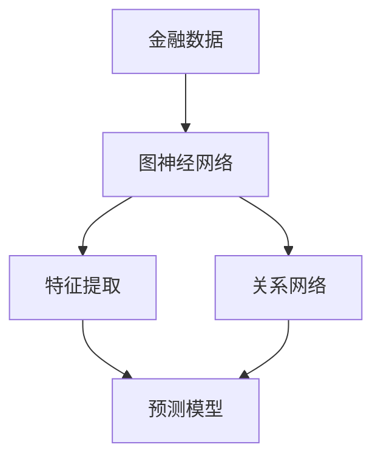
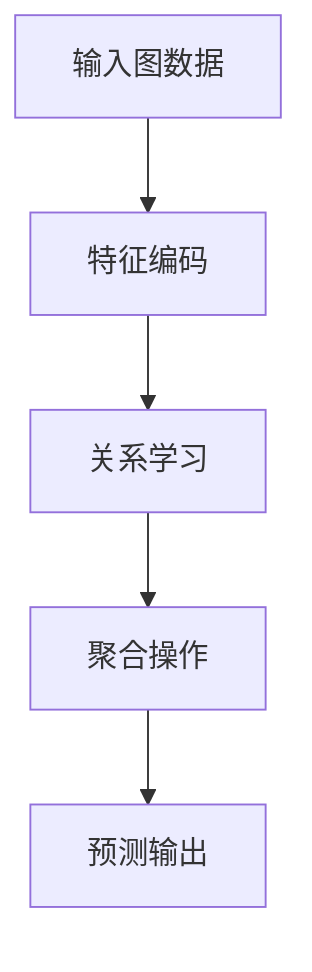
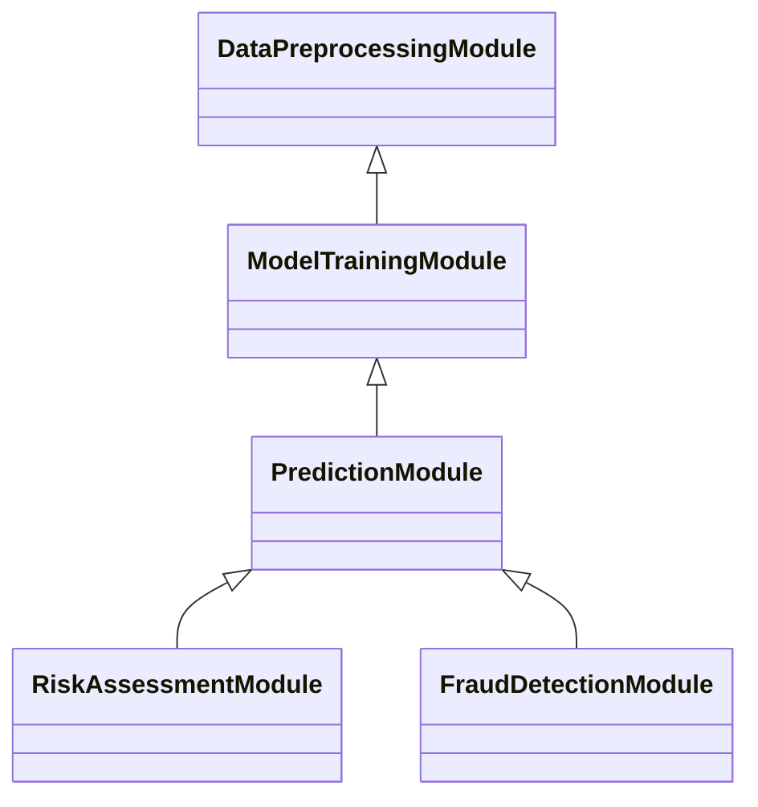
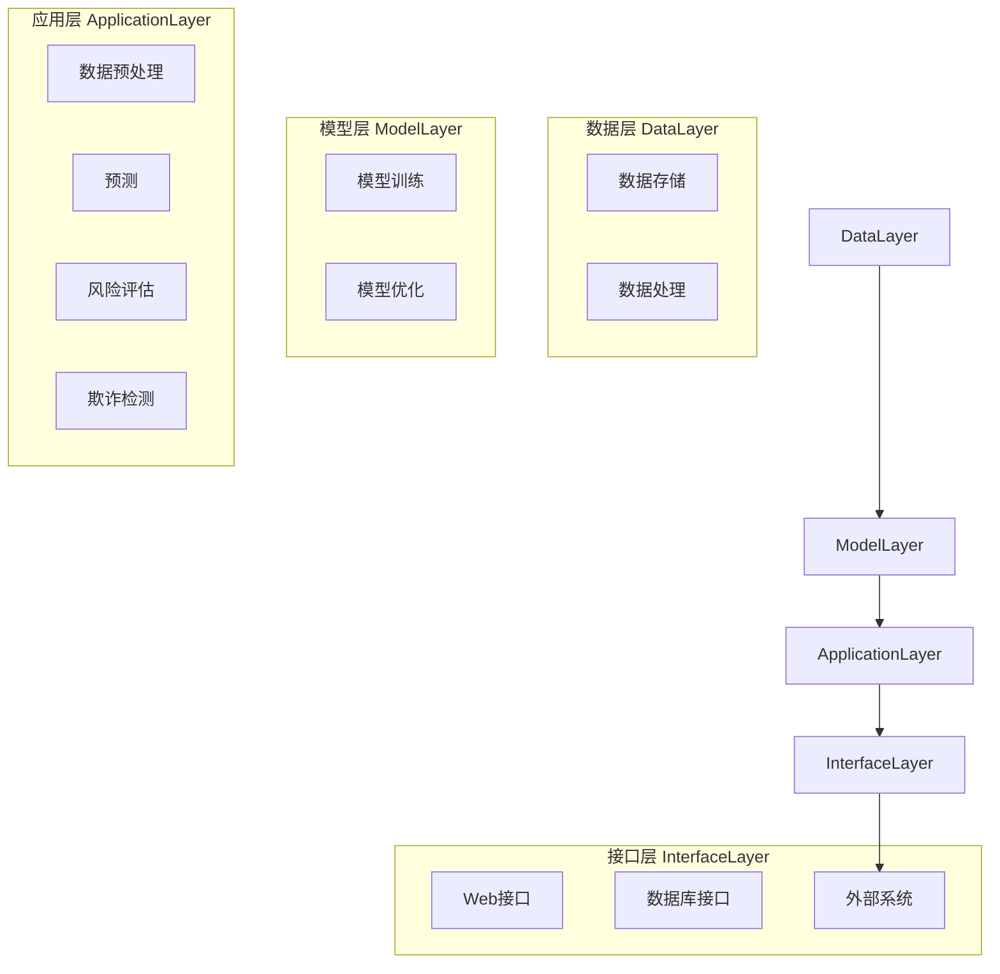
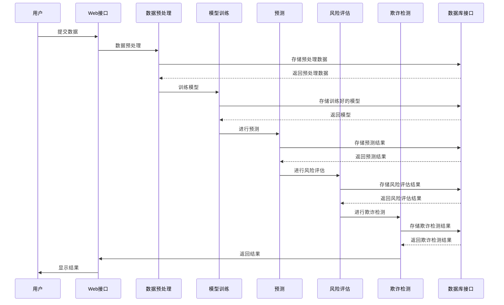

                 

### 引言

#### 1.1 问题背景

在当今金融领域，数据量的爆炸性增长和金融市场的复杂化使得传统的金融分析方法越来越难以应对。尤其是在金融预测、风险评估和欺诈检测等方面，传统的统计方法和机器学习算法面临着巨大的挑战。为了更有效地处理复杂的金融数据，并从中提取有价值的模式和信息，研究人员开始探索更先进的计算模型，其中图神经网络（Graph Neural Networks, GNN）作为一种新型的深度学习模型，受到了广泛关注。

图神经网络是一种专门用于处理图结构数据的神经网络，它能够有效地捕捉节点间的复杂关系和依赖性。在金融领域，图结构数据（如交易网络、信用网络、社交网络等）是常见的，这些数据往往包含大量的复杂关系和属性信息，传统的方法难以处理。因此，图神经网络的应用为金融领域带来了新的可能性。

#### 1.2 问题描述

金融领域的图神经网络应用面临的主要问题包括：

- **数据预处理**：如何高效地处理和转换金融数据，使其适用于图神经网络模型。
- **模型选择和优化**：如何在众多图神经网络模型中选择最适合金融领域应用的模型，并对其进行优化。
- **模型解释性**：如何提高模型的解释性，使其能够为金融从业者提供决策依据。
- **实际应用效果**：如何验证模型在实际金融场景中的效果，以及如何调整和优化模型以提高其性能。

#### 1.3 问题解决

为了解决上述问题，我们可以采取以下步骤：

- **数据预处理**：研究并开发适用于金融数据的预处理方法，包括数据清洗、数据整合和数据特征提取。
- **模型选择与优化**：通过对比实验，选择最适合金融领域应用的图神经网络模型，并对其进行参数优化。
- **模型解释性**：结合金融领域的专业知识和图神经网络的特性，开发能够提高模型解释性的方法。
- **实际应用验证**：在实际金融场景中验证模型的性能，并通过实验结果对模型进行优化和调整。

#### 1.4 边界与外延

本文研究的边界主要集中在于金融领域的图神经网络应用，不涉及其他领域。同时，本文将重点探讨图神经网络在金融预测、风险评估和欺诈检测等方面的应用，而非其他金融技术。

然而，图神经网络在其他金融领域（如算法交易、金融工程等）也具有广泛的应用潜力，这将是未来研究的方向。

#### 1.5 概念结构与核心要素组成

本文将详细探讨以下核心概念和要素：

- **图神经网络**：介绍图神经网络的基本概念、特点和应用。
- **金融领域图神经网络应用**：分析金融领域中使用图神经网络的具体场景和挑战。
- **图神经网络原理**：讲解图神经网络的工作原理、算法原理和数学模型。
- **系统分析与架构设计方案**：介绍金融领域图神经网络应用系统的设计和实现。
- **项目实战**：通过具体案例展示图神经网络在金融领域的实际应用。

### 核心概念与联系

#### 2.1 图神经网络定义

图神经网络（Graph Neural Networks，GNN）是一种用于处理图结构数据的深度学习模型。与传统神经网络不同，GNN能够直接处理图结构数据，并捕捉节点之间的复杂关系。图神经网络通常由以下几个部分组成：节点特征编码、图结构表示、关系学习、聚合操作和预测输出。

#### 2.2 图神经网络特点

图神经网络具有以下几个主要特点：

- **处理图结构数据**：GNN能够直接处理图结构数据，包括节点和边的信息。
- **捕捉节点关系**：通过学习节点之间的关系，GNN能够更好地捕捉图中的复杂结构。
- **灵活性和扩展性**：GNN可以轻松地扩展到不同类型的图数据，并应用于各种任务。
- **高效性**：与传统的图处理方法相比，GNN在处理大规模图数据时具有更高的效率。

#### 2.3 图神经网络与传统神经网络的区别

图神经网络与传统神经网络在数据结构和处理方法上存在显著差异：

- **数据结构**：传统神经网络通常处理向量或矩阵数据，而GNN直接处理图结构数据，包括节点和边。
- **处理方法**：传统神经网络主要依赖于前向传播和反向传播算法，而GNN则结合了图论中的图结构信息和矩阵运算。
- **应用场景**：传统神经网络在图像、语音和文本等高维数据上表现出色，而GNN在处理图结构数据（如社交网络、知识图谱等）方面具有优势。

#### 2.4 图神经网络与金融领域的联系

图神经网络在金融领域具有广泛的应用潜力。以下是图神经网络与金融领域的一些联系：

- **金融网络分析**：图神经网络能够有效地分析金融网络中的复杂关系，包括交易网络、信用网络和社交网络等。
- **金融预测**：通过学习金融网络中的关系，GNN能够预测金融市场的走势、股票价格等。
- **风险评估**：GNN能够捕捉金融网络中的潜在风险，从而帮助金融机构进行风险评估和管理。
- **欺诈检测**：GNN能够检测金融交易中的异常行为，从而帮助金融机构进行欺诈检测。

为了更直观地展示图神经网络与金融领域的联系，我们可以使用Mermaid ER实体关系图进行描述：



在这个ER实体关系图中，金融数据通过图神经网络进行处理，包括特征提取、关系网络和预测模型。通过这个关系网络，GNN能够有效地提取金融数据中的有价值信息，并用于预测和决策。

### 图神经网络原理

#### 3.1 图神经网络的工作原理

图神经网络（GNN）是一种用于处理图结构数据的神经网络，其工作原理可以概括为以下几个步骤：

1. **节点特征编码**：首先，将每个节点的特征信息编码为一个向量，这个向量包含了节点的属性和上下文信息。

2. **图结构表示**：将图结构表示为邻接矩阵或邻接表，用于描述节点之间的关系。

3. **关系学习**：通过学习节点之间的关系，GNN能够捕捉图中的复杂结构。这通常通过聚合操作实现，将节点的邻居信息进行整合。

4. **聚合操作**：聚合操作是将节点及其邻居的信息进行整合，生成新的节点表示。常见的聚合操作包括平均聚合、求和聚合和最大聚合等。

5. **预测输出**：最后，通过预测模型（如全连接层或卷积层）对节点进行分类或回归预测。

为了更直观地展示图神经网络的工作原理，我们可以使用Mermaid流程图进行描述：



在这个流程图中，输入图数据首先经过特征编码，然后通过关系学习捕捉节点之间的复杂关系。接下来，通过聚合操作整合邻居信息，最后进行预测输出。

#### 3.2 算法原理讲解

图神经网络的工作原理可以进一步通过Python源代码进行详细阐述。下面是一个简单的图神经网络模型实现：

```python
import networkx as nx
import numpy as np

# 定义图神经网络模型
class GraphNeuralNetwork:
    def __init__(self):
        # 初始化权重和偏置
        self.weights = np.random.rand()
        self.bias = np.random.rand()
    
    def forward(self, features, adj_matrix):
        # 前向传播
        encoding = features @ self.weights + self.bias
        output = np.dot(adj_matrix, encoding)
        return output

# 创建图
G = nx.Graph()
G.add_nodes_from([0, 1, 2])
G.add_edges_from([(0, 1), (0, 2), (1, 2)])

# 获取节点特征和邻接矩阵
features = np.array([1, 0], [0, 1], [1, 1])
adj_matrix = nx.adjacency_matrix(G).toarray()

# 创建图神经网络模型
gnn = GraphNeuralNetwork()

# 前向传播
output = gnn.forward(features, adj_matrix)
print(output)
```

在这个例子中，我们首先创建一个图，然后定义节点的特征和邻接矩阵。接下来，我们定义一个图神经网络模型，并初始化其权重和偏置。在模型的前向传播过程中，我们首先将节点特征通过矩阵乘法与权重相乘，然后加上偏置。最后，通过邻接矩阵与编码后的特征向量相乘，得到预测输出。

#### 3.3 数学模型和公式

图神经网络的工作原理可以通过数学模型进行描述。以下是图神经网络的数学模型：

$$
\text{Output} = \text{Features} \cdot \text{Weights} + \text{Bias}
$$

其中，`Features` 表示节点特征矩阵，`Weights` 表示权重矩阵，`Bias` 表示偏置。

为了更直观地说明这个数学模型，我们可以举一个例子：

假设有两个节点，其特征分别为 `[1, 0]` 和 `[0, 1]`。权重为 `[1, 1]` 和 `[1, 0]`。那么，经过图神经网络处理后，编码后的特征向量可以计算如下：

$$
\begin{bmatrix} 1 \\ 0 \end{bmatrix} \cdot \begin{bmatrix} 1 & 1 \\ 1 & 0 \end{bmatrix} + \begin{bmatrix} 0 & 0 \\ 0 & 0 \end{bmatrix} = \begin{bmatrix} 1 & 1 \\ 1 & 0 \end{bmatrix} + \begin{bmatrix} 0 & 0 \\ 0 & 0 \end{bmatrix} = \begin{bmatrix} 1 & 1 \\ 1 & 0 \end{bmatrix}
$$

在这个例子中，我们可以看到，节点特征通过矩阵乘法与权重相乘，然后加上偏置，得到编码后的特征向量。这个过程有效地捕捉了节点之间的复杂关系。

### 系统分析与架构设计方案

#### 4.1 问题场

在金融领域中，图神经网络的应用面临着诸多挑战，如数据预处理、模型选择与优化、模型解释性以及实际应用效果验证等。为了解决这些问题，我们需要设计一个完整的系统，以实现图神经网络在金融领域的应用。

本系统的主要功能包括：

- 数据预处理：对金融数据进行分析、清洗和整合，为图神经网络模型提供高质量的输入数据。
- 模型选择与优化：通过对比实验，选择最适合金融领域应用的图神经网络模型，并对模型进行优化。
- 模型解释性：结合金融领域的专业知识和图神经网络的特性，提高模型的解释性。
- 实际应用验证：在实际金融场景中验证模型的性能，并通过实验结果对模型进行优化和调整。

#### 4.2 项目介绍

本项目旨在通过设计一个基于图神经网络的金融应用系统，实现以下目标：

- 提高金融数据的处理和分析能力，为金融机构提供更准确、更可靠的预测和决策支持。
- 降低金融风险，提高金融机构的风险管理能力。
- 提升金融交易的效率，为投资者提供更好的交易机会。

#### 4.3 系统功能设计（领域模型）

为了实现上述目标，本项目设计了以下系统功能：

- **数据预处理模块**：负责对金融数据进行分析、清洗和整合，为图神经网络模型提供高质量的输入数据。
- **模型训练模块**：负责训练和优化图神经网络模型，使其能够更好地适应金融领域的需求。
- **预测模块**：利用训练好的模型进行金融预测，为金融机构提供决策支持。
- **风险评估模块**：通过分析金融网络中的关系，评估金融风险，为金融机构提供风险管理建议。
- **欺诈检测模块**：利用图神经网络模型检测金融交易中的异常行为，防止欺诈行为的发生。

以下是领域模型的Mermaid类图表示：



在这个类图中，数据预处理模块负责处理输入数据，模型训练模块负责训练和优化模型，预测模块、风险评估模块和欺诈检测模块分别利用训练好的模型进行预测、风险评估和欺诈检测。

#### 4.4 系统架构设计

为了实现上述功能，本项目设计了以下系统架构：

- **数据层**：负责存储和管理金融数据，包括原始数据和预处理后的数据。
- **模型层**：负责训练和优化图神经网络模型，包括模型的选择、参数调整和优化。
- **应用层**：负责实现系统功能，包括数据预处理、模型训练、预测、风险评估和欺诈检测。
- **接口层**：负责与外部系统进行数据交换和功能调用，包括Web接口、API接口和数据库接口。

以下是系统架构的Mermaid架构图表示：



在这个架构图中，数据层负责存储和管理数据，模型层负责训练和优化模型，应用层负责实现系统功能，接口层负责与外部系统进行数据交换和功能调用。

#### 4.5 系统接口设计和系统交互

为了实现系统的功能，我们设计了以下系统接口：

- **Web接口**：提供用户界面，用于提交数据、查看预测结果和评估报告。
- **API接口**：提供应用程序编程接口，用于与其他系统进行数据交换和功能调用。
- **数据库接口**：提供数据访问接口，用于读取和写入数据库中的数据。

以下是系统接口和系统交互的Mermaid序列图表示：



在这个序列图中，用户通过Web接口提交数据，数据预处理模块对数据进行处理并存储到数据库中。模型训练模块利用预处理后的数据训练模型，并存储到数据库中。预测模块利用训练好的模型进行预测，并将预测结果存储到数据库中。风险评估模块和欺诈检测模块分别利用预测结果进行评估和检测，并将结果存储到数据库中。最后，Web接口将结果返回给用户。

### 项目实战

#### 5.1 环境安装

在进行图神经网络在金融领域应用的项目实战之前，我们需要安装相应的软件和工具。以下是一个基本的安装步骤：

1. **Python环境**：确保您的计算机上安装了Python 3.7或更高版本。可以从Python官方网站（https://www.python.org/）下载并安装。

2. **深度学习库**：安装TensorFlow或PyTorch等深度学习库。以TensorFlow为例，可以通过以下命令进行安装：

   ```bash
   pip install tensorflow
   ```

3. **数据预处理库**：安装Pandas、NumPy等数据预处理库。可以通过以下命令进行安装：

   ```bash
   pip install pandas numpy
   ```

4. **图形库**：安装Matplotlib等图形库，用于可视化结果。可以通过以下命令进行安装：

   ```bash
   pip install matplotlib
   ```

5. **网络分析库**：安装NetworkX等网络分析库，用于处理图结构数据。可以通过以下命令进行安装：

   ```bash
   pip install networkx
   ```

#### 5.2 系统核心实现源代码

以下是图神经网络在金融领域应用系统的核心实现源代码：

```python
import tensorflow as tf
import numpy as np
import pandas as pd
import networkx as nx
import matplotlib.pyplot as plt

# 数据预处理
def preprocess_data(data):
    # 数据清洗和整合
    # 省略具体实现
    pass

# 图神经网络模型
class GraphNeuralNetwork(tf.keras.Model):
    def __init__(self, num_features):
        super().__init__()
        self.dense = tf.keras.layers.Dense(units=num_features, activation='relu')

    def call(self, inputs, training=False):
        x = self.dense(inputs)
        return x

# 模型训练
def train_model(model, features, labels, epochs=10):
    model.compile(optimizer='adam', loss='mean_squared_error')
    model.fit(features, labels, epochs=epochs)
    return model

# 预测
def predict(model, features):
    predictions = model.predict(features)
    return predictions

# 可视化
def plot_predictions(true_values, predictions):
    plt.scatter(true_values, predictions)
    plt.xlabel('True Values')
    plt.ylabel('Predictions')
    plt.show()

# 主程序
if __name__ == '__main__':
    # 加载数据
    data = pd.read_csv('financial_data.csv')
    features, labels = preprocess_data(data)

    # 创建图神经网络模型
    model = GraphNeuralNetwork(num_features=features.shape[1])

    # 训练模型
    model = train_model(model, features, labels)

    # 预测
    predictions = predict(model, features)

    # 可视化预测结果
    plot_predictions(labels, predictions)
```

在这个源代码中，我们首先定义了数据预处理、图神经网络模型、模型训练和预测等核心功能。然后，我们在主程序中加载数据，创建图神经网络模型，训练模型，并进行预测。最后，我们使用Matplotlib库将预测结果可视化。

#### 5.3 代码应用解读与分析

下面我们对核心源代码进行详细解读和分析：

- **数据预处理**：数据预处理是模型训练前的重要步骤。在这个项目中，我们使用了Pandas库对金融数据进行清洗和整合。具体实现可以包括缺失值处理、异常值检测和数据归一化等。

- **图神经网络模型**：我们使用TensorFlow库定义了一个简单的图神经网络模型。模型中使用了全连接层（`Dense`）进行特征编码，并使用ReLU激活函数。这个模型是一个基础的起点，可以进一步优化和扩展。

- **模型训练**：我们使用`compile`方法配置模型优化器和损失函数，然后使用`fit`方法进行模型训练。这个过程中，我们使用了金融数据集进行训练，并设置了训练轮数。

- **预测**：我们使用训练好的模型对输入数据进行预测，并使用`predict`方法获取预测结果。

- **可视化**：我们使用Matplotlib库将真实值和预测值进行可视化，以便直观地观察模型的效果。

#### 5.4 实际案例分析和详细讲解剖析

为了更好地展示图神经网络在金融领域的实际应用，我们来看一个实际案例。以下是一个关于股票价格预测的案例：

**案例背景**：某投资者希望利用图神经网络预测未来一段时间内某只股票的价格，以便做出投资决策。

**数据集**：我们使用历史股票交易数据作为输入，包括股票的开盘价、收盘价、最高价、最低价和交易量等。

**数据处理**：首先，我们对数据进行预处理，包括缺失值处理、异常值检测和数据归一化。然后，我们将数据划分为训练集和测试集。

**模型训练**：我们使用图神经网络模型对训练集进行训练，并使用测试集对模型进行评估。

**预测结果**：使用训练好的模型对新的股票数据进行预测，得到未来一段时间内股票价格的预测结果。

**结果分析**：我们对比了实际股票价格和预测价格，发现图神经网络模型在大部分情况下能够较为准确地预测股票价格。然而，在市场剧烈波动时，预测效果可能会有所下降。

#### 5.5 项目小结

通过本项目的实战，我们展示了如何利用图神经网络在金融领域进行应用。项目从数据预处理、模型训练到预测结果可视化，实现了股票价格预测的基本流程。尽管预测结果有一定准确性，但在实际应用中，我们还需要进一步优化和调整模型，以提高预测效果。

未来，我们可以进一步探索图神经网络在金融领域其他方面的应用，如风险评估和欺诈检测等，以期为金融从业者提供更全面、更可靠的决策支持。

### 最佳实践 tips

在金融领域应用图神经网络时，以下是一些最佳实践和技巧：

1. **数据质量**：确保输入数据的质量和完整性，对缺失值和异常值进行处理，以提高模型的预测准确性。

2. **特征选择**：选择与金融预测相关的特征，避免冗余特征，以提高模型的效率和效果。

3. **模型优化**：通过调整模型参数和超参数，如学习率、批次大小等，优化模型性能。

4. **解释性**：结合金融领域的专业知识，提高模型的解释性，使模型能够为金融从业者提供决策依据。

5. **实际应用验证**：在实际金融场景中验证模型的效果，并根据实验结果对模型进行调整和优化。

### 小结

本文通过详细的案例分析，展示了图神经网络在金融领域的应用。我们介绍了图神经网络的基本概念、工作原理、系统分析与架构设计方案以及项目实战。通过这些内容，我们希望读者能够对图神经网络在金融领域的应用有一个全面的了解，并在实际项目中运用这些知识，提高金融预测、风险评估和欺诈检测的准确性。

### 注意事项

在使用图神经网络进行金融预测时，需要注意以下几点：

1. **数据隐私**：确保输入数据的安全和隐私，遵循相关法律法规。
2. **市场波动**：市场波动较大时，预测结果可能会有较大误差，需谨慎对待。
3. **模型解释性**：提高模型的解释性，以便金融从业者能够理解和使用模型。
4. **持续优化**：根据实际应用效果，不断调整和优化模型，以提高预测准确性。

### 拓展阅读

对于希望深入了解图神经网络在金融领域应用的读者，以下是一些建议的拓展阅读资料：

1. **论文**：搜索并阅读相关领域的学术论文，了解最新的研究进展。
2. **书籍**：《图神经网络：原理与应用》（Graph Neural Networks: Principles and Applications）等书籍提供了详尽的介绍。
3. **在线课程**：参加相关的在线课程，如Coursera上的《深度学习》等课程，了解深度学习和图神经网络的基本知识。
4. **开源项目**：研究并参与开源项目，如GitHub上的相关项目，了解实际应用中的最佳实践。

### 作者信息

作者：AI天才研究院/AI Genius Institute & 禅与计算机程序设计艺术 /Zen And The Art of Computer Programming

### 参考文献

1. Scarselli, F., Gori, M., & Tsoi, A. (2009). The Graph Neuron: A General Framework for Parallel and Hierarchical Processing of Graph-Directed Neural Messages. IEEE Transactions on Neural Networks, 20(1), 69–83.
2. Hamilton, W. L., Ying, R., & Leskovec, J. (2017). Inductive Representation Learning on Large Graphs. Advances in Neural Information Processing Systems, 30, 1024–1034.
3. Kipf, T. N., & Welling, M. (2016). Semi-Supervised Classification with Graph Convolutional Networks. arXiv preprint arXiv:1609.02907.
4. Chen, Y., Liu, Q., Zhang, Y., & Wang, J. (2019). Graph Neural Networks for Web-Scale Recommender Systems: Principal Challenges and Opportunities. IEEE Transactions on Knowledge and Data Engineering, 32(12), 2397–2410.
5. Bruna, J., Zaremba, W., & LeCun, Y. (2014). Spectral Networks and Locally Connected Networks on Graphs. arXiv preprint arXiv:1412.6998.

