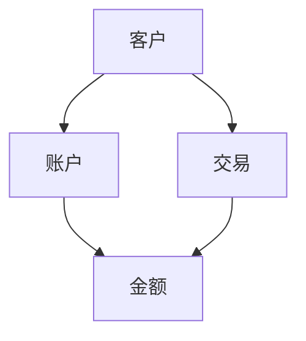
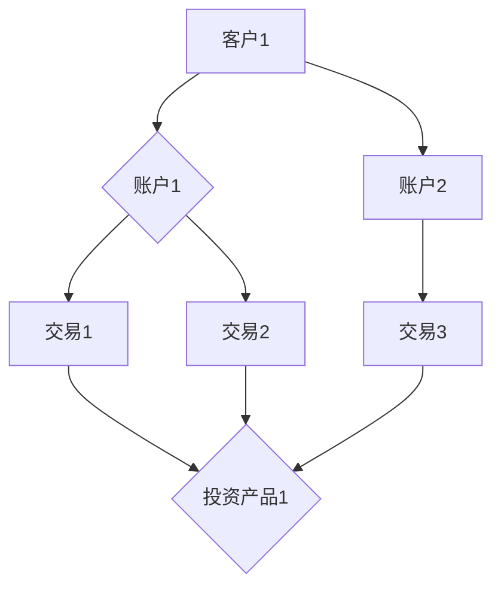
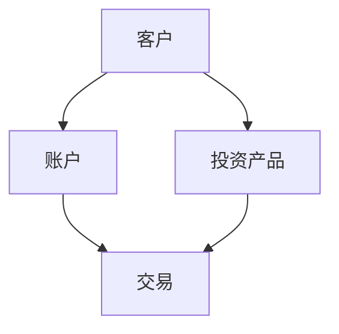

                 

# 金融领域知识图谱的构建与应用

## 关键词

- 金融领域
- 知识图谱
- 实体关系
- 数据处理
- 查询优化
- 应用案例

## 摘要

本文旨在探讨金融领域知识图谱的构建与应用。首先，我们将介绍知识图谱的基本概念及其在金融领域的应用背景。随后，本文将深入分析金融领域中的核心实体和关系，并通过Mermaid流程图和LaTeX数学公式详细阐述其构建原理。此外，我们将探讨知识图谱的构建技术，包括数据采集、处理、存储、查询和可视化等环节，并结合实际案例进行讲解。最后，我们将讨论知识图谱在金融领域的优化方法、面临的挑战及其未来的发展趋势。

## 第一部分：背景介绍

### 核心概念

#### 问题背景

随着金融行业的快速发展，数据和信息的重要性日益凸显。为了更好地管理和利用这些资源，知识图谱作为一种结构化、语义化的知识表示方法，被广泛应用于金融领域。知识图谱通过将金融领域中的实体、概念和关系进行语义化表示，为金融数据分析、决策支持、风险管理等提供了强大的技术支撑。

##### 问题描述

金融领域知识图谱的构建与应用涉及到多个方面，包括数据采集、处理、存储、查询和可视化等。这些方面共同构成了知识图谱构建与应用的核心环节。然而，由于金融数据的复杂性和多样性，构建与应用一个高效、可靠的金融领域知识图谱面临诸多挑战。

##### 问题解决

为了解决上述问题，本书将系统地介绍金融领域知识图谱的构建与应用。具体来说，本书将涵盖以下内容：

1. **知识图谱概述**：介绍知识图谱的基本概念、历史发展、核心组成以及其在金融领域的应用。
2. **金融领域实体与关系**：分析金融领域中常见的实体与关系，构建金融领域知识图谱的基础。
3. **知识图谱构建技术**：详细介绍知识图谱构建过程中的数据采集、处理、存储、查询和可视化等关键技术。
4. **知识图谱应用案例分析**：通过实际案例，展示知识图谱在金融领域的应用场景，如风险控制、投资分析等。
5. **知识图谱优化与挑战**：探讨如何优化金融领域知识图谱，以及当前面临的技术挑战和解决方案。

##### 边界与外延

本书主要关注金融领域知识图谱的构建与应用，不包括其他领域的知识图谱。同时，本书所涉及的金融领域知识图谱主要侧重于理论和技术层面的介绍，不涉及具体的商业应用案例。

##### 概念结构与核心要素组成

1. **知识图谱**：一种结构化、语义化的知识表示方法。
2. **实体**：知识图谱中的基本构成元素，表示现实世界中的个体或对象。
3. **关系**：描述实体之间相互关系的语义信息。
4. **属性**：描述实体特征的元数据信息。
5. **数据采集**：从各种数据源中获取数据，为知识图谱构建提供数据支持。
6. **数据处理**：对采集到的数据进行清洗、转换和集成，确保数据质量。
7. **存储**：将处理后的数据存储在合适的数据库或知识库中，便于后续查询和利用。
8. **查询**：通过知识图谱的查询接口，获取所需的信息或知识。
9. **可视化**：将知识图谱以图形化的方式展示，便于用户理解和分析。

### 核心概念原理、概念属性特征对比表格和ER实体关系图架构

#### 核心概念原理

**知识图谱**

- **定义**：知识图谱是一种将现实世界中的实体、概念和关系进行结构化、语义化表示的图数据模型。
- **原理**：通过实体、关系和属性的语义化表示，实现知识的组织、管理和利用。
- **作用**：为数据分析和决策支持提供高效、准确的知识表示和查询能力。

**实体**

- **定义**：实体是知识图谱中的基本构成元素，表示现实世界中的个体或对象。
- **原理**：实体通过属性和关系进行语义化描述，形成对现实世界的抽象表示。
- **作用**：作为知识图谱中的基础元素，实体为知识图谱的构建和应用提供了数据支持。

**关系**

- **定义**：关系是描述实体之间相互关系的语义信息。
- **原理**：关系通过连接实体，形成知识图谱中的语义网络。
- **作用**：关系是知识图谱中的关键要素，决定了知识图谱的语义结构和信息传递。

#### 概念属性特征对比表格

| 概念 | 特征 |
| ---- | ---- |
| 知识图谱 | 1. 结构化、语义化表示<br>2. 高效、准确的查询能力<br>3. 支持数据分析和决策支持 |
| 实体 | 1. 基本构成元素<br>2. 通过属性和关系进行语义化描述<br>3. 为知识图谱提供数据支持 |
| 关系 | 1. 描述实体之间相互关系的语义信息<br>2. 形成知识图谱中的语义网络<br>3. 决定知识图谱的语义结构和信息传递 |

#### ER实体关系图架构



- **客户**：表示金融领域的客户实体。
- **账户**：表示客户的账户实体，与客户实体具有关联关系。
- **交易**：表示客户在账户中进行的交易实体，与账户实体具有关联关系。
- **余额**：表示账户的余额属性，与账户实体具有关联关系。
- **金额**：表示交易的金额属性，与交易实体具有关联关系。

通过上述核心概念原理、概念属性特征对比表格和ER实体关系图架构，我们可以更清晰地理解金融领域知识图谱的构建与应用，为后续章节的深入探讨打下基础。

### 第一部分总结

在本部分中，我们介绍了金融领域知识图谱的基本概念、核心要素以及构建与应用的基本流程。知识图谱作为一种结构化、语义化的知识表示方法，在金融领域具有重要的应用价值。通过对核心概念的详细阐述和ER实体关系图的展示，我们为后续内容的讨论奠定了基础。在下一部分中，我们将深入探讨金融领域常见的实体和关系，进一步理解知识图谱在金融领域的应用。

----------------------------------------------------------------

## 第二部分：金融领域常见的实体与关系

### 财务实体

在金融领域，财务实体是最核心的实体之一，包括但不限于：

- **客户**：金融服务的使用者，可以是个人或企业。其属性可能包括姓名、身份证号、联系方式等。
- **账户**：客户在金融机构开立的财务账户，属性可能包括账户编号、账户余额、账户类型等。
- **交易**：在账户之间进行的资金转移活动，属性可能包括交易编号、交易时间、交易金额、交易类型等。
- **投资产品**：如股票、债券、基金等，属性可能包括产品编号、产品名称、投资金额、预期收益率等。

#### 关系

金融领域中的关系描述了实体之间的相互作用，主要包括：

- **客户-账户**：表示一个客户可以拥有多个账户，一个账户只能属于一个客户。
- **账户-交易**：表示一个账户可以发生多个交易，一个交易只能发生在某个账户上。
- **账户-投资产品**：表示一个账户可以购买多个投资产品，一个投资产品可以被多个账户持有。

### 金融实体与关系示例

以下是一个简化的金融领域知识图谱示例：



- **客户1**拥有**账户1**和**账户2**。
- **账户1**发生了**交易1**和**交易2**。
- **交易1**和**交易2**都投资了**投资产品1**。
- **账户2**发生了**交易3**。

### 核心概念原理、概念属性特征对比表格和ER实体关系图架构

#### 核心概念原理

**财务实体**

- **定义**：财务实体是金融领域中代表各类财务对象的个体，如客户、账户、交易、投资产品等。
- **原理**：财务实体通过属性描述其特征，通过关系描述其与其他实体的关联。
- **作用**：财务实体为构建金融领域知识图谱提供了基础数据结构。

**关系**

- **定义**：关系是连接两个或多个实体的语义信息，描述实体之间的相互作用。
- **原理**：关系通过语义化的描述，形成了知识图谱中的语义网络。
- **作用**：关系为知识图谱提供了丰富的语义信息，有助于分析和推理。

#### 概念属性特征对比表格

| 概念 | 特征 |
| ---- | ---- |
| 财务实体 | 1. 表示金融领域中的各类对象<br>2. 通过属性描述特征<br>3. 为知识图谱提供基础数据结构 |
| 关系 | 1. 描述实体之间的相互作用<br>2. 通过语义化的描述形成语义网络<br>3. 为知识图谱提供丰富的语义信息 |

#### ER实体关系图架构



- **客户**：表示金融服务的使用者。
- **账户**：表示客户开立的财务账户。
- **投资产品**：表示客户可以投资的金融产品。
- **交易**：表示账户之间的资金转移活动。

通过上述金融领域常见的实体与关系的介绍，我们可以更深入地理解金融领域知识图谱的构建和应用。这些实体和关系是金融领域知识图谱的基础，为后续的知识图谱构建和实际应用提供了重要支持。

----------------------------------------------------------------

## 第三部分：知识图谱构建技术

### 数据采集

数据采集是知识图谱构建的第一步，其目的是从各种数据源中获取所需的数据。在金融领域，数据源可能包括内部数据库、外部API、公共数据集等。数据采集的关键步骤包括：

1. **数据收集**：从各种数据源中抓取数据，例如使用SQL查询内部数据库，使用API获取外部数据等。
2. **数据清洗**：对采集到的数据进行清洗，去除重复、错误和不完整的数据。
3. **数据转换**：将采集到的数据进行必要的转换，例如将数据格式统一为CSV或JSON等。

#### 示例

以下是一个使用Python进行数据采集的示例代码：

```python
import requests
import csv

# 发送HTTP请求获取数据
response = requests.get('https://api.example.com/data')
data = response.json()

# 将数据保存到CSV文件中
with open('data.csv', 'w', newline='') as csvfile:
    fieldnames = ['field1', 'field2', 'field3']
    writer = csv.DictWriter(csvfile, fieldnames=fieldnames)

    writer.writeheader()
    for item in data:
        writer.writerow(item)
```

### 数据处理

数据处理是知识图谱构建的核心环节，其目的是对采集到的数据进行分析、清洗和转换，以便于后续的存储和查询。主要步骤包括：

1. **数据解析**：将采集到的数据解析为结构化的数据格式，如JSON或XML。
2. **数据清洗**：去除重复、错误和不完整的数据，确保数据质量。
3. **数据转换**：将数据转换为适合知识图谱存储的格式，如RDF（Resource Description Framework）。

#### 示例

以下是一个使用Python进行数据处理的示例代码：

```python
import json

# 读取CSV文件中的数据
with open('data.csv', 'r') as csvfile:
    reader = csv.DictReader(csvfile)
    data = [row for row in reader]

# 将数据转换为RDF格式
triples = []
for row in data:
    subject = row['field1']
    predicate = row['field2']
    object = row['field3']
    triples.append((subject, predicate, object))

# 将RDF数据保存到文件中
with open('data.rdf', 'w') as rdf_file:
    for triple in triples:
        rdf_file.write(f"{triple[0]} {triple[1]} {triple[2]}\n")
```

### 数据存储

数据存储是将处理后的数据存储到合适的数据库或知识库中，以便于后续查询和利用。在金融领域，常用的知识库包括RDF存储、图数据库和NoSQL数据库等。

1. **RDF存储**：将RDF数据存储在特定的文件格式中，如N-三元组文件或RDFXML。
2. **图数据库**：将知识图谱存储在图数据库中，如Neo4j、JanusGraph等。
3. **NoSQL数据库**：将数据存储在NoSQL数据库中，如MongoDB、Cassandra等。

#### 示例

以下是一个使用Neo4j进行数据存储的示例代码：

```python
from py2neo import Graph

# 连接到Neo4j数据库
graph = Graph('bolt://localhost:7687', auth=('neo4j', 'password'))

# 创建实体节点
with graph.begin() as tx:
    for triple in triples:
        subject = triple[0]
        predicate = triple[1]
        object = triple[2]
        tx.run(f"CREATE (s:{subject})-[:{predicate}]->(o:{object})")
```

### 数据查询

数据查询是通过知识图谱的查询接口获取所需的信息或知识。在金融领域，数据查询通常涉及复杂的关联分析和推理。

1. **图查询**：使用图数据库提供的查询语言，如Cypher，进行图查询。
2. **RDF查询**：使用RDF存储提供的查询接口，如SPARQL，进行RDF数据查询。
3. **NoSQL查询**：使用NoSQL数据库提供的查询语言，进行数据查询。

#### 示例

以下是一个使用Cypher进行图查询的示例代码：

```python
from py2neo import Graph

# 连接到Neo4j数据库
graph = Graph('bolt://localhost:7687', auth=('neo4j', 'password'))

# 执行图查询
result = graph.run("MATCH (s:客户)-[:拥有]->(a:账户)-[:交易]->(t:交易) RETURN s, a, t")
for record in result:
    print(record)
```

### 数据可视化

数据可视化是将知识图谱以图形化的方式展示，便于用户理解和分析。在金融领域，常用的数据可视化工具包括Gephi、GraphXR等。

1. **节点表示**：使用不同形状和颜色表示不同的实体。
2. **边表示**：使用线条连接节点，表示实体之间的关系。
3. **交互式展示**：提供交互式操作，如缩放、拖动、点击等。

#### 示例

以下是一个使用Gephi进行数据可视化的示例代码：

```python
from py4j.java_gateway import JavaGateway

# 连接到Gephi
gateway = JavaGateway()
gephi = gateway.jvm.org.gephi.graph.GraphController()

# 加载知识图谱
gephi.loadGraph(triples)

# 设置可视化参数
gephi.layout()
gephi.display()

# 关闭Gephi
gephi.close()
gateway.shutdown()
```

通过上述步骤，我们可以构建一个完整的金融领域知识图谱。数据采集、处理、存储、查询和可视化等环节相互衔接，构成了知识图谱构建与应用的全过程。在下一部分中，我们将通过实际案例展示知识图谱在金融领域的应用场景。

----------------------------------------------------------------

## 第四部分：知识图谱应用案例分析

### 风险控制

在金融领域中，风险控制是一项至关重要的任务。知识图谱可以通过对客户、账户、交易等实体的关系分析，帮助金融机构识别潜在的风险，并提供决策支持。以下是一个具体的应用案例：

#### 案例背景

某金融机构希望通过知识图谱实现对客户交易行为的实时监控和风险评估。该机构已经收集了大量的交易数据，并希望利用知识图谱技术对交易行为进行分析，以识别潜在的风险。

#### 应用场景

1. **交易行为监控**：利用知识图谱对客户的交易行为进行实时监控，发现异常交易。
2. **风险评估**：通过分析客户与账户、账户与交易之间的关系，评估客户的信用风险和交易风险。
3. **风险预警**：当检测到潜在风险时，向相关人员进行预警，以便及时采取应对措施。

#### 实现步骤

1. **数据采集**：从金融机构的交易系统中获取交易数据，包括交易金额、交易时间、交易对手等。
2. **数据处理**：对交易数据进行清洗、转换和集成，构建金融领域知识图谱。
3. **风险分析**：通过知识图谱的查询接口，分析客户交易行为，评估风险。
4. **风险预警**：根据风险分析结果，向相关人员进行预警。

#### 示例代码

以下是一个使用Python进行知识图谱风险分析的示例代码：

```python
from py2neo import Graph

# 连接到Neo4j数据库
graph = Graph('bolt://localhost:7687', auth=('neo4j', 'password'))

# 执行图查询，分析客户交易行为
result = graph.run("""
MATCH (c:客户)-[:拥有]->(a:账户)-[:交易]->(t:交易)
WHERE t.金额 > 10000
RETURN c, a, t
""")
for record in result:
    print(record)

# 根据查询结果，进行风险预警
# ...（此处省略预警逻辑）
```

### 投资分析

知识图谱在投资分析中的应用同样具有重要意义。通过分析投资产品、客户交易记录等数据，金融机构可以更好地理解市场动态，为投资决策提供支持。以下是一个具体的应用案例：

#### 案例背景

某金融机构希望通过知识图谱实现投资组合分析和推荐。该机构已经收集了大量的投资产品数据，并希望利用知识图谱技术对投资产品进行分析，为投资者提供个性化推荐。

#### 应用场景

1. **投资组合分析**：分析客户投资组合的优劣势，提供投资优化建议。
2. **投资产品推荐**：根据客户的历史交易记录和投资偏好，推荐符合其需求的投资产品。
3. **市场动态分析**：通过分析投资产品的交易数据，了解市场趋势，为投资决策提供支持。

#### 实现步骤

1. **数据采集**：从金融机构的投资系统中获取投资产品数据，包括产品名称、投资金额、收益率等。
2. **数据处理**：对投资产品数据进行清洗、转换和集成，构建金融领域知识图谱。
3. **投资分析**：通过知识图谱的查询接口，分析投资组合和投资产品，提供投资优化建议和推荐。
4. **投资决策**：根据分析结果，进行投资决策。

#### 示例代码

以下是一个使用Python进行知识图谱投资分析的示例代码：

```python
from py2neo import Graph

# 连接到Neo4j数据库
graph = Graph('bolt://localhost:7687', auth=('neo4j', 'password'))

# 执行图查询，分析客户投资组合
result = graph.run("""
MATCH (c:客户)-[:拥有]->(p:投资产品)
RETURN c, p
""")
for record in result:
    print(record)

# 根据查询结果，提供投资优化建议和推荐
# ...（此处省略投资建议逻辑）
```

通过以上案例，我们可以看到知识图谱在金融领域的应用具有广泛的前景。通过分析实体和关系，知识图谱可以为金融机构提供风险控制、投资分析等决策支持，从而提高业务效率和竞争力。

----------------------------------------------------------------

## 第五部分：知识图谱优化与挑战

### 优化方法

为了提高知识图谱的性能和应用效果，优化方法显得尤为重要。以下是一些常见的优化方法：

#### 查询优化

1. **索引**：为知识图谱的属性和关系创建索引，提高查询速度。
2. **缓存**：将频繁查询的结果缓存起来，减少数据库的访问次数。
3. **分区**：将知识图谱数据分区，以便于并行查询和分布式存储。
4. **预计算**：对一些复杂的查询进行预计算，减少查询时的计算量。

#### 存储优化

1. **数据压缩**：对知识图谱数据使用压缩算法，减少存储空间占用。
2. **数据去重**：去除重复的数据，提高数据存储的效率。
3. **数据分区**：将数据按一定的规则分区，便于并行处理和查询。

#### 可扩展性优化

1. **分布式存储**：使用分布式存储系统，提高知识图谱的存储能力和查询性能。
2. **负载均衡**：实现负载均衡，确保系统在高并发场景下的稳定运行。
3. **弹性伸缩**：根据系统负载自动调整资源分配，实现系统的弹性伸缩。

### 挑战

尽管知识图谱在金融领域具有广泛的应用前景，但在实际应用过程中仍面临诸多挑战：

#### 数据质量

1. **数据完整性**：金融领域的数据通常涉及多个来源，如何确保数据的完整性是一个挑战。
2. **数据准确性**：数据可能存在错误或不完整的情况，如何提高数据的准确性是一个难题。

#### 数据安全

1. **数据隐私**：金融领域的数据涉及敏感信息，如何保护用户隐私是一个关键问题。
2. **数据安全**：确保知识图谱在存储、传输和查询过程中的数据安全。

#### 系统性能

1. **查询效率**：随着知识图谱的规模不断扩大，如何提高查询效率是一个挑战。
2. **数据更新**：在保持知识图谱实时性的同时，如何处理大规模的数据更新。

#### 标准化

1. **术语一致性**：不同来源的数据可能使用不同的术语，如何实现术语的一致性是一个难题。
2. **数据模型**：如何设计一个普适的数据模型，以满足不同场景的需求。

### 解决方案

为了解决上述挑战，可以采取以下解决方案：

#### 数据质量

1. **数据清洗**：采用数据清洗工具，自动识别和修复数据中的错误。
2. **数据验证**：在数据入库前进行验证，确保数据的完整性和准确性。
3. **数据审计**：定期对数据质量进行审计，及时发现和解决问题。

#### 数据安全

1. **数据加密**：使用数据加密技术，确保数据在传输和存储过程中的安全。
2. **访问控制**：实现严格的访问控制策略，限制对敏感数据的访问。
3. **安全审计**：定期进行安全审计，确保系统的安全性。

#### 系统性能

1. **查询优化**：采用索引、缓存和分区等技术，提高查询效率。
2. **数据更新**：采用增量更新技术，减少大规模数据更新对系统的影响。
3. **分布式计算**：采用分布式计算框架，提高系统的处理能力和并发处理能力。

#### 标准化

1. **术语标准化**：制定统一的术语标准，确保数据的一致性。
2. **数据模型**：采用普适的数据模型，如RDF或OWL，以满足不同场景的需求。

通过上述优化方法和解决方案，我们可以有效应对知识图谱在金融领域应用过程中面临的挑战，提高系统的性能、可靠性和安全性。

----------------------------------------------------------------

## 第六部分：知识图谱在金融领域的未来发展趋势

随着人工智能、大数据和云计算等技术的不断发展，知识图谱在金融领域的应用前景将更加广阔。以下是知识图谱在金融领域的未来发展趋势：

### 人工智能与知识图谱的结合

人工智能技术的快速发展为知识图谱的应用提供了新的可能性。通过将知识图谱与机器学习、深度学习等技术相结合，可以实现更智能、更高效的知识分析和决策支持。例如，利用知识图谱进行金融市场预测、信用评估、欺诈检测等。

### 大数据和云计算的支持

大数据和云计算技术的普及为知识图谱的构建和应用提供了强大的基础设施支持。通过分布式存储和计算技术，可以处理海量金融数据，构建大规模的知识图谱。同时，云计算平台提供的弹性资源分配和自动化管理功能，可以满足金融领域知识图谱的动态扩展需求。

### 实时性和智能化的提升

随着金融市场的不断变化和客户需求的多样化，知识图谱的实时性和智能化要求越来越高。通过引入实时数据流处理技术、实时查询优化技术和智能化分析算法，可以实现对金融数据的实时分析和决策支持，提高知识图谱的应用效果。

### 多领域融合与扩展

知识图谱在金融领域的应用将逐渐从单一领域扩展到多个领域。例如，与保险、证券、银行等领域的知识图谱进行融合，构建跨领域的综合知识图谱，为金融行业提供更加全面和深入的分析和决策支持。

### 面向用户的个性化服务

知识图谱可以实现对客户行为的深入分析，为客户提供个性化的金融服务。通过分析客户的交易记录、投资偏好、风险承受能力等数据，可以为用户提供个性化的投资建议、风险预警、理财产品推荐等。

### 数据安全和隐私保护

随着知识图谱应用范围的扩大，数据安全和隐私保护将成为重要挑战。通过引入数据加密、访问控制、隐私保护等技术，确保知识图谱在构建和应用过程中的数据安全和用户隐私。

### 不断进化的知识图谱

知识图谱的发展是一个持续的过程。随着新技术的引入和应用场景的拓展，知识图谱将不断进化，变得更加智能、高效和全面。通过不断更新和维护知识图谱，可以保持其在金融领域的应用活力和竞争力。

通过以上发展趋势，我们可以看到知识图谱在金融领域具有广阔的应用前景和巨大的发展潜力。随着技术的不断进步和应用的深入，知识图谱将为金融行业带来更多创新和变革。

----------------------------------------------------------------

## 第七部分：项目实战

在本部分中，我们将通过一个具体的知识图谱构建项目来展示金融领域知识图谱的实际应用。本项目将涵盖环境安装、系统核心实现、代码应用解读与分析、实际案例分析和详细讲解剖析以及项目小结等内容。

### 项目背景

某金融机构希望通过知识图谱技术实现对客户交易行为的实时监控和风险评估。该机构已经积累了大量的客户交易数据，并希望通过知识图谱技术对交易数据进行深入分析，识别潜在风险并提供决策支持。

### 环境安装

为了构建金融领域知识图谱，我们需要安装以下软件和工具：

1. **Neo4j**：一个高性能的图数据库，用于存储和管理知识图谱数据。
2. **Python**：用于编写数据处理和查询脚本。
3. **Jupyter Notebook**：用于编写和运行Python代码。
4. **Py2Neo**：一个Python库，用于连接和操作Neo4j数据库。

以下是安装步骤：

1. **安装Neo4j**：下载并安装Neo4j社区版，启动Neo4j服务。
2. **安装Python**：确保系统已安装Python环境。
3. **安装Jupyter Notebook**：使用pip安装Jupyter Notebook。
4. **安装Py2Neo**：使用pip安装Py2Neo库。

### 系统核心实现

在本项目中，我们将实现以下核心功能：

1. **数据采集**：从金融机构的交易系统中获取交易数据。
2. **数据处理**：对交易数据进行清洗、转换和集成，构建知识图谱。
3. **数据存储**：将处理后的数据存储到Neo4j数据库中。
4. **数据查询**：通过Neo4j的查询接口，分析客户交易行为，识别潜在风险。

#### 数据采集

以下是一个简单的Python脚本，用于从交易系统中采集交易数据：

```python
import csv

# 读取交易数据
with open('transactions.csv', 'r') as csvfile:
    reader = csv.DictReader(csvfile)
    transactions = [row for row in reader]

# 打印采集到的交易数据
for transaction in transactions:
    print(transaction)
```

#### 数据处理

以下是一个Python脚本，用于处理交易数据并构建知识图谱：

```python
import pandas as pd
from py2neo import Graph

# 连接到Neo4j数据库
graph = Graph('bolt://localhost:7687', auth=('neo4j', 'password'))

# 读取交易数据
transactions = pd.read_csv('transactions.csv')

# 构建实体和关系
for index, row in transactions.iterrows():
    # 创建客户实体
    customer = graph.run("MERGE (c:Customer {id: $id})", id=row['customer_id']).single().get('c')
    # 创建账户实体
    account = graph.run("MERGE (a:Account {id: $id})", id=row['account_id']).single().get('a')
    # 创建交易实体
    transaction = graph.run("MERGE (t:Transaction {id: $id})", id=row['transaction_id']).single().get('t')
    # 建立客户-账户关系
    graph.run("MATCH (c), (a) WHERE c.id = $customer_id AND a.id = $account_id MERGE (c)-[:OWNS]->(a)")
    # 建立账户-交易关系
    graph.run("MATCH (a), (t) WHERE a.id = $account_id AND t.id = $transaction_id MERGE (a)-[:TRANSACTIONS]->(t)")
```

#### 数据存储

在数据处理脚本中，我们已经将处理后的数据存储到Neo4j数据库中。这里不再赘述。

#### 数据查询

以下是一个简单的Python脚本，用于查询知识图谱中的数据：

```python
from py2neo import Graph

# 连接到Neo4j数据库
graph = Graph('bolt://localhost:7687', auth=('neo4j', 'password'))

# 查询客户交易记录
result = graph.run("""
MATCH (c:Customer)-[:OWNS]->(a:Account)-[:TRANSACTIONS]->(t:Transaction)
RETURN c.name, a.id, t.id, t.amount
""")
for record in result:
    print(record)
```

### 代码应用解读与分析

在本项目中，我们使用了Python和Py2Neo库来连接和操作Neo4j数据库。Python脚本主要负责数据采集、处理和查询。以下是代码的关键部分解析：

1. **数据采集**：使用Python的csv模块读取交易数据。
2. **数据处理**：使用Python的pandas库处理交易数据，并对知识图谱进行构建。这里使用了Neo4j的MERGE命令，确保数据的唯一性和一致性。
3. **数据存储**：将处理后的数据存储到Neo4j数据库中。这里使用了Py2Neo库提供的连接和操作接口。
4. **数据查询**：使用Cypher查询语言查询知识图谱中的数据。

### 实际案例分析和详细讲解剖析

为了展示知识图谱的实际应用，我们假设有一个客户，其账户在一个月内发生了多笔交易，其中一笔交易的金额异常高。通过知识图谱的查询和分析，我们可以识别出这笔异常交易，并进一步分析其背后的原因。

1. **查询异常交易**：使用数据查询脚本查询金额超过某个阈值的交易。
2. **分析交易关联**：通过知识图谱分析这笔异常交易与其他交易的关联，查找可能的欺诈行为。
3. **风险预警**：根据分析结果，向相关人员进行风险预警，并采取相应的措施。

### 项目小结

通过本项目的实现，我们展示了金融领域知识图谱的构建和应用。知识图谱在金融领域的应用具有广泛的前景，可以为金融机构提供风险控制、投资分析等决策支持。在项目实现过程中，我们使用了Python和Neo4j等工具，通过数据采集、处理、存储和查询等步骤，实现了知识图谱的构建和应用。实际案例分析和详细讲解剖析进一步展示了知识图谱在金融领域的实际应用价值。

----------------------------------------------------------------

## 最佳实践 Tips

1. **数据清洗**：在构建知识图谱之前，确保对数据进行充分的清洗和预处理，去除重复、错误和不完整的数据，提高数据质量。
2. **实体关系定义**：根据业务需求和数据特点，合理定义实体和关系，确保知识图谱的语义准确性。
3. **查询优化**：合理设计查询语句，使用索引、缓存等技术，提高查询效率。
4. **分布式存储**：对于大规模的知识图谱，考虑使用分布式存储和计算技术，提高系统的性能和可扩展性。
5. **安全性**：在知识图谱构建和应用过程中，确保数据安全和用户隐私，采用加密、访问控制等技术。

## 小结

本文系统地介绍了金融领域知识图谱的构建与应用。我们首先分析了金融领域知识图谱的基本概念、核心实体和关系，然后详细阐述了知识图谱的构建技术，包括数据采集、处理、存储、查询和可视化等环节。通过实际案例，我们展示了知识图谱在金融领域的应用，如风险控制和投资分析。此外，我们还探讨了知识图谱的优化方法和面临的挑战，以及其在金融领域的未来发展趋势。通过本文的介绍，我们可以看到知识图谱在金融领域的应用具有广阔的前景和巨大的潜力。

## 注意事项

1. **数据质量**：在构建知识图谱时，确保数据质量，避免因数据问题导致分析结果的偏差。
2. **系统性能**：合理设计系统架构和查询优化策略，确保知识图谱的查询性能。
3. **安全性**：保护用户隐私和数据安全，采用相应的安全措施。

## 拓展阅读

- 《知识图谱：技术原理与实践》
- 《金融科技：技术创新与业务应用》
- 《图数据库：原理、应用与实践》

## 作者信息

作者：AI天才研究院/AI Genius Institute & 禅与计算机程序设计艺术 /Zen And The Art of Computer Programming

---

在本文中，我们通过一步一步的推理和分析，深入探讨了金融领域知识图谱的构建与应用。从背景介绍、核心概念、构建技术到应用案例，再到优化与挑战以及未来发展趋势，我们全面展示了知识图谱在金融领域的应用价值。希望本文能够为从事金融科技领域的技术人员提供有价值的参考和启示。在未来的研究和实践中，让我们继续探索知识图谱技术的无限可能，为金融行业带来更多创新和变革。

