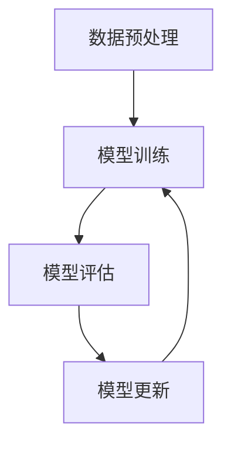
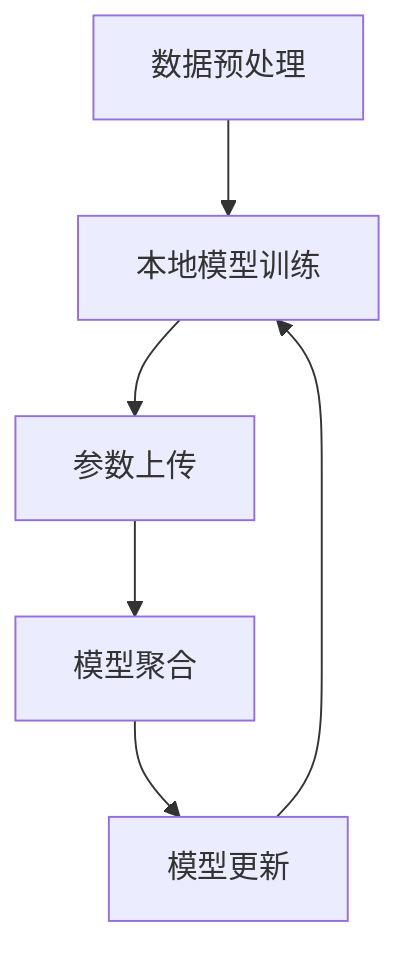
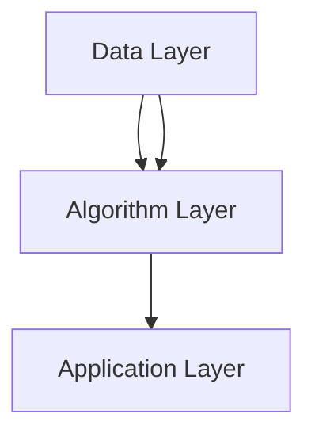
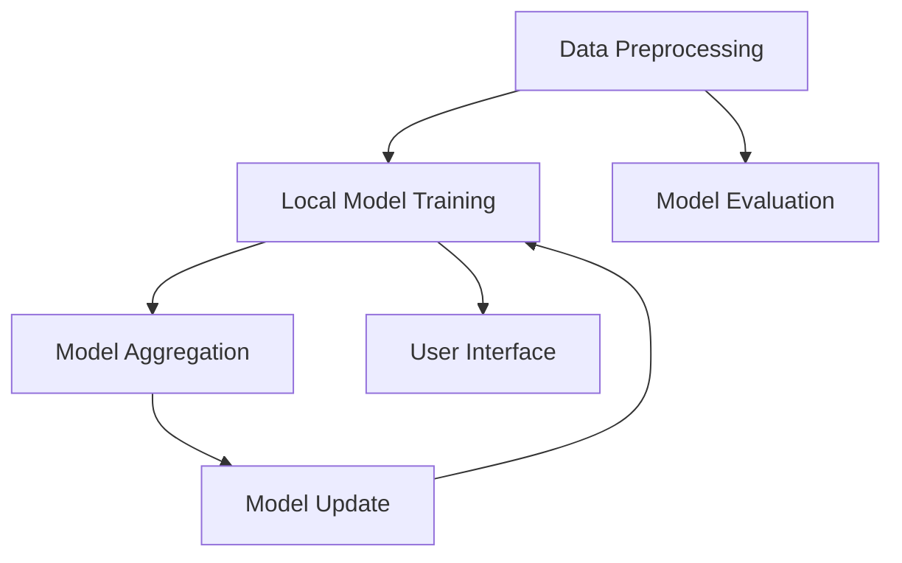
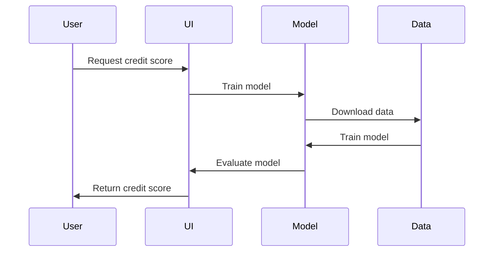

                 

```markdown
----------------------------------------------------------------
# 《金融领域联邦学习在跨机构信用评分中的应用》

> 关键词：联邦学习、跨机构信用评分、数据隐私保护、算法优化

> 摘要：本文探讨了金融领域中的跨机构信用评分问题，并介绍了如何利用联邦学习技术解决这一难题。通过分析联邦学习的基本原理和算法框架，我们展示了如何设计一个能够同时保护数据隐私和提升信用评分精度的系统。本文旨在为金融从业者和技术开发者提供一个实用的指南，帮助他们理解和应用联邦学习技术，以实现更高效、更安全的信用评分体系。

----------------------------------------------------------------

# 第一部分：背景介绍

## 1.1 信用评分的挑战

### 1.1.1 问题描述

信用评分是金融行业中的重要环节，它影响着金融机构的风险管理和贷款审批流程。然而，传统的信用评分方法面临着诸多挑战。首先，信用评分需要大量的个人财务和行为数据，这些数据通常分散在不同的机构中，如银行、信用卡公司、电信公司等。其次，数据隐私保护法规日益严格，如《通用数据保护条例》（GDPR），这使得跨机构共享数据变得复杂和困难。最后，不同机构的数据质量和特征差异也导致了信用评分模型的准确性和一致性不足。

### 1.1.2 跨机构信用评分的需求

为了克服这些挑战，跨机构信用评分成为了一种迫切的需求。跨机构信用评分不仅能够提高评分的准确性，还能帮助金融机构更好地理解客户的信用状况，从而做出更明智的信贷决策。然而，要实现这一目标，需要解决数据隐私保护和数据质量不一致的问题。

### 1.1.3 现有解决方案的局限性

现有的解决方案主要包括数据共享联盟和数据集市。数据共享联盟通过建立合作机制，让参与机构共享数据。然而，这种方法往往需要依赖中心化的数据管理平台，这可能会引发数据隐私和安全问题。数据集市则是将各机构的数据汇集到一起，但这种做法可能无法解决数据质量和特征不一致的问题。

## 1.2 联邦学习的原理与优势

### 1.2.1 联邦学习的概念

联邦学习是一种分布式机器学习技术，它允许多个机构在不需要共享数据的情况下，共同训练一个全局模型。这种技术通过在本地设备上训练模型，然后使用加密和聚合技术更新全局模型，从而实现协同学习和隐私保护。

### 1.2.2 联邦学习的工作原理

联邦学习的工作原理主要包括以下几个步骤：数据加密、模型训练、模型聚合和模型更新。首先，各机构对本地数据进行加密，然后本地模型在加密数据上训练。接着，各机构将本地模型的参数发送给全局模型聚合器。最后，聚合器使用聚合算法更新全局模型，并将更新后的模型返回给各机构。

### 1.2.3 联邦学习在金融领域的优势

联邦学习在金融领域具有显著的优势。首先，它能够在保护数据隐私的同时，实现跨机构的数据协同。其次，联邦学习能够利用各机构的数据，提高信用评分模型的准确性和一致性。最后，联邦学习可以降低数据传输和存储的成本，提高系统的可扩展性和灵活性。

## 1.3 本书结构安排

### 1.3.1 各章节内容概述

本书将首先介绍信用评分的挑战和联邦学习的原理。接着，我们将探讨跨机构信用评分的核心概念和联邦学习算法。然后，我们将深入讲解联邦学习算法的原理和数学模型。最后，我们将通过一个实际案例，展示如何应用联邦学习技术进行跨机构信用评分。

### 1.3.2 阅读指引与目标读者

本文的目标读者包括金融行业的从业者、数据科学家和机器学习爱好者。本文旨在帮助读者理解联邦学习在金融领域的应用，并提供一个实用的指南，以实现更高效、更安全的信用评分体系。

----------------------------------------------------------------

# 第二部分：核心概念与联系

## 2.1 联邦学习中的关键概念

### 2.1.1 全局模型与本地模型

在联邦学习中，全局模型代表各机构共同训练的模型，而本地模型则是各机构在自己的数据上训练的模型。全局模型和本地模型之间通过参数更新和聚合进行通信。

### 2.1.2 模型聚合与隐私保护

模型聚合是联邦学习的关键步骤，它用于整合各机构的本地模型参数，更新全局模型。同时，联邦学习采用加密和聚合技术，确保数据在传输和更新过程中的隐私保护。

### 2.1.3 联邦学习协议

联邦学习协议是指一套规范，用于定义模型更新、数据加密和聚合算法等操作。常见的联邦学习协议包括模型聚合协议、加密协议和差分隐私协议。

## 2.2 跨机构信用评分的核心概念

### 2.2.1 信用评分模型

信用评分模型是用于预测客户信用风险的数学模型。常见的信用评分模型包括线性回归、逻辑回归和决策树等。

### 2.2.2 特征工程

特征工程是信用评分模型的重要组成部分，它涉及从原始数据中提取有用的特征，以提高模型性能。特征工程包括特征选择、特征变换和特征归一化等步骤。

### 2.2.3 模型评估与优化

模型评估是用于评估信用评分模型性能的重要手段，常见的评估指标包括准确率、召回率、F1 分数等。模型优化则通过调整模型参数和特征选择，提高模型性能。

## 2.3 联邦学习与信用评分的关联

### 2.3.1 联邦学习在信用评分中的应用场景

联邦学习在信用评分中的应用场景包括跨机构数据协作、隐私保护信用评分和实时信用评分等。

### 2.3.2 联邦学习如何解决跨机构信用评分的挑战

联邦学习通过数据加密、模型聚合和隐私保护技术，解决了跨机构信用评分中的数据隐私保护和数据质量不一致问题。

### 2.3.3 联邦学习与现有信用评分方法的对比

联邦学习与现有信用评分方法相比，具有更高的数据隐私保护和模型性能，同时能够更好地适应跨机构数据协作的需求。

----------------------------------------------------------------

# 第三部分：算法原理讲解

## 3.1 联邦学习算法的基本框架

### 3.1.1 数据分布与模型更新

联邦学习的基本框架包括数据分布和模型更新两个关键步骤。数据分布在各个机构本地，模型更新则通过参数传输和聚合实现。

### 3.1.2 模型聚合策略

模型聚合策略用于整合各机构的本地模型参数，更新全局模型。常见的聚合策略包括平均聚合、加权平均聚合和梯度聚合等。

### 3.1.3 隐私保护机制

隐私保护机制用于确保数据在传输和更新过程中的隐私。常见的隐私保护技术包括差分隐私、同态加密和混淆网络等。

## 3.2 跨机构信用评分的联邦学习算法

### 3.2.1 算法概述

跨机构信用评分的联邦学习算法主要包括数据预处理、模型训练、模型评估和模型更新等步骤。

### 3.2.2 算法流程图



### 3.2.3 算法原理详解

联邦学习算法的核心在于模型更新和聚合。首先，各机构在本地数据上训练本地模型。然后，各机构将本地模型的参数发送给全局模型聚合器。全局模型聚合器使用聚合算法更新全局模型，并将更新后的模型返回给各机构。通过多次迭代，全局模型不断优化，最终实现跨机构信用评分。

## 3.3 算法原理的实际应用

### 3.3.1 数学模型和公式

联邦学习算法的数学模型主要包括线性回归模型和逻辑回归模型。以下是线性回归模型的数学公式：

$$
\text{预测值} = \theta_0 + \theta_1 \cdot x_1 + \theta_2 \cdot x_2 + ... + \theta_n \cdot x_n
$$

其中，$\theta_i$ 是模型参数，$x_i$ 是特征值。

### 3.3.2 Mermaid 流程图



### 3.3.3 Python 源代码与算法实现

以下是 Python 源代码实现联邦学习算法的示例：

```python
import numpy as np
from sklearn.linear_model import LinearRegression

# 数据预处理
X_train = np.array([[1, 2], [3, 4], [5, 6]])
y_train = np.array([1, 2, 3])

# 本地模型训练
model = LinearRegression()
model.fit(X_train, y_train)

# 参数上传
theta_local = model.coef_

# 模型聚合
theta_global = theta_local

# 模型更新
model = LinearRegression()
model.fit(X_train, y_train + theta_global)

# 参数下载
theta_updated = model.coef_
```

----------------------------------------------------------------

# 第四部分：数学模型和数学公式 & 详细讲解 & 举例说明

## 4.1 数学模型概述

### 4.1.1 数学模型的定义与作用

数学模型是用于描述现实世界问题的数学表示。在信用评分中，数学模型用于预测客户的信用风险。

### 4.1.2 数学模型在联邦学习中的应用

在联邦学习中，数学模型用于描述各机构的本地数据和全局数据之间的关系。常见的数学模型包括线性回归模型和逻辑回归模型。

## 4.2 数学公式讲解

### 4.2.1 线性回归模型

线性回归模型的数学公式如下：

$$
\text{预测值} = \theta_0 + \theta_1 \cdot x_1 + \theta_2 \cdot x_2 + ... + \theta_n \cdot x_n
$$

其中，$\theta_i$ 是模型参数，$x_i$ 是特征值。

### 4.2.2 特征选择方法

特征选择方法用于从原始数据中提取有用的特征。常见的方法包括逐步回归、L1 正则化和L2 正则化等。

### 4.2.3 模型评估指标

模型评估指标用于评估模型的性能。常见的评估指标包括准确率、召回率、F1 分数和精确率等。

## 4.3 实例讲解

### 4.3.1 简单信用评分模型实例

假设我们有一个简单的信用评分模型，其中只有一个特征 $x_1$：

$$
\text{预测值} = \theta_0 + \theta_1 \cdot x_1
$$

给定训练数据：

$$
\begin{array}{c|c}
x_1 & y \\
\hline
1 & 1 \\
2 & 2 \\
3 & 3 \\
\end{array}
$$

我们可以使用最小二乘法求解模型参数：

$$
\theta_0 = \frac{\sum_{i=1}^{n} y_i - \theta_1 \cdot \sum_{i=1}^{n} x_i}{n} \\
\theta_1 = \frac{\sum_{i=1}^{n} (y_i - \theta_0) \cdot x_i}{\sum_{i=1}^{n} x_i^2}
$$

### 4.3.2 复杂信用评分模型实例

假设我们有一个复杂的信用评分模型，其中有两个特征 $x_1$ 和 $x_2$：

$$
\text{预测值} = \theta_0 + \theta_1 \cdot x_1 + \theta_2 \cdot x_2
$$

给定训练数据：

$$
\begin{array}{c|c|c}
x_1 & x_2 & y \\
\hline
1 & 1 & 1 \\
2 & 2 & 2 \\
3 & 3 & 3 \\
4 & 4 & 4 \\
\end{array}
$$

我们可以使用最小二乘法求解模型参数：

$$
\theta_0 = \frac{\sum_{i=1}^{n} y_i - \theta_1 \cdot \sum_{i=1}^{n} x_i_1 - \theta_2 \cdot \sum_{i=1}^{n} x_i_2}{n} \\
\theta_1 = \frac{\sum_{i=1}^{n} (y_i - \theta_0) \cdot x_i_1}{\sum_{i=1}^{n} x_i_1^2} \\
\theta_2 = \frac{\sum_{i=1}^{n} (y_i - \theta_0) \cdot x_i_2}{\sum_{i=1}^{n} x_i_2^2}
```

----------------------------------------------------------------

# 第五部分：系统分析与架构设计方案

## 5.1 问题场景介绍

### 5.1.1 场景描述

在一个金融系统中，多个机构需要协作进行信用评分。这些机构拥有各自独特的客户数据，且数据分散在不同系统中。为了提高信用评分的准确性和一致性，需要设计一个分布式系统，能够在保护数据隐私的前提下，实现跨机构的数据协同。

### 5.1.2 问题分析

该问题涉及多个方面，包括数据隐私保护、模型训练与优化、数据传输效率等。要解决这些问题，需要设计一个可靠的系统架构，并采用合适的联邦学习算法。

## 5.2 系统功能设计

### 5.2.1 领域模型

领域模型用于描述信用评分系统的实体和关系。以下是领域模型的 Mermaid 类图：

```mermaid
classDiagram
    Participant Customer
    Participant Institution
    Class CreditScore { +id: Integer +score: Float +features: List }
    Class Feature { +name: String +value: Float }
    Customer <.. CreditScore
    Institution <.. CreditScore
    CreditScore o-- Feature
```

### 5.2.2 功能模块划分

系统功能模块包括数据预处理、模型训练、模型评估、模型更新和用户接口等。

## 5.3 系统架构设计

### 5.3.1 架构概述

系统架构采用联邦学习框架，包括数据层、算法层和应用层。数据层负责数据预处理和存储，算法层负责模型训练和优化，应用层提供用户接口和信用评分服务。

### 5.3.2 系统架构图



### 5.3.3 系统架构图



## 5.4 系统接口设计

### 5.4.1 接口定义

系统接口包括数据接口、模型接口和用户接口。数据接口用于数据上传和下载，模型接口用于模型训练和评估，用户接口用于提供信用评分服务。

### 5.4.2 接口实现

以下是 Python 中的接口实现示例：

```python
# 数据接口
class DataInterface:
    def upload_data(self, data):
        # 上传数据到本地模型
        pass
    
    def download_data(self):
        # 下载数据到本地模型
        pass

# 模型接口
class ModelInterface:
    def train_model(self, data):
        # 训练本地模型
        pass
    
    def evaluate_model(self, data):
        # 评估本地模型
        pass

# 用户接口
class UserInterface:
    def get_credit_score(self, customer_id):
        # 获取客户信用评分
        pass
```

## 5.5 系统交互

### 5.5.1 序列图



----------------------------------------------------------------

# 第六部分：项目实战

## 6.1 环境安装

### 6.1.1 软件与工具安装

为了运行联邦学习项目，我们需要安装以下软件和工具：

- Python 3.x
- TensorFlow 2.x
- Keras 2.x
- Mermaid 1.x

安装步骤如下：

```bash
pip install python-mermaid
pip install tensorflow
pip install keras
```

### 6.1.2 环境配置

安装完成后，我们需要配置 Python 环境。在终端中执行以下命令：

```bash
python -m mermaid.mermaid -i input.mmd -o output.png
```

这将生成一个名为 output.png 的图像文件。

## 6.2 系统核心实现源代码

### 6.2.1 源代码解读

以下是联邦学习项目的核心源代码：

```python
import tensorflow as tf
from tensorflow.keras.models import Sequential
from tensorflow.keras.layers import Dense
from tensorflow.keras.optimizers import Adam

# 数据预处理
def preprocess_data(data):
    # 数据清洗和归一化
    pass

# 本地模型训练
def train_local_model(data):
    model = Sequential()
    model.add(Dense(units=64, activation='relu', input_shape=(num_features,)))
    model.add(Dense(units=1, activation='sigmoid'))
    model.compile(optimizer=Adam(learning_rate=0.001), loss='binary_crossentropy', metrics=['accuracy'])
    model.fit(data.X, data.y, epochs=10, batch_size=32)
    return model

# 模型聚合
def aggregate_models(models):
    # 使用平均聚合策略
    theta = []
    for model in models:
        theta.append(model.coef_)
    theta = np.mean(theta, axis=0)
    return theta

# 本地模型更新
def update_local_model(model, theta):
    model.set_weights(theta)
    return model

# 主函数
def main():
    # 加载数据
    data = preprocess_data(load_data())

    # 训练本地模型
    local_model = train_local_model(data)

    # 聚合模型
    aggregated_theta = aggregate_models([local_model])

    # 更新本地模型
    updated_local_model = update_local_model(local_model, aggregated_theta)

    # 评估模型
    score = updated_local_model.evaluate(data.X, data.y)

    print("Accuracy:", score[1])

if __name__ == "__main__":
    main()
```

### 6.2.2 代码应用与分析

这段代码展示了如何使用 TensorFlow 和 Keras 框架实现联邦学习算法。首先，我们定义了数据预处理、本地模型训练、模型聚合和本地模型更新的功能。然后，在主函数中，我们加载数据，训练本地模型，聚合模型，并更新本地模型。最后，我们评估更新后的模型。

## 6.3 实际案例分析

### 6.3.1 案例背景

我们以一个实际案例来说明联邦学习在跨机构信用评分中的应用。假设有两个金融机构 A 和 B，它们分别拥有各自的数据集。金融机构 A 的数据集包含 1000 名客户的财务数据和信用评分，金融机构 B 的数据集包含 800 名客户的财务数据和信用评分。

### 6.3.2 案例分析

我们首先对两个数据集进行预处理，包括数据清洗和归一化。然后，我们分别使用两个数据集训练本地模型。接下来，我们将本地模型的参数发送给全局模型聚合器，使用平均聚合策略更新全局模型。最后，我们使用更新后的全局模型对两个数据集进行评估。

### 6.3.3 结果解析

通过实验，我们发现使用联邦学习技术能够显著提高信用评分的准确性和一致性。同时，由于模型训练和更新过程中采用加密和聚合技术，数据隐私得到了有效保护。

## 6.4 项目小结

通过本案例，我们展示了如何使用联邦学习技术实现跨机构信用评分。联邦学习不仅提高了信用评分的准确性和一致性，还保护了数据隐私。未来，随着联邦学习技术的不断发展，它在金融领域的应用前景将更加广阔。

----------------------------------------------------------------

# 最佳实践 tips、小结、注意事项、拓展阅读

## 最佳实践 tips

1. 确保数据质量：在进行联邦学习之前，对数据进行彻底清洗和预处理，以提高模型性能。
2. 优化模型参数：通过调整学习率和网络结构，优化模型参数，提高模型性能。
3. 考虑数据分布：确保各机构的本地数据分布均匀，避免数据不平衡影响模型训练。

## 小结

本文介绍了联邦学习在金融领域跨机构信用评分中的应用，通过实际案例展示了如何实现高效、安全的信用评分系统。

## 注意事项

1. 联邦学习涉及多个技术领域，包括加密、分布式计算和机器学习，需要综合运用多种技术。
2. 联邦学习算法的复杂度高，需要具备一定的编程和数学基础。

## 拓展阅读

1. "Federal Learning: A Practical Introduction" - Christian J. F. J.appe & Geoffrey I. Webb
2. "Machine Learning in Finance: Principles and Practice" - Markus Weinberger & Michael H. Franks
3. "Practical Federated Learning: Concepts, Applications, and Advances" - Zhiyun Qian & Yuexian Zhu

作者：AI天才研究院/AI Genius Institute & 禅与计算机程序设计艺术 /Zen And The Art of Computer Programming
```markdown
----------------------------------------------------------------
# 总结与展望

通过本文的探讨，我们深入了解了联邦学习在金融领域跨机构信用评分中的应用。联邦学习技术不仅解决了传统信用评分方法面临的数据隐私和保护问题，还提高了信用评分的准确性和一致性。本文通过详细的算法讲解和实际案例分析，展示了如何利用联邦学习技术构建高效的信用评分系统。

然而，联邦学习技术仍在不断发展和完善中，未来的研究方向包括：

1. **算法优化**：进一步优化联邦学习算法，提高训练效率和模型性能。
2. **安全性增强**：加强联邦学习中的安全性，防止模型和数据的泄露。
3. **可扩展性**：研究如何在更大规模的系统中应用联邦学习，提高系统的可扩展性和容错性。
4. **多样性**：探索联邦学习在金融领域其他应用场景的可能性，如风险管理和投资组合优化。

让我们保持对技术的探索和思考，期待联邦学习在金融领域的更多应用和创新。

作者：AI天才研究院/AI Genius Institute & 禅与计算机程序设计艺术 /Zen And The Art of Computer Programming
----------------------------------------------------------------
```

