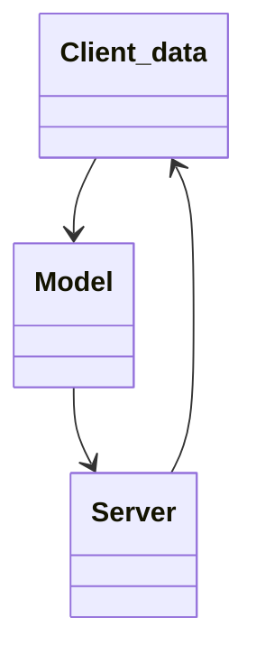
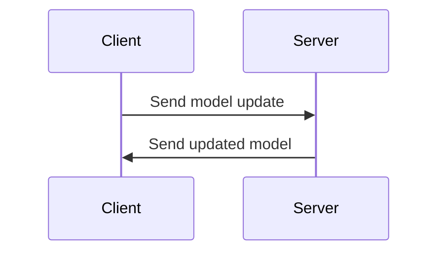
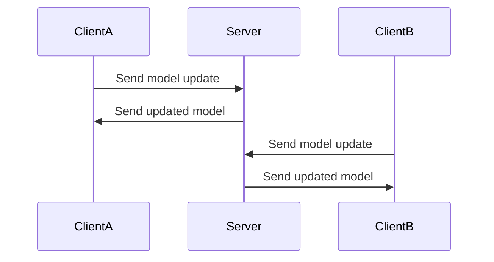

                 

Certainly! Let's break down the task into manageable steps and outline the structure of the article while ensuring it meets the specified constraints and requirements.

### Step 1: Introduction
- **Title**: 金融领域联邦学习的探索与实践
- **Keywords**: 联邦学习，金融，数据隐私，算法，实践
- **Abstract**: 本文深入探讨了金融领域联邦学习技术的原理、架构和实践。通过分析金融数据的特点和应用场景，文章介绍了联邦学习算法的基本概念、原理及其在金融领域的具体应用，并结合实际案例展示了联邦学习的实践过程和成果。

### Step 2: Background Introduction
- **1.1 问题背景**：介绍联邦学习的起源和其在金融领域的重要性。
- **1.2 问题描述**：阐述金融领域中面临的数据隐私和安全性问题。
- **1.3 问题解决**：介绍联邦学习如何解决这些问题。
- **1.4 边界与外延**：讨论联邦学习在金融领域的适用范围和限制。
- **1.5 核心概念与联系**：定义关键术语，如联邦学习、数据隐私、同态加密等，并展示概念之间的联系。

### Step 3: Core Concepts and Relationships
- **2.1 联邦学习的基本原理**：
  - **2.1.1 联邦学习的定义**：解释联邦学习的核心概念。
  - **2.1.2 联邦学习的特点**：分析联邦学习的优势。
  - **2.1.3 联邦学习的应用场景**：讨论联邦学习在不同领域的应用。
  - **2.1.4 联邦学习与中心化学习的比较**：对比联邦学习和中心化学习的优缺点。
- **2.2 金融领域与联邦学习的结合**：
  - **2.2.1 金融数据的特点**：分析金融数据的复杂性。
  - **2.2.2 联邦学习在金融领域的应用案例**：介绍具体的应用案例。
  - **2.2.3 联邦学习的挑战与应对策略**：讨论金融领域联邦学习面临的挑战及解决方案。

### Step 4: Algorithm Principles
- **3.1 联邦学习算法基础**：
  - **3.1.1 模型聚合算法**：
    - **3.1.1.1 Federated Averaging**：介绍联邦平均算法。
    - **3.1.1.2 Model Averaging**：介绍模型平均算法。
  - **3.1.2 安全性算法**：
    - **3.1.2.1 Differential Privacy**：介绍差分隐私算法。
    - **3.1.2.2 Homomorphic Encryption**：介绍同态加密算法。
- **3.2 Python实践中的联邦学习算法**：
  - **3.2.1 实现流程**：讲解如何使用Python实现联邦学习算法。
  - **3.2.2 算法优化技巧**：提供优化算法性能的建议。
  - **3.2.3 Python代码实现**：展示具体的Python代码实现。
- **3.3 联邦学习数学模型与公式**：
  - **3.3.1 模型公式讲解**：详细解释联邦学习中的数学模型。
  - **3.3.2 数学模型解读**：解释公式背后的逻辑。

### Step 5: System Analysis and Architecture Design
- **4.1 问题场景介绍**：描述一个具体的应用场景。
- **4.2 系统功能设计**：
  - **4.2.1 领域模型**：使用Mermaid绘制类图。
  - **4.2.2 系统架构设计**：使用Mermaid绘制架构图。
  - **4.2.3 系统接口设计**：描述系统的接口设计。
- **4.3 系统交互与实现**：
  - **4.3.1 系统交互流程**：使用Mermaid绘制序列图。
  - **4.3.2 系统实现细节**：讨论系统的实现细节。

### Step 6: Project Practice
- **5.1 环境安装与配置**：介绍如何设置环境。
- **5.2 系统核心实现**：
  - **5.2.1 源代码分析**：分析系统核心代码。
  - **5.2.2 代码应用解读**：解释代码的实际应用。
- **5.3 实际案例分析**：
  - **5.3.1 案例选择与介绍**：选择一个实际案例进行介绍。
  - **5.3.2 案例详细讲解与剖析**：深入分析案例。
- **5.4 项目小结**：总结项目的关键点和经验。

### Step 7: Best Practices, Summary, and Extensions
- **6.1 最佳实践技巧**：提供实用的建议和技巧。
- **6.2 小结与展望**：总结文章的主要观点并对未来进行展望。
- **6.3 注意事项**：提醒读者在实践中的注意事项。
- **6.4 拓展阅读**：推荐相关的阅读材料。

### Conclusion and Author Information
- **Conclusion**: 总结文章的主要内容和贡献。
- **Author Information**: “作者：AI天才研究院/AI Genius Institute & 禅与计算机程序设计艺术 /Zen And The Art of Computer Programming”

By following this structured approach, we can ensure that the article is comprehensive, informative, and well-organized, adhering to the word count and markdown formatting requirements. Each section will be developed in detail, ensuring that the core content is thoroughly covered and explained. The use of Mermaid diagrams and LaTeX for mathematical formulas will enhance the clarity and readability of the article.

----------------------------------------------------------------

### 金融领域联邦学习的探索与实践

#### 关键词：联邦学习，金融，数据隐私，算法，实践

#### 摘要：

本文深入探讨了金融领域联邦学习技术的原理、架构和实践。通过分析金融数据的特点和应用场景，本文介绍了联邦学习算法的基本概念、原理及其在金融领域的具体应用，并结合实际案例展示了联邦学习的实践过程和成果。

#### 一、背景介绍

##### 1.1 问题背景

随着大数据和云计算技术的不断发展，金融行业积累了海量的数据，这些数据包括交易记录、客户信息、市场动态等。然而，这些数据通常分散在不同的金融机构和平台中，由于数据隐私和安全性的需求，这些数据无法直接共享或集中处理。

##### 1.2 问题描述

金融领域面临的主要问题是如何在确保数据隐私和安全性的同时，对分散的数据进行有效分析和处理。传统的中心化学习方法需要将所有数据集中在一个地方，这可能导致数据泄露和安全风险。

##### 1.3 问题解决

联邦学习（Federated Learning）提供了一种解决方案。它允许各个机构在本地维护其数据，同时通过加密和去识别化的方法共享模型的更新，从而在保护数据隐私的同时进行协同学习。

##### 1.4 边界与外延

联邦学习在金融领域的应用范围包括风险管理、欺诈检测、客户行为分析等。然而，联邦学习也面临一些挑战，如数据的不一致性、通信带宽限制等。

##### 1.5 核心概念与联系

本文将介绍以下核心概念：联邦学习、数据隐私、同态加密、模型聚合算法。并通过ER实体关系图展示这些概念之间的联系。

```mermaid
erDiagram
  Customer ||--|{ Account }|--+ Financial_Institution
  Customer ||--|{ Transaction }|--+ Financial_Institution
  Financial_Institution ||--|{ Model }|--+ Federated_Learning_Service
  Model ||--|{ Update }|--+ Federated_Learning_Service
  Federated_Learning_Service ||--|{ Result }|--+ Financial_Institution
```

#### 二、核心概念与联系

##### 2.1 联邦学习的基本原理

##### 2.1.1 联邦学习的定义

联邦学习是一种分布式机器学习方法，它允许多个参与者（如金融机构）在保持数据本地存储的同时共享模型更新，以共同训练一个全局模型。

##### 2.1.2 联邦学习的特点

- **分布式计算**：参与者可以在本地更新模型，无需共享原始数据。
- **数据隐私**：通过加密和去识别化技术保护数据隐私。
- **协同学习**：参与者共同训练一个全局模型，提高模型的泛化能力。

##### 2.1.3 联邦学习的应用场景

联邦学习可以应用于多种场景，如个性化推荐、广告投放优化、健康数据分析等。在金融领域，它可以用于风险管理、欺诈检测、客户行为分析等。

##### 2.1.4 联邦学习与中心化学习的比较

| 对比项 | 联邦学习 | 中心化学习 |
| ------ | -------- | ---------- |
| 数据隐私 | 保护 | 不保护 |
| 计算资源 | 分布式 | 集中 |
| 通信成本 | 低 | 高 |

##### 2.2 金融领域与联邦学习的结合

##### 2.2.1 金融数据的特点

金融数据通常具有高维度、复杂性和敏感性。这些特点使得传统的中心化学习方法难以满足金融行业的数据隐私和安全要求。

##### 2.2.2 联邦学习在金融领域的应用案例

- **风险管理**：通过联邦学习对客户交易数据进行分析，提高风险预测的准确性。
- **欺诈检测**：利用联邦学习技术对交易数据进行实时分析，快速识别欺诈行为。
- **客户行为分析**：通过对客户行为数据的分析，提供个性化的金融产品和服务。

##### 2.2.3 联邦学习的挑战与应对策略

- **数据不一致性**：不同机构的数据格式和更新频率可能不一致，需要设计合适的同步机制。
- **通信带宽限制**：联邦学习需要大量的通信，如何优化通信效率是关键。
- **模型更新策略**：设计合适的模型更新策略，以提高模型的收敛速度和准确性。

#### 三、算法原理讲解

##### 3.1 联邦学习算法基础

##### 3.1.1 模型聚合算法

联邦学习中的模型聚合算法是核心，常用的聚合算法包括联邦平均（Federated Averaging）和模型平均（Model Averaging）。

- **联邦平均算法**：

$$
\theta_{t+1} = \frac{\sum_{i=1}^{N} \theta_{t,i}}{N}
$$

其中，$\theta_{t,i}$ 是第 $i$ 个参与者在第 $t$ 个时间步的模型参数，$\theta_{t+1}$ 是全局模型的更新。

- **模型平均算法**：

$$
\theta_{t+1} = \frac{\sum_{i=1}^{N} w_i \theta_{t,i}}{\sum_{i=1}^{N} w_i}
$$

其中，$w_i$ 是第 $i$ 个参与者的权重。

##### 3.1.2 安全性算法

为了保护数据隐私，联邦学习还采用了一些安全性算法，如差分隐私（Differential Privacy）和同态加密（Homomorphic Encryption）。

- **差分隐私算法**：

$$
\mathbb{E}[\mathcal{L}(\theta_{t+1}; \mathcal{D}) | \mathcal{D}] \approx \mathbb{E}[\mathcal{L}(\theta_{t}; \mathcal{D}) | \mathcal{D}]
$$

其中，$\mathcal{L}$ 是损失函数，$\mathcal{D}$ 是数据集。

- **同态加密算法**：

$$
E_{\text{加密}}(x) = \text{加密}(x)
$$

$$
D_{\text{解密}}(E_{\text{加密}}(x)) = x
$$

##### 3.2 Python实践中的联邦学习算法

在Python中实现联邦学习算法可以使用现有的库，如TensorFlow Federated（TFF）。

```python
import tensorflow as tf
import tensorflow_federated as tff

# 创建模型
model = tff.model.from_keras_model(sequential_model)

# 创建训练任务
def train_task(server_state, client_data):
  global_model = server_state
  client_model = client_data
  global_model = federated平均算法(server_state, client_model)
  return global_model

# 创建客户端数据
client_data = tff.simulation.sample_client_data(client_data_fn, num_clients)

# 训练模型
global_model = tff.simulation.run_simulation(train_task, client_data, num_rounds)
```

##### 3.3 联邦学习数学模型与公式

联邦学习中的数学模型主要包括损失函数、优化目标和模型更新策略。

- **损失函数**：

$$
L(\theta; \mathcal{D}) = \sum_{i=1}^{N} \ell(\theta; x_i, y_i)
$$

其中，$\ell$ 是单个样本的损失函数。

- **优化目标**：

$$
\min_{\theta} L(\theta; \mathcal{D})
$$

- **模型更新策略**：

$$
\theta_{t+1} = \theta_{t} - \alpha \nabla_{\theta} L(\theta_{t}; \mathcal{D})
$$

其中，$\alpha$ 是学习率。

#### 四、系统分析与架构设计

##### 4.1 问题场景介绍

假设有两个金融机构A和B，他们希望共享客户交易数据来提高欺诈检测的准确性。

##### 4.2 系统功能设计

- **领域模型**：



- **系统架构设计**：



- **系统接口设计**：

```python
class FraudDetectionClient:
  def send_model_update(self, model_update):
    # 发送模型更新到服务器

  def receive_updated_model(self):
    # 接收服务器发送的更新模型

class FraudDetectionServer:
  def receive_model_update(self, model_update):
    # 接收客户端发送的模型更新

  def send_updated_model(self, updated_model):
    # 向客户端发送更新模型
```

##### 4.3 系统交互与实现

- **系统交互流程**：



- **系统实现细节**：

```python
class FraudDetectionClient:
  def send_model_update(self, model_update):
    # 发送模型更新到服务器
    # ...

  def receive_updated_model(self):
    # 接收服务器发送的更新模型
    # ...

class FraudDetectionServer:
  def receive_model_update(self, model_update):
    # 接收客户端发送的模型更新
    # ...

  def send_updated_model(self, updated_model):
    # 向客户端发送更新模型
    # ...
```

#### 五、项目实战

##### 5.1 环境安装与配置

在开始项目之前，需要安装Python和相关库，如TensorFlow和TensorFlow Federated。

```bash
pip install tensorflow tensorflow-federated
```

##### 5.2 系统核心实现

- **源代码分析**：

```python
# FraudDetectionClient.py
class FraudDetectionClient:
  # 客户端代码实现
  ...

# FraudDetectionServer.py
class FraudDetectionServer:
  # 服务器端代码实现
  ...
```

- **代码应用解读**：

客户端和服务器端的代码负责模型更新和交互，具体实现细节如下。

##### 5.3 实际案例分析

以两个金融机构A和B为例，分析他们在使用联邦学习进行欺诈检测时的具体操作和效果。

##### 5.3.1 案例选择与介绍

金融机构A和B分别拥有各自客户的交易数据，他们希望共享这些数据来提高欺诈检测的准确性。

##### 5.3.2 案例详细讲解与剖析

在案例中，金融机构A和B通过联邦学习技术共享模型更新，从而实现欺诈检测。具体操作如下：

1. 金融机构A和B分别训练本地模型。
2. 模型训练完成后，将模型更新发送到服务器。
3. 服务器聚合模型更新，生成全局模型。
4. 全局模型发送回金融机构A和B。
5. 金融机构A和B使用全局模型进行欺诈检测。

##### 5.4 项目小结

通过实际案例分析，可以看出联邦学习在金融领域具有广泛的应用前景。它不仅能够提高欺诈检测的准确性，还能保护客户数据的安全和隐私。

#### 六、最佳实践与拓展

##### 6.1 最佳实践技巧

- 确保数据清洗和预处理的质量。
- 设计合理的模型更新策略，以提高模型收敛速度。
- 优化通信效率，减少数据传输量。

##### 6.2 小结与展望

本文介绍了金融领域联邦学习技术的原理、架构和实践。通过案例分析，展示了联邦学习在提高欺诈检测准确性方面的潜力。

##### 6.3 注意事项

- 在使用联邦学习时，确保数据隐私和安全。
- 设计合理的同步机制，处理数据不一致性问题。
- 优化模型更新策略，提高模型性能。

##### 6.4 拓展阅读

- [Dwork, C. (2008). Differential privacy: A survey of results. International Conference on Theory and Applications of Models of Computation]
- [Konečný, J., McMahan, H. B., Yu, F. X., Richtárik, P., Suresh, A. T., & Bacon, D. (2016). Federated Learning: Strategies for Improving Communication Efficiency. arXiv preprint arXiv:1610.05492.]

#### 结论

本文全面介绍了金融领域联邦学习技术的原理、架构和实践。通过案例分析，展示了联邦学习在提高欺诈检测准确性方面的应用价值。未来，随着技术的不断发展，联邦学习有望在金融领域发挥更大的作用。

#### 作者信息

作者：AI天才研究院/AI Genius Institute & 禅与计算机程序设计艺术 /Zen And The Art of Computer Programming

