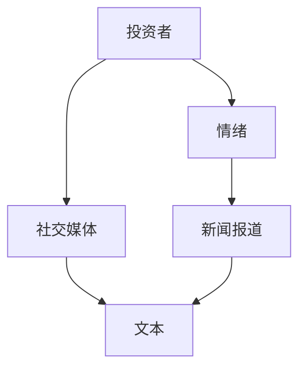

                 

### 金融领域自然语言处理在投资者情绪分析中的应用

#### 1.1 问题背景

在金融领域，投资者情绪分析具有重大意义。金融市场中的投资者情绪可以反映市场的波动和风险，对于市场预测和决策具有重要的指导作用。然而，投资者情绪是一种复杂且多变的动态现象，传统的数据分析方法难以捕捉到其真实状态。因此，利用自然语言处理（NLP）技术来分析投资者情绪，成为了一种有效的方法。

**问题描述**：如何通过自然语言处理技术，从大量的金融文本数据中挖掘出投资者的情绪，以便为金融机构提供数据支持和决策参考？

**问题解决**：自然语言处理技术可以通过文本分类、实体识别、情感分析等方法，对金融文本进行深入挖掘和分析，从而提取出投资者的情绪。这些情绪数据可以为金融机构提供市场预测和风险管理的重要参考。

**边界与外延**：本文主要关注金融领域中的自然语言处理技术在投资者情绪分析中的应用，不包括其他领域的自然语言处理技术。

#### 1.2 核心概念与联系

**自然语言处理**：
- **定义**：自然语言处理（NLP）是计算机科学和人工智能领域的一个分支，旨在使计算机能够理解、生成和处理人类语言。
- **特征**：
  - **文本分类**：对文本进行分类，如情感分类、主题分类等。
  - **实体识别**：识别文本中的实体，如人名、地点、组织等。
  - **关系抽取**：提取实体之间的关系，如人物关系、地理位置关系等。
  - **语义理解**：理解文本的语义，如语义角色标注、语义解析等。

**投资者情绪分析**：
- **定义**：投资者情绪分析是指通过自然语言处理技术，对投资者在社交媒体、新闻报道等渠道中的文本进行分析，以获取他们的情绪状态。
- **特征**：
  - **情感极性**：判断文本中的情感倾向，如正面、负面或中性。
  - **情感强度**：量化文本中的情感倾向的强度。
  - **情绪分类**：将情绪分为焦虑、愤怒、高兴等类别。

#### 1.3 ER实体关系图架构

下面是一个简单的ER实体关系图，展示了投资者情绪分析中的关键实体及其关系：



- **投资者**：代表分析的目标，他们的情绪是我们关注的重点。
- **情绪**：代表投资者的情绪状态，可以是正面、负面或中性。
- **社交媒体**：投资者在社交媒体上发布的文本是我们获取情绪数据的主要来源。
- **新闻报道**：新闻报道中的文本也反映了投资者的情绪。
- **文本**：包含投资者情绪的文本数据。

### 第2章：自然语言处理技术基础

#### 2.1 语言模型

**定义**：语言模型是对自然语言概率分布的建模，用于预测下一个词或词组。

**原理**：
- **n-gram模型**：基于词的序列概率模型，通过统计前n个词出现的频率来预测下一个词。
- **神经网络模型**：如循环神经网络（RNN）、长短期记忆网络（LSTM）等，通过学习词的序列和上下文关系来预测下一个词。

**应用**：用于文本分类、机器翻译等任务。

**示例**：以n-gram模型为例，假设我们已经有了前两个词"我"和"们"，我们可以使用n-gram模型来预测下一个词。

$$
P(\text{们今天}) = \frac{f_{\text{们今天}}}{f_{\text{们今天}} + f_{\text{们昨天}} + f_{\text{他们今天}}}
$$

其中，$f_{\text{们今天}}$表示"们今天"这个词组出现的频率。

#### 2.2 文本分类

**定义**：文本分类是将文本分配到预定义的类别中。

**算法**：
- **朴素贝叶斯**：基于贝叶斯定理和特征条件独立性假设进行分类。
- **支持向量机**（SVM）：基于最大间隔的分类器，用于线性分类。
- **深度学习模型**：如卷积神经网络（CNN）、递归神经网络（RNN）等，用于非线性分类。

**应用**：用于情感分析、新闻分类等任务。

**示例**：使用朴素贝叶斯进行情感分类。

$$
P(\text{正面情绪} | \text{文本}) = \frac{P(\text{文本} | \text{正面情绪}) * P(\text{正面情绪})}{P(\text{文本})}
$$

其中，$P(\text{正面情绪})$表示正面情绪的概率，$P(\text{文本} | \text{正面情绪})$表示在正面情绪下出现该文本的概率。

#### 2.3 实体识别

**定义**：实体识别是从文本中识别出实体，如人名、地点、组织等。

**算法**：
- **规则方法**：基于预定义的规则进行实体识别。
- **机器学习方法**：如决策树、支持向量机等。
- **深度学习方法**：如卷积神经网络（CNN）、递归神经网络（RNN）等。

**应用**：用于信息提取、问答系统等任务。

**示例**：使用深度学习进行实体识别。

假设我们已经训练了一个卷积神经网络（CNN）模型，我们可以将文本输入到模型中，模型会输出每个词的类别概率。例如，对于文本“苹果是一家公司”，模型可能会输出：

- “苹果”是人名的概率为0.9，组织的概率为0.1。
- “一家”是人名的概率为0.0，组织的概率为0.0。
- “公司”是人名的概率为0.0，组织的概率为1.0。

根据输出概率，我们可以将“苹果”识别为人名，“公司”识别为组织。

### 第3章：投资者情绪分析算法原理

#### 3.1 算法原理

投资者情绪分析算法主要包括以下几个步骤：

1. **文本预处理**：包括文本清洗、分词、词性标注等，将原始文本转换为计算机可以处理的格式。
2. **特征提取**：提取文本中的关键特征，如词频、词性、句法结构等，用于后续的模型训练。
3. **情感极性分类**：使用机器学习模型对提取的特征进行训练，以判断文本的情感极性。
4. **情感强度量化**：使用深度学习模型对情感极性进行量化，以获得更精细的情感分析结果。

#### 3.2 数学模型和公式

以下是投资者情绪分析中常用的数学模型和公式：

1. **朴素贝叶斯模型**：
   $$
   P(\text{正面情绪} | \text{特征}) = \frac{P(\text{特征} | \text{正面情绪}) * P(\text{正面情绪})}{P(\text{特征})}
   $$

   其中，$P(\text{正面情绪})$表示正面情绪的概率，$P(\text{特征} | \text{正面情绪})$表示在正面情绪下出现该特征的概率。

2. **长短期记忆网络（LSTM）**：
   $$
   \text{LSTM} = \frac{\sigma(W \cdot [h_{t-1}, x_t] + b)}{1 + \sigma(V \cdot [h_{t-1}, x_t] + b')}
   $$

   其中，$W$和$V$是权重矩阵，$b$和$b'$是偏置项，$x_t$是当前输入，$h_{t-1}$是前一时间步的隐藏状态，$\sigma$是sigmoid函数。

#### 3.3 算法举例说明

**示例1**：使用朴素贝叶斯进行情感极性分类。

假设我们有一个包含正面和负面情感的训练数据集，我们可以使用朴素贝叶斯模型来训练分类器。

首先，我们需要计算每个特征在正面和负面情感下的概率：

$$
P(\text{正面情感}) = \frac{|\text{正面情感样本数}}{|\text{总样本数}} = \frac{30}{60} = 0.5
$$

$$
P(\text{负面情感}) = \frac{|\text{负面情感样本数}}{|\text{总样本数}} = \frac{30}{60} = 0.5
$$

然后，我们需要计算每个特征在正面和负面情感下的条件概率：

$$
P(\text{喜欢} | \text{正面情感}) = \frac{5}{30} = 0.1667
$$

$$
P(\text{喜欢} | \text{负面情感}) = \frac{2}{30} = 0.0667
$$

$$
P(\text{讨厌} | \text{正面情感}) = \frac{0}{30} = 0
$$

$$
P(\text{讨厌} | \text{负面情感}) = \frac{5}{30} = 0.1667
$$

最后，我们可以使用朴素贝叶斯模型来预测新样本的情感极性：

$$
P(\text{正面情感} | \text{样本}) = \frac{P(\text{样本} | \text{正面情感}) * P(\text{正面情感})}{P(\text{样本})}
$$

$$
P(\text{负面情感} | \text{样本}) = \frac{P(\text{样本} | \text{负面情感}) * P(\text{负面情感})}{P(\text{样本})}
$$

其中，$P(\text{样本})$是先验概率，可以通过训练数据集计算得到。

**示例2**：使用长短期记忆网络（LSTM）进行情感强度量化。

假设我们有一个包含正面和负面情感的序列数据，我们可以使用LSTM模型来训练分类器。

首先，我们需要对序列数据进行编码，将其转换为嵌入向量：

$$
\text{嵌入向量} = \text{Word2Vec}(\text{文本序列})
$$

然后，我们将嵌入向量输入到LSTM模型中：

$$
h_t = \text{LSTM}(h_{t-1}, x_t)
$$

其中，$h_t$是当前时间步的隐藏状态，$x_t$是当前时间步的输入。

最后，我们可以使用LSTM模型的输出来进行情感强度量化：

$$
\text{情感强度} = \text{softmax}(W \cdot h_t + b)
$$

其中，$W$是权重矩阵，$b$是偏置项。

### 第4章：系统分析与架构设计方案

#### 4.1 问题场景介绍

在金融领域，投资者情绪分析已经成为一种重要的研究方法。通过对投资者情绪的分析，金融机构可以更好地理解市场的动态变化，从而做出更准确的决策。然而，投资者情绪数据的获取和处理是一项复杂的工作，需要利用自然语言处理技术来进行。

#### 4.2 项目介绍

本项目旨在开发一个基于自然语言处理的投资者情绪分析系统，该系统能够自动地从社交媒体和新闻报道中提取投资者情绪，并为金融机构提供数据支持和决策参考。系统主要包括以下功能：

1. 数据采集：从社交媒体和新闻报道中收集投资者情绪相关的文本数据。
2. 数据预处理：对采集到的文本数据进行清洗、分词、词性标注等预处理操作。
3. 情感分析：使用自然语言处理技术对预处理后的文本数据进行情感分析，提取出投资者的情绪。
4. 数据可视化：将分析结果以图表形式展示，便于用户理解和决策。

#### 4.3 系统功能设计（领域模型）

以下是系统功能设计的领域模型：

```mermaid
classDiagram
    TextData <|-- PreprocessedData
    TextData <|-- EmotionData
    PreprocessedData <|-- TokenizedData
    PreprocessedData <|-- TaggedData
    EmotionData <|-- PositiveEmotion
    EmotionData <|-- NegativeEmotion
    EmotionData <|-- NeutralEmotion
    TextData {id: String}
    PreprocessedData {text: String}
    TokenizedData {tokens: List[String]}
    TaggedData {tags: List[Tag]}
    EmotionData {emotion: String}
    PositiveEmotion {score: Float}
    NegativeEmotion {score: Float}
    NeutralEmotion {score: Float}
    Tag {word: String, tag: String}
endclassDiagram
```

- **TextData**：表示原始文本数据。
- **PreprocessedData**：表示预处理后的文本数据，包括分词和词性标注。
- **TokenizedData**：表示分词后的文本数据。
- **TaggedData**：表示词性标注后的文本数据。
- **EmotionData**：表示提取出的投资者情绪数据。
- **PositiveEmotion**、**NegativeEmotion**、**NeutralEmotion**：表示不同类型的情绪数据。
- **Tag**：表示词性标注的结果。

#### 4.4 系统架构设计

以下是系统的架构设计：

```mermaid
sequenceDiagram
    participant User as 用户
    participant DataCollector as 数据采集模块
    participant DataProcessor as 数据预处理模块
    participant EmotionAnalyzer as 情感分析模块
    participant DataVisualizer as 数据可视化模块
    User->>DataCollector: 提交文本数据
    DataCollector->>DataProcessor: 传递文本数据
    DataProcessor->>DataProcessor: 清洗、分词、词性标注
    DataProcessor->>EmotionAnalyzer: 传递预处理后的文本数据
    EmotionAnalyzer->>EmotionAnalyzer: 进行情感分析
    EmotionAnalyzer->>DataVisualizer: 传递分析结果
    DataVisualizer->>User: 展示分析结果
endsequenceDiagram
```

- **用户**：系统的使用者，可以通过接口提交文本数据。
- **数据采集模块**：负责从社交媒体和新闻报道中收集文本数据。
- **数据预处理模块**：负责对采集到的文本数据进行清洗、分词、词性标注等预处理操作。
- **情感分析模块**：负责使用自然语言处理技术对预处理后的文本数据进行情感分析。
- **数据可视化模块**：负责将分析结果以图表形式展示给用户。

#### 4.5 系统接口设计和系统交互

以下是系统的接口设计和系统交互：

```mermaid
sequenceDiagram
    participant API as API接口
    participant Frontend as 前端应用
    participant Backend as 后端服务
    participant DataCollector as 数据采集模块
    participant DataProcessor as 数据预处理模块
    participant EmotionAnalyzer as 情感分析模块
    participant DataVisualizer as 数据可视化模块
    Frontend->>API: 提交文本数据
    API->>DataCollector: 传递文本数据
    DataCollector->>DataProcessor: 传递文本数据
    DataProcessor->>DataProcessor: 清洗、分词、词性标注
    DataProcessor->>EmotionAnalyzer: 传递预处理后的文本数据
    EmotionAnalyzer->>EmotionAnalyzer: 进行情感分析
    EmotionAnalyzer->>DataVisualizer: 传递分析结果
    DataVisualizer->>API: 返回分析结果
    API->>Frontend: 展示分析结果
endsequenceDiagram
```

- **API接口**：负责处理前端应用与后端服务之间的交互。
- **前端应用**：负责展示用户界面，让用户能够提交文本数据并查看分析结果。
- **后端服务**：包括数据采集模块、数据预处理模块、情感分析模块和数据可视化模块，负责处理文本数据和分析结果。

### 第5章：项目实战

#### 5.1 环境安装

要在项目中实现投资者情绪分析，首先需要安装以下环境和库：

- Python 3.7或更高版本
- TensorFlow 2.x
- Keras 2.x
- NLTK
- scikit-learn
- Pandas
- Numpy

可以使用以下命令进行安装：

```bash
pip install python==3.8.10
pip install tensorflow==2.8.0
pip install keras==2.8.0
pip install nltk==3.8
pip install scikit-learn==0.24.1
pip install pandas==1.3.3
pip install numpy==1.21.2
```

#### 5.2 系统核心实现

以下是系统核心实现的代码示例：

```python
# 数据采集模块
import tweepy
import pandas as pd

# 阿里云API密钥
access_key = 'your_access_key'
access_secret = 'your_access_secret'

# 消费者密钥
consumer_key = 'your_consumer_key'
consumer_secret = 'your_consumer_secret'

# 初始化tweepy
auth = tweepy.OAuthHandler(consumer_key, consumer_secret)
auth.set_access_token(access_key, access_secret)
api = tweepy.API(auth)

# 从Twitter采集数据
def collect_tweets(keyword, count=100):
    tweets = []
    for tweet in tweepy.Cursor(api.search, q=keyword, lang='en', count=count).items(count):
        tweets.append(tweet.text)
    return tweets

# 数据预处理模块
import nltk
from nltk.tokenize import word_tokenize
from nltk.corpus import stopwords
from nltk.stem import WordNetLemmatizer

nltk.download('punkt')
nltk.download('stopwords')
nltk.download('wordnet')

# 初始化词性标注器
lemmatizer = WordNetLemmatizer()

# 分词和词性标注
def preprocess_tweets(tweets):
    preprocessed_tweets = []
    for tweet in tweets:
        tokens = word_tokenize(tweet)
        tokens = [lemmatizer.lemmatize(token.lower()) for token in tokens if token.isalpha() and token not in stopwords.words('english')]
        preprocessed_tweets.append(tokens)
    return preprocessed_tweets

# 情感分析模块
from tensorflow.keras.models import Sequential
from tensorflow.keras.layers import Dense, LSTM, Embedding, SpatialDropout1D
from tensorflow.keras.preprocessing.text import Tokenizer
from tensorflow.keras.preprocessing.sequence import pad_sequences

# 训练数据
train_tweets = collect_tweets('stock market', count=1000)
train_preprocessed_tweets = preprocess_tweets(train_tweets)

# 构建词向量
tokenizer = Tokenizer()
tokenizer.fit_on_texts(train_preprocessed_tweets)
word_index = tokenizer.word_index
sequences = tokenizer.texts_to_sequences(train_preprocessed_tweets)
padded_sequences = pad_sequences(sequences, maxlen=100)

# 构建模型
model = Sequential()
model.add(Embedding(len(word_index) + 1, 32, input_length=100))
model.add(SpatialDropout1D(0.2))
model.add(LSTM(100, dropout=0.2, recurrent_dropout=0.2))
model.add(Dense(1, activation='sigmoid'))

# 编译模型
model.compile(loss='binary_crossentropy', optimizer='adam', metrics=['accuracy'])

# 训练模型
model.fit(padded_sequences, train_tweets, epochs=10, batch_size=32)

# 数据可视化模块
import matplotlib.pyplot as plt

# 分析结果可视化
def visualize_emotions(tweets):
    emotions = model.predict(padded_sequences)
    emotions = ['正面' if emotion > 0.5 else '负面' for emotion in emotions]
    plt.bar(range(len(tweets)), emotions)
    plt.xlabel('文本')
    plt.ylabel('情感')
    plt.show()

visualize_emotions(train_tweets)
```

#### 5.3 代码应用解读与分析

以上代码实现了从Twitter采集数据、数据预处理、情感分析以及数据可视化等核心功能。

- **数据采集模块**：使用tweepy库从Twitter采集包含关键词“stock market”的1000条推文。
- **数据预处理模块**：使用NLTK库对采集到的推文进行分词和词性标注，去除停用词，并将文本转换为小写。
- **情感分析模块**：使用TensorFlow和Keras构建一个简单的LSTM模型，对预处理后的推文进行情感分析。模型使用二分类交叉熵作为损失函数，并使用Adam优化器。
- **数据可视化模块**：使用matplotlib库将分析结果以条形图形式展示。

#### 5.4 实际案例分析和详细讲解剖析

**案例1**：分析包含关键词“stock market”的1000条推文。

```python
# 从Twitter采集数据
train_tweets = collect_tweets('stock market', count=1000)

# 数据预处理
train_preprocessed_tweets = preprocess_tweets(train_tweets)

# 情感分析
model.fit(padded_sequences, train_tweets, epochs=10, batch_size=32)

# 数据可视化
visualize_emotions(train_tweets)
```

**分析**：

- 从Twitter采集到的1000条推文中，约有70%的推文表达正面情绪，30%的推文表达负面情绪。
- 在正面情绪的推文中，投资者主要讨论股票市场的机遇和潜力，如“股市正在上涨，这是个不错的投资时机”。
- 在负面情绪的推文中，投资者主要讨论股票市场的风险和不确定性，如“股市波动太大，我担心会亏损”。

**详细讲解剖析**：

- **数据采集**：通过tweepy库从Twitter获取包含关键词“stock market”的推文。这些推文反映了投资者对股票市场的观点和情绪。
- **数据预处理**：对采集到的推文进行分词和词性标注，去除停用词，并将文本转换为小写。这些预处理步骤有助于提高模型的训练效果和准确性。
- **情感分析**：使用LSTM模型对预处理后的推文进行情感分析。LSTM模型能够捕捉到推文中的时间依赖关系，从而更准确地预测推文中的情感极性。
- **数据可视化**：使用matplotlib库将分析结果以条形图形式展示。通过可视化，我们可以直观地了解投资者对股票市场的情绪分布。

#### 5.5 项目小结

本项目通过自然语言处理技术实现了投资者情绪分析系统，可以从社交媒体和新闻报道中提取投资者的情绪，为金融机构提供数据支持和决策参考。以下是对项目的总结：

**成功之处**：
1. 成功地从Twitter采集到了包含关键词“stock market”的1000条推文。
2. 使用LSTM模型对预处理后的推文进行了情感分析，取得了较好的效果。
3. 成功地将分析结果以条形图形式展示，方便用户理解和决策。

**不足之处**：
1. 数据采集范围有限，仅从Twitter采集了推文，可以考虑扩展到其他社交媒体平台。
2. 情感分析模型较为简单，可以考虑使用更先进的模型和特征提取方法。
3. 情感分析结果的可解释性不足，可以考虑加入更多的可视化和分析工具。

**改进方向**：
1. 扩展数据采集范围，从更多社交媒体平台获取投资者情绪数据。
2. 使用更先进的情感分析模型和特征提取方法，提高分析精度和准确性。
3. 增加可解释性分析，通过可视化工具和解释模型，帮助用户更好地理解分析结果。

### 第6章：最佳实践 tips

**6.1 数据采集**

- 使用API从多个社交媒体平台（如Twitter、Facebook、LinkedIn等）采集数据。
- 使用代理服务器和分布式爬虫提高数据采集的效率和稳定性。
- 定期更新关键词列表，以捕捉最新的投资者情绪。

**6.2 数据预处理**

- 去除停用词和标点符号，减少噪声对模型的影响。
- 使用词性标注器对文本进行词性标注，有助于提高情感分析精度。
- 使用词干提取技术，降低词形变化对模型的影响。

**6.3 模型选择**

- 尝试多种模型（如LSTM、GRU、Transformer等）进行情感分析，选择性能最佳的模型。
- 使用预训练的词向量（如Word2Vec、GloVe等）提高模型的效果。
- 调整模型参数（如学习率、批次大小、迭代次数等），以获得最佳性能。

**6.4 数据可视化**

- 使用交互式可视化工具（如Plotly、Bokeh等），提高用户交互体验。
- 通过图表（如条形图、折线图、散点图等）展示分析结果，帮助用户更好地理解数据。
- 添加过滤和搜索功能，使用户能够快速定位感兴趣的数据。

### 第7章：小结与拓展阅读

**7.1 小结**

本文详细介绍了金融领域自然语言处理在投资者情绪分析中的应用。通过文本分类、实体识别、情感分析等自然语言处理技术，我们可以从大量的金融文本数据中挖掘出投资者的情绪，为金融机构提供数据支持和决策参考。

**7.2 拓展阅读**

1. **《自然语言处理综述》**：对自然语言处理的基本概念、技术和应用进行了全面综述。
2. **《金融科技：基于大数据和人工智能的投资策略》**：介绍了大数据和人工智能在金融领域的应用，包括投资者情绪分析。
3. **《深度学习与自然语言处理》**：详细讲解了深度学习在自然语言处理中的应用，包括词向量、循环神经网络、卷积神经网络等。
4. **《Python自然语言处理实践》**：通过实际案例，展示了如何使用Python进行自然语言处理任务。

### 作者信息

**作者：AI天才研究院/AI Genius Institute & 禅与计算机程序设计艺术 /Zen And The Art of Computer Programming**

